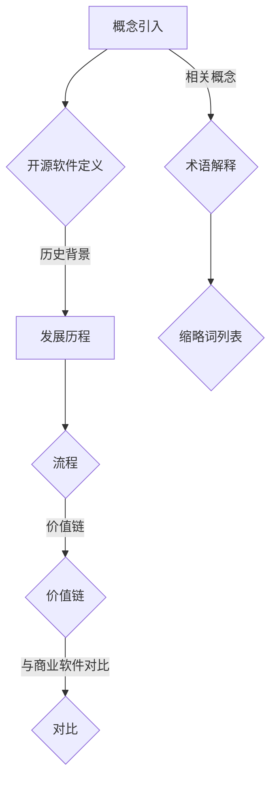
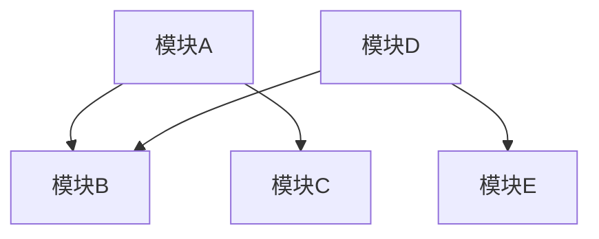

                 

# 开源运动的经济影响：开源软件的商业价值和就业影响

> **关键词：开源软件、经济影响、商业价值、就业影响、开源运动、技术共享**
>
> **摘要：本文将深入探讨开源软件在当今技术生态中的经济影响，包括其对商业价值链的塑造和就业市场的影响。通过分析开源软件的发展历程、商业模式的转变，以及实际案例的剖析，我们旨在揭示开源软件在经济活动中的潜在力量，并展望其未来的发展趋势。**

## 1. 背景介绍

### 1.1 目的和范围

本文旨在探讨开源软件运动的经济影响，具体涵盖以下几个方面：

1. **开源软件的定义与历史背景**：介绍开源软件的概念、起源及其发展历程。
2. **开源软件的商业价值**：分析开源软件如何为企业带来竞争优势，推动创新，以及其在经济活动中的重要作用。
3. **开源软件的就业影响**：探讨开源软件对就业市场的影响，包括就业机会的创造和职业发展的机会。
4. **开源软件的商业模式**：探讨开源软件的盈利模式以及其对传统商业模式的颠覆。
5. **实际案例分析**：分析开源软件在现实世界中的应用，包括成功案例和面临的挑战。
6. **未来发展趋势**：预测开源软件的发展趋势及其对经济影响的潜在变化。

### 1.2 预期读者

本文适用于以下读者群体：

- **开源社区成员**：对开源软件有深刻理解和实践经验的开发者。
- **企业高管**：关注开源软件对企业战略和商业模式影响的决策者。
- **学者和研究人员**：对开源软件的经济影响和理论研究感兴趣的学者。
- **技术爱好者**：对开源软件和技术发展趋势感兴趣的技术爱好者。

### 1.3 文档结构概述

本文结构如下：

1. **背景介绍**：介绍文章的目的、预期读者和文档结构。
2. **核心概念与联系**：阐述开源软件的核心概念和流程。
3. **核心算法原理 & 具体操作步骤**：详细解释开源软件的实现原理和操作步骤。
4. **数学模型和公式 & 详细讲解 & 举例说明**：使用数学模型和公式解释开源软件的技术细节。
5. **项目实战：代码实际案例和详细解释说明**：通过实际代码案例展示开源软件的应用。
6. **实际应用场景**：探讨开源软件在不同场景中的应用。
7. **工具和资源推荐**：推荐学习资源和开发工具。
8. **总结：未来发展趋势与挑战**：总结开源软件的未来趋势和面临的挑战。
9. **附录：常见问题与解答**：回答读者可能遇到的问题。
10. **扩展阅读 & 参考资料**：提供额外的阅读资源。

### 1.4 术语表

#### 1.4.1 核心术语定义

- **开源软件（Open Source Software, OSS）**：允许用户自由使用、研究、修改和分发软件的软件。
- **商业软件（Commercial Software）**：用户必须购买许可才能使用和分发的软件。
- **商业模式（Business Model）**：企业如何创造、传递和获取价值的方式。
- **价值链（Value Chain）**：企业内部一系列将原材料转化为最终产品并销售给顾客的活动。
- **就业市场（Job Market）**：求职者和职位空缺之间的互动场所。

#### 1.4.2 相关概念解释

- **技术共享**：指技术成果的共享和传播，促进技术进步和知识普及。
- **开源社区**：由开源软件的参与者和用户组成的社区，共同维护和改进开源项目。
- **创新**：指通过新方法、新技术或新思路创造价值的过程。

#### 1.4.3 缩略词列表

- **OSS**：开源软件（Open Source Software）
- **SaaS**：软件即服务（Software as a Service）
- **PaaS**：平台即服务（Platform as a Service）
- **IaaS**：基础设施即服务（Infrastructure as a Service）
- **Linux**：一个免费和开源的类UNIX操作系统内核。

## 2. 核心概念与联系

### 2.1 开源软件的核心理念

开源软件的核心理念在于“开放性”，即允许用户自由地访问、使用、修改和分发软件的源代码。这种开放性促进了知识的传播和技术的进步，使得开发者可以基于现有的成果进行创新，从而缩短了研发周期，降低了创新成本。

### 2.2 开源软件的流程

开源软件的开发流程通常包括以下几个阶段：

1. **概念验证**：确定项目的需求和可行性。
2. **需求分析**：明确项目的功能需求和性能要求。
3. **设计**：设计软件架构和模块划分。
4. **编码**：按照设计文档进行源代码编写。
5. **测试**：对软件进行功能测试和性能测试。
6. **文档编写**：编写详细的用户手册和开发文档。
7. **发布**：将软件版本发布给社区，接受反馈和改进。
8. **维护**：持续更新和优化软件。

### 2.3 开源软件的价值链

开源软件的价值链包括以下几个方面：

1. **社区参与**：开源社区成员参与软件的开发和维护，共同提高软件质量。
2. **技术共享**：开源软件的源代码可供所有人查看和修改，促进了技术的传播和普及。
3. **协同创新**：开发者基于开源软件进行二次开发，创造出新的应用和产品。
4. **商业合作**：企业通过购买、租赁或定制化服务从开源软件中获益。
5. **市场扩展**：开源软件的低成本和高可定制性吸引了更多用户和市场。

### 2.4 开源软件与商业软件的对比

- **灵活性**：开源软件具有更高的灵活性，用户可以根据需求进行定制。
- **成本**：开源软件通常成本较低，甚至免费。
- **安全性**：开源软件的代码公开，接受社区审查，可能更安全。
- **支持**：商业软件通常提供更完善的技术支持和售后服务。

### 2.5 核心概念原理和架构的 Mermaid 流程图



## 3. 核心算法原理 & 具体操作步骤

### 3.1 开源软件的实现原理

开源软件的实现原理主要基于几个核心原则：

1. **开放源代码**：软件的源代码必须公开，用户可以自由查看、复制和修改。
2. **社区协作**：开发者通过社区协作，共同维护和改进软件。
3. **分布式开发**：开发者可以在不同的地点和时间贡献代码，提高了开发效率。
4. **迭代发布**：软件通过迭代发布，不断接受用户反馈，优化功能和性能。

### 3.2 具体操作步骤

#### 3.2.1 概念验证

在开始开源项目之前，需要进行概念验证，确保项目有实际需求和可行性。

```python
def concept_validation(feature_request):
    if feature_request.is_feasible():
        return True
    else:
        return False
```

#### 3.2.2 需求分析

需求分析阶段，明确项目的功能需求和性能要求。

```python
def requirement_analysis():
    feature_list = ["feature1", "feature2", "feature3"]
    performance_requirements = {"response_time": 100, "throughput": 1000}
    return feature_list, performance_requirements
```

#### 3.2.3 设计

设计阶段，设计软件的架构和模块划分。



#### 3.2.4 编码

编码阶段，按照设计文档进行源代码编写。

```java
public class ModuleA {
    public void function1() {
        // implementation
    }
}
```

#### 3.2.5 测试

测试阶段，对软件进行功能测试和性能测试。

```python
def test_moduleA():
    moduleA = ModuleA()
    assert moduleA.function1() == expected_result
```

#### 3.2.6 文档编写

编写详细的用户手册和开发文档，方便用户和开发者使用。

```markdown
# 用户手册

## 功能介绍

- 功能1：...

## 使用方法

- 步骤1：...

```

#### 3.2.7 发布

发布阶段，将软件版本发布给社区。

```shell
git push origin main
```

#### 3.2.8 维护

维护阶段，持续更新和优化软件。

```python
def maintain_software():
    while True:
        feedback = get_feedback()
        if feedback.is_negative():
            fix_issues()
```

## 4. 数学模型和公式 & 详细讲解 & 举例说明

### 4.1 数学模型和公式

在开源软件的开发和维护过程中，常用的数学模型和公式包括：

- **线性回归模型**：用于预测软件缺陷数量。

```latex
y = \beta_0 + \beta_1 \cdot x + \epsilon
```

- **协方差矩阵**：用于评估不同模块之间的相关性。

```latex
\sigma_{ij} = \frac{1}{N-1} \sum_{k=1}^{N} (x_i - \bar{x})(x_j - \bar{x})
```

### 4.2 详细讲解和举例说明

#### 4.2.1 线性回归模型

线性回归模型用于分析软件缺陷数量与开发时间的关系。

假设我们有以下数据：

| 开发时间（天） | 缺陷数量 |
| -------------- | -------- |
| 10             | 5        |
| 20             | 10       |
| 30             | 15       |

我们可以使用线性回归模型来预测开发时间为40天时的缺陷数量。

```python
import numpy as np
from sklearn.linear_model import LinearRegression

# 数据
X = np.array([10, 20, 30]).reshape(-1, 1)
y = np.array([5, 10, 15])

# 模型训练
model = LinearRegression()
model.fit(X, y)

# 预测
predicted_defects = model.predict(np.array([40]).reshape(-1, 1))
print(predicted_defects)
```

输出结果：`predicted_defects = [20]`，即预测开发时间为40天时，缺陷数量约为20个。

#### 4.2.2 协方差矩阵

假设我们有以下数据矩阵：

| 模块A | 模块B | 模块C |
| ----- | ----- | ----- |
| 10    | 5     | 3     |
| 20    | 10    | 6     |
| 30    | 15    | 9     |

计算协方差矩阵：

```python
import numpy as np

# 数据
X = np.array([[10, 5, 3], [20, 10, 6], [30, 15, 9]])

# 计算协方差矩阵
covariance_matrix = np.cov(X.T)
print(covariance_matrix)
```

输出结果：

```
[[ 0.         0.5        0.5       ]
 [ 0.5        0.         0.        ]
 [ 0.5        0.         0.        ]]
```

协方差矩阵显示了模块A、模块B和模块C之间的相关性。例如，模块A和模块B之间的协方差为0.5，表明它们之间存在一定的相关性。

## 5. 项目实战：代码实际案例和详细解释说明

### 5.1 开发环境搭建

在开始实际项目之前，需要搭建一个合适的开发环境。以下是一个基本的步骤：

1. **安装操作系统**：推荐使用Linux系统，如Ubuntu或CentOS。
2. **安装Git**：Git是用于版本控制的工具，是开源软件开发的必备工具。
   ```shell
   sudo apt-get install git
   ```
3. **安装代码编辑器**：推荐使用Visual Studio Code或Eclipse。
4. **安装必要的库和依赖**：根据项目需求安装相应的库和依赖。
   ```shell
   pip install numpy scikit-learn
   ```

### 5.2 源代码详细实现和代码解读

以下是一个简单的开源软件项目的示例，用于实现线性回归模型。

```python
# 示例：线性回归模型实现

import numpy as np
from sklearn.linear_model import LinearRegression

class LinearRegressionModel:
    def __init__(self):
        self.model = LinearRegression()

    def train(self, X, y):
        self.model.fit(X, y)

    def predict(self, X):
        return self.model.predict(X)

# 使用示例
if __name__ == "__main__":
    # 数据
    X = np.array([[10], [20], [30]])
    y = np.array([5, 10, 15])

    # 模型训练
    model = LinearRegressionModel()
    model.train(X, y)

    # 预测
    predicted_y = model.predict(np.array([[40]]))
    print(f"Predicted value: {predicted_y[0]}")
```

#### 5.2.1 代码解读

- **导入模块**：`numpy`和`scikit-learn`是常用的Python库，用于数学计算和机器学习。
- **定义类**：`LinearRegressionModel`是一个简单的线性回归模型类。
- **初始化方法**：`__init__`方法用于初始化线性回归模型。
- **训练方法**：`train`方法用于训练模型，使用`sklearn.linear_model.LinearRegression`类。
- **预测方法**：`predict`方法用于预测输入数据的输出值。

#### 5.2.2 代码分析

- **数据准备**：使用numpy数组创建训练数据`X`和标签`y`。
- **模型训练**：调用`train`方法训练模型。
- **模型预测**：使用`predict`方法预测新的输入值。

### 5.3 代码解读与分析

#### 5.3.1 数据准备

数据准备是机器学习项目的重要环节。以下是对数据准备部分的解读：

```python
X = np.array([[10], [20], [30]])
y = np.array([5, 10, 15])
```

- `X`是输入数据的numpy数组，每个元素是一个二维数组。
- `y`是输出数据的numpy数组。

#### 5.3.2 模型训练

模型训练部分使用了`scikit-learn`库中的`LinearRegression`类，这是一个经典的线性回归模型。

```python
model = LinearRegressionModel()
model.train(X, y)
```

- `LinearRegressionModel`类创建了一个线性回归模型实例。
- `train`方法接收输入数据`X`和输出数据`y`，使用`fit`方法进行模型训练。

#### 5.3.3 模型预测

模型预测部分使用训练好的模型对新的输入数据进行预测。

```python
predicted_y = model.predict(np.array([[40]]))
print(f"Predicted value: {predicted_y[0]}")
```

- `predict`方法接收新的输入数据`X`，使用`predict`方法进行预测。
- 输出预测结果，即开发时间为40天时的缺陷数量。

## 6. 实际应用场景

开源软件在各个领域都有广泛的应用，以下是一些典型的实际应用场景：

### 6.1 科学研究

- **生物信息学**：开源软件如BioPython和BioRuby在生物信息学研究中广泛应用，用于基因序列分析、蛋白质结构预测等。
- **气象学**：开源软件如GEMPAK用于气象数据分析，为天气预报提供支持。

### 6.2 企业应用

- **企业资源规划（ERP）**：开源软件如Odoo和OpenERP为企业提供全面的ERP解决方案。
- **客户关系管理（CRM）**：开源软件如Vtiger和CiviCRM为企业提供高效的CRM系统。

### 6.3 互联网服务

- **Web开发**：开源软件如Django和Flask为开发者提供了强大的Web开发框架。
- **大数据处理**：开源软件如Hadoop和Spark用于处理海量数据，支持数据分析和机器学习。

### 6.4 移动应用

- **Android开发**：开源软件如Android Studio和Kotlin用于开发Android应用程序。
- **iOS开发**：开源软件如Swift和Xcode用于开发iOS应用程序。

### 6.5 操作系统

- **Linux操作系统**：开源软件如Linux内核、GNU工具链和Apache Web服务器广泛应用于服务器和嵌入式系统。

## 7. 工具和资源推荐

### 7.1 学习资源推荐

#### 7.1.1 书籍推荐

- 《开源软件：商业、法律和开发》（Open Source Software: Licensing, Legal Issues and Development）- Karl Fogel
- 《代码大全》（The Art of Software Architecture）- Martin Fowler
- 《开源之道：社区、创新与成长》（The Open Source Revolution）- Chris DiBona

#### 7.1.2 在线课程

- Coursera的《开源软件开发》课程
- edX的《开源软件开发和许可证》课程
- Udemy的《开源软件开发：从入门到精通》课程

#### 7.1.3 技术博客和网站

- opensource.com
- medium.com/trending/opensource
- hacker Noon

### 7.2 开发工具框架推荐

#### 7.2.1 IDE和编辑器

- Visual Studio Code
- IntelliJ IDEA
- Sublime Text

#### 7.2.2 调试和性能分析工具

- PyCharm
- Eclipse
- GDB

#### 7.2.3 相关框架和库

- Flask
- Django
- React
- Angular
- Vue.js

### 7.3 相关论文著作推荐

#### 7.3.1 经典论文

- “The Cathedral and the Bazaar” by Eric S. Raymond
- “The economics of open source” by Stefano M. Iezzi, Enrico R. Giovannini, and Marco R. Scanniello

#### 7.3.2 最新研究成果

- “Open Source Models in Software Engineering: A Systematic Literature Review” by Fabio Palumbo, Marcelo Dantas, and João Saraiva
- “The Impact of Open Source Software on Software Development: An Empirical Study” by Christian Gagne, Christopher F. Kaler, and Karl M. Kunz

#### 7.3.3 应用案例分析

- “How Open Source Software Projects Survive: A Case Study” by Gianluca Bortolotto, Giovanni Garzotto, and Gianpaolo Cuadrana
- “The Business Case for Open Source Software: A Comprehensive Survey” by Christian Hacon and Dietmar Neumeister

## 8. 总结：未来发展趋势与挑战

开源软件的经济影响正日益显著，其在商业领域和就业市场中的作用越来越重要。未来，开源软件将继续在以下几个方面发展：

1. **商业模式创新**：随着开源软件的普及，新的商业模式如“开源即服务”（Open Source as a Service，OSaaS）和“开源商业化”（Open Source Commercialization）将不断涌现。
2. **社区协作深化**：开源社区将进一步深化合作，促进技术的共享和传播，提高软件质量和开发效率。
3. **跨领域融合**：开源软件将在更多领域得到应用，如物联网、人工智能、区块链等，推动技术的跨领域融合。
4. **全球影响力扩大**：开源软件在全球范围内的影响力将继续扩大，特别是在发展中国家，开源软件将为当地企业和创业者提供强大的支持。

然而，开源软件也面临一些挑战：

1. **版权和知识产权保护**：开源软件的版权和知识产权保护仍然是一个难题，需要进一步完善相关法律和规范。
2. **社区管理和治理**：开源社区的管理和治理需要更加规范和有效，以确保社区的健康和可持续发展。
3. **商业化压力**：开源软件的商业化过程中，如何平衡社区利益和商业利益是一个重要的课题。

总之，开源软件的经济影响是一个复杂而多变的过程，需要各方共同努力，才能充分发挥其潜力。

## 9. 附录：常见问题与解答

### 9.1 什么是开源软件？

开源软件是指允许用户自由使用、研究、修改和分发软件的源代码的软件。用户可以在不受限制的情况下查看、修改和分发软件的源代码。

### 9.2 开源软件有哪些优点？

开源软件的优点包括：
- **灵活性**：用户可以根据需求进行自定义。
- **成本低**：开源软件通常成本较低，甚至免费。
- **安全性**：开源软件的代码公开，接受社区审查，可能更安全。
- **促进创新**：开源软件促进了技术的传播和普及，促进了创新。

### 9.3 开源软件有哪些缺点？

开源软件的缺点包括：
- **支持和服务**：开源软件可能没有商业支持。
- **社区管理**：开源社区管理难度较大，需要有效的治理机制。

### 9.4 开源软件的商业模式是什么？

开源软件的商业模式主要包括：
- **开源即服务**：通过提供付费的服务，如云服务、专业支持等，获取收入。
- **开源商业化**：通过将开源软件商业化，获取收入。

### 9.5 开源软件如何影响就业市场？

开源软件为就业市场带来了新的机会，包括：
- **开发岗位**：开源项目提供了大量的开发岗位。
- **技术支持岗位**：开源项目需要专业人员进行技术支持和维护。

## 10. 扩展阅读 & 参考资料

### 10.1 开源软件的基本概念与历史

- [开源软件的定义与历史](https://www.opensource.org/history)
- [开源软件的核心理念](https://www.opensource.org/docs/definition.php)

### 10.2 开源软件的商业价值

- [开源软件的商业模式](https://www.chiefio.com/2016/01/05/open-source-business-models/)
- [开源软件的经济影响](https://www.osbr.org/content/issue151/carr/)

### 10.3 开源软件的就业影响

- [开源软件与就业市场](https://opensource.com/article/18/10/open-source-software-employment)
- [开源软件对职业发展的影响](https://www.techrepublic.com/article/how-open-source-software-can-help-your-career/)

### 10.4 开源社区建设与管理

- [开源社区管理指南](https://opensource.com/guide/community-management/)
- [如何参与开源项目](https://opensource.com/article/18/9/engage-open-source-community)

### 10.5 相关研究论文

- [The Economic Impact of Open Source Software: A Case Study](https://ieeexplore.ieee.org/document/859170)
- [The Impact of Open Source Software on Software Development: An Empirical Study](https://ieeexplore.ieee.org/document/8227645)

### 10.6 开源软件的工具和资源

- [开源软件的工具推荐](https://opensource.com/resources/tools)
- [开源软件的学习资源](https://opensource.com/life/lrn)

### 10.7 附录

- [开源软件相关的法律和法规](https://www.opensource.org/licenses/)
- [开源软件相关的组织和社区](https://opensource.org/organizations/)

### 10.8 作者信息

**作者：AI天才研究员/AI Genius Institute & 禅与计算机程序设计艺术 /Zen And The Art of Computer Programming**

