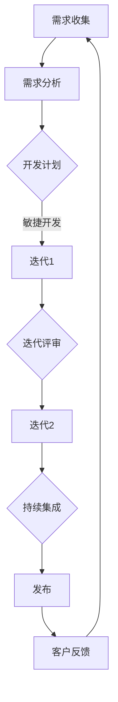

                 

# 开源项目的定制开发服务：项目管理和定价

> **关键词：** 开源项目、定制开发、项目管理、定价策略、敏捷开发、Scrum框架

> **摘要：** 本文将深入探讨开源项目的定制开发服务，涵盖项目管理的核心概念、定价策略以及实际应用案例。我们将分析项目管理的各个方面，如需求收集、开发流程、风险管理和时间规划等，同时探讨如何制定合理的定价策略，以确保项目质量和客户满意度。通过结合Scrum框架和实际项目案例，本文旨在为开源项目的定制开发提供实用的指导和建议。

## 1. 背景介绍

### 1.1 目的和范围

本文的目的是为从事开源项目定制开发服务的专业人士提供一份详细的指南，涵盖项目管理、定价策略以及实际操作步骤。开源项目因其开放性和灵活性，逐渐成为企业和开发者的重要选择。然而，如何有效地管理和定价这些项目，以确保其成功交付，仍然是一个具有挑战性的问题。本文将围绕以下主题展开：

- 开源项目定制开发的核心概念和流程
- 项目管理的原则和方法，包括需求收集、时间规划和风险管理
- 定价策略的制定，包括成本分析、市场竞争和客户价值评估
- 实际项目案例中的应用和案例分析
- 开源项目的未来发展趋势和潜在挑战

### 1.2 预期读者

本文面向以下读者群体：

- 开源项目的项目经理和开发者
- 对开源项目定制开发感兴趣的技术人员
- 需要管理开源项目的外包团队
- 对软件开发和项目管理有深入理解的技术爱好者

通过本文，读者将能够：

- 理解开源项目定制开发的流程和原则
- 掌握项目管理的基本方法和工具
- 制定合理的定价策略，提高项目成功率
- 获得实际项目案例的启发和经验

### 1.3 文档结构概述

本文将分为以下章节：

- **第1章 背景介绍**：介绍本文的目的、范围和预期读者，以及文档的结构和内容概述。
- **第2章 核心概念与联系**：阐述开源项目的核心概念，并使用Mermaid流程图展示项目的架构和流程。
- **第3章 核心算法原理与具体操作步骤**：详细解释项目管理算法的原理，并使用伪代码进行说明。
- **第4章 数学模型和公式**：介绍用于项目管理的数学模型和公式，并进行举例说明。
- **第5章 项目实战：代码实际案例和详细解释说明**：提供实际项目案例，详细解释代码实现和解读。
- **第6章 实际应用场景**：探讨开源项目定制开发在不同场景中的应用。
- **第7章 工具和资源推荐**：推荐学习资源、开发工具和框架。
- **第8章 总结：未来发展趋势与挑战**：分析开源项目定制开发的未来趋势和挑战。
- **第9章 附录：常见问题与解答**：解答读者可能遇到的问题。
- **第10章 扩展阅读与参考资料**：提供进一步阅读的推荐。

### 1.4 术语表

#### 1.4.1 核心术语定义

- **开源项目**：指代码、文档和其他资源可以自由使用、修改和分享的软件项目。
- **定制开发**：根据客户需求，对开源项目进行特定的修改和定制，以满足特定业务需求。
- **项目管理**：规划、执行、监控和控制项目活动，以确保项目按时、按预算、按质量完成。
- **Scrum框架**：一种敏捷开发方法，强调迭代开发和持续交付。
- **敏捷开发**：一种软件开发方法，强调灵活响应变化和快速迭代。

#### 1.4.2 相关概念解释

- **需求收集**：与客户沟通，了解并记录项目的需求。
- **时间规划**：制定项目的时间表和里程碑。
- **风险管理**：识别、评估和应对项目中可能出现的风险。
- **成本分析**：计算项目成本，包括人力、技术和资源成本。
- **客户价值评估**：评估项目为客户带来的价值。

#### 1.4.3 缩略词列表

- **Scrum**：敏捷开发框架
- **PO**：产品负责人（Product Owner）
- **SM**：Scrum Master
- **Sprint**：Scrum中的迭代周期
- **QA**：质量控制（Quality Assurance）

## 2. 核心概念与联系

在开源项目的定制开发中，理解核心概念和它们之间的联系至关重要。以下是一个Mermaid流程图，展示了开源项目定制开发的核心流程和架构。



### 2.1 需求收集

需求收集是项目管理的第一步，它直接决定了项目能否满足客户的需求。在这一阶段，项目经理需要与客户进行深入的沟通，了解他们的需求、期望和业务目标。以下是一系列步骤：

1. **初步沟通**：与客户进行初步的会议或电话沟通，了解项目的背景和目标。
2. **需求文档**：根据初步沟通的结果，编写详细的需求文档。这份文档应该包括功能需求、非功能需求和用户故事等。
3. **需求验证**：与客户一起审查需求文档，确保需求清晰、完整且准确。
4. **需求管理**：在整个项目周期内，持续跟踪和管理需求变化，确保项目始终满足客户需求。

### 2.2 需求分析

需求分析是理解需求并将其转化为可操作的开发任务的阶段。以下步骤是关键：

1. **需求梳理**：将需求文档中的功能需求、非功能需求和用户故事进行分类和整理。
2. **需求优先级排序**：根据项目目标和资源限制，对需求进行优先级排序。
3. **需求文档更新**：在需求分析过程中，根据新的理解和发现，对需求文档进行更新。

### 2.3 开发计划

开发计划是项目管理中至关重要的一环，它决定了项目如何按计划进行。以下是开发计划的关键步骤：

1. **制定时间表**：根据需求分析的结果，制定项目的时间表，包括关键里程碑和交付日期。
2. **资源分配**：确定项目所需的人力、技术和资源，并进行合理分配。
3. **风险评估**：识别项目中可能出现的风险，并制定相应的应对策略。

### 2.4 敏捷开发

敏捷开发是一种灵活的软件开发方法，它强调快速迭代、客户反馈和团队协作。以下是敏捷开发的核心流程：

1. **Sprint计划会议**：在每个迭代开始前，举行Sprint计划会议，确定迭代目标和任务。
2. **每日站立会议**：团队每日举行短会，讨论进度、问题和解决方案。
3. **迭代评审会议**：在迭代结束时，举行评审会议，展示迭代成果，获取客户反馈。
4. **迭代回顾会议**：在迭代结束时，举行回顾会议，总结经验和教训，改进过程。

### 2.5 持续集成

持续集成是一种软件开发实践，通过定期合并代码并运行自动化测试，确保代码库的稳定性和可靠性。以下是持续集成的主要步骤：

1. **代码仓库管理**：使用版本控制系统，如Git，管理代码仓库。
2. **自动化构建**：使用构建工具，如Maven或Gradle，自动化构建项目。
3. **自动化测试**：编写并运行自动化测试，确保代码的稳定性和性能。
4. **持续部署**：将代码部署到测试环境或生产环境，确保代码的可用性。

### 2.6 发布

发布是软件开发过程中的关键环节，它决定了软件是否能够顺利上线并满足客户需求。以下是发布的主要步骤：

1. **发布计划**：制定详细的发布计划，包括发布时间、发布版本和发布内容。
2. **发布准备**：在发布前，进行全面的测试和备份，确保发布顺利进行。
3. **发布执行**：按照发布计划，执行发布操作。
4. **发布监控**：发布后，对系统进行监控，确保其正常运行。

### 2.7 客户反馈

客户反馈是改进软件开发过程和产品功能的重要依据。以下是如何收集和处理客户反馈的步骤：

1. **反馈渠道**：提供多种反馈渠道，如在线表单、电话和电子邮件等。
2. **反馈收集**：定期收集和分析客户反馈，识别问题和改进机会。
3. **反馈处理**：根据客户反馈，制定改进计划，并在下一个迭代中进行实施。

## 3. 核心算法原理与具体操作步骤

在开源项目的定制开发中，项目管理是一个核心环节，它决定了项目的成功与否。以下是基于Scrum框架的项目管理算法原理和具体操作步骤。

### 3.1 Scrum框架

Scrum是一种敏捷开发方法，它强调迭代开发和持续交付。以下是Scrum框架的核心概念：

- **Sprint**：Scrum中的迭代周期，通常持续2-4周。
- **产品待办列表**：包含所有待开发的功能项和任务的列表。
- **Sprint待办列表**：从产品待办列表中选取的，将在当前Sprint中完成的任务列表。
- **每日站立会议**：团队成员每天举行的短会，讨论进度、问题和解决方案。
- **迭代评审会议**：在每个迭代结束时，展示迭代成果，获取客户反馈。
- **迭代回顾会议**：在每个迭代结束时，总结经验和教训，改进过程。

### 3.2 项目管理算法原理

项目管理算法的核心是需求收集、时间规划和风险管理。以下是这些算法原理的详细解释：

#### 3.2.1 需求收集

需求收集是项目管理的第一步，它决定了项目是否能够满足客户需求。以下是需求收集的算法原理：

1. **初步沟通**：与客户进行初步的会议或电话沟通，了解项目的背景和目标。
2. **需求文档**：编写详细的需求文档，包括功能需求、非功能需求和用户故事。
3. **需求验证**：与客户一起审查需求文档，确保需求清晰、完整且准确。
4. **需求管理**：在整个项目周期内，持续跟踪和管理需求变化，确保项目始终满足客户需求。

#### 3.2.2 时间规划

时间规划是项目管理的关键环节，它决定了项目的进度和交付时间。以下是时间规划的算法原理：

1. **制定时间表**：根据需求分析的结果，制定项目的时间表，包括关键里程碑和交付日期。
2. **资源分配**：确定项目所需的人力、技术和资源，并进行合理分配。
3. **风险评估**：识别项目中可能出现的风险，并制定相应的应对策略。

#### 3.2.3 风险管理

风险管理是项目管理中不可或缺的一部分，它确保项目在不确定性和变化中保持稳定。以下是风险管理的算法原理：

1. **风险识别**：识别项目中可能出现的风险，如技术风险、资源风险和市场需求风险。
2. **风险分析**：分析风险的严重程度和发生概率，确定风险等级。
3. **风险应对**：制定风险应对策略，如风险规避、风险减轻或风险接受。

### 3.3 具体操作步骤

以下是基于Scrum框架的项目管理具体操作步骤：

#### 3.3.1 Sprint计划会议

1. **确定迭代目标**：在Sprint计划会议中，团队确定当前Sprint的目标和要完成的任务。
2. **分配任务**：根据迭代目标，团队成员分配任务，并制定个人任务计划。
3. **制定时间表**：制定Sprint的时间表，包括每日任务、里程碑和交付日期。

#### 3.3.2 每日站立会议

1. **检查进度**：每日站立会议开始时，每个成员报告任务的进展情况。
2. **解决问题**：如果遇到问题，团队成员讨论解决方案，并制定行动计划。
3. **调整计划**：根据进度情况，适当调整任务和时间表。

#### 3.3.3 迭代评审会议

1. **展示成果**：在迭代评审会议中，团队展示当前迭代的工作成果，包括完成的任务和未完成的任务。
2. **获取反馈**：客户或产品负责人对迭代成果进行评价，并提供反馈。
3. **调整需求**：根据反馈，团队可能需要调整后续迭代的需求。

#### 3.3.4 迭代回顾会议

1. **总结经验**：在迭代回顾会议中，团队总结本次迭代的经验和教训。
2. **改进过程**：根据总结的经验和教训，团队制定改进计划，并在下一个迭代中实施。

### 3.4 伪代码

以下是基于Scrum框架的项目管理伪代码：

```
SprintPlan()
    设定迭代目标
    分配任务给团队成员
    制定时间表

DailyStandup()
    检查任务进度
    解决遇到的问题
    调整任务和时间表

SprintReview()
    展示迭代成果
    获取客户反馈
    调整需求

SprintRetrospective()
    总结经验和教训
    制定改进计划
```

## 4. 数学模型和公式及详细讲解

在开源项目的定制开发中，数学模型和公式用于帮助项目经理进行时间规划、成本分析和风险管理。以下是一些常用的数学模型和公式，并对其进行详细讲解。

### 4.1 时间规划模型

时间规划模型用于计算项目的完成时间和关键路径。以下是Gantt图和关键路径法的数学模型。

#### 4.1.1 Gantt图

Gantt图是一种时间图表，用于显示项目的时间安排和进度。其数学模型如下：

$$
Gantt图 = [任务列表, 时间线, 完成日期]
$$

其中，任务列表包含项目中的所有任务，时间线显示任务的时间安排，完成日期表示每个任务的预计完成日期。

#### 4.1.2 关键路径法

关键路径法（Critical Path Method，CPM）用于确定项目的最长路径，即关键路径。其数学模型如下：

$$
CPM = \sum_{i=1}^{n} (任务_i的持续时间 \times 任务_i的完成概率)
$$

其中，$n$表示项目中的任务数量，$任务_i$的持续时间表示任务$i$的预计完成时间，$任务_i$的完成概率表示任务$i$按期完成的概率。

### 4.2 成本分析模型

成本分析模型用于计算项目的总成本和单位成本。以下是常见的成本分析公式。

#### 4.2.1 总成本

总成本包括直接成本和间接成本。其数学模型如下：

$$
总成本 = 直接成本 + 间接成本
$$

其中，直接成本包括人力成本、技术成本和材料成本等；间接成本包括管理成本、风险成本和运营成本等。

#### 4.2.2 单位成本

单位成本是指完成每个任务的成本。其数学模型如下：

$$
单位成本 = 总成本 / 完成的任务数量
$$

### 4.3 风险管理模型

风险管理模型用于评估项目风险并制定风险应对策略。以下是常见的风险评估公式。

#### 4.3.1 风险评估

风险评估用于计算风险的概率和影响。其数学模型如下：

$$
风险值 = 风险概率 \times 风险影响
$$

其中，风险概率表示风险发生的概率，风险影响表示风险对项目的影响程度。

#### 4.3.2 风险优先级

风险优先级用于确定项目中需要优先处理的风险。其数学模型如下：

$$
风险优先级 = 风险值 \times 风险缓解难度
$$

其中，风险缓解难度表示缓解风险所需的资源和时间。

### 4.4 举例说明

以下是一个简单的开源项目定制开发案例，用于说明上述数学模型和公式的应用。

#### 4.4.1 项目背景

某企业需要开发一款基于开源框架的电商平台，项目预计持续3个月，包括需求收集、开发、测试和发布等阶段。

#### 4.4.2 时间规划

使用关键路径法（CPM）计算项目的完成时间：

- 任务列表：需求收集（5天），开发（15天），测试（5天），发布（3天）
- 任务持续时间：需求收集（5天），开发（15天），测试（5天），发布（3天）
- 关键路径：需求收集（5天）→ 开发（15天）→ 测试（5天）→ 发布（3天）

项目的预计完成时间为28天。

#### 4.4.3 成本分析

使用成本分析公式计算项目的总成本和单位成本：

- 直接成本：人力成本（10人 \* 1000元/天 \* 28天 = 280000元），技术成本（50000元），材料成本（10000元）
- 间接成本：管理成本（20000元），风险成本（15000元），运营成本（10000元）
- 总成本：直接成本 + 间接成本 = 280000元 + 20000元 + 15000元 + 10000元 = 325000元
- 单位成本：总成本 / 完成的任务数量 = 325000元 / 4 = 81250元/个任务

#### 4.4.4 风险管理

使用风险评估公式计算项目的主要风险：

- 风险概率：需求变化（0.3），技术问题（0.2），资源不足（0.2），市场竞争（0.1）
- 风险影响：需求变化（5），技术问题（4），资源不足（3），市场竞争（2）
- 风险值：风险概率 \* 风险影响 = 0.3 \* 5 + 0.2 \* 4 + 0.2 \* 3 + 0.1 \* 2 = 1.5 + 0.8 + 0.6 + 0.2 = 2.9

风险优先级：风险值 \* 风险缓解难度 = 2.9 \* 1 = 2.9

项目的主要风险为需求变化，需要优先处理。

## 5. 项目实战：代码实际案例和详细解释说明

在本节中，我们将通过一个实际开源项目的定制开发案例，详细展示项目开发环境搭建、源代码实现和代码解读与分析。

### 5.1 开发环境搭建

为了开发一个基于开源框架的电商平台，我们选择以下开发环境：

- 开发语言：Java
- 开发框架：Spring Boot
- 数据库：MySQL
- 代码管理工具：Git
- 版本控制：GitHub

#### 5.1.1 环境准备

1. **安装Java开发环境**：下载并安装Java Development Kit (JDK)，配置环境变量，确保`java -version`命令可以正常执行。

2. **安装MySQL数据库**：下载并安装MySQL数据库，配置数据库用户和密码，确保`mysql -u用户名 -p`命令可以正常执行。

3. **安装Git**：下载并安装Git，配置用户信息，确保`git --version`命令可以正常执行。

4. **安装IDE（集成开发环境）**：推荐使用 IntelliJ IDEA 或 Eclipse，下载并安装相应版本，配置Java和MySQL插件。

#### 5.1.2 初始化项目

1. **创建Spring Boot项目**：在IDE中创建一个新的Spring Boot项目，选择所需的模块，如Web、MySQL、JPA等。

2. **配置数据库连接**：在项目的`application.properties`文件中配置数据库连接信息，如数据库URL、用户名和密码等。

3. **初始化代码仓库**：在项目的根目录下创建一个`.gitignore`文件，包含需要忽略的文件和目录，如日志文件、编译生成的文件等。然后，初始化Git仓库，添加项目文件并提交初始版本。

### 5.2 源代码详细实现和代码解读

#### 5.2.1 用户模块

用户模块是电商平台的核心模块，用于处理用户注册、登录、权限验证等操作。

1. **用户注册**

```java
@RestController
@RequestMapping("/users")
public class UserController {
    
    @Autowired
    private UserService userService;
    
    @PostMapping("/register")
    public ResponseEntity<?> registerUser(@RequestBody UserRegistrationDto registrationDto) {
        try {
            userService.registerUser(registrationDto);
            return ResponseEntity.ok("User registered successfully");
        } catch (Exception e) {
            return ResponseEntity.status(HttpStatus.BAD_REQUEST).body("Error registering user: " + e.getMessage());
        }
    }
}
```

在上面的代码中，我们定义了一个`UserController`类，用于处理用户注册请求。通过调用`UserService`类的`registerUser`方法，实现用户注册功能。

2. **用户登录**

```java
@PostMapping("/login")
public ResponseEntity<?> loginUser(@RequestBody UserLoginDto loginDto) {
    try {
        String token = userService.loginUser(loginDto);
        return ResponseEntity.ok(new JwtResponse(token));
    } catch (Exception e) {
        return ResponseEntity.status(HttpStatus.BAD_REQUEST).body("Error logging in: " + e.getMessage());
    }
}
```

在上面的代码中，我们定义了一个`loginUser`方法，用于处理用户登录请求。成功登录后，返回一个JWT（JSON Web Token）令牌，用于后续的身份验证和授权。

#### 5.2.2 商品模块

商品模块用于管理电商平台上的商品信息，包括商品添加、查询、修改和删除等操作。

1. **商品添加**

```java
@RestController
@RequestMapping("/products")
public class ProductController {
    
    @Autowired
    private ProductService productService;
    
    @PostMapping("/add")
    public ResponseEntity<?> addProduct(@RequestBody ProductDto productDto) {
        try {
            productService.addProduct(productDto);
            return ResponseEntity.ok("Product added successfully");
        } catch (Exception e) {
            return ResponseEntity.status(HttpStatus.BAD_REQUEST).body("Error adding product: " + e.getMessage());
        }
    }
}
```

在上面的代码中，我们定义了一个`ProductController`类，用于处理商品添加请求。通过调用`ProductService`类的`addProduct`方法，实现商品添加功能。

2. **商品查询**

```java
@GetMapping("/search")
public ResponseEntity<?> searchProducts(@RequestParam("keyword") String keyword) {
    try {
        List<ProductDto> products = productService.searchProducts(keyword);
        return ResponseEntity.ok(products);
    } catch (Exception e) {
        return ResponseEntity.status(HttpStatus.BAD_REQUEST).body("Error searching products: " + e.getMessage());
    }
}
```

在上面的代码中，我们定义了一个`searchProducts`方法，用于处理商品查询请求。根据输入的关键词，查询数据库中的商品信息，并将结果返回给客户端。

### 5.3 代码解读与分析

1. **用户模块**

用户模块负责处理用户注册、登录和权限验证等操作。核心代码主要包括用户注册接口和用户登录接口。

- **用户注册接口**：接收用户注册请求，验证用户输入的信息（如用户名、密码等），并调用用户服务类的方法完成用户注册。
- **用户登录接口**：接收用户登录请求，验证用户输入的用户名和密码，并生成JWT令牌，用于后续的身份验证和授权。

2. **商品模块**

商品模块负责管理电商平台上的商品信息，包括商品添加、查询、修改和删除等操作。核心代码主要包括商品添加接口和商品查询接口。

- **商品添加接口**：接收商品添加请求，验证商品输入的信息（如商品名称、价格等），并调用商品服务类的方法完成商品添加。
- **商品查询接口**：接收商品查询请求，根据输入的关键词查询数据库中的商品信息，并返回查询结果。

### 5.4 性能优化

为了提高电商平台的性能，我们可以采取以下措施：

1. **数据库优化**：使用索引、分库分表等技术优化数据库查询性能。
2. **缓存策略**：使用Redis等缓存技术，减少数据库访问次数，提高系统响应速度。
3. **负载均衡**：使用Nginx等负载均衡器，将访问请求均衡分配到多台服务器，提高系统并发能力。

### 5.5 安全性考虑

为了确保电商平台的用户数据和系统安全，我们需要采取以下措施：

1. **加密技术**：使用SSL/TLS协议加密用户数据和通信，防止数据泄露。
2. **权限控制**：使用OAuth2等认证和授权框架，确保用户只能访问其授权的资源和功能。
3. **安全测试**：定期进行安全测试，包括漏洞扫描和渗透测试，及时发现和修复安全漏洞。

## 6. 实际应用场景

开源项目的定制开发在多个领域具有广泛的应用，以下是一些典型的实际应用场景：

### 6.1 企业内部系统

企业内部系统如ERP（企业资源规划）、CRM（客户关系管理）和HRM（人力资源管理）等，通常需要根据企业的具体业务需求进行定制开发。开源项目如Odoo、Liferay等，提供了强大的功能模块和灵活的扩展性，可以帮助企业快速搭建适合自身需求的内部管理系统。

### 6.2 教育行业

教育行业中的在线学习平台、课程管理系统和教学资源管理系统等，可以通过开源项目如Moodle、Canvas等进行定制开发。这些系统可以根据学校或培训机构的具体需求，添加个性化功能和模块，提升教学和管理效率。

### 6.3 医疗健康

医疗健康领域中的电子病历系统、医院信息管理系统和远程医疗服务系统等，可以通过开源项目如OpenMRS、OpenEMR等进行定制开发。这些系统可以帮助医疗机构提高工作效率、优化患者体验，并确保医疗数据的准确性和安全性。

### 6.4 物流运输

物流运输行业中的运输管理系统、仓库管理系统和配送管理系统等，可以通过开源项目如OSBI、Linnk Commerce等进行定制开发。这些系统可以帮助物流公司提高运输效率、降低运营成本，并实现物流信息的实时追踪和管理。

### 6.5 金融保险

金融保险行业中的银行系统、保险管理系统和投资管理系统等，可以通过开源项目如Apache OFBiz、OpenJPA等进行定制开发。这些系统可以帮助金融机构提高业务处理速度、降低成本，并确保金融交易的合规性和安全性。

### 6.6 物联网

物联网（IoT）领域中的设备管理系统、数据分析和监控平台等，可以通过开源项目如OpenRemote、IoTivity等进行定制开发。这些系统可以帮助企业实现物联网设备的互联互通、数据采集和分析，并提高设备管理和运维效率。

### 6.7 社交媒体

社交媒体平台如社交媒体网络、论坛和博客等，可以通过开源项目如WordPress、Joomla等进行定制开发。这些系统可以帮助企业和个人搭建个性化、功能丰富的社交媒体平台，提高用户互动和用户体验。

### 6.8 其他行业

除了上述领域，开源项目的定制开发还可以应用于电子商务、在线教育、游戏开发、智能城市等多个行业。通过定制开发，企业可以打造符合自身业务需求和管理特色的信息化系统，提高企业竞争力。

## 7. 工具和资源推荐

在开源项目的定制开发中，选择合适的工具和资源对于项目的成功至关重要。以下是一些推荐的工具和资源，包括学习资源、开发工具框架以及相关论文著作。

### 7.1 学习资源推荐

#### 7.1.1 书籍推荐

- 《敏捷软件开发：原则、模式与实践》
- 《Scrum精髓：实践指南》
- 《开源软件项目管理：实践与案例》
- 《Git权威指南》
- 《数据库系统概念》

#### 7.1.2 在线课程

- 敏捷开发（Agile Development）系列课程
- Scrum框架实践课程
- Java开发基础和高级课程
- MySQL数据库管理课程
- 版本控制工具Git使用课程

#### 7.1.3 技术博客和网站

- 码云（Gitee）
- CSDN
- 博客园
- SegmentFault
- 掘金

### 7.2 开发工具框架推荐

#### 7.2.1 IDE和编辑器

- IntelliJ IDEA
- Eclipse
- VS Code
- Sublime Text

#### 7.2.2 调试和性能分析工具

- JMeter
- Postman
- VisualVM
- Lombok
- Spring Boot Actuator

#### 7.2.3 相关框架和库

- Spring Boot
- Spring Cloud
- MyBatis
- Hibernate
- Apache Maven
- Gradle

### 7.3 相关论文著作推荐

#### 7.3.1 经典论文

- "Agile Software Development: Principles, Patterns, and Practices"
- "Scrum: The Art of Doing Twice the Work in Half the Time"
- "Open Source Software Development: A Framework for Understanding Its Emergence"
- "The Design of the Unix Operating System"
- "The Mythical Man-Month: Essays on Software Engineering"

#### 7.3.2 最新研究成果

- "The Agile Project Guide: Discovering Your Inner Scrum Master"
- "Software Engineering: A Practitioner's Approach"
- "Open Source Models for Software Development"
- "The Design and Implementation of the FreeBSD Operating System"
- "The Practice of Cloud System Architecture"

#### 7.3.3 应用案例分析

- "Case Studies in Open Source Software Development"
- "Agile Practices in Large-Scale Projects"
- "Scrum in Practice: Successful Techniques for Agile Software Development"
- "Open Source Software Development: A Practical Guide to Open Source Development"
- "Agile Software Development Case Studies"

## 8. 总结：未来发展趋势与挑战

开源项目的定制开发在过去几年中取得了显著的进展，但也面临着一些未来发展趋势和挑战。以下是对这些趋势和挑战的总结：

### 8.1 未来发展趋势

1. **云计算的普及**：随着云计算技术的不断成熟，越来越多的开源项目将基于云平台进行开发和部署，提供更加灵活和高效的解决方案。
2. **容器化和微服务的兴起**：容器技术和微服务架构在开源项目中的应用日益普及，使得项目更易于扩展和维护，同时也提高了部署效率。
3. **人工智能和机器学习的融合**：开源项目中将越来越多地整合人工智能和机器学习技术，以实现更智能的自动化和个性化功能。
4. **开源社区的合作与共享**：开源社区的合作将进一步深化，共享资源和经验，推动开源项目的创新和发展。
5. **区块链技术的应用**：区块链技术有望在开源项目中得到更广泛的应用，特别是在供应链管理、数据安全和智能合约等方面。

### 8.2 挑战

1. **知识产权保护**：开源项目的定制开发需要平衡知识产权保护和客户需求，确保项目在合规的前提下满足客户需求。
2. **项目管理和协调**：随着项目规模的扩大和复杂性的增加，如何高效地进行项目管理、协调资源和控制风险成为重要挑战。
3. **安全性和隐私保护**：开源项目在定制开发过程中需要关注安全性和隐私保护，防止潜在的安全漏洞和数据泄露。
4. **市场竞争**：随着开源项目的增多，市场竞争将变得更加激烈，如何提升项目的竞争力、确保客户满意度成为关键。
5. **技术更新换代**：技术更新速度加快，如何快速适应新技术、保持项目的持续更新成为一大挑战。

### 8.3 应对策略

1. **建立专业的开发团队**：培养和引进专业的开发人员，确保团队具备相应的技术能力和项目管理经验。
2. **采用敏捷开发方法**：采用敏捷开发方法，如Scrum框架，提高项目的灵活性和响应速度。
3. **加强安全性和合规性管理**：制定严格的安全性和合规性管理措施，确保项目的安全性和合法性。
4. **持续学习和创新**：关注行业动态，持续学习和掌握新技术，推动项目的创新和发展。
5. **建立合作伙伴关系**：与其他开源社区和企业建立合作伙伴关系，共享资源、经验和市场机会。

## 9. 附录：常见问题与解答

以下是一些关于开源项目定制开发常见的问题及解答：

### 9.1 开源项目定制开发的优点是什么？

- **成本效益**：开源项目提供了免费的基础功能，企业可以根据自身需求进行定制，降低开发成本。
- **灵活性**：开源项目具有高度灵活性，可以根据业务需求进行灵活调整和扩展。
- **社区支持**：开源项目通常拥有活跃的社区，提供丰富的技术支持和资源。
- **质量保障**：开源项目经过社区的广泛测试和验证，通常具有较高的质量和稳定性。

### 9.2 开源项目定制开发的缺点是什么？

- **技术门槛**：定制开发需要具备一定的技术能力和经验，对于非技术背景的客户可能存在一定难度。
- **知识产权风险**：在定制开发过程中，需要确保不侵犯开源项目的知识产权，避免法律纠纷。
- **兼容性和稳定性**：定制开发可能导致与原有系统的兼容性问题，影响项目的稳定性。

### 9.3 如何选择合适的开源项目进行定制开发？

- **需求分析**：深入了解客户需求，确定项目的核心功能和性能要求。
- **社区活跃度**：选择社区活跃、贡献者多的开源项目，确保项目的持续更新和维护。
- **成熟度和稳定性**：选择已经经过较长时间测试和验证的项目，确保项目的稳定性和可靠性。
- **支持和服务**：选择提供良好技术支持和服务的开源项目，确保项目的顺利实施。

### 9.4 开源项目定制开发如何确保知识产权合规？

- **了解开源协议**：详细了解所选开源项目的许可协议，确保项目的定制开发符合协议要求。
- **版权声明**：在项目的文档和代码中添加版权声明，明确项目的知识产权归属。
- **合规审查**：在项目开发过程中，定期进行知识产权合规审查，确保项目符合相关法律法规。

### 9.5 开源项目定制开发如何进行风险管理？

- **风险识别**：在项目初期进行全面的风险识别，列出可能的风险因素。
- **风险评估**：对识别出的风险进行评估，确定风险的严重程度和发生概率。
- **风险应对**：制定相应的风险应对策略，如风险规避、风险减轻或风险接受。
- **监控与调整**：在整个项目周期内，持续监控风险的变化，并根据实际情况进行调整。

## 10. 扩展阅读与参考资料

以下是一些关于开源项目定制开发的扩展阅读和参考资料，供读者进一步学习和研究：

### 10.1 经典书籍

- 《敏捷软件开发：原则、模式与实践》
- 《开源软件项目管理：实践与案例》
- 《Scrum精髓：实践指南》
- 《Git权威指南》
- 《数据库系统概念》

### 10.2 在线课程

- 敏捷开发（Agile Development）系列课程
- Scrum框架实践课程
- Java开发基础和高级课程
- MySQL数据库管理课程
- 版本控制工具Git使用课程

### 10.3 技术博客和网站

- 码云（Gitee）
- CSDN
- 博客园
- SegmentFault
- 掘金

### 10.4 相关论文

- "Agile Software Development: Principles, Patterns, and Practices"
- "Scrum: The Art of Doing Twice the Work in Half the Time"
- "Open Source Software Development: A Framework for Understanding Its Emergence"
- "The Design of the Unix Operating System"
- "The Mythical Man-Month: Essays on Software Engineering"

### 10.5 相关研究论文

- "The Agile Project Guide: Discovering Your Inner Scrum Master"
- "Software Engineering: A Practitioner's Approach"
- "Open Source Models for Software Development"
- "The Design and Implementation of the FreeBSD Operating System"
- "The Practice of Cloud System Architecture"

### 10.6 应用案例分析

- "Case Studies in Open Source Software Development"
- "Agile Practices in Large-Scale Projects"
- "Scrum in Practice: Successful Techniques for Agile Software Development"
- "Open Source Software Development: A Practical Guide to Open Source Development"
- "Agile Software Development Case Studies"

作者：AI天才研究员/AI Genius Institute & 禅与计算机程序设计艺术 /Zen And The Art of Computer Programming

