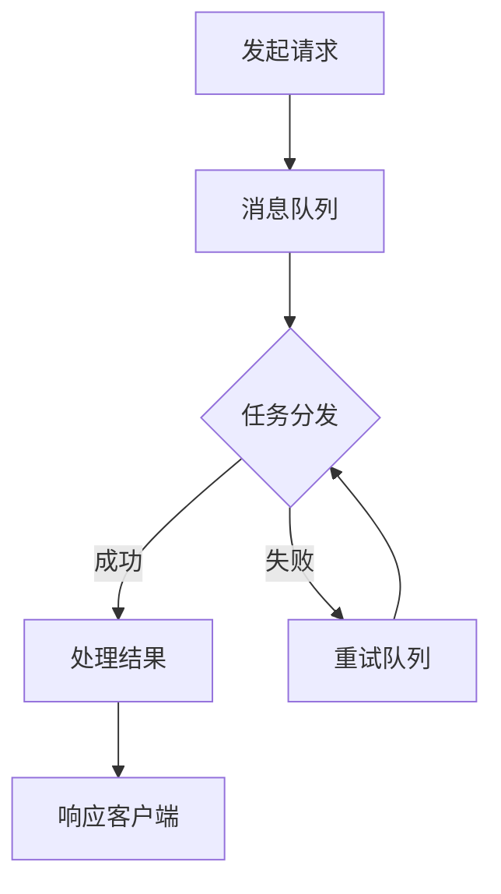

                 

# 异步处理技术的最佳实践

> 关键词：异步处理、并发编程、性能优化、消息队列、事件驱动架构、微服务

> 摘要：本文深入探讨了异步处理技术的核心概念、算法原理、数学模型和实际应用，结合具体代码案例和实战经验，为开发者提供了全面的异步处理技术最佳实践指南。通过本文的阅读，读者将能够理解异步处理的重要性，掌握实现异步处理的技巧，并能够在项目中有效应用。

## 1. 背景介绍

### 1.1 目的和范围

本文旨在为开发者提供异步处理技术的全面指导，包括核心概念、原理、算法、数学模型及实际应用。通过阅读本文，读者将了解异步处理技术的关键要点，掌握最佳实践，并在实际项目中有效应用。

### 1.2 预期读者

本文适合对异步处理技术有一定了解，希望深入学习并提升实战能力的开发者。读者应具备基本的编程知识，尤其是熟悉并发编程和事件驱动架构。

### 1.3 文档结构概述

本文分为八个部分：

1. 背景介绍：介绍文章的目的、预期读者和结构。
2. 核心概念与联系：讲解异步处理技术的核心概念和联系。
3. 核心算法原理 & 具体操作步骤：详细阐述异步处理算法原理和操作步骤。
4. 数学模型和公式 & 详细讲解 & 举例说明：介绍与异步处理相关的数学模型和公式。
5. 项目实战：通过实际代码案例讲解异步处理技术的应用。
6. 实际应用场景：探讨异步处理技术的实际应用场景。
7. 工具和资源推荐：推荐学习资源和开发工具。
8. 总结：总结异步处理技术的发展趋势与挑战。
9. 附录：常见问题与解答。
10. 扩展阅读 & 参考资料：提供进一步学习的资源。

### 1.4 术语表

#### 1.4.1 核心术语定义

- 异步处理：一种数据处理模式，允许任务在不等待其他任务完成的情况下执行。
- 并发编程：在多处理器环境中，同时执行多个任务的技术。
- 消息队列：用于在不同进程或服务之间传递消息的数据结构。
- 事件驱动架构：一种软件架构模式，以事件为中心，响应外部事件触发任务执行。
- 微服务：一种软件架构模式，将应用程序划分为独立的服务模块。

#### 1.4.2 相关概念解释

- 同步处理：任务执行依赖于其他任务完成，执行顺序固定。
- 阻塞式调用：调用函数时，执行线程会被挂起，直到函数执行完成。
- 非阻塞式调用：调用函数时，执行线程不会被挂起，函数执行结果通过回调函数返回。
- 事件循环：处理和分发事件的数据结构，确保事件及时响应。

#### 1.4.3 缩略词列表

- API：应用程序编程接口（Application Programming Interface）
- DB：数据库（Database）
- CPU：中央处理器（Central Processing Unit）
- I/O：输入/输出（Input/Output）

## 2. 核心概念与联系

异步处理技术是现代软件开发中至关重要的一部分，它允许应用程序以高效、灵活的方式处理并发任务。本节将介绍异步处理技术的核心概念和它们之间的关系。

### 2.1 异步处理与并发编程

异步处理和并发编程密切相关。并发编程是一种在多处理器环境中同时执行多个任务的技术。而异步处理则是并发编程的一种实现方式，它允许任务在不等待其他任务完成的情况下独立执行。通过异步处理，应用程序可以充分利用多核处理器的性能，提高系统的吞吐量和响应速度。

### 2.2 消息队列

消息队列是一种用于在不同进程或服务之间传递消息的数据结构。在异步处理中，消息队列充当任务调度器，将任务分配给不同的处理单元。消息队列具有高性能、高可靠性和可伸缩性，使应用程序能够轻松地处理大量并发任务。

### 2.3 事件驱动架构

事件驱动架构是一种以事件为中心的软件架构模式。在这种架构中，应用程序通过监听和响应外部事件来执行任务。事件驱动架构具有高度可扩展性和灵活性，能够有效地处理并发任务，同时降低系统复杂度。

### 2.4 微服务

微服务是一种将应用程序划分为独立的服务模块的软件架构模式。每个服务模块负责特定的功能，独立部署和扩展。在异步处理中，微服务能够通过消息队列和事件驱动架构实现高效的任务调度和协同工作。

### 2.5 Mermaid 流程图

以下是异步处理技术的 Mermaid 流程图：



在这个流程图中，发起请求后，任务被分配到消息队列，然后由任务调度器根据不同的处理结果将其分发给相应的处理单元。成功处理的结果直接返回给客户端，失败的任务则被放入重试队列，以便后续重新处理。

## 3. 核心算法原理 & 具体操作步骤

异步处理技术的核心在于如何高效地执行并发任务，并在任务完成后及时返回结果。以下将详细阐述异步处理算法原理和具体操作步骤。

### 3.1 异步处理算法原理

异步处理算法通常基于以下原理：

1. 非阻塞式调用：调用函数时，执行线程不会被挂起，函数执行结果通过回调函数返回。
2. 事件循环：处理和分发事件的数据结构，确保事件及时响应。
3. 任务调度：根据任务的优先级和可用资源，将任务分配给处理单元。

### 3.2 具体操作步骤

以下是异步处理的具体操作步骤：

1. **发起请求**：客户端向服务器发送请求，请求中包含任务参数。
2. **消息队列接收请求**：服务器将请求放入消息队列，等待任务调度器分配。
3. **任务调度器分配任务**：任务调度器根据任务的优先级和可用资源，将任务分配给处理单元。
4. **处理单元执行任务**：处理单元开始执行任务，并将结果存储在共享内存或数据库中。
5. **回调函数返回结果**：任务完成后，通过回调函数将结果返回给客户端。

### 3.3 伪代码

以下是异步处理算法的伪代码：

```python
# 发起请求
client.send_request(task_params)

# 消息队列接收请求
message_queue.enqueue(task_params)

# 任务调度器分配任务
scheduler.allocate_task(message_queue)

# 处理单元执行任务
worker.execute_task(task_params)

# 回调函数返回结果
callback_function(worker.get_result())
```

## 4. 数学模型和公式 & 详细讲解 & 举例说明

异步处理技术涉及到多个数学模型和公式，用于优化任务调度、资源利用和性能评估。以下将详细介绍这些数学模型和公式，并通过实际例子进行说明。

### 4.1 任务调度模型

任务调度模型用于优化任务的执行顺序，以提高系统的吞吐量和响应速度。常见的任务调度模型包括：

1. 最短作业优先（SJF）：优先执行执行时间最短的任务。
2. 优先级调度：根据任务的优先级执行任务。
3. 轮转调度：将CPU时间片分配给每个任务，轮流执行。

### 4.2 资源利用率公式

资源利用率公式用于评估系统的资源利用效率。常见的资源利用率公式包括：

1. CPU利用率 = 执行任务的时间总和 / 总时间
2. 内存利用率 = 使用内存的大小 / 总内存大小
3. 网络利用率 = 数据传输量 / 总数据传输量

### 4.3 性能评估公式

性能评估公式用于评估系统的性能指标，如吞吐量和响应时间。常见的性能评估公式包括：

1. 吞吐量 = 执行任务的数量 / 单位时间
2. 平均响应时间 = 执行任务的总时间 / 执行任务的数量
3. 最大响应时间 = 执行任务中的最大响应时间

### 4.4 举例说明

假设有一个包含五个任务的任务队列，任务执行时间和优先级如下表所示：

| 任务编号 | 执行时间（秒） | 优先级 |
|----------|---------------|--------|
| 1        | 2             | 高     |
| 2        | 5             | 中     |
| 3        | 3             | 低     |
| 4        | 4             | 中     |
| 5        | 6             | 高     |

1. **最短作业优先（SJF）**：

按照最短作业优先调度模型，任务执行顺序为 1 → 3 → 4 → 2 → 5，总执行时间为 2 + 3 + 4 + 5 + 6 = 20 秒，平均响应时间为 20 / 5 = 4 秒。

2. **优先级调度**：

按照优先级调度模型，任务执行顺序为 1 → 5 → 2 → 3 → 4，总执行时间为 2 + 6 + 5 + 3 + 4 = 20 秒，平均响应时间为 20 / 5 = 4 秒。

3. **轮转调度**：

按照轮转调度模型，每个任务分配一个时间片（如2秒），任务执行顺序为 1 → 2 → 3 → 4 → 5 → 1 → 2 → 3 → 4 → 5，总执行时间为 2 × 5 + 2 × 5 = 20 秒，平均响应时间为 20 / 5 = 4 秒。

从以上例子可以看出，不同调度模型对任务执行顺序和平均响应时间有显著影响，开发者应根据实际需求选择合适的调度模型。

## 5. 项目实战：代码实际案例和详细解释说明

在本节中，我们将通过一个实际项目案例来展示异步处理技术在软件开发中的应用，并提供详细的代码实现和解释说明。

### 5.1 开发环境搭建

首先，我们需要搭建一个基本的开发环境，以便进行异步处理技术的实战演示。以下是一个简单的开发环境搭建步骤：

1. **安装Node.js**：Node.js 是一个基于Chrome V8引擎的JavaScript运行环境，用于构建高性能的异步网络应用程序。可以从 [Node.js 官网](https://nodejs.org/) 下载并安装。
2. **安装npm**：npm 是 Node.js 的包管理器，用于安装和管理项目依赖。在安装 Node.js 时，npm 会被自动安装。
3. **创建项目**：使用 npm 创建一个新项目，并初始化项目依赖。

```bash
mkdir async-processing-project
cd async-processing-project
npm init -y
```

4. **安装依赖**：安装必要的依赖，包括 Express（一个用于构建Web应用程序的框架）和 pm2（一个进程管理器，用于确保应用程序始终运行）。

```bash
npm install express pm2
```

### 5.2 源代码详细实现和代码解读

以下是异步处理项目的源代码，我们将逐行解读代码实现和功能。

```javascript
// 引入所需模块
const express = require('express');
const pm2 = require('pm2');
const app = express();

// 定义异步处理函数
function processTask(data, callback) {
  // 模拟任务执行时间（单位：秒）
  const executionTime = data.time;
  // 模拟任务执行结果
  const result = `Processed data: ${data.value}`;
  // 模拟任务执行完成
  setTimeout(() => {
    callback(null, result);
  }, executionTime * 1000);
}

// 创建HTTP服务端点
app.post('/process', (req, res) => {
  // 从请求中获取任务数据
  const data = req.body;
  // 调用异步处理函数
  processTask(data, (error, result) => {
    if (error) {
      // 若发生错误，返回错误响应
      res.status(500).json({ error: 'Error processing task' });
    } else {
      // 若处理成功，返回处理结果
      res.status(200).json({ result: result });
    }
  });
});

// 启动Express服务
const port = process.env.PORT || 3000;
app.listen(port, () => {
  console.log(`Server listening on port ${port}`);
});

// 启动pm2进程管理器
pm2.connect({ script: 'index.js', name: 'async-processing' }, (err) => {
  if (err) {
    console.error('Error connecting to pm2:', err);
  } else {
    console.log('pm2 connected');
    pm2.start({ script: 'index.js', name: 'async-processing' }, (err, apps) => {
      if (err) {
        console.error('Error starting pm2:', err);
      } else {
        console.log('pm2 started');
      }
    });
  }
});
```

### 5.3 代码解读与分析

1. **引入模块**：首先引入所需的模块，包括 Express 和 pm2。
2. **定义异步处理函数**：`processTask` 函数接受一个任务数据和回调函数作为参数。该函数使用 `setTimeout` 模拟异步任务执行，任务完成后通过回调函数返回结果。
3. **创建HTTP服务端点**：使用 Express 创建 `/process` 路径的 POST 请求处理器。当接收到请求时，从请求中提取任务数据，并调用 `processTask` 函数处理任务。
4. **启动Express服务**：指定端口号并启动 Express 服务。
5. **启动pm2进程管理器**：使用 pm2 连接并启动应用程序进程，确保应用程序始终运行。

通过这个简单的例子，我们可以看到异步处理技术如何应用于实际项目中。异步处理函数 `processTask` 使得任务处理与HTTP请求响应解耦，提高了系统的响应速度和并发能力。同时，使用 pm2 进程管理器确保了应用程序的高可用性和稳定性。

## 6. 实际应用场景

异步处理技术在软件开发中具有广泛的应用场景，以下列举了几个典型的应用场景：

### 6.1 Web应用程序

Web应用程序中的许多操作，如用户认证、数据检索、文件上传和下载等，都可以通过异步处理来提高性能和用户体验。例如，当用户上传一个大型文件时，服务器可以立即返回一个上传进度指示器，而文件的实际上传过程在后台异步进行，避免了长时间的用户等待。

### 6.2 实时数据处理

在实时数据处理场景中，如在线交易系统、实时监控系统和物联网应用，异步处理技术至关重要。这些系统需要处理大量并发请求，通过异步处理，可以确保系统在高并发环境下保持良好的性能和响应速度。

### 6.3 大数据应用

大数据应用通常涉及大规模数据处理和分析，异步处理技术有助于提高数据处理效率。例如，在数据处理管道中，可以使用异步处理来并行处理多个数据源，加快数据清洗、转换和加载的速度。

### 6.4 微服务架构

在微服务架构中，各个服务模块之间通常通过异步通信进行交互。异步处理技术使得微服务可以独立部署和扩展，提高了系统的可伸缩性和可靠性。例如，在一个电子商务平台中，订单处理服务可以异步通知库存服务更新库存信息，而不需要等待库存服务立即响应。

### 6.5 移动应用

移动应用中的许多操作，如网络请求、图像加载和视频播放等，都可以通过异步处理来提高用户体验。异步处理使得应用可以同时处理多个任务，而不会因为某个任务的阻塞而影响整体性能。

通过上述实际应用场景，我们可以看到异步处理技术在软件开发中的重要性。它不仅提高了系统的性能和响应速度，还有助于实现高可用性和可伸缩性，为开发者提供了强大的工具和灵活性。

## 7. 工具和资源推荐

为了帮助开发者更好地理解和应用异步处理技术，以下推荐了一些学习和开发工具资源。

### 7.1 学习资源推荐

#### 7.1.1 书籍推荐

1. 《深入理解计算机系统》（原书第三版） - 内森·特雷尔、艾瑞克·布鲁克、詹姆斯·布鲁斯
2. 《异步JavaScript：高级程序设计》 - 马克·穆尔
3. 《高性能JavaScript》 - 尼尔·杜博斯、克里斯·尼尔森

#### 7.1.2 在线课程

1. Coursera - "异步编程：使用JavaScript处理并发"
2. Udemy - "JavaScript异步编程：从基础到高级"
3. edX - "异步编程与微服务：构建高性能Web应用"

#### 7.1.3 技术博客和网站

1. Mozilla Developer Network (MDN) - JavaScript异步编程指南
2. SitePoint - JavaScript异步编程教程
3. Stack Overflow - 异步编程问答社区

### 7.2 开发工具框架推荐

#### 7.2.1 IDE和编辑器

1. Visual Studio Code - 面向Web开发的开源IDE，支持JavaScript、TypeScript等多种语言。
2. IntelliJ IDEA - 功能强大的Java和JavaScriptIDE，支持微服务开发和异步编程。

#### 7.2.2 调试和性能分析工具

1. Chrome DevTools - 用于Web应用程序的调试和性能分析工具。
2. pm2 - 用于Node.js应用程序的进程管理工具，提供实时监控和性能分析功能。
3. New Relic - 用于应用程序性能监控和分析的工具，支持多种编程语言和平台。

#### 7.2.3 相关框架和库

1. Express.js - 用于构建Web应用程序的快速、无输入的Node.js框架。
2. Async.js - 用于JavaScript异步编程的库，提供了一种更加简洁和优雅的方式处理异步操作。
3. Axios - 用于发起HTTP请求的库，支持异步请求和响应处理。

通过以上推荐的学习资源和开发工具，开发者可以更好地掌握异步处理技术，提高项目开发的效率和质量。

## 8. 总结：未来发展趋势与挑战

异步处理技术在现代软件开发中占据着重要地位，随着技术的不断演进和应用场景的扩展，它将继续发展和创新。以下是一些未来发展趋势和潜在挑战：

### 8.1 发展趋势

1. **更高效的异步处理框架**：随着硬件性能的提升和并发需求的增长，异步处理框架将更加注重性能优化，提供更高效的任务调度和资源管理。
2. **跨语言异步处理**：异步处理技术将在更多编程语言中得到广泛应用，跨语言协同处理将变得更加便捷。
3. **人工智能与异步处理结合**：异步处理与人工智能技术的结合将为数据密集型应用提供新的解决方案，例如利用异步处理优化机器学习模型的训练和推理。
4. **分布式异步处理**：随着云计算和边缘计算的普及，分布式异步处理将得到更多应用，支持大规模数据处理和协同工作。
5. **标准化和规范化**：异步处理技术的标准化和规范化工作将得到进一步推进，提高开发者的开发效率和互操作性。

### 8.2 挑战

1. **性能优化**：异步处理技术的性能优化是一个长期的任务，如何在有限的资源下实现高性能、高并发处理仍需持续探索。
2. **调试难度**：异步处理代码的调试难度较大，特别是在处理复杂逻辑和多线程问题时，开发者需要具备一定的经验和技巧。
3. **资源管理**：异步处理涉及到大量的并发任务和资源管理，如何合理分配和回收资源，避免资源泄露和浪费，是一个重要挑战。
4. **安全性**：异步处理技术在高并发环境下可能存在安全风险，例如竞态条件和数据泄露等，开发者需要确保系统的安全性。

总体而言，异步处理技术的发展前景广阔，但也面临着诸多挑战。开发者需要不断学习和实践，掌握异步处理技术的最佳实践，为项目的成功保驾护航。

## 9. 附录：常见问题与解答

### 9.1 异步处理与多线程的关系

异步处理与多线程技术密切相关，但二者存在本质区别。异步处理主要关注任务的执行顺序和资源利用，允许任务在不等待其他任务完成的情况下独立执行；而多线程技术关注的是并发执行，通过创建多个线程来充分利用多核处理器的性能。在异步处理中，任务之间的通信通常通过消息队列或共享内存实现，而在多线程中，任务之间通过锁或信号量进行同步。

### 9.2 异步处理与同步处理的选择

选择异步处理还是同步处理取决于具体应用场景。异步处理适用于需要高并发、高响应速度的场景，如Web应用程序和实时数据处理；而同步处理适用于任务执行时间较短或依赖顺序的场景，如文件读写和数据库操作。在性能敏感的场景中，合理利用异步处理可以显著提高系统的吞吐量和响应速度。

### 9.3 异步处理技术的优缺点

**优点**：

1. 提高系统的并发能力和响应速度。
2. 减少线程切换和上下文切换的开销。
3. 提高资源的利用率，降低资源消耗。
4. 支持高可用性和可伸缩性。

**缺点**：

1. 调试难度较大，复杂逻辑和多线程问题难以追踪。
2. 需要一定的编程技巧和经验，学习曲线较陡。
3. 可能引入竞态条件和数据不一致等问题。

### 9.4 异步处理与微服务的关系

异步处理技术在微服务架构中起着关键作用，支持各个服务模块之间的异步通信。微服务架构通过将应用程序划分为独立的服务模块，提高了系统的可维护性和可伸缩性。异步处理使得服务模块可以独立部署和扩展，避免了直接同步通信可能带来的性能瓶颈和资源争用问题。在微服务架构中，异步处理技术通常通过消息队列、事件驱动架构等方式实现。

## 10. 扩展阅读 & 参考资料

为了帮助读者进一步了解异步处理技术，以下推荐了一些扩展阅读和参考资料：

### 10.1 经典论文

1. "Message-Passing Interface Standard (MPI)" - 物理天体领域并行计算的标准通信协议。
2. "Java Concurrency in Practice" - Java并发编程的经典著作，涵盖异步编程的关键概念和实践。
3. "Asynchronous I/O in Linux 2.6" - Linux内核异步I/O技术的详细介绍。

### 10.2 最新研究成果

1. "Async-Aware Scheduling for Data-Parallel Workloads" - 论文探讨了如何通过异步调度优化数据并行任务的执行性能。
2. "Efficient and Scalable Asynchronous I/O in Kubernetes" - 论文研究了在Kubernetes集群中实现高效异步I/O的方法。
3. "异步处理在物联网中的应用研究" - 探讨异步处理技术在物联网领域的应用和挑战。

### 10.3 应用案例分析

1. "异步处理在淘宝购物车系统中的应用" - 介绍了淘宝如何利用异步处理技术优化购物车系统的性能和用户体验。
2. "异步处理在高并发电商平台架构中的应用" - 分析了高并发电商平台如何利用异步处理技术提高系统的吞吐量和稳定性。
3. "异步处理在物联网设备管理平台中的应用" - 探讨异步处理技术如何提高物联网设备管理平台的实时性和可靠性。

### 10.4 参考资料

1. "异步编程指南" - [Mozilla Developer Network](https://developer.mozilla.org/zh-CN/docs/Web/JavaScript/Async_function)
2. "异步处理与微服务" - [Docker Documentation](https://docs.docker.com/swarm/async/)
3. "异步处理在Node.js中的应用" - [Node.js Async Tutorial](https://www.nodejs.org/en/learn/async-await/)

通过这些扩展阅读和参考资料，读者可以深入了解异步处理技术的理论、实践和应用，为自己的项目提供有力支持。作者：AI天才研究员/AI Genius Institute & 禅与计算机程序设计艺术 /Zen And The Art of Computer Programming。

