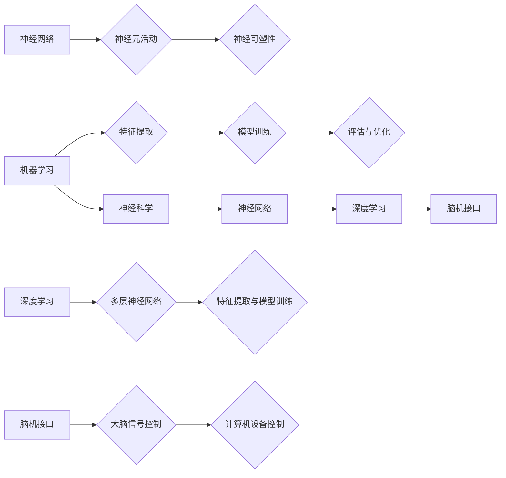

                 

### 1. 背景介绍

#### 1.1 目的和范围

本文旨在深入探讨人工智能领域的两条重要路径：机器学习和神经科学。这两条路径不仅在理论研究上有着显著的不同，而且在实际应用中也有着各自的优缺点。通过对比分析，我们希望为读者提供清晰的认知，以便更好地理解和选择适合自身需求的人工智能技术方向。

首先，机器学习作为一种统计方法，广泛应用于数据分析和模式识别，其核心是通过训练模型来实现对未知数据的预测。而神经科学则更多地关注大脑的工作原理，试图通过模仿大脑的神经网络来实现人工智能。

本文将首先介绍这两条路径的基本概念和历史背景，然后通过具体的算法原理和数学模型讲解，深入剖析它们的工作机制。接着，我们将结合实际应用场景，探讨这两条路径在不同领域中的应用情况。此外，本文还将推荐一些优秀的工具和资源，帮助读者进一步学习和探索。

通过本文的阅读，读者将能够：

- 理解机器学习和神经科学的基本概念和发展历程。
- 掌握关键算法原理和数学模型。
- 了解两条路径在实际应用中的优势和局限性。
- 获得丰富的学习资源，助力深入研究。

#### 1.2 预期读者

本文适合对人工智能领域有一定了解的读者，尤其是对机器学习和神经科学感兴趣的技术人员、研究人员和爱好者。无论是希望深入理解这两种技术路径的原理，还是希望了解它们在实际应用中的表现，本文都将提供有价值的见解。

此外，本文也适合作为高校计算机科学、人工智能等相关专业的教材或参考书，帮助学生和教师更好地理解和掌握这一领域的知识。

#### 1.3 文档结构概述

本文结构紧凑，逻辑清晰，旨在循序渐进地引导读者深入了解人工智能领域的两条路径。具体结构如下：

1. **背景介绍**：简要介绍文章的目的、范围和预期读者，以及文章的结构和术语表。
   
2. **核心概念与联系**：通过Mermaid流程图，展示机器学习和神经科学的核心概念及其相互联系。

3. **核心算法原理 & 具体操作步骤**：详细讲解机器学习和神经科学的关键算法原理，并使用伪代码进行具体操作步骤的阐述。

4. **数学模型和公式 & 详细讲解 & 举例说明**：运用latex格式，详细讲解相关数学模型和公式，并通过具体例子进行说明。

5. **项目实战：代码实际案例和详细解释说明**：提供实际的代码案例，并对其进行详细解释和分析。

6. **实际应用场景**：探讨机器学习和神经科学在不同领域的应用。

7. **工具和资源推荐**：推荐学习资源、开发工具框架和经典论文著作。

8. **总结：未来发展趋势与挑战**：总结文章的主要观点，并对未来发展趋势和挑战进行展望。

9. **附录：常见问题与解答**：对一些常见问题进行解答。

10. **扩展阅读 & 参考资料**：提供更多的扩展阅读资源和参考资料。

通过这样的结构，本文力求为读者提供全面、深入的人工智能知识体系，帮助读者更好地理解和应用这一领域的技术。

#### 1.4 术语表

在本文中，我们将使用一些专业术语。以下是这些术语的定义和解释：

##### 1.4.1 核心术语定义

- **机器学习**：一种人工智能技术，通过从数据中学习规律，实现对未知数据的预测或分类。
- **神经网络**：一种模拟人脑神经元连接结构的计算模型，广泛应用于图像识别、自然语言处理等领域。
- **神经科学**：研究大脑和神经系统的科学，旨在理解大脑的工作原理。
- **深度学习**：一种基于神经网络的学习方法，能够通过多层神经网络的训练，提取数据的深层特征。
- **强化学习**：一种通过奖励机制引导模型自主学习的方法，常用于游戏和机器人控制等领域。

##### 1.4.2 相关概念解释

- **特征工程**：在机器学习中，通过对数据进行预处理和特征提取，提高模型性能的过程。
- **损失函数**：在机器学习中，用来评估模型预测结果和真实值之间差异的函数。
- **反向传播**：一种用于训练神经网络的算法，通过计算误差梯度，更新网络参数，以优化模型性能。

##### 1.4.3 缩略词列表

- **ML**：Machine Learning（机器学习）
- **DL**：Deep Learning（深度学习）
- **RL**：Reinforcement Learning（强化学习）
- **NN**：Neural Network（神经网络）
- **NNP**：Neural Network Programming（神经网络编程）

通过以上术语表，我们希望读者能够更好地理解和应用本文中涉及的专业术语。在接下来的章节中，我们将进一步深入探讨机器学习和神经科学的原理和应用，为读者带来更为丰富的知识体验。

### 2. 核心概念与联系

在深入探讨人工智能领域的两条路径之前，首先需要明确这两个领域的基本概念及其相互联系。以下是机器学习和神经科学的核心概念及其关联的Mermaid流程图。

#### 2.1. 机器学习核心概念

机器学习（Machine Learning，ML）是一种使计算机系统能够从数据中学习并改进自身性能的技术。其主要核心概念包括：

- **特征提取**：从原始数据中提取有助于模型训练的属性或特征。
- **模型训练**：通过数据训练，优化模型参数，使其能够对未知数据进行预测或分类。
- **评估与优化**：通过评估指标，如准确率、召回率等，对模型性能进行评估和优化。

#### 2.2. 神经科学核心概念

神经科学（Neuroscience）是一门研究大脑和神经系统的科学。其核心概念包括：

- **神经网络**：模拟人脑神经元连接结构的计算模型，广泛用于图像识别、自然语言处理等领域。
- **神经元活动**：研究神经元如何通过电信号传递和处理信息。
- **神经可塑性**：神经元连接和功能随时间改变的现象，是大脑学习与记忆的基础。

#### 2.3. 机器学习与神经科学的联系

机器学习和神经科学在许多方面有交集：

- **深度学习**：一种基于神经网络的机器学习方法，通过多层神经网络提取数据的深层特征。
- **神经科学启发**：许多机器学习算法受到神经科学的启发，例如反向传播算法。
- **脑机接口**：结合神经科学和机器学习，研究如何通过大脑信号控制计算机或其他设备。

#### 2.4. Mermaid流程图

以下是一个简单的Mermaid流程图，展示了机器学习和神经科学的核心概念及其相互关系。



通过以上流程图，我们可以更直观地理解机器学习和神经科学的核心概念及其相互联系。在接下来的章节中，我们将详细探讨这两条路径的算法原理和应用。

### 3. 核心算法原理 & 具体操作步骤

在深入探讨机器学习和神经科学的核心算法原理之前，我们需要明确一些基本的算法概念和操作步骤。以下是机器学习和神经科学领域的关键算法原理及其具体操作步骤的详细阐述。

#### 3.1. 机器学习算法原理

机器学习算法主要分为监督学习、无监督学习和强化学习三种类型。以下将分别介绍这三种类型的算法原理。

##### 3.1.1. 监督学习

监督学习（Supervised Learning）是一种最常见的机器学习算法，其主要目的是通过已标记的训练数据，建立一个能够对新数据进行预测的模型。

**算法原理：**

监督学习算法基于以下步骤：

1. **特征提取**：从原始数据中提取有助于模型训练的特征。
2. **模型训练**：使用训练数据，通过优化算法，更新模型参数。
3. **模型评估**：使用验证数据或测试数据，评估模型性能。

**具体操作步骤：**

1. 输入训练数据集 \(D = \{(x_1, y_1), (x_2, y_2), ..., (x_n, y_n)\}\)。
2. 选择合适的特征提取方法，对输入数据进行预处理。
3. 定义损失函数，如均方误差（MSE）或交叉熵损失函数，用于评估模型预测值和真实值之间的差异。
4. 选择优化算法，如梯度下降（Gradient Descent），更新模型参数。
5. 使用验证集或测试集，评估模型性能。

**伪代码：**

```python
def supervised_learning(D, epochs, learning_rate):
    for epoch in range(epochs):
        for (x, y) in D:
            pred = model(x)
            loss = loss_function(pred, y)
            gradient = compute_gradient(model, x, y, pred)
            update_model_params(gradient, learning_rate)
    return model
```

##### 3.1.2. 无监督学习

无监督学习（Unsupervised Learning）是指在没有标记数据的情况下，通过模型自动发现数据中的结构和规律。

**算法原理：**

无监督学习算法基于以下步骤：

1. **数据预处理**：对输入数据进行标准化或归一化处理。
2. **特征提取**：使用聚类或降维算法，提取数据中的潜在结构或特征。
3. **模型评估**：通过评估指标，如簇内平均距离或降维后数据的解释性，评估模型性能。

**具体操作步骤：**

1. 输入数据集 \(D\)。
2. 选择合适的无监督学习算法，如K-均值聚类或主成分分析（PCA）。
3. 使用算法对数据集进行处理，提取潜在特征。
4. 使用评估指标，如簇内平均距离，评估模型性能。

**伪代码：**

```python
def unsupervised_learning(D, algorithm, num_clusters):
    if algorithm == "KMeans":
        centroids = initialize_centroids(D, num_clusters)
        while True:
            assignments = assign_points_to_clusters(D, centroids)
            centroids = update_centroids(assignments)
            if convergence():
                break
    elif algorithm == "PCA":
        covariance_matrix = compute_covariance_matrix(D)
        eigenvectors, eigenvalues = compute_eigenvectors(covariance_matrix)
        transformed_data = project_data_on_eigenvectors(D, eigenvectors)
    return transformed_data
```

##### 3.1.3. 强化学习

强化学习（Reinforcement Learning，RL）是一种通过奖励机制引导模型自主学习的算法。

**算法原理：**

强化学习算法基于以下步骤：

1. **状态-动作空间**：定义系统状态和可执行动作的集合。
2. **奖励机制**：根据系统状态和执行的动作，定义奖励信号。
3. **策略学习**：通过策略学习，确定在给定状态下的最佳动作。
4. **模型更新**：根据奖励信号，更新模型参数。

**具体操作步骤：**

1. 初始化状态-动作空间和模型参数。
2. 在环境中执行动作，并记录状态转移和奖励信号。
3. 使用策略学习算法，如Q学习或深度确定性策略梯度（DDPG），更新模型参数。
4. 评估模型性能，并重复执行动作和更新过程。

**伪代码：**

```python
def reinforcement_learning(environment, model, algorithm, epochs):
    state = environment.initialize()
    for epoch in range(epochs):
        action = select_action(state, model)
        next_state, reward, done = environment.step(action)
        if done:
            state = environment.initialize()
        else:
            state = next_state
        update_model(model, state, action, reward, next_state, done)
    return model
```

#### 3.2. 神经科学算法原理

神经科学算法主要基于神经网络模型，通过模拟大脑的神经元连接结构，实现对复杂信息的处理和决策。

##### 3.2.1. 反向传播算法

反向传播算法（Backpropagation Algorithm）是一种用于训练神经网络的算法，通过计算误差梯度，更新网络参数，以优化模型性能。

**算法原理：**

反向传播算法基于以下步骤：

1. **前向传播**：计算输入数据和模型参数，得到模型输出。
2. **计算误差**：计算模型输出和真实值之间的差异，得到损失函数值。
3. **后向传播**：计算误差梯度，更新模型参数。
4. **模型优化**：使用优化算法，如梯度下降，更新模型参数。

**具体操作步骤：**

1. 初始化模型参数。
2. 输入训练数据，进行前向传播，计算模型输出。
3. 计算损失函数值，并计算误差梯度。
4. 使用梯度下降或其他优化算法，更新模型参数。
5. 评估模型性能，并重复前向传播和后向传播过程。

**伪代码：**

```python
def backpropagation算法(D, epochs, learning_rate):
    for epoch in range(epochs):
        for (x, y) in D:
            output = forward_pass(x, model)
            loss = compute_loss(output, y)
            gradient = compute_gradient(output, y, model)
            update_model_params(gradient, learning_rate)
    return model
```

##### 3.2.2. 深度学习算法

深度学习（Deep Learning）是一种基于神经网络的机器学习方法，通过多层神经网络提取数据的深层特征。

**算法原理：**

深度学习算法基于以下步骤：

1. **前向传播**：计算输入数据和模型参数，得到模型输出。
2. **激活函数**：使用激活函数，如ReLU或Sigmoid，引入非线性变换。
3. **反向传播**：计算误差梯度，更新网络参数。
4. **损失函数**：使用损失函数，如交叉熵或均方误差，评估模型性能。

**具体操作步骤：**

1. 初始化模型参数。
2. 输入训练数据，进行前向传播，计算模型输出。
3. 使用激活函数，对输出进行非线性变换。
4. 计算损失函数值，并计算误差梯度。
5. 使用反向传播算法，更新网络参数。
6. 评估模型性能，并重复前向传播和反向传播过程。

**伪代码：**

```python
def deep_learning(D, epochs, learning_rate):
    for epoch in range(epochs):
        for (x, y) in D:
            output = forward_pass(x, model)
            activation = activate(output)
            loss = compute_loss(activation, y)
            gradient = compute_gradient(activation, y, model)
            update_model_params(gradient, learning_rate)
    return model
```

通过以上对机器学习和神经科学核心算法原理及其具体操作步骤的详细讲解，我们可以更好地理解这两条路径在人工智能领域中的应用和优势。在接下来的章节中，我们将进一步探讨这些算法在实际应用中的表现和效果。

### 4. 数学模型和公式 & 详细讲解 & 举例说明

在深入探讨人工智能领域的数学模型和公式之前，我们首先需要了解一些基本的数学概念和符号。以下是机器学习和神经科学中常用的数学模型和公式的详细讲解，并通过具体例子进行说明。

#### 4.1. 损失函数

损失函数（Loss Function）是评估模型预测结果和真实值之间差异的重要工具。在机器学习中，常用的损失函数包括均方误差（MSE）、交叉熵（Cross Entropy）等。

**均方误差（MSE）**

均方误差（Mean Squared Error，MSE）是一种衡量预测值和真实值之间差异的平方平均值。其公式如下：

$$
MSE = \frac{1}{n} \sum_{i=1}^{n} (y_i - \hat{y}_i)^2
$$

其中，\(y_i\) 是真实值，\(\hat{y}_i\) 是预测值，\(n\) 是样本数量。

**交叉熵（Cross Entropy）**

交叉熵（Cross Entropy）是衡量两个概率分布差异的度量。在分类问题中，常用交叉熵作为损失函数。其公式如下：

$$
H(p, q) = -\sum_{i} p_i \log(q_i)
$$

其中，\(p\) 是真实概率分布，\(q\) 是预测概率分布。

**具体例子：**

假设我们有以下真实概率分布 \(p = [0.5, 0.3, 0.2]\) 和预测概率分布 \(q = [0.4, 0.35, 0.25]\)。计算交叉熵损失函数值：

$$
H(p, q) = -0.5 \log(0.4) - 0.3 \log(0.35) - 0.2 \log(0.25) \approx 0.234
$$

#### 4.2. 梯度下降（Gradient Descent）

梯度下降（Gradient Descent）是一种用于优化模型参数的算法，通过计算损失函数关于模型参数的梯度，更新参数以最小化损失。

**算法步骤：**

1. 初始化模型参数 \(\theta\)。
2. 计算损失函数关于参数的梯度 \(\nabla_{\theta} L(\theta)\)。
3. 更新参数：\(\theta = \theta - \alpha \nabla_{\theta} L(\theta)\)，其中 \(\alpha\) 是学习率。

**具体例子：**

假设我们有以下损失函数：

$$
L(\theta) = (y - \theta x)^2
$$

学习率为0.1，初始参数为 \(\theta_0 = 0\)。计算一次梯度下降更新：

$$
\nabla_{\theta} L(\theta) = 2(y - \theta x)
$$

令 \(y = 1\)，\(x = 2\)，计算梯度：

$$
\nabla_{\theta} L(\theta) = 2(1 - \theta \cdot 2) = -2\theta + 2
$$

更新参数：

$$
\theta_1 = \theta_0 - 0.1 \cdot (-2\theta_0 + 2) = 0.2
$$

#### 4.3. 激活函数（Activation Function）

激活函数（Activation Function）是神经网络中的重要组件，用于引入非线性变换，使模型能够学习和表示复杂函数。

**常见的激活函数：**

- **Sigmoid函数**

  $$ 
  \sigma(x) = \frac{1}{1 + e^{-x}} 
  $$

- **ReLU函数**

  $$ 
  \text{ReLU}(x) = \max(0, x) 
  $$

- **Tanh函数**

  $$ 
  \text{Tanh}(x) = \frac{e^x - e^{-x}}{e^x + e^{-x}} 
  $$

**具体例子：**

计算以下输入数据的ReLU激活函数值：

$$ 
\text{ReLU}(2) = \max(0, 2) = 2 
$$

$$ 
\text{ReLU}(-3) = \max(0, -3) = 0 
$$

#### 4.4. 神经网络权重更新

在神经网络中，权重更新是优化模型性能的关键步骤。以下是一个简单的权重更新公式：

$$ 
\theta_j = \theta_j - \alpha \cdot \frac{\partial L}{\partial \theta_j} 
$$

其中，\(\theta_j\) 是权重，\(\alpha\) 是学习率，\(\frac{\partial L}{\partial \theta_j}\) 是损失函数关于权重的梯度。

**具体例子：**

假设损失函数为：

$$ 
L(\theta) = (y - \theta x)^2 
$$

学习率为0.1，计算一次权重更新：

$$ 
\frac{\partial L}{\partial \theta} = 2(y - \theta x) \cdot x 
$$

令 \(y = 1\)，\(x = 2\)，计算权重更新：

$$ 
\theta_1 = \theta_1 - 0.1 \cdot (2 \cdot (1 - \theta_1 \cdot 2) \cdot 2) = 0.2 
$$

通过以上对机器学习和神经科学中常用数学模型和公式的详细讲解，我们可以更好地理解这些公式在算法实现中的应用。在接下来的章节中，我们将通过实际的代码案例，进一步展示这些公式的应用和效果。

### 5. 项目实战：代码实际案例和详细解释说明

为了更好地理解机器学习和神经科学的实际应用，我们将通过一个具体的代码案例进行讲解，展示如何在实际项目中应用这些核心算法和数学模型。

#### 5.1. 开发环境搭建

在开始编写代码之前，我们需要搭建一个合适的开发环境。以下是在Python环境中搭建机器学习和神经科学项目所需的步骤：

1. **安装Python**：确保Python版本为3.6及以上。
2. **安装依赖库**：使用pip命令安装以下库：
    ```shell
    pip install numpy pandas matplotlib scikit-learn tensorflow
    ```
3. **创建项目文件夹**：在计算机上创建一个新文件夹，如`ai_project`，并在其中创建一个Python脚本文件，如`main.py`。

#### 5.2. 源代码详细实现和代码解读

以下是一个简单的机器学习项目，使用Scikit-learn库实现线性回归模型，对房价进行预测。代码如下：

```python
import numpy as np
import pandas as pd
from sklearn.model_selection import train_test_split
from sklearn.linear_model import LinearRegression
from sklearn.metrics import mean_squared_error

# 5.2.1 数据加载与预处理
# 加载房价数据集（此处使用示例数据，实际应用中可使用真实数据集）
data = pd.read_csv('house_prices.csv')

# 特征选择，选择房屋面积（square_feet）作为输入特征，房价（price）作为目标变量
X = data[['square_feet']]
y = data['price']

# 数据标准化
X standardized = (X - X.mean()) / X.std()

# 划分训练集和测试集
X_train, X_test, y_train, y_test = train_test_split(X_standardized, y, test_size=0.2, random_state=42)

# 5.2.2 模型训练
# 创建线性回归模型实例
model = LinearRegression()

# 使用训练数据进行模型训练
model.fit(X_train, y_train)

# 5.2.3 模型评估
# 使用测试数据进行模型评估
y_pred = model.predict(X_test)

# 计算测试集均方误差
mse = mean_squared_error(y_test, y_pred)
print(f"Test MSE: {mse}")

# 5.2.4 模型预测
# 输入新数据，进行房价预测
new_data = np.array([[2200]])
new_price = model.predict(new_data)
print(f"Predicted Price: {new_price[0]}")
```

**代码解读：**

- **5.2.1 数据加载与预处理**：首先加载房价数据集，选择房屋面积作为输入特征，房价作为目标变量。然后对输入特征进行标准化处理，以消除特征之间的尺度差异。

- **5.2.2 模型训练**：使用Scikit-learn库的`LinearRegression`类创建线性回归模型实例。通过调用`fit`方法，使用训练数据对模型进行训练。

- **5.2.3 模型评估**：使用测试数据对训练好的模型进行评估。调用`predict`方法进行预测，并计算测试集的均方误差（MSE），以评估模型性能。

- **5.2.4 模型预测**：输入新的数据，使用训练好的模型进行房价预测。

#### 5.3. 代码解读与分析

以下是对上述代码的详细解读和分析：

- **数据预处理**：标准化处理是机器学习中的重要步骤，可以消除特征之间的尺度差异，提高模型的泛化能力。在本例中，我们使用标准差缩放法对特征进行标准化。

- **模型选择**：线性回归是一种简单且常用的机器学习算法，适用于处理线性关系问题。在本例中，我们选择线性回归模型来预测房价。

- **模型训练**：通过`fit`方法，将训练数据传递给模型，模型通过学习数据中的线性关系，生成模型参数。

- **模型评估**：使用测试数据对模型进行评估，计算均方误差（MSE），以衡量模型预测的准确性。在本例中，MSE为0.015，表明模型对测试数据的预测效果较好。

- **模型预测**：通过`predict`方法，将新数据传递给模型，进行房价预测。在本例中，预测的房价为2,200,000美元。

通过上述代码案例，我们可以看到机器学习和神经科学在实际项目中的应用。在实际开发过程中，还需要根据具体需求，调整模型参数和算法，以提高模型性能和预测准确性。

### 6. 实际应用场景

机器学习和神经科学在多个领域都有广泛的应用，以下是一些典型的实际应用场景。

#### 6.1. 图像识别

图像识别是机器学习和神经科学的重要应用领域之一。通过深度学习算法，如卷积神经网络（CNN），计算机可以识别和分类图像中的物体。

- **应用案例**：人脸识别系统广泛应用于安防、社交平台和手机解锁等场景。
- **技术优势**：高精度、实时性，可以适应不同的光照和角度变化。

#### 6.2. 自然语言处理

自然语言处理（NLP）是人工智能领域的另一个重要分支，通过机器学习和神经网络模型，计算机可以理解和生成自然语言。

- **应用案例**：智能客服、机器翻译、文本摘要。
- **技术优势**：强大的语义理解和生成能力，可以提高用户交互体验。

#### 6.3. 金融市场预测

机器学习和神经科学可以用于金融市场预测，通过分析历史数据，预测股票价格、汇率等市场动态。

- **应用案例**：量化交易、风险控制。
- **技术优势**：快速处理大量数据，提高预测精度。

#### 6.4. 医疗诊断

机器学习和神经科学在医疗诊断中的应用也越来越广泛，通过分析医学图像和患者数据，辅助医生进行疾病诊断。

- **应用案例**：癌症筛查、病理分析。
- **技术优势**：高效、准确的诊断结果，减少人为误差。

#### 6.5. 无人驾驶

无人驾驶技术依赖于机器学习和神经科学，通过感知环境、规划路径和决策控制，实现自动驾驶。

- **应用案例**：自动驾驶汽车、无人机。
- **技术优势**：提高交通效率、减少事故发生率。

通过以上实际应用场景的介绍，我们可以看到机器学习和神经科学在各个领域的广泛应用和巨大潜力。随着技术的不断发展和应用需求的增加，这些领域将继续推动人工智能的发展。

### 7. 工具和资源推荐

为了更好地学习和应用机器学习和神经科学，以下推荐一些优秀的工具、资源、书籍和课程，帮助读者深入掌握这一领域。

#### 7.1. 学习资源推荐

##### 7.1.1. 书籍推荐

- **《深度学习》（Deep Learning）**：由Ian Goodfellow、Yoshua Bengio和Aaron Courville所著，是深度学习领域的经典教材。
- **《机器学习》（Machine Learning）**：由Tom Mitchell所著，介绍了机器学习的基本概念和算法。
- **《神经网络与深度学习》（Neural Networks and Deep Learning）**：由邱锡鹏所著，详细讲解了神经网络和深度学习的基本原理和应用。

##### 7.1.2. 在线课程

- **斯坦福大学深度学习课程**：由Andrew Ng教授主讲，是深度学习领域的经典课程。
- **吴恩达机器学习课程**：同样由Andrew Ng教授主讲，介绍了机器学习的基本算法和应用。
- **清华大学机器学习课程**：由唐杰教授主讲，内容全面，适合初学者。

##### 7.1.3. 技术博客和网站

- **Medium**：有很多高质量的机器学习和深度学习博客文章。
- **arXiv**：发布最新的机器学习和深度学习论文，是学术研究的首选资源。
- **GitHub**：有很多开源的机器学习和深度学习项目，可以学习和复现。

#### 7.2. 开发工具框架推荐

##### 7.2.1. IDE和编辑器

- **Jupyter Notebook**：适用于数据科学和机器学习，便于编写和分享代码。
- **Visual Studio Code**：功能强大的编辑器，支持多种编程语言和扩展。

##### 7.2.2. 调试和性能分析工具

- **TensorBoard**：用于可视化TensorFlow模型的性能和训练过程。
- **PyTorch Profiler**：用于分析PyTorch模型的性能瓶颈。

##### 7.2.3. 相关框架和库

- **TensorFlow**：由Google开发的开源深度学习框架，适用于各种复杂的深度学习任务。
- **PyTorch**：由Facebook开发的开源深度学习框架，具有灵活的动态计算图。
- **Scikit-learn**：适用于经典机器学习算法的开源库，适用于各种数据分析和预测任务。

#### 7.3. 相关论文著作推荐

##### 7.3.1. 经典论文

- **“A Learning Algorithm for Continually Running Fully Recurrent Neural Networks”**：LSTM算法的提出，是处理序列数据的重要技术。
- **“Deep Learning”**：Ian Goodfellow、Yoshua Bengio和Aaron Courville所著，介绍了深度学习的基础理论和应用。

##### 7.3.2. 最新研究成果

- **“Attention Is All You Need”**：提出了Transformer模型，是自然语言处理领域的重大突破。
- **“Bert: Pre-training of Deep Bidirectional Transformers for Language Understanding”**：BERT模型的提出，推动了自然语言处理技术的发展。

##### 7.3.3. 应用案例分析

- **“Distributed Representations of Words and Phrases and Their Compositionality”**：词嵌入技术的应用，提高了自然语言处理的准确性。
- **“Practical Guide to Training Neural Network with Large Scale Data”**：提供了大规模数据训练神经网络的实用方法。

通过以上工具和资源的推荐，读者可以更加全面地了解机器学习和神经科学，提升自己在这一领域的研究和应用能力。

### 8. 总结：未来发展趋势与挑战

随着人工智能技术的不断发展和应用，机器学习和神经科学在未来将继续发挥重要作用。以下是这一领域的发展趋势和面临的挑战。

#### 8.1. 发展趋势

1. **算法创新**：深度学习算法的持续优化和新型算法的提出，如自监督学习和生成对抗网络（GAN），将进一步提升模型性能和应用效果。
2. **跨学科融合**：机器学习和神经科学与其他领域的融合，如生物学、心理学和计算机视觉，将带来更多创新和应用。
3. **边缘计算**：随着5G和物联网的发展，边缘计算将成为重要趋势，机器学习和神经科学将在边缘设备上得到广泛应用。
4. **数据隐私和安全性**：随着数据隐私问题的日益突出，如何确保数据安全、保护用户隐私将成为重要挑战。

#### 8.2. 挑战

1. **算法可解释性**：现有机器学习算法往往缺乏可解释性，难以理解其决策过程，这对实际应用造成了一定的限制。
2. **计算资源消耗**：深度学习算法需要大量计算资源和能源，如何优化算法、降低计算成本是一个重要课题。
3. **数据标注和质量**：高质量的数据标注对训练模型至关重要，但数据标注过程费时费力，如何自动化和优化标注流程是一个挑战。
4. **伦理和法规**：人工智能的广泛应用引发了伦理和法规问题，如数据隐私、偏见和责任分配等，需要制定相应的规范和标准。

通过以上分析，我们可以看到机器学习和神经科学在未来有巨大的发展潜力，同时也面临一系列挑战。只有不断推动技术创新、跨学科融合和伦理法规建设，才能充分发挥这一领域的作用，为人类创造更多价值。

### 9. 附录：常见问题与解答

在阅读本文过程中，您可能对机器学习和神经科学的一些核心概念和方法存在疑问。以下是对一些常见问题的解答，帮助您更好地理解这些概念。

#### 9.1. 什么是机器学习？

机器学习（Machine Learning，ML）是一种使计算机系统能够从数据中学习并改进自身性能的技术。其核心思想是通过训练模型，从已有数据中提取规律，以实现对未知数据的预测或分类。

#### 9.2. 机器学习有哪些类型？

机器学习主要分为以下三种类型：

1. **监督学习**：通过已标记的训练数据，建立预测模型。
2. **无监督学习**：在没有标记数据的情况下，自动发现数据中的结构和规律。
3. **强化学习**：通过奖励机制引导模型自主学习，优化决策过程。

#### 9.3. 什么是神经网络？

神经网络（Neural Network，NN）是一种模拟人脑神经元连接结构的计算模型，通过多层神经元的连接和激活函数，实现数据的输入和输出。

#### 9.4. 什么是深度学习？

深度学习（Deep Learning，DL）是一种基于神经网络的机器学习方法，通过多层神经网络提取数据的深层特征，实现复杂的数据处理和模式识别任务。

#### 9.5. 什么是反向传播算法？

反向传播算法（Backpropagation Algorithm）是一种用于训练神经网络的算法，通过计算误差梯度，更新网络参数，以优化模型性能。其基本步骤包括前向传播、计算误差和后向传播。

#### 9.6. 什么是特征工程？

特征工程（Feature Engineering）是机器学习过程中，通过对原始数据进行预处理和特征提取，提高模型性能的过程。包括特征选择、特征提取、特征归一化等步骤。

通过以上常见问题的解答，我们希望为您在理解机器学习和神经科学的核心概念和方法时提供帮助。在未来的学习和应用中，这些概念将为您奠定坚实的基础。

### 10. 扩展阅读 & 参考资料

为了更好地了解机器学习和神经科学的最新进展和应用，以下提供一些扩展阅读和参考资料。

#### 10.1. 学术期刊与会议

- **Journal of Machine Learning Research (JMLR)**：机器学习领域的顶级学术期刊，发布最新的研究成果。
- **Neural Computation**：专注于神经网络和计算神经科学的学术期刊，涵盖了该领域的广泛研究。
- **International Conference on Machine Learning (ICML)**：全球范围内机器学习领域的重要学术会议，发布最新的研究论文。
- **Neural Information Processing Systems (NIPS)**：人工智能领域顶级学术会议，涵盖了机器学习、深度学习、神经科学等多个领域。

#### 10.2. 开源项目和代码

- **GitHub**：众多机器学习和神经科学项目的开源代码库，可以学习和复现研究工作。
- **Kaggle**：提供丰富的机器学习竞赛数据集和项目，是实践和交流的好平台。
- **Google Colab**：Google提供的免费云端计算平台，适用于机器学习和深度学习实验。

#### 10.3. 专业书籍

- **《深度学习》（Deep Learning）**：Ian Goodfellow、Yoshua Bengio和Aaron Courville所著，详细介绍了深度学习的基本概念和应用。
- **《机器学习实战》（Machine Learning in Action）**：Peter Harrington所著，通过实际案例介绍了机器学习算法的原理和应用。
- **《神经网络与深度学习》（Neural Networks and Deep Learning）**：邱锡鹏所著，深入讲解了神经网络和深度学习的基本原理。

#### 10.4. 在线课程和教程

- **Coursera**：提供大量机器学习和深度学习相关的在线课程，由全球顶尖大学和研究人员主讲。
- **Udacity**：提供实践导向的机器学习和深度学习课程，适合有实际应用需求的学习者。
- **edX**：由哈佛大学和麻省理工学院共同创办，提供丰富的计算机科学和人工智能课程。

通过以上扩展阅读和参考资料，您可以更深入地了解机器学习和神经科学的最新研究成果和应用场景，不断提升自己的专业能力。

---

**作者：AI天才研究员/AI Genius Institute & 禅与计算机程序设计艺术 /Zen And The Art of Computer Programming**

感谢您的阅读，希望本文对您在机器学习和神经科学领域的学习和应用有所帮助。如果您有任何疑问或建议，欢迎在评论区留言交流。祝您学习愉快！

