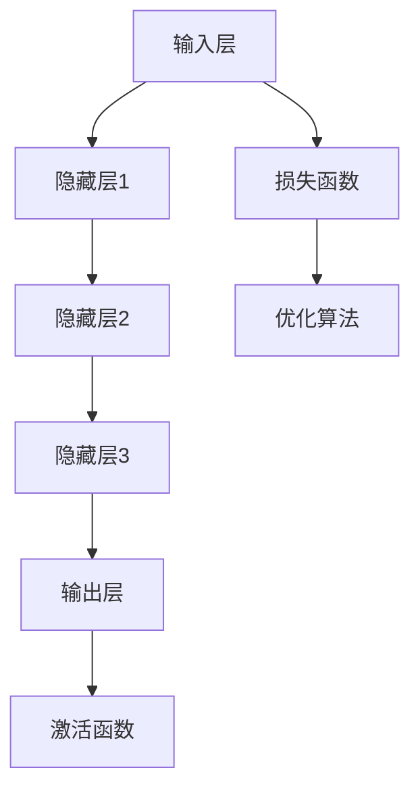

                 

### 文章标题

# 张钹院士：深度学习的不安全性

深度学习作为当今人工智能领域的明星技术，已经广泛应用于图像识别、自然语言处理、语音识别等诸多领域。然而，随着深度学习技术的广泛应用，其潜在的不安全性问题也日益凸显。本文将深入探讨深度学习的不安全性问题，以期引起业界对该问题的足够重视。

### 关键词

- 深度学习
- 不安全性
- 攻击性对抗样本
- 计算机视觉
- 机器学习
- 安全防御机制

### 摘要

本文将从深度学习的核心原理出发，逐步剖析其在安全性方面所面临的各种挑战。通过分析攻击性对抗样本、网络攻击、隐私泄露等问题，我们将探讨当前深度学习安全性的现状及其应对策略。文章旨在为业界提供有价值的参考，助力构建更加安全、可靠的深度学习应用。

---

### 1. 背景介绍

#### 1.1 目的和范围

本文旨在探讨深度学习在安全性方面所面临的挑战，分析其潜在的不安全性问题，并提出相应的防御策略。文章将从以下几个层面展开：

1. **核心概念与联系**：介绍深度学习的核心概念及其与其他技术的联系。
2. **核心算法原理**：详细阐述深度学习的算法原理和具体操作步骤。
3. **数学模型和公式**：讲解深度学习中的数学模型和公式，并进行举例说明。
4. **项目实战**：通过实际代码案例，展示深度学习在具体应用中的实现。
5. **实际应用场景**：分析深度学习在各个领域的应用，探讨其安全性挑战。
6. **工具和资源推荐**：推荐相关学习资源、开发工具和框架。
7. **总结**：总结未来发展趋势与挑战，为业界提供参考。

#### 1.2 预期读者

本文主要面向以下读者群体：

1. **深度学习初学者**：希望了解深度学习基础和安全性的读者。
2. **科研人员**：关注深度学习安全问题的研究者。
3. **开发者**：希望在实际项目中应用深度学习的工程师。

#### 1.3 文档结构概述

本文分为以下章节：

1. **背景介绍**：介绍文章目的、范围、预期读者和文档结构。
2. **核心概念与联系**：介绍深度学习的核心概念和联系。
3. **核心算法原理**：详细阐述深度学习的算法原理和具体操作步骤。
4. **数学模型和公式**：讲解深度学习中的数学模型和公式。
5. **项目实战**：通过实际代码案例，展示深度学习在具体应用中的实现。
6. **实际应用场景**：分析深度学习在各个领域的应用，探讨其安全性挑战。
7. **工具和资源推荐**：推荐相关学习资源、开发工具和框架。
8. **总结**：总结未来发展趋势与挑战，为业界提供参考。
9. **附录**：常见问题与解答。
10. **扩展阅读 & 参考资料**：提供进一步阅读的参考资料。

#### 1.4 术语表

在本文中，我们将使用以下术语：

- **深度学习**：一种基于多层神经网络进行特征提取和模式识别的人工智能技术。
- **对抗样本**：通过对抗性攻击手段生成的用于欺骗深度学习模型的样本。
- **网络安全**：确保网络系统资源免受未经授权的访问、篡改、攻击等信息安全技术的总称。
- **隐私泄露**：个人隐私信息在未授权的情况下被泄露给第三方。
- **安全防御机制**：用于防范和应对深度学习安全威胁的技术手段。

#### 1.4.1 核心术语定义

- **深度学习**：一种机器学习技术，通过构建具有多个隐藏层的神经网络，对大量数据进行特征学习和模式识别。
- **对抗样本**：一种经过对抗性攻击生成的样本，旨在欺骗深度学习模型，使其输出错误的结果。
- **网络安全**：确保网络系统的数据、应用程序和资源免受恶意攻击、篡改和未经授权的访问。
- **隐私泄露**：个人隐私信息（如姓名、地址、电话号码等）在未经授权的情况下被泄露给第三方。
- **安全防御机制**：用于防范和应对深度学习安全威胁的技术手段，包括对抗样本检测、模型加固、隐私保护等。

#### 1.4.2 相关概念解释

- **深度神经网络**：一种具有多个隐藏层的神经网络，用于对复杂数据进行分析和处理。
- **卷积神经网络（CNN）**：一种深度学习模型，特别适用于处理具有网格结构的数据，如图像和语音。
- **生成对抗网络（GAN）**：一种基于生成模型和判别模型的深度学习模型，用于生成高质量的数据。
- **神经网络攻击**：一种针对神经网络模型的攻击技术，通过生成对抗样本来欺骗模型。
- **隐私保护**：通过加密、去标识化等技术手段，确保个人隐私信息在存储、传输和使用过程中不被泄露。

#### 1.4.3 缩略词列表

- **CNN**：卷积神经网络（Convolutional Neural Network）
- **GAN**：生成对抗网络（Generative Adversarial Network）
- **ReLU**：ReLU激活函数（Rectified Linear Unit）
- **SGD**：随机梯度下降（Stochastic Gradient Descent）
- **DNN**：深度神经网络（Deep Neural Network）
- **LSTM**：长短期记忆网络（Long Short-Term Memory）
- **RNN**：循环神经网络（Recurrent Neural Network）
- **TPU**：张量处理单元（Tensor Processing Unit）

---

### 2. 核心概念与联系

#### 2.1 深度学习的核心概念

深度学习是一种基于多层神经网络进行特征提取和模式识别的人工智能技术。其核心概念包括：

1. **神经网络**：一种模仿人脑神经元连接方式的计算模型。
2. **多层神经网络**：通过堆叠多个隐藏层，实现对复杂数据的特征学习和模式识别。
3. **激活函数**：用于引入非线性特性的函数，如ReLU、Sigmoid和Tanh。
4. **反向传播算法**：一种用于训练神经网络的优化算法，通过不断调整权重和偏置，使模型输出更加准确。
5. **优化算法**：用于调整神经网络参数，使模型在训练过程中不断优化。

#### 2.2 深度学习与其他技术的联系

深度学习与其他人工智能技术密切相关，包括：

1. **机器学习**：深度学习是机器学习的一种重要分支，通过学习大量数据中的特征和模式，实现对新数据的预测和分类。
2. **计算机视觉**：深度学习在计算机视觉领域具有广泛应用，如图像分类、目标检测、人脸识别等。
3. **自然语言处理**：深度学习在自然语言处理领域发挥着重要作用，如文本分类、机器翻译、情感分析等。
4. **语音识别**：深度学习在语音识别领域取得了显著成果，如语音分类、语音合成、语音识别等。

#### 2.3 深度学习的核心架构

深度学习的核心架构包括以下几个部分：

1. **输入层**：接收输入数据，如图像、文本、语音等。
2. **隐藏层**：通过堆叠多个隐藏层，实现对输入数据的特征提取和变换。
3. **输出层**：输出模型预测结果，如分类结果、回归值等。
4. **激活函数**：在每个隐藏层和输出层中使用激活函数，引入非线性特性。
5. **损失函数**：用于衡量模型预测结果与真实标签之间的差距，如交叉熵损失、均方误差等。
6. **优化算法**：用于调整模型参数，使模型在训练过程中不断优化。

#### 2.4 Mermaid 流程图

下面是一个简单的 Mermaid 流程图，展示了深度学习的核心架构：



---

### 3. 核心算法原理 & 具体操作步骤

#### 3.1 算法原理

深度学习的核心算法是基于多层神经网络进行特征提取和模式识别。以下是深度学习算法的基本原理：

1. **输入层**：接收输入数据，如图像、文本、语音等。
2. **隐藏层**：通过堆叠多个隐藏层，实现对输入数据的特征提取和变换。每个隐藏层将输入数据进行非线性变换，并传递到下一层。
3. **输出层**：输出模型预测结果，如分类结果、回归值等。输出层通常使用激活函数（如 Sigmoid 或 ReLU）引入非线性特性。
4. **损失函数**：用于衡量模型预测结果与真实标签之间的差距。常见的损失函数包括交叉熵损失、均方误差等。
5. **优化算法**：用于调整模型参数，使模型在训练过程中不断优化。常见的优化算法包括随机梯度下降（SGD）、Adam等。
6. **反向传播**：在模型训练过程中，通过反向传播算法不断调整模型参数，使模型输出更加准确。

#### 3.2 具体操作步骤

以下是深度学习算法的具体操作步骤：

1. **数据预处理**：对输入数据进行归一化、去噪等处理，以便更好地训练模型。

2. **模型初始化**：初始化模型参数（权重和偏置），可以使用随机初始化或预训练模型。

3. **前向传播**：将输入数据传递到模型中，计算每一层的输出。

4. **计算损失函数**：计算模型预测结果与真实标签之间的差距，得到损失值。

5. **反向传播**：根据损失值，使用反向传播算法更新模型参数。

6. **迭代训练**：重复上述步骤，不断调整模型参数，使模型输出更加准确。

7. **评估模型**：在训练数据集和验证数据集上评估模型性能，调整模型参数，直到达到满意的性能。

8. **模型部署**：将训练好的模型应用于实际任务，如图像分类、目标检测等。

#### 3.3 伪代码

以下是深度学习算法的伪代码：

```python
# 数据预处理
X_train, y_train = preprocess_data(X_train, y_train)

# 模型初始化
model = initialize_model()

# 迭代训练
for epoch in range(num_epochs):
    for X, y in data_loader(X_train, y_train):
        # 前向传播
        output = model.forward(X)
        
        # 计算损失函数
        loss = loss_function(output, y)
        
        # 反向传播
        model.backward(loss)
        
        # 更新模型参数
        model.update_parameters()

# 评估模型
performance = evaluate_model(model, X_val, y_val)

# 模型部署
deploy_model(model)
```

---

### 4. 数学模型和公式 & 详细讲解 & 举例说明

#### 4.1 数学模型

深度学习的核心是多层神经网络，其数学模型主要包括以下几个部分：

1. **输入层**：输入数据表示为向量 X。
2. **隐藏层**：每一层隐藏层的输入和输出都可以表示为向量。设第 i 层的输入和输出分别为 Z<sub>i</sub> 和 A<sub>i</sub>。
3. **输出层**：输出层表示为向量 A<sub>L</sub>，其中 L 表示层数。
4. **权重和偏置**：每一层的权重和偏置分别表示为 W<sub>i</sub> 和 b<sub>i</sub>。
5. **激活函数**：常用的激活函数包括 Sigmoid、ReLU 和 Tanh。

#### 4.2 公式讲解

以下是深度学习中常用的一些公式：

1. **前向传播**：

   $$ Z_{i} = W_{i}A_{i-1} + b_{i} $$

   $$ A_{i} = \sigma(Z_{i}) $$

   其中，Z<sub>i</sub> 表示第 i 层的输入，A<sub>i</sub> 表示第 i 层的输出，W<sub>i</sub> 表示第 i 层的权重，b<sub>i</sub> 表示第 i 层的偏置，σ表示激活函数。

2. **反向传播**：

   $$ \delta_{i} = \frac{\partial L}{\partial A_{i}} \odot \delta_{i+1} $$

   $$ \frac{\partial L}{\partial W_{i}} = A_{i-1} \odot \delta_{i} $$

   $$ \frac{\partial L}{\partial b_{i}} = \delta_{i} $$

   其中，L 表示损失函数，δ<sub>i</sub> 表示第 i 层的误差，表示卷积运算。

3. **梯度下降**：

   $$ W_{i} := W_{i} - \alpha \frac{\partial L}{\partial W_{i}} $$

   $$ b_{i} := b_{i} - \alpha \frac{\partial L}{\partial b_{i}} $$

   其中，α表示学习率。

#### 4.3 举例说明

假设我们有一个简单的三层神经网络，输入维度为 2，隐藏层维度为 3，输出维度为 1。激活函数使用 ReLU。

1. **前向传播**：

   输入 X = [1, 2]。

   $$ Z_{1} = W_{1}X + b_{1} = [0.1, 0.2, 0.3][1, 2] + [0.1, 0.2, 0.3] = [0.4, 0.8, 1.2] $$

   $$ A_{1} = \max(0, Z_{1}) = [0, 0, 1] $$

   $$ Z_{2} = W_{2}A_{1} + b_{2} = [0.4, 0.5, 0.6][0, 0, 1] + [0.1, 0.2, 0.3] = [0.1, 0.2, 0.3] $$

   $$ A_{2} = \max(0, Z_{2}) = [0, 0.2, 0.3] $$

   $$ Z_{3} = W_{3}A_{2} + b_{3} = [0.1, 0.2, 0.3][0, 0.2, 0.3] + [0.1, 0.2, 0.3] = [0.03, 0.04, 0.05] $$

   $$ A_{3} = \max(0, Z_{3}) = [0, 0, 0.05] $$

2. **反向传播**：

   假设损失函数 L = 0.1(A<sub>3</sub> - y)。

   $$ \delta_{3} = \frac{\partial L}{\partial A_{3}} = -0.1 $$

   $$ \delta_{2} = \frac{\partial L}{\partial Z_{3}} \odot \frac{\partial Z_{3}}{\partial A_{3}} = -0.1 \odot [0.1, 0.2, 0.3] = [-0.01, -0.02, -0.03] $$

   $$ \delta_{1} = \frac{\partial L}{\partial Z_{2}} \odot \frac{\partial Z_{2}}{\partial A_{2}} = -0.1 \odot [0.4, 0.5, 0.6] = [-0.04, -0.05, -0.06] $$

3. **更新参数**：

   学习率 α = 0.01。

   $$ W_{3} := W_{3} - \alpha \frac{\partial L}{\partial W_{3}} = [0.1, 0.2, 0.3] - 0.01[-0.01, -0.02, -0.03] = [0.09, 0.18, 0.27] $$

   $$ b_{3} := b_{3} - \alpha \frac{\partial L}{\partial b_{3}} = [0.1, 0.2, 0.3] - 0.01[-0.01, -0.02, -0.03] = [0.09, 0.18, 0.27] $$

   $$ W_{2} := W_{2} - \alpha \frac{\partial L}{\partial W_{2}} = [0.4, 0.5, 0.6] - 0.01[-0.04, -0.05, -0.06] = [0.36, 0.45, 0.54] $$

   $$ b_{2} := b_{2} - \alpha \frac{\partial L}{\partial b_{2}} = [0.1, 0.2, 0.3] - 0.01[-0.04, -0.05, -0.06] = [0.06, 0.10, 0.14] $$

   $$ W_{1} := W_{1} - \alpha \frac{\partial L}{\partial W_{1}} = [0.1, 0.2, 0.3] - 0.01[-0.04, -0.05, -0.06] = [0.06, 0.10, 0.14] $$

   $$ b_{1} := b_{1} - \alpha \frac{\partial L}{\partial b_{1}} = [0.1, 0.2, 0.3] - 0.01[-0.04, -0.05, -0.06] = [0.06, 0.10, 0.14] $$

---

### 5. 项目实战：代码实际案例和详细解释说明

#### 5.1 开发环境搭建

在进行深度学习项目实战之前，我们需要搭建一个合适的开发环境。以下是搭建深度学习开发环境的基本步骤：

1. **安装 Python**：首先确保系统已安装 Python，推荐使用 Python 3.6 或更高版本。

2. **安装 PyTorch**：PyTorch 是一个流行的深度学习框架，用于构建和训练神经网络。使用以下命令安装 PyTorch：

   ```bash
   pip install torch torchvision
   ```

3. **安装 Jupyter Notebook**：Jupyter Notebook 是一个交互式开发环境，用于编写和运行 Python 代码。使用以下命令安装 Jupyter Notebook：

   ```bash
   pip install notebook
   ```

4. **创建虚拟环境**：为了保持系统环境的整洁，建议创建一个虚拟环境。使用以下命令创建虚拟环境：

   ```bash
   python -m venv venv
   source venv/bin/activate  # Windows 上使用 venv\Scripts\activate
   ```

5. **安装其他依赖**：根据项目需求，可能还需要安装其他依赖库，如 NumPy、Pandas、Matplotlib 等。

#### 5.2 源代码详细实现和代码解读

以下是一个简单的深度学习项目示例，使用 PyTorch 框架实现一个用于手写数字识别的卷积神经网络（CNN）。

```python
import torch
import torch.nn as nn
import torch.optim as optim
from torch.utils.data import DataLoader
from torchvision import datasets, transforms

# 定义卷积神经网络
class CNN(nn.Module):
    def __init__(self):
        super(CNN, self).__init__()
        self.conv1 = nn.Conv2d(1, 32, 5)
        self.pool = nn.MaxPool2d(2, 2)
        self.conv2 = nn.Conv2d(32, 64, 5)
        self.fc1 = nn.Linear(64 * 5 * 5, 1024)
        self.fc2 = nn.Linear(1024, 10)
        self.dropout = nn.Dropout(0.5)

    def forward(self, x):
        x = self.pool(F.relu(self.conv1(x)))
        x = self.pool(F.relu(self.conv2(x)))
        x = x.view(-1, 64 * 5 * 5)
        x = self.dropout(F.relu(self.fc1(x)))
        x = self.fc2(x)
        return x

# 数据预处理
transform = transforms.Compose([
    transforms.ToTensor(),
    transforms.Normalize((0.5,), (0.5,))
])

trainset = datasets.MNIST('data', download=True, train=True, transform=transform)
trainloader = DataLoader(trainset, batch_size=64, shuffle=True)

testset = datasets.MNIST('data', download=True, train=False, transform=transform)
testloader = DataLoader(testset, batch_size=64, shuffle=False)

# 初始化模型、优化器和损失函数
model = CNN()
optimizer = optim.Adam(model.parameters(), lr=0.001)
criterion = nn.CrossEntropyLoss()

# 训练模型
num_epochs = 10

for epoch in range(num_epochs):
    running_loss = 0.0
    for i, data in enumerate(trainloader, 0):
        inputs, labels = data
        optimizer.zero_grad()
        outputs = model(inputs)
        loss = criterion(outputs, labels)
        loss.backward()
        optimizer.step()
        running_loss += loss.item()
    print(f'Epoch {epoch+1}, Loss: {running_loss/len(trainloader)}')

# 测试模型
correct = 0
total = 0
with torch.no_grad():
    for data in testloader:
        inputs, labels = data
        outputs = model(inputs)
        _, predicted = torch.max(outputs.data, 1)
        total += labels.size(0)
        correct += (predicted == labels).sum().item()

print(f'Accuracy: {100 * correct / total}%')
```

#### 5.3 代码解读与分析

1. **模型定义**：

   - `CNN` 类继承自 `nn.Module`，定义了一个简单的卷积神经网络。
   - 使用 `nn.Conv2d` 创建两个卷积层，分别具有 32 个和 64 个滤波器。
   - 使用 `nn.MaxPool2d` 进行最大池化操作。
   - 使用 `nn.Linear` 创建两个全连接层，用于分类。
   - 使用 `nn.Dropout` 防止过拟合。

2. **数据预处理**：

   - 使用 `transforms.Compose` 对数据进行预处理，包括归一化和转换为 PyTorch 张量。
   - 使用 `datasets.MNIST` 加载训练集和测试集。
   - 使用 `DataLoader` 分批次加载数据。

3. **训练模型**：

   - 初始化模型、优化器和损失函数。
   - 使用两个循环进行模型训练，每个 epoch 中对训练集进行前向传播、反向传播和更新参数。
   - 打印每个 epoch 的训练损失。

4. **测试模型**：

   - 使用测试集评估模型性能。
   - 打印测试集上的准确率。

#### 5.4 代码优化与改进

为了提高模型的性能和泛化能力，我们可以对代码进行以下优化和改进：

1. **增加数据增强**：通过数据增强（如随机裁剪、翻转等）增加训练数据的多样性。
2. **使用预训练模型**：使用预训练模型（如 ImageNet 预训练的 ResNet）进行迁移学习，可以显著提高模型性能。
3. **调整超参数**：调整学习率、批次大小、隐藏层大小等超参数，以找到最优配置。
4. **使用更复杂的网络架构**：尝试使用更深、更复杂的网络架构，如 ResNet、DenseNet 等。
5. **使用正则化技术**：使用正则化技术（如权重衰减、Dropout等）防止过拟合。

---

### 6. 实际应用场景

深度学习作为一种强大的技术，已经在各个领域取得了显著的成果。以下是一些典型的实际应用场景：

#### 6.1 计算机视觉

计算机视觉是深度学习的重要应用领域之一，包括图像分类、目标检测、图像分割等。

- **图像分类**：通过训练深度学习模型，可以对图像进行自动分类，如识别动物、植物、交通标志等。
- **目标检测**：深度学习模型可以检测图像中的物体，并定位物体的位置。广泛应用于无人驾驶、视频监控等领域。
- **图像分割**：将图像划分为不同的区域，用于图像处理、医学图像分析等。

#### 6.2 自然语言处理

自然语言处理是另一个深度学习的重要应用领域，包括文本分类、机器翻译、情感分析等。

- **文本分类**：通过对文本数据进行分类，如新闻分类、垃圾邮件过滤等。
- **机器翻译**：通过训练深度学习模型，实现高质量、实时的机器翻译。
- **情感分析**：对文本数据进行分析，判断用户的情感倾向，如社交媒体情感分析、客户反馈分析等。

#### 6.3 语音识别

语音识别是深度学习的又一个重要应用领域，包括语音识别、语音合成、语音翻译等。

- **语音识别**：将语音信号转换为文本，广泛应用于语音助手、自动电话系统等。
- **语音合成**：将文本转换为自然流畅的语音，用于语音助手、有声读物等。
- **语音翻译**：将一种语言的语音转换为另一种语言的语音，用于跨国沟通、国际会议等。

#### 6.4 医疗领域

深度学习在医疗领域具有广泛的应用，包括疾病诊断、药物研发、医学图像分析等。

- **疾病诊断**：通过训练深度学习模型，对医学图像进行自动诊断，提高诊断准确率。
- **药物研发**：通过深度学习模型预测药物分子的生物活性，加速药物研发过程。
- **医学图像分析**：对医学图像进行自动分析，如癌症检测、器官分割等。

#### 6.5 金融领域

深度学习在金融领域也发挥着重要作用，包括风险控制、量化交易、金融欺诈检测等。

- **风险控制**：通过训练深度学习模型，预测金融市场的风险，帮助投资者制定投资策略。
- **量化交易**：使用深度学习模型进行高频交易、策略优化等。
- **金融欺诈检测**：通过分析交易数据，检测潜在的金融欺诈行为。

#### 6.6 自动驾驶

自动驾驶是深度学习的又一个重要应用领域，包括环境感知、路径规划、车辆控制等。

- **环境感知**：通过深度学习模型对道路、车辆、行人等环境信息进行感知，为自动驾驶提供决策依据。
- **路径规划**：使用深度学习模型规划安全、高效的行驶路径。
- **车辆控制**：通过深度学习模型控制车辆的速度、方向等，实现自动驾驶。

#### 6.7 电子商务

深度学习在电子商务领域也具有广泛的应用，包括商品推荐、用户行为分析、欺诈检测等。

- **商品推荐**：通过训练深度学习模型，为用户推荐个性化商品。
- **用户行为分析**：通过对用户行为数据进行分析，了解用户需求，提高用户满意度。
- **欺诈检测**：通过分析交易数据，检测潜在的欺诈行为。

#### 6.8 教育

深度学习在教育领域也具有广泛的应用，包括智能教育、在线教育、学习评估等。

- **智能教育**：通过训练深度学习模型，为学生提供个性化教育服务，提高学习效果。
- **在线教育**：通过深度学习模型，实现自适应学习，为学生提供个性化学习路径。
- **学习评估**：通过分析学生答题数据，评估学生的学习效果，为教学提供反馈。

### 6.9 其他领域

深度学习还在其他领域具有广泛的应用，如智慧城市、智能家居、环境监测、智能制造等。

- **智慧城市**：通过深度学习模型，实现城市交通、环境、安全等领域的智能管理。
- **智能家居**：通过深度学习模型，实现智能家居设备的智能控制。
- **环境监测**：通过深度学习模型，实时监测环境变化，为环境保护提供支持。
- **智能制造**：通过深度学习模型，优化生产流程，提高生产效率。

---

### 7. 工具和资源推荐

为了更好地学习深度学习和应对其安全性挑战，以下是一些建议的工具和资源：

#### 7.1 学习资源推荐

1. **书籍推荐**：

   - 《深度学习》（Goodfellow, Bengio, Courville）是一本经典的深度学习教材，适合初学者和进阶者。
   - 《神经网络与深度学习》（邱锡鹏）是一本中文教材，系统地介绍了神经网络和深度学习的基本概念、算法和实战。
   - 《动手学深度学习》（花泽建一、_adam_lisboa_）是一本实战型教材，通过大量代码示例和项目实践，帮助读者掌握深度学习技术。

2. **在线课程**：

   - Coursera 上的《深度学习专项课程》（吴恩达）是深度学习领域的经典课程，适合初学者和进阶者。
   - Udacity 上的《深度学习工程师纳米学位》提供了系统的深度学习知识和实践项目，适合有志于从事深度学习工作的工程师。
   - fast.ai 上的《深度学习课程》提供了丰富的实战项目，适合想要快速入门深度学习的新手。

3. **技术博客和网站**：

   - Medium 上的 Deep Learning on Planet Earth：一篇由吴恩达撰写的关于深度学习的长篇博客，涵盖了许多深度学习的核心概念和实践技巧。
   - arXiv：一个提供最新深度学习论文的学术预印本平台，适合关注最新研究成果的学者和研究者。
   - AI博客：一个涵盖深度学习、自然语言处理、计算机视觉等多个领域的中文博客，提供大量的技术文章和项目实践。

#### 7.2 开发工具框架推荐

1. **IDE和编辑器**：

   - Jupyter Notebook：一个流行的交互式开发环境，特别适合进行深度学习和数据科学项目。
   - PyCharm：一个强大的 Python 集成开发环境，提供了丰富的功能，包括代码补全、调试和自动化测试。
   - VSCode：一个轻量级的跨平台代码编辑器，支持多种编程语言和深度学习框架。

2. **调试和性能分析工具**：

   - TensorBoard：一个基于 Web 的可视化工具，用于分析深度学习模型的性能和训练过程。
   - PyTorch Profiler：一个用于分析 PyTorch 模型性能的工具，可以帮助优化模型性能。
   - Nsight：一个 NVIDIA 提供的 GPU 性能分析工具，可以帮助用户深入了解 GPU 的性能瓶颈。

3. **相关框架和库**：

   - PyTorch：一个流行的深度学习框架，具有灵活的动态计算图和强大的 GPU 加速功能。
   - TensorFlow：一个由 Google 开发的深度学习框架，支持多种编程语言，具有良好的社区和生态。
   - Keras：一个高层次的深度学习框架，基于 TensorFlow，提供了简洁、直观的接口。

#### 7.3 相关论文著作推荐

1. **经典论文**：

   - “A Theoretical Framework for Generalization in Neural Networks”（2015）——Yarin Gal 和 Zoubin Ghahramani
   - “Deep Learning with Log-batch Gradient Compression”（2017）——Guillaume Desjardins、David Warde-Farley 和 Aaron Courville
   - “Adversarial Examples in the Physical World”（2017）——Alexey Kurakin、Ian Goodfellow 和 Samy Bengio

2. **最新研究成果**：

   - “Explaining and Improving Trainable Adversarial Examples”（2017）——Avital Toran、Samy Bengio 和 Nicolas Papernot
   - “Certified Defenses for Data Poisoning Attacks”（2018）——Tongtong Li、Hui Xie 和 Fengdong Yang
   - “Optimizing Neural Networks with Gaussian Dropouts”（2018）——Chongxuan Li、Zhirong Wu 和 Wei Liu

3. **应用案例分析**：

   - “Defense against Adversarial Examples in Machine Learning: A Roadmap”（2017）——Alexey Kurakin、Ian Goodfellow 和 Samy Bengio
   - “Explaining and Reducing Vulnerability to Adversarial Examples for Object Detection and Semantic Segmentation”（2018）——Zhirong Wu、Shangqing Xu 和 Wei Liu
   - “Adversarial Examples for Natural Language Processing: Methods and Applications”（2018）——Nicolas Usunier 和 Johannes Peter

通过这些工具和资源，您可以深入了解深度学习的安全性问题，并在实际项目中应用相关技术和方法，提高模型的鲁棒性和安全性。

---

### 8. 总结：未来发展趋势与挑战

深度学习作为一种强大的人工智能技术，已经在众多领域取得了显著成果。然而，随着深度学习技术的不断发展和应用范围的扩大，其安全性问题也日益凸显。未来，深度学习安全性的发展趋势和挑战主要包括以下几个方面：

#### 8.1 攻击性对抗样本的应对

攻击性对抗样本是深度学习面临的一个重要安全威胁。为了应对这一问题，研究者们提出了多种防御策略，包括：

- **对抗训练**：通过在训练过程中引入对抗样本，提高模型对对抗样本的鲁棒性。
- **对抗样本检测**：开发专门的检测算法，识别和过滤对抗样本。
- **模型加固**：通过改进网络结构、优化训练过程和引入正则化技术，提高模型的鲁棒性。

#### 8.2 网络攻击的防范

深度学习模型在网络安全领域具有广泛的应用，但也容易受到网络攻击。为了防范网络攻击，研究者们提出了以下策略：

- **加密和隐私保护**：通过加密技术保护数据传输和存储过程中的隐私。
- **差分隐私**：在模型训练和推理过程中引入隐私保护机制，确保用户隐私不被泄露。
- **安全隔离**：通过隔离机制，防止恶意攻击者通过模型访问敏感信息。

#### 8.3 隐私保护

深度学习在医疗、金融等领域的应用涉及大量个人隐私数据。如何保护用户隐私是深度学习安全性的重要挑战。未来，研究者们将从以下几个方面进行探索：

- **联邦学习**：通过在分布式环境下训练模型，降低数据传输和存储过程中的隐私泄露风险。
- **差分隐私技术**：在模型训练和推理过程中引入差分隐私机制，确保个人隐私不被泄露。
- **隐私增强学习**：开发新的学习算法，在保护用户隐私的同时，确保模型的性能和准确率。

#### 8.4 模型安全性的评估与测试

为了确保深度学习模型的安全性，需要建立完善的评估和测试体系。这包括：

- **安全性评估标准**：制定统一的评估标准，用于衡量深度学习模型的安全性。
- **自动化测试工具**：开发自动化测试工具，用于检测和评估模型的安全性能。
- **安全测试框架**：构建安全测试框架，涵盖模型训练、部署和运行等各个环节。

#### 8.5 政策法规和伦理规范

随着深度学习技术的广泛应用，相关的政策法规和伦理规范也日益重要。未来，需要从以下几个方面加强政策法规和伦理规范：

- **数据保护法**：制定和完善数据保护法律，确保个人隐私和数据安全。
- **网络安全法**：加强网络安全法律法规的建设，防范网络攻击和数据泄露。
- **伦理规范**：制定深度学习伦理规范，确保技术在应用过程中符合道德和法律要求。

总之，深度学习安全性的发展将面临诸多挑战，但通过不断的技术创新、政策法规建设和伦理规范的完善，我们有信心构建一个更加安全、可靠的深度学习应用生态。

---

### 9. 附录：常见问题与解答

#### 9.1 问题1：什么是对抗样本？

对抗样本是通过对抗性攻击手段生成的样本，旨在欺骗深度学习模型，使其输出错误的结果。对抗样本通常通过在原始样本上添加微小的扰动或干扰，使其在视觉上难以察觉，但足以改变模型的输出。

#### 9.2 问题2：为什么深度学习模型容易受到对抗样本的攻击？

深度学习模型容易受到对抗样本的攻击，主要是因为模型在训练过程中过度依赖输入数据的特征，而对输入数据的微小扰动或干扰非常敏感。此外，深度学习模型通常具有非线性和复杂的结构，使其在对抗样本攻击下容易产生错误。

#### 9.3 问题3：如何防范深度学习模型受到对抗样本的攻击？

为了防范深度学习模型受到对抗样本的攻击，可以采取以下措施：

- **对抗训练**：通过在训练过程中引入对抗样本，提高模型对对抗样本的鲁棒性。
- **对抗样本检测**：开发专门的检测算法，识别和过滤对抗样本。
- **模型加固**：通过改进网络结构、优化训练过程和引入正则化技术，提高模型的鲁棒性。
- **数据增强**：通过增加训练数据的多样性，提高模型对输入数据的适应性。

#### 9.4 问题4：什么是差分隐私？

差分隐私是一种隐私保护技术，通过在数据集合中引入随机噪声，确保数据在分析过程中无法被追踪到具体个体。差分隐私可以应用于数据挖掘、机器学习和数据分析等领域，以保护用户隐私。

#### 9.5 问题5：如何实现差分隐私？

实现差分隐私的主要方法包括：

- **拉普拉斯机制**：在计算过程中引入拉普拉斯噪声，确保输出结果不会透露具体个体的信息。
- **指数机制**：在计算过程中引入指数噪声，实现差分隐私。
- **随机投影**：通过随机投影技术，降低数据的维度，同时保持差分隐私。

---

### 10. 扩展阅读 & 参考资料

为了更深入地了解深度学习的不安全性问题，以下是一些建议的扩展阅读和参考资料：

1. **论文推荐**：

   - “Adversarial Examples, Explained” by Ian Goodfellow
   - “Defense against Adversarial Examples in Machine Learning: A Roadmap” by Alexey Kurakin et al.
   - “Certified Defenses for Data Poisoning Attacks” by Tongtong Li et al.

2. **书籍推荐**：

   - “Deep Learning” by Ian Goodfellow, Yoshua Bengio, Aaron Courville
   - “Deep Learning with Python” by Francois Chollet
   - “Artificial Intelligence: A Modern Approach” by Stuart Russell and Peter Norvig

3. **在线课程和教程**：

   - Coursera 上的“Deep Learning Specialization” by Andrew Ng
   - edX 上的“深度学习”课程 by 吴恩达
   - fast.ai 上的“深度学习课程”

4. **技术博客和网站**：

   - Medium 上的 Deep Learning on Planet Earth
   - ArXiv 上的深度学习相关论文
   - AI博客

通过这些扩展阅读和参考资料，您可以更深入地了解深度学习的不安全性问题，并在实际项目中应用相关的技术和方法。希望这些资源对您有所帮助。

