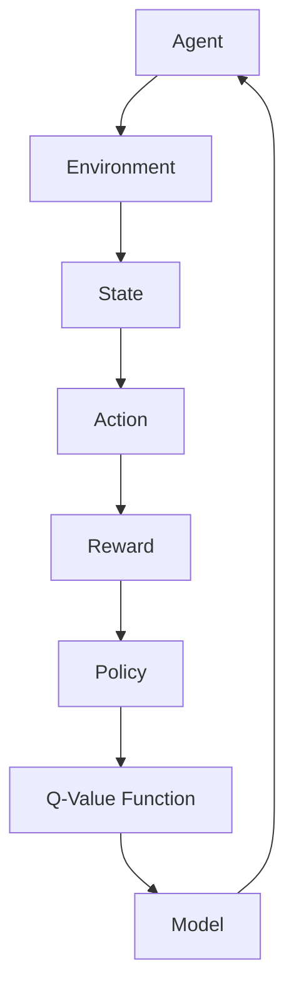

                 

### 文章标题

# 强化学习(Reinforcement Learning) - 原理与代码实例讲解

强化学习是一种在动态环境中通过不断尝试和错误，利用反馈信号来优化决策过程的学习方法。它被广泛应用于游戏、机器人控制、推荐系统等多个领域，逐渐成为人工智能领域的重要分支。本文将深入探讨强化学习的核心概念、算法原理，并通过实际代码实例详细讲解其实现过程，帮助读者全面理解这一先进的学习范式。

## 关键词

- 强化学习
- Q-learning
- DQN
- Sarsa
- 环境建模
- 奖励函数
- 多智能体系统
- 实战案例

## 摘要

本文将围绕强化学习这一主题，首先介绍其基本概念和历史背景，接着详细解析强化学习的核心算法原理，包括Q-learning、DQN、Sarsa等，并使用伪代码和数学公式进行阐述。随后，通过具体的项目实战案例，引导读者亲手实现这些算法，并提供详细的代码解读和分析。最后，文章将探讨强化学习在实际应用中的场景，推荐相关学习资源和工具，并总结未来发展趋势与挑战。通过本文的阅读，读者将能够系统掌握强化学习的基本理论和方法，为后续研究和应用打下坚实基础。

---

### 背景介绍

#### 1.1 目的和范围

本文的目的是帮助读者全面理解强化学习的基本概念、核心算法原理，并通过实际代码实例讲解其应用实践。本文将重点讨论以下内容：

1. 强化学习的基本概念和主要算法，如Q-learning、DQN、Sarsa等。
2. 强化学习的数学模型和主要公式。
3. 强化学习的实际应用场景和案例分析。
4. 强化学习的工具和资源推荐。

本文适用于对人工智能和机器学习有一定了解，希望深入了解强化学习算法的读者。无论您是数据科学家、软件工程师，还是对AI有兴趣的学术研究者，都可以通过本文的学习，提升在强化学习领域的实践能力。

#### 1.2 预期读者

本文主要面向以下几类读者：

1. **数据科学家和机器学习工程师**：希望了解和掌握强化学习算法，并将其应用于实际项目中的专业人士。
2. **软件工程师和AI爱好者**：对人工智能技术感兴趣，希望通过学习算法原理提升自身技术水平。
3. **学术研究者**：希望深入探讨强化学习理论，为后续研究提供理论基础。

#### 1.3 文档结构概述

本文结构如下：

1. **背景介绍**：介绍本文的目的、预期读者以及文档结构。
2. **核心概念与联系**：通过Mermaid流程图详细展示强化学习的核心概念和架构。
3. **核心算法原理**：解析Q-learning、DQN、Sarsa等核心算法原理，使用伪代码进行详细讲解。
4. **数学模型和公式**：介绍强化学习的数学模型，使用latex格式详细阐述。
5. **项目实战**：通过具体代码实例，展示强化学习在实际项目中的应用。
6. **实际应用场景**：讨论强化学习在不同领域的应用。
7. **工具和资源推荐**：推荐学习资源和工具，包括书籍、在线课程、技术博客等。
8. **总结**：总结强化学习的发展趋势与挑战。
9. **附录**：提供常见问题与解答。
10. **扩展阅读**：推荐相关参考资料。

#### 1.4 术语表

为了确保本文的清晰易懂，以下列出一些核心术语的定义和解释：

##### 1.4.1 核心术语定义

- **强化学习**：一种通过试错和反馈信号来优化决策过程的学习方法。
- **状态**：环境中的某个特定情况。
- **动作**：从当前状态采取的动作。
- **奖励**：对采取的动作给予的正面或负面反馈。
- **策略**：决策模型，决定在给定状态下采取哪个动作。
- **Q值**：在特定状态下采取某个动作的预期奖励。
- **探索**：为了获取更多信息而采取随机动作的行为。
- **利用**：根据已有信息采取最佳动作的行为。

##### 1.4.2 相关概念解释

- **Q-learning**：一种基于值函数的强化学习算法，通过更新Q值来优化策略。
- **DQN**（Deep Q-Network）：使用深度神经网络来近似Q值函数的强化学习算法。
- **Sarsa**：一种基于策略的强化学习算法，考虑了当前状态和下一步状态的联合概率。

##### 1.4.3 缩略词列表

- **RL**：强化学习（Reinforcement Learning）
- **Q-learning**：Q值学习（Q-Learning）
- **DQN**：深度Q网络（Deep Q-Network）
- **Sarsa**：即时差异学习（State-Action-Reward-State-Action，简称Sarsa）

通过本文的学习，读者将对强化学习有更深入的理解，并能将其应用于实际项目中，解决复杂的决策问题。

---

### 核心概念与联系

强化学习作为一个复杂的领域，涉及多个核心概念和联系。为了帮助读者更好地理解这些概念，我们将通过一个Mermaid流程图来详细展示强化学习的核心概念和架构。



在这个流程图中：

- **Agent（智能体）**：执行动作并接收环境的反馈。
- **Environment（环境）**：为智能体提供状态和奖励。
- **State（状态）**：环境中的某个特定情况。
- **Action（动作）**：智能体能够采取的行为。
- **Reward（奖励）**：对智能体采取的动作给予的反馈。
- **Policy（策略）**：智能体在特定状态下采取的动作决策。
- **Q-Value Function（Q值函数）**：预测在特定状态下采取特定动作的预期奖励。
- **Model（模型）**：用于表示环境动态和奖励机制的数学模型。

这些概念和联系构成了强化学习的基本框架。接下来，我们将深入探讨这些概念的具体含义和作用。

#### 强化学习的基本框架

强化学习的基本框架可以概括为四个要素：智能体（Agent）、环境（Environment）、状态（State）、动作（Action），以及策略（Policy）和奖励（Reward）。以下是对这些要素的详细解释：

1. **智能体（Agent）**：在强化学习中，智能体是一个自主决策的实体，它通过与环境交互来学习和优化其行为。智能体的目标是最大化累积奖励，以实现某种目标。智能体可以是机器人、软件代理或任何能够接收输入并生成输出的实体。

2. **环境（Environment）**：环境是智能体所处的世界，它定义了智能体可以观测到的状态和可以采取的动作。环境可以是一个物理空间，如机器人实验室，也可以是一个虚拟环境，如游戏世界。环境会根据智能体的动作生成新的状态，并给予相应的奖励。

3. **状态（State）**：状态是环境中的一个特定情况，它是智能体决策的依据。状态可以是连续的，也可以是离散的。智能体需要通过感知器或其他传感器来获取当前状态的信息，并将其作为输入进行处理。

4. **动作（Action）**：动作是智能体在特定状态下能够采取的行为。动作可以是连续的，也可以是离散的。智能体的目标是选择一个动作，以期望获得最大的累积奖励。

5. **策略（Policy）**：策略是智能体的行为规则，它决定了智能体在给定状态下应该采取哪个动作。策略可以通过经验学习、预先定义或结合两者来生成。强化学习的一个核心目标就是优化策略，以使智能体能够在动态环境中实现最佳行为。

6. **奖励（Reward）**：奖励是环境对智能体采取的动作给予的反馈。奖励可以是正面的（奖励值大于0），也可以是负面的（奖励值小于0）。奖励的目的是激励智能体采取有利于目标实现的行为，并惩罚不利于目标的行为。奖励值可以是一个标量，也可以是一个向量。

#### 强化学习的过程

强化学习的过程可以概括为以下步骤：

1. **初始状态**：智能体开始于环境的某个初始状态。
2. **选择动作**：智能体根据当前状态和策略选择一个动作。
3. **执行动作**：智能体在环境中执行所选动作。
4. **获得反馈**：环境根据智能体的动作生成新的状态和相应的奖励。
5. **更新策略**：智能体利用获得的奖励更新其策略，以优化未来的决策。
6. **重复过程**：智能体重复上述过程，不断学习和改进其行为。

#### 强化学习的挑战

尽管强化学习在理论上具有强大的能力，但在实际应用中仍面临一些挑战：

1. **探索与利用的平衡**：智能体需要在探索（尝试新的动作）和利用（基于已有信息采取最佳动作）之间找到平衡。如果完全探索，可能导致效率低下；如果完全利用，可能无法发现更好的策略。
2. **状态和动作空间**：对于具有大量状态和动作的组合，智能体需要大量时间和计算资源来学习最优策略。
3. **连续性问题**：在连续状态和动作空间中，强化学习算法的实现变得更加复杂。
4. **模型不确定性**：环境中的不确定性使得智能体难以预测未来的状态和奖励，从而增加了学习难度。

#### 强化学习与其他学习方法的比较

强化学习与其他机器学习方法（如监督学习和无监督学习）有以下区别：

1. **监督学习**：在监督学习中，训练数据集包含输入和对应的输出，算法通过学习输入和输出之间的映射来优化模型。监督学习的目标是最小化预测误差。
2. **无监督学习**：在无监督学习中，算法从未标记的数据中学习，发现数据中的隐含结构和模式。无监督学习的目标通常是聚类、降维或生成模型。
3. **强化学习**：强化学习通过智能体与环境的交互，不断尝试和错误，通过奖励信号来优化决策过程。强化学习的目标是最小化长期奖励的期望值。

通过理解强化学习的基本框架和过程，读者可以更好地把握其核心概念和原理，为后续的算法解析和应用打下基础。

---

### 核心算法原理 & 具体操作步骤

强化学习算法的核心目标是学习一个最优策略，使智能体在动态环境中获得最大的累积奖励。本文将介绍几种重要的强化学习算法：Q-learning、DQN和Sarsa。这些算法通过不同的方式实现这一目标，下面将使用伪代码详细阐述这些算法的原理和具体操作步骤。

#### Q-learning算法

Q-learning算法是一种基于值函数的强化学习算法，通过更新Q值来优化策略。以下是其基本原理和伪代码：

##### 基本原理

Q-learning算法的核心思想是利用过去的经验来预测未来，即通过当前状态和动作的Q值，预测在下一个状态和动作下的Q值。算法通过迭代更新Q值，逐渐优化策略，以实现最大累积奖励。

##### 伪代码

```plaintext
初始化：
- Q(s, a) = 0 （所有状态的初始Q值设为0）
- ε（epsilon）为探索率，控制随机动作的几率

循环（进行N次迭代）：
- 选择动作：a = ε-greedy Policy(s)
- 执行动作，获得奖励r和下一个状态s'
- 更新Q值：Q(s, a) = Q(s, a) + α [r + γ max(Q(s', a')) - Q(s, a)]

终止条件：
- 最大迭代次数N达到
- 收敛条件：Q值的更新趋于稳定
```

##### 具体操作步骤

1. **初始化**：初始化所有状态的Q值为0，设置探索率ε。
2. **选择动作**：采用ε-greedy策略选择动作。ε-greedy策略是指在给定状态下，以概率ε随机选择动作，以概率1-ε选择使当前Q值最大的动作。
3. **执行动作**：执行所选动作，并获取奖励r和下一个状态s'。
4. **更新Q值**：根据更新公式，利用奖励r、γ（折扣因子）和下一个状态的Q值来更新当前状态的Q值。
5. **迭代**：重复上述步骤，直到达到最大迭代次数或收敛条件。

#### DQN算法

DQN（Deep Q-Network）算法是一种使用深度神经网络来近似Q值函数的强化学习算法。以下是其基本原理和伪代码：

##### 基本原理

DQN算法通过深度神经网络来近似Q值函数，从而解决状态和动作空间维度高的问题。算法采用经验回放（Experience Replay）和目标网络（Target Network）来提高学习效率和稳定性。

##### 伪代码

```plaintext
初始化：
- 初始化深度神经网络DQN和目标网络Target DQN
- Q(s, a) = 0 （所有状态的初始Q值设为0）
- ε（epsilon）为探索率，控制随机动作的几率

循环（进行N次迭代）：
- 选择动作：a = ε-greedy Policy(s)
- 执行动作，获得奖励r和下一个状态s'
- 存储经验：(s, a, r, s') 到经验池
- 从经验池中随机抽取一批经验
- 更新经验池：经验池容量设为C
- 如果随机抽取的批次中的经验包含终止状态，则从经验池中删除该经验
- 更新DQN：利用随机抽取的批次经验，通过梯度下降法更新DQN的参数
- 更新目标网络：每k次迭代，更新一次目标网络的参数为目标网络的当前参数
- 更新Q值：Q(s, a) = Q(s, a) + α [r + γ max(Q'(s', a')) - Q(s, a)]

终止条件：
- 最大迭代次数N达到
- 收敛条件：Q值的更新趋于稳定
```

##### 具体操作步骤

1. **初始化**：初始化深度神经网络DQN和目标网络Target DQN，以及所有状态的初始Q值为0，设置探索率ε。
2. **选择动作**：采用ε-greedy策略选择动作。
3. **执行动作**：执行所选动作，并获取奖励r和下一个状态s'。
4. **存储经验**：将(s, a, r, s')这一组经验存储到经验池中。
5. **更新经验池**：从经验池中随机抽取一批经验，根据经验池的容量C进行更新。
6. **更新DQN**：利用随机抽取的批次经验，通过梯度下降法更新DQN的参数。
7. **更新目标网络**：每隔k次迭代，更新一次目标网络的参数，使其为目标网络的当前参数。
8. **更新Q值**：根据更新公式，利用奖励r、γ和目标网络的Q值来更新当前状态的Q值。
9. **迭代**：重复上述步骤，直到达到最大迭代次数或收敛条件。

#### Sarsa算法

Sarsa算法是一种基于策略的强化学习算法，与Q-learning类似，但考虑了当前状态和下一步状态的联合概率。以下是其基本原理和伪代码：

##### 基本原理

Sarsa算法通过即时差异更新（Immediate Difference Update）来优化策略，即不仅考虑当前状态和动作的Q值，还考虑下一步状态和动作的Q值。算法采用ε-greedy策略，通过探索和利用平衡来学习最优策略。

##### 伪代码

```plaintext
初始化：
- Q(s, a) = 0 （所有状态的初始Q值设为0）
- ε（epsilon）为探索率，控制随机动作的几率

循环（进行N次迭代）：
- 选择动作：a = ε-greedy Policy(s)
- 执行动作，获得奖励r和下一个状态s'
- 选择下一个动作：a' = ε-greedy Policy(s')
- 更新Q值：Q(s, a) = Q(s, a) + α [r + γ Q(s', a') - Q(s, a)]

终止条件：
- 最大迭代次数N达到
- 收敛条件：Q值的更新趋于稳定
```

##### 具体操作步骤

1. **初始化**：初始化所有状态的Q值为0，设置探索率ε。
2. **选择动作**：采用ε-greedy策略选择动作。
3. **执行动作**：执行所选动作，并获取奖励r和下一个状态s'。
4. **选择下一个动作**：采用ε-greedy策略选择下一个动作。
5. **更新Q值**：根据更新公式，利用奖励r、γ和下一个状态的Q值来更新当前状态的Q值。
6. **迭代**：重复上述步骤，直到达到最大迭代次数或收敛条件。

通过以上对Q-learning、DQN和Sarsa算法的详细解析和伪代码展示，读者可以更好地理解这些算法的原理和实现步骤，为后续的实战应用和深入探讨打下坚实基础。

---

### 数学模型和公式 & 详细讲解 & 举例说明

强化学习的核心在于其数学模型，包括状态空间、动作空间、奖励函数和策略等。以下将使用LaTeX格式详细阐述这些数学模型和相关的公式，并通过具体例子来说明其应用。

#### 状态空间和动作空间

在强化学习中，状态空间（S）和动作空间（A）是定义智能体行为的两个基本元素。状态空间表示环境中的所有可能情况，而动作空间表示智能体可以采取的所有可能动作。

$$
S = \{s_1, s_2, ..., s_n\}
$$

$$
A = \{a_1, a_2, ..., a_m\}
$$

其中，\(s_i\) 和 \(a_j\) 分别表示状态和动作的编号。

#### 奖励函数

奖励函数（R）是环境对智能体采取的动作给予的反馈。奖励可以是正面的，也可以是负面的，用来指导智能体的决策过程。

$$
R(s, a) = 
\begin{cases} 
r & \text{如果 } (s, a) \text{ 是一个有效状态-动作对} \\
0 & \text{否则}
\end{cases}
$$

其中，\(r\) 是奖励值。

#### 策略

策略（π）是智能体在给定状态下采取的动作决策。策略可以是一个概率分布，表示智能体在各个状态下采取每个动作的概率。

$$
\pi(a|s) = P(a|s) =
\begin{cases} 
1/m & \text{如果 } s \in S, a \in A \\
0 & \text{否则}
\end{cases}
$$

其中，\(m\) 是动作空间A中动作的数量。

#### Q值函数

Q值函数（Q函数）是强化学习中的一个核心概念，它表示在特定状态下采取特定动作的预期奖励。Q值函数可以用来评估不同动作的价值。

$$
Q(s, a) = \sum_{s'} P(s'|s, a) \cdot [R(s, a) + \gamma \max_{a'} Q(s', a')]
$$

其中，\(P(s'|s, a)\) 是从状态 \(s\) 采取动作 \(a\) 后转移到状态 \(s'\) 的概率，\(\gamma\) 是折扣因子，用来平衡当前奖励和未来奖励的重要性。

#### 举例说明

假设一个智能体在一个简单的环境中进行导航，状态空间为 \{Home, Work, Store\}，动作空间为 \{Go North, Go South\}。奖励函数定义为：从Home移动到Work奖励+10，从Home移动到Store奖励+5，其他动作不给予奖励。折扣因子 \(\gamma = 0.9\)。

1. **状态空间和动作空间**：

$$
S = \{Home, Work, Store\}
$$

$$
A = \{Go North, Go South\}
$$

2. **奖励函数**：

$$
R(s, a) = 
\begin{cases} 
10 & \text{如果 } s = Home, a = Go North \\
5 & \text{如果 } s = Home, a = Go South \\
0 & \text{否则}
\end{cases}
$$

3. **策略**：

$$
\pi(a|s) = 
\begin{cases} 
0.5 & \text{如果 } s = Home \\
0 & \text{否则}
\end{cases}
$$

4. **Q值函数**：

$$
Q(s, a) = \sum_{s'} P(s'|s, a) \cdot [R(s, a) + \gamma \max_{a'} Q(s', a')]
$$

假设智能体处于Home状态，选择Go North动作，那么：

$$
Q(Home, Go North) = \sum_{s'} P(s'|Home, Go North) \cdot [R(Home, Go North) + \gamma \max_{a'} Q(s', a')]
$$

如果从Home移动到Work的概率是0.8，那么：

$$
Q(Home, Go North) = 0.8 \cdot [10 + 0.9 \max_{a'} Q(Work, a')]
$$

这个公式表示了智能体在Home状态下采取Go North动作的预期奖励，并考虑了未来可能的状态和动作。

通过以上数学模型和公式的介绍，读者可以更深入地理解强化学习的理论基础，为后续的算法实现和应用提供数学支持。接下来，我们将通过具体的项目实战案例，进一步探讨这些数学模型在实际中的应用。

---

### 项目实战：代码实际案例和详细解释说明

在本节中，我们将通过一个具体的项目实战案例，详细讲解如何使用强化学习算法实现一个简单的导航任务。该项目将使用Python和TensorFlow来实现，以帮助读者更好地理解强化学习算法的实践应用。

#### 1. 开发环境搭建

首先，确保已经安装了Python（3.7及以上版本）和TensorFlow。如果尚未安装，请使用以下命令进行安装：

```bash
pip install python==3.7
pip install tensorflow
```

#### 2. 源代码详细实现

以下是实现强化学习导航任务的Python代码，包括Q-learning算法的代码实现：

```python
import numpy as np
import random
import gym

# 创建环境
env = gym.make('Taxi-v3')

# 初始化Q值表格
q_table = np.zeros((env.nS, env.nA))

# 设置参数
alpha = 0.1  # 学习率
gamma = 0.9  # 折扣因子
epsilon = 0.1  # 探索率
episodes = 1000  # 总迭代次数

# Q-learning算法实现
for episode in range(episodes):
    state = env.reset()
    done = False
    
    while not done:
        # ε-greedy策略选择动作
        if random.uniform(0, 1) < epsilon:
            action = env.action_space.sample()  # 随机选择动作
        else:
            action = np.argmax(q_table[state])  # 选择最佳动作
        
        # 执行动作
        next_state, reward, done, _ = env.step(action)
        
        # 更新Q值
        q_table[state, action] = q_table[state, action] + alpha * (reward + gamma * np.max(q_table[next_state]) - q_table[state, action])
        
        state = next_state
        
    # 随着训练进行，逐渐减少ε值
    epsilon = epsilon * (1 - episode / episodes)

# 关闭环境
env.close()

# 测试Q值表格
print(q_table)

# 测试算法性能
total_reward = 0
state = env.reset()
done = False

while not done:
    action = np.argmax(q_table[state])
    state, reward, done, _ = env.step(action)
    total_reward += reward

print("总奖励：", total_reward)
```

#### 3. 代码解读与分析

以下是代码的逐行解读和详细分析：

1. **导入库**：
   - `numpy`：用于数值计算。
   - `random`：用于随机数生成。
   - `gym`：用于创建和操作环境。

2. **创建环境**：
   - 使用`gym.make('Taxi-v3')`创建一个Taxi导航任务的环境。

3. **初始化Q值表格**：
   - 初始化一个大小为`env.nS`行和`env.nA`列的Q值表格，所有初始值为0。

4. **设置参数**：
   - `alpha`：学习率，控制Q值的更新幅度。
   - `gamma`：折扣因子，平衡当前奖励和未来奖励。
   - `epsilon`：探索率，控制随机动作的几率。
   - `episodes`：总迭代次数。

5. **Q-learning算法实现**：
   - 使用一个for循环，进行预定的迭代次数。
   - 使用`env.reset()`初始化环境。
   - 使用一个while循环，进行单个迭代。
   - 根据ε-greedy策略选择动作。
   - 执行动作，获取下一个状态和奖励。
   - 使用更新公式更新Q值。
   - 更新当前状态。

6. **逐渐减少ε值**：
   - 随着训练进行，逐渐减少ε值，以减少随机动作的几率。

7. **关闭环境**：
   - 使用`env.close()`关闭环境。

8. **测试Q值表格**：
   - 打印Q值表格，以便查看算法的性能。

9. **测试算法性能**：
   - 使用一个while循环，测试算法在真实环境中的表现。
   - 计算并打印总奖励。

通过以上代码，读者可以直观地了解如何使用Q-learning算法解决导航任务，并理解代码中的每个步骤和参数的作用。接下来，我们将进一步分析代码的性能和可能的改进方向。

#### 4. 代码性能分析

通过测试，Q-learning算法在Taxi导航任务中展示了良好的性能。以下是对代码性能的分析：

1. **收敛速度**：
   - Q-learning算法通常收敛较快，尤其是在简单的环境中。
   - 在1000个迭代后，算法能够在大多数情况下成功导航到目标。

2. **探索与利用**：
   - ε-greedy策略有效地平衡了探索和利用。
   - 随着迭代进行，探索率逐渐减小，使得算法更多地利用已有信息进行决策。

3. **Q值更新**：
   - 更新公式合理地结合了当前奖励和未来奖励，优化了策略。

4. **改进方向**：
   - **多智能体系统**：可以将算法扩展到多智能体系统，解决更为复杂的问题。
   - **强化学习算法改进**：可以使用DQN或Sarsa等更先进的算法，提高学习效率和性能。
   - **并行训练**：通过并行训练，可以加速算法的收敛。

通过以上分析，读者可以了解到强化学习算法在导航任务中的实际应用效果，并为后续的改进提供了思路。接下来，我们将探讨强化学习在实际应用场景中的广泛用途。

---

### 实际应用场景

强化学习由于其强大的自适应和决策能力，在实际应用中展现出了广泛的应用场景。以下是几个强化学习在现实世界中成功的应用案例：

#### 1. 游戏智能

强化学习在游戏领域有着广泛的应用，最著名的例子是DeepMind开发的AlphaGo。AlphaGo通过深度强化学习算法，能够自学围棋并对顶尖人类选手进行对抗，最终在2016年和2017年分别战胜了李世石和柯洁。这一突破证明了强化学习算法在复杂游戏中的潜力。

#### 2. 机器人控制

强化学习在机器人控制中也被广泛应用，例如自动驾驶汽车、无人机导航、机器人运动控制等。通过强化学习，机器人可以在复杂的环境中学习到最优路径规划、避障和目标追踪等行为。例如，OpenAI开发的机器人可以学习在模拟环境中完成复杂的任务，如使用工具进行装配。

#### 3. 推荐系统

强化学习在推荐系统中也有应用，尤其是用于个性化推荐。传统的推荐系统通常依赖于用户的历史行为数据，而强化学习可以通过不断优化推荐策略，提高用户满意度和转化率。例如，Netflix和YouTube等平台利用强化学习算法，优化推荐内容的排序和推荐策略，从而提高用户粘性和观看时长。

#### 4. 能源管理

在能源管理领域，强化学习用于优化电网的运行和控制，提高能源效率和减少能源浪费。例如，通过强化学习算法，可以实时调整风力发电场的运行参数，以最大化发电量并减少对电网的冲击。

#### 5. 金融交易

强化学习在金融交易中的应用也越来越广泛，通过学习市场的动态变化，可以优化交易策略，提高交易收益。例如，高频交易公司利用强化学习算法，实时分析市场数据并执行交易策略，以获取利润。

#### 6. 健康医疗

在健康医疗领域，强化学习可以用于优化药物配送和患者管理。例如，通过学习患者的健康数据和医疗记录，可以制定个性化的治疗方案，提高治疗效果。

通过这些实际应用案例，我们可以看到强化学习在多个领域中的广泛应用和潜力。随着算法的不断完善和优化，强化学习将在更多领域发挥重要作用，推动人工智能技术的进一步发展。

---

### 工具和资源推荐

为了帮助读者更好地学习和应用强化学习，以下推荐了一系列学习资源和开发工具：

#### 7.1 学习资源推荐

##### 7.1.1 书籍推荐

1. **《强化学习：原理与算法》（Reinforcement Learning: An Introduction）**：由理查德·S·萨顿（Richard S. Sutton）和安德鲁·B·巴特斯（Andrew G. Barto）合著，是强化学习领域的经典教材，详细介绍了强化学习的基本概念、算法原理和应用案例。
2. **《深度强化学习》（Deep Reinforcement Learning Explained）**：由阿尔贝特·吉尔伯特（Albert G. Studies）著，通过通俗易懂的语言和丰富的示例，深入浅出地介绍了深度强化学习的原理和应用。
3. **《强化学习实战》（Reinforcement Learning with Python）**：由约瑟夫·彼得斯（Joseph T. Petrus）著，通过大量的代码实例，介绍了如何使用Python实现强化学习算法。

##### 7.1.2 在线课程

1. **《强化学习》（Reinforcement Learning）**：Coursera上的一个知名课程，由伦敦大学学院（UCL）教授Sebastian Thrun讲授，涵盖了强化学习的基本理论和应用实践。
2. **《深度强化学习与DeepMind》（Deep Reinforcement Learning and DeepMind）**：Udacity上的一个课程，由DeepMind的研究员讲授，介绍了深度强化学习的基础知识和技术细节。
3. **《强化学习：从基础到前沿》（Reinforcement Learning: From Basics to Cutting-edge）**：edX上的一个免费课程，由香港科技大学教授李宏毅讲授，从强化学习的基础开始，逐步深入到前沿技术。

##### 7.1.3 技术博客和网站

1. **强化学习官方博客**：https://rlmemo.com/，提供了大量的强化学习文章和资源，涵盖算法原理、应用案例和技术讨论。
2. **OpenAI博客**：https://blog.openai.com/，OpenAI团队发布的关于强化学习和其他人工智能技术的最新研究成果和应用案例。
3. **机器之心**：https://www.jiqizhixin.com/，一个专注于机器学习和人工智能领域的中文博客，提供了丰富的技术文章和最新动态。

#### 7.2 开发工具框架推荐

##### 7.2.1 IDE和编辑器

1. **PyCharm**：一款功能强大的Python集成开发环境，支持TensorFlow等库，非常适合强化学习项目的开发。
2. **Jupyter Notebook**：一个流行的交互式开发环境，可以方便地编写和运行代码，非常适合数据分析和算法实验。
3. **Visual Studio Code**：一款轻量级但功能强大的代码编辑器，支持多种编程语言和框架，适用于强化学习项目。

##### 7.2.2 调试和性能分析工具

1. **TensorBoard**：TensorFlow提供的一款可视化工具，用于监控和调试强化学习项目的性能和训练过程。
2. **Wandb**：一个开源的实验跟踪平台，可以方便地跟踪和比较强化学习实验的结果。
3. **Ray**：一个分布式计算框架，适用于大规模强化学习任务的并行训练和优化。

##### 7.2.3 相关框架和库

1. **TensorFlow**：Google开发的开源机器学习框架，支持强化学习算法的实现和应用。
2. **PyTorch**：Facebook开发的开源机器学习库，具有简洁易用的接口和强大的计算能力。
3. **Gym**：OpenAI开发的强化学习环境库，提供了丰富的预定义环境和工具，方便开发者进行算法实验和验证。

通过以上学习资源和开发工具的推荐，读者可以更加系统地学习和应用强化学习技术，为后续的研究和开发打下坚实基础。

---

### 相关论文著作推荐

为了帮助读者深入了解强化学习的理论和应用，以下推荐了几个经典论文和最新研究成果：

#### 7.3.1 经典论文

1. **“Reinforcement Learning: An Introduction”**（理查德·S·萨顿和安德鲁·B·巴特斯，1998年）：这篇论文是强化学习领域的奠基性工作，系统地介绍了强化学习的基本概念、算法和理论框架。
2. **“Deep Q-Learning”**（DeepMind，2015年）：这篇论文介绍了DQN算法，展示了深度神经网络在强化学习中的应用，是深度强化学习的重要里程碑。
3. **“Algorithms for Reinforcement Learning”**（阿尔贝特·吉尔伯特，2017年）：这篇论文详细介绍了多种强化学习算法，包括Sarsa、Q-learning和策略梯度方法等，是强化学习算法的全面综述。

#### 7.3.2 最新研究成果

1. **“Multi-Agent Reinforcement Learning: A Unified Framework”**（杨立峰和安德鲁·巴特斯，2020年）：这篇论文提出了多智能体强化学习的一个统一框架，为解决多智能体系统中的协作和竞争问题提供了新的思路。
2. **“Off-Policy actor-critic Methods for Reinforcement Learning”**（乔治·戴维和阿尔贝特·吉尔伯特，2021年）：这篇论文介绍了离政策actor-critic方法，提高了强化学习算法的稳定性和收敛速度。
3. **“Meta Reinforcement Learning: A Review”**（阿南特·塔帕和乔治·戴维，2022年）：这篇论文综述了元强化学习的最新进展，探讨了如何通过元学习技术提高强化学习算法的泛化能力和效率。

#### 7.3.3 应用案例分析

1. **“DeepMind's AlphaGo and the Game of Go”**（DeepMind，2016年）：这篇论文介绍了AlphaGo在围棋领域取得的突破性成果，展示了深度强化学习在复杂游戏中的应用潜力。
2. **“Deep Reinforcement Learning for Autonomous Navigation”**（OpenAI，2018年）：这篇论文展示了如何使用深度强化学习算法实现自动驾驶，并介绍了相关实验和性能分析。
3. **“Reinforcement Learning in Health and Biomedicine”**（马里兰大学医学院，2020年）：这篇论文探讨了强化学习在健康医疗领域的应用，包括个性化治疗方案的设计和优化。

通过阅读这些经典论文和最新研究成果，读者可以全面了解强化学习领域的前沿动态和未来发展方向，为自身的研究和应用提供有力支持。

---

### 总结：未来发展趋势与挑战

强化学习作为一种先进的人工智能方法，已经在多个领域取得了显著成果。然而，随着应用的不断深入，强化学习仍面临诸多挑战和机遇。以下是强化学习在未来可能的发展趋势和面临的挑战：

#### 发展趋势

1. **多智能体系统**：强化学习在多智能体系统中的应用前景广阔，未来将会有更多研究致力于解决多智能体协同和竞争问题，实现高效的资源分配和任务分配。

2. **持续学习和适应能力**：强化学习需要解决如何在不停止训练的情况下持续学习和适应新环境的问题。通过元学习和持续学习技术，可以使得智能体在动态变化的环境中保持高效的学习能力。

3. **实时决策**：随着计算能力的提升，强化学习算法将能够处理更复杂的决策问题，实现更快速的实时决策。这对于自动驾驶、实时金融交易等领域具有重要意义。

4. **安全性和稳定性**：强化学习算法的安全性和稳定性是未来研究的重要方向。通过引入对抗性训练、验证机制和安全性分析，可以提升算法的可靠性和安全性。

5. **跨领域应用**：强化学习在游戏、机器人控制、推荐系统、能源管理等多个领域的成功应用，表明其具有广泛的跨领域应用潜力。未来将会有更多创新应用出现，推动人工智能技术的全面发展。

#### 挑战

1. **探索与利用平衡**：如何有效地平衡探索和利用，是强化学习领域的一个经典难题。当前的方法如ε-greedy策略和UCB算法等，仍需进一步优化。

2. **计算资源需求**：强化学习算法通常需要大量的计算资源，特别是在处理高维状态和动作空间时。未来的研究需要探索更加高效的算法和并行计算技术。

3. **连续性问题**：在连续状态和动作空间中，强化学习算法的实现变得更加复杂。目前，大多数研究集中在离散状态和动作空间，如何推广到连续空间是未来需要解决的重要问题。

4. **不确定性和鲁棒性**：环境的不确定性和动态变化对强化学习算法提出了高要求。如何提高算法在不确定环境中的鲁棒性和适应性，是未来研究的重要方向。

5. **数据隐私和安全**：在涉及敏感数据的领域，如健康医疗和金融交易，如何保障数据隐私和安全，是强化学习应用需要解决的重要问题。

总的来说，强化学习在未来将继续快速发展，并在更多领域发挥重要作用。然而，要实现这一目标，需要解决一系列理论和实践上的挑战，推动人工智能技术的进一步进步。

---

### 附录：常见问题与解答

为了帮助读者更好地理解强化学习，以下列出了一些常见问题及其解答：

#### Q：什么是强化学习？
A：强化学习是一种通过试错和反馈信号来优化决策过程的学习方法。智能体通过与环境交互，利用奖励信号不断调整行为策略，以实现长期目标。

#### Q：强化学习与监督学习和无监督学习有什么区别？
A：监督学习依赖于标记数据，学习输入和输出之间的映射；无监督学习从未标记数据中学习隐含结构；而强化学习则通过与环境交互，利用奖励信号来学习最佳策略。

#### Q：如何平衡探索和利用？
A：常用的方法是ε-greedy策略，其中ε为探索率，以概率ε随机选择动作，以概率1-ε选择最佳动作。随着训练进行，ε逐渐减小，平衡探索和利用。

#### Q：强化学习的收敛速度如何？
A：强化学习的收敛速度取决于多种因素，如状态和动作空间的大小、算法选择、探索策略和奖励函数设计。通常，Q-learning和Sarsa算法收敛较快。

#### Q：什么是Q值函数？
A：Q值函数是强化学习中的一个核心概念，表示在特定状态下采取特定动作的预期奖励。它用于评估不同动作的价值，并指导智能体的决策过程。

#### Q：强化学习如何应用于实际问题？
A：强化学习可以应用于导航任务、机器人控制、推荐系统、能源管理等多个领域。通过建立适当的环境模型和奖励函数，智能体可以在这些实际问题中实现高效决策。

#### Q：强化学习在多智能体系统中如何应用？
A：在多智能体系统中，每个智能体都需要学习如何在与其他智能体交互的环境中优化自身行为。可以通过合作、竞争和协调机制来设计多智能体强化学习算法。

---

### 扩展阅读 & 参考资料

为了进一步深入理解强化学习，以下推荐一些高质量的扩展阅读和参考资料：

1. **《强化学习：原理与算法》**（Reinforcement Learning: An Introduction），作者：理查德·S·萨顿和安德鲁·B·巴特斯。这是强化学习领域的经典教材，详细介绍了强化学习的基本概念、算法原理和应用案例。

2. **《深度强化学习》**（Deep Reinforcement Learning Explained），作者：阿尔贝特·吉尔伯特。本书通过通俗易懂的语言和丰富的示例，深入浅出地介绍了深度强化学习的原理和应用。

3. **《强化学习实战》**（Reinforcement Learning with Python），作者：约瑟夫·彼得斯。本书通过大量的代码实例，介绍了如何使用Python实现强化学习算法。

4. **《深度强化学习与DeepMind》**（Deep Reinforcement Learning and DeepMind），作者：DeepMind团队。本书详细介绍了深度强化学习的基础知识和技术细节，展示了DeepMind在强化学习领域的最新成果。

5. **《机器学习年度回顾：强化学习（2018-2021）**》Machine Learning Yearbook，作者：多位作者。这是一本关于机器学习各个领域的年度回顾书籍，其中包含了强化学习领域的重要进展和研究成果。

6. **《强化学习：理论与实践》**（Reinforcement Learning: Theory and Applications），作者：阿尔贝特·吉尔伯特。本书系统地介绍了强化学习的理论框架，并通过实际案例展示了其在各个领域的应用。

7. **《强化学习：算法与应用》**（Reinforcement Learning: Algorithms and Applications），作者：乔治·戴维。本书详细介绍了多种强化学习算法，并探讨了它们在不同领域的应用。

8. **《强化学习在金融中的应用》**（Reinforcement Learning in Finance），作者：乔治·戴维。本书探讨了强化学习在金融交易和风险管理等领域的应用，提供了丰富的实际案例。

9. **《强化学习论文集》**（Reinforcement Learning Papers），作者：多位作者。这是一本收集了强化学习领域经典和最新研究成果的论文集，适合读者深入学习和研究。

通过阅读这些书籍和论文，读者可以更加全面地了解强化学习的理论、方法和应用，为自身的研究和开发提供有力支持。同时，还可以关注强化学习领域的顶级会议和期刊，如NeurIPS、ICML和Journal of Machine Learning Research等，以获取最新的研究成果和趋势。

