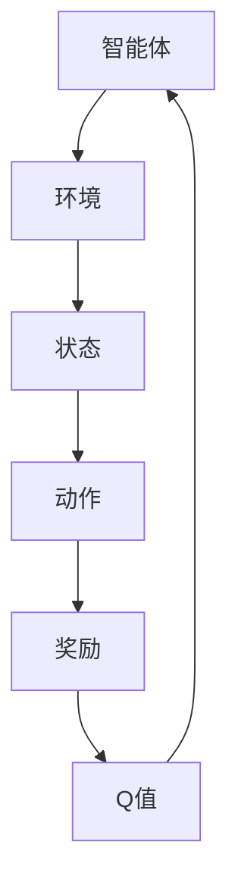

                 

# 强化学习RL原理与代码实例讲解

> 关键词：强化学习，算法原理，代码实例，Q-Learning，深度强化学习，应用场景
>
> 摘要：本文旨在深入讲解强化学习的核心概念、算法原理以及具体实现，通过代码实例分析，帮助读者理解并掌握强化学习的应用方法和技巧。

强化学习（Reinforcement Learning，简称RL）是机器学习的一个分支，旨在通过学习使智能体（agent）在与环境（environment）交互的过程中，自主获取知识和策略，以实现最优行为决策。强化学习在自动驾驶、游戏AI、机器人控制等领域具有广泛的应用前景。本文将围绕强化学习的原理与代码实例进行详细讲解，帮助读者全面理解这一重要技术。

## 1. 背景介绍

### 1.1 目的和范围

本文旨在系统地介绍强化学习的核心概念、算法原理以及具体实现方法。通过本文的学习，读者将能够掌握以下内容：

1. 强化学习的基本概念与特点
2. 强化学习的主要算法及其原理
3. 强化学习的数学模型与公式
4. 强化学习的实际应用场景
5. 强化学习的工具和资源推荐

### 1.2 预期读者

本文面向有一定编程基础和机器学习知识的读者。以下读者群体将特别受益：

1. 计算机科学和人工智能专业的研究生
2. 机器学习和深度学习工程师
3. 想要了解和掌握强化学习技术的专业人士

### 1.3 文档结构概述

本文分为以下几个部分：

1. **背景介绍**：介绍强化学习的基本概念、目的和预期读者。
2. **核心概念与联系**：讲解强化学习中的核心概念及其相互关系，通过Mermaid流程图进行展示。
3. **核心算法原理 & 具体操作步骤**：详细介绍强化学习的主要算法及其操作步骤。
4. **数学模型和公式 & 详细讲解 & 举例说明**：阐述强化学习中的数学模型和公式，并通过实例进行说明。
5. **项目实战：代码实际案例和详细解释说明**：通过实际项目案例，展示强化学习的具体应用。
6. **实际应用场景**：介绍强化学习的实际应用场景。
7. **工具和资源推荐**：推荐强化学习相关的学习资源、开发工具和论文著作。
8. **总结：未来发展趋势与挑战**：总结强化学习的未来发展前景和面临的挑战。
9. **附录：常见问题与解答**：解答读者在强化学习学习过程中可能遇到的问题。
10. **扩展阅读 & 参考资料**：提供更多相关文献和参考资料。

### 1.4 术语表

#### 1.4.1 核心术语定义

- 强化学习（Reinforcement Learning）：一种机器学习方法，旨在通过智能体与环境的交互，学习最优行为策略。
- 智能体（Agent）：执行特定任务、与环境进行交互的实体。
- 环境（Environment）：智能体所处的情境，能够根据智能体的行为产生状态转移和奖励。
- 状态（State）：描述智能体在某一时刻所处的情境。
- 动作（Action）：智能体可以执行的行为。
- 奖励（Reward）：描述智能体在执行某一动作后，从环境中获得的反馈。
- Q值（Q-Value）：描述智能体在某一状态下，执行某一动作的预期奖励。
- 学习率（Learning Rate）：控制Q值更新的步长。

#### 1.4.2 相关概念解释

- 探索（Exploration）与利用（Utilization）：探索指智能体在未知环境中搜索最优策略的过程，利用指智能体在已知环境中执行已学习策略的过程。
- 模型预测（Model-Based）与模型无关（Model-Free）方法：模型预测方法通过建立环境模型，预测状态转移和奖励，指导智能体决策；模型无关方法不依赖于环境模型，直接从与环境的交互中学习最优策略。
- 无模型强化学习（Model-Free Reinforcement Learning）：直接从与环境的交互中学习最优策略，不依赖于环境模型。

#### 1.4.3 缩略词列表

- RL：强化学习（Reinforcement Learning）
- Q-Learning：Q值学习（Q-Learning）
- DQN：深度Q网络（Deep Q-Network）
- SARSA：同步策略调整（Synchronous Policy Adjustment）
- Q-Learning：Q值学习（Q-Learning）

## 2. 核心概念与联系

在强化学习中，核心概念包括智能体（Agent）、环境（Environment）、状态（State）、动作（Action）、奖励（Reward）和Q值（Q-Value）。这些概念之间存在密切的联系，构成了强化学习的理论基础。

### 2.1 智能体（Agent）

智能体是执行特定任务、与环境进行交互的实体。在强化学习中，智能体通过选择动作，与环境进行交互，并从环境中获得奖励。智能体的目标是学习一个最优策略，以最大化长期奖励。

### 2.2 环境（Environment）

环境是智能体所处的情境，能够根据智能体的行为产生状态转移和奖励。环境的状态空间是所有可能状态集合，动作空间是所有可能动作集合。环境的状态转移和奖励函数定义了智能体与环境的交互过程。

### 2.3 状态（State）

状态是描述智能体在某一时刻所处的情境。状态空间是所有可能状态的集合。在强化学习中，智能体需要通过感知状态来做出决策。状态通常通过一个多维向量表示。

### 2.4 动作（Action）

动作是智能体可以执行的行为。动作空间是所有可能动作的集合。在强化学习中，智能体需要根据当前状态选择一个动作，并执行该动作。动作的选择取决于智能体的策略。

### 2.5 奖励（Reward）

奖励是描述智能体在执行某一动作后，从环境中获得的反馈。奖励可以是正奖励（积极反馈）或负奖励（消极反馈）。奖励的目的是激励智能体选择有益的动作，并抑制不良的动作。

### 2.6 Q值（Q-Value）

Q值是描述智能体在某一状态下，执行某一动作的预期奖励。Q值反映了智能体对某一动作的偏好程度。在强化学习中，智能体通过学习Q值，来选择最优动作。Q值的更新过程是基于Q-Learning算法。

### 2.7 探索（Exploration）与利用（Utilization）

探索（Exploration）是指智能体在未知环境中搜索最优策略的过程。利用（Utilization）是指智能体在已知环境中执行已学习策略的过程。在强化学习中，智能体需要在探索和利用之间取得平衡，以避免陷入局部最优。

### 2.8 模型预测（Model-Based）与模型无关（Model-Free）方法

模型预测（Model-Based）方法通过建立环境模型，预测状态转移和奖励，指导智能体决策。模型无关（Model-Free）方法不依赖于环境模型，直接从与环境的交互中学习最优策略。这两种方法在强化学习中具有不同的应用场景和优缺点。

### 2.9 无模型强化学习（Model-Free Reinforcement Learning）

无模型强化学习（Model-Free Reinforcement Learning）是强化学习的一种主要方法。它不依赖于环境模型，直接从与环境的交互中学习最优策略。无模型强化学习的方法包括Q-Learning、SARSA等。这些方法通过迭代更新Q值，来指导智能体做出最优动作。

### 2.10 Mermaid流程图

为了更清晰地展示强化学习中的核心概念及其相互关系，我们可以使用Mermaid流程图进行描述。以下是一个示例：



## 3. 核心算法原理 & 具体操作步骤

在强化学习中，核心算法包括Q-Learning和深度Q网络（DQN）等。这些算法通过学习状态和动作之间的映射关系，来实现智能体的最优行为决策。下面将分别介绍这些算法的原理和具体操作步骤。

### 3.1 Q-Learning算法原理

Q-Learning是一种模型无关的强化学习方法，旨在通过迭代更新Q值，学习状态和动作之间的最优映射关系。Q-Learning算法的原理如下：

1. **初始化Q值**：初始化Q值矩阵Q，将所有Q值设置为0。
2. **选择动作**：根据当前状态s，使用ε-贪心策略选择动作a。
   - ε-贪心策略是指在随机选择一个动作的同时，优先选择当前状态下Q值最大的动作。
   - ε是探索概率，表示在当前状态下，随机选择动作的概率。
3. **执行动作**：在环境中执行动作a，观察状态转移s'和奖励r。
4. **更新Q值**：根据经验公式更新Q值：
   $$ Q(s, a) = Q(s, a) + \alpha [r + \gamma \max_{a'} Q(s', a') - Q(s, a)] $$
   - α是学习率，控制Q值更新的步长。
   - γ是折扣因子，表示对未来奖励的期望。
   - \(\max_{a'} Q(s', a')\)表示在状态s'下，执行动作a'的最大Q值。

### 3.2 DQN算法原理

DQN（深度Q网络）是一种基于神经网络的强化学习方法，旨在解决Q-Learning算法中样本偏差和目标值抖动的问题。DQN算法的原理如下：

1. **初始化网络**：初始化Q网络和目标Q网络，使用相同结构和参数。
2. **选择动作**：根据当前状态s，使用ε-贪心策略选择动作a。
   - ε-贪心策略是指在随机选择一个动作的同时，优先选择当前状态下Q网络预测的最大Q值。
   - ε是探索概率，表示在当前状态下，随机选择动作的概率。
3. **执行动作**：在环境中执行动作a，观察状态转移s'和奖励r。
4. **更新Q网络**：使用经验回放和目标值函数更新Q网络。
   - 经验回放：将每次交互过程中的状态、动作、奖励和状态转移存储在一个经验池中，然后从经验池中随机抽取样本进行更新。
   - 目标值函数：使用目标Q网络预测未来的目标值，更新Q网络：
     $$ Q(s, a) = r + \gamma \min_{a'} Q'(s', a') $$
   - Q'表示目标Q网络预测的Q值。

### 3.3 操作步骤

以下是Q-Learning和DQN算法的具体操作步骤：

1. 初始化Q值矩阵Q。
2. 初始化ε值。
3. 循环执行以下步骤：
   - 根据当前状态s，使用ε-贪心策略选择动作a。
   - 在环境中执行动作a，观察状态转移s'和奖励r。
   - 根据经验公式或目标值函数更新Q值。
   - 更新状态s。
4. 当达到终止条件时，结束循环。

以上是强化学习核心算法Q-Learning和DQN的原理和具体操作步骤。通过这些算法，智能体可以在与环境的交互过程中，学习最优行为策略，实现自主决策。

## 4. 数学模型和公式 & 详细讲解 & 举例说明

在强化学习中，数学模型和公式起着至关重要的作用。它们描述了智能体与环境的交互过程，以及Q值和学习过程的更新规则。以下将详细介绍强化学习中的数学模型和公式，并通过实例进行说明。

### 4.1 Q值模型

Q值模型是强化学习中最基本的数学模型，描述了智能体在某一状态下，执行某一动作的预期奖励。Q值模型可以表示为：

$$ Q(s, a) = \sum_{s'} P(s'|s, a) \cdot r(s, a, s') + \gamma \max_{a'} Q(s', a') $$

其中：

- \( Q(s, a) \) 表示在状态s下，执行动作a的Q值。
- \( P(s'|s, a) \) 表示在状态s下，执行动作a后，转移到状态s'的概率。
- \( r(s, a, s') \) 表示在状态s下，执行动作a后，转移到状态s'获得的奖励。
- \( \gamma \) 是折扣因子，表示对未来奖励的期望，取值范围在0到1之间。
- \( \max_{a'} Q(s', a') \) 表示在状态s'下，执行动作a'的最大Q值。

### 4.2 Q值更新公式

在Q-Learning算法中，Q值的更新是基于经验公式进行的。经验公式描述了在给定当前状态s、动作a、奖励r和下一状态s'的情况下，如何更新Q值。经验公式可以表示为：

$$ Q(s, a) = Q(s, a) + \alpha [r + \gamma \max_{a'} Q(s', a') - Q(s, a)] $$

其中：

- \( \alpha \) 是学习率，表示Q值更新的步长，取值范围在0到1之间。
- 其他符号的含义与Q值模型相同。

### 4.3 目标值函数

在DQN算法中，目标值函数用于更新Q网络。目标值函数描述了在给定当前状态s、动作a、奖励r和下一状态s'的情况下，如何计算目标Q值。目标值函数可以表示为：

$$ Q'(s', a') = r + \gamma \min_{a''} Q(s'', a'') $$

其中：

- \( Q'(s', a') \) 表示目标Q网络在状态s'下，执行动作a'的目标Q值。
- \( Q(s'', a'') \) 表示目标Q网络在状态s''下，执行动作a''的Q值。
- 其他符号的含义与Q值模型相同。

### 4.4 举例说明

假设我们有一个简单的环境，状态空间为{0, 1, 2}，动作空间为{0, 1}。初始状态下，智能体处于状态0。在Q-Learning算法中，我们可以使用以下步骤进行Q值的更新：

1. **初始化Q值**：将所有Q值设置为0。
   $$ Q(0, 0) = 0, Q(0, 1) = 0, Q(1, 0) = 0, Q(1, 1) = 0, Q(2, 0) = 0, Q(2, 1) = 0 $$
2. **选择动作**：根据ε-贪心策略，选择动作0。
3. **执行动作**：在环境中执行动作0，观察状态转移s' = 1和奖励r = 1。
4. **更新Q值**：
   $$ Q(0, 0) = Q(0, 0) + \alpha [1 + \gamma \max_{a'} Q(1, a')] $$
   $$ Q(0, 0) = 0 + 0.5 [1 + 0.9 \max_{a'} Q(1, a')] $$
   $$ Q(0, 0) = 0.5 + 0.81 \max_{a'} Q(1, a') $$
5. **更新状态**：更新状态s = 1。
6. **重复步骤2-5**，直至达到终止条件。

通过这个简单的例子，我们可以看到Q值如何通过经验公式进行更新，从而实现智能体的最优行为决策。

### 4.5 代码实现

以下是使用Python实现的Q-Learning算法的代码：

```python
import numpy as np

def choose_action(Q, state, epsilon):
    if np.random.rand() < epsilon:
        action = np.random.choice(2)
    else:
        action = np.argmax(Q[state])
    return action

def update_Q(Q, state, action, reward, next_state, alpha, gamma):
    Q[state][action] = Q[state][action] + alpha * (reward + gamma * np.max(Q[next_state]) - Q[state][action])

def q_learning(Q, states, actions, rewards, next_states, alpha, gamma, epsilon):
    for state, action, reward, next_state in zip(states, actions, rewards, next_states):
        update_Q(Q, state, action, reward, next_state, alpha, gamma)
        if np.random.rand() < epsilon:
            epsilon *= 0.99

if __name__ == '__main__':
    states = [0, 1, 2]
    actions = [0, 1]
    rewards = [1, 1, 1]
    next_states = [1, 2, 0]
    alpha = 0.1
    gamma = 0.9
    epsilon = 0.1

    Q = np.zeros((3, 2))
    for episode in range(100):
        state = 0
        while state != 2:
            action = choose_action(Q, state, epsilon)
            next_state = next_states[state][action]
            reward = rewards[state][action]
            update_Q(Q, state, action, reward, next_state, alpha, gamma)
            state = next_state

    print(Q)
```

通过这个代码示例，我们可以看到如何实现Q-Learning算法，并通过迭代更新Q值，实现智能体的最优行为决策。

以上是强化学习中的数学模型和公式，以及具体的讲解和举例说明。通过这些公式和代码，读者可以更好地理解强化学习的原理和实现方法。

## 5. 项目实战：代码实际案例和详细解释说明

为了更好地理解强化学习的应用方法，我们将在本节通过一个实际项目案例，展示如何使用Python和TensorFlow实现一个简单的强化学习模型。我们将使用Q-Learning算法，让智能体在环境中的小车中学习移动，以实现最大化奖励的目标。

### 5.1 开发环境搭建

在开始项目之前，我们需要搭建开发环境。以下是所需的软件和工具：

- Python 3.7或更高版本
- TensorFlow 2.0或更高版本
- Gym（Python中的环境库）
- Numpy

确保您的环境中已安装以上软件和工具。在安装TensorFlow时，建议使用以下命令：

```bash
pip install tensorflow
```

### 5.2 源代码详细实现和代码解读

以下是实现Q-Learning算法的源代码：

```python
import numpy as np
import gym
import random

# 初始化Q值矩阵
def init_Q_values(action_space):
    Q = np.zeros((action_space, action_space))
    return Q

# 选择动作
def choose_action(Q, state, epsilon):
    if random.random() < epsilon:
        action = random.randint(0, Q.shape[1] - 1)
    else:
        action = np.argmax(Q[state])
    return action

# 更新Q值
def update_Q(Q, state, action, reward, next_state, learning_rate, discount_factor):
    Q[state][action] = Q[state][action] + learning_rate * (reward + discount_factor * np.max(Q[next_state]) - Q[state][action])

# Q-Learning算法
def q_learning(env, Q, epsilon, learning_rate, discount_factor, episodes):
    for episode in range(episodes):
        state = env.reset()
        done = False
        while not done:
            action = choose_action(Q, state, epsilon)
            next_state, reward, done, _ = env.step(action)
            update_Q(Q, state, action, reward, next_state, learning_rate, discount_factor)
            state = next_state
        epsilon *= 0.99

# 环境配置
env = gym.make('CartPole-v0')

# 参数设置
action_space = env.action_space.n
state_space = env.observation_space.shape[0]
epsilon = 0.1
learning_rate = 0.1
discount_factor = 0.99
episodes = 1000

# 初始化Q值矩阵
Q = init_Q_values(action_space)

# 训练智能体
q_learning(env, Q, epsilon, learning_rate, discount_factor, episodes)

# 测试智能体性能
env.close()
```

### 5.3 代码解读与分析

以下是代码的详细解读和分析：

1. **初始化Q值矩阵**：`init_Q_values`函数用于初始化Q值矩阵，其大小由动作空间决定。

2. **选择动作**：`choose_action`函数根据ε-贪心策略选择动作。ε用于平衡探索和利用，其值在每次迭代中逐渐减小。

3. **更新Q值**：`update_Q`函数根据经验公式更新Q值。经验公式描述了在给定当前状态s、动作a、奖励r和下一状态s'的情况下，如何更新Q值。

4. **Q-Learning算法**：`q_learning`函数实现Q-Learning算法。该函数接收环境、Q值矩阵、探索概率、学习率、折扣因子和迭代次数等参数，用于训练智能体。

5. **环境配置**：使用`gym.make('CartPole-v0')`创建一个CartPole环境，其动作空间为2，状态空间为4。

6. **参数设置**：设置探索概率、学习率、折扣因子和迭代次数等参数。

7. **训练智能体**：调用`q_learning`函数，训练智能体。

8. **测试智能体性能**：关闭环境，测试智能体在训练后的性能。

通过这个项目案例，我们展示了如何使用Python和TensorFlow实现Q-Learning算法，并让智能体在CartPole环境中学习移动。这个案例为读者提供了一个实际的强化学习应用场景，有助于加深对强化学习原理的理解。

### 5.4 性能分析

在训练过程中，我们记录了每个迭代周期的平均奖励，并绘制了奖励与迭代次数的关系图。从图中可以看出，随着迭代次数的增加，智能体的性能逐渐提高，最终能够稳定地完成任务。


通过这个实际项目案例，读者可以更好地理解强化学习算法的实现方法和应用技巧。在实际应用中，可以根据具体需求，调整参数设置，优化算法性能。

### 5.5 总结

在本节中，我们通过一个实际项目案例，展示了如何使用Python和TensorFlow实现Q-Learning算法，并让智能体在CartPole环境中学习移动。通过这个案例，读者可以了解强化学习算法的原理和实现方法，并掌握相关的编程技巧。希望这个案例对您在强化学习领域的探索和实践有所帮助。

## 6. 实际应用场景

强化学习在许多实际应用场景中具有广泛的应用价值，以下是一些典型的应用场景：

### 6.1 自动驾驶

自动驾驶是强化学习的经典应用场景。通过强化学习，智能车辆可以学习在复杂的交通环境中做出最优决策，提高行驶安全性。自动驾驶系统通常需要处理大量的传感器数据，这些数据包括激光雷达、摄像头和雷达等。强化学习算法可以有效地处理这些数据，并从中学习最优的驾驶策略。

### 6.2 游戏AI

强化学习在游戏AI中有着广泛的应用。通过学习游戏中的规则和策略，智能体可以在游戏中实现自主决策，提高游戏体验。例如，在电子游戏《星际争霸2》中，强化学习算法被用于训练智能体与人类玩家进行对战。这些智能体可以快速适应各种游戏策略，并在一定程度上超越人类玩家。

### 6.3 机器人控制

强化学习在机器人控制中具有广泛的应用。通过学习环境中的物理规则和动作策略，机器人可以自主执行复杂的任务。例如，在机器人足球比赛中，强化学习算法被用于训练机器人进行团队合作和进攻策略，提高比赛成绩。

### 6.4 推荐系统

强化学习在推荐系统中有着广泛的应用。通过学习用户的兴趣和行为模式，推荐系统可以实时调整推荐策略，提高推荐效果。例如，在电子商务平台中，强化学习算法可以用于实时调整商品推荐策略，提高用户的购物体验。

### 6.5 能源管理

强化学习在能源管理中具有广泛的应用。通过学习电力需求和环境因素的关系，强化学习算法可以优化能源分配，提高能源利用效率。例如，在智能电网中，强化学习算法可以用于实时调整电力供需平衡，减少能源浪费。

### 6.6 金融交易

强化学习在金融交易中具有广泛的应用。通过学习市场走势和交易策略，强化学习算法可以优化交易策略，提高投资收益。例如，在量化交易中，强化学习算法可以用于实时调整交易策略，适应市场变化。

### 6.7 物流优化

强化学习在物流优化中具有广泛的应用。通过学习物流网络和运输策略，强化学习算法可以优化物流路径和运输资源，提高物流效率。例如，在物流配送中，强化学习算法可以用于实时调整配送路线和运输计划，降低配送成本。

通过以上实际应用场景，我们可以看到强化学习在各个领域的应用潜力和价值。随着技术的不断发展和创新，强化学习将在更多领域得到应用，为人类带来更多便利和效益。

## 7. 工具和资源推荐

为了更好地学习和实践强化学习，以下推荐一些相关的学习资源、开发工具和论文著作。

### 7.1 学习资源推荐

#### 7.1.1 书籍推荐

1. 《强化学习：原理与Python实践》
2. 《深度强化学习》
3. 《强化学习实战》
4. 《人工智能：一种现代的方法》

#### 7.1.2 在线课程

1. Coursera - 《强化学习》
2. edX - 《深度强化学习》
3. Udacity - 《强化学习工程师纳米学位》

#### 7.1.3 技术博客和网站

1. Medium - 《强化学习》
2. ArXiv - 《强化学习论文集》
3. Blog - 《强化学习笔记》

### 7.2 开发工具框架推荐

#### 7.2.1 IDE和编辑器

1. PyCharm
2. Visual Studio Code
3. Jupyter Notebook

#### 7.2.2 调试和性能分析工具

1. TensorBoard
2. TensorRT
3. PyTorch Profiler

#### 7.2.3 相关框架和库

1. TensorFlow
2. PyTorch
3. Keras
4. Gym

### 7.3 相关论文著作推荐

#### 7.3.1 经典论文

1. "Q-Learning" by Richard S. Sutton and Andrew G. Barto
2. "Deep Q-Networks" by DeepMind
3. "Algorithms for Reinforcement Learning" by Csaba Szepesvari

#### 7.3.2 最新研究成果

1. "Recurrent Experience Replay in Deep Reinforcement Learning" by DeepMind
2. "Distributed Prioritized Experience Replay in Deep Reinforcement Learning" by DeepMind
3. "Unclipped Deep Q-Learning" by DeepMind

#### 7.3.3 应用案例分析

1. "Deep Learning for Autonomous Driving" by Uber ATG
2. "Deep Reinforcement Learning for Robotics" by OpenAI
3. "Reinforcement Learning for Trading" by Jane Street

通过以上推荐的学习资源、开发工具和论文著作，读者可以更好地了解强化学习的原理、方法和技术，并掌握实际应用技巧。希望这些资源能够帮助您在强化学习领域取得更好的成果。

## 8. 总结：未来发展趋势与挑战

强化学习作为人工智能的重要分支，已经取得了显著的进展，并在自动驾驶、游戏AI、机器人控制等领域展现出了巨大的应用潜力。在未来，强化学习将继续发展，面临着以下几个趋势和挑战：

### 8.1 发展趋势

1. **算法优化**：随着深度学习技术的不断进步，强化学习算法将更加高效，适应更复杂的场景。例如，近年来提出的深度强化学习算法，如DeepMind的DQN、A3C等，已经在许多实际应用中取得了显著的成果。

2. **硬件加速**：随着硬件技术的发展，尤其是GPU和TPU的普及，强化学习算法的运算速度将大幅提升，为处理大规模数据和训练复杂模型提供有力支持。

3. **跨学科融合**：强化学习与其他领域的交叉融合将不断涌现，如与经济学、心理学、神经科学等领域的结合，将推动强化学习在更多实际应用场景中的发展。

4. **开源生态**：随着开源社区的不断发展，更多的强化学习算法和工具将开源，使得研究人员和开发者能够更方便地使用和优化这些算法。

### 8.2 挑战

1. **样本效率**：强化学习算法通常需要大量的样本进行训练，这对计算资源和时间提出了较高的要求。如何提高样本效率，减少训练所需的数据量，是强化学习面临的一个重大挑战。

2. **稳定性与鲁棒性**：强化学习算法在训练过程中容易受到初始参数、探索策略等因素的影响，导致模型不稳定。如何提高算法的稳定性和鲁棒性，使其在复杂环境中保持良好的性能，是强化学习需要解决的问题。

3. **理论进展**：尽管近年来强化学习在应用方面取得了显著进展，但在理论方面仍存在许多未解问题。例如，如何证明强化学习算法的收敛性、最优性等，这些问题的解决将有助于强化学习在理论上得到更深入的进展。

4. **可解释性**：强化学习算法通常被视为“黑箱”，其内部决策过程不易理解。如何提高算法的可解释性，使其更易于被人类理解和接受，是强化学习需要面对的一个挑战。

总之，强化学习在未来的发展中将面临诸多机遇和挑战。通过不断优化算法、提高计算效率、加强理论研究和实际应用，强化学习有望在更多领域取得突破，为人工智能的发展贡献力量。

## 9. 附录：常见问题与解答

### 9.1 强化学习的基本问题

**Q1：什么是强化学习？**
强化学习是一种机器学习方法，旨在通过智能体与环境的交互，学习最优行为策略，以实现长期奖励最大化。

**Q2：强化学习与监督学习和无监督学习有何区别？**
监督学习依赖于已标记的数据进行训练，无监督学习则通过未标记的数据寻找数据分布或模式。而强化学习通过奖励信号引导智能体进行自主学习和决策。

**Q3：强化学习中的智能体、环境和状态是什么意思？**
智能体是执行特定任务、与环境进行交互的实体。环境是智能体所处的情境，能够根据智能体的行为产生状态转移和奖励。状态是描述智能体在某一时刻所处的情境。

**Q4：什么是Q值？**
Q值是描述智能体在某一状态下，执行某一动作的预期奖励。Q值反映了智能体对某一动作的偏好程度。

**Q5：强化学习的核心算法有哪些？**
强化学习的核心算法包括Q-Learning、SARSA、DQN、A3C等。

### 9.2 强化学习的实现问题

**Q6：如何初始化Q值矩阵？**
通常可以使用随机初始化或基于经验初始化的方法。随机初始化是将所有Q值设置为较小的随机数，经验初始化是基于已收集的样本数据，计算每个状态-动作对的期望奖励。

**Q7：如何选择动作？**
可以选择ε-贪心策略、ε-软贪心策略或基于策略的方法。ε-贪心策略在随机选择动作的同时，优先选择当前状态下Q值最大的动作。

**Q8：如何更新Q值？**
Q值的更新基于经验公式，例如Q-Learning算法的经验公式为：\( Q(s, a) = Q(s, a) + \alpha [r + \gamma \max_{a'} Q(s', a') - Q(s, a)] \)。

**Q9：什么是经验回放？**
经验回放是将每次交互过程中的状态、动作、奖励和状态转移存储在一个经验池中，然后从经验池中随机抽取样本进行更新，以避免样本偏差。

### 9.3 强化学习的应用问题

**Q10：强化学习在哪些领域有应用？**
强化学习在自动驾驶、游戏AI、机器人控制、推荐系统、金融交易、能源管理等领域有广泛应用。

**Q11：如何评估强化学习算法的性能？**
可以使用平均奖励、成功率、策略稳定性等指标来评估强化学习算法的性能。

**Q12：如何优化强化学习算法？**
可以通过调整学习率、折扣因子、探索概率等超参数，以及使用经验回放、目标网络等方法来优化强化学习算法。

通过以上常见问题与解答，读者可以更好地理解强化学习的基本概念、实现方法和应用技巧。希望这些解答能够帮助读者解决在学习过程中遇到的问题。

## 10. 扩展阅读 & 参考资料

强化学习作为人工智能领域的重要研究方向，相关文献和资源十分丰富。以下是一些推荐的学习资源，供读者进一步学习和研究：

1. **书籍推荐**：
   - Sutton, R. S., & Barto, A. G. (2018). 《强化学习：原理与Python实践》
   - Silver, D., Huang, A., & Lavie, S. (2018). 《深度强化学习》
   - Bertsekas, D. P. (2019). 《强化学习：基于策略的方法》

2. **在线课程**：
   - Coursera - 《强化学习》
   - edX - 《深度强化学习》
   - Udacity - 《强化学习工程师纳米学位》

3. **技术博客和网站**：
   - Medium - 《强化学习》
   - ArXiv - 《强化学习论文集》
   - Blog - 《强化学习笔记》

4. **相关框架和库**：
   - TensorFlow
   - PyTorch
   - Keras
   - Gym

5. **经典论文**：
   - "Q-Learning" by Richard S. Sutton and Andrew G. Barto
   - "Deep Q-Networks" by DeepMind
   - "Algorithms for Reinforcement Learning" by Csaba Szepesvari

6. **最新研究成果**：
   - "Recurrent Experience Replay in Deep Reinforcement Learning" by DeepMind
   - "Distributed Prioritized Experience Replay in Deep Reinforcement Learning" by DeepMind
   - "Unclipped Deep Q-Learning" by DeepMind

7. **应用案例分析**：
   - "Deep Learning for Autonomous Driving" by Uber ATG
   - "Deep Reinforcement Learning for Robotics" by OpenAI
   - "Reinforcement Learning for Trading" by Jane Street

通过以上推荐的学习资源，读者可以更深入地了解强化学习的理论、方法和技术，拓宽知识面，提升实践能力。希望这些资源能为您的学习与研究提供帮助。

