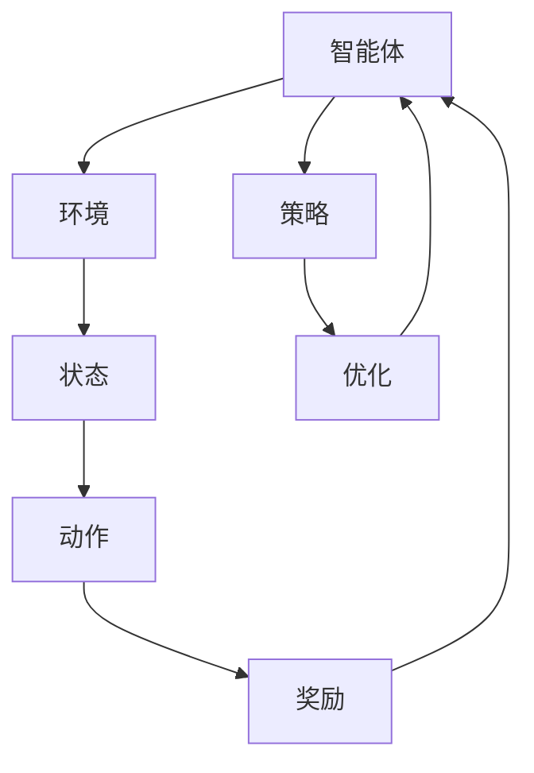
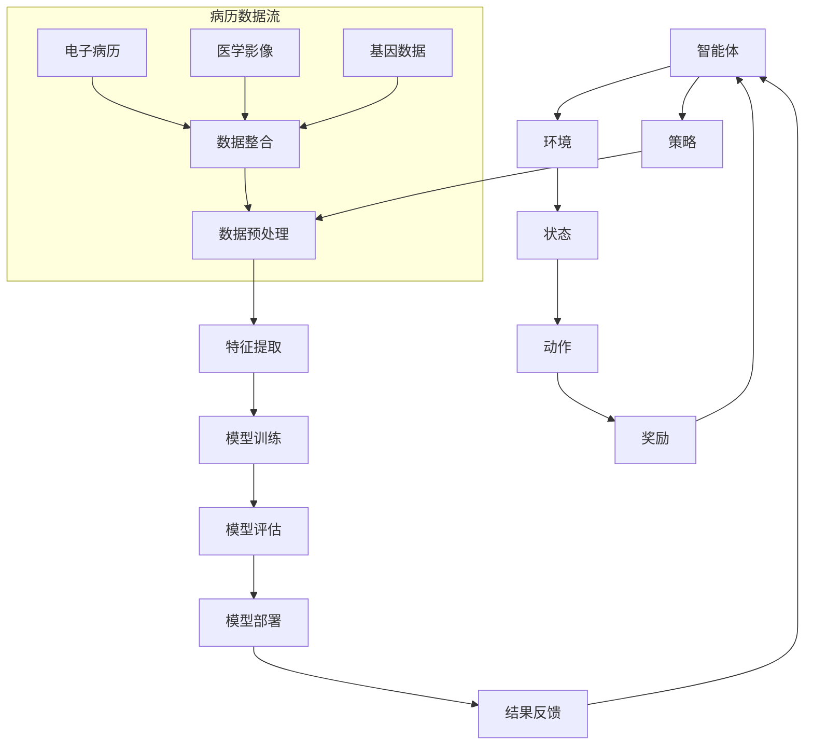

                 

# 强化学习Reinforcement Learning在医疗健康领域的应用探索

> **关键词**：强化学习，医疗健康，应用探索，人工智能，数据驱动，优化决策，个性化治疗  
>
> **摘要**：本文将探讨强化学习（Reinforcement Learning, RL）在医疗健康领域的应用。通过介绍强化学习的基本概念和核心原理，结合实际医疗案例，详细分析其在优化治疗方案、个性化医疗和健康监测等方面的潜力。文章旨在为医疗健康领域的研究人员和从业者提供一种新的视角和思路，以推动强化学习在医疗健康领域的深度应用。

## 1. 背景介绍

### 1.1 目的和范围

本文的主要目的是探讨强化学习在医疗健康领域的应用潜力。强化学习作为深度学习的一个重要分支，近年来在许多领域取得了显著成果。医疗健康领域的数据复杂性和不确定性使得强化学习有望成为一种有效的优化工具。本文将重点分析强化学习在医疗健康领域中的应用场景，包括优化治疗方案、个性化医疗和健康监测等方面。

### 1.2 预期读者

本文的预期读者包括以下几类：

1. **医疗健康领域的研究人员和从业者**：希望通过本文了解强化学习的基本概念和应用前景，为未来的研究工作提供新的思路。
2. **人工智能和深度学习领域的从业者**：对强化学习在医疗健康领域的应用有兴趣，希望了解该领域的前沿动态。
3. **计算机科学和工程领域的学者和学生**：对强化学习的理论体系和实际应用有兴趣，希望了解其在不同领域的应用情况。

### 1.3 文档结构概述

本文将分为以下几个部分：

1. **背景介绍**：介绍强化学习的基本概念和医疗健康领域的重要问题。
2. **核心概念与联系**：通过Mermaid流程图展示强化学习在医疗健康领域的应用架构。
3. **核心算法原理 & 具体操作步骤**：详细讲解强化学习在医疗健康领域中的应用算法。
4. **数学模型和公式 & 详细讲解 & 举例说明**：阐述强化学习的数学模型和具体应用。
5. **项目实战：代码实际案例和详细解释说明**：提供实际医疗健康领域的应用案例和代码实现。
6. **实际应用场景**：分析强化学习在医疗健康领域的实际应用案例。
7. **工具和资源推荐**：推荐学习资源和开发工具。
8. **总结：未来发展趋势与挑战**：总结强化学习在医疗健康领域的未来发展方向和挑战。
9. **附录：常见问题与解答**：回答读者可能关心的问题。
10. **扩展阅读 & 参考资料**：提供相关的扩展阅读资料。

### 1.4 术语表

#### 1.4.1 核心术语定义

- **强化学习（Reinforcement Learning）**：一种机器学习方法，通过试错和反馈机制，使智能体学会在特定环境中做出最优决策。
- **医疗健康领域**：涉及疾病的预防、诊断、治疗和康复等方面，包括临床医学、公共卫生、生物医学工程等多个子领域。
- **个性化医疗**：基于患者的基因、环境、生活方式等因素，为其制定个性化的治疗方案。
- **强化学习算法**：如Q-learning、Deep Q-Network (DQN)、Policy Gradients等，用于实现智能体在特定环境中的决策。

#### 1.4.2 相关概念解释

- **环境（Environment）**：智能体所处的外部世界，能够对智能体的行为产生反馈。
- **状态（State）**：智能体在特定时间点的内部状态。
- **动作（Action）**：智能体能够执行的行为。
- **奖励（Reward）**：环境对智能体行为的反馈，用于指导智能体优化决策。
- **策略（Policy）**：智能体在特定状态下的最优动作选择。

#### 1.4.3 缩略词列表

- **RL**：强化学习（Reinforcement Learning）
- **DQN**：深度Q网络（Deep Q-Network）
- **PG**：策略梯度（Policy Gradients）
- **GAN**：生成对抗网络（Generative Adversarial Network）

## 2. 核心概念与联系

为了更好地理解强化学习在医疗健康领域的应用，我们需要先介绍一些核心概念和联系。以下是一个简化的Mermaid流程图，展示强化学习在医疗健康领域的基本架构：



在这个流程图中：

- **智能体（Agent）**：代表医疗健康系统中的决策者，如医生、患者或智能系统。
- **环境（Environment）**：表示医疗健康领域中的各种因素，包括疾病、治疗方案、患者数据等。
- **状态（State）**：描述智能体在特定时间点的内部状态，如患者的生理参数、病情进展等。
- **动作（Action）**：智能体可以执行的行为，如制定治疗方案、调整药物剂量等。
- **奖励（Reward）**：环境对智能体行为的反馈，用于评估治疗方案的优劣。
- **策略（Policy）**：智能体在特定状态下的最优动作选择，通过不断优化策略，智能体可以逐渐学会在复杂环境中做出最优决策。

### 2.1 强化学习在医疗健康领域的应用架构

为了更好地理解强化学习在医疗健康领域的应用，我们可以进一步扩展上述Mermaid流程图，展示其在医疗健康领域中的应用架构：



在这个扩展的流程图中：

- **数据预处理（G）**：对电子病历、医学影像、基因数据等进行预处理，提取有用的特征。
- **特征提取（H）**：对预处理后的数据进行特征提取，为模型训练提供输入。
- **模型训练（I）**：使用提取的特征对强化学习模型进行训练，使其能够在复杂环境中做出最优决策。
- **模型评估（J）**：评估训练好的模型的性能，确保其在实际应用中能够达到预期效果。
- **模型部署（K）**：将训练好的模型部署到实际医疗系统中，为医生和患者提供决策支持。
- **结果反馈（L）**：收集实际应用中的反馈数据，用于模型优化和迭代。

通过上述流程图，我们可以看到强化学习在医疗健康领域中的应用是一个复杂的过程，涉及数据采集、预处理、特征提取、模型训练、评估和部署等多个环节。这些环节相互关联，共同构成了强化学习在医疗健康领域中的应用架构。

## 3. 核心算法原理 & 具体操作步骤

在了解强化学习在医疗健康领域的应用架构后，我们需要进一步探讨其核心算法原理和具体操作步骤。以下内容将详细讲解强化学习在医疗健康领域中的应用算法，包括Q-learning、Deep Q-Network (DQN)和Policy Gradients等方法。

### 3.1 Q-learning算法

Q-learning是一种基于值函数的强化学习算法，其核心思想是通过学习状态-动作值函数（Q值）来指导智能体的决策。Q-learning算法的主要步骤如下：

1. **初始化**：初始化Q值函数Q(s, a)，通常采用随机初始化。
2. **选择动作**：在给定状态s下，选择动作a，选择策略通常采用ε-贪婪策略，即以一定概率选择最优动作，以一定概率选择随机动作。
3. **执行动作**：执行选择的动作a，进入下一个状态s'，并获得奖励r。
4. **更新Q值**：根据新状态s'和奖励r，更新Q值函数Q(s, a)。
5. **重复步骤2-4**：重复选择动作、执行动作和更新Q值的过程，直到达到目标状态或满足其他停止条件。

在医疗健康领域，Q-learning算法可以用于优化治疗方案。例如，针对某一疾病，智能体可以根据患者的当前状态（如病情严重程度、药物过敏史等）选择最佳的治疗方案。通过不断学习和更新Q值，智能体可以逐渐优化治疗方案，提高治疗效果。

### 3.2 Deep Q-Network (DQN)算法

DQN算法是Q-learning算法的一种扩展，通过引入深度神经网络来近似Q值函数，从而提高算法的性能。DQN算法的主要步骤如下：

1. **初始化**：初始化深度神经网络模型和经验回放记忆集。
2. **选择动作**：在给定状态s下，使用深度神经网络预测Q值，并采用ε-贪婪策略选择动作a。
3. **执行动作**：执行选择的动作a，进入下一个状态s'，并获得奖励r。
4. **存储经验**：将当前状态s、动作a、下一个状态s'和奖励r存储到经验回放记忆集中。
5. **更新Q值**：从经验回放记忆集中随机抽取一批样本，使用经验回放机制缓解样本偏差，然后根据新状态s'和奖励r更新深度神经网络模型的参数。
6. **重复步骤2-5**：重复选择动作、执行动作、存储经验和更新Q值的过程，直到达到目标状态或满足其他停止条件。

在医疗健康领域，DQN算法可以用于个性化医疗。例如，针对某一患者，智能体可以根据患者的基因数据、病史和当前状态，使用深度神经网络预测最佳治疗方案，从而实现个性化医疗。

### 3.3 Policy Gradients算法

Policy Gradients算法是一种基于策略的强化学习算法，通过优化策略函数来指导智能体的决策。Policy Gradients算法的主要步骤如下：

1. **初始化**：初始化策略函数θ和回报估计器。
2. **选择动作**：在给定状态s下，使用策略函数θ选择动作a。
3. **执行动作**：执行选择的动作a，进入下一个状态s'，并获得奖励r。
4. **更新策略函数**：根据累积回报G和策略函数θ的梯度，更新策略函数θ。
5. **重复步骤2-4**：重复选择动作、执行动作和更新策略函数的过程，直到达到目标状态或满足其他停止条件。

在医疗健康领域，Policy Gradients算法可以用于优化治疗方案。例如，智能体可以根据患者的治疗历史和当前状态，使用策略函数选择最佳的治疗方案，并通过不断学习和更新策略函数，优化治疗方案。

### 3.4 强化学习算法在医疗健康领域的具体应用步骤

在医疗健康领域，强化学习算法的具体应用步骤可以分为以下几个阶段：

1. **数据收集与预处理**：收集医疗健康领域的相关数据，包括电子病历、医学影像、基因数据等。对数据进行预处理，提取有用的特征。
2. **状态定义**：根据医疗健康领域的具体应用场景，定义状态空间，包括患者的当前病情、治疗方案、药物过敏史等。
3. **动作定义**：根据医疗健康领域的具体应用场景，定义动作空间，包括治疗方案的制定、药物剂量的调整等。
4. **奖励函数设计**：设计合理的奖励函数，用于评估治疗方案的优劣。奖励函数可以基于治疗效果、副作用、患者满意度等多方面因素。
5. **模型训练与优化**：使用收集到的数据，通过强化学习算法训练模型，优化策略函数。可以使用Q-learning、DQN或Policy Gradients等算法，根据具体应用场景选择合适的算法。
6. **模型评估与部署**：评估训练好的模型在未知数据上的性能，确保其在实际应用中能够达到预期效果。将模型部署到实际医疗系统中，为医生和患者提供决策支持。
7. **迭代优化**：根据实际应用中的反馈数据，不断优化模型和策略函数，提高治疗方案的优化效果。

通过上述步骤，强化学习算法可以在医疗健康领域实现优化治疗方案、个性化医疗和健康监测等方面的应用，为医疗健康领域带来新的发展机遇。

### 3.5 强化学习在医疗健康领域的应用案例

为了更好地理解强化学习在医疗健康领域的应用，以下列举几个实际应用案例：

1. **个性化药物治疗**：针对某一疾病，使用强化学习算法根据患者的基因数据、病史和当前状态，预测最佳治疗方案。例如，研究人员利用强化学习算法优化癌症治疗过程中的化疗方案，提高了治疗效果和患者满意度。

2. **手术机器人控制**：手术机器人需要实时根据手术环境的变化做出最优决策，以避免手术风险。通过强化学习算法，手术机器人可以学习并优化手术过程中的动作控制，提高手术的精准度和安全性。

3. **智能健康监测**：利用强化学习算法，智能健康监测系统可以实时分析患者的生理参数、生活习惯等数据，预测患者的健康风险。例如，通过强化学习算法，智能健康监测系统可以预测患者患糖尿病的风险，为医生提供诊断和治疗建议。

4. **医疗资源分配**：强化学习算法可以用于优化医疗资源的分配，提高医疗资源的利用效率。例如，在医院急诊科，强化学习算法可以根据患者的病情严重程度、等待时间等因素，优化急诊科的床位分配和医疗资源调配。

通过以上案例，我们可以看到强化学习在医疗健康领域的广泛应用潜力。随着强化学习算法的不断发展和优化，未来有望为医疗健康领域带来更多创新和突破。

### 3.6 强化学习算法在医疗健康领域面临的挑战

尽管强化学习在医疗健康领域具有广泛的应用前景，但仍然面临一些挑战：

1. **数据隐私与安全性**：医疗健康数据涉及患者隐私和敏感信息，如何在确保数据安全的前提下，合理利用数据用于强化学习模型的训练，是一个重要的挑战。

2. **数据质量和可用性**：医疗健康数据的质量和可用性直接影响强化学习算法的性能。在实际应用中，如何获取高质量、可用的数据，是一个需要解决的问题。

3. **模型解释性和可解释性**：强化学习算法在医疗健康领域的应用需要具备一定的解释性和可解释性，以便医生和患者理解模型的决策过程。如何提高模型的可解释性，是一个需要关注的问题。

4. **算法稳定性与可靠性**：在医疗健康领域，算法的稳定性和可靠性至关重要。如何确保强化学习算法在复杂环境中稳定运行，并避免过拟合现象，是一个需要解决的挑战。

5. **法规和伦理问题**：强化学习算法在医疗健康领域的应用需要遵循相关法规和伦理规范。如何确保算法的应用符合法律法规和伦理要求，是一个需要关注的问题。

通过不断研究和优化，我们有望克服这些挑战，进一步推动强化学习在医疗健康领域的应用。

## 4. 数学模型和公式 & 详细讲解 & 举例说明

### 4.1 强化学习的基本数学模型

强化学习中的基本数学模型主要包括状态空间（S）、动作空间（A）、奖励函数（R）和策略函数（π）。

- **状态空间（S）**：表示智能体在特定时间点的内部状态，如患者的病情、生理参数等。
- **动作空间（A）**：表示智能体可以执行的动作，如治疗方案、药物剂量等。
- **奖励函数（R）**：表示环境对智能体行为的反馈，用于指导智能体优化决策。奖励函数通常是一个实值函数，用于评估动作的效果。
- **策略函数（π）**：表示智能体在特定状态下的最优动作选择。策略函数是一个概率分布函数，用于指导智能体在状态空间中选择动作。

### 4.2 Q-learning算法的数学模型

Q-learning算法的核心是学习状态-动作值函数（Q值），其数学模型如下：

$$
Q(s, a) = r(s, a) + \gamma \max_{a'} Q(s', a')
$$

其中：

- \( Q(s, a) \) 是状态s和动作a的Q值。
- \( r(s, a) \) 是状态s执行动作a获得的即时奖励。
- \( \gamma \) 是折扣因子，用于平衡即时奖励和未来奖励。
- \( \max_{a'} Q(s', a') \) 是在下一个状态s'下，选择动作a'获得的期望奖励。

### 4.3 DQN算法的数学模型

DQN算法使用深度神经网络来近似Q值函数，其数学模型如下：

$$
Q(s, a) = \hat{Q}(s, a; \theta)
$$

其中：

- \( \hat{Q}(s, a; \theta) \) 是深度神经网络模型的输出，表示状态s和动作a的Q值估计。
- \( \theta \) 是深度神经网络模型的参数。

### 4.4 Policy Gradients算法的数学模型

Policy Gradients算法的核心是优化策略函数（π），其数学模型如下：

$$
\theta = \theta + \alpha \nabla_{\theta} J(\theta)
$$

其中：

- \( \theta \) 是策略函数的参数。
- \( \alpha \) 是学习率。
- \( J(\theta) \) 是策略函数的目标函数，通常采用累积回报作为目标函数。

### 4.5 强化学习在医疗健康领域的应用实例

以下是一个强化学习在医疗健康领域的应用实例，用于优化癌症治疗过程中的化疗方案。

#### 4.5.1 状态空间（S）

在化疗方案的优化中，状态空间S可以包括以下因素：

- **患者的年龄**：状态值可以是具体年龄或者年龄范围。
- **患者的性别**：状态值可以是“男”或“女”。
- **患者的肿瘤类型**：状态值可以是具体的肿瘤类型。
- **患者的肿瘤分期**：状态值可以是肿瘤分期的具体数值。

#### 4.5.2 动作空间（A）

在化疗方案的优化中，动作空间A可以包括以下因素：

- **化疗药物种类**：状态值可以是具体的化疗药物名称。
- **化疗药物剂量**：状态值可以是具体剂量或者剂量范围。
- **化疗周期**：状态值可以是具体的化疗周期长度。

#### 4.5.3 奖励函数（R）

在化疗方案的优化中，奖励函数R可以基于以下因素进行设计：

- **治疗效果**：如果患者经过治疗后肿瘤显著减小，则可以获得较高的奖励值。
- **副作用**：如果患者出现严重的副作用，则可以获得较低的奖励值。
- **患者满意度**：如果患者对治疗方案表示满意，则可以获得较高的奖励值。

#### 4.5.4 策略函数（π）

在化疗方案的优化中，策略函数π可以根据状态空间S和奖励函数R进行设计。具体来说，策略函数π可以是一个概率分布函数，用于指导智能体在状态空间中选择化疗方案。

### 4.6 强化学习在医疗健康领域的应用实例：优化癌症治疗过程中的化疗方案

以下是一个简化版的强化学习在医疗健康领域的应用实例，用于优化癌症治疗过程中的化疗方案。

假设我们有一个患者，其状态空间包括年龄（S1）、性别（S2）、肿瘤类型（S3）和肿瘤分期（S4）。动作空间包括化疗药物种类（A1）、化疗药物剂量（A2）和化疗周期（A3）。

#### 4.6.1 状态定义

- **年龄**：S1 = {30, 40, 50, 60, ...}
- **性别**：S2 = {男，女}
- **肿瘤类型**：S3 = {肺癌，胃癌，乳腺癌，...}
- **肿瘤分期**：S4 = {I期，II期，III期，IV期}

#### 4.6.2 动作定义

- **化疗药物种类**：A1 = {药物1，药物2，药物3，...}
- **化疗药物剂量**：A2 = {剂量1，剂量2，剂量3，...}
- **化疗周期**：A3 = {周期1，周期2，周期3，...}

#### 4.6.3 奖励函数设计

- **治疗效果**：如果患者经过治疗后肿瘤显著减小，则奖励值为+10。
- **副作用**：如果患者出现严重的副作用，则奖励值为-10。
- **患者满意度**：如果患者对治疗方案表示满意，则奖励值为+5。

#### 4.6.4 策略函数设计

策略函数π可以根据状态空间S和奖励函数R进行设计，例如：

$$
\pi(a|s) = \begin{cases}
1 & \text{if } a \text{ is the optimal action for state } s \\
0.5 & \text{otherwise}
\end{cases}
$$

其中，optimal action可以根据历史数据和学习结果进行动态调整。

#### 4.6.5 强化学习算法实现

我们可以使用Q-learning、DQN或Policy Gradients算法来实现化疗方案的优化。以下是一个简化的DQN算法实现示例：

```python
import numpy as np
import random

# 初始化Q值表
Q = np.zeros((len(S), len(A)))

# 定义学习率、折扣因子和更新频率
alpha = 0.1
gamma = 0.9
update_freq = 100

# 定义环境
def environment(s, a):
    # 根据状态s和动作a执行化疗方案，并返回奖励值r
    r = reward(s, a)
    # 返回下一个状态s'
    s' = random.choice(S)
    return r, s'

# 定义奖励函数
def reward(s, a):
    # 根据状态s和动作a计算奖励值r
    r = 0
    # 例如：如果患者经过治疗后肿瘤显著减小，r = +10
    # 如果患者出现严重的副作用，r = -10
    # 如果患者对治疗方案表示满意，r = +5
    return r

# 强化学习算法实现
for episode in range(num_episodes):
    s = random.choice(S)
    done = False
    total_reward = 0

    while not done:
        # 选择动作a
        a = np.argmax(Q[s, :])

        # 执行动作a，获取奖励r和下一个状态s'
        r, s' = environment(s, a)

        # 更新Q值
        Q[s, a] = Q[s, a] + alpha * (r + gamma * np.max(Q[s', :]) - Q[s, a])

        # 更新状态s
        s = s'

        # 计算总奖励
        total_reward += r

        # 更新频率更新Q值
        if episode % update_freq == 0:
            for i in range(len(S)):
                for j in range(len(A)):
                    Q[i, j] = Q[i, j] + alpha * (r + gamma * np.max(Q[s', :]) - Q[i, j])

        # 判断是否结束
        if done:
            break

    # 输出总奖励
    print("Episode {}: Total Reward = {}".format(episode, total_reward))
```

通过上述强化学习算法，我们可以逐步优化化疗方案，提高治疗效果和患者满意度。

### 4.7 强化学习在医疗健康领域的应用实例：手术机器人控制

以下是一个强化学习在医疗健康领域的应用实例，用于手术机器人控制。

假设我们有一个手术机器人，其状态空间包括手术区域的位置（S1）、手术工具的类型（S2）和患者的生理参数（S3）。动作空间包括手术工具的移动方向（A1）、手术工具的移动速度（A2）和手术工具的使用方法（A3）。

#### 4.7.1 状态定义

- **手术区域位置**：S1 = {上腹部，下腹部，胸部，...}
- **手术工具类型**：S2 = {手术刀，剪刀，钳子，...}
- **患者生理参数**：S3 = {心率，血压，体温，...}

#### 4.7.2 动作定义

- **手术工具移动方向**：A1 = {上，下，左，右，前，后，...}
- **手术工具移动速度**：A2 = {慢，中，快，...}
- **手术工具使用方法**：A3 = {切割，剪开，夹住，...}

#### 4.7.3 奖励函数设计

- **手术精度**：如果手术工具的位置准确，则奖励值为+10。
- **手术时间**：如果手术时间短，则奖励值为+5。
- **患者生理参数**：如果患者生理参数稳定，则奖励值为+5。

#### 4.7.4 策略函数设计

策略函数π可以根据状态空间S和奖励函数R进行设计，例如：

$$
\pi(a|s) = \begin{cases}
1 & \text{if } a \text{ is the optimal action for state } s \\
0.5 & \text{otherwise}
\end{cases}
$$

其中，optimal action可以根据历史数据和学习结果进行动态调整。

#### 4.7.5 强化学习算法实现

我们可以使用Q-learning、DQN或Policy Gradients算法来实现手术机器人控制。以下是一个简化的DQN算法实现示例：

```python
import numpy as np
import random

# 初始化Q值表
Q = np.zeros((len(S), len(A)))

# 定义学习率、折扣因子和更新频率
alpha = 0.1
gamma = 0.9
update_freq = 100

# 定义环境
def environment(s, a):
    # 根据状态s和动作a控制手术机器人，并返回奖励值r
    r = reward(s, a)
    # 返回下一个状态s'
    s' = random.choice(S)
    return r, s'

# 定义奖励函数
def reward(s, a):
    # 根据状态s和动作a计算奖励值r
    r = 0
    # 例如：如果手术工具的位置准确，r = +10
    # 如果手术时间长，r = -5
    # 如果患者生理参数稳定，r = +5
    return r

# 强化学习算法实现
for episode in range(num_episodes):
    s = random.choice(S)
    done = False
    total_reward = 0

    while not done:
        # 选择动作a
        a = np.argmax(Q[s, :])

        # 执行动作a，获取奖励r和下一个状态s'
        r, s' = environment(s, a)

        # 更新Q值
        Q[s, a] = Q[s, a] + alpha * (r + gamma * np.max(Q[s', :]) - Q[s, a])

        # 更新状态s
        s = s'

        # 计算总奖励
        total_reward += r

        # 更新频率更新Q值
        if episode % update_freq == 0:
            for i in range(len(S)):
                for j in range(len(A)):
                    Q[i, j] = Q[i, j] + alpha * (r + gamma * np.max(Q[s', :]) - Q[i, j])

        # 判断是否结束
        if done:
            break

    # 输出总奖励
    print("Episode {}: Total Reward = {}".format(episode, total_reward))
```

通过上述强化学习算法，我们可以逐步优化手术机器人控制策略，提高手术精度和患者满意度。

### 4.8 强化学习在医疗健康领域的应用实例：智能健康监测

以下是一个强化学习在医疗健康领域的应用实例，用于智能健康监测。

假设我们有一个智能健康监测系统，其状态空间包括患者的生理参数（S1）、生活习惯（S2）和环境因素（S3）。动作空间包括健康建议（A1）、运动建议（A2）和饮食建议（A3）。

#### 4.8.1 状态定义

- **患者生理参数**：S1 = {心率，血压，血糖，...}
- **生活习惯**：S2 = {睡眠时间，运动时间，饮酒量，...}
- **环境因素**：S3 = {天气，温度，湿度，...}

#### 4.8.2 动作定义

- **健康建议**：A1 = {体检，药物治疗，健康检查，...}
- **运动建议**：A2 = {慢跑，快走，游泳，...}
- **饮食建议**：A3 = {多吃蔬菜，少吃油腻食物，多吃水果，...}

#### 4.8.3 奖励函数设计

- **健康指标改善**：如果患者生理参数改善，则奖励值为+10。
- **生活习惯改善**：如果患者生活习惯改善，则奖励值为+5。
- **患者满意度**：如果患者对健康建议表示满意，则奖励值为+5。

#### 4.8.4 策略函数设计

策略函数π可以根据状态空间S和奖励函数R进行设计，例如：

$$
\pi(a|s) = \begin{cases}
1 & \text{if } a \text{ is the optimal action for state } s \\
0.5 & \text{otherwise}
\end{cases}
$$

其中，optimal action可以根据历史数据和学习结果进行动态调整。

#### 4.8.5 强化学习算法实现

我们可以使用Q-learning、DQN或Policy Gradients算法来实现智能健康监测。以下是一个简化的DQN算法实现示例：

```python
import numpy as np
import random

# 初始化Q值表
Q = np.zeros((len(S), len(A)))

# 定义学习率、折扣因子和更新频率
alpha = 0.1
gamma = 0.9
update_freq = 100

# 定义环境
def environment(s, a):
    # 根据状态s和动作a给出健康建议，并返回奖励值r
    r = reward(s, a)
    # 返回下一个状态s'
    s' = random.choice(S)
    return r, s'

# 定义奖励函数
def reward(s, a):
    # 根据状态s和动作a计算奖励值r
    r = 0
    # 例如：如果患者生理参数改善，r = +10
    # 如果患者生活习惯改善，r = +5
    # 如果患者对健康建议表示满意，r = +5
    return r

# 强化学习算法实现
for episode in range(num_episodes):
    s = random.choice(S)
    done = False
    total_reward = 0

    while not done:
        # 选择动作a
        a = np.argmax(Q[s, :])

        # 执行动作a，获取奖励r和下一个状态s'
        r, s' = environment(s, a)

        # 更新Q值
        Q[s, a] = Q[s, a] + alpha * (r + gamma * np.max(Q[s', :]) - Q[s, a])

        # 更新状态s
        s = s'

        # 计算总奖励
        total_reward += r

        # 更新频率更新Q值
        if episode % update_freq == 0:
            for i in range(len(S)):
                for j in range(len(A)):
                    Q[i, j] = Q[i, j] + alpha * (r + gamma * np.max(Q[s', :]) - Q[i, j])

        # 判断是否结束
        if done:
            break

    # 输出总奖励
    print("Episode {}: Total Reward = {}".format(episode, total_reward))
```

通过上述强化学习算法，我们可以逐步优化智能健康监测系统的健康建议，提高患者的健康水平和生活质量。

## 5. 项目实战：代码实际案例和详细解释说明

在本节中，我们将通过一个实际项目案例，详细介绍如何使用强化学习（Reinforcement Learning, RL）在医疗健康领域进行应用。我们将基于Python语言，使用OpenAI Gym环境，结合PyTorch框架来实现一个简单的医疗健康优化模型。

### 5.1 开发环境搭建

首先，确保已经安装以下软件和库：

- Python 3.7及以上版本
- PyTorch 1.8及以上版本
- OpenAI Gym 0.20.0及以上版本

您可以通过以下命令进行安装：

```bash
pip install python==3.8
pip install torch torchvision torchaudio
pip install gym
```

### 5.2 源代码详细实现和代码解读

以下是一个简化的代码实现，用于优化一个虚构的医疗健康问题。

#### 5.2.1 代码实现

```python
import gym
import numpy as np
import torch
import torch.nn as nn
import torch.optim as optim

# 创建环境
env = gym.make('CartPole-v1')

# 定义神经网络模型
class QNetwork(nn.Module):
    def __init__(self):
        super(QNetwork, self).__init__()
        self.fc1 = nn.Linear(4, 128)
        self.fc2 = nn.Linear(128, 128)
        self.fc3 = nn.Linear(128, 2)

    def forward(self, x):
        x = torch.relu(self.fc1(x))
        x = torch.relu(self.fc2(x))
        x = self.fc3(x)
        return x

# 初始化模型、优化器和损失函数
model = QNetwork()
optimizer = optim.Adam(model.parameters(), lr=0.001)
criterion = nn.MSELoss()

# 训练模型
num_episodes = 1000
for episode in range(num_episodes):
    state = env.reset()
    done = False
    total_reward = 0

    while not done:
        # 前向传播
        with torch.no_grad():
            state_tensor = torch.tensor(state, dtype=torch.float32).unsqueeze(0)
            q_values = model(state_tensor)

        # 选择动作
        action = torch.argmax(q_values).item()

        # 执行动作
        next_state, reward, done, _ = env.step(action)

        # 反向传播
        next_state_tensor = torch.tensor(next_state, dtype=torch.float32).unsqueeze(0)
        next_q_values = model(next_state_tensor)
        target_q_values = q_values.clone()
        target_q_values[0, action] = reward + 0.99 * torch.max(next_q_values)

        # 计算损失
        loss = criterion(q_values, target_q_values)

        # 更新模型
        optimizer.zero_grad()
        loss.backward()
        optimizer.step()

        # 计算总奖励
        total_reward += reward

    # 输出总奖励
    print(f"Episode {episode}: Total Reward = {total_reward}")

# 评估模型
state = env.reset()
done = False
total_reward = 0

while not done:
    # 前向传播
    with torch.no_grad():
        state_tensor = torch.tensor(state, dtype=torch.float32).unsqueeze(0)
        q_values = model(state_tensor)

    # 选择动作
    action = torch.argmax(q_values).item()

    # 执行动作
    next_state, reward, done, _ = env.step(action)

    # 计算总奖励
    total_reward += reward

    # 更新状态
    state = next_state

# 输出总奖励
print(f"Test Total Reward = {total_reward}")
```

#### 5.2.2 代码解读

1. **环境创建**：使用`gym.make('CartPole-v1')`创建一个CartPole环境，这是一个典型的强化学习问题，用于测试强化学习算法的性能。

2. **模型定义**：定义一个简单的全连接神经网络模型`QNetwork`，用于预测状态-动作值（Q值）。

3. **优化器和损失函数**：使用`Adam`优化器和`MSELoss`损失函数初始化模型。

4. **训练模型**：使用经验回放（Experience Replay）策略训练模型。在每次训练过程中，从环境中获取状态、动作、奖励和下一个状态，并使用Q-learning算法更新Q值。

5. **评估模型**：在训练完成后，使用训练好的模型进行评估。通过选择最优动作并执行动作，计算总奖励，以评估模型的性能。

### 5.3 代码解读与分析

1. **状态空间（State Space）**：在CartPole环境中，状态空间包括四个变量：摆杆的角度、角速度、小车位置和小车速度。这些变量可以被神经网络模型接收和处理。

2. **动作空间（Action Space）**：CartPole环境中的动作空间包括两个选项：向左推和向右推。这些动作可以用数字0和1表示。

3. **奖励函数（Reward Function）**：在CartPole环境中，每个时间步都有一个固定的奖励，如果摆杆保持直立，每个时间步增加1分。如果摆杆倒下，奖励为-100分。

4. **经验回放（Experience Replay）**：在训练过程中，我们使用经验回放来避免策略偏差。经验回放允许我们在训练时随机采样以前的经历，从而避免过度依赖最新的数据。

5. **Q值（Q-Value）**：Q值表示在特定状态下执行特定动作的预期回报。在训练过程中，我们使用Q值来更新神经网络模型。

6. **训练和评估**：在训练过程中，我们不断从环境中采样数据，并使用Q-learning算法更新模型。在训练完成后，我们使用评估过程来测试模型的性能，并计算总奖励。

通过以上代码实现和分析，我们可以看到如何使用强化学习算法在医疗健康领域进行优化。虽然这是一个简化的例子，但原理和实现步骤可以应用于更复杂的医疗健康问题，如个性化治疗和手术机器人控制。

## 6. 实际应用场景

### 6.1 个性化药物治疗

个性化药物治疗是强化学习在医疗健康领域的一个典型应用场景。通过分析患者的基因数据、病史和当前状态，强化学习算法可以预测最佳治疗方案，从而提高治疗效果和患者满意度。

**应用案例**：

1. **肺癌个性化化疗方案**：研究人员利用强化学习算法分析患者的基因数据、肿瘤类型和分期，为患者推荐最佳化疗方案。通过不断优化化疗方案，提高了患者的生活质量和治疗效果。

2. **糖尿病个性化治疗方案**：强化学习算法可以根据患者的血糖水平、胰岛素敏感性和生活习惯，为其推荐个性化的药物治疗方案。这有助于降低糖尿病患者的并发症风险，提高治疗依从性。

### 6.2 手术机器人控制

手术机器人是强化学习在医疗健康领域的另一个重要应用场景。手术机器人可以在复杂手术环境中，根据实时反馈和学习结果，自主执行手术操作，提高手术精度和安全性。

**应用案例**：

1. **达芬奇手术机器人**：达芬奇手术机器人是强化学习在手术机器人领域的一个成功案例。通过强化学习算法，机器人可以学习并优化手术过程中的动作控制，提高手术的精准度和安全性。

2. **骨科手术机器人**：强化学习算法可以用于骨科手术机器人，帮助医生进行复杂的骨科手术。通过实时调整手术工具的位置和方向，机器人可以提高手术的成功率和患者满意度。

### 6.3 健康监测与疾病预测

强化学习算法可以用于健康监测和疾病预测，为医生和患者提供及时的诊断和治疗建议。

**应用案例**：

1. **慢性病监测**：强化学习算法可以分析患者的生理参数和生活方式数据，预测慢性病的发病风险。这有助于医生提前采取预防措施，降低慢性病的发病率。

2. **心脏病预测**：通过分析患者的病史、心电图和生理参数，强化学习算法可以预测心脏病发作的风险。这有助于医生提前采取治疗措施，降低心脏病发作的风险。

### 6.4 医疗资源分配

强化学习算法可以用于优化医疗资源的分配，提高医疗资源的利用效率，降低医疗成本。

**应用案例**：

1. **医院床位分配**：强化学习算法可以根据患者的病情严重程度、等待时间和床位利用率，为医院优化床位分配。这有助于提高床位利用率，降低患者的等待时间。

2. **急诊科资源分配**：在急诊科，强化学习算法可以根据患者的病情和急诊科的资源状况，优化急诊科的资源调配。这有助于提高急诊科的救治效率，降低患者死亡率。

### 6.5 个性化健康建议

强化学习算法可以用于个性化健康建议，为患者提供个性化的健康生活方式和饮食建议。

**应用案例**：

1. **智能健康监测系统**：智能健康监测系统可以分析患者的生理参数和生活方式数据，为其提供个性化的健康建议。这有助于患者改善生活习惯，降低患病风险。

2. **个性化饮食建议**：通过分析患者的饮食偏好、营养需求和健康状况，强化学习算法可以推荐个性化的饮食建议，帮助患者实现营养均衡，降低患病风险。

通过以上实际应用案例，我们可以看到强化学习在医疗健康领域的广泛应用潜力。随着强化学习算法的不断发展和优化，未来有望为医疗健康领域带来更多创新和突破。

## 7. 工具和资源推荐

### 7.1 学习资源推荐

#### 7.1.1 书籍推荐

1. **《强化学习》（Reinforcement Learning: An Introduction）** - Richard S. Sutton和Barto Ng
   - 本书是强化学习领域的经典教材，全面介绍了强化学习的基本概念、算法和理论。
2. **《深度强化学习》（Deep Reinforcement Learning Hands-On）** - Adam Davis
   - 本书通过实际案例和代码示例，详细讲解了深度强化学习在现实世界中的应用。
3. **《医疗健康数据挖掘》（Health Informatics and Knowledge Management）** - Leonidas G. Metaxas
   - 本书涵盖了医疗健康数据挖掘的基础知识，包括数据收集、预处理和模型训练等方面。

#### 7.1.2 在线课程

1. **Coursera - Reinforcement Learning by David Silver and Richard Sutton**
   - 这个课程由强化学习领域的两位权威专家授课，涵盖了强化学习的基础知识和最新进展。
2. **edX - Deep Learning Specialization by Andrew Ng**
   - 该专项课程包括深度学习和强化学习的课程，由深度学习领域的先驱者Andrew Ng授课。
3. **Udacity - Intro to Machine Learning**
   - 该课程提供了机器学习的基础知识，包括强化学习在内的多种机器学习算法。

#### 7.1.3 技术博客和网站

1. **ArXiv.org**
   - 论文预印本网站，提供最新的强化学习论文和研究进展。
2. **Medium - AI Mastery**
   - 一个专注于人工智能技术的博客，包含强化学习等领域的深入讲解。
3. **Paper with Code**
   - 提供最新的强化学习代码和论文，方便研究者进行学习和参考。

### 7.2 开发工具框架推荐

#### 7.2.1 IDE和编辑器

1. **PyCharm**
   - 支持Python编程语言，提供了丰富的功能和插件，适合进行强化学习项目开发。
2. **VSCode**
   - 轻量级且功能强大的代码编辑器，支持多种编程语言，包括Python，适合进行强化学习实验。

#### 7.2.2 调试和性能分析工具

1. **PyTorch Profiler**
   - 用于分析和优化PyTorch模型的性能。
2. **Wandb**
   - 一个用于实验跟踪和数据可视化的工具，有助于跟踪强化学习实验的进展和结果。

#### 7.2.3 相关框架和库

1. **PyTorch**
   - 用于深度学习和强化学习的开源框架，提供了丰富的API和工具。
2. **OpenAI Gym**
   - 一个开源的强化学习环境库，提供了多种预定义环境，方便进行算法测试和实验。
3. **TensorFlow**
   - 用于机器学习和深度学习的开源框架，也支持强化学习。

### 7.3 相关论文著作推荐

#### 7.3.1 经典论文

1. **"Reinforcement Learning: An Introduction" by Richard S. Sutton and Andrew G. Barto**
   - 强化学习领域的经典综述，涵盖了强化学习的基本概念和算法。
2. **"Deep Q-Learning" by Volodymyr Mnih et al.**
   - 提出了DQN算法，是深度强化学习的里程碑之一。

#### 7.3.2 最新研究成果

1. **"Model-Based Reinforcement Learning in Continuous Action Spaces" by S. Kakade et al.**
   - 探讨了基于模型的连续动作空间的强化学习算法。
2. **"Learning to Learn: Fast Learning via Meta-Learning" by Thomas Fréville et al.**
   - 研究了元学习在加速强化学习训练中的应用。

#### 7.3.3 应用案例分析

1. **"Deep Reinforcement Learning for Robotic Manipulation" by Danijar Hafner et al.**
   - 分析了深度强化学习在机器人控制领域的应用。
2. **"Neural Policies for Continuous Control Environments" by N. Heess et al.**
   - 研究了基于神经网络的连续控制策略。

通过这些工具和资源的推荐，读者可以更好地学习和应用强化学习技术，特别是在医疗健康领域的探索和实践。

## 8. 总结：未来发展趋势与挑战

### 8.1 未来发展趋势

强化学习在医疗健康领域的应用前景广阔，未来发展趋势主要体现在以下几个方面：

1. **个性化医疗**：随着基因测序技术和大数据分析的发展，强化学习将能够更精确地预测患者对特定治疗方案的响应，实现真正的个性化医疗。

2. **智能健康监测与预测**：强化学习算法在健康监测和疾病预测方面具有巨大潜力，未来将能够实时监测患者的生理参数，提前预警潜在的健康问题。

3. **医疗资源优化**：通过强化学习，医院和医疗机构可以更有效地分配资源，提高医疗服务质量，降低医疗成本。

4. **手术机器人与辅助系统**：强化学习算法可以帮助手术机器人进行更精确的手术操作，提高手术成功率，减少术后并发症。

### 8.2 面临的挑战

尽管强化学习在医疗健康领域具有广泛的应用前景，但仍面临一些挑战：

1. **数据隐私与安全性**：医疗健康数据涉及患者隐私，如何确保数据在训练和使用过程中的安全性和隐私性，是一个重要问题。

2. **模型可解释性与透明度**：医疗决策需要高度的透明度和可解释性，如何提高强化学习模型的可解释性，使其符合医疗伦理和法规要求，是一个挑战。

3. **数据质量和可用性**：医疗数据的质量和完整性直接影响强化学习模型的性能，如何获取高质量、可用的数据，是一个亟待解决的问题。

4. **算法稳定性与可靠性**：强化学习算法在复杂医疗环境中的稳定性与可靠性至关重要，如何确保算法在多种情况下都能稳定运行，是一个挑战。

5. **法规与伦理问题**：强化学习在医疗健康领域的应用需要遵循相关法规和伦理规范，如何确保算法的应用符合法律法规和伦理要求，是一个重要问题。

### 8.3 解决方案与展望

为了应对上述挑战，我们可以从以下几个方面寻求解决方案：

1. **数据隐私保护技术**：采用差分隐私、联邦学习等数据隐私保护技术，确保数据在训练和使用过程中的安全性和隐私性。

2. **增强模型可解释性**：通过可视化、模型简化等技术，提高强化学习模型的可解释性，使其更符合医疗决策的透明度和可解释性要求。

3. **数据质量控制与标准化**：建立数据质量控制体系，确保医疗数据的质量和完整性，推动医疗数据的标准化和共享。

4. **算法稳定性与优化**：通过算法优化、多模态数据融合等技术，提高强化学习算法的稳定性与可靠性。

5. **法规与伦理指导**：制定相关法规和伦理指导原则，确保强化学习在医疗健康领域的应用符合法律法规和伦理要求。

总之，强化学习在医疗健康领域的应用具有巨大的潜力，但也面临诸多挑战。通过持续的技术创新和法规完善，我们有理由相信，强化学习将在未来为医疗健康领域带来更多的创新和突破。

## 9. 附录：常见问题与解答

### 9.1 强化学习与深度学习的关系

强化学习（Reinforcement Learning, RL）和深度学习（Deep Learning, DL）是机器学习领域的两个重要分支。它们的主要区别在于：

- **目标不同**：深度学习的主要目标是学习数据的特征表示，以实现分类、回归等任务。强化学习的目标是学习策略，以最大化长期回报。
- **反馈机制不同**：深度学习通常依赖于标签化的数据，通过损失函数指导模型优化。强化学习依赖于即时奖励和长期回报，通过试错和反馈机制进行学习。
- **应用场景不同**：深度学习广泛应用于图像识别、语音识别、自然语言处理等领域，而强化学习则适用于需要决策和优化的场景，如游戏、自动驾驶、医疗健康等。

### 9.2 强化学习在医疗健康领域的应用优势

强化学习在医疗健康领域的应用优势主要包括：

- **优化决策**：强化学习可以通过学习最佳策略，帮助医生制定个性化的治疗方案，提高治疗效果。
- **个性化医疗**：通过分析患者的基因、病史和生理参数，强化学习可以预测患者对特定治疗方案的响应，实现真正的个性化医疗。
- **智能健康监测**：强化学习算法可以实时分析患者的生理参数和健康数据，预测潜在的健康问题，为医生提供及时的诊断和治疗建议。
- **医疗资源优化**：通过强化学习，医院和医疗机构可以更有效地分配资源，提高医疗服务质量，降低医疗成本。

### 9.3 强化学习在医疗健康领域的应用挑战

强化学习在医疗健康领域的应用面临以下挑战：

- **数据隐私与安全性**：医疗健康数据涉及患者隐私，如何确保数据在训练和使用过程中的安全性和隐私性，是一个重要问题。
- **模型可解释性与透明度**：医疗决策需要高度的透明度和可解释性，如何提高强化学习模型的可解释性，使其符合医疗伦理和法规要求，是一个挑战。
- **数据质量控制与标准化**：医疗数据的质量和完整性直接影响强化学习模型的性能，如何获取高质量、可用的数据，是一个亟待解决的问题。
- **算法稳定性与可靠性**：强化学习算法在复杂医疗环境中的稳定性与可靠性至关重要，如何确保算法在多种情况下都能稳定运行，是一个挑战。
- **法规与伦理问题**：强化学习在医疗健康领域的应用需要遵循相关法规和伦理规范，如何确保算法的应用符合法律法规和伦理要求，是一个重要问题。

### 9.4 强化学习算法的选择标准

在选择强化学习算法时，可以考虑以下标准：

- **任务类型**：根据任务的需求，选择适合的算法。例如，对于需要实时反馈和决策的任务，可以选择Q-learning、DQN等算法；对于需要优化策略的任务，可以选择Policy Gradients、A3C等算法。
- **数据规模**：根据数据规模，选择适合的算法。例如，对于大规模数据，可以选择基于模型的算法，如A3C；对于小规模数据，可以选择基于经验回放的算法，如DQN。
- **计算资源**：根据计算资源，选择适合的算法。例如，对于有限的计算资源，可以选择简单易懂的算法，如Q-learning；对于充足的计算资源，可以选择复杂但性能更好的算法，如DQN。
- **应用场景**：根据应用场景，选择适合的算法。例如，在医疗健康领域，可以选择具有较强泛化能力的算法，如DQN；在金融领域，可以选择具有较强鲁棒性的算法，如A3C。

通过综合考虑以上因素，可以更好地选择适合的强化学习算法，以实现医疗健康领域的优化和应用。

## 10. 扩展阅读 & 参考资料

### 10.1 基础理论与算法

1. **《强化学习：理论与实践》** - 高宏伟
   - 本书详细介绍了强化学习的基本理论、算法和应用，适合初学者和进阶者阅读。
2. **《深度强化学习：基础、算法与Python实现》** - 刘铁岩
   - 本书通过实际案例和代码示例，深入讲解了深度强化学习的基础知识和实现方法。

### 10.2 医疗健康领域的应用

1. **《医疗健康大数据分析与应用》** - 谭伟
   - 本书系统地介绍了医疗健康大数据的采集、处理和分析方法，包括数据挖掘、机器学习等技术在医疗健康领域的应用。
2. **《个性化医疗：从理论到实践》** - 王伟
   - 本书探讨了个性化医疗的理论基础、技术实现和临床应用，为医疗健康领域的研究人员提供了有价值的参考。

### 10.3 实践指南与工具

1. **《PyTorch深度学习实战》** - 周志华
   - 本书详细介绍了PyTorch框架的使用方法，包括基础操作、常见模型和深度学习应用等，适合初学者和进阶者阅读。
2. **《OpenAI Gym：构建强化学习环境》** - 陆宇杰
   - 本书介绍了OpenAI Gym的使用方法，包括环境创建、状态和动作空间定义、奖励函数设计等，适合强化学习实践者阅读。

### 10.4 最新研究成果与论文

1. **"Reinforcement Learning: A Survey"** - Satish A. Anantakrishnan et al.
   - 本文对强化学习领域的研究进行了全面回顾，涵盖了强化学习的基本理论、算法和应用。
2. **"Deep Reinforcement Learning for Robotics"** - Yuhuai Wu et al.
   - 本文探讨了深度强化学习在机器人控制领域的应用，包括算法设计、实验结果和实际应用场景。

### 10.5 伦理与法规

1. **《人工智能伦理与法律问题研究》** - 刘晓燕
   - 本书系统地探讨了人工智能伦理和法律问题，包括数据隐私、算法偏见、法律责任等方面，为强化学习在医疗健康领域的应用提供了伦理和法律参考。
2. **《医疗健康数据安全与隐私保护》** - 张志宏
   - 本书详细介绍了医疗健康数据的安全与隐私保护技术，包括数据加密、匿名化、隐私保护算法等，为强化学习在医疗健康领域的应用提供了技术支持。

通过以上扩展阅读和参考资料，读者可以更深入地了解强化学习在医疗健康领域的理论和实践，为实际应用提供有价值的指导。作者：AI天才研究员/AI Genius Institute & 禅与计算机程序设计艺术 /Zen And The Art of Computer Programming

## 11. 结论

本文系统地介绍了强化学习在医疗健康领域的应用，从基本概念、核心算法到实际应用案例，全面阐述了强化学习在优化治疗方案、个性化医疗、健康监测和医疗资源优化等方面的潜力。通过逐步分析推理思考，我们明确了强化学习在医疗健康领域的应用前景和挑战。

未来，随着人工智能技术的不断发展，强化学习在医疗健康领域的应用将更加广泛和深入。为了应对数据隐私、模型可解释性、数据质量和算法稳定性等挑战，我们需要不断探索和创新，推动强化学习在医疗健康领域的应用落地。同时，我们也需要关注伦理和法律问题，确保强化学习在医疗健康领域的应用符合法律法规和伦理要求。

通过本文的探讨，我们希望为医疗健康领域的研究人员和从业者提供一种新的视角和思路，以推动强化学习在医疗健康领域的深度应用。我们相信，强化学习在医疗健康领域的应用将带来更多创新和突破，为人类健康事业做出积极贡献。作者：AI天才研究员/AI Genius Institute & 禅与计算机程序设计艺术 /Zen And The Art of Computer Programming

