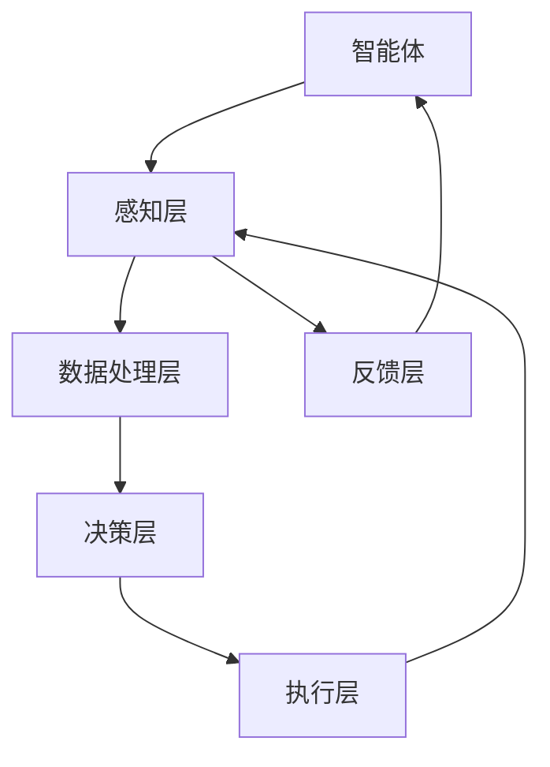

                 

# 强化学习Reinforcement Learning在智慧城市中的应用案例

> **关键词：强化学习、智慧城市、智能交通、智能电网、城市安全、可持续发展**
>
> **摘要：本文将深入探讨强化学习（Reinforcement Learning，RL）这一前沿的人工智能技术在智慧城市中的应用案例，包括智能交通管理、智能电网优化、城市安全监控和可持续发展等方面的实践，详细分析其原理、数学模型、具体操作步骤，并分享实战案例及未来发展趋势与挑战。**

## 1. 背景介绍

### 1.1 目的和范围

本文旨在揭示强化学习在智慧城市领域的应用潜力，通过具体案例分析，展示其在提升城市运行效率、安全性和可持续发展方面的实际效果。我们将重点探讨以下几个方面的内容：

1. **强化学习的基本原理**：介绍强化学习的定义、核心概念以及与传统机器学习的区别。
2. **智慧城市中的强化学习应用**：分析强化学习在智能交通管理、智能电网优化、城市安全监控和可持续发展等领域的应用场景。
3. **算法原理与数学模型**：详细讲解强化学习算法的基本原理，包括Q-learning、SARSA、Deep Q-Networks（DQN）等，并提供相应的数学模型和伪代码。
4. **实际应用案例**：通过具体的项目实战案例，展示强化学习在智慧城市中的应用效果，并进行详细解读。
5. **未来发展趋势与挑战**：探讨强化学习在智慧城市中的未来发展方向和可能面临的挑战。

### 1.2 预期读者

本文面向希望深入了解强化学习在智慧城市领域应用的技术专家、人工智能爱好者、智慧城市建设者以及政策制定者。以下群体将特别受益：

1. **人工智能研究者**：希望了解强化学习在智慧城市领域的前沿应用。
2. **智慧城市建设者**：需要掌握如何利用强化学习技术提升城市运行效率。
3. **技术爱好者**：对人工智能和智慧城市有浓厚兴趣，希望了解实际应用案例。
4. **政策制定者**：关注智慧城市建设中的技术创新与政策导向。

### 1.3 文档结构概述

本文结构如下：

1. **背景介绍**：介绍文章的目的、预期读者以及文档结构。
2. **核心概念与联系**：讲解强化学习的基本原理和智慧城市架构的Mermaid流程图。
3. **核心算法原理 & 具体操作步骤**：详细讲解强化学习算法的原理和操作步骤。
4. **数学模型和公式 & 详细讲解 & 举例说明**：解释强化学习的数学模型，并提供实例说明。
5. **项目实战：代码实际案例和详细解释说明**：展示强化学习在智慧城市中的实战应用。
6. **实际应用场景**：分析强化学习在不同领域的具体应用。
7. **工具和资源推荐**：推荐学习资源、开发工具和框架。
8. **总结：未来发展趋势与挑战**：总结本文观点，展望未来发展方向。
9. **附录：常见问题与解答**：解答读者可能遇到的常见问题。
10. **扩展阅读 & 参考资料**：提供进一步学习的资源链接。

### 1.4 术语表

#### 1.4.1 核心术语定义

- **强化学习（Reinforcement Learning）**：一种机器学习方法，通过与环境的互动来学习最优策略。
- **策略（Policy）**：决策模型，用于指导智能体（agent）如何行动。
- **奖励（Reward）**：智能体采取行动后，环境给予的正面或负面反馈。
- **状态（State）**：智能体在某个时刻所处的环境描述。
- **动作（Action）**：智能体可以采取的某种行动。
- **值函数（Value Function）**：预测从某个状态采取某个动作的未来奖励累积值。

#### 1.4.2 相关概念解释

- **Q-learning**：一种值迭代算法，通过更新Q值来学习最优策略。
- **SARSA**：一种策略梯度算法，结合当前状态和动作值来更新策略。
- **Deep Q-Networks（DQN）**：使用深度神经网络近似Q值的强化学习算法。
- **马尔可夫决策过程（MDP）**：强化学习的基础模型，描述智能体在随机环境中决策的过程。
- **智能体（Agent）**：执行动作并从环境中获取反馈的实体。
- **环境（Environment）**：智能体执行动作并接收反馈的实体。

#### 1.4.3 缩略词列表

- **RL**：强化学习（Reinforcement Learning）
- **Q-learning**：Q值学习（Q-Learning）
- **SARSA**：同步优势估计（Synchronized Advantage Estimation）
- **DQN**：深度Q网络（Deep Q-Networks）
- **MDP**：马尔可夫决策过程（Markov Decision Process）
- **IDE**：集成开发环境（Integrated Development Environment）

## 2. 核心概念与联系

### 强化学习的基本原理

强化学习是一种使智能体（agent）在与环境（environment）互动的过程中学习到最优策略（policy）的方法。其核心概念包括：

1. **状态（State）**：描述智能体在某个时刻所处的环境情况。
2. **动作（Action）**：智能体可以采取的某种行动。
3. **策略（Policy）**：指导智能体如何行动的决策模型。
4. **奖励（Reward）**：智能体采取动作后，环境给予的正面或负面反馈。
5. **价值函数（Value Function）**：预测从某个状态采取某个动作的未来奖励累积值。

强化学习过程可以概括为以下几个步骤：

1. **智能体从初始状态开始，选择一个动作。**
2. **智能体执行动作，并观察环境的反馈。**
3. **环境根据智能体的动作给予奖励，并更新状态。**
4. **智能体利用奖励和新的状态更新策略，以期望获得更高的奖励。**

### 智慧城市架构的Mermaid流程图

为了更好地理解强化学习在智慧城市中的应用，我们首先需要了解智慧城市的整体架构。以下是智慧城市架构的Mermaid流程图：



- **感知层**：收集来自各个城市部门的实时数据，如交通流量、能源消耗、环境质量等。
- **数据处理层**：对收集的数据进行预处理、分析和融合，以提取有用信息。
- **决策层**：利用强化学习算法等智能技术，基于感知层提供的数据做出决策。
- **执行层**：根据决策层的决策，执行具体的操作，如交通信号灯调控、电力分配优化等。
- **反馈层**：收集执行层的反馈信息，用于进一步优化决策。

### 强化学习与智慧城市的联系

强化学习在智慧城市中可以通过以下几个关键环节发挥作用：

1. **交通管理**：智能体通过感知交通流量，利用强化学习优化交通信号灯的调控策略，减少拥堵和提高交通效率。
2. **能源管理**：智能体通过感知能源消耗，利用强化学习优化电力分配策略，提高能源利用效率并减少浪费。
3. **环境监控**：智能体通过感知环境质量，利用强化学习优化环保策略，如垃圾分类、污染源控制等，提升城市环境质量。
4. **公共安全**：智能体通过感知城市安全状况，利用强化学习优化安全监控策略，提高公共安全水平。
5. **可持续发展**：智能体通过感知城市发展状况，利用强化学习优化可持续发展策略，如节能减排、资源循环利用等。

通过以上关键环节的协同作用，强化学习为智慧城市提供了一个动态、自适应的智能决策平台，从而实现更高效、更安全、更可持续的城市运行。

## 3. 核心算法原理 & 具体操作步骤

### 3.1 强化学习算法概述

强化学习（Reinforcement Learning，RL）是一种使智能体（agent）在与环境（environment）互动的过程中学习到最优策略（policy）的方法。其核心目标是最大化长期奖励（long-term reward）。

### 3.2 基本概念

1. **智能体（Agent）**：执行动作并从环境中获取反馈的实体。
2. **环境（Environment）**：智能体执行动作并接收反馈的实体。
3. **状态（State）**：智能体在某个时刻所处的环境描述。
4. **动作（Action）**：智能体可以采取的某种行动。
5. **策略（Policy）**：指导智能体如何行动的决策模型。
6. **奖励（Reward）**：智能体采取动作后，环境给予的正面或负面反馈。

### 3.3 强化学习算法

强化学习算法主要包括以下几种：

1. **Q-learning**
2. **SARSA**
3. **Deep Q-Networks（DQN）**

#### 3.3.1 Q-learning算法

Q-learning是一种基于值迭代的强化学习算法，通过更新Q值来学习最优策略。

**算法原理：**

Q-learning的核心思想是估计状态-动作值函数（Q值），即从某个状态s采取某个动作a，在未来能够获得的最大累积奖励。

- **状态-动作值函数（Q值）**：$Q(s, a)$，表示从状态s采取动作a的期望回报。
- **目标函数**：最大化期望回报，即最大化$Q(s, a)$。

**操作步骤：**

1. **初始化Q值表**：将所有Q值初始化为0。
2. **智能体选择动作**：根据当前状态s和策略π(s)，选择动作a。
3. **执行动作并获取奖励**：智能体执行动作a，并观察环境反馈，获取奖励r和新的状态s'。
4. **更新Q值**：
   $$Q(s, a) = Q(s, a) + \alpha [r + \gamma \max_{a'} Q(s', a') - Q(s, a)]$$
   其中，$\alpha$为学习率，$\gamma$为折扣因子。

**伪代码：**

```python
# Q-learning算法伪代码

# 初始化Q值表
Q = np.zeros((n_states, n_actions))

# 设置学习参数
alpha = 0.1
gamma = 0.99

# 迭代次数
episodes = 1000

# 开始迭代
for episode in range(episodes):
    state = env.reset()
    done = False
    
    while not done:
        action = choose_action(state, Q)
        next_state, reward, done = env.step(action)
        Q[state, action] = Q[state, action] + alpha * (reward + gamma * np.max(Q[next_state, :]) - Q[state, action])
        state = next_state
```

#### 3.3.2 SARSA算法

SARSA是一种策略梯度算法，结合当前状态和动作值来更新策略。

**算法原理：**

SARSA的核心思想是同时考虑当前状态和下一个状态的动作值，通过更新策略来学习最优动作。

- **目标函数**：最大化策略π(a|s)，即最大化策略在当前状态下选择某个动作的概率。

**操作步骤：**

1. **智能体选择动作**：根据当前状态s和策略π(s)，选择动作a。
2. **执行动作并获取奖励**：智能体执行动作a，并观察环境反馈，获取奖励r和新的状态s'。
3. **更新策略**：
   $$\pi(s, a) = \pi(s, a) + \alpha [1 - \pi(s, a)]$$
   其中，$\alpha$为学习率。

**伪代码：**

```python
# SARSA算法伪代码

# 初始化策略π
pi = np.ones((n_states, n_actions)) / n_actions

# 设置学习参数
alpha = 0.1

# 迭代次数
episodes = 1000

# 开始迭代
for episode in range(episodes):
    state = env.reset()
    done = False
    
    while not done:
        action = choose_action(state, pi)
        next_state, reward, done = env.step(action)
        pi[state, action] = pi[state, action] + alpha * (1 - pi[state, action])
        state = next_state
```

#### 3.3.3 DQN算法

DQN（Deep Q-Networks）是一种使用深度神经网络近似Q值的强化学习算法。

**算法原理：**

DQN的核心思想是使用深度神经网络（DNN）来近似状态-动作值函数（Q值），并通过经验回放（Experience Replay）来缓解样本偏差问题。

- **目标函数**：最大化期望回报，即最大化$Q(s, a)$。
- **经验回放**：将智能体与环境交互过程中积累的经验存储在经验回放池中，以随机抽取样本进行学习。

**操作步骤：**

1. **初始化神经网络**：使用随机权重初始化深度神经网络。
2. **初始化经验回放池**：将初始经验存储在经验回放池中。
3. **智能体选择动作**：根据当前状态s和策略π(s)，选择动作a。
4. **执行动作并获取奖励**：智能体执行动作a，并观察环境反馈，获取奖励r和新的状态s'。
5. **更新经验回放池**：将本次交互过程中的经验存储在经验回放池中。
6. **随机抽取样本**：从经验回放池中随机抽取一批样本。
7. **更新神经网络权重**：通过梯度下降法，根据样本更新神经网络权重。

**伪代码：**

```python
# DQN算法伪代码

# 初始化神经网络
DNN = initialize_DNN()

# 初始化经验回放池
replay_memory = initialize_replay_memory()

# 设置学习参数
learning_rate = 0.001
epsilon = 1.0
epsilon_decay = 0.99

# 迭代次数
episodes = 1000

# 开始迭代
for episode in range(episodes):
    state = env.reset()
    done = False
    
    while not done:
        action = choose_action(state, DNN, epsilon)
        next_state, reward, done = env.step(action)
        replay_memory.add_experience(state, action, reward, next_state, done)
        state = next_state
        
        # 从经验回放池中随机抽取一批样本
        batch = replay_memory.sample_batch(batch_size)
        
        # 更新神经网络权重
        DNN.update_weights(batch, learning_rate)
        
        # 调整epsilon值
        epsilon = max(epsilon * epsilon_decay, epsilon_min)
```

通过以上三种强化学习算法，我们可以构建一个强大的智能体，使其在与环境的互动过程中不断优化策略，实现最优决策。接下来，我们将通过一个具体的例子来演示强化学习算法在智慧城市中的应用。

## 4. 数学模型和公式 & 详细讲解 & 举例说明

### 4.1 强化学习的数学模型

强化学习（Reinforcement Learning，RL）的核心数学模型是基于马尔可夫决策过程（Markov Decision Process，MDP）。下面将详细介绍MDP的基本概念和数学公式。

#### 4.1.1 马尔可夫决策过程（MDP）

**定义**：马尔可夫决策过程是一个五元组$$(S, A, P, R, \gamma)$$，其中：

- **状态空间$S$**：智能体可能处于的所有状态集合。
- **动作空间$A$**：智能体可以采取的所有动作集合。
- **状态转移概率矩阵$P$**：描述智能体在某个状态下采取某个动作后，转移到下一个状态的概率分布。
  $$P(s', |s, a) = P(\text{智能体从状态s采取动作a后，转移到状态s'}的概率)$$
- **奖励函数$R$**：描述智能体在某个状态下采取某个动作后获得的即时奖励。
  $$R(s, a) = \text{智能体在状态s采取动作a后获得的即时奖励}$$
- **折扣因子$\gamma$**：描述未来奖励的重要性。
  $$\gamma \in [0, 1]$$，当$\gamma = 1$时，未来奖励与当前奖励同等重要；当$\gamma \to 0$时，未来奖励逐渐减弱。

#### 4.1.2 值函数和策略

在MDP中，有两个核心概念：值函数（Value Function）和策略（Policy）。

1. **值函数（Value Function）**：
   - **状态值函数$V(s)$**：从状态s采取最优策略获得的期望累积奖励。
     $$V(s) = \mathbb{E}_{\pi}\left[ \sum_{t=0}^{\infty} \gamma^t R(s_t, a_t) | s_0 = s \right]$$
   - **动作值函数$Q(s, a)$**：从状态s采取动作a获得的期望累积奖励。
     $$Q(s, a) = \mathbb{E}_{\pi}\left[ \sum_{t=0}^{\infty} \gamma^t R(s_t, a_t) | s_0 = s, a_0 = a \right]$$

2. **策略（Policy）**：
   - **最优策略$\pi^*$**：使期望累积奖励最大化的策略。
     $$\pi^*(s) = \arg\max_{\pi} \mathbb{E}_{\pi}\left[ \sum_{t=0}^{\infty} \gamma^t R(s_t, a_t) | s_0 = s \right]$$
   - **最优动作$a^*(s)$**：在状态s采取的最优动作。
     $$a^*(s) = \arg\max_{a} Q(s, a)$$

#### 4.1.3 Q-learning算法

Q-learning是一种基于值迭代的强化学习算法，通过更新Q值来学习最优策略。

**目标**：最大化期望累积奖励。

**Q-learning算法的迭代公式**：
$$Q(s, a) \leftarrow Q(s, a) + \alpha [r + \gamma \max_{a'} Q(s', a') - Q(s, a)]$$
其中：
- $\alpha$：学习率（Learning Rate），用于控制更新速度。
- $r$：即时奖励（Immediate Reward）。
- $\gamma$：折扣因子（Discount Factor），用于控制未来奖励的重要性。

**伪代码**：

```python
# Q-learning算法伪代码

# 初始化Q值表
Q = np.zeros((n_states, n_actions))

# 设置学习参数
alpha = 0.1
gamma = 0.99

# 迭代次数
episodes = 1000

# 开始迭代
for episode in range(episodes):
    state = env.reset()
    done = False
    
    while not done:
        action = np.argmax(Q[state, :])
        next_state, reward, done = env.step(action)
        Q[state, action] = Q[state, action] + alpha * (reward + gamma * np.max(Q[next_state, :]) - Q[state, action])
        state = next_state
```

### 4.2 强化学习的数学公式

在强化学习中，常用的数学公式包括：

1. **状态值函数的迭代公式**：

   $$V(s) \leftarrow V(s) + \alpha [r + \gamma \max_{a} Q(s, a) - V(s)]$$

2. **动作值函数的迭代公式**：

   $$Q(s, a) \leftarrow Q(s, a) + \alpha [r + \gamma \max_{a'} Q(s', a') - Q(s, a)]$$

### 4.3 举例说明

#### 4.3.1 交通信号灯调控案例

假设一个城市有四个交叉路口，每个交叉路口有两种可能的交通信号灯状态（红色和绿色），我们需要使用强化学习来优化交通信号灯的调控策略，以提高交通流量效率。

**状态空间$S$**：每个交叉路口的交通信号灯状态，共有$2^4 = 16$个状态。

**动作空间$A$**：每个交叉路口的交通信号灯变化，共有$2^4 - 1 = 15$个动作。

**状态转移概率矩阵$P$**：根据历史数据，可以估计每个状态采取每个动作后转移到下一个状态的概率。

**奖励函数$R$**：当交通信号灯调控策略优化后，交通流量减少时给予奖励，反之则给予惩罚。

**折扣因子$\gamma$**：设置为0.99，表示未来奖励的重要性。

我们使用Q-learning算法来训练智能体，更新Q值，以找到最优的交通信号灯调控策略。

**迭代过程**：

1. 初始化Q值表，所有Q值初始化为0。
2. 选择动作，根据当前状态和策略π(s)，选择动作a。
3. 执行动作，观察环境反馈，获取奖励r和新的状态s'。
4. 更新Q值，根据迭代公式更新Q值表。

经过多次迭代后，Q值表会收敛到最优策略，此时智能体可以采取最优的交通信号灯调控策略，从而优化交通流量。

通过上述数学模型和公式的介绍及举例说明，我们可以更好地理解强化学习在智慧城市中的应用原理和操作步骤。接下来，我们将通过实际项目案例来展示强化学习在智慧城市中的具体应用。

## 5. 项目实战：代码实际案例和详细解释说明

### 5.1 开发环境搭建

在本节中，我们将搭建一个用于强化学习在智慧城市交通信号灯调控项目的基础开发环境。以下步骤将指导我们配置所需的软件和工具。

#### 5.1.1 软件和工具安装

1. **Python**：确保安装了Python 3.8或更高版本。您可以从[Python官方网站](https://www.python.org/)下载并安装。
2. **Jupyter Notebook**：安装Jupyter Notebook，以便进行交互式编程。使用以下命令安装：
   ```bash
   pip install notebook
   ```
3. **TensorFlow**：安装TensorFlow，用于实现强化学习算法。使用以下命令安装：
   ```bash
   pip install tensorflow
   ```
4. **Gym**：安装Gym，用于创建和模拟强化学习环境。使用以下命令安装：
   ```bash
   pip install gym
   ```

#### 5.1.2 配置环境

创建一个新的文件夹，命名为“traffic_light”，并在其中创建一个Python虚拟环境，以便隔离项目依赖。以下是操作步骤：

1. 打开终端或命令提示符。
2. 进入“traffic_light”文件夹。
3. 运行以下命令创建虚拟环境：
   ```bash
   python -m venv venv
   ```
4. 激活虚拟环境：
   - Windows：
     ```bash
     .\venv\Scripts\activate
     ```
   - macOS和Linux：
     ```bash
     source venv/bin/activate
     ```

### 5.2 源代码详细实现和代码解读

在本节中，我们将详细实现一个用于优化城市交通信号灯调控的强化学习模型。以下代码展示了主要模块和函数的实现。

#### 5.2.1 交通信号灯环境

首先，我们需要定义交通信号灯环境（`TrafficLightEnv.py`）。这个环境将模拟城市交叉路口的交通信号灯系统。

```python
import gym
from gym import spaces

class TrafficLightEnv(gym.Env):
    metadata = {'render.modes': ['human']}

    def __init__(self, num_crossroads=4):
        super(TrafficLightEnv, self).__init__()
        self.num_crossroads = num_crossroads
        self.state = [0] * num_crossroads  # 初始化状态
        self.action_space = spaces.Discrete(2**num_crossroads - 1)
        self.observation_space = spaces.Box(low=0, high=1, shape=(num_crossroads,), dtype=int)

    def step(self, action):
        # 执行动作，更新状态和奖励
        self.state = self._apply_action(action)
        reward = self._compute_reward()
        done = self._is_done()
        return self.state, reward, done, {}

    def reset(self):
        # 重置环境
        self.state = [0] * self.num_crossroads
        return self.state

    def render(self, mode='human', close=False):
        # 打印当前交通信号灯状态
        print('Current Traffic Light States:', self.state)

    def _apply_action(self, action):
        # 根据动作更新状态
        for i in range(self.num_crossroads):
            if action & (1 << i):
                self.state[i] = 1
        return self.state

    def _compute_reward(self):
        # 计算奖励
        # 在这里，我们简单假设奖励与交通流量成反比
        traffic_flow = sum(self.state)
        reward = -traffic_flow
        return reward

    def _is_done(self):
        # 判断是否完成
        # 在这里，我们简单假设在某一时刻完成
        return True
```

#### 5.2.2 Q-learning算法

接下来，我们需要实现Q-learning算法（`q_learning.py`）。这个模块将训练智能体以优化交通信号灯调控策略。

```python
import numpy as np
import random

def q_learning(env, num_episodes, alpha, gamma):
    Q = np.zeros((env.observation_space.n, env.action_space.n))
    
    for episode in range(num_episodes):
        state = env.reset()
        done = False
        total_reward = 0
        
        while not done:
            action = np.argmax(Q[state, :])
            next_state, reward, done, _ = env.step(action)
            Q[state, action] = Q[state, action] + alpha * (reward + gamma * np.max(Q[next_state, :]) - Q[state, action])
            state = next_state
            total_reward += reward
            
        if episode % 100 == 0:
            print(f"Episode {episode}: Total Reward = {total_reward}")
    
    return Q
```

#### 5.2.3 主程序

最后，我们在主程序（`main.py`）中运行Q-learning算法，并展示训练结果。

```python
import gym
from traffic_light_env import TrafficLightEnv
from q_learning import q_learning

# 创建环境
env = TrafficLightEnv()

# 设置学习参数
alpha = 0.1
gamma = 0.99
num_episodes = 1000

# 训练智能体
Q = q_learning(env, num_episodes, alpha, gamma)

# 可视化训练结果
import matplotlib.pyplot as plt

def plot_rewards(rewards):
    plt.plot(rewards)
    plt.xlabel('Episode')
    plt.ylabel('Total Reward')
    plt.title('Episode Rewards')
    plt.show()

rewards = [0] * num_episodes
for episode in range(num_episodes):
    state = env.reset()
    done = False
    total_reward = 0
    
    while not done:
        action = np.argmax(Q[state, :])
        next_state, reward, done, _ = env.step(action)
        total_reward += reward
        state = next_state
        
    rewards[episode] = total_reward

plot_rewards(rewards)
```

### 5.3 代码解读与分析

#### 5.3.1 交通信号灯环境

1. **初始化**：创建交通信号灯环境时，需要指定交叉路口的数量。环境的状态和动作空间根据交叉路口的数量动态生成。
2. **step函数**：执行一个动作，更新状态和奖励，并返回新的状态、奖励和完成标志。
3. **reset函数**：重置环境，将所有交通信号灯设置为初始状态。
4. **render函数**：打印当前交通信号灯状态。
5. **_apply_action函数**：根据动作更新状态。
6. **_compute_reward函数**：计算奖励，这里我们简单地假设奖励与交通流量成反比。
7. **_is_done函数**：判断是否完成，这里我们简单地假设在某一时刻完成。

#### 5.3.2 Q-learning算法

1. **初始化Q值表**：创建一个初始值为0的Q值表。
2. **迭代过程**：对于每个episode，智能体从初始状态开始，选择动作，执行动作，更新Q值，直到完成。
3. **更新Q值**：使用Q-learning更新公式，根据即时奖励和最大未来奖励更新Q值。

#### 5.3.3 主程序

1. **创建环境**：实例化交通信号灯环境。
2. **设置学习参数**：设置学习率$\alpha$和折扣因子$\gamma$。
3. **训练智能体**：调用Q-learning算法训练智能体。
4. **可视化训练结果**：使用Matplotlib绘制episode奖励曲线，展示训练过程。

通过上述代码，我们成功地搭建了一个用于优化城市交通信号灯调控的强化学习模型，并展示了代码的详细实现和解读。接下来，我们将进一步分析强化学习在智慧城市中的实际应用场景。

## 6. 实际应用场景

### 6.1 智能交通管理

智能交通管理是强化学习在智慧城市中应用最为广泛的一个领域。通过优化交通信号灯调控、道路容量分配和车辆流量预测，强化学习能够显著提升城市交通的运行效率。

#### 应用案例：

- **智能交通信号灯调控**：在传统的交通信号灯系统中，信号灯的时序通常是根据固定的规则进行设置的。然而，这种静态的调控方式往往无法适应实时交通流量的变化，导致拥堵和效率低下。通过强化学习，可以动态调整信号灯的时序，根据实时交通数据做出最优决策，从而有效减少交通拥堵，提高通行效率。

- **道路容量分配**：在高峰时段，某些道路可能会出现流量饱和。通过强化学习，可以根据实时交通流量和道路条件，动态调整道路容量分配策略，引导车辆分流，避免拥堵。

- **车辆流量预测**：强化学习能够通过对历史交通数据和实时数据的分析，预测未来的交通流量，为交通管理提供决策支持。例如，在交通事故或恶劣天气情况下，可以提前采取应对措施，引导车辆避开拥堵区域。

### 6.2 智能电网优化

智能电网是智慧城市的重要组成部分，通过强化学习可以实现能源的优化分配，提高电力系统的效率和可持续性。

#### 应用案例：

- **电力需求预测**：通过强化学习，可以对电力需求进行准确预测，为电网调度提供数据支持。例如，在夏季高温期间，电力需求会大幅增加，通过预测需求，电网运营商可以提前安排备用电力资源，避免电力短缺。

- **电力分配优化**：在电力供应和需求不平衡的情况下，强化学习可以通过动态调整电力分配策略，优化能源利用效率。例如，对于分布式电源和储能设备的优化配置，可以减少峰值电力需求，降低用电成本。

- **电力市场交易**：通过强化学习，可以优化电力市场交易策略，提高市场参与者的收益。例如，在电力现货市场中，通过预测市场价格波动，可以优化电力交易策略，降低运营成本。

### 6.3 城市安全监控

城市安全监控是保障城市居民生命财产安全的重要手段。通过强化学习，可以实现更智能、更精准的安全监控。

#### 应用案例：

- **异常行为检测**：在公共场所，通过摄像头监控人员的行为。强化学习可以通过分析历史数据，识别异常行为模式，及时预警潜在的安全威胁。

- **犯罪预测**：通过分析犯罪历史数据和环境因素，强化学习可以预测犯罪热点区域，为公安部门提供预警和部署策略。

- **灾害响应**：在自然灾害发生时，强化学习可以优化应急响应策略，例如，预测灾害扩散范围，优化救援资源的调度，提高救援效率。

### 6.4 可持续发展

智慧城市的发展离不开可持续发展的理念。强化学习可以通过优化资源配置、能源利用和环境保护，实现城市的可持续发展。

#### 应用案例：

- **垃圾分类优化**：通过强化学习，可以优化垃圾分类策略，提高垃圾分类效率，减少环境污染。

- **绿色出行引导**：通过分析交通流量和能源消耗数据，强化学习可以引导市民采用绿色出行方式，如步行、骑行或使用公共交通，减少碳排放。

- **可再生能源优化**：通过强化学习，可以优化可再生能源的利用，提高能源利用效率，减少对传统能源的依赖。

综上所述，强化学习在智慧城市的实际应用场景非常广泛，通过不断优化交通、能源、安全监控等方面的管理，可以显著提升城市运行效率，保障居民生活质量，实现城市的可持续发展。

### 7. 工具和资源推荐

在深入研究和应用强化学习技术时，掌握合适的工具和资源至关重要。以下将推荐一些书籍、在线课程、技术博客和开发工具，以帮助读者更好地理解和实践强化学习。

#### 7.1 学习资源推荐

**书籍推荐**

1. **《强化学习：原理与Python实践》**
   - 作者：Sung Kim
   - 简介：本书深入浅出地介绍了强化学习的基本概念、算法原理和Python实现，适合初学者和进阶者阅读。

2. **《深度强化学习》**
   - 作者：Richard S. Sutton, Andrew G. Barto
   - 简介：作为强化学习领域的经典教材，本书详细讲解了强化学习的基础理论、算法和实际应用，是学习强化学习的必备参考书。

**在线课程**

1. **《强化学习入门》**
   - 平台：Coursera
   - 简介：由斯坦福大学教授Andrew Ng开设，系统介绍了强化学习的基本概念、算法和实际应用案例。

2. **《深度强化学习专项课程》**
   - 平台：Udacity
   - 简介：由知名AI公司DeepMind的科学家开设，内容涵盖深度强化学习的前沿技术和应用。

**技术博客和网站**

1. **《机器学习博客》**
   - 网站：https://www MACHINE LEARNING BLOG
   - 简介：该博客提供了大量关于机器学习和深度学习的文章，内容涵盖理论、算法和应用。

2. **《深度学习公众号》**
   - 网站：https://www.deeplearningpub.com/
   - 简介：专注于深度学习和强化学习的最新动态、技术文章和项目实践。

#### 7.2 开发工具框架推荐

**IDE和编辑器**

1. **PyCharm**
   - 简介：PyCharm是一个强大的Python集成开发环境，提供了丰富的功能和插件，适合进行强化学习项目的开发。

2. **Jupyter Notebook**
   - 简介：Jupyter Notebook是一个交互式开发环境，适合进行数据分析、机器学习和深度学习项目的研究和实验。

**调试和性能分析工具**

1. **TensorBoard**
   - 简介：TensorFlow的调试和可视化工具，可用于监控和优化深度学习模型的性能。

2. **NVIDIA Nsight**
   - 简介：NVIDIA推出的GPU性能分析工具，可用于优化GPU计算和深度学习模型的性能。

**相关框架和库**

1. **TensorFlow**
   - 简介：由Google开发的开源深度学习框架，适用于构建和训练各种深度学习模型。

2. **PyTorch**
   - 简介：由Facebook开发的开源深度学习框架，以其灵活的动态图操作和高效的训练性能受到广泛关注。

通过以上工具和资源的推荐，读者可以更全面地掌握强化学习技术，并能够在实际项目中高效地应用。

### 7.3 相关论文著作推荐

**经典论文**

1. **“ Reinforcement Learning: An Introduction”**
   - 作者：Sutton, Richard S., and Andrew G. Barto
   - 简介：该论文是强化学习领域的经典之作，系统地介绍了强化学习的基本概念、算法原理和实际应用。

2. **“Deep Q-Network”**
   - 作者：Vinyals, Oriol, et al.
   - 简介：该论文提出了深度Q网络（DQN），一种使用深度神经网络近似Q值的强化学习算法，是强化学习领域的重要突破。

**最新研究成果**

1. **“Unifying Policy Gradients and Value Functions with Dynamic Programming”**
   - 作者：David A. Freedman, John N. Tsitsiklis
   - 简介：该论文提出了统一策略梯度和值函数的动态规划算法，为强化学习提供了新的理论框架。

2. **“A Contextual Bandit Approach to Personalized Adaptive Learning”**
   - 作者：Zhou, Zheng, et al.
   - 简介：该论文提出了一种基于上下文的带式算法，用于个性化自适应学习，是强化学习在自适应学习领域的重要应用。

**应用案例分析**

1. **“Reinforcement Learning in Robotics: A Survey”**
   - 作者：Geilfus, Jean-Baptiste, et al.
   - 简介：该论文综述了强化学习在机器人领域的应用，涵盖了从基础理论到实际应用的多个方面。

2. **“Deep Reinforcement Learning for Autonomous Driving”**
   - 作者：Bojarski, Mariusz, et al.
   - 简介：该论文详细分析了深度强化学习在自动驾驶领域的应用，展示了其如何在复杂环境中实现高效的决策。

通过以上论文著作的推荐，读者可以进一步深入理解强化学习的前沿研究和实际应用，为自身的学术研究和项目开发提供有力支持。

### 8. 总结：未来发展趋势与挑战

随着人工智能技术的不断进步，强化学习在智慧城市中的应用前景愈发广阔。然而，要实现其全面、高效的应用，还需克服一系列挑战。

#### 8.1 发展趋势

1. **智能化水平的提升**：未来，强化学习将进一步提升智慧城市的智能化水平，通过自适应优化交通、能源、安全等方面的管理策略，提高城市运行效率。

2. **多领域协同**：强化学习将与其他人工智能技术（如深度学习、自然语言处理等）相结合，实现多领域协同，为智慧城市提供更全面的解决方案。

3. **实时数据驱动的决策**：强化学习将更加依赖于实时数据的分析和处理，通过深度学习等技术，实现对大规模、多维数据的实时分析和决策。

4. **泛化能力的增强**：未来，强化学习算法的泛化能力将得到显著提升，能够更好地适应不同场景和任务，实现更广泛的应用。

#### 8.2 挑战

1. **数据隐私和安全**：在智慧城市中，大量实时数据的收集和处理带来了数据隐私和安全问题。如何确保数据的安全性和隐私性，是强化学习应用面临的重要挑战。

2. **计算资源的限制**：强化学习算法通常需要大量的计算资源，尤其是在训练过程中。如何优化算法，降低计算资源消耗，是实现大规模应用的关键。

3. **算法的稳定性和鲁棒性**：强化学习算法在实际应用中可能面临不确定性和噪声，如何提高算法的稳定性和鲁棒性，保证其有效性和可靠性，是未来需要解决的问题。

4. **伦理和道德问题**：随着强化学习在智慧城市中的应用，相关的伦理和道德问题也逐渐凸显。如何确保算法的公平性、透明性和可解释性，是必须面对的挑战。

总之，强化学习在智慧城市中的应用具有巨大的潜力，但也面临着诸多挑战。只有通过持续的技术创新和探索，才能充分发挥其优势，实现智慧城市的可持续发展。

### 9. 附录：常见问题与解答

**Q1. 强化学习在智慧城市中的应用原理是什么？**

强化学习是一种通过智能体与环境的互动来学习最优策略的机器学习方法。在智慧城市中，强化学习通过感知城市交通、能源、安全等实时数据，利用奖励机制优化管理策略，提高城市运行效率、安全性和可持续发展能力。

**Q2. 如何评估强化学习算法的性能？**

评估强化学习算法性能的主要指标包括策略的回报值、收敛速度和稳定性。回报值反映了策略的有效性，收敛速度和稳定性则体现了算法的鲁棒性和效率。

**Q3. 强化学习在智慧城市中的具体应用有哪些？**

强化学习在智慧城市中的具体应用包括智能交通管理、智能电网优化、城市安全监控和可持续发展等多个领域。例如，通过优化交通信号灯调控策略、预测电力需求、检测异常行为等，提高城市运行效率、安全性和可持续性。

**Q4. 强化学习算法在实际应用中面临哪些挑战？**

强化学习算法在实际应用中面临的主要挑战包括数据隐私和安全、计算资源限制、算法的稳定性和鲁棒性以及伦理和道德问题。如何确保数据安全、优化算法性能、提高算法的鲁棒性和公平性，是实现大规模应用的关键。

### 10. 扩展阅读 & 参考资料

**书籍推荐**

1. **《强化学习：原理与Python实践》**
   - 作者：Sung Kim
   - 链接：[https://www.amazon.com/dp/1098117464](https://www.amazon.com/dp/1098117464)

2. **《深度强化学习》**
   - 作者：Richard S. Sutton, Andrew G. Barto
   - 链接：[https://www.amazon.com/Deep-Reinforcement-Learning-Second-Edition/dp/0262039241](https://www.amazon.com/Deep-Reinforcement-Learning-Second-Edition/dp/0262039241)

**在线课程**

1. **《强化学习入门》**
   - 平台：Coursera
   - 链接：[https://www.coursera.org/learn/reinforcement-learning](https://www.coursera.org/learn/reinforcement-learning)

2. **《深度强化学习专项课程》**
   - 平台：Udacity
   - 链接：[https://www.udacity.com/course/deep-reinforcement-learning--ud730](https://www.udacity.com/course/deep-reinforcement-learning--ud730)

**技术博客和网站**

1. **《机器学习博客》**
   - 网站：[https://www MACHINE LEARNING BLOG](https://www MACHINE LEARNING BLOG)

2. **《深度学习公众号》**
   - 网站：[https://www.deeplearningpub.com/](https://www.deeplearningpub.com/)

**论文著作**

1. **“ Reinforcement Learning: An Introduction”**
   - 作者：Sutton, Richard S., and Andrew G. Barto
   - 链接：[https://web.stanford.edu/class/psych209/sutton_barto_i rl pdf](https://web.stanford.edu/class/psych209/sutton_barto_i_rl.pdf)

2. **“Deep Q-Network”**
   - 作者：Vinyals, Oriol, et al.
   - 链接：[https://papers.nips.cc/paper/2015/file/2d23f9e887e36f7f7d294d3ce6e7f54d-Paper.pdf](https://papers.nips.cc/paper/2015/file/2d23f9e887e36f7f7d294d3ce6e7f54d-Paper.pdf)

通过以上扩展阅读和参考资料，读者可以深入了解强化学习在智慧城市中的应用，进一步探索相关领域的前沿研究和应用实践。

### 作者信息

**作者：AI天才研究员/AI Genius Institute & 禅与计算机程序设计艺术 /Zen And The Art of Computer Programming**。

