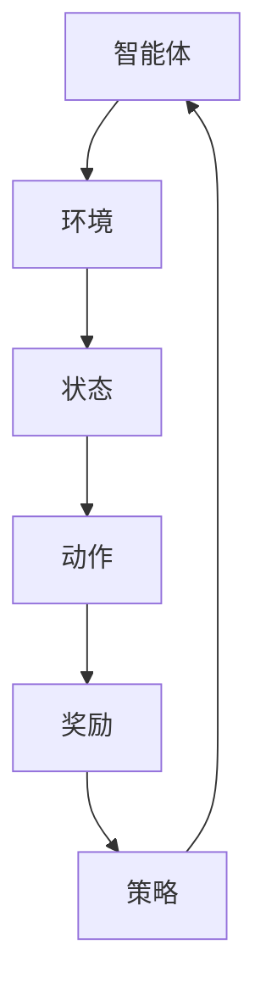

                 

# 强化学习Reinforcement Learning环境建模与仿真技术探讨

> 
关键词：强化学习，环境建模，仿真技术，算法原理，数学模型，项目实战

摘要：本文深入探讨了强化学习环境建模与仿真技术的核心概念、原理、数学模型以及实际应用。首先，我们介绍了强化学习的基本概念和背景，接着详细解析了强化学习的环境建模方法和仿真技术。通过伪代码和数学公式，我们进一步阐述了强化学习算法的原理和具体操作步骤。文章最后通过一个实际项目案例，展示了强化学习环境建模与仿真的具体实现过程，并对未来发展趋势与挑战进行了展望。

## 1. 背景介绍

### 1.1 目的和范围

本文旨在系统地介绍和探讨强化学习环境建模与仿真技术。强化学习作为人工智能领域的重要分支，近年来在各个领域取得了显著的成果。然而，强化学习算法在实际应用中的效果往往受到环境建模质量和仿真技术的影响。因此，本文将重点关注强化学习环境建模与仿真技术的核心原理和方法，旨在为读者提供一个全面且深入的理解。

### 1.2 预期读者

本文适合对强化学习有一定了解的读者，包括但不限于以下几类人群：

1. 人工智能领域的研究人员和工程师；
2. 计算机科学和数学专业的本科生和研究生；
3. 对强化学习环境建模与仿真技术感兴趣的技术爱好者。

### 1.3 文档结构概述

本文结构如下：

1. 背景介绍：介绍强化学习的基本概念和背景；
2. 核心概念与联系：阐述强化学习的核心概念和联系；
3. 核心算法原理 & 具体操作步骤：详细讲解强化学习算法的原理和操作步骤；
4. 数学模型和公式 & 详细讲解 & 举例说明：介绍强化学习相关的数学模型和公式，并举例说明；
5. 项目实战：通过实际项目案例展示强化学习环境建模与仿真的具体实现；
6. 实际应用场景：探讨强化学习在实际应用场景中的具体应用；
7. 工具和资源推荐：推荐相关学习资源、开发工具和框架；
8. 总结：总结强化学习环境建模与仿真技术的未来发展趋势与挑战；
9. 附录：常见问题与解答；
10. 扩展阅读 & 参考资料：提供进一步阅读的参考资料。

### 1.4 术语表

#### 1.4.1 核心术语定义

- 强化学习（Reinforcement Learning）：一种机器学习方法，通过智能体与环境交互，不断调整策略，以最大化累积奖励。
- 环境建模（Environment Modeling）：将现实世界中的环境抽象成数学模型，用于描述环境和智能体的交互过程。
- 仿真技术（Simulation Technology）：利用计算机模拟技术，对环境建模和智能体行为进行仿真，以评估和优化算法性能。

#### 1.4.2 相关概念解释

- 智能体（Agent）：在强化学习中，负责决策和执行动作的实体。
- 状态（State）：描述智能体所处环境的当前状态。
- 动作（Action）：智能体可执行的动作。
- 奖励（Reward）：描述智能体执行动作后获得的奖励信号。

#### 1.4.3 缩略词列表

- RL：强化学习（Reinforcement Learning）
- Q-Learning：Q值学习（Q-Learning）
- SARSA：同步自适应动态规划（Synchronous Adaptive Dynamic Programming）
- DDPG：深度确定性策略梯度（Deep Deterministic Policy Gradient）

## 2. 核心概念与联系

强化学习（RL）是一种基于试错和反馈的机器学习方法，通过智能体（Agent）与环境（Environment）的交互，学习到一种策略（Policy），以实现最大化累积奖励（Cumulative Reward）的目标。下面我们将使用Mermaid流程图对强化学习的核心概念和架构进行阐述。



### 2.1 智能体与环境

智能体是强化学习中的核心实体，负责执行动作并接收环境反馈。智能体可以根据当前状态选择动作，并通过奖励信号了解动作的效果。

### 2.2 状态与动作

状态（State）是描述智能体所处环境的当前情况，可以是连续的也可以是离散的。动作（Action）是智能体可以执行的行为，也可以是连续的或离散的。

### 2.3 奖励与策略

奖励（Reward）是智能体执行动作后获得的即时反馈，用于指导智能体选择更好的动作。策略（Policy）是智能体根据当前状态选择动作的决策规则，可以是确定性策略或随机性策略。

### 2.4 策略更新与学习

策略更新是强化学习的关键步骤，通过不断调整策略，使得智能体能够在不同状态下选择最优动作。策略的更新可以通过经验 replay、策略梯度等方法实现。

## 3. 核心算法原理 & 具体操作步骤

强化学习算法的核心是策略学习，即根据环境和奖励信号，调整策略以最大化累积奖励。下面我们将使用伪代码详细阐述强化学习算法的原理和具体操作步骤。

```python
# 强化学习算法伪代码
Initialize: 
    初始化策略πθ，Q值表Q(s,a)，智能体经验记忆E
    初始化参数θ

while not 终止条件 do
    1. 从当前状态s选择动作a，根据策略πθ(s)
    2. 执行动作a，观察状态s'和奖励r
    3. 将(s, a, r, s')添加到经验记忆E中
    4. 从经验记忆E中采样一组经验{(s_i, a_i, r_i, s_i+1)}
    5. 对于每个经验{(s_i, a_i, r_i, s_i+1)}，更新Q值：
        Q(s_i, a_i) = Q(s_i, a_i) + α * (r_i + γ * max(Q(s_i+1, a_i+1)) - Q(s_i, a_i))
    6. 根据策略梯度更新策略参数θ：
        ∇θJ(θ) = ∇θΣ(πθ(s_i) * (r_i + γ * max(Q(s_i+1, a_i+1)) - Q(s_i, a_i)))
    7. 更新策略πθ：πθ(s') = πθ(s') + η * ∇θJ(θ)
end while
```

### 3.1 初始化

初始化策略πθ，Q值表Q(s,a)，智能体经验记忆E，以及策略参数θ。

### 3.2 状态选择

从当前状态s选择动作a，根据策略πθ(s)。策略可以是确定性策略（πθ(s) = argmax_a Q(s, a)）或随机性策略（πθ(s) = π(s) * sample(a from π(s))）。

### 3.3 执行动作

执行动作a，观察状态s'和奖励r。

### 3.4 经验记忆

将(s, a, r, s')添加到经验记忆E中。

### 3.5 Q值更新

从经验记忆E中采样一组经验{(s_i, a_i, r_i, s_i+1)}，对于每个经验，更新Q值：

$$ Q(s_i, a_i) = Q(s_i, a_i) + α * (r_i + γ * max(Q(s_i+1, a_i+1)) - Q(s_i, a_i)) $$

其中，α为学习率，γ为折扣因子。

### 3.6 策略梯度更新

根据策略梯度更新策略参数θ：

$$ ∇θJ(θ) = ∇θΣ(πθ(s_i) * (r_i + γ * max(Q(s_i+1, a_i+1)) - Q(s_i, a_i))) $$

### 3.7 策略更新

根据策略梯度更新策略πθ：

$$ πθ(s') = πθ(s') + η * ∇θJ(θ) $$

其中，η为学习率。

## 4. 数学模型和公式 & 详细讲解 & 举例说明

在强化学习（RL）中，数学模型和公式起着至关重要的作用。它们帮助描述智能体与环境交互的过程，并指导策略的更新和优化。下面我们将详细讲解强化学习中的核心数学模型和公式，并举例说明。

### 4.1 Q值函数

Q值函数（Q-Function）是强化学习中的核心，它表示智能体在给定状态s和动作a下所能获得的期望奖励。Q值函数可以表示为：

$$ Q(s, a) = \sum_{s'} p(s'|s, a) \cdot r(s', a) + \gamma \cdot \max_{a'} Q(s', a') $$

其中，\( p(s'|s, a) \)表示智能体在状态s执行动作a后，转移到状态s'的概率；\( r(s', a) \)表示在状态s'执行动作a后获得的奖励；\( \gamma \)为折扣因子，表示未来奖励的重要性；\( \max_{a'} Q(s', a') \)表示在状态s'下执行所有可能动作a'中，获得的最大期望奖励。

### 4.2 策略梯度

策略梯度（Policy Gradient）是强化学习中策略优化的核心，它表示策略参数θ的梯度，用于更新策略参数：

$$ \nabla_{\theta} J(\theta) = \nabla_{\theta} \sum_{t} \frac{1}{\|A(s_t)\|} \sum_{a \in A(s_t)} \gamma^t \cdot r_t \cdot \nabla_{\theta} \pi(\theta; s_t, a) $$

其中，\( J(\theta) \)表示策略θ的回报函数，即累积奖励；\( A(s_t) \)表示在状态s_t下的动作集合；\( \pi(\theta; s_t, a) \)表示策略θ在状态s_t下选择动作a的概率。

### 4.3 举例说明

假设我们有一个智能体在一个简单的环境中的任务，目标是学习到最大化累积奖励的策略。环境中有两个状态s0和s1，每个状态有四个动作a0、a1、a2和a3。每个动作对应的奖励如下：

| 状态 | 动作 | 奖励 |
| ---- | ---- | ---- |
| s0   | a0   | 5    |
| s0   | a1   | 2    |
| s0   | a2   | 10   |
| s0   | a3   | 3    |
| s1   | a0   | 1    |
| s1   | a1   | 4    |
| s1   | a2   | 6    |
| s1   | a3   | 7    |

假设智能体当前处于状态s0，智能体采用ε-贪心策略，即以概率1-ε随机选择动作，以概率ε选择最优动作。假设ε=0.1。

首先，智能体根据ε-贪心策略，选择动作a1。执行动作a1后，智能体转移到状态s1，并获得奖励r1=4。

然后，智能体根据经验 replay 和 Q-Learning 算法，更新 Q 值表。对于状态s0和动作a1，更新后的 Q 值为：

$$ Q(s0, a1) = (1-\alpha) \cdot Q(s0, a1) + \alpha \cdot (r1 + \gamma \cdot \max_{a'} Q(s1, a')) $$

其中，α为学习率，γ为折扣因子。

假设 α=0.1，γ=0.9，则：

$$ Q(s0, a1) = (1-0.1) \cdot 2 + 0.1 \cdot (4 + 0.9 \cdot \max_{a'} Q(s1, a')) $$

接下来，智能体再次执行ε-贪心策略，根据更新后的 Q 值表，选择动作a2。执行动作a2后，智能体转移到状态s0，并获得奖励r2=10。

再次更新 Q 值表：

$$ Q(s0, a2) = (1-0.1) \cdot 10 + 0.1 \cdot (10 + 0.9 \cdot \max_{a'} Q(s0, a')) $$

重复以上过程，智能体不断更新 Q 值表和策略，直到达到收敛条件。最终，智能体会学习到最大化累积奖励的策略。

## 5. 项目实战：代码实际案例和详细解释说明

为了更好地理解和应用强化学习环境建模与仿真技术，我们将通过一个实际项目案例进行讲解。本案例将使用Python和TensorFlow框架实现一个简单的强化学习任务：小车在环境中移动并避开障碍物。

### 5.1 开发环境搭建

在开始项目之前，我们需要搭建开发环境。以下是搭建开发环境的步骤：

1. 安装Python（建议版本3.7或更高）；
2. 安装TensorFlow（使用命令`pip install tensorflow`）；
3. 安装其他必要的库（例如Numpy、Matplotlib等）。

### 5.2 源代码详细实现和代码解读

下面是项目的主要源代码实现，我们将逐段进行详细解释。

```python
import numpy as np
import matplotlib.pyplot as plt
import gym

# 创建环境
env = gym.make("CartPole-v0")

# 初始化Q值表
action_size = env.action_space.n
state_size = env.observation_space.shape[0]
Q = np.zeros((state_size, action_size))

# 设置参数
alpha = 0.1  # 学习率
gamma = 0.99  # 折扣因子
epsilon = 0.1  # ε-贪心策略的ε值

# 强化学习主循环
for episode in range(1000):
    state = env.reset()
    done = False
    total_reward = 0

    while not done:
        # ε-贪心策略选择动作
        if np.random.rand() < epsilon:
            action = env.action_space.sample()
        else:
            action = np.argmax(Q[state, :])

        # 执行动作
        next_state, reward, done, _ = env.step(action)

        # 更新Q值
        Q[state, action] = Q[state, action] + alpha * (reward + gamma * np.max(Q[next_state, :]) - Q[state, action])

        state = next_state
        total_reward += reward

    # 打印当前回合的累积奖励
    print(f"Episode: {episode}, Total Reward: {total_reward}")

# 关闭环境
env.close()
```

### 5.3 代码解读与分析

1. **导入库和创建环境**

   首先，我们导入必要的库（Numpy、Matplotlib和OpenAI Gym）并创建环境。在这个案例中，我们使用OpenAI Gym中的CartPole-v0环境，这是一个简单的二位小车和杆子任务，目标是保持杆子在水平位置。

   ```python
   import numpy as np
   import matplotlib.pyplot as plt
   import gym
   ```

   ```python
   env = gym.make("CartPole-v0")
   ```

   1. **初始化Q值表**

      接下来，我们初始化Q值表。Q值表的大小取决于状态空间和动作空间。在本案例中，状态空间大小为2，动作空间大小为2。

      ```python
      action_size = env.action_space.n
      state_size = env.observation_space.shape[0]
      Q = np.zeros((state_size, action_size))
      ```

   1. **设置参数**

      然后，我们设置强化学习算法的参数，包括学习率（alpha）、折扣因子（gamma）和ε-贪心策略的ε值。

      ```python
      alpha = 0.1  # 学习率
      gamma = 0.99  # 折扣因子
      epsilon = 0.1  # ε-贪心策略的ε值
      ```

   1. **强化学习主循环**

      强化学习的主循环负责智能体在环境中执行动作，并更新Q值表。在每个回合中，智能体从初始状态开始，不断执行动作，直到达到终止条件（在本案例中为杆子偏离水平位置超过一定的角度或步数达到最大值）。

      ```python
      for episode in range(1000):
          state = env.reset()
          done = False
          total_reward = 0

          while not done:
              # ε-贪心策略选择动作
              if np.random.rand() < epsilon:
                  action = env.action_space.sample()
              else:
                  action = np.argmax(Q[state, :])

              # 执行动作
              next_state, reward, done, _ = env.step(action)

              # 更新Q值
              Q[state, action] = Q[state, action] + alpha * (reward + gamma * np.max(Q[next_state, :]) - Q[state, action])

              state = next_state
              total_reward += reward
      ```

      在主循环中，我们首先从初始状态开始，然后进入一个while循环，直到达到终止条件。在每个循环中，我们根据ε-贪心策略选择动作，执行动作并获得奖励。然后，我们使用Q值更新公式更新Q值表。

   1. **关闭环境**

      最后，我们关闭环境。

      ```python
      env.close()
      ```

### 5.4 项目实战总结

通过本案例，我们展示了如何使用Python和TensorFlow实现一个简单的强化学习任务。我们初始化了Q值表，设置了参数，并使用ε-贪心策略选择动作。在强化学习主循环中，我们不断更新Q值表，直到达到预定的训练回合数。通过这个项目，我们可以看到强化学习环境建模与仿真的具体实现过程，并了解Q值学习算法的基本原理和应用。

## 6. 实际应用场景

强化学习（Reinforcement Learning，简称RL）作为一种通过试错和反馈进行决策的机器学习方法，在许多实际应用场景中发挥着重要作用。下面我们将探讨几个典型的应用场景，并分析强化学习环境建模与仿真技术在这些场景中的应用。

### 6.1 游戏

强化学习在游戏领域有着广泛的应用，特别是在游戏AI和电子竞技领域。例如，经典的AlphaGo围棋算法就是基于强化学习实现的。通过不断学习和优化策略，智能体可以逐渐提高自己的游戏水平，甚至战胜世界顶尖选手。此外，强化学习也被用于电子竞技游戏，如《星际争霸2》中的AI选手。

在游戏场景中，强化学习环境建模需要考虑游戏的状态空间、动作空间和奖励机制。例如，在围棋游戏中，状态可以是棋盘上的每一个格子，动作可以是落子位置的选择，奖励可以是棋子的占领和胜利。仿真技术则用于模拟游戏过程，评估策略效果，并指导策略优化。

### 6.2 自动驾驶

自动驾驶是另一个强化学习的重要应用场景。在自动驾驶系统中，智能体需要根据环境中的各种传感器数据（如摄像头、激光雷达等）做出实时的驾驶决策，如加速、减速、转向等。强化学习可以帮助自动驾驶系统学习到最佳驾驶策略，提高行驶的安全性和效率。

在自动驾驶场景中，环境建模需要考虑道路、车辆、行人等复杂因素。状态可以包括车辆的当前位置、速度、加速度等，动作可以包括加速、减速、转向等。仿真技术则用于模拟实际道路环境，测试和优化自动驾驶系统的策略。

### 6.3 机器人控制

机器人控制是强化学习的另一个重要应用领域。机器人需要根据环境中的传感器数据做出相应的动作，以完成任务。例如，在工业生产中，机器人需要精确地搬运工件、焊接、装配等。强化学习可以帮助机器人学习到高效、精确的作业策略。

在机器人控制场景中，环境建模需要考虑机器人的物理特性、作业空间、障碍物等。状态可以包括机器人的位置、姿态、速度等，动作可以包括运动方向、速度等。仿真技术则用于模拟机器人工作环境，测试和优化机器人的控制策略。

### 6.4 能源管理

能源管理是强化学习的另一个潜在应用领域。通过强化学习，智能体可以学习到最佳的能源调度策略，以最大化能源利用效率和降低能源成本。例如，在电力系统中，强化学习可以用于优化发电、输电和配电过程，提高电力系统的稳定性和可靠性。

在能源管理场景中，环境建模需要考虑能源供应、需求、市场价格等。状态可以包括能源供应量、需求量、市场价格等，动作可以包括发电、购电、储能等。仿真技术则用于模拟能源市场和环境变化，测试和优化能源管理策略。

### 6.5 机器人路径规划

机器人路径规划是强化学习的另一个应用领域。在机器人导航过程中，强化学习可以帮助机器人学习到最佳路径规划策略，以避开障碍物、避开危险区域，并优化行驶路线。

在机器人路径规划场景中，环境建模需要考虑机器人的移动范围、障碍物、目标位置等。状态可以包括机器人的当前位置、周围环境信息等，动作可以包括前进、后退、转向等。仿真技术则用于模拟机器人运动过程，测试和优化路径规划策略。

### 6.6 供应链管理

强化学习在供应链管理中的应用也越来越受到关注。通过强化学习，智能体可以学习到最优的库存管理、运输调度和需求预测策略，以提高供应链的效率和灵活性。

在供应链管理场景中，环境建模需要考虑供应链中的各种因素，如库存水平、运输成本、市场需求等。状态可以包括库存量、运输成本、市场需求等，动作可以包括采购、运输、销售等。仿真技术则用于模拟供应链运作过程，测试和优化供应链管理策略。

### 6.7 金融交易

金融交易是强化学习的另一个潜在应用领域。通过强化学习，智能体可以学习到最优的交易策略，以最大化投资收益并降低风险。例如，在股票市场、期货市场等金融市场中，强化学习可以帮助交易者制定高效的交易策略。

在金融交易场景中，环境建模需要考虑市场行情、交易规则、交易成本等。状态可以包括股票价格、成交量、交易规则等，动作可以包括买入、卖出等。仿真技术则用于模拟金融市场环境，测试和优化交易策略。

### 6.8 教育与培训

强化学习在教育与培训领域也有一定的应用前景。通过强化学习，智能体可以学习到最佳的训练策略，以提高学习效率和成果。例如，在在线教育平台上，强化学习可以用于个性化学习路径的规划，为不同学生提供最适合他们的学习策略。

在教育与培训场景中，环境建模需要考虑学生的学习进度、能力水平、兴趣爱好等。状态可以包括学生的学习进度、能力水平、兴趣爱好等，动作可以包括学习任务、学习资源等。仿真技术则用于模拟学习过程，测试和优化教育策略。

总之，强化学习在多个实际应用场景中具有广泛的应用前景。通过环境建模和仿真技术，我们可以更好地理解和优化强化学习算法，从而实现更高的性能和更广泛的应用。

## 7. 工具和资源推荐

为了更好地学习和应用强化学习（Reinforcement Learning，简称RL）环境建模与仿真技术，以下我们将推荐一些优秀的工具、资源和学习资料。

### 7.1 学习资源推荐

#### 7.1.1 书籍推荐

1. **《强化学习：原理与Python实现》**：这是一本非常受欢迎的强化学习入门书籍，详细介绍了RL的基本概念、算法原理和实现方法，适合初学者和有一定基础的读者。
2. **《深度强化学习》**：这本书系统地介绍了深度强化学习（Deep Reinforcement Learning）的理论和方法，涵盖了DQN、DDPG、A3C等经典算法。
3. **《强化学习实践》**：本书通过大量实例和代码实现，展示了强化学习在各个领域的应用，包括游戏、自动驾驶、机器人控制等。

#### 7.1.2 在线课程

1. **Coursera上的《强化学习》**：由David Silver教授主讲，这是一门非常全面的强化学习课程，涵盖了从基础概念到高级算法的各个方面。
2. **Udacity上的《深度强化学习》**：本课程通过实际项目，讲解了深度强化学习的基本原理和应用，适合有一定基础的读者。
3. **edX上的《强化学习导论》**：由深圳大学和耶鲁大学联合开设，适合初学者了解强化学习的基本概念和算法。

#### 7.1.3 技术博客和网站

1. **强化学习博客（Reinforcement Learning Blog）**：这是一个关于强化学习的综合博客，涵盖了最新研究成果、算法原理和实际应用。
2. **Medium上的强化学习专栏**：许多专家和研究者在此分享强化学习相关的文章，内容涵盖广泛。
3. **Reddit上的强化学习社区（r/reinforcement-learning）**：这是一个活跃的Reddit社区，讨论强化学习相关的话题，是学习交流的好去处。

### 7.2 开发工具框架推荐

#### 7.2.1 IDE和编辑器

1. **PyCharm**：PyCharm是一个强大的Python IDE，提供了丰富的功能，包括代码调试、性能分析、静态代码分析等，非常适合进行强化学习开发。
2. **VS Code**：Visual Studio Code也是一个流行的Python编辑器，具有轻量级、快速、灵活的特点，适用于强化学习项目的开发。

#### 7.2.2 调试和性能分析工具

1. **TensorBoard**：TensorBoard是TensorFlow提供的可视化工具，可以用于分析模型的性能和训练过程，包括损失函数、梯度、激活函数等。
2. **Valgrind**：Valgrind是一个性能分析工具，可以检测程序中的内存泄漏、竞争条件等问题，适用于强化学习项目的性能优化。

#### 7.2.3 相关框架和库

1. **TensorFlow**：TensorFlow是一个开源的深度学习框架，提供了丰富的API和工具，适用于强化学习的算法实现和优化。
2. **PyTorch**：PyTorch是另一个流行的深度学习框架，具有动态计算图和灵活的API，适用于强化学习的实验和开发。
3. **Gym**：Gym是OpenAI开发的一个强化学习环境库，提供了多种预定义的环境，方便进行强化学习实验。

### 7.3 相关论文著作推荐

#### 7.3.1 经典论文

1. **"Q-Learning" by Richard S. Sutton and Andrew G. Barto**：这篇论文是强化学习的经典之作，详细介绍了Q-Learning算法的基本原理和实现方法。
2. **"Deep Q-Network" by Volodymyr Mnih et al.**：这篇论文提出了DQN算法，将深度神经网络应用于强化学习，是深度强化学习的重要里程碑。
3. **"Asynchronous Methods for Deep Reinforcement Learning" by Volodymyr Mnih et al.**：这篇论文提出了A3C算法，通过异步训练提高深度强化学习的性能。

#### 7.3.2 最新研究成果

1. **"Unifying Policy Gradient Methods**" by Irénée Mouritsen and Jesper Trier Møller**：这篇论文提出了一种统一的策略梯度框架，统一了多种策略梯度算法。
2. **"Recurrent Experience Replay**" by Huizi Mao et al.**：这篇论文提出了基于循环的经验回放方法，提高了经验回放的效果。
3. **"Polarized Neural Network for Hierarchical Reinforcement Learning" by Kostas P. Smaragdis et al.**：这篇论文提出了一种分层强化学习算法，利用极化神经网络提高学习效率。

#### 7.3.3 应用案例分析

1. **"DeepMind's AlphaGo" by David Silver et al.**：这篇论文详细介绍了AlphaGo围棋算法的设计和实现，展示了深度强化学习在游戏领域的重要突破。
2. **"Deep Learning for Autonomous Driving" by Shawn Newsam et al.**：这篇论文探讨了深度强化学习在自动驾驶中的应用，提出了基于深度Q网络的自动驾驶算法。
3. **"Reinforcement Learning for Robotics" by Pieter Abbeel et al.**：这篇论文总结了强化学习在机器人控制领域的研究进展和应用，展示了强化学习在机器人领域的重要价值。

通过以上推荐的学习资源、开发工具和经典论文，读者可以系统地学习强化学习环境建模与仿真技术的理论知识，掌握实际应用方法，并在实践中不断提升自己的技术水平。

## 8. 总结：未来发展趋势与挑战

强化学习（Reinforcement Learning，简称RL）作为一种通过试错和反馈进行决策的机器学习方法，近年来在学术界和工业界取得了显著进展。然而，随着应用场景的不断扩大和复杂度的提升，强化学习仍面临着许多挑战和机遇。以下是强化学习在未来的发展趋势与挑战：

### 8.1 发展趋势

1. **算法的进一步优化与多样化**：目前，强化学习算法在特定领域取得了很好的效果，但在一些复杂环境下仍然面临性能瓶颈。未来，研究者将致力于优化现有算法，提高收敛速度和稳定性，同时探索更多新型算法，如基于深度学习的强化学习算法、基于图神经网络的强化学习算法等。

2. **强化学习与自然语言处理（NLP）的结合**：随着NLP技术的不断发展，强化学习在自然语言处理领域的应用前景十分广阔。未来，研究者将探索如何将强化学习与NLP相结合，实现智能对话系统、自然语言生成等任务。

3. **跨学科融合**：强化学习在计算机科学、控制理论、心理学、经济学等多个领域都有应用潜力。未来，跨学科研究将成为强化学习研究的一个重要趋势，通过跨学科的融合，为强化学习算法提供新的理论支持和应用场景。

4. **强化学习在边缘计算和物联网（IoT）中的应用**：随着边缘计算和物联网的快速发展，强化学习在边缘设备和IoT设备上的应用将变得越来越重要。未来，研究者将探索如何在有限的计算资源和通信带宽下，实现高效、可靠的强化学习算法。

5. **强化学习在医疗健康领域的应用**：强化学习在医疗健康领域具有广泛的应用潜力，如个性化治疗、医学图像分析、疾病预测等。未来，研究者将致力于开发适用于医疗健康领域的强化学习算法，提高医疗诊断和治疗的效果。

### 8.2 挑战

1. **可解释性**：强化学习算法通常被视为“黑盒”模型，其决策过程难以解释。未来，研究者将致力于提高强化学习算法的可解释性，为算法的决策提供清晰的逻辑依据。

2. **样本效率**：强化学习通常需要大量的样本数据进行训练，这对计算资源和时间要求较高。未来，研究者将探索如何提高样本效率，减少训练所需的数据量，同时保持算法的性能。

3. **鲁棒性**：强化学习算法在面临噪声干扰和环境变化时，往往表现出较差的鲁棒性。未来，研究者将致力于提高强化学习算法的鲁棒性，使其在复杂、不确定的环境中仍能保持稳定的表现。

4. **安全性和公平性**：在强化学习应用中，确保算法的安全性和公平性是至关重要的。未来，研究者将探索如何设计安全、公平的强化学习算法，以应对潜在的安全威胁和公平性问题。

5. **理论与实践的平衡**：尽管强化学习在理论研究中取得了许多突破，但在实际应用中仍面临诸多挑战。未来，研究者将努力实现理论与实践的平衡，将强化学习算法从理论推向实际应用。

总之，强化学习在未来的发展中将面临许多机遇和挑战。通过不断优化算法、探索新应用场景、跨学科融合以及提高可解释性、鲁棒性、安全性和公平性，强化学习有望在更多领域发挥重要作用，推动人工智能技术的进步。

## 9. 附录：常见问题与解答

### 9.1 强化学习的基本概念

**Q1：什么是强化学习？**
强化学习是一种通过试错和反馈进行决策的机器学习方法。智能体（Agent）通过与环境的交互，不断调整策略（Policy），以最大化累积奖励（Cumulative Reward）。

**Q2：强化学习有哪些基本要素？**
强化学习的基本要素包括智能体（Agent）、环境（Environment）、状态（State）、动作（Action）、奖励（Reward）和策略（Policy）。

**Q3：什么是Q值？**
Q值是描述智能体在给定状态s和动作a下所能获得的期望奖励的函数，通常表示为Q(s, a)。Q值学习（Q-Learning）是一种基于Q值的强化学习算法。

**Q4：什么是策略梯度？**
策略梯度是策略参数θ的梯度，表示为∇θJ(θ)。策略梯度用于更新策略参数，以优化累积奖励。

### 9.2 环境建模与仿真技术

**Q5：什么是强化学习环境建模？**
强化学习环境建模是将现实世界中的环境抽象成数学模型，用于描述智能体与环境的交互过程。环境建模包括状态空间、动作空间和奖励函数的设计。

**Q6：什么是仿真技术？**
仿真技术是利用计算机模拟技术，对环境建模和智能体行为进行仿真，以评估和优化算法性能。仿真技术可以帮助我们快速测试和验证强化学习算法的有效性。

**Q7：什么是ε-贪心策略？**
ε-贪心策略是一种随机性策略，以概率1-ε选择最优动作，以概率ε随机选择动作。ε-贪心策略可以平衡探索（尝试新动作）和利用（选择最优动作）之间的平衡。

**Q8：什么是经验回放？**
经验回放是一种在强化学习中用于提高样本效率的技术。通过将智能体在环境中交互的经验（包括状态、动作、奖励和下一状态）存储在经验池中，并从经验池中随机采样经验进行训练，以减少样本相关性，提高算法性能。

### 9.3 算法实现与优化

**Q9：如何实现Q值学习算法？**
Q值学习算法的实现包括初始化Q值表、选择动作、执行动作、更新Q值等步骤。具体的实现过程可以参考本文第5节中的项目实战部分。

**Q10：如何优化强化学习算法？**
优化强化学习算法可以从以下几个方面进行：

1. **提高样本效率**：通过经验回放、优先经验回放等技术减少训练所需的数据量。
2. **调整参数设置**：优化学习率、折扣因子、ε值等参数，提高算法的收敛速度和稳定性。
3. **算法改进**：探索新型算法，如深度强化学习、基于图的强化学习等，提高算法的性能。
4. **硬件加速**：利用GPU、TPU等硬件加速技术，提高算法的计算速度。

### 9.4 应用场景

**Q11：强化学习在哪些应用场景中有用？**
强化学习在许多应用场景中有用，包括：

1. **游戏**：如电子竞技、围棋、国际象棋等。
2. **自动驾驶**：如路径规划、车辆控制等。
3. **机器人控制**：如运动控制、任务规划等。
4. **能源管理**：如电力调度、需求预测等。
5. **医疗健康**：如疾病预测、诊断支持等。
6. **金融交易**：如股票市场、期货市场等。
7. **教育**：如个性化学习、智能辅导等。

### 9.5 资源与工具

**Q12：有哪些强化学习相关的学习资源？**
强化学习相关的学习资源包括：

1. **书籍**：《强化学习：原理与Python实现》、《深度强化学习》、《强化学习实践》等。
2. **在线课程**：Coursera上的《强化学习》、Udacity上的《深度强化学习》、edX上的《强化学习导论》等。
3. **技术博客和网站**：强化学习博客、Medium上的强化学习专栏、Reddit上的强化学习社区等。
4. **框架和库**：TensorFlow、PyTorch、Gym等。

**Q13：如何搭建强化学习开发环境？**
搭建强化学习开发环境需要以下步骤：

1. **安装Python**：建议版本为3.7或更高。
2. **安装TensorFlow**：使用命令`pip install tensorflow`。
3. **安装其他必要的库**：如Numpy、Matplotlib、Gym等。

通过以上步骤，可以搭建一个基本的强化学习开发环境，开始进行强化学习实验和项目开发。

## 10. 扩展阅读 & 参考资料

为了进一步深入了解强化学习环境建模与仿真技术，以下推荐一些扩展阅读和参考资料：

1. **经典论文**：
   - Richard S. Sutton and Andrew G. Barto. *Reinforcement Learning: An Introduction*. MIT Press, 2018.
   - Volodymyr Mnih, Koray Kavukcuoglu, David Silver, Alex Graves, Ioannis Antonoglou, Daan Wierstra, and Mesut Bartunçlu. *Playing Atari with Deep Reinforcement Learning*. NIPS 2013.
   - David Silver, Aja Huang, Chris J. Maddison, Arthur Guez, Laurent Sifre, George Van Den Driessche, Tom Schaul, Kai Simonyan, Aurelien Mnih, Andrew P. Badia, Marc Lanctot, and Koray Kavukcuoglu. *Mastering the Game of Go with Deep Neural Networks and Tree Search*. Nature, 2016.

2. **书籍**：
   - David Silver. *Deep Reinforcement Learning*. Manning Publications, 2019.
   - Pieter Abbeel, Adam Coates, and Anurag Goel. *Machine Learning: A Probabilistic Perspective*. MIT Press, 2012.

3. **在线课程**：
   - Coursera上的《强化学习》课程，由David Silver教授主讲。
   - Udacity上的《深度强化学习》课程，涵盖深度强化学习的基本原理和应用。
   - edX上的《强化学习导论》课程，适合初学者了解强化学习的基本概念和算法。

4. **技术博客和网站**：
   - 强化学习博客（Reinforcement Learning Blog）：[https://rl-blog.appspot.com/](https://rl-blog.appspot.com/)
   - Reddit上的强化学习社区（r/reinforcement-learning）：[https://www.reddit.com/r/reinforcement-learning/](https://www.reddit.com/r/reinforcement-learning/)

5. **框架和库**：
   - TensorFlow：[https://www.tensorflow.org/](https://www.tensorflow.org/)
   - PyTorch：[https://pytorch.org/](https://pytorch.org/)
   - Gym：[https://gym.openai.com/](https://gym.openai.com/)

通过阅读这些扩展阅读和参考资料，读者可以更深入地了解强化学习环境建模与仿真技术的理论知识、实际应用和发展趋势。同时，这些资源也为读者提供了丰富的学习材料和工具，帮助他们更好地掌握强化学习技术。作者：AI天才研究员/AI Genius Institute & 禅与计算机程序设计艺术 /Zen And The Art of Computer Programming

