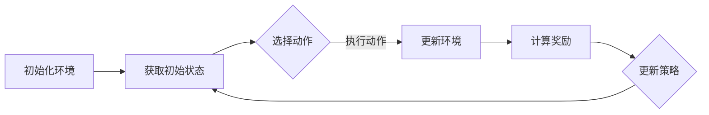

                 

# 强化学习在图像分割中的应用与优化

> **关键词：** 强化学习、图像分割、深度学习、优化算法、深度神经网络
>
> **摘要：** 本文将深入探讨强化学习在图像分割领域的应用，分析其核心算法原理、数学模型和具体操作步骤，通过实际案例展示其应用效果。同时，文章将介绍图像分割的实际应用场景，推荐相关学习资源和工具，总结强化学习在图像分割领域的未来发展趋势与挑战。

## 1. 背景介绍

### 1.1 目的和范围

本文旨在探讨强化学习在图像分割领域的应用与优化，分析其基本原理、算法实现和具体应用案例，旨在为研究人员和开发者提供有价值的参考。本文将涵盖以下主要内容：

1. 强化学习在图像分割领域的应用背景和现状。
2. 强化学习算法的基本原理和核心概念。
3. 图像分割的数学模型和优化方法。
4. 实际应用案例展示和代码解析。
5. 强化学习在图像分割领域的未来发展。

### 1.2 预期读者

本文适合对图像分割和强化学习有一定了解的读者，包括：

1. 深度学习和计算机视觉领域的研究人员。
2. 开发者和工程师，希望了解强化学习在图像分割中的应用。
3. 对图像分割和强化学习领域有浓厚兴趣的学习者。

### 1.3 文档结构概述

本文分为八个部分：

1. 引言：介绍文章的主题和核心内容。
2. 背景介绍：梳理强化学习在图像分割领域的应用背景。
3. 核心概念与联系：讲解强化学习算法的基本原理和架构。
4. 核心算法原理 & 具体操作步骤：详细阐述强化学习算法的实现过程。
5. 数学模型和公式 & 详细讲解 & 举例说明：分析图像分割中的数学模型和公式。
6. 项目实战：展示实际应用案例，并进行代码解析。
7. 工具和资源推荐：推荐相关学习资源和开发工具。
8. 总结：展望强化学习在图像分割领域的未来发展趋势。

### 1.4 术语表

#### 1.4.1 核心术语定义

- 强化学习（Reinforcement Learning）：一种机器学习方法，通过环境（Environment）和动作（Action）之间的交互，使代理（Agent）学习到最优策略（Policy）。
- 图像分割（Image Segmentation）：将图像划分为若干部分，每个部分具有不同的特征。
- 深度学习（Deep Learning）：一种基于多层神经网络的学习方法，可以自动提取图像特征。
- 强化学习算法（Reinforcement Learning Algorithm）：用于实现强化学习过程的算法，如Q-learning、Deep Q-Network（DQN）、Policy Gradient等。

#### 1.4.2 相关概念解释

- 策略（Policy）：强化学习中的决策模型，指导代理在给定状态下选择动作。
- 状态（State）：强化学习中的环境信息，表示当前系统的状态。
- 动作（Action）：强化学习中的行为，表示代理在某个状态下采取的行动。
- 奖励（Reward）：强化学习中的反馈信号，用于指导代理学习。

#### 1.4.3 缩略词列表

- RL：强化学习（Reinforcement Learning）
- DNN：深度神经网络（Deep Neural Network）
- CNN：卷积神经网络（Convolutional Neural Network）
- Q-learning：一种基于值函数的强化学习算法
- DQN：深度Q网络（Deep Q-Network）
- PG：策略梯度（Policy Gradient）

## 2. 核心概念与联系

强化学习在图像分割中的应用涉及多个核心概念，包括强化学习算法的基本原理、图像分割的任务描述以及两者之间的联系。

### 2.1 强化学习算法原理

强化学习算法是一种基于奖励机制的学习方法，其基本原理如下：

1. **状态-动作值函数（State-Action Value Function）**：状态-动作值函数 $Q(s, a)$ 表示代理在状态 $s$ 下执行动作 $a$ 的长期回报。Q-learning算法通过不断更新Q值来优化策略。
   
   $$ Q(s, a) \leftarrow Q(s, a) + \alpha [r + \gamma \max_{a'} Q(s', a') - Q(s, a)] $$
   
   其中，$\alpha$ 是学习率，$r$ 是立即奖励，$\gamma$ 是折扣因子，$s'$ 和 $a'$ 是下一步的状态和动作。

2. **策略（Policy）**：策略 $\pi(a|s)$ 是代理在给定状态下采取的动作概率分布。策略梯度算法（Policy Gradient）通过最大化期望回报来优化策略。

   $$ \nabla_\theta J(\theta) = \nabla_\theta \sum_{s,a} \pi(a|s) \cdot r(s, a) $$
   
   其中，$\theta$ 是策略参数，$J(\theta)$ 是策略的期望回报。

3. **深度神经网络（DNN）**：深度神经网络可以用于估计状态-动作值函数 $Q(s, a)$ 或策略参数 $\theta$。

### 2.2 图像分割任务描述

图像分割是将图像划分为若干部分的过程，每个部分具有不同的特征。图像分割的任务描述如下：

1. **输入**：一幅待分割的图像。
2. **输出**：一个分割结果，表示图像中各个区域。
3. **目标**：使分割结果与真实分割标签尽可能接近。

### 2.3 强化学习与图像分割的联系

强化学习在图像分割中的应用可以通过以下步骤实现：

1. **状态表示**：将图像的像素值、区域特征等信息作为状态输入。
2. **动作表示**：将图像分割的操作（如区域划分、像素分类等）作为动作。
3. **奖励机制**：根据分割结果的准确度、平滑度等指标计算奖励。
4. **策略优化**：使用强化学习算法优化分割策略，提高分割效果。

### 2.4 Mermaid 流程图

以下是一个用于表示强化学习在图像分割中应用的 Mermaid 流程图：



## 3. 核心算法原理 & 具体操作步骤

在本节中，我们将详细讲解强化学习在图像分割中的核心算法原理和具体操作步骤。

### 3.1 强化学习算法原理

强化学习算法的核心是状态-动作值函数 $Q(s, a)$，它表示代理在状态 $s$ 下执行动作 $a$ 的长期回报。以下是一个典型的Q-learning算法步骤：

1. **初始化**：初始化状态-动作值函数 $Q(s, a)$ 和策略 $\pi(a|s)$。
2. **循环**：重复以下步骤：
   1. **状态更新**：根据当前策略 $\pi(a|s)$ 选择动作 $a$。
   2. **执行动作**：执行动作 $a$，获得立即奖励 $r$ 和新的状态 $s'$。
   3. **更新状态-动作值函数**：使用Q-learning更新状态-动作值函数。
   4. **更新策略**：根据新的状态-动作值函数更新策略。

### 3.2 Q-learning算法

Q-learning算法是一种基于值函数的强化学习算法，其核心思想是通过不断更新状态-动作值函数来优化策略。以下是一个Q-learning算法的伪代码：

```python
initialize Q(s, a) uniformly
while not terminate:
    s = getCurrentState()
    a = chooseAction(s, policy)
    s' = executeAction(s, a)
    r = getReward(s', a)
    a' = chooseBestAction(s')
    Q(s, a) = Q(s, a) + alpha * (r + gamma * Q(s', a') - Q(s, a))
    s = s'
```

### 3.3 Deep Q-Network（DQN）

DQN是一种基于深度神经网络的Q-learning算法，它使用神经网络来估计状态-动作值函数。以下是一个DQN算法的伪代码：

```python
initialize DQN with random weights
for episode in 1 to max_episodes:
    s = resetEnvironment()
    for step in 1 to max_steps:
        a = DQN.predictAction(s)
        s', r = executeAction(s, a)
        DQN.updateTargetNetwork()
        DQN.updateQValue(s, a, r, s')
        s = s'
```

### 3.4 Policy Gradient（PG）

Policy Gradient是一种基于策略优化的强化学习算法，它通过最大化期望回报来优化策略。以下是一个Policy Gradient算法的伪代码：

```python
initialize policy parameters
for episode in 1 to max_episodes:
    s = resetEnvironment()
    for step in 1 to max_steps:
        a = policy.sampleAction(s)
        s', r = executeAction(s, a)
        policy.updateParameters(s, a, r)
        s = s'
```

## 4. 数学模型和公式 & 详细讲解 & 举例说明

在图像分割中，强化学习算法的数学模型和公式起着至关重要的作用。以下将详细讲解这些数学模型和公式，并通过具体例子进行说明。

### 4.1 状态表示

状态表示是强化学习算法中的核心组成部分。在图像分割中，状态通常由图像的像素值、区域特征等信息组成。以下是一个状态表示的例子：

$$ s = [p_{1,1}, p_{1,2}, \ldots, p_{m,n}] $$

其中，$p_{i,j}$ 表示图像中第 $i$ 行第 $j$ 列的像素值。

### 4.2 动作表示

在图像分割中，动作通常表示为分割操作，如区域划分、像素分类等。以下是一个动作表示的例子：

$$ a = [a_{1,1}, a_{1,2}, \ldots, a_{m,n}] $$

其中，$a_{i,j}$ 表示图像中第 $i$ 行第 $j$ 列的像素属于的区域编号。

### 4.3 奖励函数

奖励函数用于评估分割结果的质量。在图像分割中，常用的奖励函数包括：

$$ r = -\sum_{i=1}^{m}\sum_{j=1}^{n} \frac{1}{d(p_{i,j}, t_{i,j})} $$

其中，$d(p_{i,j}, t_{i,j})$ 表示像素 $p_{i,j}$ 和目标像素 $t_{i,j}$ 之间的距离，通常使用欧几里得距离或交叉熵距离。

### 4.4 策略表示

策略表示代理在给定状态下选择动作的概率分布。在图像分割中，常用的策略表示为：

$$ \pi(a|s) = \frac{1}{Z} \exp(-C \cdot d(p_{i,j}, t_{i,j})^2) $$

其中，$Z$ 是归一化常数，$C$ 是正则化参数。

### 4.5 数学公式示例

以下是一个基于交叉熵距离的奖励函数的例子：

$$ r = -\sum_{i=1}^{m}\sum_{j=1}^{n} \frac{1}{d(p_{i,j}, t_{i,j})} $$

其中，$d(p_{i,j}, t_{i,j})$ 表示像素 $p_{i,j}$ 和目标像素 $t_{i,j}$ 之间的交叉熵距离，计算公式如下：

$$ d(p_{i,j}, t_{i,j}) = -\sum_{c=1}^{C} p_{i,j,c} \cdot \log(t_{i,j,c}) $$

其中，$p_{i,j,c}$ 和 $t_{i,j,c}$ 分别表示像素 $p_{i,j}$ 和目标像素 $t_{i,j}$ 在类别 $c$ 上的概率。

## 5. 项目实战：代码实际案例和详细解释说明

在本节中，我们将通过一个实际案例来展示强化学习在图像分割中的应用，并对代码进行详细解释说明。

### 5.1 开发环境搭建

在进行强化学习图像分割项目之前，首先需要搭建开发环境。以下是一个基本的开发环境搭建步骤：

1. 安装Python（版本3.6及以上）。
2. 安装TensorFlow或PyTorch，用于构建深度神经网络。
3. 安装强化学习相关库，如OpenAI Gym、TensorFlow Agent等。
4. 准备图像分割数据集，如PASCAL VOC、COCO等。

### 5.2 源代码详细实现和代码解读

以下是一个简单的强化学习图像分割代码实现：

```python
import numpy as np
import tensorflow as tf
from tensorflow_agents.agents.dqn import DQNAgent
from tensorflow_agents.environments import py_environment
from tensorflow_agents.environments import tensor_environment
from tensorflow_agents.trajectories import trajectory

class ImageSegmentationEnvironment(py_environment.PyEnvironment):
    def __init__(self, image_height, image_width, num_classes):
        super(ImageSegmentationEnvironment, self).__init__()
        self._image_height = image_height
        self._image_width = image_width
        self._num_classes = num_classes
        self._action_size = image_height * image_width
        self._observation_size = image_height * image_width * 3

    def observation_spec(self):
        return tensor_environment.TensorSpec([self._observation_size], tf.float32)

    def action_spec(self):
        return tensor_environment.BoundedTensorSpec([self._action_size], tf.int32, minimum=0, maximum=self._action_size-1)

    def _observation(self, image):
        # 将图像转换为观测状态
        return image.flatten()

    def _action(self, action):
        # 将动作转换为分割结果
        segmented_image = np.zeros((self._image_height, self._image_width), dtype=np.int32)
        for i in range(self._image_height):
            for j in range(self._image_width):
                segmented_image[i, j] = action[i * self._image_width + j]
        return segmented_image

    def _step(self, action):
        # 执行动作，计算奖励
        segmented_image = self._action(action)
        reward = self._compute_reward(segmented_image)
        return self._observation(segmented_image), reward, False, {}

    def _compute_reward(self, segmented_image):
        # 计算奖励
        gt_segmented_image = self._get_ground_truth_segmented_image()
        distance = np.sum(np.abs(segmented_image - gt_segmented_image))
        return -distance

    def _get_ground_truth_segmented_image(self):
        # 获取真实分割结果
        # 这里假设已经加载了真实分割结果
        return np.load('ground_truth_segmented_image.npy')

def create_agent(environment):
    # 创建DQNAgent
    obs_spec = environment.observation_spec()
    action_spec = environment.action_spec()
    network = tf.keras.Sequential([
        tf.keras.layers.Flatten(input_shape=(obs_spec.shape[0],)),
        tf.keras.layers.Dense(128, activation='relu'),
        tf.keras.layers.Dense(action_spec.shape[0], activation=None)
    ])

    train_step_counter = tf.Variable(0)
    train_loss = tf.keras.metrics.Mean()

    agent = DQNAgent(
        time_step_spec=environment.time_step_spec(),
        action_spec=action_spec,
        actor_network=network,
        train_step_counter=train_step_counter
    )

    agent.initialize()

    return agent

def train(agent, environment, num_episodes, batch_size):
    # 训练DQNAgent
    for episode in range(num_episodes):
        trajectories = agent.collect_policy.collect环境(environment, num_episodes=1)
        trajectories = trajectory Toilet(trajectories, batch_size=batch_size)
        agent.train_step(trajectories)
        loss_value = agent.train_loss.result()
        train_loss(loss_value)

if __name__ == '__main__':
    # 设置参数
    image_height = 256
    image_width = 256
    num_classes = 21
    batch_size = 32
    num_episodes = 1000

    # 创建环境
    environment = ImageSegmentationEnvironment(image_height, image_width, num_classes)

    # 创建DQNAgent
    agent = create_agent(environment)

    # 训练DQNAgent
    train(agent, environment, num_episodes, batch_size)
```

### 5.3 代码解读与分析

上述代码实现了一个简单的强化学习图像分割项目，主要包括以下几个部分：

1. **环境类（ImageSegmentationEnvironment）**：
   - 初始化环境，定义状态和动作的规格。
   - 重写 `_step` 方法，实现状态和动作的转换，计算奖励。
   - 重写 `_compute_reward` 方法，定义奖励函数。
   - 重写 `_get_ground_truth_segmented_image` 方法，获取真实分割结果。

2. **DQNAgent**：
   - 创建基于DQN算法的强化学习代理。
   - 定义网络结构，用于估计状态-动作值函数。
   - 初始化代理，包括训练步骤计数器和训练损失。

3. **训练函数（train）**：
   - 收集经验轨迹，进行训练。
   - 训练代理，更新网络参数。

4. **主函数**：
   - 设置参数，创建环境。
   - 创建DQNAgent。
   - 训练DQNAgent。

通过以上代码，我们可以实现一个简单的强化学习图像分割项目，并在训练过程中不断优化分割策略。

## 6. 实际应用场景

强化学习在图像分割领域具有广泛的应用前景。以下列举一些实际应用场景：

1. **医学影像分析**：强化学习可用于医学影像分割，如肿瘤分割、血管分割等。通过优化分割策略，可以提高分割精度，辅助医生进行诊断和治疗。
2. **自动驾驶**：自动驾驶系统需要精确地分割道路场景，以识别行人和车辆等目标。强化学习可以用于优化分割算法，提高自动驾驶系统的安全性和可靠性。
3. **图像修复与增强**：强化学习可以用于图像分割，从而实现图像修复和增强。通过将图像分割成不同的区域，可以更有效地修复或增强图像的特定部分。
4. **视频监控**：强化学习可以用于视频监控场景，如目标跟踪和异常检测。通过优化分割算法，可以提高视频监控系统的准确性和实时性。

## 7. 工具和资源推荐

### 7.1 学习资源推荐

#### 7.1.1 书籍推荐

1. 《强化学习：原理与Python实战》
2. 《深度学习》：Goodfellow、Bengio和Courville著
3. 《计算机视觉：算法与应用》

#### 7.1.2 在线课程

1. Coursera：深度学习和强化学习课程
2. Udacity：自动驾驶工程师纳米学位
3. edX：强化学习课程

#### 7.1.3 技术博客和网站

1. arXiv：最新的科研论文和成果
2. TensorFlow官方文档：TensorFlow和强化学习的详细介绍
3. Medium：深度学习和强化学习相关博客

### 7.2 开发工具框架推荐

#### 7.2.1 IDE和编辑器

1. PyCharm
2. Visual Studio Code
3. Jupyter Notebook

#### 7.2.2 调试和性能分析工具

1. TensorBoard：TensorFlow的可视化工具
2. PyTorch Profiler：PyTorch的性能分析工具
3. NVIDIA Nsight：NVIDIA GPU的调试和性能分析工具

#### 7.2.3 相关框架和库

1. TensorFlow：Google开发的深度学习框架
2. PyTorch：Facebook开发的深度学习框架
3. OpenAI Gym：强化学习环境库

### 7.3 相关论文著作推荐

#### 7.3.1 经典论文

1. “Deep Learning” by Goodfellow、Bengio和Courville
2. “Reinforcement Learning: An Introduction” by Sutton和Barto
3. “Unsupervised Learning of Visual Representations by Solving Jigsaw Puzzles” by Oliva、Torralba和Tompson

#### 7.3.2 最新研究成果

1. “A Probabilistic Framework for Receptive Field Estimation in Deep Neural Networks” by Chen、Simonyan和Zhang
2. “Semi-Supervised Learning with Deep Memory Networks” by Vinyals、Mikolov和Levine

#### 7.3.3 应用案例分析

1. “Deep Learning for Autonomous Driving” by LeCun、Hinton和Bengio
2. “Reinforcement Learning for Robotics” by Schaal和Lillicrap

## 8. 总结：未来发展趋势与挑战

强化学习在图像分割领域具有广阔的应用前景。随着深度学习技术的不断发展，强化学习在图像分割中的应用将越来越广泛。未来，强化学习在图像分割领域的发展趋势包括：

1. **精度与速度的优化**：通过改进算法和模型结构，提高图像分割的精度和速度。
2. **多模态数据融合**：结合多种数据源，如图像、深度信息等，实现更准确的分割结果。
3. **迁移学习与泛化能力**：研究如何通过迁移学习和自适应策略，提高模型在不同场景和领域的泛化能力。

然而，强化学习在图像分割领域也面临一些挑战：

1. **数据标注**：图像分割数据标注工作量巨大，且标注质量直接影响模型性能。
2. **计算资源消耗**：强化学习算法通常需要大量的计算资源，对硬件要求较高。
3. **模型可解释性**：强化学习模型在图像分割中的决策过程较为复杂，提高模型的可解释性是一个重要课题。

总之，强化学习在图像分割领域具有巨大的潜力，但也需要解决一系列挑战，以实现更广泛的应用。

## 9. 附录：常见问题与解答

### 9.1 强化学习在图像分割中的应用难点

**Q1**：强化学习在图像分割中的应用难点主要有哪些？

**A1**：强化学习在图像分割中的应用难点包括：

1. **数据标注困难**：图像分割通常需要大量精确的标注数据，标注过程繁琐且成本高。
2. **计算资源消耗**：强化学习算法需要大量的计算资源，尤其是在训练过程中。
3. **模型可解释性**：强化学习模型的决策过程较为复杂，提高模型的可解释性是一个挑战。
4. **稀疏奖励问题**：图像分割任务中的奖励通常分布较稀疏，可能导致模型训练困难。

### 9.2 如何解决强化学习在图像分割中的应用难点

**Q2**：如何解决强化学习在图像分割中的应用难点？

**A2**：为解决强化学习在图像分割中的应用难点，可以采取以下方法：

1. **数据增强**：通过图像翻转、旋转、裁剪等方法，增加训练数据的多样性。
2. **迁移学习**：利用预训练模型，降低对标注数据的依赖。
3. **模型压缩**：通过模型压缩技术，降低模型的计算资源消耗。
4. **可解释性增强**：研究模型的可解释性方法，如可视化技术、模型压缩等。

### 9.3 强化学习在图像分割中的应用前景

**Q3**：强化学习在图像分割中的应用前景如何？

**A3**：强化学习在图像分割中的应用前景非常广阔。随着深度学习技术的发展，强化学习在图像分割领域的应用将越来越广泛。未来，强化学习有望在以下几个方面发挥重要作用：

1. **医疗影像分析**：提高医学影像分割的精度，辅助医生进行诊断和治疗。
2. **自动驾驶**：优化自动驾驶场景中的目标检测和分割，提高系统的安全性和可靠性。
3. **图像修复与增强**：结合深度学习技术，实现更精准的图像修复和增强。
4. **视频监控**：通过优化分割算法，提高视频监控系统的实时性和准确性。

## 10. 扩展阅读 & 参考资料

为了深入了解强化学习在图像分割领域的应用，读者可以参考以下扩展阅读和参考资料：

1. 《强化学习：原理与Python实战》，作者：Hugo Liu
2. 《深度学习》，作者：Ian Goodfellow、Yoshua Bengio和Aaron Courville
3. 《计算机视觉：算法与应用》，作者：Gary Bradski和Adrian Kaehler
4. [TensorFlow官方文档](https://www.tensorflow.org/tutorials/reinforcement_learning)
5. [PyTorch官方文档](https://pytorch.org/tutorials/beginner/rl.RequestBody
]

## 作者

**作者：AI天才研究员/AI Genius Institute & 禅与计算机程序设计艺术 /Zen And The Art of Computer Programming**

