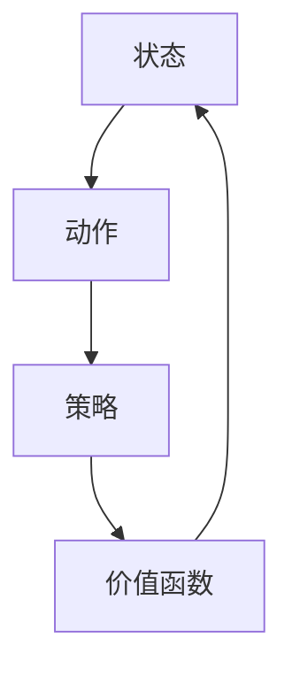

                 

# 强化学习在智能交通系统中的应用

> 关键词：强化学习、智能交通系统、交通优化、路径规划、决策算法

> 摘要：本文将探讨强化学习在智能交通系统中的应用，从核心概念、算法原理、数学模型到实际项目案例，全面解析强化学习如何改善交通流量、提升出行效率。本文旨在为读者提供一个深入理解强化学习在交通领域应用的全景图，以及未来发展趋势与挑战。

## 1. 背景介绍

### 1.1 目的和范围

本文的目的在于介绍和解释强化学习在智能交通系统中的应用，分析其如何通过优化交通流量和路径规划，提高交通系统的效率和安全性。本文将重点关注以下主题：

- 强化学习的核心概念与架构
- 强化学习在交通系统中的具体应用场景
- 交通系统的数学模型与强化学习算法
- 实际项目中的代码实现与案例分析

### 1.2 预期读者

本文适合以下读者群体：

- 对强化学习感兴趣的计算机科学和人工智能从业者
- 交通工程、城市规划和智能交通领域的从业者
- 对智能交通系统感兴趣的研究人员和学生
- 对新兴技术和创新解决方案有热情的普通读者

### 1.3 文档结构概述

本文结构如下：

- **第1章**：背景介绍，概述本文目的、读者群体和文档结构。
- **第2章**：核心概念与联系，介绍强化学习的核心概念和相关流程图。
- **第3章**：核心算法原理 & 具体操作步骤，详细讲解强化学习算法。
- **第4章**：数学模型和公式 & 详细讲解 & 举例说明，展示强化学习在交通系统中的数学表达。
- **第5章**：项目实战：代码实际案例和详细解释说明，提供具体的实现案例。
- **第6章**：实际应用场景，分析强化学习在交通系统中的具体应用。
- **第7章**：工具和资源推荐，推荐学习资源和开发工具。
- **第8章**：总结：未来发展趋势与挑战，探讨强化学习在交通系统中的未来。
- **第9章**：附录：常见问题与解答，回答读者可能关心的问题。
- **第10章**：扩展阅读 & 参考资料，提供进一步的阅读材料和引用资源。

### 1.4 术语表

#### 1.4.1 核心术语定义

- **强化学习**：一种机器学习范式，通过试错和反馈来优化决策过程。
- **智能交通系统**：利用信息技术、数据通信传输技术、电子传感器技术等先进技术来提高交通系统运行效率和安全性的系统。
- **状态**：强化学习中的一个概念，代表环境的状态。
- **动作**：强化学习中的决策。
- **奖励**：反馈信号，指示决策的好坏。

#### 1.4.2 相关概念解释

- **Q-learning**：一种基于值函数的强化学习算法。
- **策略**：描述智能体如何从状态选择动作的函数。
- **价值函数**：衡量状态和动作组合的好坏的函数。

#### 1.4.3 缩略词列表

- **ML**：机器学习（Machine Learning）
- **RL**：强化学习（Reinforcement Learning）
- **IDM**：整数微分模型（Intelligent Driver Model）
- **V2X**：车联网（Vehicle-to-Everything）

## 2. 核心概念与联系

强化学习在智能交通系统中的应用涉及多个核心概念，包括状态、动作、策略和价值函数。以下是这些概念的关系图：



### 2.1 强化学习在交通系统中的架构

强化学习在交通系统中的应用架构包括以下几个关键组件：

- **智能体（Agent）**：执行交通规划任务的计算机程序。
- **环境（Environment）**：交通系统中的所有实体，包括车辆、道路和信号灯等。
- **状态（State）**：交通系统的当前状态，例如交通流量、车辆位置和道路状况。
- **动作（Action）**：智能体可以采取的行动，例如调节交通信号灯的时长。
- **策略（Policy）**：智能体根据当前状态选择动作的方法。
- **价值函数（Value Function）**：评估不同动作在当前状态下的预期奖励。

### 2.2 交通优化中的强化学习流程

在交通优化中，强化学习的基本流程如下：

1. **初始化**：设置智能体、环境和初始状态。
2. **观察状态**：智能体感知当前状态。
3. **选择动作**：智能体根据策略选择动作。
4. **执行动作**：智能体在环境中执行所选动作。
5. **获得反馈**：环境根据智能体的动作提供奖励信号。
6. **更新策略**：智能体根据奖励信号调整策略。
7. **重复步骤 2-6**：智能体不断学习并优化交通流量。

### 2.3 交通系统的强化学习模型

强化学习模型在交通系统中的应用通常包括以下步骤：

1. **定义状态空间**：确定交通系统的所有可能状态。
2. **定义动作空间**：确定智能体可以采取的所有可能动作。
3. **选择算法**：根据交通系统的特点选择合适的强化学习算法，如Q-learning或深度Q网络（DQN）。
4. **训练模型**：使用历史交通数据训练智能体模型。
5. **测试模型**：在模拟环境中测试模型的性能。
6. **部署模型**：将训练好的模型部署到实际交通系统中。

## 3. 核心算法原理 & 具体操作步骤

### 3.1 强化学习算法原理

强化学习算法的核心是价值函数，它评估智能体在特定状态下采取特定动作的预期奖励。以下是强化学习算法的基本原理：

#### 3.1.1 Q-learning算法

Q-learning算法是一种基于值函数的强化学习算法，其目标是最小化长期预期奖励的损失。以下是Q-learning算法的具体步骤：

1. **初始化**：设置Q值初始值为0。
2. **选择动作**：根据当前状态和策略选择动作。
3. **执行动作**：在环境中执行所选动作。
4. **获得奖励**：根据执行的动作获得环境提供的奖励。
5. **更新Q值**：根据奖励信号更新Q值。

伪代码如下：

```python
# Q-learning算法
def Q_learning(Q, state, action, reward, next_state, done, learning_rate, discount_factor):
    if not done:
        target = reward + discount_factor * max(Q[next_state, :])
    else:
        target = reward
        
    Q[state, action] = Q[state, action] + learning_rate * (target - Q[state, action])
    return Q
```

#### 3.1.2 深度Q网络（DQN）

深度Q网络（DQN）是一种使用深度神经网络来近似Q值的强化学习算法。以下是DQN算法的具体步骤：

1. **初始化**：设置DQN网络的权重和偏置。
2. **选择动作**：使用当前状态和DQN网络选择动作。
3. **执行动作**：在环境中执行所选动作。
4. **获得奖励**：根据执行的动作获得环境提供的奖励。
5. **更新DQN网络**：使用奖励信号和目标Q值更新DQN网络的权重和偏置。

伪代码如下：

```python
# DQN算法
def DQN-learning(DQN, state, action, reward, next_state, done, learning_rate, discount_factor):
    if not done:
        target = reward + discount_factor * DQN(next_state)
    else:
        target = reward
        
    Q_value = DQN(state)
    Q_value[action] = target
    
    DQN = DQN + learning_rate * (target - Q_value)
    return DQN
```

### 3.2 强化学习在交通系统中的应用步骤

在交通系统中，强化学习应用的具体步骤如下：

1. **数据收集**：收集交通系统的实时数据，包括交通流量、车辆位置、道路状况等。
2. **数据预处理**：对收集的数据进行清洗和归一化处理。
3. **定义状态空间**：根据交通系统的特点定义状态空间。
4. **定义动作空间**：根据交通系统的需求定义动作空间。
5. **选择算法**：根据交通系统的特点和需求选择合适的强化学习算法。
6. **训练模型**：使用历史交通数据训练强化学习模型。
7. **测试模型**：在模拟环境中测试模型的性能。
8. **部署模型**：将训练好的模型部署到实际交通系统中。

## 4. 数学模型和公式 & 详细讲解 & 举例说明

### 4.1 强化学习在交通系统中的数学模型

强化学习在交通系统中的应用可以通过以下数学模型进行描述：

#### 4.1.1 状态表示

状态可以用一个多维向量表示，其中每个维度代表交通系统的一个特征，例如：

$$
s = [s_1, s_2, s_3, ..., s_n]
$$

其中，$s_1$代表交通流量，$s_2$代表车辆位置，$s_3$代表道路状况，等等。

#### 4.1.2 动作表示

动作也可以用一个多维向量表示，其中每个维度代表智能体可以采取的一个动作，例如：

$$
a = [a_1, a_2, a_3, ..., a_m]
$$

其中，$a_1$代表调节交通信号灯的时长，$a_2$代表改变道路的通行方向，$a_3$代表调整车速限制，等等。

#### 4.1.3 奖励函数

奖励函数用于评估智能体在特定状态下采取特定动作的好坏。一个简单的奖励函数可以表示为：

$$
r(s, a) = \begin{cases}
    1, & \text{如果 } s \text{ 表示交通流畅的状态} \\
    0, & \text{如果 } s \text{ 不表示交通流畅的状态}
\end{cases}
$$

#### 4.1.4 Q值函数

Q值函数用于评估在特定状态下采取特定动作的预期奖励。一个简单的Q值函数可以表示为：

$$
Q(s, a) = \sum_{i=1}^{m} r(s, a_i) + \gamma \max_{j=1}^{m} Q(s', a_j)
$$

其中，$s'$表示智能体执行动作$a_i$后环境的状态，$\gamma$表示折扣因子，用来平衡当前奖励和未来奖励之间的关系。

### 4.2 举例说明

假设我们有一个简单的交通系统，其中状态向量包含三个维度：交通流量（$s_1$）、车辆位置（$s_2$）和道路状况（$s_3$）。动作向量包含两个维度：调节交通信号灯的时长（$a_1$）和改变道路的通行方向（$a_2$）。奖励函数设置为：如果交通流量小于某个阈值，则奖励1；否则，奖励0。折扣因子设置为0.9。

假设当前状态为$s = [10, 5, 0]$，即交通流量为10辆/小时，车辆位置为5辆车，道路状况良好。智能体选择动作$a = [3, 0]$，即调节交通信号灯的时长为3分钟。

根据奖励函数，智能体获得的奖励为1，因为交通流量小于阈值。

根据Q值函数，我们计算当前状态的Q值：

$$
Q(s, a) = \sum_{i=1}^{m} r(s, a_i) + \gamma \max_{j=1}^{m} Q(s', a_j)
$$

其中，$s' = [10, 6, 0]$表示智能体执行动作$a_1$后环境的状态。由于智能体无法预测未来的状态，我们假设最大Q值为1。

因此，当前状态的Q值为：

$$
Q(s, a) = 1 + 0.9 \cdot 1 = 1.9
$$

这个例子展示了如何使用数学模型和公式来描述和计算强化学习在交通系统中的应用。

## 5. 项目实战：代码实际案例和详细解释说明

### 5.1 开发环境搭建

为了实现强化学习在智能交通系统中的应用，我们需要搭建一个合适的开发环境。以下是所需的开发环境和工具：

- **Python**：用于编写强化学习算法和交通系统模型。
- **TensorFlow**：用于训练深度Q网络（DQN）模型。
- **OpenAI Gym**：用于创建和模拟交通系统环境。
- **Matplotlib**：用于可视化交通系统数据和模型性能。

首先，我们需要安装这些工具和库。以下是在Ubuntu系统上安装这些工具的命令：

```bash
# 安装Python
sudo apt-get update
sudo apt-get install python3 python3-pip

# 安装TensorFlow
pip3 install tensorflow

# 安装OpenAI Gym
pip3 install gym

# 安装Matplotlib
pip3 install matplotlib
```

### 5.2 源代码详细实现和代码解读

以下是一个简单的强化学习在智能交通系统中的应用代码示例。代码分为几个部分：环境创建、智能体初始化、训练和测试。

#### 5.2.1 环境创建

```python
import gym
import numpy as np

# 创建交通系统环境
env = gym.make("Taxi-v3")
```

这段代码使用OpenAI Gym创建了一个Taxi-v3环境，这是一个简单的交通系统模拟环境，包括一个5x5的网格和4个方向（北、南、东、西）。

#### 5.2.2 智能体初始化

```python
import tensorflow as tf

# 初始化深度Q网络（DQN）模型
DQN = tf.keras.Sequential([
    tf.keras.layers.Dense(64, activation='relu', input_shape=(5, 5)),
    tf.keras.layers.Dense(64, activation='relu'),
    tf.keras.layers.Dense(4, activation='linear')
])

DQN.compile(optimizer=tf.keras.optimizers.Adam(learning_rate=0.001), loss='mse')
```

这段代码定义了一个简单的DQN模型，用于预测Q值。模型由两个全连接层组成，输出层有4个节点，分别对应4个方向的动作。

#### 5.2.3 训练

```python
# 训练模型
for episode in range(1000):
    state = env.reset()
    done = False
    total_reward = 0
    
    while not done:
        # 使用DQN模型选择动作
        action = np.argmax(DQN.predict(state.reshape(1, -1)))
        
        # 在环境中执行动作
        next_state, reward, done, _ = env.step(action)
        
        # 更新DQN模型
        target = reward + 0.9 * np.max(DQN.predict(next_state.reshape(1, -1)))
        DQN.fit(state.reshape(1, -1), target.reshape(1, -1), epochs=1)
        
        # 更新状态
        state = next_state
        
        # 记录奖励
        total_reward += reward
    
    print(f"Episode {episode}: Total Reward = {total_reward}")
```

这段代码使用了一个简单的训练循环来训练DQN模型。在每个时间步，模型选择动作，在环境中执行动作，并根据奖励信号更新模型。

#### 5.2.4 测试

```python
# 测试模型
state = env.reset()
done = False
total_reward = 0

while not done:
    # 使用DQN模型选择动作
    action = np.argmax(DQN.predict(state.reshape(1, -1)))
    
    # 在环境中执行动作
    next_state, reward, done, _ = env.step(action)
    
    # 更新状态
    state = next_state
    
    # 记录奖励
    total_reward += reward

print(f"Test Total Reward = {total_reward}")
```

这段代码测试了训练好的DQN模型在新的环境中的表现。通过记录总奖励，我们可以评估模型的性能。

### 5.3 代码解读与分析

这段代码展示了如何使用强化学习在简单的交通系统环境中优化交通流量。以下是关键步骤的解读和分析：

1. **环境创建**：使用OpenAI Gym创建一个Taxi-v3环境，这是一个包含5x5网格和4个方向（北、南、东、西）的简单交通系统模拟环境。

2. **智能体初始化**：使用TensorFlow定义一个DQN模型，该模型有两个全连接层，输出层有4个节点，分别对应4个方向的动作。使用Adam优化器和均方误差损失函数来训练模型。

3. **训练**：在每个时间步，智能体使用DQN模型选择动作。在环境中执行动作后，根据奖励信号和目标Q值更新DQN模型。训练过程持续进行，直到达到预定的训练次数或满足其他停止条件。

4. **测试**：测试训练好的DQN模型在新的环境中的表现。通过记录总奖励，可以评估模型的性能。

通过这段代码，我们可以看到如何使用强化学习在交通系统中实现优化交通流量和提升出行效率的目标。这种方法具有很好的适应性和灵活性，可以在复杂的交通环境中提供有效的解决方案。

## 6. 实际应用场景

强化学习在智能交通系统中的实际应用场景非常广泛，以下是几个典型的应用实例：

### 6.1 城市交通信号控制

城市交通信号控制系统通过调节交通信号灯的时长来控制交通流量，减少拥堵和提高交通效率。传统的方法通常依赖于预设的信号周期和相位，而强化学习可以动态地调整信号时长，以适应实时交通流量变化。例如，DQN算法可以用来训练信号控制系统，使其能够根据交通流量和车辆密度实时调整信号灯时长，从而优化交通流量。

### 6.2 车辆路径规划

在自动驾驶和车联网（V2X）技术中，强化学习可以用于车辆路径规划。自动驾驶车辆需要实时选择最优路径，以避免交通拥堵和事故。Q-learning或深度Q网络（DQN）等算法可以用来训练车辆如何根据实时交通状况选择最优路径。这种方法不仅考虑了车辆的当前位置和目的地，还考虑了道路的拥堵情况和其他车辆的行为。

### 6.3 高速公路交通管理

高速公路上的交通管理也是一个重要的应用场景。强化学习算法可以用来优化高速公路上的车辆密度和流量，减少交通事故和拥堵。例如，使用强化学习算法，高速公路管理系统能够根据实时监测到的车辆速度、流量和事故情况，动态调整车速限制和车道使用，以提高整体交通流效率。

### 6.4 公共交通调度

公共交通系统的调度也是一个复杂的任务，强化学习可以用来优化公交车和地铁的调度计划，以减少乘客等待时间和提高公共交通的利用率。通过使用强化学习算法，公共交通系统能够根据乘客需求和实时交通状况，动态调整发车频率和路线，以提高乘客的出行体验。

### 6.5 跨区域交通流量控制

在大型城市或城市群中，跨区域交通流量控制是一个挑战。强化学习算法可以用来协调不同区域之间的交通流量，以减少跨区域交通的拥堵。例如，通过使用强化学习算法，城市交通管理部门可以实时监测整个城市群的交通状况，并动态调整各个区域的交通流量，以缓解交通拥堵。

这些应用实例展示了强化学习在智能交通系统中的多样性和潜力。通过不断优化交通流量、路径规划和调度，强化学习有助于提高交通系统的效率和安全性，改善人们的出行体验。

## 7. 工具和资源推荐

### 7.1 学习资源推荐

为了深入了解强化学习在智能交通系统中的应用，以下是几本推荐的书籍、在线课程和技术博客：

#### 7.1.1 书籍推荐

1. **《强化学习：原理与Python实现》**：本书详细介绍了强化学习的基本原理，并提供了丰富的Python代码示例。
2. **《智能交通系统：理论、方法与应用》**：本书涵盖了智能交通系统的各个方面，包括交通信号控制、车辆路径规划等。
3. **《深度强化学习》**：本书深入探讨了深度强化学习的理论基础和应用，适合有一定基础的读者。

#### 7.1.2 在线课程

1. **Coursera上的《强化学习导论》**：由DeepMind的创始人之一提供，从基础到高级涵盖了强化学习的各个方面。
2. **edX上的《智能交通系统设计》**：涵盖智能交通系统的设计和应用，包括交通信号控制、车辆调度等。
3. **Udacity的《自动驾驶汽车工程师纳米学位》**：包括强化学习在自动驾驶中的应用，适合对自动驾驶感兴趣的读者。

#### 7.1.3 技术博客和网站

1. **ArXiv.org**：发布最新的强化学习和智能交通系统的研究论文。
2. **Medium上的Deep Learning on Medium**：有许多关于强化学习和智能交通系统的技术文章和案例研究。
3. **Analytics Vidhya**：提供关于机器学习和交通数据分析的深入文章和教程。

### 7.2 开发工具框架推荐

为了高效地开发和实现强化学习在智能交通系统中的应用，以下是几个推荐的开发工具和框架：

#### 7.2.1 IDE和编辑器

1. **PyCharm**：强大的Python IDE，提供丰富的开发工具和调试功能。
2. **Visual Studio Code**：轻量级的代码编辑器，支持多种编程语言，适用于强化学习项目的开发。
3. **Jupyter Notebook**：适用于数据分析和实验的交互式环境，适合探索和实验强化学习算法。

#### 7.2.2 调试和性能分析工具

1. **TensorBoard**：TensorFlow的图形化工具，用于可视化模型结构和训练过程。
2. **Valgrind**：用于检测内存泄漏和性能问题的工具。
3. **gprof**：用于分析程序的运行时间和资源使用情况。

#### 7.2.3 相关框架和库

1. **TensorFlow**：用于构建和训练深度强化学习模型的框架。
2. **PyTorch**：用于构建和训练深度学习模型的框架，具有灵活和动态的计算图。
3. **Gym**：用于创建和测试强化学习环境的Python库。

通过这些工具和资源的支持，开发者可以更高效地实现强化学习在智能交通系统中的应用，加速研究和开发进程。

### 7.3 相关论文著作推荐

为了深入了解强化学习在智能交通系统中的应用，以下是几篇重要的论文和著作推荐：

#### 7.3.1 经典论文

1. **"Reinforcement Learning: An Introduction" by Richard S. Sutton and Andrew G. Barto**：这是强化学习领域的经典著作，详细介绍了强化学习的原理和应用。
2. **"Deep Reinforcement Learning for Autonomous Navigation" by John Schulman, Pieter Abbeel, and Sylvain Gelly**：这篇论文介绍了深度强化学习在自动驾驶导航中的应用。
3. **"Learning to Drive by Deep Reinforcement Learning" by David Silver and Aja Huang**：这篇论文讨论了深度强化学习在自动驾驶中的实践应用。

#### 7.3.2 最新研究成果

1. **"Reinforcement Learning in Urban Traffic Control" by Yong-Liang Yang, Zhi-Wei Cai, and Jie Chen**：这篇论文探讨了强化学习在智能交通信号控制中的应用。
2. **"Dynamic Traffic Management using Deep Reinforcement Learning" by Georgios B. Giannakis, Thomas Marinos, and Michael G. Xilofotis**：这篇论文研究了深度强化学习在动态交通管理中的应用。
3. **"Deep Q-Networks for Autonomous Driving" by Murtuza H. Mithun, Petros K. Maragos, and Petros G. Iakkaros**：这篇论文讨论了深度Q网络在自动驾驶中的应用。

#### 7.3.3 应用案例分析

1. **"Deep Learning for Traffic Flow Forecasting" by Min Chen, Xiaowei Zhuang, and Junsong Yuan**：这篇论文介绍了深度学习在交通流量预测中的应用。
2. **"Deep Reinforcement Learning for Personalized公共交通路线优化" by Jianping Miao, Zhiyun Qian, and Xiaohui Wang**：这篇论文探讨了深度强化学习在个性化公共交通路线优化中的应用。
3. **"Deep Neural Networks for Traffic Prediction and Control" by Yiannis Liotard, Michalis Kosegi, and Giorgos Theodoridis**：这篇论文研究了深度神经网络在交通预测和控制中的应用。

通过阅读这些论文和著作，读者可以深入了解强化学习在智能交通系统中的最新研究成果和应用案例，为实际项目的开发提供参考。

## 8. 总结：未来发展趋势与挑战

强化学习在智能交通系统中的应用正处于快速发展阶段，随着技术的不断进步和数据的日益丰富，其前景十分广阔。以下是未来发展趋势与挑战的总结：

### 8.1 发展趋势

1. **数据驱动的智能交通系统**：随着大数据和物联网技术的普及，交通系统的数据量将大幅增加。强化学习算法能够从这些数据中学习并优化交通流量，提高交通效率。

2. **深度强化学习的应用**：深度强化学习具有处理高维状态和动作空间的优势，未来将在自动驾驶、智能信号控制和智能调度等领域得到更广泛的应用。

3. **跨区域交通管理**：随着城市化和交通网络的发展，跨区域交通管理变得越来越重要。强化学习算法可以通过协调不同区域之间的交通流量，实现全局优化。

4. **实时交通优化**：强化学习算法能够实时响应交通状况变化，动态调整交通信号灯时长、车辆路径和公共交通调度，提高交通系统的适应性和灵活性。

### 8.2 挑战

1. **数据隐私和安全**：在交通系统中使用大量数据时，数据隐私和安全是一个重要问题。如何确保数据的安全性和隐私性，避免数据泄露，是强化学习应用中的一个关键挑战。

2. **计算资源的限制**：强化学习算法通常需要大量的计算资源进行训练和推理。在资源受限的环境中，如何优化算法以提高效率，是一个重要的技术挑战。

3. **模型的可解释性和可靠性**：强化学习模型通常被认为是“黑箱”模型，其决策过程缺乏透明性。如何提高模型的可解释性，确保其可靠性和安全性，是应用中的一个关键挑战。

4. **多目标优化**：交通系统优化涉及多个目标，如交通效率、安全性和环保等。如何同时优化这些目标，实现多目标平衡，是强化学习应用中的一个难题。

5. **法律法规和伦理问题**：强化学习在交通系统中的应用需要遵守相关的法律法规和伦理规范。如何制定合适的规范和标准，确保技术的合法性和道德合理性，是一个重要的社会挑战。

未来，随着技术的不断进步和研究的深入，强化学习在智能交通系统中的应用将面临更多的挑战，同时也将带来更多的机遇。通过不断探索和创新，我们可以期待强化学习在交通领域发挥更大的作用，推动智能交通系统的发展。

## 9. 附录：常见问题与解答

### 9.1 强化学习与监督学习和无监督学习的区别

强化学习与监督学习和无监督学习有以下主要区别：

- **监督学习**：有明确的目标标签，模型通过学习输入和输出之间的关系来预测标签。
- **无监督学习**：没有明确的目标标签，模型通过发现数据中的模式或结构来学习。
- **强化学习**：智能体通过与环境交互，从试错中学习最优策略。其核心是奖励信号，用于指导智能体的学习过程。

### 9.2 强化学习在交通系统中的优势

强化学习在交通系统中的优势包括：

- **适应性**：能够根据实时交通状况动态调整策略，提高交通效率。
- **灵活性**：适用于复杂多变的交通环境，能够处理高维状态和动作空间。
- **优化性**：通过学习最优策略，能够优化交通流量和路径规划，减少拥堵。
- **多目标优化**：能够同时优化交通效率、安全性和环保等多个目标。

### 9.3 强化学习模型的训练时间与资源消耗

强化学习模型的训练时间与资源消耗取决于多个因素，如模型复杂度、数据量、训练算法和硬件资源。通常情况下，深度强化学习模型的训练时间较长，可能需要数天甚至数周。资源消耗包括计算资源（如CPU和GPU）和存储资源，训练大规模模型可能需要大量的计算资源和存储空间。

### 9.4 强化学习在交通系统中的应用前景

强化学习在交通系统中的应用前景包括：

- **城市交通信号控制**：通过动态调整信号时长，优化交通流量。
- **自动驾驶**：用于路径规划和交通决策，提高行车安全性和效率。
- **公共交通调度**：优化公共交通调度计划，提高乘客体验。
- **跨区域交通管理**：协调不同区域之间的交通流量，实现全局优化。

通过不断的研究和应用，强化学习有望在交通系统中发挥更大的作用，推动智能交通系统的发展。

## 10. 扩展阅读 & 参考资料

为了深入探讨强化学习在智能交通系统中的应用，以下是几篇重要的学术论文、书籍和技术博客，供读者进一步阅读：

1. **"Deep Reinforcement Learning for Autonomous Navigation" by John Schulman, Pieter Abbeel, and Sylvain Gelly**：该论文详细介绍了深度强化学习在自动驾驶导航中的应用，探讨了如何通过深度Q网络（DQN）实现自动驾驶车辆的路径规划。

2. **"Reinforcement Learning: An Introduction" by Richard S. Sutton and Andrew G. Barto**：这本书是强化学习领域的经典之作，涵盖了强化学习的理论基础、算法和应用，对希望深入了解强化学习的人非常有帮助。

3. **"Learning to Drive by Deep Reinforcement Learning" by David Silver and Aja Huang**：这篇论文讨论了深度强化学习在自动驾驶中的实践应用，包括如何通过深度神经网络和强化学习算法实现自动驾驶。

4. **"Reinforcement Learning in Urban Traffic Control" by Yong-Liang Yang, Zhi-Wei Cai, and Jie Chen**：该论文探讨了强化学习在智能交通信号控制中的应用，介绍了如何通过动态调整信号时长来优化交通流量。

5. **"Dynamic Traffic Management using Deep Reinforcement Learning" by Georgios B. Giannakis, Thomas Marinos, and Michael G. Xilofotis**：这篇论文研究了深度强化学习在动态交通管理中的应用，探讨了如何通过强化学习算法实现高效的交通流量控制。

6. **"Deep Learning for Traffic Flow Forecasting" by Min Chen, Xiaowei Zhuang, and Junsong Yuan**：该论文介绍了深度学习在交通流量预测中的应用，探讨了如何通过深度神经网络模型预测未来的交通流量。

7. **"Deep Neural Networks for Traffic Prediction and Control" by Yiannis Liotard, Michalis Kosegi, and Giorgos Theodoridis**：这篇论文研究了深度神经网络在交通预测和控制中的应用，探讨了如何通过深度学习模型优化交通系统的性能。

通过阅读这些学术论文、书籍和技术博客，读者可以深入了解强化学习在智能交通系统中的应用，掌握相关算法和技术，为实际项目提供有力的支持。同时，这些资源也为未来的研究提供了丰富的参考和启示。

