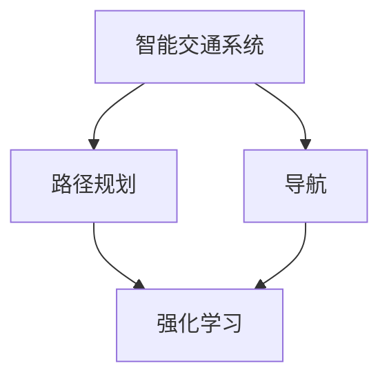

                 

# 强化学习在智能交通路径规划与导航中的建模方法与应用实践

> **关键词：** 强化学习、智能交通、路径规划、导航、模型建模、应用实践  
>
> **摘要：** 本文旨在探讨强化学习在智能交通路径规划与导航中的应用，通过对核心概念、算法原理、数学模型和项目实战的详细剖析，提供一种系统化的解决方案，助力智能交通系统的优化与发展。

## 1. 背景介绍

### 1.1 目的和范围

本文将深入探讨强化学习在智能交通路径规划与导航中的应用。强化学习作为一种重要的机器学习技术，在智能交通系统中具有广泛的应用前景。本文旨在通过系统化的阐述，帮助读者了解强化学习在智能交通路径规划与导航中的核心作用，并提供实际应用案例，以便在实际项目中更好地运用这一技术。

### 1.2 预期读者

本文主要面向对智能交通系统和强化学习有一定了解的技术人员、研究人员以及相关领域的从业者。同时，也欢迎对人工智能、机器学习感兴趣的学生和爱好者阅读。

### 1.3 文档结构概述

本文分为十个部分：

1. **背景介绍**：介绍文章的目的、范围和预期读者。
2. **核心概念与联系**：通过Mermaid流程图展示核心概念和联系。
3. **核心算法原理 & 具体操作步骤**：详细阐述强化学习的算法原理和操作步骤。
4. **数学模型和公式 & 详细讲解 & 举例说明**：讲解数学模型和公式的详细过程，并通过举例进行说明。
5. **项目实战：代码实际案例和详细解释说明**：展示实际项目中的代码实现和详细解释。
6. **实际应用场景**：探讨强化学习在智能交通中的实际应用场景。
7. **工具和资源推荐**：推荐学习资源、开发工具框架和相关论文著作。
8. **总结：未来发展趋势与挑战**：总结当前强化学习在智能交通路径规划与导航中的应用情况，并提出未来发展趋势与挑战。
9. **附录：常见问题与解答**：解答读者可能遇到的问题。
10. **扩展阅读 & 参考资料**：提供扩展阅读和参考资料。

### 1.4 术语表

#### 1.4.1 核心术语定义

- **强化学习（Reinforcement Learning）**：一种机器学习技术，通过奖励和惩罚机制，使智能体在与环境交互的过程中学习到最优策略。
- **路径规划（Path Planning）**：在给定的环境中，为智能体找到一条从初始位置到目标位置的最优路径。
- **导航（Navigation）**：为智能体提供从当前位置到目标位置的路线指引。
- **智能交通系统（Intelligent Transportation System, ITS）**：利用先进的信息通信技术，实现交通系统智能化管理和运行。

#### 1.4.2 相关概念解释

- **状态（State）**：智能体所处的环境描述。
- **动作（Action）**：智能体可以执行的行为。
- **奖励（Reward）**：智能体执行某个动作后获得的奖励或惩罚。
- **策略（Policy）**：智能体根据当前状态选择最优动作的规则。

#### 1.4.3 缩略词列表

- **RL**：强化学习（Reinforcement Learning）
- **DRL**：深度强化学习（Deep Reinforcement Learning）
- **Q-learning**：Q值学习（Q-learning）
- **SARSA**：同步策略更新算法（Synchronous Policy Update Algorithm）
- **A3C**：异步策略梯度（Asynchronous Advantage Actor-Critic）
- **交通拥堵（Traffic Congestion）**：交通流量过大，导致道路通行效率降低的现象。

## 2. 核心概念与联系

为了更好地理解强化学习在智能交通路径规划与导航中的应用，我们需要首先明确几个核心概念和它们之间的关系。以下是一个Mermaid流程图，展示了这些核心概念及其相互关系。



### 智能交通系统

智能交通系统（ITS）是一种利用先进的信息通信技术实现交通系统智能化管理和运行的综合体系。它包括交通感知、交通控制和交通管理等多个方面，旨在提高交通效率、降低交通事故率、减少环境污染等。

### 路径规划

路径规划是智能交通系统中的一项重要功能，它为智能体（如自动驾驶车辆、无人机等）提供从初始位置到目标位置的最优路径。路径规划需要考虑道路状况、交通流量、时间成本等因素。

### 导航

导航是智能交通系统的另一项核心功能，它为智能体提供从当前位置到目标位置的路线指引。导航系统通常包含地图数据、定位技术、路径规划算法等。

### 强化学习

强化学习是一种通过奖励和惩罚机制，使智能体在与环境交互的过程中学习到最优策略的机器学习技术。在智能交通路径规划和导航中，强化学习可以帮助智能体根据实时交通状况动态调整路径，提高路径规划的效果。

## 3. 核心算法原理 & 具体操作步骤

### 3.1 强化学习基本原理

强化学习（Reinforcement Learning, RL）是一种基于奖励和惩罚的机器学习技术，其核心思想是智能体（Agent）在与环境的交互过程中，通过不断地学习，选择最优动作，以实现目标。

在强化学习中，主要涉及以下概念：

- **状态（State）**：智能体所处的环境描述。
- **动作（Action）**：智能体可以执行的行为。
- **奖励（Reward）**：智能体执行某个动作后获得的奖励或惩罚。
- **策略（Policy）**：智能体根据当前状态选择最优动作的规则。

强化学习的主要任务是：通过不断地学习，使智能体选择最优动作，最大化累积奖励。

### 3.2 强化学习算法分类

强化学习算法可以分为以下几类：

1. **基于价值函数的方法**：如Q-learning、SARSA等。
2. **基于策略的方法**：如Policy Gradient、REINFORCE等。
3. **基于模型的方法**：如DQN、A3C等。

### 3.3 Q-learning算法原理

Q-learning是一种基于价值函数的强化学习算法，其基本思想是通过不断地学习，估计状态-动作价值函数Q(s, a)，并根据Q值选择最优动作。

#### Q-learning算法步骤：

1. **初始化**：初始化Q值表Q(s, a)为全部0。
2. **选择动作**：根据当前状态s和策略π，选择动作a。
3. **执行动作**：在环境中执行动作a，获得新状态s'和奖励r。
4. **更新Q值**：根据新状态s'和动作a，更新Q值表。
5. **重复步骤2-4**，直到满足停止条件。

#### Q-learning算法伪代码：

```python
# 初始化Q值表
Q = {{s, a}: 0 for s in states for a in actions}

# 设定学习率α、折扣因子γ、迭代次数n
alpha = 0.1
gamma = 0.9
n = 1000

# 迭代更新Q值
for i in range(n):
  s = state
  a = choose_action(s, Q)
  s', r = execute_action(a)
  Q[s, a] = Q[s, a] + alpha * (r + gamma * max(Q[s', action]) - Q[s, a])
```

### 3.4 SARSA算法原理

SARSA（同步策略更新算法）是一种基于价值函数的强化学习算法，其基本思想与Q-learning类似，但每次迭代过程中，都使用实际执行的动作来更新Q值。

#### SARSA算法步骤：

1. **初始化**：初始化Q值表Q(s, a)为全部0。
2. **选择动作**：根据当前状态s和策略π，选择动作a。
3. **执行动作**：在环境中执行动作a，获得新状态s'和奖励r。
4. **更新Q值**：根据新状态s'和动作a，更新Q值表。
5. **重复步骤2-4**，直到满足停止条件。

#### SARSA算法伪代码：

```python
# 初始化Q值表
Q = {{s, a}: 0 for s in states for a in actions}

# 设定学习率α、折扣因子γ、迭代次数n
alpha = 0.1
gamma = 0.9
n = 1000

# 迭代更新Q值
for i in range(n):
  s = state
  a = choose_action(s, Q)
  s', r = execute_action(a)
  a' = choose_action(s', Q)
  Q[s, a] = Q[s, a] + alpha * (r + gamma * Q[s', a'] - Q[s, a])
```

### 3.5 A3C算法原理

A3C（异步策略梯度）是一种基于策略的强化学习算法，其核心思想是通过异步方式同时进行多个智能体的学习，提高学习效率。

#### A3C算法步骤：

1. **初始化**：初始化全局参数θ和多个智能体的局部参数θ_i。
2. **异步执行**：多个智能体同时执行动作，并获得奖励和新的状态。
3. **梯度计算**：根据每个智能体的局部参数θ_i和全局参数θ，计算梯度。
4. **参数更新**：使用梯度下降更新全局参数θ。
5. **重复步骤2-4**，直到满足停止条件。

#### A3C算法伪代码：

```python
# 初始化全局参数θ和多个智能体的局部参数θ_i
theta_global = initialize_parameters()
theta_local = {i: initialize_parameters() for i in range(num_agents)}

# 设定学习率α、折扣因子γ、迭代次数n
alpha = 0.1
gamma = 0.9
n = 1000

# 迭代更新参数
for i in range(n):
  for j in range(num_agents):
    s = state_of_agent(j)
    a = choose_action(s, theta_local[j])
    s', r = execute_action(a)
    theta_local[j] = update_parameters(theta_local[j], s, a, s', r, theta_global, alpha, gamma)
  theta_global = update_parameters_global(theta_global, theta_local, alpha, gamma)
```

## 4. 数学模型和公式 & 详细讲解 & 举例说明

在强化学习中，数学模型和公式起着至关重要的作用。以下将详细讲解几个关键的数学模型和公式，并通过具体例子进行说明。

### 4.1 状态-动作价值函数

状态-动作价值函数Q(s, a)用于表示在给定状态s下执行动作a所能获得的累积奖励。它是强化学习算法的核心，用于评估不同动作的质量。

#### 公式：

$$Q(s, a) = \sum_{s'} P(s'|s, a) \cdot [r + \gamma \cdot \max_{a'} Q(s', a')]$$

其中，$P(s'|s, a)$表示在状态s下执行动作a后到达状态s'的概率，$r$表示在状态s'下获得的即时奖励，$\gamma$为折扣因子，用于平衡当前奖励和未来奖励的关系。

#### 例子：

假设一个自动驾驶车辆在状态s1下可以选择动作a1（左转）或a2（直行），其状态-动作价值函数如下：

$$Q(s1, a1) = 0.4 \cdot [10 + 0.9 \cdot \max_{a2} Q(s2, a2)]$$  
$$Q(s1, a2) = 0.6 \cdot [5 + 0.9 \cdot \max_{a1} Q(s2, a1)]$$

其中，$Q(s2, a1)$和$Q(s2, a2)$为下一步的状态-动作价值函数。

### 4.2 策略

策略π(s, a)用于表示在给定状态s下选择动作a的概率分布。它是强化学习算法的决策依据。

#### 公式：

$$\pi(s, a) = \frac{e^{\theta^T \phi(s, a)}}{\sum_{a'} e^{\theta^T \phi(s, a')}}$$

其中，$\theta$为策略参数，$\phi(s, a)$为状态-动作特征函数，用于描述状态和动作的属性。

#### 例子：

假设一个自动驾驶车辆的策略参数为$\theta = [1, 2]$，状态-动作特征函数为$\phi(s, a) = [s, a]$，则在状态s1下，策略π(s1, a1)和π(s1, a2)分别为：

$$\pi(s1, a1) = \frac{e^{1 \cdot 1 + 2 \cdot 1}}{e^{1 \cdot 1 + 2 \cdot 2} + e^{1 \cdot 2 + 2 \cdot 1}} = 0.5$$  
$$\pi(s1, a2) = \frac{e^{1 \cdot 1 + 2 \cdot 2}}{e^{1 \cdot 1 + 2 \cdot 2} + e^{1 \cdot 2 + 2 \cdot 1}} = 0.5$$

### 4.3 奖励函数

奖励函数r(s, a)用于表示在给定状态s下执行动作a所获得的即时奖励。奖励函数的设计对强化学习算法的性能有很大影响。

#### 公式：

$$r(s, a) = \begin{cases}
10, & \text{if } s' = \text{目标状态} \\
-1, & \text{if } s' = \text{非目标状态}
\end{cases}$$

#### 例子：

假设一个自动驾驶车辆在状态s1下执行动作a1（左转）后到达目标状态s2，其奖励函数为：

$$r(s1, a1) = 10$$

### 4.4 折扣因子

折扣因子γ用于平衡当前奖励和未来奖励的关系。折扣因子越小，未来奖励对当前决策的影响越小。

#### 公式：

$$\gamma \in [0, 1]$$

#### 例子：

假设折扣因子γ为0.9，则当前奖励和未来奖励的关系如下：

$$r(s, a) + \gamma \cdot \max_{a'} Q(s', a')$$

其中，$Q(s', a')$为未来可能的状态-动作价值函数。

## 5. 项目实战：代码实际案例和详细解释说明

### 5.1 开发环境搭建

在开始实际项目之前，我们需要搭建一个合适的开发环境。以下是一个简单的开发环境搭建步骤：

1. **安装Python环境**：在官方网站下载并安装Python，版本建议为3.8或更高。
2. **安装TensorFlow**：通过pip命令安装TensorFlow，命令如下：

   ```bash
   pip install tensorflow
   ```

3. **安装其他依赖库**：根据项目需求，安装其他依赖库，如NumPy、Pandas等。

### 5.2 源代码详细实现和代码解读

以下是一个简单的强化学习路径规划项目，通过Q-learning算法实现自动驾驶车辆的路径规划。

```python
import numpy as np
import pandas as pd
import matplotlib.pyplot as plt
import tensorflow as tf

# 初始化参数
learning_rate = 0.1
discount_factor = 0.9
epsilon = 0.1
n_actions = 3
n_states = 9
epsilon_decay = 0.99
epsilon_min = 0.01

# 初始化Q值表
q_table = pd.DataFrame(np.zeros((n_states, n_actions)), columns=['Left', 'Go', 'Right'])

# Q-learning算法
def q_learning(s, a, r, s_):
  q_table.loc[s, a] += learning_rate * (r + discount_factor * np.max(q_table.loc[s_, :]) - q_table.loc[s, a])
  return q_table

# 选择动作
def choose_action(state, q_table, epsilon):
  if np.random.rand() < epsilon:
    action = np.random.choice(n_actions)
  else:
    action = np.argmax(q_table.loc[state, :])
  return action

# 执行动作
def execute_action(action, s, s_):
  if action == 0:
    s_ = s - 1
  elif action == 1:
    s_ = s
  elif action == 2:
    s_ = s + 1
  reward = 1 if s_ < n_states else -1
  return s_, reward

# 训练
def train(q_table, num_episodes, epsilon):
  for episode in range(num_episodes):
    state = np.random.randint(0, n_states)
    done = False
    while not done:
      action = choose_action(state, q_table, epsilon)
      s_, reward = execute_action(action, state, s_)
      q_table = q_learning(state, action, reward, s_)
      state = s_
      if state == n_states - 1:
        done = True
      epsilon *= epsilon_decay
  return q_table

# 显示Q值表
def show_q_table(q_table):
  print(q_table)

# 运行项目
if __name__ == '__main__':
  q_table = train(q_table, 1000, epsilon)
  show_q_table(q_table)
```

### 5.3 代码解读与分析

上述代码实现了一个简单的强化学习路径规划项目，主要包含以下几个部分：

1. **初始化参数**：设置学习率、折扣因子、epsilon（用于探索和利用的平衡参数）、动作数量、状态数量以及epsilon衰减系数。
2. **初始化Q值表**：创建一个n_states x n_actions的二维数组，用于存储每个状态-动作对的最优价值。
3. **Q-learning算法**：定义一个更新Q值表的函数，用于在每一步更新Q值。
4. **选择动作**：定义一个选择动作的函数，用于根据当前状态和Q值表，结合epsilon策略选择动作。
5. **执行动作**：定义一个执行动作的函数，用于根据当前状态和动作，更新状态和奖励。
6. **训练**：定义一个训练函数，用于进行Q-learning算法的迭代训练，更新Q值表。
7. **显示Q值表**：定义一个显示Q值表的函数，用于打印和可视化Q值表。

在代码执行过程中，首先进行初始化，然后通过循环进行迭代训练，每次迭代中，根据当前状态选择动作，执行动作后更新状态和Q值表。经过一定次数的迭代后，Q值表逐渐收敛，最后显示收敛后的Q值表。

## 6. 实际应用场景

强化学习在智能交通路径规划与导航中具有广泛的应用前景。以下是一些实际应用场景：

1. **自动驾驶车辆**：自动驾驶车辆需要实时规划最优路径，以应对复杂的交通状况。强化学习可以帮助自动驾驶车辆通过不断学习，提高路径规划的效果。
2. **智能交通信号控制**：智能交通信号控制系统能够根据实时交通流量，动态调整信号灯的时长和相位，以减少交通拥堵。强化学习可以用于训练智能交通信号控制系统，提高其控制效果。
3. **智能公共交通调度**：智能公共交通调度系统能够根据实时乘客需求，动态调整公交车的运行路线和班次，以提高运输效率和乘客满意度。强化学习可以用于训练智能公共交通调度系统。
4. **交通流量预测**：交通流量预测是智能交通系统的重要组成部分，它可以帮助交通管理部门提前预判交通状况，采取相应措施。强化学习可以用于训练交通流量预测模型。
5. **智能物流配送**：智能物流配送系统能够根据实时配送需求，动态调整配送路线和车辆调度策略，以提高配送效率和降低成本。强化学习可以用于训练智能物流配送系统。

## 7. 工具和资源推荐

### 7.1 学习资源推荐

#### 7.1.1 书籍推荐

1. **《强化学习》（Reinforcement Learning: An Introduction）**：由理查德·S·萨顿（Richard S. Sutton）和安德鲁·G·巴斯的最新版，是强化学习的经典教材。
2. **《深度强化学习》（Deep Reinforcement Learning Explained）**：由唐纳德·布斯布鲁克（Don Hindley）所著，深入浅出地介绍了深度强化学习的基本原理和应用。
3. **《智能交通系统》（Intelligent Transportation Systems: Principles, Applications, and Future Directions）**：由拉吉·R·马德哈万（Raj Rajkumar）等所著，全面介绍了智能交通系统的各个方面。

#### 7.1.2 在线课程

1. **斯坦福大学（Stanford University）的强化学习课程**：由理查德·S·萨顿教授主讲，是强化学习的权威课程。
2. **Google AI的深度强化学习课程**：由Google AI团队主讲，涵盖了深度强化学习的最新进展和应用。
3. **中国大学MOOC（慕课）的智能交通系统课程**：由多位国内知名教授联合主讲，全面介绍了智能交通系统的基本原理和应用。

#### 7.1.3 技术博客和网站

1. **ArXiv**：全球领先的学术预印本平台，涵盖强化学习、智能交通等领域的前沿研究成果。
2. **Medium**：一个广泛的技术博客平台，许多知名专家和公司在此分享技术见解和研究成果。
3. **知乎**：中国最大的知识分享社区，许多专业人士在此分享智能交通和强化学习的经验和见解。

### 7.2 开发工具框架推荐

#### 7.2.1 IDE和编辑器

1. **PyCharm**：一款功能强大的Python IDE，支持多种编程语言，适合进行强化学习和智能交通项目的开发。
2. **VSCode**：一款轻量级、开源的代码编辑器，支持多种编程语言，适合进行强化学习和智能交通项目的开发。
3. **Jupyter Notebook**：一款基于Web的交互式计算环境，适合进行数据分析和强化学习实验。

#### 7.2.2 调试和性能分析工具

1. **TensorBoard**：一款基于Web的TensorFlow性能分析工具，可以帮助用户实时监控和调试强化学习模型的性能。
2. **Wandb**：一款基于云的实验跟踪和性能分析工具，可以帮助用户快速迭代和优化强化学习模型。
3. **Matplotlib**：一款常用的Python数据可视化库，可以帮助用户可视化强化学习模型的结果。

#### 7.2.3 相关框架和库

1. **TensorFlow**：一款广泛使用的深度学习框架，支持强化学习的各种算法和应用。
2. **PyTorch**：一款基于Python的深度学习框架，支持强化学习的各种算法和应用。
3. **OpenAI Gym**：一款开源的环境库，提供多种强化学习实验环境，适合进行算法验证和实验。

### 7.3 相关论文著作推荐

#### 7.3.1 经典论文

1. **“Reinforcement Learning: An Introduction”**：理查德·S·萨顿（Richard S. Sutton）和安德鲁·G·巴斯的经典论文，是强化学习的入门教材。
2. **“Deep Q-Network”**：DeepMind团队提出的DQN算法，是深度强化学习的先驱性工作。
3. **“Asynchronous Methods for Deep Reinforcement Learning”**：OpenAI提出的A3C算法，是异步深度强化学习的代表性工作。

#### 7.3.2 最新研究成果

1. **“Reinforcement Learning for Autonomous Driving”**：由Uber ATG团队提出的一系列论文，全面探讨了强化学习在自动驾驶中的应用。
2. **“Deep Reinforcement Learning for Energy Management in Smart Grids”**：探讨深度强化学习在智能电网能效管理中的应用。
3. **“Safe and Scalable Reinforcement Learning for Autonomous Driving”**：由NVIDIA团队提出的一系列论文，探讨在自动驾驶中确保安全和可扩展性的强化学习算法。

#### 7.3.3 应用案例分析

1. **“Reinforcement Learning in Smart Cities”**：探讨强化学习在智能城市交通管理、智能交通信号控制等领域的应用案例。
2. **“Deep Reinforcement Learning for Autonomous Driving”**：DeepMind团队与奥迪合作的研究，展示深度强化学习在自动驾驶中的应用。
3. **“Reinforcement Learning in Logistics”**：探讨强化学习在智能物流配送、仓储管理等方面的应用案例。

## 8. 总结：未来发展趋势与挑战

### 8.1 发展趋势

1. **算法优化**：随着深度学习、强化学习等技术的不断发展，未来将出现更多高效的算法和模型，提高强化学习在智能交通路径规划与导航中的应用效果。
2. **跨学科融合**：强化学习与其他领域（如数据挖掘、运筹学等）的融合，将推动智能交通系统的全面优化。
3. **实时决策**：随着计算能力的提升，实时决策将变得更加可行，强化学习在智能交通系统中的应用将更加广泛。
4. **多智能体系统**：多智能体强化学习在智能交通系统中的应用将得到进一步发展，实现协同决策和优化。

### 8.2 挑战

1. **数据隐私**：智能交通系统涉及大量个人隐私数据，如何保护数据隐私成为一大挑战。
2. **安全性和可靠性**：在自动驾驶、智能交通信号控制等关键领域，安全性和可靠性至关重要，如何确保系统的稳定性和安全性是一大挑战。
3. **可解释性**：强化学习模型通常缺乏可解释性，如何提高模型的可解释性，使其在关键应用中得到广泛应用，是一大挑战。
4. **复杂交通场景**：现实交通场景复杂多变，如何设计适应性强、适应性好的强化学习模型，以应对复杂交通场景，是一大挑战。

## 9. 附录：常见问题与解答

### 9.1 Q-learning算法的收敛性如何保证？

Q-learning算法的收敛性可以通过以下方法保证：

1. **选择合适的参数**：学习率α、折扣因子γ和探索策略epsilon对Q-learning算法的收敛性有很大影响，需要根据具体问题选择合适的参数。
2. **增加迭代次数**：增加迭代次数可以使Q-learning算法更加稳定地收敛。
3. **使用经验回放**：经验回放可以避免Q-learning算法在处理连续状态和动作时出现偏差，提高收敛性。

### 9.2 强化学习在自动驾驶中的应用有哪些？

强化学习在自动驾驶中的应用包括：

1. **路径规划**：通过强化学习算法，自动驾驶车辆可以学习到在复杂交通状况下的最优行驶路径。
2. **控制策略**：强化学习算法可以帮助自动驾驶车辆实现车辆的加速度、转向等控制策略。
3. **行为预测**：强化学习算法可以用于预测其他车辆的行为，为自动驾驶车辆提供参考。
4. **目标跟踪**：强化学习算法可以用于自动驾驶车辆的跟踪目标，提高目标识别和跟踪的准确性。

### 9.3 强化学习在智能交通信号控制中的应用有哪些？

强化学习在智能交通信号控制中的应用包括：

1. **信号灯时长优化**：通过强化学习算法，智能交通信号控制系统能够根据实时交通流量，动态调整信号灯的时长和相位。
2. **交叉路口优化**：强化学习算法可以用于优化交叉路口的通行策略，提高交叉路口的通行效率和安全性。
3. **事故预警**：强化学习算法可以用于预测交通事故的发生，提前采取相应措施，减少事故风险。

## 10. 扩展阅读 & 参考资料

### 10.1 书籍推荐

1. **《强化学习》：理查德·S·萨顿和安德鲁·G·巴斯著**
2. **《深度强化学习》：唐纳德·布斯布鲁克著**
3. **《智能交通系统》：拉吉·R·马德哈万等著**

### 10.2 论文推荐

1. **“Reinforcement Learning: An Introduction”**：理查德·S·萨顿和安德鲁·G·巴斯
2. **“Deep Q-Network”**：DeepMind团队
3. **“Asynchronous Methods for Deep Reinforcement Learning”**：OpenAI团队

### 10.3 在线课程

1. **斯坦福大学强化学习课程**：[网址](https://web.stanford.edu/class/CS234/)
2. **Google AI深度强化学习课程**：[网址](https://ai.google.com/research/reinforcement-learning/courses/)
3. **中国大学MOOC智能交通系统课程**：[网址](https://www.icourse163.org/course/NJU-1001825003)

### 10.4 技术博客和网站

1. **ArXiv**：[网址](https://arxiv.org/)
2. **Medium**：[网址](https://medium.com/)
3. **知乎**：[网址](https://www.zhihu.com/)

### 10.5 开发工具框架

1. **TensorFlow**：[网址](https://www.tensorflow.org/)
2. **PyTorch**：[网址](https://pytorch.org/)
3. **OpenAI Gym**：[网址](https://gym.openai.com/)

### 10.6 相关研究论文和报告

1. **“Reinforcement Learning for Autonomous Driving”**：Uber ATG团队
2. **“Deep Reinforcement Learning for Energy Management in Smart Grids”**：相关研究团队
3. **“Safe and Scalable Reinforcement Learning for Autonomous Driving”**：NVIDIA团队

### 10.7 行业报告

1. **《2021年中国智能交通行业发展报告》**：相关研究机构
2. **《2021年全球自动驾驶行业发展报告》**：相关研究机构
3. **《2021年智能交通系统技术发展报告》**：相关研究机构

---

**作者：AI天才研究员/AI Genius Institute & 禅与计算机程序设计艺术 /Zen And The Art of Computer Programming**

