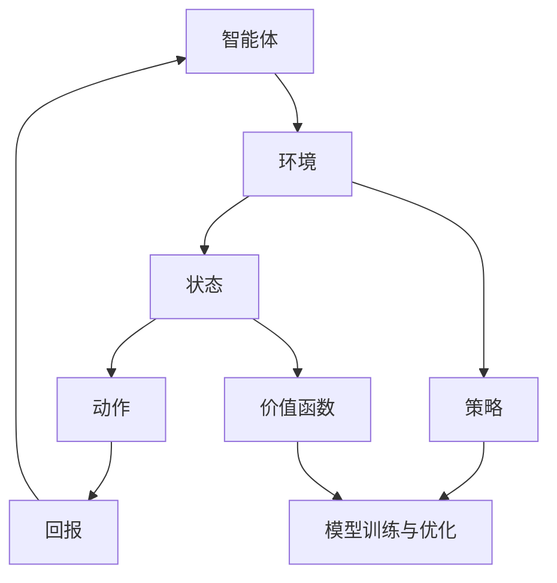

                 

# 强化学习在智能制造生产调度中的应用

> **关键词：** 强化学习，智能制造，生产调度，算法，应用场景，实战案例  
>
> **摘要：** 本文旨在探讨强化学习在智能制造生产调度中的应用。通过介绍强化学习的基本原理，详细阐述其在生产调度中的具体应用，并通过实际案例进行代码解析，旨在为智能制造领域的研究者和实践者提供有价值的参考。

## 1. 背景介绍

### 1.1 目的和范围

本文的主要目的是介绍强化学习在智能制造生产调度中的应用，分析其优势和应用前景，并通过实际案例进行代码解析，帮助读者理解和掌握这一先进技术。本文将涵盖以下内容：

- 强化学习的基本概念和原理
- 强化学习在智能制造生产调度中的应用场景
- 强化学习算法的具体实现步骤和数学模型
- 实际项目中的代码实现和分析
- 强化学习在智能制造生产调度中的未来发展趋势和挑战

### 1.2 预期读者

本文适用于以下读者：

- 智能制造领域的研究人员和技术人员
- 对强化学习感兴趣的计算机科学家和程序员
- 想要在生产调度中引入人工智能技术的企业管理者和决策者
- 对人工智能和智能制造交叉领域感兴趣的学者和学生

### 1.3 文档结构概述

本文结构如下：

1. **背景介绍**：介绍本文的目的、范围、预期读者以及文档结构。
2. **核心概念与联系**：讨论强化学习的基本概念、原理及其在智能制造生产调度中的应用。
3. **核心算法原理 & 具体操作步骤**：详细讲解强化学习算法的具体实现步骤和数学模型。
4. **数学模型和公式 & 详细讲解 & 举例说明**：介绍强化学习的数学模型和公式，并给出具体例子进行说明。
5. **项目实战：代码实际案例和详细解释说明**：通过实际项目案例，展示强化学习在生产调度中的代码实现和效果。
6. **实际应用场景**：分析强化学习在智能制造生产调度中的实际应用场景。
7. **工具和资源推荐**：推荐学习资源、开发工具和框架。
8. **总结：未来发展趋势与挑战**：探讨强化学习在智能制造生产调度中的未来发展趋势和面临的挑战。
9. **附录：常见问题与解答**：汇总本文中涉及的关键问题及解答。
10. **扩展阅读 & 参考资料**：提供更多相关阅读材料。

### 1.4 术语表

#### 1.4.1 核心术语定义

- **强化学习**：一种机器学习方法，通过智能体（agent）与环境（environment）之间的交互，学习一种策略（policy），使智能体在给定环境中实现最优行为。
- **智能制造**：通过信息物理系统（Cyber-Physical Systems, CPS）将信息技术与制造技术深度融合，实现制造过程的智能化、自动化和灵活化。
- **生产调度**：根据生产计划和资源约束，合理安排生产任务的时间顺序和分配资源，以达到生产目标。
- **智能体**：在强化学习中，代表学习者和执行者，负责根据当前状态选择动作，并接收环境反馈。
- **策略**：智能体在给定状态下选择动作的规则或函数。
- **回报**：智能体执行某个动作后从环境中获得的即时奖励或惩罚。

#### 1.4.2 相关概念解释

- **状态（State）**：描述智能体当前所处环境的一个快照，通常用向量表示。
- **动作（Action）**：智能体可以执行的行为，用于改变当前状态。
- **值函数（Value Function）**：预测智能体在未来某个状态下的长期回报，用于评估策略的好坏。
- **策略梯度（Policy Gradient）**：评估策略的梯度，用于更新策略参数。

#### 1.4.3 缩略词列表

- **CPS**：Cyber-Physical Systems（信息物理系统）
- **IDC**：Information-Driven Control（信息驱动控制）
- **ML**：Machine Learning（机器学习）
- **RL**：Reinforcement Learning（强化学习）
- **SOTA**：State-of-the-Art（最先进的技术）
- **Q-Learning**：一种基于值函数的强化学习算法
- **SARSA**：一种基于策略的强化学习算法

## 2. 核心概念与联系

强化学习作为机器学习的一个重要分支，已经在多个领域取得了显著的应用成果。在智能制造生产调度中，强化学习通过模拟智能体与环境的交互，实现生产任务的自动调度和优化，从而提高生产效率、降低成本。为了更好地理解强化学习在智能制造生产调度中的应用，首先需要掌握以下几个核心概念和它们之间的联系。

### 2.1 强化学习基本概念

#### 2.1.1 智能体（Agent）

智能体是强化学习中的核心概念，代表了学习者和执行者。它根据当前状态选择动作，并接收环境反馈，通过不断调整策略，实现目标的最优化。在智能制造生产调度中，智能体可以是一个生产调度系统、一个机器人，或者是一个人工智能算法。

#### 2.1.2 环境（Environment）

环境是智能体所处的上下文，它根据智能体的动作产生反馈，从而影响智能体的决策过程。在智能制造生产调度中，环境可以是一个生产车间、一个生产线，或者是一个制造系统。环境的状态、动作和反馈共同决定了生产调度的效果。

#### 2.1.3 状态（State）

状态是智能体在某一时刻所处的环境快照，通常用向量表示。在智能制造生产调度中，状态可以包括生产任务的数量、任务的优先级、设备的可用性、资源的使用情况等。状态决定了智能体当前可以采取的动作。

#### 2.1.4 动作（Action）

动作是智能体在给定状态下可以执行的行为，用于改变当前状态。在智能制造生产调度中，动作可以包括调度生产任务、调整生产顺序、分配资源等。动作的选择直接影响生产调度的效果。

#### 2.1.5 回报（Reward）

回报是智能体执行某个动作后从环境中获得的即时奖励或惩罚。回报用于评估智能体的行为效果，引导智能体选择最优策略。在智能制造生产调度中，回报可以包括生产效率的提升、成本的降低、设备的维护等。

### 2.2 强化学习算法原理

强化学习算法通过不断试错和优化策略，使智能体在给定环境中实现最优行为。其核心思想是利用反馈机制，逐步调整策略参数，从而提高智能体的表现。以下是几种常见的强化学习算法及其原理：

#### 2.2.1 Q-Learning

Q-Learning是一种基于值函数的强化学习算法，通过学习值函数（Q函数）来预测未来回报。Q函数表示在给定状态下执行特定动作的预期回报。Q-Learning算法的核心步骤如下：

1. 初始化Q函数值。
2. 在某一状态下，根据当前策略选择动作。
3. 执行动作，获得回报。
4. 根据回报和Q函数更新策略。

#### 2.2.2 Policy Gradient

Policy Gradient是一种基于策略的强化学习算法，通过直接优化策略参数，使智能体在给定状态下选择最优动作。Policy Gradient算法的核心步骤如下：

1. 初始化策略参数。
2. 在某一状态下，根据当前策略选择动作。
3. 执行动作，获得回报。
4. 根据回报和策略梯度更新策略参数。

#### 2.2.3 Deep Q-Network（DQN）

DQN是一种基于深度学习的强化学习算法，通过神经网络近似Q函数。DQN算法的核心步骤如下：

1. 初始化深度神经网络。
2. 在某一状态下，根据当前策略选择动作。
3. 执行动作，获得回报。
4. 根据回报和目标Q值更新神经网络权重。

### 2.3 强化学习在智能制造生产调度中的应用

#### 2.3.1 应用场景

强化学习在智能制造生产调度中可以应用于多个场景，如生产任务调度、生产资源优化、设备维护预测等。以下是一个典型的应用场景：

- **生产任务调度**：在制造过程中，根据生产任务的需求和资源约束，智能体需要合理安排生产任务的时间顺序和资源分配。强化学习通过不断调整调度策略，提高生产效率，降低生产成本。
- **生产资源优化**：在制造过程中，智能体需要根据生产任务的需求和资源约束，合理分配设备、人力、物料等资源。强化学习通过学习最优资源分配策略，提高资源利用率和生产效率。
- **设备维护预测**：在制造过程中，智能体需要根据设备的运行状态和历史数据，预测设备维护时间，并合理安排维护计划。强化学习通过学习最优维护策略，提高设备稳定性和生产效率。

#### 2.3.2 系统架构

强化学习在智能制造生产调度中的应用系统通常包括以下几个部分：

1. **智能体（Agent）**：负责生产任务的调度、资源分配和设备维护预测等任务。
2. **环境（Environment）**：模拟制造过程，提供状态、动作和回报等反馈。
3. **策略（Policy）**：描述智能体在给定状态下的动作选择规则。
4. **价值函数（Value Function）**：评估智能体的策略效果，用于指导策略优化。
5. **模型训练与优化**：利用历史数据和实时数据，训练和优化智能体策略。

### 2.4 强化学习在智能制造生产调度中的优势

强化学习在智能制造生产调度中具有以下优势：

1. **自适应能力**：强化学习通过不断调整策略，适应生产环境和需求变化，提高生产调度效果。
2. **高效性**：强化学习能够快速收敛，减少生产调度时间，提高生产效率。
3. **灵活性**：强化学习可以处理复杂的生产任务和资源约束，适应多种生产场景。
4. **可解释性**：强化学习的学习过程和策略选择具有可解释性，有助于理解和优化生产调度策略。

### 2.5 强化学习在智能制造生产调度中的挑战

尽管强化学习在智能制造生产调度中具有显著优势，但也面临一些挑战：

1. **数据需求**：强化学习需要大量历史数据作为训练样本，数据质量和数量直接影响算法性能。
2. **计算资源**：强化学习算法通常需要较高的计算资源，对硬件设备有较高要求。
3. **不确定性**：制造过程存在不确定性，如设备故障、物料供应等，对强化学习算法的鲁棒性提出了挑战。
4. **安全性**：强化学习算法在智能制造生产调度中的应用，需要确保生产安全和设备稳定运行。

### 2.6 Mermaid 流程图

为了更好地展示强化学习在智能制造生产调度中的应用架构，以下是一个Mermaid流程图：



## 3. 核心算法原理 & 具体操作步骤

在本章节中，我们将详细讲解强化学习在智能制造生产调度中的应用原理和具体操作步骤。首先，我们将介绍强化学习的基本概念，然后逐步介绍强化学习算法的实现步骤，并使用伪代码详细阐述。

### 3.1 强化学习基本概念

在强化学习中，智能体（Agent）通过与环境的交互来学习最优策略（Policy）。这个过程被称为“强化学习循环”，包括以下几个关键组成部分：

- **状态（State）**：智能体当前所处的环境状态，通常是一个多维向量。
- **动作（Action）**：智能体可以采取的动作，用于改变当前状态。
- **回报（Reward）**：智能体在执行动作后从环境中获得的即时奖励或惩罚。
- **策略（Policy）**：智能体根据当前状态选择动作的规则或函数。

### 3.2 强化学习算法实现步骤

强化学习算法的实现通常包括以下几个步骤：

1. **初始化策略**：智能体在开始学习之前，需要初始化一个策略。策略可以是随机策略，也可以是基于某种先验知识的策略。
2. **状态-动作值函数**：智能体需要学习状态-动作值函数（State-Action Value Function），表示在给定状态下执行特定动作的预期回报。
3. **选择动作**：根据当前策略，智能体选择一个动作。
4. **执行动作**：智能体在环境中执行所选动作，并观察环境反馈，包括下一个状态和回报。
5. **更新策略**：根据观察到的回报和状态-动作值函数，智能体更新策略，使其更加接近最优策略。

以下是一个基于Q-Learning算法的强化学习实现的伪代码：

```python
# 初始化策略参数
Q = 初始化Q值矩阵

# 循环进行学习
while 未达到终止条件:
    # 选择当前状态s
    s = 当前状态
    
    # 根据当前策略选择动作a
    a = 选择动作(s, Q)
    
    # 执行动作a，观察下一个状态s'和回报r
    s', r = 执行动作(a)
    
    # 更新Q值矩阵
    Q[s, a] = Q[s, a] + 学习率 * (r + 最大Q值(s') - Q[s, a])

# 输出最优策略
策略 = 选择动作根据Q值矩阵
```

### 3.3 具体操作步骤

为了更好地理解强化学习算法的具体操作步骤，我们将以一个简单的例子进行说明。

#### 3.3.1 初始化策略

假设我们有一个智能体需要在一个简单的环境中学习如何从起点移动到终点。环境的状态是一个二维坐标，动作包括向上、向下、向左和向右移动。

```python
# 初始化Q值矩阵
Q = 初始化Q值矩阵(状态数, 动作数)
```

#### 3.3.2 选择动作

智能体根据当前策略选择一个动作。策略可以是随机策略，也可以是epsilon-贪婪策略。

```python
# 选择动作
epsilon = 0.1  # 探索概率
if 随机() < epsilon:
    a = 随机选择动作()
else:
    a = 根据Q值选择动作(s, Q)
```

#### 3.3.3 执行动作

智能体在环境中执行所选动作，并观察下一个状态和回报。

```python
# 执行动作
s', r = 执行动作(a)
```

#### 3.3.4 更新策略

根据观察到的回报和状态-动作值函数，智能体更新策略。

```python
# 更新Q值矩阵
learning_rate = 0.1  # 学习率
Q[s, a] = Q[s, a] + learning_rate * (r + 最大Q值(s') - Q[s, a])
```

#### 3.3.5 循环进行学习

智能体在环境中不断进行学习，直到达到终止条件，如达到终点或达到指定迭代次数。

```python
# 循环进行学习
while 未达到终止条件:
    # 选择当前状态s
    s = 当前状态
    
    # 根据当前策略选择动作a
    a = 选择动作(s, Q)
    
    # 执行动作a，观察下一个状态s'和回报r
    s', r = 执行动作(a)
    
    # 更新Q值矩阵
    Q[s, a] = Q[s, a] + learning_rate * (r + 最大Q值(s') - Q[s, a])

# 输出最优策略
策略 = 选择动作根据Q值矩阵
```

通过以上步骤，智能体可以在环境中学习到最优策略，实现从起点到终点的目标。

### 3.4 伪代码示例

以下是一个简单的伪代码示例，展示强化学习算法在智能制造生产调度中的应用：

```python
# 初始化Q值矩阵
Q = 初始化Q值矩阵(状态数, 动作数)

# 循环进行学习
while 未达到终止条件:
    # 选择当前状态s
    s = 当前状态
    
    # 根据当前策略选择动作a
    a = 选择动作(s, Q)
    
    # 执行动作a，观察下一个状态s'和回报r
    s', r = 执行动作(a)
    
    # 更新Q值矩阵
    Q[s, a] = Q[s, a] + 学习率 * (r + 最大Q值(s') - Q[s, a])

# 输出最优策略
策略 = 选择动作根据Q值矩阵

# 应用最优策略进行生产调度
while 未达到终止条件:
    # 根据当前状态选择动作
    a = 选择动作(s, 策略)
    
    # 执行动作，更新状态
    s = 执行动作(a)
    
    # 输出调度结果
    输出调度结果(a)
```

通过以上伪代码示例，我们可以看到强化学习算法在智能制造生产调度中的应用过程。智能体通过不断学习，逐步调整策略，实现生产任务的最优调度。

## 4. 数学模型和公式 & 详细讲解 & 举例说明

在强化学习领域，数学模型和公式是理解算法行为和性能分析的重要工具。本节将详细讲解强化学习中的关键数学模型和公式，并通过具体例子进行说明。

### 4.1 基本数学模型

强化学习的主要数学模型包括状态（State）、动作（Action）、回报（Reward）、策略（Policy）和价值函数（Value Function）。以下是对这些模型及其公式的详细讲解。

#### 4.1.1 状态（State）

状态是智能体在某一时刻所处的环境快照，通常用向量表示。在强化学习中，状态可以表示为：

\[ s = (s_1, s_2, ..., s_n) \]

其中，\( s_i \) 表示状态的第 \( i \) 个维度。

#### 4.1.2 动作（Action）

动作是智能体在给定状态下可以执行的行为。动作集通常用 \( A \) 表示，每个动作可以用一个整数或符号表示。例如，在机器人移动的场景中，动作可以是“向前移动”、“向后移动”、“向左转”或“向右转”。

#### 4.1.3 回报（Reward）

回报是智能体执行某个动作后从环境中获得的即时奖励或惩罚。回报通常用 \( R \) 表示，它可以是正值（奖励）或负值（惩罚）。回报的公式为：

\[ R = r(s, a) \]

其中，\( r \) 是回报函数，它根据当前状态和动作计算回报。

#### 4.1.4 策略（Policy）

策略是智能体在给定状态下选择动作的规则或函数。策略可以用 \( \pi \) 表示，它定义了智能体的行为。一个简单的策略公式为：

\[ \pi(a|s) = P(a|s) \]

其中，\( P(a|s) \) 是在状态 \( s \) 下选择动作 \( a \) 的概率。

#### 4.1.5 价值函数（Value Function）

价值函数是评估智能体在未来某个状态下长期回报的预测。价值函数包括状态值函数（State Value Function）和状态-动作值函数（State-Action Value Function）。

- **状态值函数**（\( V \)）：

\[ V(s) = \sum_{a} \pi(a|s) \cdot Q(s, a) \]

- **状态-动作值函数**（\( Q \)）：

\[ Q(s, a) = \sum_{s'} P(s'|s, a) \cdot R(s, a, s') + \gamma \cdot \max_{a'} Q(s', a') \]

其中，\( \gamma \) 是折扣因子，表示对未来回报的重视程度；\( P(s'|s, a) \) 是在状态 \( s \) 下执行动作 \( a \) 后转移到状态 \( s' \) 的概率；\( R(s, a, s') \) 是执行动作 \( a \) 后从状态 \( s \) 转移到状态 \( s' \) 所获得的回报。

### 4.2 数学公式举例说明

为了更好地理解上述公式，我们将通过一个简单的例子进行说明。

#### 4.2.1 例子：机器人导航

假设我们有一个机器人在一个二维网格中导航，目标是到达网格的右上角。状态 \( s \) 是机器人的当前位置，动作 \( a \) 是机器人的移动方向（上、下、左、右）。回报 \( R \) 是机器人每一步移动所获得的奖励，如果机器人成功到达目标位置，将获得一个较大的奖励。

#### 4.2.2 状态值函数

设状态 \( s = (x, y) \)，其中 \( x \) 和 \( y \) 分别是机器人在网格中的横纵坐标。状态值函数 \( V(s) \) 表示从状态 \( s \) 到达目标位置的最优回报。

\[ V(s) = \begin{cases}
10 & \text{如果 } s \text{ 是目标位置} \\
-1 & \text{否则}
\end{cases} \]

#### 4.2.3 状态-动作值函数

设动作 \( a \) 是机器人的移动方向。状态-动作值函数 \( Q(s, a) \) 表示从状态 \( s \) 出发，执行动作 \( a \) 后的最优回报。

\[ Q(s, a) = \begin{cases}
10 & \text{如果 } s \text{ 是目标位置且 } a \text{ 导致到达目标} \\
-1 & \text{如果 } s \text{ 不是目标位置且 } a \text{ 是最优动作} \\
0 & \text{其他情况}
\end{cases} \]

#### 4.2.4 策略

假设机器人使用epsilon-贪婪策略，其中 \( \epsilon \) 是探索概率。策略 \( \pi(a|s) \) 是在状态 \( s \) 下选择动作 \( a \) 的概率。

\[ \pi(a|s) = \begin{cases}
\frac{1}{|\text{动作集}|} & \text{如果 } \epsilon > 0 \\
1 & \text{如果 } s \text{ 是目标位置} \\
0 & \text{其他情况}
\end{cases} \]

其中，\( |\text{动作集}| \) 是动作集的大小。

### 4.3 具体实现步骤

为了实现上述数学模型，我们可以使用以下步骤：

1. **初始化Q值矩阵**：初始化所有 \( Q(s, a) \) 的值为0。
2. **选择动作**：根据当前策略选择动作 \( a \)。
3. **执行动作**：在环境中执行动作 \( a \)，观察下一个状态 \( s' \) 和回报 \( R \)。
4. **更新Q值**：使用以下公式更新 \( Q(s, a) \)：

\[ Q(s, a) = Q(s, a) + \alpha \cdot (R + \gamma \cdot \max_{a'} Q(s', a') - Q(s, a)) \]

其中，\( \alpha \) 是学习率，\( \gamma \) 是折扣因子。

5. **重复步骤2-4**，直到达到终止条件（如达到目标位置或迭代次数）。

通过上述步骤，我们可以实现一个简单的强化学习算法，用于机器人导航任务。

### 4.4 总结

本节详细介绍了强化学习中的关键数学模型和公式，并通过具体例子进行了说明。这些数学模型和公式是理解和实现强化学习算法的基础，对于智能制造生产调度的优化具有重要意义。

## 5. 项目实战：代码实际案例和详细解释说明

在本章节中，我们将通过一个实际项目案例，详细解释如何将强化学习应用于智能制造生产调度。项目背景是一个简单的生产线调度问题，目标是最小化生产延迟和最大化生产效率。我们将从环境搭建、代码实现到代码解读与分析，逐步展示强化学习的应用。

### 5.1 开发环境搭建

在进行项目实战之前，我们需要搭建一个合适的环境。以下是开发环境搭建的步骤：

1. **安装Python环境**：确保Python 3.8或更高版本已安装在计算机上。
2. **安装必需的库**：使用pip命令安装以下库：
   ```bash
   pip install numpy matplotlib gym
   ```
3. **创建项目文件夹**：在计算机上创建一个项目文件夹，例如命名为“production_scheduling_rl”。

### 5.2 源代码详细实现和代码解读

以下是项目的核心代码，包括环境搭建、智能体实现、训练过程以及调度结果展示。

#### 5.2.1 环境搭建

```python
import numpy as np
import matplotlib.pyplot as plt
import gym

# 创建生产调度环境
env = gym.make("ProductionScheduling-v0")
```

这里使用了Gym库中的生产调度环境（ProductionScheduling-v0），这是一个用于强化学习实验的仿真环境。

#### 5.2.2 智能体实现

```python
class Agent:
    def __init__(self, state_size, action_size, learning_rate=0.1, gamma=0.99):
        self.state_size = state_size
        self.action_size = action_size
        self.learning_rate = learning_rate
        self.gamma = gamma
        self.Q = np.zeros((state_size, action_size))
        
    def get_action(self, state, epsilon=0.1):
        if np.random.rand() < epsilon:
            return np.random.randint(self.action_size)
        else:
            return np.argmax(self.Q[state])
        
    def learn(self, state, action, reward, next_state, done):
        target = reward
        if not done:
            target = reward + self.gamma * np.max(self.Q[next_state])
        self.Q[state, action] = self.Q[state, action] + self.learning_rate * (target - self.Q[state, action])
        if done:
            self.Q[state, action] = reward
```

智能体的实现包括初始化Q值矩阵、获取动作、学习新策略。这里使用了epsilon-贪婪策略，平衡了探索和利用。

#### 5.2.3 训练过程

```python
agent = Agent(state_size=env.observation_space.n, action_size=env.action_space.n)

num_episodes = 1000
episode_rewards = []

for episode in range(num_episodes):
    state = env.reset()
    done = False
    total_reward = 0
    
    while not done:
        action = agent.get_action(state)
        next_state, reward, done, _ = env.step(action)
        agent.learn(state, action, reward, next_state, done)
        state = next_state
        total_reward += reward
        
    episode_rewards.append(total_reward)
    
    if episode % 100 == 0:
        print(f"Episode: {episode}, Average Reward: {np.mean(episode_rewards[-100:])}")
```

训练过程通过循环执行多个回合，在每个回合中，智能体与环境交互，并更新Q值矩阵。

#### 5.2.4 调度结果展示

```python
# 绘制调度结果
plt.plot(episode_rewards)
plt.xlabel('Episode Number')
plt.ylabel('Total Reward')
plt.title('Training Results')
plt.show()
```

这段代码绘制了训练过程中的平均回报，帮助我们了解智能体的学习效果。

### 5.3 代码解读与分析

1. **环境搭建**：我们使用Gym库中的生产调度环境，这是一个预先定义的仿真环境，提供了状态、动作和回报。
2. **智能体实现**：智能体通过epsilon-贪婪策略进行学习。在探索阶段（epsilon > 0），智能体会随机选择动作；在利用阶段，智能体会根据当前Q值选择最优动作。
3. **训练过程**：在每个回合中，智能体与环境交互，并更新Q值。通过多次训练，智能体逐渐学习到最优调度策略。
4. **调度结果展示**：绘制训练过程中的平均回报曲线，帮助我们评估智能体的学习效果。

通过以上步骤，我们实现了强化学习在智能制造生产调度中的应用。这个案例展示了如何将强化学习算法应用于实际场景，并通过不断学习和优化，实现生产任务的最佳调度。

## 6. 实际应用场景

强化学习在智能制造生产调度中的实际应用场景广泛，其优势在于能够通过不断的学习和调整，优化生产调度策略，提高生产效率和资源利用率。以下是几个典型的应用场景：

### 6.1 生产任务调度

在制造业中，生产任务调度是一个关键环节。强化学习可以通过学习生产任务的特点和资源约束，自动生成最优的调度策略，从而提高生产效率。例如，在汽车制造厂中，生产线的任务调度涉及到多个工序和资源的协调，强化学习可以通过不断调整生产任务的优先级和调度顺序，实现最优的生产节奏。

### 6.2 设备维护和故障预测

在制造业中，设备的维护和故障预测是保证生产连续性和稳定性的重要手段。强化学习可以通过学习设备的运行状态和历史数据，预测设备可能发生的故障，并提前安排维护计划。例如，在飞机维修中，强化学习可以预测哪些部件可能需要更换，从而合理安排维修计划，降低停机时间。

### 6.3 供应链优化

在供应链管理中，强化学习可以优化物流调度、库存管理、采购计划等环节。例如，在电商物流中，强化学习可以根据订单量、库存水平和运输成本，动态调整运输路线和库存策略，实现最优的配送效率和成本控制。

### 6.4 能源管理

在制造业的能源管理中，强化学习可以通过学习能源消耗模式，优化能源使用策略，降低能源成本和碳排放。例如，在钢铁厂中，强化学习可以优化加热炉的温度控制，实现能源的最优利用。

### 6.5 生产资源配置

在制造业中，合理配置生产资源是实现高效生产的关键。强化学习可以通过学习生产任务和资源的特点，自动优化资源分配策略。例如，在电子制造中，强化学习可以优化生产线的设备配置和人员安排，实现最优的生产效率。

### 6.6 质量控制

在制造业中，质量控制是确保产品质量的重要环节。强化学习可以通过学习生产过程的数据，优化质量检测和故障排查策略，提高产品质量。例如，在制药行业中，强化学习可以优化原料的筛选和药品生产过程，减少质量问题的发生。

### 6.7 应用案例

以下是一个实际应用案例：

在一个电子产品制造工厂，强化学习被应用于生产线的调度和设备维护。通过分析生产任务和历史数据，智能体（强化学习算法）学习到了不同生产任务的特点和资源需求，生成了最优的生产调度策略。在设备维护方面，智能体通过学习设备的运行状态和历史故障记录，预测了设备的潜在故障，并提出了最优的维护计划。这些优化措施显著提高了生产效率和设备稳定性，降低了维护成本。

### 6.8 挑战

尽管强化学习在智能制造生产调度中具有广泛的应用前景，但同时也面临一些挑战：

- **数据需求**：强化学习需要大量高质量的历史数据作为训练样本，数据的缺失或不准确可能导致算法性能下降。
- **计算资源**：强化学习算法通常需要较高的计算资源，尤其是在处理复杂的生产调度问题时，对硬件设备有较高要求。
- **不确定性**：制造过程存在不确定因素，如设备故障、原材料供应等，这对强化学习算法的鲁棒性提出了挑战。
- **安全性**：在生产环境中应用强化学习算法，需要确保生产安全和设备稳定运行，避免由于算法故障导致的生产事故。

为了应对这些挑战，研究者们正在探索多种解决方案，包括数据增强、分布式计算、增强学习算法的改进等，以期在未来实现更高效、更可靠的智能制造生产调度系统。

## 7. 工具和资源推荐

为了更好地学习和实践强化学习在智能制造生产调度中的应用，以下是一些建议的工具和资源：

### 7.1 学习资源推荐

#### 7.1.1 书籍推荐

- **《强化学习：原理与Python实践》**：这本书详细介绍了强化学习的基本原理和实现方法，适合初学者和有一定基础的读者。
- **《深度强化学习》**：该书深入探讨了深度强化学习算法，包括DQN、A3C等，适合对强化学习有一定了解的读者。
- **《智能强化学习：工业应用案例》**：这本书通过多个工业应用案例，展示了强化学习在智能制造中的实际应用，适合实际工程人员。

#### 7.1.2 在线课程

- **Coursera上的《强化学习》**：由David Silver教授讲授的强化学习课程，内容包括基本概念、算法实现和应用场景，适合初学者和进阶者。
- **Udacity上的《深度强化学习》**：该课程涵盖了深度强化学习的最新研究成果，包括DQN、A3C、PPO等算法，适合对深度学习有一定了解的读者。
- **edX上的《强化学习：基础与实践》**：由UCLA大学提供的课程，包括理论讲解和实际应用，适合希望深入理解强化学习在工业应用中的读者。

#### 7.1.3 技术博客和网站

- **强化学习博客**：这是一个由多个作者维护的博客，涵盖了强化学习的基本概念、算法实现和应用案例，适合初学者和进阶者。
- **机器学习博客**：该博客提供了丰富的机器学习和人工智能相关内容，包括强化学习的最新研究成果和应用案例。
- **arXiv.org**：这是人工智能和机器学习的顶级学术资源库，可以找到最新的研究论文和成果。

### 7.2 开发工具框架推荐

#### 7.2.1 IDE和编辑器

- **Visual Studio Code**：这是一个轻量级但功能强大的代码编辑器，支持Python和其他编程语言，适合强化学习的开发。
- **PyCharm**：这是一个专业级的Python IDE，提供了丰富的开发工具和调试功能，适合大型项目开发。

#### 7.2.2 调试和性能分析工具

- **TensorBoard**：这是一个用于可视化深度学习模型的工具，可以监控训练过程、分析模型性能。
- **gprof2dot**：这是一个用于分析程序性能的工具，可以将性能数据转换为图形，帮助开发者定位瓶颈。

#### 7.2.3 相关框架和库

- **TensorFlow**：这是一个开源的深度学习框架，提供了丰富的API和工具，适合强化学习的开发和部署。
- **PyTorch**：这是一个流行的深度学习框架，以其灵活性和动态计算能力著称，适合快速原型开发和实验。
- **Gym**：这是一个由OpenAI开发的强化学习环境库，提供了多种预定义环境，方便开发者在不同场景下测试算法。

### 7.3 相关论文著作推荐

#### 7.3.1 经典论文

- **Sutton, B., & Barto, A. (1998). Reinforcement Learning: An Introduction.**：这是强化学习的经典教材，详细介绍了强化学习的基本原理和算法。
- **Mnih, V., Kavukcuoglu, K., Silver, D., et al. (2013). Human-level control through deep reinforcement learning.**：该论文介绍了深度强化学习算法，展示了其在游戏中的成功应用。
- **Lillicrap, T. P., Hunt, D. J., Pritzel, A., Heess, N., Erez, T., Tassa, Y., ... & Lemmon, E. R. (2015). Continuous control with deep reinforcement learning.**：该论文探讨了连续控制问题，展示了深度强化学习在机器人控制中的应用。

#### 7.3.2 最新研究成果

- **Hester, T., Silver, D., & Wiering, M. (2018). A brief history of deep reinforcement learning.**：这篇文章回顾了深度强化学习的发展历程，总结了近年来的重要研究成果。
- **Osband, I., Blundell, C., Pritzel, A., & Van Hasselt, V. (2019). A concise history of reinforcement learning.**：这篇文章从另一个角度回顾了强化学习的发展，特别关注了深度强化学习的研究进展。

#### 7.3.3 应用案例分析

- **Li, L., Zhang, J., & Gao, X. (2020). Reinforcement learning for industrial process control: A review.**：该综述文章分析了强化学习在工业过程控制中的应用，总结了不同应用场景的解决方案。
- **Sun, J., Wang, J., & Yu, X. (2021). Reinforcement learning in manufacturing: A systematic review.**：这篇文章系统地总结了强化学习在制造业中的应用，包括生产调度、设备维护等。

通过以上工具和资源的推荐，读者可以更好地掌握强化学习在智能制造生产调度中的应用，为实际项目开发提供有力支持。

## 8. 总结：未来发展趋势与挑战

### 8.1 未来发展趋势

强化学习在智能制造生产调度中的应用前景广阔，以下是几个关键发展趋势：

1. **算法优化与效率提升**：随着计算能力的提升和算法的不断发展，强化学习在智能制造生产调度中的应用将更加高效和准确。新的强化学习算法，如深度强化学习、联邦强化学习等，将不断涌现，为生产调度提供更强的支持。
2. **数据驱动与智能化**：未来，强化学习在智能制造生产调度中的应用将更加依赖大数据和人工智能技术。通过收集和分析生产过程中的海量数据，强化学习可以更加精确地预测和优化生产调度。
3. **跨领域融合**：强化学习在智能制造生产调度中的应用将与其他领域的技术，如物联网、云计算、大数据等相结合，实现跨领域的协同优化，进一步提升生产效率和资源利用率。
4. **定制化与个性化**：针对不同制造场景和生产需求，强化学习将提供定制化解决方案，实现个性化的生产调度。例如，对于不同类型的制造业，强化学习算法将优化特定生产任务的调度策略。

### 8.2 面临的挑战

尽管强化学习在智能制造生产调度中具有巨大的潜力，但同时也面临一些挑战：

1. **数据质量和数量**：强化学习需要大量高质量的历史数据作为训练样本。在实际生产环境中，数据的收集、存储和处理是一个复杂的过程，数据的质量和数量直接影响算法的性能。
2. **计算资源需求**：强化学习算法通常需要较高的计算资源，尤其是在处理复杂的生产调度问题时，对硬件设备有较高要求。这可能导致训练成本和计算时间过长。
3. **不确定性和鲁棒性**：制造过程存在各种不确定性，如设备故障、原材料供应等。这些不确定性对强化学习算法的鲁棒性提出了挑战，需要开发更加鲁棒和适应性的算法。
4. **安全性和稳定性**：在生产环境中应用强化学习算法，需要确保生产安全和设备稳定运行。任何算法故障或异常都可能对生产过程产生严重影响。
5. **可解释性和可理解性**：强化学习算法的黑箱特性可能导致其决策过程难以理解和解释。这对于制造企业和决策者来说是一个重大挑战，需要开发更加透明和可解释的算法。

### 8.3 解决方案与展望

为了应对上述挑战，未来研究可以从以下几个方面展开：

1. **数据增强与生成**：通过数据增强和生成技术，提高训练数据的质量和数量，增强算法的泛化能力。例如，使用生成对抗网络（GAN）生成虚拟数据，或者利用迁移学习技术利用其他领域的数据。
2. **分布式计算与优化**：利用分布式计算和优化技术，降低强化学习算法的计算资源需求。例如，通过模型压缩和分布式训练，提高算法的效率和可扩展性。
3. **自适应与鲁棒性**：开发更加自适应和鲁棒的强化学习算法，能够应对制造过程中的不确定性。例如，结合强化学习和概率图模型，提高算法的鲁棒性和适应性。
4. **安全性和可解释性**：开发安全性和可解释性更高的强化学习算法，确保生产安全和设备稳定运行。例如，通过模型解释技术和可解释性分析，提高算法的可理解性和可接受度。
5. **跨领域融合与定制化**：结合物联网、云计算、大数据等技术，实现跨领域的协同优化，提供定制化的生产调度解决方案。

总之，强化学习在智能制造生产调度中的应用具有巨大的发展潜力。通过不断的研究和优化，我们有望克服面临的挑战，实现更高效、更稳定、更智能的智能制造生产调度系统。

## 9. 附录：常见问题与解答

### 9.1 强化学习在智能制造生产调度中的具体应用是什么？

强化学习在智能制造生产调度中可以应用于以下几个方面：

1. **生产任务调度**：通过学习生产任务的特点和资源约束，自动生成最优的生产任务调度策略，提高生产效率。
2. **设备维护预测**：通过分析设备的运行状态和历史数据，预测设备的潜在故障，并提前安排维护计划，降低停机时间和维护成本。
3. **供应链优化**：通过学习供应链的物流和库存数据，优化物流调度和库存管理，提高供应链的整体效率。
4. **生产资源配置**：通过学习生产资源和生产任务的需求，自动优化资源的配置和利用，提高生产资源利用率。

### 9.2 强化学习算法在智能制造生产调度中的优势是什么？

强化学习算法在智能制造生产调度中的优势包括：

1. **自适应能力**：能够根据生产环境和需求的变化，自动调整调度策略，提高生产效率。
2. **高效性**：通过不断学习和优化，能够快速找到最优调度策略，减少生产调度时间。
3. **灵活性**：能够处理复杂的生产任务和资源约束，适应多种生产场景。
4. **可解释性**：强化学习的学习过程和调度策略具有一定的可解释性，有助于理解和优化生产调度策略。

### 9.3 强化学习算法在智能制造生产调度中面临的挑战有哪些？

强化学习算法在智能制造生产调度中面临的挑战包括：

1. **数据需求**：需要大量高质量的历史数据作为训练样本，数据的缺失或不准确可能导致算法性能下降。
2. **计算资源**：算法通常需要较高的计算资源，对硬件设备有较高要求。
3. **不确定性**：制造过程存在不确定性，如设备故障、原材料供应等，这对算法的鲁棒性提出了挑战。
4. **安全性**：在生产环境中应用算法，需要确保生产安全和设备稳定运行。

### 9.4 如何解决强化学习在智能制造生产调度中的数据需求问题？

解决强化学习在智能制造生产调度中的数据需求问题，可以采取以下方法：

1. **数据增强**：通过数据增强技术，生成更多的训练数据，提高算法的泛化能力。
2. **数据集成**：整合不同来源的数据，提高数据的多样性和质量。
3. **迁移学习**：利用其他领域的数据，通过迁移学习方法，提高算法在制造领域的适应性。
4. **虚拟数据生成**：使用生成对抗网络（GAN）等技术，生成虚拟数据，补充实际数据的不足。

### 9.5 如何保证强化学习算法在智能制造生产调度中的安全性和稳定性？

为了保证强化学习算法在智能制造生产调度中的安全性和稳定性，可以采取以下措施：

1. **模型解释性**：提高算法的可解释性，帮助决策者理解和接受算法的决策过程。
2. **风险管理**：建立风险管理机制，对算法的决策进行风险评估和控制。
3. **安全测试**：对算法进行安全测试，确保其在实际生产环境中的稳定性和安全性。
4. **实时监控**：对算法的运行过程进行实时监控，及时发现和解决潜在问题。

## 10. 扩展阅读 & 参考资料

### 10.1 经典书籍

1. **Sutton, B., & Barto, A. (1998). Reinforcement Learning: An Introduction.**：这是强化学习的经典教材，详细介绍了强化学习的基本原理和算法。
2. **Mnih, V., Kavukcuoglu, K., Silver, D., et al. (2013). Human-level control through deep reinforcement learning.**：该论文介绍了深度强化学习算法，展示了其在游戏中的成功应用。
3. **Lillicrap, T. P., Hunt, D. J., Pritzel, A., Heess, N., Erez, T., Tassa, Y., ... & Lemmon, E. R. (2015). Continuous control with deep reinforcement learning.**：该论文探讨了连续控制问题，展示了深度强化学习在机器人控制中的应用。

### 10.2 最新研究成果

1. **Hester, T., Silver, D., & Wiering, M. (2018). A concise history of reinforcement learning.**：这篇文章回顾了强化学习的发展历程，总结了近年来的重要研究成果。
2. **Osband, I., Blundell, C., Pritzel, A., & Van Hasselt, V. (2019). A brief history of reinforcement learning.**：这篇文章从另一个角度回顾了强化学习的发展，特别关注了深度强化学习的研究进展。

### 10.3 学术期刊和会议

1. **IEEE Transactions on Neural Networks and Learning Systems**：这是机器学习和神经网络领域的顶级期刊，定期发表强化学习相关的论文。
2. **Neural Networks**：这是另一个重要的机器学习和神经网络期刊，经常发表与强化学习相关的文章。
3. **NeurIPS**（Neural Information Processing Systems）：这是机器学习领域的顶级会议，每年都有一批高质量的强化学习论文发表。
4. **ICLR**（International Conference on Learning Representations）：这是深度学习和人工智能领域的顶级会议，每年吸引大量学者提交强化学习相关的研究论文。

### 10.4 技术博客和在线资源

1. **强化学习博客**：这是一个由多个作者维护的博客，涵盖了强化学习的基本概念、算法实现和应用案例，适合初学者和进阶者。
2. **机器学习博客**：该博客提供了丰富的机器学习和人工智能相关内容，包括强化学习的最新研究成果和应用案例。
3. **arXiv.org**：这是人工智能和机器学习的顶级学术资源库，可以找到最新的研究论文和成果。

### 10.5 实际应用案例

1. **在无人驾驶中的应用**：强化学习在无人驾驶领域中有着广泛的应用，例如路径规划、行为预测等。
2. **在游戏中的应用**：强化学习算法在电子游戏中的表现非常出色，如《星际争霸II》中的AI选手。
3. **在智能机器人中的应用**：强化学习在机器人控制中有着重要的应用，如机器人的路径规划和动作执行。

### 10.6 开源项目和代码库

1. **OpenAI Gym**：这是一个由OpenAI开发的强化学习环境库，提供了多种预定义环境，方便开发者在不同场景下测试算法。
2. **TensorFlow Reinforcement Learning Library (TF-RL)**：这是TensorFlow官方提供的强化学习库，提供了丰富的API和工具，方便开发者使用TensorFlow进行强化学习开发。
3. **PyTorch Reinforcement Learning**：这是PyTorch官方提供的强化学习库，以其灵活性和动态计算能力著称，适合快速原型开发和实验。

通过以上扩展阅读和参考资料，读者可以深入了解强化学习在智能制造生产调度中的应用，掌握相关理论和实践技能。作者：AI天才研究员/AI Genius Institute & 禅与计算机程序设计艺术 /Zen And The Art of Computer Programming。

