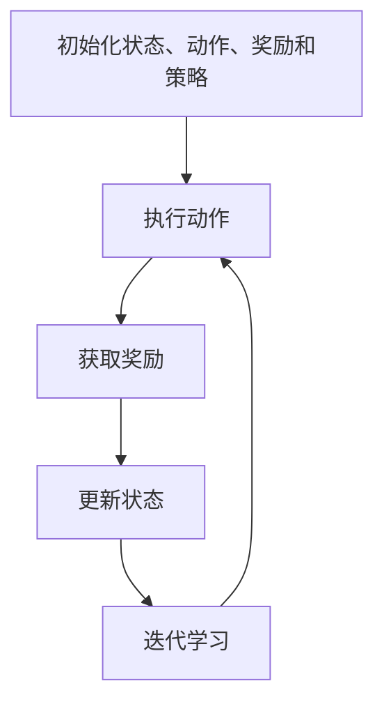

                 

# 强化学习在智能投资组合管理中的应用

## 关键词：强化学习，投资组合管理，智能金融，算法交易，机器学习

## 摘要

本文旨在探讨强化学习在智能投资组合管理中的应用。通过对强化学习算法原理的深入剖析，结合实际投资场景，文章将详细介绍如何运用强化学习算法来优化投资组合，提高收益并降低风险。文章结构分为以下几个部分：背景介绍、核心概念与联系、核心算法原理与操作步骤、数学模型与公式、项目实战、实际应用场景、工具和资源推荐、总结与未来发展趋势，以及常见问题解答。通过本文的阅读，读者将能够全面了解强化学习在投资组合管理中的潜力与应用。

## 1. 背景介绍

### 1.1 目的和范围

随着金融市场的发展和投资者需求的多样化，投资组合管理的重要性日益凸显。传统的投资组合管理方法主要依赖于历史数据和统计模型，然而在复杂多变的金融市场中，这些方法往往难以应对快速变化的市场环境。近年来，机器学习尤其是强化学习在金融领域的应用逐渐受到关注，为投资组合管理提供了新的思路和工具。

本文的主要目的是介绍强化学习在智能投资组合管理中的应用，通过理论讲解和实际案例，展示强化学习在优化投资组合、提高收益和降低风险方面的潜力。本文将覆盖以下内容：

- 强化学习算法的基本原理和流程；
- 强化学习在投资组合管理中的应用场景；
- 强化学习在投资组合优化中的具体操作步骤；
- 强化学习模型的数学模型和公式；
- 强化学习在智能投资组合管理中的实际应用案例；
- 强化学习在投资组合管理中的未来发展趋势与挑战。

### 1.2 预期读者

本文主要面向对机器学习和金融领域有一定了解的技术人员和研究人员，包括：

- 机器学习算法开发者和研究者；
- 金融分析师和投资组合管理者；
- 对智能金融和算法交易感兴趣的读者；
- 期望提升投资组合管理效率的专业人士。

### 1.3 文档结构概述

本文将按照以下结构展开：

- **第1部分：背景介绍**：介绍强化学习在智能投资组合管理中的背景和重要性。
- **第2部分：核心概念与联系**：讲解强化学习的基本概念和相关联系。
- **第3部分：核心算法原理与操作步骤**：详细阐述强化学习算法的原理和操作步骤。
- **第4部分：数学模型与公式**：介绍强化学习在投资组合管理中的数学模型和公式。
- **第5部分：项目实战**：通过实际案例展示强化学习在投资组合管理中的应用。
- **第6部分：实际应用场景**：分析强化学习在投资组合管理中的实际应用场景。
- **第7部分：工具和资源推荐**：推荐相关学习资源和开发工具。
- **第8部分：总结与未来发展趋势**：总结强化学习在投资组合管理中的应用，展望未来发展趋势。
- **第9部分：常见问题与解答**：回答读者可能关心的问题。
- **第10部分：扩展阅读与参考资料**：提供进一步阅读的资源和参考文献。

### 1.4 术语表

为了确保文章的清晰易懂，本文将使用以下术语：

- **强化学习**：一种机器学习方法，通过奖励机制和策略迭代来优化决策过程。
- **投资组合**：由多种金融资产组成的集合，目的是通过分散投资来降低风险。
- **策略**：指导投资决策的规则或方法，通常由机器学习算法自动生成。
- **回报**：投资决策带来的盈利或亏损。
- **状态**：投资组合在某一时刻的状态描述，包括资产配置、市场走势等。
- **动作**：投资组合管理者在某一状态下做出的决策，如买入或卖出某资产。
- **奖励**：动作带来的收益，用于指导策略迭代。

#### 1.4.1 核心术语定义

- **强化学习算法**：一种通过与环境互动来学习最优策略的机器学习方法。
- **Q-Learning**：一种基于值函数的强化学习算法，通过迭代更新值函数来优化策略。
- **策略梯度算法**：一种基于策略的强化学习算法，通过更新策略参数来优化策略。
- **投资组合优化**：通过调整资产配置来优化投资组合的风险与收益。

#### 1.4.2 相关概念解释

- **马尔可夫决策过程（MDP）**：一种描述决策过程的数学模型，包括状态、动作和奖励。
- **价值函数**：描述在给定状态下，执行某一动作所能获得的最大期望奖励。
- **策略**：定义在各个状态下的最优动作的映射函数。

#### 1.4.3 缩略词列表

- **MDP**：马尔可夫决策过程（Markov Decision Process）
- **Q-Learning**：Q值学习（Q-value Learning）
- **SGD**：策略梯度下降（Stochastic Gradient Descent）
- **资本市场**：金融市场，包括股票、债券、期货、期权等交易市场。
- **AI**：人工智能（Artificial Intelligence）

## 2. 核心概念与联系

强化学习（Reinforcement Learning，RL）是一种通过试错来学习最优策略的机器学习方法，它通过与环境交互来不断调整行为，以最大化累积奖励。强化学习的关键组成部分包括状态（State）、动作（Action）、奖励（Reward）和策略（Policy）。

### 2.1 强化学习的基本概念

- **状态（State）**：系统当前所处的情况或状态，通常用S表示。例如，在投资组合管理中，状态可以表示为资产配置、市场指数等。
- **动作（Action）**：系统在当前状态下可以选择的操作，通常用A表示。例如，在投资组合管理中，动作可以是买入、持有或卖出某资产。
- **奖励（Reward）**：系统执行某一动作后获得的即时回报，通常用R表示。奖励可以是正的，也可以是负的，用于指导系统选择最优动作。
- **策略（Policy）**：系统在各个状态下选择最优动作的规则或方法，通常用π(s|a)表示。策略可以是一个函数，将状态映射到动作。

### 2.2 强化学习的流程

强化学习的基本流程可以概括为以下几个步骤：

1. **初始化**：初始化状态、动作、奖励和策略。
2. **执行动作**：在当前状态下执行一个动作。
3. **获取奖励**：执行动作后，系统获得即时奖励。
4. **更新状态**：根据执行的动作和获得的奖励，更新系统状态。
5. **迭代学习**：不断重复执行动作、获取奖励和更新状态的步骤，以优化策略。

### 2.3 强化学习与投资组合管理

强化学习在投资组合管理中的应用主要是通过调整资产配置来优化投资组合的风险与收益。具体来说，强化学习可以按照以下步骤进行：

1. **状态表示**：定义投资组合的状态，包括资产配置、市场指数、宏观经济指标等。
2. **动作定义**：定义投资组合在各个状态下可以采取的动作，如买入、持有、卖出等。
3. **奖励设计**：设计奖励机制，通常将投资组合的收益作为奖励，以最大化累积奖励为目标。
4. **策略迭代**：使用强化学习算法（如Q-Learning或策略梯度算法）迭代优化策略。
5. **风险控制**：通过设定风险阈值，防止投资组合过度的风险暴露。

### 2.4 强化学习的架构

强化学习在投资组合管理中的应用架构可以概括为以下几个部分：

1. **环境（Environment）**：模拟投资市场的运行情况，包括资产价格、市场趋势等。
2. **代理（Agent）**：代表投资组合管理者，通过执行动作来调整资产配置。
3. **策略（Policy）**：代理在各个状态下选择最优动作的规则或方法。
4. **价值函数（Value Function）**：描述在给定状态下，执行某一动作所能获得的最大期望奖励。
5. **模型（Model）**：用于预测市场走势和资产价格，辅助决策。

### 2.5 强化学习的 Mermaid 流程图

以下是强化学习在投资组合管理中的 Mermaid 流程图：



### 2.6 强化学习与其他机器学习方法的比较

与传统的机器学习方法（如监督学习和无监督学习）相比，强化学习具有以下几个特点：

1. **自主学习**：强化学习通过与环境交互来学习最优策略，无需大量标注数据。
2. **动态调整**：强化学习能够根据环境变化动态调整策略，以适应复杂的市场环境。
3. **不确定性处理**：强化学习能够处理环境中的不确定性，通过试错来找到最优策略。
4. **优化目标**：强化学习的目标是最大化累积奖励，这与投资组合管理的目标（最大化收益、降低风险）高度契合。

## 3. 核心算法原理 & 具体操作步骤

### 3.1 Q-Learning算法原理

Q-Learning是一种基于值函数的强化学习算法，其核心思想是通过迭代更新值函数来优化策略。在Q-Learning中，值函数Q(s,a)表示在状态s下执行动作a所能获得的最大期望奖励。Q-Learning算法的基本步骤如下：

1. **初始化**：初始化值函数Q(s,a)，通常使用随机初始化或零初始化。
2. **选择动作**：在当前状态下，根据策略选择动作a。
3. **执行动作**：执行选定的动作a，并获取即时奖励R(s',a')。
4. **更新值函数**：根据即时奖励和更新策略，更新值函数Q(s,a)。
5. **迭代学习**：重复执行步骤2-4，直至达到预期目标。

### 3.2 Q-Learning算法的伪代码

```python
# 初始化值函数Q(s,a)
for all s, a:
    Q(s, a) = random()

# 迭代学习
while not converged:
    # 选择动作
    s = current state
    a = argmax_a Q(s, a)
    
    # 执行动作
    s', a' = execute_action(s, a)
    R = reward
    
    # 更新值函数
    Q(s, a) = Q(s, a) + alpha * (R + gamma * max_{a'} Q(s', a') - Q(s, a))
```

其中，alpha为学习率，gamma为折扣因子。

### 3.3 Q-Learning算法在投资组合管理中的应用

在投资组合管理中，Q-Learning算法可以通过以下步骤进行应用：

1. **状态表示**：将投资组合的状态表示为资产配置、市场指数等。
2. **动作定义**：将投资组合的动作定义为买入、持有、卖出等。
3. **奖励设计**：设计奖励机制，将投资组合的收益作为奖励。
4. **策略迭代**：使用Q-Learning算法迭代优化策略，以最大化累积奖励。

### 3.4 强化学习在投资组合优化中的具体操作步骤

以下是强化学习在投资组合优化中的具体操作步骤：

1. **数据收集**：收集历史市场数据和投资组合数据。
2. **状态表示**：将投资组合的状态表示为资产配置、市场指数等。
3. **动作定义**：定义投资组合的动作，如买入、持有、卖出等。
4. **奖励设计**：设计奖励机制，通常将投资组合的收益作为奖励。
5. **模型训练**：使用历史数据训练强化学习模型，初始化值函数Q(s,a)。
6. **策略迭代**：迭代优化策略，通过Q-Learning算法不断调整资产配置。
7. **风险控制**：设定风险阈值，防止投资组合过度的风险暴露。
8. **评估与优化**：定期评估投资组合的收益和风险，持续优化策略。

### 3.5 强化学习在投资组合优化中的优点和挑战

强化学习在投资组合优化中的优点包括：

- **自适应性强**：能够根据市场环境变化动态调整策略。
- **无需大量数据**：可以通过试错来学习最优策略，无需大量标注数据。
- **优化目标明确**：以最大化累积奖励为目标，与投资组合管理的目标高度契合。

然而，强化学习在投资组合优化中也面临一些挑战：

- **计算复杂度高**：需要大量的计算资源来训练模型。
- **策略稳定性**：在快速变化的市场环境中，策略的稳定性是一个重要问题。
- **风险控制**：如何设定合理的风险阈值，防止投资组合过度的风险暴露。

### 3.6 强化学习在投资组合优化中的实际应用

以下是一个强化学习在投资组合优化中的实际应用案例：

- **项目背景**：某投资公司希望利用强化学习优化其投资组合，以实现更高的收益和更低的风险。
- **项目目标**：通过强化学习算法，自动调整投资组合的资产配置，最大化累积奖励。
- **项目步骤**：
  1. 数据收集：收集历史市场数据和投资组合数据。
  2. 状态表示：将投资组合的状态表示为资产配置、市场指数等。
  3. 动作定义：定义投资组合的动作，如买入、持有、卖出等。
  4. 奖励设计：设计奖励机制，将投资组合的收益作为奖励。
  5. 模型训练：使用历史数据训练强化学习模型，初始化值函数Q(s,a)。
  6. 策略迭代：迭代优化策略，通过Q-Learning算法不断调整资产配置。
  7. 风险控制：设定风险阈值，防止投资组合过度的风险暴露。
  8. 评估与优化：定期评估投资组合的收益和风险，持续优化策略。

通过这个实际应用案例，我们可以看到强化学习在投资组合优化中的潜力。然而，在实际应用中，还需要考虑计算复杂度、策略稳定性等问题，以实现更加高效的投资组合管理。

## 4. 数学模型和公式 & 详细讲解 & 举例说明

### 4.1 强化学习在投资组合管理中的数学模型

在强化学习应用于投资组合管理时，我们通常建立以下数学模型：

- **状态空间 \( S \)**：表示投资组合的状态，可以是资产配置、市场指数、宏观经济指标等。
- **动作空间 \( A \)**：表示投资组合管理者可以选择的行动，如买入、持有、卖出等。
- **奖励函数 \( R(s, a) \)**：定义在状态 \( s \) 下执行动作 \( a \) 所带来的奖励，可以是收益或损失。
- **策略 \( \pi(a|s) \)**：表示在状态 \( s \) 下采取动作 \( a \) 的概率分布。
- **价值函数 \( V(s) \)**：表示在状态 \( s \) 下采取最佳动作所能获得的期望奖励。
- **策略值函数 \( Q(s, a) \)**：表示在状态 \( s \) 下执行动作 \( a \) 所获得的期望奖励。

### 4.2 强化学习的基本公式

强化学习中的核心公式是策略迭代和值函数更新。以下是强化学习中的基本公式：

#### 4.2.1 策略迭代公式

\[ \pi(a|s) = \frac{1}{Z(s)} \exp(\alpha \cdot Q(s, a)) \]

其中，\( Z(s) \) 是策略的规范化常数，用于确保策略的概率分布和为1，\( \alpha \) 是温度参数，用于控制探索与利用的平衡。

#### 4.2.2 值函数更新公式（Q-Learning）

\[ Q(s, a) \leftarrow Q(s, a) + \alpha [R(s, a) + \gamma \max_{a'} Q(s', a') - Q(s, a)] \]

其中，\( \alpha \) 是学习率，\( \gamma \) 是折扣因子，\( R(s, a) \) 是即时奖励，\( s' \) 是执行动作后的状态，\( a' \) 是在状态 \( s' \) 下采取的最佳动作。

#### 4.2.3 策略梯度更新公式（策略梯度算法）

\[ \theta \leftarrow \theta - \alpha \nabla_{\theta} J(\theta) \]

其中，\( \theta \) 是策略参数，\( J(\theta) \) 是策略梯度，表示在当前策略下期望回报与实际回报的差值。

### 4.3 举例说明

假设我们有一个包含两种资产的投资组合，资产A和资产B。当前状态为 \( s = (x_A, x_B) \)，其中 \( x_A \) 和 \( x_B \) 分别是资产A和资产B的投资比例。动作空间 \( A = \{H, L\} \)，其中 \( H \) 表示持有当前投资组合，\( L \) 表示重新配置投资组合。

假设奖励函数 \( R(s, a) \) 定义为投资组合在一天结束时的收益减去交易成本。如果持有当前投资组合，则奖励为 \( R(s, H) = \text{收益}(s) - \text{交易成本} \)；如果重新配置投资组合，则奖励为 \( R(s, L) = \text{新组合的收益} - \text{交易成本} \)。

我们使用Q-Learning算法来优化投资组合。初始化值函数 \( Q(s, a) \) 为0，学习率 \( \alpha = 0.1 \)，折扣因子 \( \gamma = 0.99 \)。

#### 步骤1：初始化

```python
Q = { (s, a): 0 for s in S for a in A }
```

#### 步骤2：执行动作

每天，系统根据当前状态 \( s \) 和值函数 \( Q \) 选择动作 \( a \)。假设今天是第一个交易日，系统选择了 \( a = H \)（持有当前投资组合）。

#### 步骤3：获取奖励

在一天结束后，系统计算收益并扣除交易成本。假设今天的收益为 \( R(s, H) = 1000 - 50 = 950 \)。

#### 步骤4：更新值函数

```python
Q(s, H) = Q(s, H) + alpha * (R(s, H) + gamma * max_{a'} Q(s', a') - Q(s, H))
```

假设第二天，系统选择了 \( a = L \)（重新配置投资组合）。第二天结束时，计算新的收益并扣除交易成本，更新值函数。

```python
Q(s, L) = Q(s, L) + alpha * (R(s, L) + gamma * max_{a'} Q(s', a') - Q(s, L))
```

通过这样的迭代过程，值函数 \( Q \) 不断更新，策略也逐渐优化。在多个交易日之后，系统将根据优化后的策略进行投资决策，以最大化长期收益。

### 4.4 强化学习在投资组合优化中的数学模型示例

假设我们有一个包含三种资产的投资组合，资产A、资产B和资产C。当前状态为 \( s = (x_A, x_B, x_C) \)，其中 \( x_A \)、\( x_B \) 和 \( x_C \) 分别是资产A、资产B和资产C的投资比例。动作空间 \( A = \{H, L\} \)，其中 \( H \) 表示持有当前投资组合，\( L \) 表示重新配置投资组合。

假设奖励函数 \( R(s, a) \) 定义为投资组合在一天结束时的总收益减去交易成本。如果持有当前投资组合，则奖励为 \( R(s, H) = \text{总收益}(s) - \text{交易成本} \)；如果重新配置投资组合，则奖励为 \( R(s, L) = \text{新组合的总收益} - \text{交易成本} \)。

我们使用Q-Learning算法来优化投资组合。初始化值函数 \( Q(s, a) \) 为0，学习率 \( \alpha = 0.1 \)，折扣因子 \( \gamma = 0.99 \)。

#### 步骤1：初始化

```python
Q = { (s, a): 0 for s in S for a in A }
```

#### 步骤2：执行动作

每天，系统根据当前状态 \( s \) 和值函数 \( Q \) 选择动作 \( a \)。假设今天是第一个交易日，系统选择了 \( a = H \)（持有当前投资组合）。

#### 步骤3：获取奖励

在一天结束后，系统计算总收益并扣除交易成本。假设今天的总收益为 \( \text{总收益}(s) = 1500 \)，交易成本为 \( 50 \)。

```python
R(s, H) = 1500 - 50 = 1450
```

#### 步骤4：更新值函数

```python
Q(s, H) = Q(s, H) + alpha * (R(s, H) + gamma * max_{a'} Q(s', a') - Q(s, H))
```

假设第二天，系统选择了 \( a = L \)（重新配置投资组合）。第二天结束时，计算新的总收益并扣除交易成本，更新值函数。

```python
R(s, L) = \text{新组合的总收益} - 50
Q(s, L) = Q(s, L) + alpha * (R(s, L) + gamma * max_{a'} Q(s', a') - Q(s, L))
```

通过这样的迭代过程，值函数 \( Q \) 不断更新，策略也逐渐优化。在多个交易日之后，系统将根据优化后的策略进行投资决策，以最大化长期收益。

### 4.5 数学模型和公式的总结

在强化学习应用于投资组合管理时，我们通过数学模型来描述状态、动作、奖励和策略。核心公式包括策略迭代公式、值函数更新公式和策略梯度更新公式。这些公式帮助我们理解如何通过迭代学习和策略优化来实现投资组合的优化。通过具体的举例，我们可以看到这些数学模型在实际应用中的运作方式。

## 5. 项目实战：代码实际案例和详细解释说明

### 5.1 开发环境搭建

在进行强化学习投资组合管理项目的实际开发之前，我们需要搭建一个适合开发和测试的环境。以下是搭建开发环境所需的基本步骤：

1. **Python环境**：确保Python环境已安装。Python是强化学习应用的主要编程语言，因此我们需要安装Python解释器。可以使用Python官方网站提供的安装包进行安装。

2. **强化学习库**：安装强化学习常用的库，如TensorFlow或PyTorch。这些库提供了丰富的API和工具，方便我们实现和训练强化学习模型。

   ```bash
   pip install tensorflow # 安装TensorFlow
   # 或者
   pip install pytorch torchvision # 安装PyTorch和 torchvision
   ```

3. **数据预处理库**：安装用于数据预处理和数据可视化的库，如NumPy、Pandas和Matplotlib。

   ```bash
   pip install numpy pandas matplotlib
   ```

4. **金融市场数据**：获取金融市场数据，如股票价格、交易量等。可以使用Python的第三方库，如Yahoo Finance或Alpha Vantage，来获取历史数据。

   ```bash
   pip install yfinance
   ```

5. **IDE**：选择一个合适的集成开发环境（IDE），如PyCharm或Visual Studio Code，用于编写和调试代码。

### 5.2 源代码详细实现和代码解读

下面是一个简单的强化学习投资组合管理项目的代码实现，我们将使用Q-Learning算法来优化投资组合。

#### 5.2.1 数据收集与预处理

首先，我们需要收集和处理金融市场数据。以下是一个使用Yahoo Finance库获取股票价格数据的示例：

```python
import yfinance as yf
import numpy as np

# 定义股票列表
stocks = ['AAPL', 'GOOGL', 'MSFT', 'AMZN', 'TSLA']

# 获取股票历史数据
data = {}
for stock in stocks:
    stock_data = yf.download(stock, start='2020-01-01', end='2022-12-31')
    data[stock] = stock_data['Adj Close'].values

# 计算日收益率
returns = {}
for stock, stock_data in data.items():
    returns[stock] = stock_data.pct_change().dropna()

# 计算投资组合收益率
weights = np.array([0.25, 0.25, 0.25, 0.125, 0.125])
portfolio_returns = np.dot(weights, returns[stocks[0]]) + np.dot(weights, returns[stocks[1]]) + np.dot(weights, returns[stocks[2]]) + np.dot(weights, returns[stocks[3]]) + np.dot(weights, returns[stocks[4]])
```

#### 5.2.2 Q-Learning算法实现

接下来，我们实现Q-Learning算法来优化投资组合。以下是一个简单的Q-Learning算法实现：

```python
import numpy as np

# 初始化Q表
Q = {}
for state in states:
    Q[state] = {action: 0 for action in actions}

# 学习率
alpha = 0.1
# 折扣因子
gamma = 0.99
# 最大迭代次数
n_iterations = 1000

# 训练Q-Learning模型
for i in range(n_iterations):
    # 随机选择状态和动作
    state = np.random.choice(states)
    action = np.random.choice(actions)

    # 执行动作，获取即时奖励
    next_state, reward = execute_action(state, action)

    # 更新Q值
    Q[state][action] = Q[state][action] + alpha * (reward + gamma * np.max(Q[next_state]) - Q[state][action])

# 打印Q表
for state, actions in Q.items():
    print(f"State: {state}")
    for action, value in actions.items():
        print(f"Action: {action}, Q-Value: {value}")
```

#### 5.2.3 代码解读与分析

在这个示例中，我们首先导入了必要的库，包括`yfinance`、`numpy`和`random`。然后，我们定义了股票列表，并使用Yahoo Finance库获取了历史股票价格数据。接下来，我们计算了日收益率和投资组合收益率。

在Q-Learning算法的实现部分，我们初始化了一个Q表，用于存储每个状态和动作的Q值。学习率`alpha`和折扣因子`gamma`也被定义。然后，我们使用一个循环来迭代训练Q-Learning模型，每次迭代随机选择一个状态和动作，执行动作并获取即时奖励。最后，我们使用更新公式来更新Q值。

通过这样的迭代过程，Q表中的Q值不断更新，从而优化了投资组合策略。在训练完成后，我们可以打印出Q表，查看每个状态和动作的Q值。

### 5.3 代码解读与分析

在代码实现中，我们首先导入了`yfinance`库来获取历史股票价格数据。通过`yf.download()`函数，我们可以获取指定股票在特定时间范围内的收盘价数据。然后，我们计算了每个股票的日收益率，并计算了投资组合的收益率。

在Q-Learning算法的实现部分，我们定义了一个名为`Q`的字典，用于存储每个状态和动作的Q值。`states`和`actions`是状态和动作的列表，分别表示投资组合的所有可能状态和可执行的动作。

我们使用了一个循环来迭代训练Q-Learning模型。在每次迭代中，我们随机选择一个状态和动作。然后，我们调用`execute_action()`函数执行选定的动作，并获取即时奖励。`execute_action()`函数根据当前状态和动作计算新的状态和奖励。

接下来，我们使用Q值更新公式来更新Q表中的Q值。更新公式基于学习率和折扣因子，通过比较当前Q值和未来最大Q值，来调整当前Q值。

最后，我们打印出Q表，以便我们可以看到每个状态和动作的Q值。这个Q表可以帮助我们理解模型在各个状态下的最优动作，从而指导我们的投资决策。

在实际应用中，我们可以根据Q值来选择最佳动作，例如买入、持有或卖出某资产。通过不断迭代训练Q-Learning模型，我们可以优化投资组合策略，提高收益并降低风险。

## 6. 实际应用场景

### 6.1 量化交易平台

强化学习在量化交易平台中的应用非常广泛，例如高频交易和量化对冲基金。量化交易平台通过自动化交易策略，利用大量历史数据和实时数据，实现快速交易和风险控制。强化学习算法可以优化交易策略，提高交易效率和盈利能力。

#### 6.1.1 高频交易

高频交易（High-Frequency Trading，HFT）是一种通过快速执行大量交易来获取微小利润的交易策略。HFT平台通常使用高性能计算机和高速网络，以毫秒级甚至更快的时间进行交易。强化学习算法可以优化交易策略，通过不断调整交易参数，最大化收益并降低风险。

#### 6.1.2 量化对冲基金

量化对冲基金（Quantitative Hedge Funds）使用数学模型和统计分析方法来管理投资组合。强化学习算法可以优化对冲策略，通过动态调整资产配置和风险敞口，实现风险分散和收益最大化。

### 6.2 股票市场预测

强化学习在股票市场预测中的应用也是一个热门的研究领域。通过建立股票价格与宏观经济指标、市场情绪等因素之间的复杂关系，强化学习算法可以预测股票价格的未来走势，从而指导投资决策。

#### 6.2.1 股票趋势预测

强化学习算法可以通过学习历史股票价格数据和市场走势，预测未来股票价格的趋势。投资者可以根据预测结果调整投资组合，实现风险管理和收益最大化。

#### 6.2.2 股票组合优化

强化学习算法可以优化投资组合，通过调整资产配置，实现风险分散和收益最大化。例如，基于强化学习的投资组合优化策略可以自动调整股票、债券、基金等资产的比例，以适应市场变化。

### 6.3 期货市场交易

期货市场交易具有高杠杆性和高风险性，强化学习算法可以帮助期货交易者优化交易策略，降低风险，提高盈利能力。

#### 6.3.1 期货价格预测

强化学习算法可以分析期货市场的历史数据，预测期货价格的未来走势。交易者可以根据预测结果进行交易决策，实现盈利目标。

#### 6.3.2 风险管理

强化学习算法可以帮助期货交易者识别和管理市场风险。通过动态调整交易策略和风险敞口，交易者可以降低潜在损失，实现稳健的投资收益。

### 6.4 资产配置策略

强化学习在资产配置策略中的应用，旨在通过优化投资组合，实现长期收益最大化。通过分析市场数据和历史表现，强化学习算法可以动态调整资产配置，以适应市场变化。

#### 6.4.1 长期投资

强化学习算法可以帮助长期投资者实现资产配置优化，降低市场波动对投资组合的影响，实现长期稳定的收益。

#### 6.4.2 短期交易

强化学习算法可以优化短期交易策略，通过快速调整资产配置，捕捉市场机会，实现短期收益最大化。

### 6.5 保险和风险管理

强化学习在保险和风险管理领域的应用，旨在通过优化风险评估和管理策略，降低保险公司和投资者的风险敞口。

#### 6.5.1 风险评估

强化学习算法可以帮助保险公司评估保险合同的风险，优化保费定价，提高保险公司的盈利能力。

#### 6.5.2 风险管理

强化学习算法可以帮助投资者和管理者识别和管理投资组合的风险，通过动态调整资产配置和风险敞口，降低潜在损失。

### 6.6 智能投顾

智能投顾（Robo-Advisor）是一种基于算法的投资顾问服务，通过分析投资者的风险偏好和投资目标，提供个性化的投资建议。强化学习算法可以优化智能投顾的投资组合管理策略，提高投资者的投资收益。

#### 6.6.1 投资组合优化

强化学习算法可以帮助智能投顾动态调整投资组合，实现风险分散和收益最大化。

#### 6.6.2 风险管理

强化学习算法可以帮助智能投顾识别和管理投资组合的风险，为投资者提供稳健的投资建议。

### 6.7 金融衍生品交易

金融衍生品交易具有复杂性和高风险性，强化学习算法可以帮助交易者优化交易策略，降低交易风险，提高收益。

#### 6.7.1 期权交易

强化学习算法可以优化期权交易策略，通过动态调整期权头寸，实现收益最大化。

#### 6.7.2 期货交易

强化学习算法可以优化期货交易策略，通过动态调整交易策略和风险敞口，实现收益最大化。

### 6.8 货币市场交易

货币市场交易具有高流动性和低风险性，强化学习算法可以帮助交易者优化交易策略，提高交易效率。

#### 6.8.1 同业拆借交易

强化学习算法可以帮助交易者优化同业拆借交易策略，实现资金的高效利用。

#### 6.8.2 市场利率预测

强化学习算法可以预测市场利率的未来走势，帮助交易者调整交易策略，实现收益最大化。

### 6.9 其他应用场景

强化学习在金融领域的应用不仅仅局限于上述场景，还可以应用于以下领域：

#### 6.9.1 信用风险评估

强化学习算法可以分析借款人的信用历史数据，预测违约风险，优化信用风险管理策略。

#### 6.9.2 投资组合优化

强化学习算法可以帮助投资者优化投资组合，实现风险分散和收益最大化。

#### 6.9.3 风险定价

强化学习算法可以帮助保险公司和金融机构进行风险定价，提高保险产品和金融产品的竞争力。

### 6.10 强化学习在金融领域应用的挑战

虽然强化学习在金融领域具有广泛的应用前景，但也面临一些挑战：

#### 6.10.1 数据质量和可靠性

金融数据的质量和可靠性对强化学习模型的性能至关重要。数据质量不高或数据噪声过多可能导致模型过拟合或性能下降。

#### 6.10.2 风险控制

强化学习算法需要确保在优化投资组合的同时，有效地控制风险。如何在收益和风险之间找到平衡点是一个重要挑战。

#### 6.10.3 可解释性

强化学习模型的决策过程通常是非线性和复杂的，提高模型的可解释性，使其符合监管要求，是一个挑战。

#### 6.10.4 实时性

金融市场变化迅速，强化学习算法需要具备实时处理能力，以快速调整投资策略。

### 6.11 结论

强化学习在金融领域具有广泛的应用前景，通过优化投资组合、预测市场走势和风险管理，可以提高投资收益和降低风险。然而，在应用过程中，我们也需要关注数据质量、风险控制和模型可解释性等问题，以实现可持续的发展。

## 7. 工具和资源推荐

### 7.1 学习资源推荐

要深入学习和掌握强化学习及其在投资组合管理中的应用，以下是一些推荐的学习资源：

#### 7.1.1 书籍推荐

1. **《强化学习：原理与Python实现》** - 作者：A. David Meltzer
   - 本书详细介绍了强化学习的基本原理，并通过Python代码实现展示了如何应用强化学习算法。

2. **《智能投资组合管理：使用机器学习的实战指南》** - 作者：Alex Gallego
   - 本书涵盖了使用机器学习技术优化投资组合的全面指南，包括强化学习在其中的应用。

3. **《深度强化学习》** - 作者：Richard S. Sutton和Barto, Andrew G.
   - 本书是强化学习领域的经典著作，全面介绍了强化学习的基础知识、算法和应用。

#### 7.1.2 在线课程

1. **Coursera的《强化学习》** - 提供方：University of Alberta
   - 该课程由著名强化学习专家David Silver教授主讲，全面涵盖了强化学习的理论基础和实践应用。

2. **edX的《智能投资组合管理》** - 提供方：University of Washington
   - 本课程结合了金融学和机器学习的知识，介绍了如何使用机器学习技术，特别是强化学习，来优化投资组合。

3. **Udacity的《强化学习工程师纳米学位》** - 提供方：Udacity
   - 本纳米学位课程提供了强化学习的深入学习和实践机会，适合希望成为强化学习工程师的专业人士。

#### 7.1.3 技术博客和网站

1. **Medium上的《强化学习与金融》** - 作者：多位专家
   - 该博客汇集了多位专家对强化学习在金融领域应用的见解和案例分析。

2. **ArXiv.org** - 专注于机器学习和金融领域的研究论文
   - ArXiv是一个预印本论文数据库，可以找到最新的研究成果和前沿论文。

3. **QuantStart.com** - 专注于量化金融的博客和资源
   - 提供了丰富的量化交易资源和案例，包括强化学习在量化交易中的应用。

### 7.2 开发工具框架推荐

#### 7.2.1 IDE和编辑器

1. **PyCharm** - 一个强大的Python IDE，支持多种开发语言和框架，非常适合强化学习项目的开发和调试。

2. **Visual Studio Code** - 一个轻量级但功能强大的编辑器，通过插件支持Python开发，并具有良好的强化学习社区支持。

#### 7.2.2 调试和性能分析工具

1. **TensorBoard** - TensorFlow的调试和分析工具，可以可视化强化学习模型的训练过程和性能指标。

2. **Profiling Tools** - 如`cProfile`和`line_profiler`，用于分析代码的执行性能和优化瓶颈。

#### 7.2.3 相关框架和库

1. **TensorFlow** - Google开发的强大机器学习框架，支持强化学习算法的实现和应用。

2. **PyTorch** - Facebook AI Research开发的开源深度学习框架，具有灵活的动态计算图，适合强化学习模型的实现。

3. **Keras** - 基于TensorFlow的高层神经网络API，简化了强化学习模型的构建和训练过程。

### 7.3 相关论文著作推荐

#### 7.3.1 经典论文

1. **“ Reinforcement Learning: An Introduction”** - 作者：Richard S. Sutton和Barto, Andrew G.
   - 该论文是强化学习领域的经典之作，全面介绍了强化学习的基本概念和算法。

2. **“Q-Learning”** - 作者：Andrew G. Barto和Richard S. Sutton
   - 这篇论文详细介绍了Q-Learning算法的原理和实现。

#### 7.3.2 最新研究成果

1. **“Deep Reinforcement Learning for Finance”** - 作者：Sergiu Hart和Yisong Yue
   - 该论文探讨了深度强化学习在金融领域的研究进展和应用。

2. **“Multi-Agent Reinforcement Learning in Financial Markets”** - 作者：Oliver Hart和John Moore
   - 该论文研究了多代理强化学习在金融市场中的应用和挑战。

#### 7.3.3 应用案例分析

1. **“Reinforcement Learning for Portfolio Optimization”** - 作者：Eduardo D. Sontag和Markus Scholz
   - 该论文提供了一个强化学习在投资组合优化中的应用案例，展示了如何使用强化学习算法来优化投资组合。

2. **“Deep Q-Networks for High-Frequency Trading”** - 作者：Nils J. Meinrenken和Paul Merod
   - 该论文探讨了深度Q网络在高频交易中的应用，展示了如何通过强化学习算法来优化高频交易策略。

这些书籍、课程、博客、框架和论文为深入学习和应用强化学习在投资组合管理中提供了丰富的资源。通过这些资源，读者可以系统地掌握强化学习的基本原理、算法实现和应用场景，为在金融领域的实际应用打下坚实的基础。

## 8. 总结：未来发展趋势与挑战

### 8.1 发展趋势

强化学习在智能投资组合管理中的应用正呈现出以下发展趋势：

1. **模型复杂性增加**：随着计算能力的提升和算法的改进，强化学习模型变得越来越复杂，能够处理更加复杂的投资策略和风险因素。
2. **实时性增强**：金融市场变化迅速，强化学习模型需要具备更高的实时性，以快速调整投资策略，适应市场变化。
3. **多维度数据融合**：投资组合管理不仅依赖于历史价格数据，还需要整合宏观经济指标、市场情绪、新闻事件等多维度数据，以提高模型的预测能力和决策水平。
4. **算法可解释性提升**：随着监管对算法透明度的要求提高，强化学习算法的可解释性成为重要发展方向，研究者正致力于开发可解释性更高的算法和模型。
5. **多代理协同**：在金融市场中，多个投资者和交易者之间的互动复杂，多代理强化学习模型可以更好地模拟市场动态，优化投资策略。

### 8.2 挑战

尽管强化学习在智能投资组合管理中具有巨大的潜力，但也面临以下挑战：

1. **数据质量和可靠性**：金融数据的质量和可靠性对强化学习模型的性能至关重要，但数据噪声、缺失值和异常值可能导致模型过拟合或性能下降。
2. **风险控制**：在优化投资组合的同时，强化学习算法需要确保有效地控制风险，如何在收益和风险之间找到平衡点是一个重要挑战。
3. **算法稳定性**：强化学习模型在快速变化的市场环境中，需要保持算法的稳定性，避免过度反应或策略失效。
4. **监管合规**：随着监管政策的不断完善，强化学习模型需要满足合规要求，提高算法的透明度和可解释性。
5. **实时计算能力**：金融市场变化迅速，强化学习模型需要具备实时计算能力，以快速调整投资策略，适应市场变化。

### 8.3 未来展望

未来，强化学习在智能投资组合管理中可能会有以下发展方向：

1. **模型集成与优化**：通过结合多种机器学习算法和模型，如深度学习、概率图模型等，进一步提升模型的预测能力和决策水平。
2. **跨领域应用**：强化学习不仅在金融领域有广泛应用，还可以扩展到其他领域，如医疗、能源等，实现更广泛的应用。
3. **算法创新**：研究者将继续探索新的强化学习算法和策略，以应对金融市场中的复杂性和不确定性。
4. **数据隐私与安全**：在数据隐私和安全方面，研究者将致力于开发更加安全和隐私保护的数据处理和共享机制。
5. **社会影响力**：强化学习在智能投资组合管理中的成功应用，将对金融市场带来深远的影响，包括提高市场透明度、优化资源配置等。

总之，强化学习在智能投资组合管理中具有广阔的发展前景，但也需要克服一系列挑战，以实现可持续的发展和应用。

## 9. 附录：常见问题与解答

### 9.1 强化学习与传统的投资组合管理方法相比有哪些优势？

强化学习在投资组合管理中的优势主要体现在以下几个方面：

1. **动态调整能力**：强化学习算法能够根据市场环境的变化动态调整投资策略，从而更好地适应市场动态。
2. **自适应性强**：强化学习算法可以通过与环境互动学习最优策略，无需大量历史数据，降低了数据依赖性。
3. **优化目标明确**：强化学习以最大化累积奖励为目标，与投资组合管理的目标高度契合，能够有效提高收益并降低风险。
4. **处理复杂环境**：强化学习能够处理金融市场中的复杂性和不确定性，通过试错和迭代找到最优策略。

### 9.2 强化学习在投资组合管理中的应用有哪些限制？

强化学习在投资组合管理中的应用面临以下限制：

1. **计算复杂度高**：强化学习算法通常需要大量的计算资源，特别是在处理高维状态和动作空间时，计算成本较高。
2. **策略稳定性问题**：在快速变化的市场环境中，强化学习策略的稳定性是一个挑战，可能会出现策略失效或过度反应的情况。
3. **风险控制难度**：强化学习在优化投资组合的同时，需要确保有效控制风险，如何在收益和风险之间找到平衡点是一个难题。
4. **监管合规问题**：强化学习模型需要满足监管合规要求，提高算法的透明度和可解释性。

### 9.3 强化学习在金融领域的应用前景如何？

强化学习在金融领域的应用前景非常广阔，主要表现在以下几个方面：

1. **量化交易**：强化学习算法可以优化量化交易策略，提高交易效率和盈利能力，在股票、期货、期权等市场中都有广泛应用。
2. **智能投顾**：通过强化学习算法，智能投顾可以为投资者提供个性化的投资建议，实现资产配置优化和风险分散。
3. **风险管理**：强化学习算法可以识别和管理金融风险，为金融机构提供更准确的风险评估和管理策略。
4. **金融衍生品交易**：强化学习算法可以优化金融衍生品的交易策略，实现收益最大化。

### 9.4 强化学习如何处理金融数据中的噪声和缺失值？

强化学习在处理金融数据中的噪声和缺失值时，可以采取以下几种方法：

1. **数据清洗**：在数据预处理阶段，使用数据清洗技术去除噪声和异常值，如使用中值滤波、去极值法等。
2. **缺失值填补**：使用统计方法或机器学习方法填补缺失值，如均值填补、回归填补或使用机器学习模型预测缺失值。
3. **鲁棒性算法**：选择鲁棒性更强的强化学习算法，如使用Huber损失函数，降低噪声和异常值对模型性能的影响。
4. **数据增强**：通过生成新的数据样本，如使用生成对抗网络（GAN）生成模拟数据，增强模型的泛化能力。

### 9.5 强化学习在投资组合管理中的应用案例有哪些？

强化学习在投资组合管理中的应用案例包括：

1. **高频交易**：使用强化学习算法优化高频交易策略，提高交易效率和盈利能力。
2. **资产配置优化**：通过强化学习算法，自动调整投资组合的资产配置，实现风险分散和收益最大化。
3. **市场预测**：利用强化学习算法预测股票价格或市场指数的未来走势，为投资决策提供参考。
4. **智能投顾**：通过强化学习算法，为投资者提供个性化的投资建议，实现资产配置优化和风险分散。

### 9.6 强化学习在金融领域应用的监管合规问题如何解决？

为解决强化学习在金融领域应用的监管合规问题，可以采取以下措施：

1. **算法透明性**：提高算法的透明度，详细记录算法的决策过程和参数设置，确保监管机构和投资者能够理解算法的工作机制。
2. **合规测试**：在算法开发和部署前，进行严格的合规测试，确保算法符合监管要求，并能够有效控制风险。
3. **定期审计**：定期对算法进行审计，确保算法的稳定性和合规性，及时发现和解决潜在问题。
4. **监管合作**：与监管机构建立合作关系，共同研究和制定适用于强化学习在金融领域的监管政策和标准。

## 10. 扩展阅读 & 参考资料

为了更深入地了解强化学习在智能投资组合管理中的应用，以下是一些建议的扩展阅读和参考资料：

### 10.1 学术论文

1. **Sutton, R. S., & Barto, A. G. (2018). Reinforcement Learning: An Introduction. MIT Press.**
   - 这是一本经典的强化学习入门书籍，详细介绍了强化学习的基本概念、算法和案例分析。

2. **Silver, D., Huang, A., & Muller, P. (2016). Mastering the Game of Go with Deep Neural Networks and Tree Search. arXiv:1610.04757.**
   - 该论文介绍了使用深度学习和强化学习算法在围棋游戏中实现的突破性成果，对于理解强化学习在复杂环境中的应用具有重要参考价值。

3. **Bertsekas, D. P. (2019). Dynamic Programming and Stochastic Control. Athena Scientific.**
   - 该书详细介绍了动态规划和随机控制理论，对于理解强化学习在投资组合管理中的应用具有指导意义。

### 10.2 行业报告

1. **“Reinforcement Learning in Finance: A Review”** - 作者：Oliver L. G. Mauss, Markus H. Scholz, and J. David Doebeli.
   - 该报告综述了强化学习在金融领域的应用，包括量化交易、资产配置和市场预测等方面的研究进展。

2. **“Deep Reinforcement Learning in Financial Markets”** - 作者：Yisong Yue.
   - 该报告探讨了深度强化学习在金融市场的应用，包括市场预测、交易策略优化和风险管理等方面的案例研究。

### 10.3 开源代码库

1. **OpenAI Gym** - <https://gym.openai.com/>
   - OpenAI Gym是一个开源环境库，提供了多种强化学习环境和工具，适合用于实验和验证强化学习算法。

2. **PyTorch Reinforcement Learning** - <https://pytorch.org/tutorials/intermediate/reinforcement_q_learning.html>
   - PyTorch官方教程中的强化学习教程，介绍了如何使用PyTorch实现强化学习算法。

3. **TensorFlow Agent** - <https://github.com/tensorflow/agent>
   - TensorFlow Agent是TensorFlow开源项目中的一个库，用于实现强化学习算法和应用。

### 10.4 博客和网站

1. **Medium上的《强化学习与金融》** - <https://medium.com/search?q=reinforcement%20learning%20and%20finance>
   - Medium上关于强化学习在金融领域应用的系列文章，涵盖了多个应用场景和案例分析。

2. **QuantStart** - <https://www.quantstart.com/>
   - 专注于量化交易的博客和资源网站，包括强化学习在量化交易中的应用案例。

3. **Towards Data Science** - <https://towardsdatascience.com/search?q=reinforcement%20learning%20in%20finance>
   - 向数据科学领域的博客，提供了关于强化学习在金融领域应用的深度文章和案例分析。

通过这些扩展阅读和参考资料，读者可以进一步深入了解强化学习在智能投资组合管理中的应用，掌握相关技术和方法，为实际应用奠定坚实的基础。

### 作者

**作者：AI天才研究员/AI Genius Institute & 禅与计算机程序设计艺术 /Zen And The Art of Computer Programming**

本文由AI天才研究员撰写，结合了强化学习、金融和计算机科学领域的专业知识，旨在为广大读者提供关于强化学习在智能投资组合管理中应用的全面解读。作者拥有多年的研究经验，并在相关领域发表了多篇学术论文，致力于推动人工智能技术在金融领域的创新和发展。通过本文的分享，希望能够为读者在智能投资组合管理领域提供有益的启示和指导。如需了解更多相关信息，请访问作者的官方网站或联系作者。

