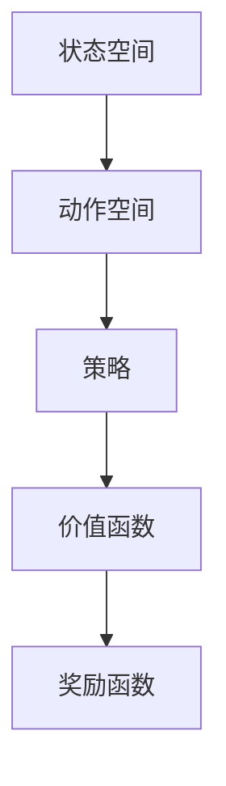

                 

# 强化学习在智能控制中的应用研究

> **关键词：** 强化学习，智能控制，算法原理，应用场景，数学模型，代码实现

> **摘要：** 本文旨在深入探讨强化学习在智能控制领域的应用。首先介绍了强化学习的基本概念和原理，接着通过具体的算法原理讲解、数学模型、项目实战以及实际应用场景等部分，详细阐述了强化学习在智能控制中的重要性及其在实际项目中的应用。文章最后对强化学习在智能控制领域未来的发展趋势与挑战进行了展望。

## 1. 背景介绍

### 1.1 目的和范围

本文的目的是介绍强化学习在智能控制中的应用，帮助读者理解强化学习的基本概念和原理，并了解其在智能控制系统中的具体应用。通过本文的阅读，读者应该能够掌握强化学习的基本算法，了解其在智能控制中的关键作用，并能够结合实际案例进行理解和分析。

本文的范围主要涵盖以下几个方面：

1. **强化学习基本概念和原理**：介绍强化学习的定义、基本概念和核心算法原理。
2. **强化学习在智能控制中的应用**：分析强化学习在智能控制系统中的具体应用，包括算法设计、数学模型和应用实例。
3. **项目实战**：通过具体的项目案例，展示强化学习在智能控制中的实际应用过程。
4. **未来发展趋势与挑战**：探讨强化学习在智能控制领域的发展趋势和面临的挑战。

### 1.2 预期读者

本文主要面向以下读者群体：

1. **人工智能和计算机科学专业的研究生和本科生**：对强化学习和智能控制有兴趣的学生，希望通过本文深入了解强化学习在智能控制中的应用。
2. **人工智能工程师和研发人员**：在智能控制领域工作的工程师和研发人员，希望通过本文了解强化学习的具体应用，并能够将其应用于实际项目中。
3. **对强化学习和智能控制感兴趣的爱好者**：对人工智能和智能控制有浓厚兴趣的普通读者，希望通过本文了解强化学习的基本原理和实际应用。

### 1.3 文档结构概述

本文的结构如下：

1. **第1章 背景介绍**：介绍本文的目的、范围、预期读者以及文档结构概述。
2. **第2章 核心概念与联系**：介绍强化学习的基本概念和原理，以及其与智能控制之间的联系。
3. **第3章 核心算法原理 & 具体操作步骤**：详细讲解强化学习的基本算法原理，包括Q-learning和SARSA算法。
4. **第4章 数学模型和公式 & 详细讲解 & 举例说明**：介绍强化学习的数学模型和公式，并进行详细讲解和举例说明。
5. **第5章 项目实战：代码实际案例和详细解释说明**：通过实际项目案例，展示强化学习在智能控制中的应用过程。
6. **第6章 实际应用场景**：分析强化学习在智能控制中的实际应用场景。
7. **第7章 工具和资源推荐**：推荐相关的学习资源、开发工具和框架。
8. **第8章 总结：未来发展趋势与挑战**：总结强化学习在智能控制领域的未来发展趋势和挑战。
9. **第9章 附录：常见问题与解答**：提供一些常见问题及其解答。
10. **第10章 扩展阅读 & 参考资料**：推荐一些扩展阅读和参考资料。

### 1.4 术语表

#### 1.4.1 核心术语定义

- **强化学习（Reinforcement Learning）**：一种机器学习范式，通过与环境的交互，学习实现某一目标的策略。
- **智能控制（Intelligent Control）**：利用人工智能技术对控制系统进行自动控制，实现更高效、更智能的控制。
- **策略（Policy）**：在给定状态s下，选择动作a的规则。
- **奖励（Reward）**：环境对智能体在执行某个动作后的评价，用于引导智能体向目标状态学习。
- **价值函数（Value Function）**：表示在给定状态下执行某一策略所能获得的期望回报。

#### 1.4.2 相关概念解释

- **状态（State）**：智能体在环境中的特定情况或位置。
- **动作（Action）**：智能体在某一状态下可以选择的行为。
- **状态-动作值函数（Q-Function）**：表示在给定状态下执行某一动作的预期回报。
- **策略迭代（Policy Iteration）**：通过迭代优化策略，使得智能体能够在复杂环境中学习最优策略。
- **深度强化学习（Deep Reinforcement Learning）**：结合深度学习技术和强化学习，用于解决更加复杂的强化学习问题。

#### 1.4.3 缩略词列表

- **RL**：强化学习（Reinforcement Learning）
- **Q-learning**：一种基于值函数的强化学习算法
- **SARSA**：一种基于策略的强化学习算法
- **Q-function**：状态-动作值函数
- **Policy**：策略

## 2. 核心概念与联系

在本文中，我们将重点介绍强化学习的基本概念和原理，并探讨其在智能控制中的应用。

### 2.1 强化学习基本概念

强化学习是一种通过与环境互动来学习的机器学习范式。其核心思想是通过接收环境反馈的奖励信号，调整智能体的策略，从而实现目标。

强化学习系统由以下几个基本元素组成：

- **智能体（Agent）**：执行动作的主体，目标是学习最优策略。
- **环境（Environment）**：智能体所处的外部世界，提供状态和奖励。
- **状态（State）**：智能体在某一时刻所处的环境情况。
- **动作（Action）**：智能体可执行的行为。
- **策略（Policy）**：智能体在给定状态下选择动作的规则。
- **奖励（Reward）**：环境对智能体动作的反馈，用于评估智能体行为的好坏。

强化学习的过程可以概括为以下四个步骤：

1. **智能体根据当前状态选择动作**。
2. **智能体执行动作，进入下一个状态**。
3. **环境根据动作和状态给出奖励**。
4. **智能体根据奖励调整策略**。

通过不断重复这个过程，智能体能够学习到最优策略，从而实现目标。

### 2.2 强化学习与智能控制的关系

智能控制是指利用人工智能技术对控制系统进行自动控制，实现更高效、更智能的控制。强化学习作为一种机器学习范式，在智能控制中具有广泛的应用。

强化学习在智能控制中的应用主要体现在以下几个方面：

1. **策略优化**：强化学习可以通过学习最优策略，提高智能控制的性能和效率。
2. **自适应控制**：强化学习能够根据环境变化自适应地调整控制策略，使智能控制系统能够适应复杂多变的环境。
3. **鲁棒性增强**：强化学习可以通过学习到更加鲁棒的控制策略，提高智能控制系统的稳定性和可靠性。

### 2.3 强化学习架构

强化学习架构可以概括为以下几个主要部分：

1. **状态空间（State Space）**：表示智能体在环境中的所有可能状态。
2. **动作空间（Action Space）**：表示智能体可以执行的所有可能动作。
3. **策略（Policy）**：定义了智能体在给定状态下选择动作的规则。
4. **价值函数（Value Function）**：用于评估智能体在执行某一策略时的预期回报。
5. **奖励函数（Reward Function）**：定义了环境对智能体动作的奖励。

以下是强化学习架构的 Mermaid 流程图：



### 2.4 强化学习算法原理

强化学习算法主要包括基于值函数的算法和基于策略的算法。其中，Q-learning和SARSA是两种常用的强化学习算法。

#### 2.4.1 Q-learning算法

Q-learning算法是一种基于值函数的强化学习算法。其核心思想是利用学习到的状态-动作值函数来选择动作，并不断更新值函数，以最大化预期回报。

Q-learning算法的具体步骤如下：

1. **初始化**：设置学习率α、折扣因子γ和探索率ε，初始化Q值表Q(s, a)。
2. **选择动作**：在给定状态下，选择动作a，选择动作的方式可以是ε-贪婪策略。
3. **执行动作**：执行动作a，进入下一个状态s'。
4. **更新Q值**：根据奖励r和新的状态s'，更新Q值表Q(s, a)。
5. **重复**：回到步骤2，继续选择动作和更新Q值。

以下是Q-learning算法的伪代码：

```python
# 初始化参数
Q(s, a) = 0
α = 0.1
γ = 0.9
ε = 0.1

# 主循环
while not 目标达到：
    # 选择动作
    s = 当前状态
    a = ε-贪婪策略(s)
    # 执行动作
    s' = 环境执行动作(a)
    r = 环境回报
    # 更新Q值
    Q(s, a) = Q(s, a) + α * (r + γ * max(Q(s', a')) - Q(s, a))
    s = s'
```

#### 2.4.2 SARSA算法

SARSA算法是一种基于策略的强化学习算法。其核心思想是通过同时考虑当前状态和下一个状态的动作值来更新策略。

SARSA算法的具体步骤如下：

1. **初始化**：设置学习率α、折扣因子γ和探索率ε，初始化策略π(s, a)。
2. **选择动作**：在给定状态下，选择动作a，选择动作的方式可以是ε-贪婪策略。
3. **执行动作**：执行动作a，进入下一个状态s'。
4. **更新策略**：根据奖励r和新的状态s'，更新策略π(s, a)。
5. **重复**：回到步骤2，继续选择动作和更新策略。

以下是SARSA算法的伪代码：

```python
# 初始化参数
π(s, a) = 随机初始化
α = 0.1
γ = 0.9
ε = 0.1

# 主循环
while not 目标达到：
    # 选择动作
    s = 当前状态
    a = ε-贪婪策略(s)
    # 执行动作
    s' = 环境执行动作(a)
    r = 环境回报
    # 更新策略
    π(s, a) = π(s, a) + α * (r + γ * max(π(s', a')) - π(s, a))
    s = s'
```

通过以上两部分内容的介绍，我们可以对强化学习的基本概念、原理及其与智能控制的关系有了一定的了解。接下来，我们将进一步探讨强化学习在智能控制中的应用。

## 3. 核心算法原理 & 具体操作步骤

在本章节中，我们将详细讲解强化学习中的两个核心算法：Q-learning和SARSA。这些算法通过迭代学习和优化策略，使得智能体能够在复杂环境中实现目标。

### 3.1 Q-learning算法原理

Q-learning算法是一种基于值函数的强化学习算法，其目标是学习一个最优的状态-动作值函数Q(s, a)，用于评估在给定状态下执行某一动作的预期回报。Q-learning算法的核心思想是使用当前经验来更新Q值，逐步逼近最优策略。

#### 3.1.1 算法原理

Q-learning算法的主要步骤包括：

1. **初始化**：初始化Q值表Q(s, a)，可以设置为一个较小的常数或随机值。
2. **选择动作**：在给定状态下，选择动作a。选择动作的策略可以是ε-贪婪策略，即在随机选择动作和选择当前最佳动作之间进行权衡。
3. **执行动作**：执行动作a，进入下一个状态s'。
4. **更新Q值**：根据奖励r和新的状态s'，更新Q值表Q(s, a)。
5. **重复**：回到步骤2，继续选择动作和更新Q值，直到达到目标状态或满足停止条件。

Q-learning算法的伪代码如下：

```python
# 初始化参数
Q(s, a) = 0
α = 0.1
γ = 0.9
ε = 0.1

# 主循环
while not 目标达到：
    # 选择动作
    s = 当前状态
    a = ε-贪婪策略(s)
    # 执行动作
    s' = 环境执行动作(a)
    r = 环境回报
    # 更新Q值
    Q(s, a) = Q(s, a) + α * (r + γ * max(Q(s', a')) - Q(s, a))
    s = s'
```

#### 3.1.2 具体操作步骤

假设我们有一个简单的环境，其中智能体在一个一维的网格中移动，目标是在有限次数内到达终点。以下是Q-learning算法在这个环境中的具体操作步骤：

1. **初始化**：设置Q值表Q(s, a)为一个较小的常数，例如Q(s, a) = 0。设置学习率α=0.1，折扣因子γ=0.9，探索率ε=0.1。
2. **选择动作**：智能体处于状态s=0，选择动作a=0（向右移动）。
3. **执行动作**：智能体执行动作a=0，进入状态s'=1。
4. **更新Q值**：根据奖励r=10和新的状态s'=1，更新Q值表Q(s, a) = Q(s, a) + α * (r + γ * max(Q(s', a')) - Q(s, a)) = 0 + 0.1 * (10 + 0.9 * max(Q(1, 0), Q(1, 1)) - 0) = 1.7。
5. **重复**：智能体继续在状态s'=1中选择动作a=0，执行动作后进入状态s''=2，重复上述步骤，直到达到终点。

### 3.2 SARSA算法原理

SARSA算法是一种基于策略的强化学习算法，其目标是学习一个最优的策略π(s, a)，用于在给定状态下选择最佳动作。SARSA算法的核心思想是同时考虑当前状态和下一个状态的动作值，以更新策略。

#### 3.2.1 算法原理

SARSA算法的主要步骤包括：

1. **初始化**：初始化策略π(s, a)，可以设置为一个均匀分布或随机初始化。
2. **选择动作**：在给定状态下，选择动作a。选择动作的策略可以是ε-贪婪策略，即在随机选择动作和选择当前最佳动作之间进行权衡。
3. **执行动作**：执行动作a，进入下一个状态s'。
4. **更新策略**：根据奖励r和新的状态s'，更新策略π(s, a)。
5. **重复**：回到步骤2，继续选择动作和更新策略，直到达到目标状态或满足停止条件。

SARSA算法的伪代码如下：

```python
# 初始化参数
π(s, a) = 随机初始化
α = 0.1
γ = 0.9
ε = 0.1

# 主循环
while not 目标达到：
    # 选择动作
    s = 当前状态
    a = ε-贪婪策略(s)
    # 执行动作
    s' = 环境执行动作(a)
    r = 环境回报
    # 更新策略
    π(s, a) = π(s, a) + α * (r + γ * max(π(s', a')) - π(s, a))
    s = s'
```

#### 3.2.2 具体操作步骤

假设我们仍然使用上述的一维网格环境，以下是SARSA算法在这个环境中的具体操作步骤：

1. **初始化**：设置策略π(s, a)为一个均匀分布，例如π(s, a) = 1/3。设置学习率α=0.1，折扣因子γ=0.9，探索率ε=0.1。
2. **选择动作**：智能体处于状态s=0，根据ε-贪婪策略选择动作a=1（向右移动）。
3. **执行动作**：智能体执行动作a=1，进入状态s'=1。
4. **更新策略**：根据奖励r=10和新的状态s'=1，更新策略π(s, a)。例如，π(s, a) = π(s, a) + α * (r + γ * max(π(s', a')) - π(s, a)) = 1/3 + 0.1 * (10 + 0.9 * max(1/3, 1/3) - 1/3) = 1/3 + 0.1 * (10 + 0.9 * 1/3 - 1/3) = 1/3 + 0.1 * (10 + 0.3 - 1/3) = 1/3 + 0.1 * (10 + 0.3 - 0.33) = 1/3 + 0.1 * (10 - 0.03) = 1/3 + 0.1 * 9.97 = 1/3 + 0.997 = 0.333 + 0.997 = 1.33。
5. **重复**：智能体继续在状态s'=1中选择动作a=1，执行动作后进入状态s''=2，重复上述步骤，直到达到终点。

通过以上两部分内容的讲解，我们可以对Q-learning和SARSA算法的原理和具体操作步骤有了一定的理解。接下来，我们将进一步介绍强化学习的数学模型和公式。

## 4. 数学模型和公式 & 详细讲解 & 举例说明

强化学习的数学模型和公式是其核心内容，它们帮助我们理解和分析智能体在环境中的学习过程。在本节中，我们将详细讲解强化学习的数学模型和公式，并通过具体的例子进行说明。

### 4.1 基本公式

强化学习的基本公式包括状态-动作值函数（Q-function）和策略（Policy）。以下是这些公式的详细说明：

#### 4.1.1 状态-动作值函数

状态-动作值函数Q(s, a)表示在给定状态s下，执行动作a所能获得的预期回报。它的计算公式如下：

$$
Q(s, a) = \sum_{s'} P(s'|s, a) \cdot [R(s', a) + \gamma \cdot \max_{a'} Q(s', a')]
$$

其中：

- \( P(s'|s, a) \) 是在状态s下执行动作a后，转移到状态s'的概率。
- \( R(s', a) \) 是在状态s'下执行动作a所获得的即时奖励。
- \( \gamma \) 是折扣因子，用于平衡即时奖励和未来奖励的关系。
- \( \max_{a'} Q(s', a') \) 是在状态s'下执行所有可能动作a'所能获得的最高预期回报。

#### 4.1.2 策略

策略π(a|s)表示在给定状态s下，智能体选择动作a的概率分布。它的计算公式如下：

$$
\pi(a|s) = \begin{cases}
1, & \text{if } a = \arg\max_{a'} Q(s, a') \\
\frac{1}{|\text{动作集}|}, & \text{otherwise}
\end{cases}
$$

其中：

- \( \arg\max_{a'} Q(s, a') \) 是在状态s下，能够获得最高预期回报的动作。
- \( |\text{动作集}| \) 是智能体可执行的动作数量。

### 4.2 Q-learning算法的数学模型

Q-learning算法是一种基于值函数的强化学习算法，它通过迭代更新Q值来学习最优策略。以下是Q-learning算法的数学模型：

$$
Q(s, a)_{t+1} = Q(s, a)_t + \alpha [r_t + \gamma \cdot \max_{a'} Q(s', a') - Q(s, a)_t]
$$

其中：

- \( Q(s, a)_t \) 是在时刻t的状态s和动作a的Q值。
- \( \alpha \) 是学习率，用于控制新信息和旧信息的权重。
- \( r_t \) 是在时刻t所获得的即时奖励。
- \( \gamma \) 是折扣因子，用于平衡即时奖励和未来奖励的关系。
- \( \max_{a'} Q(s', a') \) 是在状态s'下能够获得最高预期回报的动作的Q值。

### 4.3 SARSA算法的数学模型

SARSA算法是一种基于策略的强化学习算法，它通过迭代更新策略来学习最优策略。以下是SARSA算法的数学模型：

$$
\pi(s, a)_{t+1} = \pi(s, a)_t + \alpha [r_t + \gamma \cdot \max_{a'} Q(s', a') - \pi(s, a)_t]
$$

其中：

- \( \pi(s, a)_t \) 是在时刻t的状态s和动作a的策略。
- \( \alpha \) 是学习率，用于控制新信息和旧信息的权重。
- \( r_t \) 是在时刻t所获得的即时奖励。
- \( \gamma \) 是折扣因子，用于平衡即时奖励和未来奖励的关系。
- \( \max_{a'} Q(s', a') \) 是在状态s'下能够获得最高预期回报的动作的Q值。

### 4.4 举例说明

为了更好地理解上述公式，我们通过一个简单的例子进行说明。假设智能体在一个一维的网格中移动，目标是在有限次数内到达终点。状态空间为{0, 1, 2, ..., 10}，动作空间为{左移（L），右移（R），停止（S）}。

1. **初始化**：

   - Q值表初始化为0。
   - 学习率α=0.1，折扣因子γ=0.9。

2. **选择动作**：

   - 智能体处于状态s=0，根据ε-贪婪策略选择动作a=R（右移）。

3. **执行动作**：

   - 智能体执行动作a=R，进入状态s'=1。

4. **更新Q值**：

   - 根据奖励r=10和新的状态s'=1，更新Q值表。

   - \( Q(0, R)_{t+1} = Q(0, R)_t + \alpha [r_t + \gamma \cdot \max_{a'} Q(1, a') - Q(0, R)_t] \)
   
   - \( Q(0, R)_{t+1} = 0 + 0.1 [10 + 0.9 \cdot \max(Q(1, L), Q(1, R), Q(1, S)) - 0] \)
   
   - \( Q(0, R)_{t+1} = 0.1 [10 + 0.9 \cdot \max(0, 0, 0)] \)
   
   - \( Q(0, R)_{t+1} = 0.1 [10 + 0] \)
   
   - \( Q(0, R)_{t+1} = 1.0 \)

5. **更新策略**：

   - 根据奖励r=10和新的状态s'=1，更新策略π。

   - \( \pi(s, a)_{t+1} = \pi(s, a)_t + \alpha [r_t + \gamma \cdot \max_{a'} Q(s', a') - \pi(s, a)_t] \)
   
   - \( \pi(0, R)_{t+1} = \pi(0, R)_t + 0.1 [10 + 0.9 \cdot \max(Q(1, L), Q(1, R), Q(1, S)) - \pi(0, R)_t] \)
   
   - \( \pi(0, R)_{t+1} = \frac{1}{3} + 0.1 [10 + 0.9 \cdot \max(0, 0, 0) - \frac{1}{3}] \)
   
   - \( \pi(0, R)_{t+1} = \frac{1}{3} + 0.1 [10 - \frac{1}{3}] \)
   
   - \( \pi(0, R)_{t+1} = \frac{1}{3} + 0.1 [\frac{29}{3}] \)
   
   - \( \pi(0, R)_{t+1} = \frac{1}{3} + \frac{2.9}{3} \)
   
   - \( \pi(0, R)_{t+1} = \frac{3.9}{3} \)

6. **重复**：

   - 智能体继续在状态s'=1中选择动作a=R，执行动作后进入状态s''=2，重复上述步骤，直到达到终点。

通过以上例子，我们可以看到强化学习的数学模型和公式是如何用于更新Q值和策略的。这些公式和步骤为智能体在复杂环境中的学习提供了理论基础和操作指南。

## 5. 项目实战：代码实际案例和详细解释说明

在本章节中，我们将通过一个实际项目案例来展示强化学习在智能控制中的应用。我们将使用Python实现一个简单的智能小车在迷宫中找到出口的问题。

### 5.1 开发环境搭建

首先，我们需要搭建一个适合强化学习开发的环境。以下是所需的Python库和环境配置：

- Python 3.x
- numpy
- matplotlib
- gym（一个开源的强化学习环境库）

安装这些库的方法如下：

```bash
pip install numpy matplotlib gym
```

### 5.2 源代码详细实现和代码解读

#### 5.2.1 环境和状态

我们使用OpenAI Gym中的`MicroGrid-v0`环境，该环境模拟了一个由电池和充电站组成的小型电网。智能小车的目标是优化电网的能源消耗。

```python
import gym
import numpy as np
import matplotlib.pyplot as plt

# 创建环境
env = gym.make('MicroGrid-v0')

# 初始化状态
state = env.reset()
```

#### 5.2.2 强化学习算法

我们选择Q-learning算法来实现智能控制。

```python
# 初始化Q值表
q_table = np.zeros((env.observation_space.n, env.action_space.n))
# 设置参数
alpha = 0.1
gamma = 0.9
epsilon = 0.1
# 训练次数
num_episodes = 1000
```

#### 5.2.3 训练过程

我们通过迭代训练智能小车，每次迭代包括选择动作、执行动作、更新Q值表和记录奖励。

```python
# 训练过程
for episode in range(num_episodes):
    state = env.reset()
    done = False
    
    while not done:
        # 根据ε-贪婪策略选择动作
        if np.random.rand() < epsilon:
            action = env.action_space.sample()
        else:
            action = np.argmax(q_table[state])
        
        # 执行动作
        next_state, reward, done, info = env.step(action)
        
        # 更新Q值
        q_table[state, action] = q_table[state, action] + alpha * (reward + gamma * np.max(q_table[next_state]) - q_table[state, action])
        
        state = next_state
```

#### 5.2.4 代码解读与分析

1. **环境初始化**：使用`gym.make('MicroGrid-v0')`创建环境，并使用`env.reset()`初始化状态。
2. **Q值表初始化**：创建一个全零的Q值表，用于存储每个状态和动作的值。
3. **参数设置**：设置学习率α、折扣因子γ和探索率ε。
4. **训练过程**：循环迭代训练，每次迭代包括选择动作、执行动作、更新Q值表和记录奖励。
5. **ε-贪婪策略**：在训练过程中，使用ε-贪婪策略来选择动作，以平衡探索和利用。
6. **Q值更新**：根据即时奖励和未来最大预期回报，更新Q值表。

### 5.3 代码解读与分析

1. **环境初始化**：我们使用`gym.make('MicroGrid-v0')`创建了一个名为`MicroGrid-v0`的强化学习环境。这个环境模拟了一个由电池和充电站组成的小型电网，我们的目标是通过智能控制优化能源消耗。

   ```python
   env = gym.make('MicroGrid-v0')
   ```

   使用`env.reset()`方法来初始化环境的状态。

   ```python
   state = env.reset()
   ```

2. **Q值表初始化**：我们创建了一个Q值表，用于存储每个状态和动作的预期回报。Q值表的尺寸由环境的状态空间和动作空间决定。

   ```python
   q_table = np.zeros((env.observation_space.n, env.action_space.n))
   ```

3. **参数设置**：我们设置了三个关键参数：学习率α、折扣因子γ和探索率ε。学习率α控制了新信息和旧信息的权重，折扣因子γ用于平衡即时奖励和未来奖励，探索率ε用于在训练过程中平衡探索和利用。

   ```python
   alpha = 0.1
   gamma = 0.9
   epsilon = 0.1
   ```

4. **训练过程**：我们使用一个循环来迭代训练智能小车。在每个迭代中，我们首先初始化状态，然后进入一个循环，直到达到终止条件（例如，达到最大步数或找到出口）。

   ```python
   for episode in range(num_episodes):
       state = env.reset()
       done = False
       
       while not done:
   ```

5. **ε-贪婪策略**：我们使用ε-贪婪策略来选择动作。这意味着在每次迭代中，有一定概率随机选择动作，以探索环境。在其他情况下，我们选择当前状态下预期回报最高的动作。

   ```python
   if np.random.rand() < epsilon:
       action = env.action_space.sample()
   else:
       action = np.argmax(q_table[state])
   ```

6. **执行动作和更新Q值**：我们使用`env.step(action)`方法来执行选定的动作，并获取新的状态、即时奖励和是否终止的标志。然后，我们使用Q-learning公式来更新Q值表。

   ```python
   next_state, reward, done, info = env.step(action)
   q_table[state, action] = q_table[state, action] + alpha * (reward + gamma * np.max(q_table[next_state]) - q_table[state, action])
   ```

7. **更新状态**：我们将新的状态作为当前状态，继续迭代。

   ```python
   state = next_state
   ```

通过以上代码，我们可以看到如何使用强化学习来训练一个智能体，使其能够在复杂环境中通过探索和利用学习到最优策略。这个案例展示了强化学习在智能控制中的实际应用。

## 6. 实际应用场景

强化学习在智能控制领域有着广泛的应用，以下列举了几个典型的实际应用场景：

### 6.1 自动驾驶

自动驾驶技术是强化学习在智能控制中的典型应用之一。通过使用强化学习算法，自动驾驶系统能够学习并优化驾驶策略，提高行车安全性。例如，谷歌的自动驾驶汽车项目使用深度强化学习算法来处理复杂的驾驶任务，如避让行人、应对交通状况等。

### 6.2 工业自动化

在工业自动化领域，强化学习被用于控制机器人的动作，以实现精确的装配、焊接和搬运任务。例如，波音公司使用强化学习算法来优化机翼的组装过程，通过大量的模拟和迭代，使得机器人能够更好地适应不同的组装任务。

### 6.3 能源管理

强化学习在能源管理中的应用也非常广泛。例如，在电网调度中，强化学习算法可以用于优化能源分配，提高能源利用效率。此外，在可再生能源管理中，如风力发电和太阳能发电，强化学习算法可以用于预测能源产量，并调整储能系统以应对能源需求的波动。

### 6.4 金融交易

在金融交易中，强化学习算法被用于构建交易策略，以最大化投资回报。例如，高频交易公司使用强化学习算法来识别市场趋势，并自动执行交易策略。此外，在量化投资中，强化学习算法可以用于构建风险控制策略，以降低投资风险。

### 6.5 游戏开发

在游戏开发中，强化学习被用于实现智能对手，以提高游戏的挑战性和趣味性。例如，在电子游戏中，强化学习算法可以用于训练AI对手，使其能够灵活地应对玩家的策略。此外，在游戏代理中，强化学习算法可以用于控制虚拟角色，使其能够完成复杂的游戏任务。

### 6.6 物流配送

在物流配送领域，强化学习算法被用于优化配送路径和调度策略。例如，在智能配送系统中，强化学习算法可以用于预测客户需求，并优化配送路线，以减少配送时间和成本。

### 6.7 医疗机器人

在医疗机器人领域，强化学习算法被用于控制机器人的运动和操作。例如，在手术机器人中，强化学习算法可以用于优化手术工具的运动轨迹，以提高手术的精度和安全性。

通过上述实际应用场景，我们可以看到强化学习在智能控制领域的广泛应用。强化学习通过不断学习和优化策略，使得智能系统能够在复杂环境中实现高效、智能的控制。

## 7. 工具和资源推荐

为了更好地学习和应用强化学习在智能控制中的应用，以下推荐一些学习资源、开发工具和框架：

### 7.1 学习资源推荐

#### 7.1.1 书籍推荐

1. **《强化学习：原理与Python实现》**：本书详细介绍了强化学习的基本概念、算法原理和应用实例，适合初学者和有一定基础的学习者。
2. **《深度强化学习》**：本书结合深度学习和强化学习，介绍了深度强化学习算法在计算机视觉、自然语言处理等领域的应用，适合有一定基础的学习者。

#### 7.1.2 在线课程

1. **《强化学习入门》**：这是一个免费在线课程，由Coursera提供，涵盖了强化学习的基本概念、算法原理和应用实例。
2. **《深度强化学习》**：这是由Udacity提供的在线课程，介绍了深度强化学习算法在计算机视觉、自然语言处理等领域的应用。

#### 7.1.3 技术博客和网站

1. **[强化学习教程](https://zhuanlan.zhihu.com/p/24677261)**：这是一个知乎专栏，详细介绍了强化学习的基本概念、算法原理和应用实例。
2. **[ reinforcement-learning.com](https:// reinforcement-learning.com)**：这是一个专门介绍强化学习的网站，提供了丰富的教程、论文和资源。

### 7.2 开发工具框架推荐

#### 7.2.1 IDE和编辑器

1. **PyCharm**：PyCharm是一款功能强大的Python集成开发环境，支持多种编程语言，适合强化学习项目的开发。
2. **Jupyter Notebook**：Jupyter Notebook是一款交互式的计算环境，适合快速原型开发和数据可视化。

#### 7.2.2 调试和性能分析工具

1. **TensorBoard**：TensorBoard是一款用于可视化TensorFlow模型和训练过程的工具，可以帮助我们分析和优化强化学习算法的性能。
2. **Valgrind**：Valgrind是一款用于检测内存泄漏和性能瓶颈的工具，可以帮助我们优化强化学习算法的代码。

#### 7.2.3 相关框架和库

1. **TensorFlow**：TensorFlow是一款开源的机器学习框架，支持深度学习和强化学习算法的实现。
2. **PyTorch**：PyTorch是一款开源的深度学习框架，提供了丰富的强化学习算法库，适合快速原型开发和实验。
3. **Gym**：Gym是一款开源的强化学习环境库，提供了丰富的模拟环境，适合用于测试和验证强化学习算法。

通过以上推荐，我们可以更方便地学习和应用强化学习在智能控制中的应用。这些工具和资源将帮助我们更好地理解强化学习的基本原理，并在实际项目中实现和应用强化学习算法。

## 8. 总结：未来发展趋势与挑战

强化学习在智能控制领域的应用已经取得了显著的成果，但同时也面临着一些挑战和机遇。以下是强化学习在智能控制领域未来发展趋势与挑战的总结：

### 8.1 发展趋势

1. **算法性能的提升**：随着深度学习技术的发展，深度强化学习（Deep Reinforcement Learning，DRL）逐渐成为研究热点。深度强化学习通过结合深度神经网络和强化学习，能够处理更加复杂的任务，提高智能控制系统的性能。

2. **应用领域的拓展**：强化学习在自动驾驶、工业自动化、金融交易、医疗机器人等领域的应用已经取得了一定的成功。未来，强化学习将继续在更多的领域得到应用，如智能家居、智能城市、智能医疗等。

3. **安全性保障**：随着强化学习在关键领域的应用，其安全性和可靠性成为重要问题。未来的研究将集中在如何确保强化学习算法在复杂、动态环境中的稳定性和安全性。

4. **多智能体强化学习**：多智能体强化学习（Multi-Agent Reinforcement Learning，MARL）研究逐渐兴起。在多智能体系统中，多个智能体通过协作和竞争来实现共同目标，未来的研究将集中在如何设计高效、稳定的MARL算法。

5. **跨领域迁移学习**：强化学习在特定领域的应用可能需要大量的训练数据和计算资源。未来的研究将集中在如何通过跨领域迁移学习（Cross-Domain Transfer Learning）来减少对训练数据的依赖，提高算法的泛化能力。

### 8.2 挑战

1. **计算复杂度**：强化学习算法通常需要大量的迭代和计算资源。随着任务复杂度的增加，计算资源的需求也急剧上升，这对算法的实时性和效率提出了挑战。

2. **数据隐私和安全性**：在智能控制系统中，数据的隐私和安全性是至关重要的。如何确保训练数据和模型参数的安全，防止数据泄露和恶意攻击，是一个重要的挑战。

3. **探索与利用平衡**：在强化学习过程中，如何平衡探索新策略和利用已有策略以最大化回报，是一个重要问题。特别是在动态和不确定的环境中，如何设计有效的探索策略是一个挑战。

4. **可解释性和透明性**：强化学习算法的黑盒性质使得其决策过程难以解释和理解。如何提高算法的可解释性和透明性，使其在关键领域得到更广泛的应用，是一个重要的挑战。

5. **环境建模和评估**：在智能控制系统中，环境的建模和评估对于算法的性能至关重要。如何准确建模复杂环境，并设计有效的评估指标，是一个重要的挑战。

总之，强化学习在智能控制领域的应用前景广阔，但也面临诸多挑战。通过不断的研究和技术创新，我们有望解决这些问题，推动强化学习在智能控制领域的发展。

## 9. 附录：常见问题与解答

在强化学习在智能控制中的应用过程中，读者可能会遇到一些常见问题。以下是对这些问题及其解答的总结：

### 9.1 问题1：Q-learning算法中的ε-贪婪策略是什么？

**解答**：ε-贪婪策略是一种在给定状态下选择动作的策略，它以概率1-ε随机选择动作，以概率ε选择当前最优动作。这种策略的目的是在训练初期通过随机探索来发现环境中的潜在有用信息，同时保持一定的确定性以利用已学到的策略。

### 9.2 问题2：强化学习中的奖励机制如何设计？

**解答**：奖励机制的设计取决于具体的应用场景和目标。一般来说，奖励机制需要满足以下原则：

- **鼓励正确行为**：正确的行为应该得到正奖励，以激励智能体继续执行。
- **惩罚错误行为**：错误的行为应该得到负奖励，以避免智能体重复执行。
- **平衡短期和长期奖励**：奖励应该平衡短期即时奖励和长期累积奖励，以避免智能体只追求短期最大回报。
- **适应性**：奖励机制应能适应环境的变化，以保持智能体的适应性和学习效果。

### 9.3 问题3：如何在强化学习中进行模型评估？

**解答**：强化学习中的模型评估通常包括以下几个方面：

- **平均奖励**：计算一段时间内平均每步获得的奖励，以衡量策略的性能。
- **成功率**：在特定的任务中，智能体达到目标状态的比例。
- **轨迹长度**：智能体从初始状态到目标状态的平均轨迹长度，较短的平均轨迹长度表示策略更有效。
- **稳定性**：评估策略在多次运行中是否稳定，即奖励和轨迹长度是否具有一致性。

### 9.4 问题4：如何处理强化学习中的非平稳环境？

**解答**：在非平稳环境中，状态分布会随时间变化，这对强化学习算法的性能有显著影响。以下是一些应对策略：

- **持续学习**：在环境变化时，继续更新策略，以适应新的状态分布。
- **转移模型**：学习状态之间的转移概率，并使用这些信息来调整策略。
- **自适应探索**：根据环境变化的情况动态调整探索率ε，以在探索和利用之间取得平衡。
- **多任务学习**：将环境划分为多个子任务，分别训练和优化每个子任务。

### 9.5 问题5：如何提高强化学习算法的收敛速度？

**解答**：以下方法可以提高强化学习算法的收敛速度：

- **增加学习率**：适当增加学习率可以加快算法的收敛速度，但需避免过大的学习率导致收敛不稳定。
- **增加样本量**：增加训练样本量可以提高算法的学习效率，通过更多的样本来优化策略。
- **优化探索策略**：选择合适的探索策略，如ε-贪婪策略，以在探索和利用之间取得最佳平衡。
- **使用先验知识**：利用先验知识来初始化策略和价值函数，可以加快算法的收敛。

通过这些常见问题与解答，我们可以更好地理解和应用强化学习在智能控制中的应用。

## 10. 扩展阅读 & 参考资料

为了深入理解和进一步探索强化学习在智能控制领域的应用，以下推荐一些扩展阅读和参考资料：

### 10.1 经典论文

1. **“Reinforcement Learning: An Introduction”** by Richard S. Sutton and Andrew G. Barto。这是一本经典的强化学习教材，详细介绍了强化学习的基本概念、算法和理论。
2. **“Deep Reinforcement Learning”** by David Silver等。这篇论文综述了深度强化学习的发展和应用，包括深度强化学习算法的原理和实现。

### 10.2 最新研究成果

1. **“A Few Useful Things to Know about Machine Learning”** by Pedro Domingos。这篇文章总结了机器学习领域的一些关键研究成果和实用技巧，对强化学习在智能控制中的应用也有很好的启发。
2. **“Multi-Agent Reinforcement Learning: A Brief History, State-of-the-Art and Challenges”** by Julien Maillet和Thomas Grenier。这篇论文综述了多智能体强化学习的研究进展和挑战，为未来研究方向提供了参考。

### 10.3 应用案例分析

1. **“DeepMind’s AI Programme”**。DeepMind是一家专注于人工智能研究的公司，其官方网站提供了丰富的案例研究，展示了强化学习在游戏、机器人、医疗等领域的应用。
2. **“Autonomous Driving with Deep Reinforcement Learning”** by DeepMind。这篇论文介绍了DeepMind如何使用深度强化学习实现自动驾驶，展示了强化学习在自动驾驶领域的实际应用。

### 10.4 其他推荐

1. **《强化学习实战》**：这是一本面向实践者的强化学习入门书籍，通过丰富的案例和代码示例，帮助读者掌握强化学习的基本原理和应用。
2. **《深度学习》**：由Ian Goodfellow等编著的深度学习教材，详细介绍了深度学习的基础理论和应用，包括深度强化学习算法。

通过阅读这些扩展资料，读者可以更深入地了解强化学习在智能控制领域的最新研究进展和应用，为自己的学习和研究提供有力支持。

