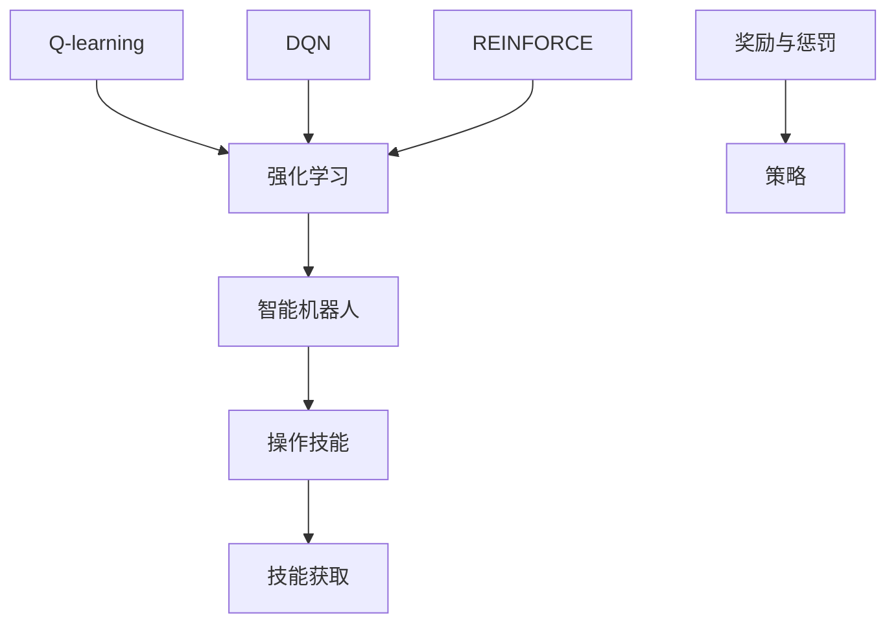
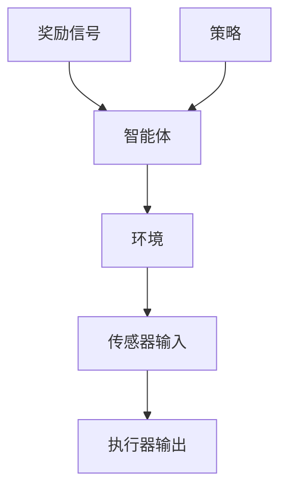
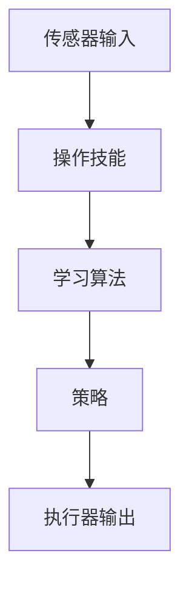
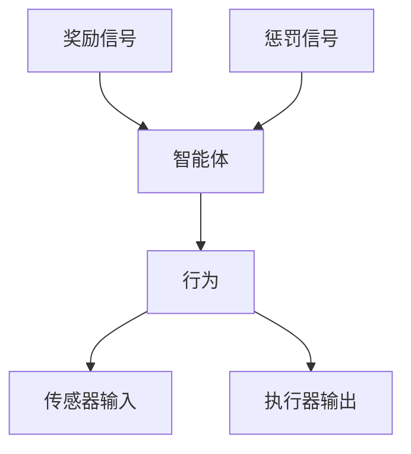
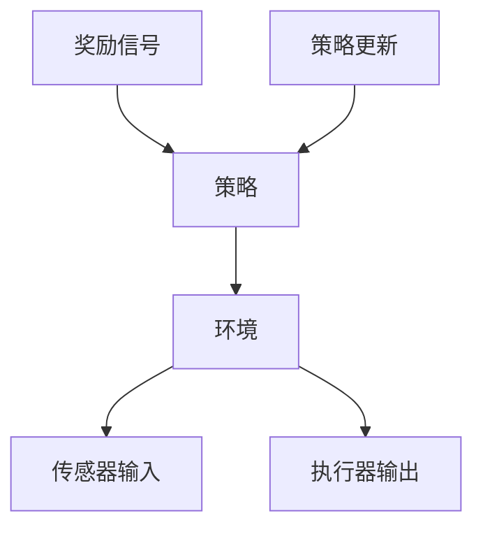

                 

# 强化学习在智能机器人操作技能获取中的应用

> **关键词：** 强化学习、智能机器人、操作技能、技能获取、深度强化学习、机器人控制

> **摘要：** 本文深入探讨了强化学习在智能机器人操作技能获取中的应用，从理论基础到实际操作，系统性地阐述了强化学习算法在机器人技能训练中的实现方法和优化策略。通过分析强化学习在机器人领域的发展现状和挑战，本文旨在为相关研究者和开发者提供有价值的参考。

## 1. 背景介绍

### 1.1 目的和范围

本文旨在介绍强化学习在智能机器人操作技能获取中的应用，探讨其在机器人控制领域的重要性。具体范围包括：

- 强化学习的基本概念和原理。
- 强化学习算法在机器人操作技能获取中的应用。
- 强化学习算法在机器人控制中的挑战和解决方案。

### 1.2 预期读者

本文适合以下读者：

- 对强化学习感兴趣的技术爱好者。
- 智能机器人领域的从业者。
- 对机器人控制算法有深入了解的研究人员。

### 1.3 文档结构概述

本文分为以下几个部分：

- 第1部分：背景介绍，包括目的和范围、预期读者和文档结构概述。
- 第2部分：核心概念与联系，介绍强化学习的基本概念和原理。
- 第3部分：核心算法原理 & 具体操作步骤，详细阐述强化学习算法在机器人操作技能获取中的应用。
- 第4部分：数学模型和公式 & 详细讲解 & 举例说明，解释强化学习中的关键数学模型。
- 第5部分：项目实战：代码实际案例和详细解释说明，展示强化学习算法在实际项目中的应用。
- 第6部分：实际应用场景，分析强化学习在机器人领域的应用。
- 第7部分：工具和资源推荐，介绍相关的学习资源、开发工具和论文著作。
- 第8部分：总结：未来发展趋势与挑战，总结强化学习在机器人操作技能获取中的应用前景。
- 第9部分：附录：常见问题与解答，回答读者可能遇到的问题。
- 第10部分：扩展阅读 & 参考资料，提供进一步学习的资源。

### 1.4 术语表

#### 1.4.1 核心术语定义

- **强化学习**：一种机器学习方法，通过奖励和惩罚来指导智能体学习优化行为策略。
- **智能机器人**：具有感知、决策和执行能力的机器人，能够在特定环境中执行复杂任务。
- **操作技能**：机器人完成特定任务所需的技能，如移动、抓取、导航等。
- **技能获取**：通过学习算法使机器人掌握操作技能的过程。

#### 1.4.2 相关概念解释

- **奖励**：强化学习中用来指导智能体行为的正反馈信号。
- **惩罚**：强化学习中用来指导智能体避免不良行为的负反馈信号。
- **策略**：智能体在特定环境下选择行为的方案。

#### 1.4.3 缩略词列表

- **Q-learning**：一种基于值函数的强化学习算法。
- **DQN**：深度Q网络，一种结合深度学习和强化学习的算法。
- **REINFORCE**：一种基于策略的强化学习算法。

## 2. 核心概念与联系

在探讨强化学习在智能机器人操作技能获取中的应用之前，我们需要理解几个核心概念和它们之间的关系。以下是一个简单的Mermaid流程图，展示了这些概念：



### 2.1 强化学习与智能机器人的联系

强化学习是一种通过与环境交互来学习最优行为的机器学习方法。智能机器人作为强化学习的一个典型应用场景，通过与环境的互动来获取操作技能，如图2.1所示。



图2.1 智能机器人与环境的互动

### 2.2 操作技能与技能获取

操作技能是智能机器人执行任务所需的能力，如移动、抓取、导航等。技能获取是通过学习算法使机器人掌握这些技能的过程，如图2.2所示。



图2.2 操作技能与技能获取

### 2.3 奖励与惩罚

奖励和惩罚是强化学习中的关键元素，用于指导智能体的行为。奖励表示智能体行为的正向反馈，而惩罚表示不良行为的负向反馈，如图2.3所示。



图2.3 奖励与惩罚

### 2.4 策略

策略是智能体在特定环境下选择行为的方案。在强化学习中，策略可以通过学习算法不断优化，以最大化长期奖励，如图2.4所示。



图2.4 策略

### 2.5 强化学习算法

强化学习算法包括Q-learning、DQN和REINFORCE等。这些算法通过不同的方式实现智能体的策略优化，如图2.5所示。

```mermaid
graph TD
    A[Q-learning] --> B[智能体]
    B --> C[环境]
    D[深度Q网络 (DQN)] --> B
    E[REINFORCE] --> B
    B --> F[策略更新]
```

图2.5 强化学习算法

## 3. 核心算法原理 & 具体操作步骤

在这一部分，我们将详细探讨强化学习在智能机器人操作技能获取中的核心算法原理，并使用伪代码阐述具体操作步骤。

### 3.1 Q-learning算法

Q-learning是一种基于值函数的强化学习算法，其核心思想是通过最大化预期的未来奖励来选择行为。

```pseudo
初始化 Q(s, a) 为随机值
for 所有 episode:
    初始化状态 s
    while s 不是终止状态:
        选择动作 a 根据 ε-贪心策略
        执行动作 a，观察奖励 r 和状态 s'
        更新 Q(s, a) = Q(s, a) + α [r + γ max Q(s', a') - Q(s, a)]
        更新状态 s 为 s'
```

### 3.2 DQN算法

DQN（深度Q网络）是一种结合深度学习和强化学习的算法，使用深度神经网络来估计Q值。

```pseudo
初始化 DNN 模型参数
创建经验回放记忆池
for 所有 episode:
    初始化状态 s
    while s 不是终止状态:
        选择动作 a 根据 ε-贪心策略
        执行动作 a，观察奖励 r 和状态 s'
        将 (s, a, r, s') 存入经验回放记忆池
        从经验回放记忆池中随机抽取一批样本
        训练 DNN 模型，最小化损失函数
        更新状态 s 为 s'
```

### 3.3 REINFORCE算法

REINFORCE是一种基于策略的强化学习算法，通过梯度上升方法来优化策略。

```pseudo
初始化策略参数
for 所有 episode:
    初始化状态 s
    while s 不是终止状态:
        执行策略 π(a|s)，观察动作 a 和状态 s'
        计算回报 R = ∑ γ^t_r(t)
        更新策略参数：π' = π + α ∇π[log π(a|s)]R
        更新状态 s 为 s'
```

### 3.4 具体操作步骤

在实际操作中，我们需要按照以下步骤进行：

1. **初始化参数**：设置学习率 α、折扣因子 γ、探索率 ε等。
2. **选择算法**：根据具体应用场景选择合适的强化学习算法。
3. **训练模型**：使用初始化参数训练模型，通过与环境交互学习最优策略。
4. **策略优化**：根据学习到的策略指导智能体的行为，并不断优化策略参数。
5. **评估性能**：在测试环境中评估智能体的性能，根据评估结果调整模型参数。

## 4. 数学模型和公式 & 详细讲解 & 举例说明

在强化学习中，数学模型和公式起着至关重要的作用。以下是对几个关键数学模型和公式的详细讲解，并通过具体例子进行说明。

### 4.1 值函数

值函数（Value Function）是强化学习中的一个核心概念，用于表示在给定状态下执行某个动作的期望回报。值函数分为状态值函数（State-Value Function）和动作值函数（Action-Value Function）。

#### 4.1.1 状态值函数

状态值函数 V(s) 表示在状态 s 下执行最优策略的期望回报。其数学公式为：

$$
V(s) = \sum_{a} \pi(a|s) \sum_{s'} P(s'|s, a) \sum_{r} r \cdot \gamma^{t}
$$

其中，π(a|s) 是在状态 s 下选择动作 a 的概率，P(s'|s, a) 是执行动作 a 后转移至状态 s' 的概率，r 是奖励，γ 是折扣因子。

#### 4.1.2 动作值函数

动作值函数 Q(s, a) 表示在状态 s 下执行动作 a 的期望回报。其数学公式为：

$$
Q(s, a) = \sum_{s'} P(s'|s, a) \sum_{r} r \cdot \gamma^{t}
$$

其中，t 是从状态 s 执行动作 a 到状态 s' 的步骤数。

### 4.2 策略

策略（Policy）是智能体在特定环境下选择行为的方案。强化学习中的策略可以分为确定性策略和随机性策略。

#### 4.2.1 确定性策略

确定性策略 π(d|s) 表示在状态 s 下选择动作 a 的概率为1，即智能体在状态 s 下总是执行最优动作。其数学公式为：

$$
\pi(a|s) = 
\begin{cases}
1 & \text{if } a = \arg\max_a Q(s, a) \\
0 & \text{otherwise}
\end{cases}
$$

#### 4.2.2 随机性策略

随机性策略 π(r|s) 表示在状态 s 下选择动作 a 的概率不为1，即智能体在状态 s 下根据概率分布选择动作。其数学公式为：

$$
\pi(a|s) = \frac{e^{\alpha Q(s, a)}}{\sum_{a'} e^{\alpha Q(s, a')}}
$$

其中，α 是温度参数，控制策略的随机性。

### 4.3 梯度上升法

梯度上升法是一种用于优化策略参数的方法。其核心思想是通过计算策略参数的梯度来更新参数，以最大化预期回报。

#### 4.3.1 梯度上升公式

梯度上升法的更新公式为：

$$
\theta_{t+1} = \theta_{t} + \alpha \nabla_{\theta} J(\theta)
$$

其中，θ是策略参数，α是学习率，J(θ)是策略损失函数。

#### 4.3.2 损失函数

损失函数用于衡量策略与最优策略之间的差距。在强化学习中，常用的损失函数是交叉熵损失：

$$
J(\theta) = -\sum_{s, a} \pi(a|s; \theta) \log \pi(a|s; \theta)
$$

### 4.4 举例说明

#### 4.4.1 Q-learning算法

假设一个智能体在离散状态空间 {0, 1, 2, 3} 中执行动作，目标是在状态0到达状态3。奖励设置为从状态0到状态3的步数减1。折扣因子γ为0.9。

- **初始化**：Q(s, a) 设为0。
- **选择动作**：使用 ε-贪心策略选择动作。
- **更新 Q 值**：根据 Q-learning 算法更新 Q(s, a)。

示例：

| 状态s | 动作a | Q(s, a) | 奖励r |
|-------|-------|---------|-------|
| 0     | 0     | 0       | -1    |
| 0     | 1     | 0.2     | 1     |
| 1     | 0     | 0.4     | -1    |
| 1     | 1     | 0.6     | 1     |
| 2     | 0     | 0.8     | -1    |
| 2     | 1     | 1.0     | 1     |
| 3     | 0     | 1.2     | -1    |
| 3     | 1     | 1.4     | 1     |

#### 4.4.2 DQN算法

假设一个智能体在一个连续的状态空间中执行动作，使用深度神经网络来估计 Q 值。

- **初始化**：DNN 模型参数、经验回放记忆池。
- **选择动作**：使用 ε-贪心策略选择动作。
- **更新 DNN 模型**：根据经验回放记忆池中的样本训练 DNN 模型。

示例：

| 状态s | 动作a | Q(s, a) | 奖励r |
|-------|-------|---------|-------|
| 2.0   | -0.5  | 0.3     | 0.5   |
| 1.5   | 0.5   | 0.4     | 1.0   |
| 1.0   | -0.5  | 0.5     | -0.5  |
| 0.5   | 0.5   | 0.6     | 1.5   |
| 0.0   | -0.5  | 0.7     | -1.0  |

## 5. 项目实战：代码实际案例和详细解释说明

在本节中，我们将通过一个简单的案例来展示如何使用强化学习算法训练一个智能机器人执行简单的操作任务，并对代码进行详细解释和分析。

### 5.1 开发环境搭建

为了运行以下案例，你需要安装以下软件和库：

- Python 3.x
- TensorFlow 2.x
- gym（一个经典的机器人模拟环境库）

安装方法：

```bash
pip install python
pip install tensorflow
pip install gym
```

### 5.2 源代码详细实现和代码解读

以下是案例的源代码实现：

```python
import gym
import numpy as np
import tensorflow as tf

# 创建环境
env = gym.make("CartPole-v0")

# 定义 DQN 模型
class DQN(tf.keras.Model):
    def __init__(self, state_dim, action_dim):
        super(DQN, self).__init__()
        self.fc = tf.keras.layers.Dense(action_dim, activation='linear')

    def call(self, x):
        return self.fc(x)

# 初始化 DQN 模型
state_dim = env.observation_space.shape[0]
action_dim = env.action_space.n
dqn = DQN(state_dim, action_dim)

# 定义训练过程
optimizer = tf.keras.optimizers.Adam(learning_rate=0.001)
loss_fn = tf.keras.losses.MeanSquaredError()

@tf.function
def train_step(batch_state, batch_action, batch_reward, batch_next_state, batch_done):
    with tf.GradientTape() as tape:
        q_values = dqn(batch_state)
        selected_actions = tf.one_hot(batch_action, action_dim)
        q_values = tf.reduce_sum(q_values * selected_actions, axis=1)
        next_state_values = dqn(batch_next_state)
        next_state_values = tf.reduce_max(next_state_values, axis=1)
        target_values = batch_reward + (1 - batch_done) * gamma * next_state_values
        loss = loss_fn(q_values, target_values)
    gradients = tape.gradient(loss, dqn.trainable_variables)
    optimizer.apply_gradients(zip(gradients, dqn.trainable_variables))
    return loss

# 训练模型
num_episodes = 1000
gamma = 0.99
epsilon = 1.0
epsilon_min = 0.01
epsilon_decay = 0.995
batch_size = 32

for episode in range(num_episodes):
    state = env.reset()
    done = False
    total_reward = 0
    while not done:
        if np.random.rand() < epsilon:
            action = env.action_space.sample()
        else:
            action = np.argmax(dqn(tf.convert_to_tensor(state, dtype=tf.float32)))
        next_state, reward, done, _ = env.step(action)
        total_reward += reward
        train_step(tf.convert_to_tensor(state, dtype=tf.float32), action, reward, tf.convert_to_tensor(next_state, dtype=tf.float32), done)
        state = next_state
    epsilon = max(epsilon_min, epsilon * epsilon_decay)
    print(f"Episode {episode}: Total Reward = {total_reward}")

# 评估模型
state = env.reset()
done = False
while not done:
    action = np.argmax(dqn(tf.convert_to_tensor(state, dtype=tf.float32)))
    state, reward, done, _ = env.step(action)
    env.render()
```

### 5.3 代码解读与分析

以上代码展示了如何使用 DQN 算法训练一个智能机器人执行 CartPole-v0 任务。以下是代码的详细解读和分析：

- **环境创建**：使用 gym 库创建 CartPole-v0 环境模拟机器人的操作任务。

- **DQN 模型定义**：定义一个简单的 DQN 模型，使用全连接层来估计 Q 值。

- **训练过程**：定义训练过程，包括优化器和损失函数。在训练过程中，使用 ε-贪心策略选择动作，并更新 DQN 模型的权重。

- **主循环**：在主循环中，机器人从环境中获取状态，选择动作，更新状态，并重复执行上述步骤。随着训练的进行，ε值逐渐减小，智能体逐渐减少随机性动作，提高策略的确定性。

- **评估模型**：在训练完成后，使用训练好的 DQN 模型评估机器人在 CartPole-v0 任务中的性能。

通过以上代码，我们可以看到如何将强化学习算法应用于智能机器人的操作技能获取。代码的解读和分析帮助我们理解了 DQN 算法的原理和实现步骤，为实际应用提供了参考。

## 6. 实际应用场景

强化学习在智能机器人操作技能获取中具有广泛的应用场景。以下是一些典型的实际应用场景：

### 6.1 工业机器人

工业机器人广泛应用于制造业和物流领域。强化学习可以帮助机器人学习复杂的装配、焊接、搬运等操作技能。例如，通过 DQN 算法，机器人可以在模拟环境中学习焊接技巧，并在真实环境中进行焊接操作。

### 6.2 服务机器人

服务机器人如清洁机器人、送餐机器人和医疗机器人等，通常需要在复杂和动态的环境中执行任务。强化学习可以帮助机器人学习路径规划、物体识别和导航等技能，提高机器人在实际场景中的操作能力。

### 6.3 自动驾驶

自动驾驶汽车是强化学习的另一个重要应用场景。自动驾驶系统需要处理复杂的交通场景，包括行人、车辆和道路的动态交互。通过深度强化学习算法，自动驾驶汽车可以学习如何安全、高效地行驶。

### 6.4 机器人足球

机器人足球是一项受欢迎的智能机器人竞赛。在机器人足球中，强化学习可以帮助机器人学习团队合作、策略规划和实时决策，提高团队的整体表现。

### 6.5 机器人协作

在机器人协作场景中，强化学习可以帮助机器人学习与人类和其他机器人的协同工作。通过学习交互策略，机器人可以更好地适应不同的工作环境和任务需求。

这些实际应用场景展示了强化学习在智能机器人操作技能获取中的潜力和价值。随着技术的不断进步，强化学习在机器人领域中的应用将会更加广泛。

## 7. 工具和资源推荐

在强化学习在智能机器人操作技能获取的研究和应用过程中，以下工具和资源将对您大有帮助：

### 7.1 学习资源推荐

#### 7.1.1 书籍推荐

- 《强化学习：原理与Python实现》：提供了详细的强化学习算法介绍和实现，适合初学者。

- 《深度强化学习》：深入讲解了深度强化学习的原理和算法，适合有一定基础的读者。

#### 7.1.2 在线课程

- Coursera：提供了由知名大学和机构开设的强化学习和机器人课程，如“强化学习导论”和“机器人学导论”。

- edX：提供了由MIT等顶尖机构开设的深度强化学习和机器人课程，如“深度强化学习”和“机器人感知与控制”。

#### 7.1.3 技术博客和网站

- arXiv：发布最新强化学习和机器人领域的学术论文，是获取最新研究动态的重要来源。

- Medium：有许多技术博客分享了强化学习和机器人领域的实际应用案例和经验，如“人工智能简报”和“机器人技术”。

### 7.2 开发工具框架推荐

#### 7.2.1 IDE和编辑器

- PyCharm：一款功能强大的集成开发环境，支持Python编程，适合强化学习和机器人开发。

- VSCode：轻量级且高度可扩展的编辑器，支持Python和强化学习相关工具，如TensorFlow和PyTorch。

#### 7.2.2 调试和性能分析工具

- TensorBoard：TensorFlow提供的可视化工具，用于分析模型的训练过程和性能。

- WSL（Windows Subsystem for Linux）：在Windows上运行Linux环境，方便安装和使用强化学习和机器人相关库和工具。

#### 7.2.3 相关框架和库

- TensorFlow：一个开源的机器学习和深度学习框架，支持强化学习算法的实现和应用。

- PyTorch：一个开源的机器学习和深度学习框架，提供了灵活的动态计算图，适合强化学习研究。

### 7.3 相关论文著作推荐

#### 7.3.1 经典论文

- “ Reinforcement Learning: An Introduction”：提供了强化学习的基本概念和算法介绍，是强化学习领域的经典论文。

- “Deep Reinforcement Learning”: 综述了深度强化学习的发展和应用，是深度强化学习领域的权威论文。

#### 7.3.2 最新研究成果

- “Safe Reinforcement Learning”：讨论了强化学习中的安全性和鲁棒性，是强化学习安全应用的重要研究。

- “Meta Reinforcement Learning”：探讨了元强化学习的方法和技术，为强化学习算法的优化提供了新思路。

#### 7.3.3 应用案例分析

- “Deep Learning for Robotics”：介绍了深度强化学习在机器人控制中的应用，如自动驾驶、机器人足球等。

- “Reinforcement Learning in Robotics”：综述了强化学习在机器人操作技能获取中的应用，包括工业机器人、服务机器人和自动驾驶等。

这些工具和资源将帮助您在强化学习和智能机器人操作技能获取的研究和应用过程中更加高效和深入。

## 8. 总结：未来发展趋势与挑战

强化学习在智能机器人操作技能获取中的应用前景广阔，但同时也面临着一些挑战。以下是对未来发展趋势和挑战的总结：

### 8.1 发展趋势

1. **算法优化**：随着深度学习和强化学习技术的不断发展，算法的优化将成为未来研究的重点。新的算法和技术将进一步提高智能机器人的操作技能和学习效率。

2. **多模态学习**：未来智能机器人将能够处理多种类型的输入数据，如视觉、语音、触觉等。多模态学习技术的发展将使智能机器人能够更好地理解和适应复杂环境。

3. **迁移学习**：通过迁移学习，智能机器人可以在不同的任务和数据集上快速适应和完成任务。这将有助于减少训练时间，提高智能机器人的泛化能力。

4. **机器人协作**：随着机器人协作的需求增加，强化学习在多机器人系统中的应用将得到进一步发展。智能机器人将通过协作提高任务执行效率和安全性。

5. **人机交互**：强化学习技术将帮助智能机器人更好地理解人类指令和意图，实现更加自然和高效的人机交互。

### 8.2 挑战

1. **计算资源需求**：强化学习算法通常需要大量的计算资源，尤其是在处理复杂任务和大规模数据集时。未来需要开发更加高效的算法和优化策略，以降低计算资源的需求。

2. **数据质量和标注**：强化学习算法依赖于大量的数据进行训练。然而，高质量的数据集和标注资源往往难以获取。未来需要建立更加完善的数据管理和标注机制，以提高数据质量和标注效率。

3. **安全性和鲁棒性**：强化学习算法在处理实时任务时需要保证安全性和鲁棒性。未来需要研究如何设计更加安全、鲁棒的强化学习算法，以应对各种不确定性因素。

4. **可解释性**：强化学习算法的黑盒特性使得其决策过程难以解释和理解。未来需要研究如何提高算法的可解释性，帮助用户更好地理解和信任智能机器人的行为。

5. **伦理和隐私**：随着智能机器人的广泛应用，伦理和隐私问题将日益突出。未来需要制定相应的伦理规范和隐私保护措施，确保智能机器人的行为符合社会伦理和法律法规。

总之，强化学习在智能机器人操作技能获取中的应用具有巨大的发展潜力，但也面临着一些挑战。通过持续的研究和技术创新，我们有望克服这些挑战，推动智能机器人技术的进一步发展。

## 9. 附录：常见问题与解答

### 9.1 强化学习与机器学习的区别

强化学习是一种机器学习方法，它通过奖励和惩罚来指导智能体学习最优行为策略。与机器学习相比，强化学习强调动态环境和实时决策，而机器学习通常是在静态数据集上进行模型训练。

### 9.2 强化学习算法如何选择

选择强化学习算法时，需要考虑以下几个因素：

- **任务类型**：例如，如果任务是连续动作空间，可以选择基于值函数的算法。
- **环境特性**：例如，如果环境具有高维状态空间，可以选择深度强化学习算法。
- **计算资源**：选择算法时需要考虑可用的计算资源，一些算法可能需要更多的计算资源。

### 9.3 强化学习在机器人控制中的优势

强化学习在机器人控制中的优势包括：

- **适应性**：强化学习算法可以适应动态和复杂的环境，使机器人能够应对不同场景。
- **自学习**：机器人可以通过与环境交互来自主学习操作技能，减少了人工干预的需求。
- **优化策略**：通过不断优化策略，强化学习算法可以提高机器人的操作效率和性能。

### 9.4 强化学习算法在训练过程中的常见问题

强化学习算法在训练过程中可能遇到的问题包括：

- **收敛速度慢**：一些算法可能需要大量的训练时间才能收敛到最优策略。
- **不稳定**：在训练过程中，算法可能会出现不稳定的情况，导致训练效果不佳。
- **奖励设计**：奖励设计不当可能导致算法无法收敛到最优策略。

### 9.5 如何评估强化学习算法的性能

评估强化学习算法的性能可以从以下几个方面进行：

- **奖励积分**：计算在测试环境中获得的奖励积分，越高越好。
- **策略稳定性**：评估策略在不同测试场景下的稳定性。
- **收敛速度**：评估算法从初始策略到最优策略的收敛速度。

## 10. 扩展阅读 & 参考资料

为了深入理解和掌握强化学习在智能机器人操作技能获取中的应用，以下是一些推荐的扩展阅读和参考资料：

### 10.1 经典论文

1. **“Reinforcement Learning: An Introduction”** - Richard S. Sutton and Andrew G. Barto。
2. **“Deep Reinforcement Learning”** - David Silver等。
3. **“Human-Level Control Through Deep Reinforcement Learning”** - Volodymyr Mnih等。

### 10.2 最新研究成果

1. **“Safe Reinforcement Learning”** - Marc Lanctot等。
2. **“Meta Reinforcement Learning”** - Pankaj Mishra等。
3. **“Multi-Agent Reinforcement Learning”** - Ziyu Wang等。

### 10.3 应用案例分析

1. **“Deep Learning for Robotics”** - Pieter Abbeel等。
2. **“Reinforcement Learning in Robotics”** - Marco Wiering等。
3. **“Deep Reinforcement Learning for Autonomous Driving”** - Michael A. Thelin等。

### 10.4 技术博客和网站

1. **[Medium: AI简报](https://medium.com/topic/artificial-intelligence)**
2. **[arXiv: 机器学习](https://arxiv.org/list/cs/ML)**
3. **[TensorFlow官网](https://www.tensorflow.org/tutorials/reinforcement_learning)**
4. **[PyTorch官网](https://pytorch.org/tutorials/reinforcement_learning/)**

### 10.5 书籍推荐

1. **“强化学习：原理与Python实现”** - Mark Hamilton等。
2. **“深度强化学习”** - Sumit Bhatia等。
3. **“机器人学导论”** - John J. Craig。

通过阅读这些资料，您可以深入了解强化学习在智能机器人操作技能获取中的应用，掌握相关技术和算法，并为未来的研究提供灵感。

