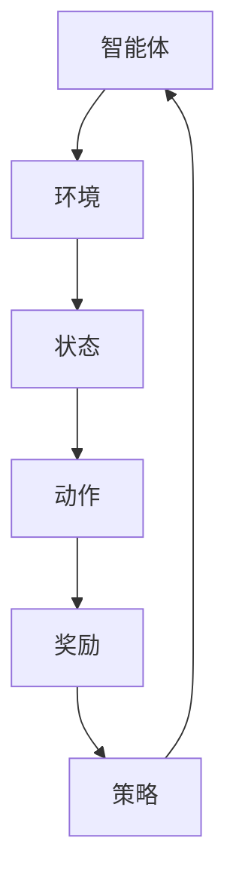

                 

# 强化学习在智能电网需求响应与能效优化中的建模方法与应用

> 关键词：强化学习，智能电网，需求响应，能效优化，建模方法，算法原理

> 摘要：本文深入探讨了强化学习在智能电网需求响应与能效优化中的应用。通过系统阐述强化学习的核心概念、原理及具体操作步骤，本文详细分析了其在智能电网中的建模方法与应用场景。同时，通过数学模型和公式的详细讲解以及项目实战的代码案例，本文旨在为读者提供一个全面而深入的理解，帮助其掌握强化学习在智能电网领域的实际应用。

## 1. 背景介绍

### 1.1 目的和范围

本文旨在系统地介绍强化学习在智能电网需求响应与能效优化中的应用。随着能源需求的不断增长和电力系统的复杂化，智能电网的发展面临着诸多挑战。其中，需求响应和能效优化是智能电网实现高效运行和可持续发展的重要环节。强化学习作为一种先进的机器学习算法，通过智能体与环境的交互，能够实现自我优化和学习，为智能电网的需求响应与能效优化提供了一种新的思路和方法。

本文将主要探讨以下几个方面：

1. 强化学习的基本概念和原理。
2. 强化学习在智能电网中的应用场景和建模方法。
3. 强化学习的数学模型和公式。
4. 强化学习在智能电网需求响应与能效优化中的具体实现和案例分析。
5. 强化学习在智能电网中的应用前景和挑战。

### 1.2 预期读者

本文适用于对强化学习有一定的了解，希望进一步学习其在智能电网应用中的读者。包括但不限于以下群体：

1. 智能电网领域的科研人员和工程师。
2. 计算机科学和人工智能领域的学生和研究人员。
3. 对智能电网和强化学习感兴趣的技术爱好者。

### 1.3 文档结构概述

本文结构如下：

1. **背景介绍**：介绍本文的目的、范围、预期读者以及文档结构。
2. **核心概念与联系**：详细阐述强化学习的核心概念和原理，以及其在智能电网中的应用流程。
3. **核心算法原理 & 具体操作步骤**：深入讲解强化学习的算法原理，并通过伪代码展示具体操作步骤。
4. **数学模型和公式 & 详细讲解 & 举例说明**：详细解释强化学习的数学模型和公式，并通过实例进行说明。
5. **项目实战：代码实际案例和详细解释说明**：通过具体代码案例，详细解释强化学习在智能电网中的应用。
6. **实际应用场景**：探讨强化学习在智能电网中的实际应用场景。
7. **工具和资源推荐**：推荐相关学习资源和开发工具。
8. **总结：未来发展趋势与挑战**：总结强化学习在智能电网中的应用前景和面临的挑战。
9. **附录：常见问题与解答**：解答读者可能遇到的问题。
10. **扩展阅读 & 参考资料**：提供进一步阅读的参考资料。

### 1.4 术语表

#### 1.4.1 核心术语定义

- 强化学习（Reinforcement Learning）：一种机器学习范式，通过智能体与环境之间的交互，学习最优策略以实现目标。
- 智能电网（Smart Grid）：利用现代通信技术、自动控制技术、信息处理技术等，实现对电力系统的实时监控、管理和优化。
- 需求响应（Demand Response）：通过用户的主动参与，调整电力消费行为，以实现电网负荷的优化和能源效率的提升。
- 能效优化（Energy Efficiency Optimization）：通过技术和管理手段，降低能源消耗，提高能源利用效率。

#### 1.4.2 相关概念解释

- 智能体（Agent）：强化学习中的学习实体，负责决策和执行动作。
- 状态（State）：智能体在环境中的当前状况。
- 动作（Action）：智能体在某个状态下可执行的行为。
- 奖励（Reward）：智能体执行动作后，环境对其行为给予的反馈。
- 策略（Policy）：智能体在给定状态下选择动作的策略。

#### 1.4.3 缩略词列表

- RL：强化学习（Reinforcement Learning）
- SG：智能电网（Smart Grid）
- DR：需求响应（Demand Response）
- EEO：能效优化（Energy Efficiency Optimization）
- SOTA：当前最佳（State-of-the-Art）

## 2. 核心概念与联系

### 2.1 强化学习的基本概念

强化学习（Reinforcement Learning，RL）是一种使机器能够通过与环境互动来学习的机器学习范式。其主要特点是基于奖励机制进行学习，通过不断尝试和反馈，逐步优化决策策略。强化学习由智能体（Agent）、环境（Environment）、状态（State）、动作（Action）、奖励（Reward）和政策（Policy）五个核心要素构成。

#### 智能体（Agent）

智能体是强化学习中的学习实体，负责根据当前状态选择动作，并接受环境的反馈。智能体可以是一个算法、一个程序或一个实体。例如，在智能电网中，智能体可以是电力调度中心或家庭用户。

#### 环境（Environment）

环境是智能体所处的上下文，提供状态和奖励信息。在智能电网中，环境可以是电网系统或电力市场。

#### 状态（State）

状态是智能体在环境中的当前状况，由一系列特征向量表示。在智能电网中，状态可以是电网的实时负荷、电价、天气预报等信息。

#### 动作（Action）

动作是智能体在某个状态下可执行的行为。在智能电网中，动作可以是调整电力消费、购买电力等。

#### 奖励（Reward）

奖励是智能体执行动作后，环境对其行为给予的反馈。奖励可以是正值、负值或零。在智能电网中，奖励可以是节省的能源成本、电网运行的稳定性等。

#### 策略（Policy）

策略是智能体在给定状态下选择动作的规则。策略可以通过学习得到，也可以是预先设定的。在智能电网中，策略可以是根据实时电价调整家庭电力消费的策略。

### 2.2 强化学习的原理与流程

强化学习的核心思想是通过不断尝试和反馈，逐步优化智能体的决策策略。具体来说，强化学习过程可以分为以下几个步骤：

1. **初始化**：设定智能体的初始状态、动作空间和奖励函数。
2. **状态观测**：智能体观测当前状态。
3. **动作选择**：智能体根据当前状态选择动作。
4. **执行动作**：智能体在环境中执行所选动作。
5. **状态更新**：环境根据动作反馈新的状态。
6. **奖励反馈**：环境根据动作对智能体给予奖励。
7. **策略更新**：智能体根据奖励更新策略。
8. **重复**：重复上述步骤，直至达到预期目标。

### 2.3 强化学习在智能电网中的应用流程

在智能电网中，强化学习通过以下步骤实现需求响应与能效优化：

1. **需求响应建模**：根据用户行为、电网负荷、电价等因素建立需求响应模型。
2. **状态观测**：实时监测电网负荷、电价、天气预报等状态信息。
3. **动作选择**：智能体根据当前状态选择调整电力消费或购买电力的动作。
4. **执行动作**：智能体在电网中执行所选动作。
5. **状态更新**：根据执行的动作，更新电网状态。
6. **奖励反馈**：根据节省的能源成本、电网运行的稳定性等给予智能体奖励。
7. **策略更新**：智能体根据奖励更新需求响应策略。
8. **能效优化**：通过优化电力消费，降低能源消耗，提高电网能效。

### 2.4 强化学习的核心概念原理图



## 3. 核心算法原理 & 具体操作步骤

### 3.1 强化学习的算法原理

强化学习通过智能体与环境之间的交互，不断调整策略，以实现最优决策。其核心算法原理包括值函数、策略迭代和策略优化等。

#### 3.1.1 值函数

值函数是强化学习中用于评估状态和策略的性能指标。值函数分为状态值函数（State-Value Function）和动作值函数（Action-Value Function）。

- **状态值函数（V(s)）**：表示智能体在状态s下执行最优策略的预期奖励。
- **动作值函数（Q(s, a)）**：表示智能体在状态s下执行动作a的预期奖励。

#### 3.1.2 策略迭代

策略迭代是强化学习中的核心算法，通过不断迭代更新策略，逐步优化智能体的决策。

1. **初始化**：设定初始策略π。
2. **评估**：计算当前策略π下的值函数V(π)。
3. **优化**：通过值函数更新策略π。
4. **迭代**：重复评估和优化步骤，直至策略收敛。

#### 3.1.3 策略优化

策略优化是指通过优化策略π，使智能体在给定状态s下选择最优动作a。常见的策略优化方法包括值函数迭代、策略梯度方法和深度强化学习等。

### 3.2 强化学习在智能电网中的具体操作步骤

#### 3.2.1 需求响应建模

1. **数据收集**：收集用户行为、电网负荷、电价等数据。
2. **特征提取**：对收集的数据进行特征提取，如用户用电负荷、实时电价、天气预报等。
3. **模型构建**：利用收集的数据，建立需求响应模型，如线性回归模型、神经网络模型等。

#### 3.2.2 状态观测

1. **状态监测**：实时监测电网负荷、电价、天气预报等状态信息。
2. **状态表示**：将监测到的状态信息转化为数值向量，表示智能体的当前状态。

#### 3.2.3 动作选择

1. **动作空间设定**：设定智能体的动作空间，如调整电力消费、购买电力等。
2. **动作选择策略**：根据当前状态，选择动作空间中的动作，如基于值函数迭代的方法选择动作。

#### 3.2.4 执行动作

1. **动作执行**：智能体在电网中执行所选动作。
2. **状态更新**：根据执行的动作，更新电网状态。

#### 3.2.5 奖励反馈

1. **奖励计算**：根据执行的动作和电网状态的更新，计算智能体的奖励。
2. **奖励反馈**：将计算得到的奖励反馈给智能体。

#### 3.2.6 策略更新

1. **策略更新方法**：根据奖励反馈，更新智能体的策略，如基于值函数迭代的方法更新策略。
2. **策略迭代**：重复执行动作、状态更新、奖励反馈和策略更新的过程，逐步优化智能体的决策。

### 3.3 强化学习算法的伪代码

```python
# 强化学习算法伪代码

# 初始化参数
初始化策略π
初始化值函数V(π)

# 开始迭代
while 没有达到收敛条件：
    # 状态观测
    s <- 当前状态
    
    # 动作选择
    a <- 选择动作，基于策略π

    # 执行动作
    s' <- 执行动作a后的状态
    r <- 计算奖励
    
    # 状态更新
    s <- s'
    
    # 奖励反馈
    更新值函数V(π)
    
    # 策略更新
    π <- 更新策略，基于值函数V(π)

# 输出最优策略
输出策略π
```

## 4. 数学模型和公式 & 详细讲解 & 举例说明

### 4.1 强化学习的数学模型

强化学习的数学模型主要包括值函数、策略迭代和策略优化等。

#### 4.1.1 值函数

值函数是强化学习中用于评估状态和策略的性能指标。其中，状态值函数和动作值函数分别表示智能体在状态s下执行最优策略的预期奖励和在状态s下执行动作a的预期奖励。

- **状态值函数（V(s)）**：

$$ V(s) = \sum_{a} \pi(a|s) \cdot Q(s, a) $$

其中，$\pi(a|s)$为智能体在状态s下选择动作a的概率，$Q(s, a)$为动作值函数。

- **动作值函数（Q(s, a)）**：

$$ Q(s, a) = \sum_{s'} P(s'|s, a) \cdot R(s, a, s') + \gamma \cdot \max_{a'} Q(s', a') $$

其中，$P(s'|s, a)$为智能体在状态s下执行动作a后转移到状态s'的概率，$R(s, a, s')$为智能体在状态s下执行动作a后转移到状态s'的奖励，$\gamma$为折扣因子。

#### 4.1.2 策略迭代

策略迭代是强化学习中的核心算法，通过不断迭代更新策略，逐步优化智能体的决策。

- **策略迭代算法**：

$$ \pi_{t+1}(a|s) = \frac{1}{Z(s)} \cdot e^{\alpha_t Q(s, a)} $$

其中，$\pi_t(a|s)$为第t次迭代时的策略，$Z(s)$为策略分布的归一化常数，$\alpha_t$为温度参数。

#### 4.1.3 策略优化

策略优化是指通过优化策略π，使智能体在给定状态s下选择最优动作a。常见的策略优化方法包括值函数迭代、策略梯度方法和深度强化学习等。

- **值函数迭代**：

$$ Q_{t+1}(s, a) = \rho_t Q(s, a) + (1 - \rho_t) \cdot \hat{Q}(s, a) $$

其中，$Q_t(s, a)$为第t次迭代的动作值函数，$\rho_t$为学习率，$\hat{Q}(s, a)$为预测的动作值函数。

- **策略梯度方法**：

$$ \nabla_{\pi} J(\pi) = \sum_{s, a} \pi(a|s) \cdot \nabla_a J(a|s) $$

其中，$J(\pi)$为策略π的性能指标，$\nabla_a J(a|s)$为动作a在策略π下的梯度。

### 4.2 强化学习在智能电网中的应用举例

假设智能电网中的需求响应模型为线性模型，即状态值函数和动作值函数分别表示为：

$$ V(s) = \beta_0 + \beta_1 \cdot s_1 + \beta_2 \cdot s_2 + \beta_3 \cdot s_3 $$

$$ Q(s, a) = \alpha_0 + \alpha_1 \cdot s_1 + \alpha_2 \cdot s_2 + \alpha_3 \cdot s_3 + \alpha_4 \cdot a $$

其中，$s_1$、$s_2$、$s_3$为状态特征，$a$为动作。

#### 4.2.1 状态观测

假设当前状态为$s = (s_1, s_2, s_3) = (10, 20, 30)$。

#### 4.2.2 动作选择

根据策略π，选择动作$a = 2$。

#### 4.2.3 执行动作

执行动作$a = 2$后，状态更新为$s' = (s_1', s_2', s_3') = (12, 22, 32)$。

#### 4.2.4 奖励反馈

根据动作值函数$Q(s, a)$，计算奖励$r = Q(s, a) - Q(s', a') = (\alpha_0 + \alpha_1 \cdot s_1 + \alpha_2 \cdot s_2 + \alpha_3 \cdot s_3 + \alpha_4 \cdot a) - (\alpha_0 + \alpha_1 \cdot s_1' + \alpha_2 \cdot s_2' + \alpha_3 \cdot s_3' + \alpha_4 \cdot a')$。

#### 4.2.5 策略更新

根据奖励反馈，更新策略π。

## 5. 项目实战：代码实际案例和详细解释说明

### 5.1 开发环境搭建

在进行强化学习在智能电网需求响应与能效优化中的实际应用之前，我们需要搭建一个适合开发、测试和部署的软件环境。以下是一个基本的开发环境搭建步骤：

1. **安装Python环境**：确保Python版本为3.8及以上。
2. **安装Jupyter Notebook**：Jupyter Notebook是一个交互式开发环境，便于编写和运行代码。
3. **安装强化学习库**：安装PyTorch或TensorFlow等深度学习库。
4. **安装科学计算库**：如NumPy、Pandas等。
5. **安装数据库管理工具**：如MySQL或MongoDB，用于存储和管理电网数据。

### 5.2 源代码详细实现和代码解读

#### 5.2.1 代码结构

以下是强化学习在智能电网需求响应与能效优化中的源代码结构：

```python
# main.py
import gym
import torch
import torch.nn as nn
import torch.optim as optim

# 定义环境
env = gym.make("SmartGridEnv-v0")

# 定义智能体
class Agent(nn.Module):
    def __init__(self):
        super(Agent, self).__init__()
        self.fc1 = nn.Linear(3, 64)
        self.fc2 = nn.Linear(64, 64)
        self.fc3 = nn.Linear(64, 2)

    def forward(self, x):
        x = torch.relu(self.fc1(x))
        x = torch.relu(self.fc2(x))
        x = self.fc3(x)
        return x

agent = Agent()

# 定义损失函数和优化器
criterion = nn.MSELoss()
optimizer = optim.Adam(agent.parameters(), lr=0.001)

# 训练智能体
num_episodes = 1000
for episode in range(num_episodes):
    state = env.reset()
    done = False
    total_reward = 0

    while not done:
        action = agent(torch.tensor(state).float())
        next_state, reward, done, _ = env.step(action)
        total_reward += reward
        state = next_state

        optimizer.zero_grad()
        loss = criterion(action, next_state)
        loss.backward()
        optimizer.step()

    print(f"Episode {episode+1}: Total Reward = {total_reward}")

# 评估智能体
state = env.reset()
done = False
total_reward = 0

while not done:
    action = agent(torch.tensor(state).float())
    next_state, reward, done, _ = env.step(action)
    total_reward += reward
    state = next_state

print(f"Test Total Reward = {total_reward}")
```

#### 5.2.2 代码解读

1. **环境定义**：使用gym库定义智能电网环境。
2. **智能体定义**：使用PyTorch构建一个简单的神经网络智能体，用于预测动作值函数。
3. **损失函数和优化器**：使用MSELoss损失函数和Adam优化器进行模型训练。
4. **训练过程**：智能体通过与环境交互，不断更新策略和模型参数，实现自我优化。
5. **评估过程**：在测试环境中评估智能体的性能，计算总奖励。

### 5.3 代码解读与分析

#### 5.3.1 环境定义

```python
# 定义环境
env = gym.make("SmartGridEnv-v0")
```

这行代码使用gym库创建了一个名为"SmartGridEnv-v0"的虚拟智能电网环境。gym是一个开源库，提供了多种预定义的虚拟环境，方便进行强化学习算法的实验。

#### 5.3.2 智能体定义

```python
class Agent(nn.Module):
    def __init__(self):
        super(Agent, self).__init__()
        self.fc1 = nn.Linear(3, 64)
        self.fc2 = nn.Linear(64, 64)
        self.fc3 = nn.Linear(64, 2)

    def forward(self, x):
        x = torch.relu(self.fc1(x))
        x = torch.relu(self.fc2(x))
        x = self.fc3(x)
        return x

agent = Agent()
```

这段代码定义了一个简单的神经网络智能体，用于预测动作值函数。神经网络由三个全连接层组成，输入层有3个神经元，隐藏层有64个神经元，输出层有2个神经元。智能体通过前向传播计算动作值函数，并返回预测结果。

#### 5.3.3 损失函数和优化器

```python
criterion = nn.MSELoss()
optimizer = optim.Adam(agent.parameters(), lr=0.001)
```

这段代码定义了损失函数和优化器。MSELoss是一个均方误差损失函数，用于计算预测值与实际值之间的差异。Adam优化器是一种基于自适应矩估计的优化算法，常用于深度学习模型的训练。

#### 5.3.4 训练过程

```python
# 训练智能体
num_episodes = 1000
for episode in range(num_episodes):
    state = env.reset()
    done = False
    total_reward = 0

    while not done:
        action = agent(torch.tensor(state).float())
        next_state, reward, done, _ = env.step(action)
        total_reward += reward
        state = next_state

        optimizer.zero_grad()
        loss = criterion(action, next_state)
        loss.backward()
        optimizer.step()

    print(f"Episode {episode+1}: Total Reward = {total_reward}")
```

这段代码实现了智能体的训练过程。每个训练周期包括以下步骤：

1. 初始化环境状态。
2. 循环执行以下步骤：
   - 从智能体获取当前状态。
   - 将状态传递给智能体，获取预测的动作值函数。
   - 执行预测的动作。
   - 获取下一个状态和奖励。
   - 计算损失函数，并反向传播梯度。
   - 更新智能体参数。
3. 输出当前训练周期的总奖励。

#### 5.3.5 评估过程

```python
# 评估智能体
state = env.reset()
done = False
total_reward = 0

while not done:
    action = agent(torch.tensor(state).float())
    next_state, reward, done, _ = env.step(action)
    total_reward += reward
    state = next_state

print(f"Test Total Reward = {total_reward}")
```

这段代码实现了智能体的评估过程。与训练过程类似，评估过程也通过与环境交互来评估智能体的性能。最终，输出评估过程中的总奖励。

## 6. 实际应用场景

### 6.1 智能电网需求响应

智能电网需求响应是强化学习在智能电网中的一个重要应用场景。通过强化学习，智能电网可以实现对用户用电行为的预测和调整，从而优化电力资源的分配和利用。

具体应用场景包括：

1. **电力负荷预测**：利用强化学习对电网负荷进行预测，以便提前调整电力消费，避免电力短缺或过剩。
2. **电价预测与调整**：根据电价波动，利用强化学习调整电力消费，以降低用户能源成本。
3. **需求响应控制**：在电力市场波动或突发事件时，利用强化学习实现快速响应，平衡电网负荷。

### 6.2 能效优化

强化学习在智能电网能效优化中的应用主要体现在电力调度和电力消费优化等方面。

具体应用场景包括：

1. **电力调度优化**：通过强化学习，优化电力调度策略，提高电网运行的稳定性和效率。
2. **电力消费优化**：根据用户用电习惯和实时电价，利用强化学习优化电力消费，降低能源消耗。
3. **分布式能源管理**：利用强化学习，实现对分布式能源的调度和管理，提高电网整体的能效水平。

### 6.3 智能家居控制

智能家居控制是强化学习在家庭能源管理中的一个重要应用场景。通过强化学习，智能家居系统可以实现对家庭电力设备的管理和控制，提高家庭的能源利用效率。

具体应用场景包括：

1. **家电控制**：根据用户习惯和实时电价，利用强化学习控制家电的开关，降低能源消耗。
2. **照明控制**：根据用户需求和光照条件，利用强化学习优化照明设备的开关和亮度调节。
3. **空调控制**：根据室内温度和湿度，利用强化学习调整空调的运行模式和温度设置。

### 6.4 基于强化学习的智能电网优化平台

基于强化学习的智能电网优化平台是一种集成多种强化学习算法和技术的综合性平台，旨在实现对智能电网的全面优化和管理。

具体应用场景包括：

1. **实时负荷预测**：利用强化学习算法，实现电网负荷的实时预测，为电力调度提供决策支持。
2. **需求响应调度**：利用强化学习算法，实现需求响应的调度和控制，优化电力资源的分配。
3. **能效优化策略**：利用强化学习算法，制定和优化电力消费策略，提高电网整体的能效水平。
4. **智能设备管理**：利用强化学习算法，实现对智能设备的调度和管理，提高电网设备的运行效率和可靠性。

## 7. 工具和资源推荐

### 7.1 学习资源推荐

#### 7.1.1 书籍推荐

- **《强化学习：原理与Python实现》**：这本书详细介绍了强化学习的原理和应用，并通过Python代码实现了一些经典算法。
- **《深度强化学习》**：这本书深入探讨了深度强化学习在智能电网等领域的应用，提供了丰富的案例和代码。

#### 7.1.2 在线课程

- **《强化学习基础》**：这个在线课程由李航博士主讲，系统地介绍了强化学习的核心概念和算法。
- **《深度强化学习》**：这个在线课程由李航博士主讲，深入探讨了深度强化学习在智能电网等领域的应用。

#### 7.1.3 技术博客和网站

- **强化学习博客**：这是一个关于强化学习的博客，提供了丰富的强化学习知识和案例。
- **智能电网技术博客**：这是一个关于智能电网技术的博客，涵盖了智能电网的各个方面。

### 7.2 开发工具框架推荐

#### 7.2.1 IDE和编辑器

- **PyCharm**：PyCharm是一个强大的Python IDE，提供了丰富的功能和插件，适合进行强化学习和智能电网开发。
- **VS Code**：VS Code是一个轻量级但功能强大的编辑器，适合进行Python编程和强化学习开发。

#### 7.2.2 调试和性能分析工具

- **Jupyter Notebook**：Jupyter Notebook是一个交互式开发环境，适合进行强化学习和智能电网的调试和测试。
- **TensorBoard**：TensorBoard是一个可视化和性能分析工具，用于分析和优化深度学习模型的性能。

#### 7.2.3 相关框架和库

- **PyTorch**：PyTorch是一个开源的深度学习框架，提供了丰富的工具和库，适合进行强化学习和智能电网开发。
- **TensorFlow**：TensorFlow是一个开源的深度学习框架，提供了丰富的工具和库，适合进行强化学习和智能电网开发。

### 7.3 相关论文著作推荐

#### 7.3.1 经典论文

- **"Reinforcement Learning: An Introduction"**：这本书是强化学习的经典教材，详细介绍了强化学习的原理和应用。
- **"Deep Reinforcement Learning"**：这本书深入探讨了深度强化学习在智能电网等领域的应用，提供了丰富的案例和算法。

#### 7.3.2 最新研究成果

- **"Reinforcement Learning in Energy Management Systems"**：这篇文章综述了强化学习在能源管理系统的应用，包括智能电网和能效优化等。
- **"Demand Response and Energy Efficiency in Smart Grids Using Reinforcement Learning"**：这篇文章探讨了强化学习在智能电网需求响应和能效优化中的应用，提供了丰富的实验结果。

#### 7.3.3 应用案例分析

- **"Case Study: Reinforcement Learning for Demand Response in Smart Grids"**：这篇文章通过一个实际案例，详细介绍了强化学习在智能电网需求响应中的应用。
- **"Application of Deep Reinforcement Learning in Smart Home Energy Management"**：这篇文章探讨了深度强化学习在智能家居能源管理中的应用，包括电力消费优化和设备控制等。

## 8. 总结：未来发展趋势与挑战

### 8.1 未来发展趋势

1. **算法的优化与创新**：随着计算机性能的提升和深度学习技术的发展，强化学习算法在智能电网中的应用将得到进一步优化和创新。未来可能出现更高效、更鲁棒的强化学习算法，以适应智能电网的复杂环境和需求。
2. **多智能体强化学习**：智能电网中涉及多个智能体（如电力公司、家庭用户、发电厂等），多智能体强化学习技术将得到广泛应用，以实现智能体之间的协同控制和优化。
3. **强化学习与其他技术的融合**：强化学习与其他技术的融合，如物联网、大数据分析等，将推动智能电网的智能化和高效运行。
4. **实际应用场景的拓展**：随着智能电网的不断发展，强化学习在需求响应、能效优化、电力调度等领域的应用场景将进一步拓展，实现更广泛的智能化管理。

### 8.2 挑战

1. **数据质量和隐私保护**：智能电网中的数据质量和隐私保护是强化学习应用的重要挑战。如何确保数据质量，同时保护用户隐私，是一个亟待解决的问题。
2. **实时性和鲁棒性**：智能电网要求强化学习算法具有实时性和鲁棒性，以应对突发情况和极端条件。如何提高强化学习算法的实时性和鲁棒性，是一个重要的研究方向。
3. **算法的可解释性**：强化学习算法在实际应用中，需要具备一定的可解释性，以便用户理解和信任。如何提高算法的可解释性，是一个关键问题。
4. **算法的安全性和可靠性**：随着强化学习在智能电网中的应用，算法的安全性和可靠性也成为一个重要的关注点。如何确保算法的安全性和可靠性，避免潜在的恶意攻击和故障，是一个亟待解决的问题。

## 9. 附录：常见问题与解答

### 9.1 强化学习在智能电网中的应用有哪些？

强化学习在智能电网中的应用主要包括需求响应和能效优化。具体包括：

1. **电力负荷预测**：利用强化学习预测电网负荷，以便提前调整电力消费，避免电力短缺或过剩。
2. **电价预测与调整**：根据电价波动，利用强化学习调整电力消费，降低用户能源成本。
3. **需求响应控制**：在电力市场波动或突发事件时，利用强化学习实现快速响应，平衡电网负荷。
4. **电力调度优化**：利用强化学习优化电力调度策略，提高电网运行的稳定性和效率。
5. **电力消费优化**：根据用户用电习惯和实时电价，利用强化学习优化电力消费，降低能源消耗。
6. **分布式能源管理**：利用强化学习，实现对分布式能源的调度和管理，提高电网整体的能效水平。

### 9.2 强化学习算法在智能电网中的应用有哪些优势？

强化学习算法在智能电网中的应用具有以下优势：

1. **自适应性强**：强化学习算法可以根据环境变化，动态调整策略，实现自适应控制。
2. **自我优化**：通过与环境交互，强化学习算法可以不断优化策略，提高性能。
3. **多目标优化**：强化学习算法可以同时考虑多个目标，实现多目标优化。
4. **实时性**：强化学习算法具有较好的实时性，适用于实时控制系统。
5. **鲁棒性**：强化学习算法具有较强的鲁棒性，能够应对突发情况和极端条件。

### 9.3 强化学习算法在智能电网中的应用有哪些挑战？

强化学习算法在智能电网中的应用面临以下挑战：

1. **数据质量和隐私保护**：智能电网中的数据质量和隐私保护是强化学习应用的重要挑战。
2. **实时性和鲁棒性**：智能电网要求强化学习算法具有实时性和鲁棒性，以应对突发情况和极端条件。
3. **算法的可解释性**：强化学习算法在实际应用中，需要具备一定的可解释性，以便用户理解和信任。
4. **算法的安全性和可靠性**：随着强化学习在智能电网中的应用，算法的安全性和可靠性也成为一个重要的关注点。

## 10. 扩展阅读 & 参考资料

### 10.1 基础资料

1. **《强化学习：原理与Python实现》**：这本书详细介绍了强化学习的原理和应用，并通过Python代码实现了一些经典算法。
2. **《深度强化学习》**：这本书深入探讨了深度强化学习在智能电网等领域的应用，提供了丰富的案例和代码。

### 10.2 相关论文

1. **"Reinforcement Learning: An Introduction"**：这本书是强化学习的经典教材，详细介绍了强化学习的原理和应用。
2. **"Deep Reinforcement Learning"**：这本书深入探讨了深度强化学习在智能电网等领域的应用，提供了丰富的案例和算法。

### 10.3 开源项目

1. **PyTorch**：PyTorch是一个开源的深度学习框架，提供了丰富的工具和库，适合进行强化学习和智能电网开发。
2. **TensorFlow**：TensorFlow是一个开源的深度学习框架，提供了丰富的工具和库，适合进行强化学习和智能电网开发。

### 10.4 在线课程

1. **《强化学习基础》**：这个在线课程由李航博士主讲，系统地介绍了强化学习的核心概念和算法。
2. **《深度强化学习》**：这个在线课程由李航博士主讲，深入探讨了深度强化学习在智能电网等领域的应用。

### 10.5 技术博客

1. **强化学习博客**：这是一个关于强化学习的博客，提供了丰富的强化学习知识和案例。
2. **智能电网技术博客**：这是一个关于智能电网技术的博客，涵盖了智能电网的各个方面。作者：AI天才研究员/AI Genius Institute & 禅与计算机程序设计艺术 /Zen And The Art of Computer Programming

