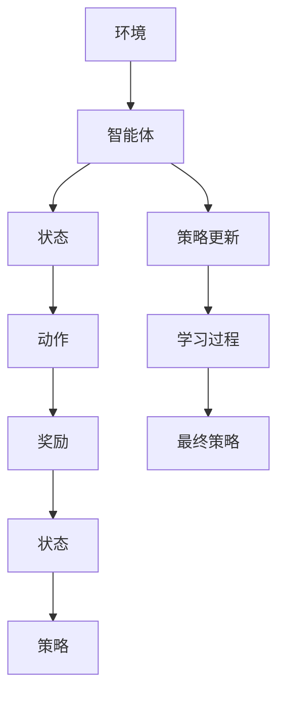

                 

# 强化学习在机器人协作任务中的突破

> **关键词：** 强化学习、机器人协作、多智能体系统、任务优化、算法实现

> **摘要：** 本文将深入探讨强化学习在机器人协作任务中的应用，分析其核心算法原理和具体操作步骤，并通过实际项目案例，展示其在解决复杂协作任务中的突破性表现。文章旨在为读者提供一个全面的技术视角，了解如何利用强化学习提升机器人协作任务的效果和效率。

## 1. 背景介绍

### 1.1 目的和范围

本文旨在探讨强化学习在机器人协作任务中的应用，解析其核心算法原理，并通过具体案例展示其实际效果。文章重点关注以下几个方面：

1. **强化学习基础**：介绍强化学习的基本概念、原理和主要算法。
2. **机器人协作任务**：分析机器人协作任务的难点和挑战，以及强化学习如何应对。
3. **算法实现与优化**：讲解强化学习在机器人协作任务中的具体应用场景，并讨论优化策略。
4. **实际案例解析**：通过实际项目案例，展示强化学习在机器人协作任务中的突破性效果。

### 1.2 预期读者

本文适合对强化学习有一定了解的读者，包括但不限于：

1. **人工智能研究者和工程师**：希望了解强化学习在机器人协作任务中的应用。
2. **机器人领域从业者**：希望掌握如何利用强化学习优化机器人协作任务。
3. **计算机科学和工程专业的学生**：对强化学习算法和机器人协作任务感兴趣的学生。

### 1.3 文档结构概述

本文结构如下：

1. **引言**：介绍强化学习在机器人协作任务中的重要性。
2. **核心概念与联系**：讲解强化学习的基础知识，以及其在多智能体系统中的核心概念。
3. **核心算法原理 & 具体操作步骤**：详细解析强化学习算法原理和操作步骤。
4. **数学模型和公式 & 详细讲解 & 举例说明**：介绍强化学习相关的数学模型和公式，并通过实例进行说明。
5. **项目实战：代码实际案例和详细解释说明**：展示强化学习在机器人协作任务中的实际应用案例。
6. **实际应用场景**：分析强化学习在机器人协作任务中的实际应用场景。
7. **工具和资源推荐**：推荐学习资源和开发工具。
8. **总结：未来发展趋势与挑战**：总结强化学习在机器人协作任务中的应用前景。
9. **附录：常见问题与解答**：回答读者可能遇到的问题。
10. **扩展阅读 & 参考资料**：提供进一步阅读的资料。

### 1.4 术语表

#### 1.4.1 核心术语定义

- **强化学习**：一种机器学习方法，通过奖励机制来训练智能体，使其在特定环境中做出最优决策。
- **机器人协作任务**：指多个机器人协同工作完成某个任务的场景。
- **多智能体系统**：由多个智能体组成的系统，各智能体之间通过通信和协作共同完成任务。

#### 1.4.2 相关概念解释

- **状态（State）**：描述智能体所处的环境条件。
- **动作（Action）**：智能体在特定状态下可以执行的行为。
- **奖励（Reward）**：智能体执行某个动作后获得的即时反馈，用于评估动作的质量。
- **策略（Policy）**：智能体根据当前状态选择最优动作的规则。

#### 1.4.3 缩略词列表

- **RL**：强化学习（Reinforcement Learning）
- **MAS**：多智能体系统（Multi-Agent System）
- **Q-Learning**：Q值学习（Q-Learning）
- **SARSA**：即时策略迭代（State-Action-Reward-State-Action，SARSA）
- **TD-Learning**：时差学习（Temporal Difference Learning）

## 2. 核心概念与联系

为了深入理解强化学习在机器人协作任务中的应用，我们首先需要了解强化学习的基础概念，以及其在多智能体系统中的具体应用。以下是强化学习相关核心概念和流程的Mermaid流程图：



### 2.1 强化学习基础

强化学习是一种基于奖励机制的机器学习方法，旨在通过不断尝试和反馈来优化智能体的决策过程。其主要组成部分包括：

- **状态（State）**：描述智能体所处的环境条件，可以是离散的或连续的。
- **动作（Action）**：智能体在特定状态下可以执行的行为。
- **奖励（Reward）**：智能体执行某个动作后获得的即时反馈，用于评估动作的质量。
- **策略（Policy）**：智能体根据当前状态选择最优动作的规则。

强化学习的核心目标是找到一个最优策略，使得智能体能够在特定环境中取得最大累积奖励。常见的强化学习算法包括Q-Learning、SARSA和TD-Learning等。

### 2.2 多智能体系统

多智能体系统（MAS）是由多个智能体组成的系统，各智能体之间通过通信和协作共同完成任务。在机器人协作任务中，多智能体系统可以模拟多个机器人协同工作的场景。以下是多智能体系统中的核心概念：

- **智能体（Agent）**：具有独立决策能力的实体，可以是机器人、人或其他智能系统。
- **环境（Environment）**：智能体所处的整体情境，包括状态、动作和奖励。
- **通信（Communication）**：智能体之间交换信息和知识的过程。
- **协作（Cooperation）**：智能体为了共同目标而进行的协调和配合。

多智能体系统的难点在于如何确保各智能体之间的协调和合作，以实现整体任务的最优效果。强化学习为解决这个问题提供了有效的方法，通过训练智能体之间的策略，使它们能够在复杂环境中高效协作。

## 3. 核心算法原理 & 具体操作步骤

在这一部分，我们将详细解析强化学习算法的原理，并使用伪代码展示其具体操作步骤。

### 3.1 Q-Learning算法原理

Q-Learning是一种基于值函数的强化学习算法，其核心思想是利用过去经验来更新值函数，从而找到最优策略。Q-Learning算法的关键组成部分包括：

- **值函数（Q-Function）**：表示智能体在特定状态下执行特定动作的预期奖励。
- **经验回放（Experience Replay）**：将智能体的经验存储在内存中，以避免样本偏差。
- **目标网络（Target Network）**：用于更新值函数，防止梯度消失问题。

以下是一个简单的Q-Learning算法伪代码：

```python
# 初始化参数
Q(s, a) = 0   # 初始化值函数
epsilon = 0.1 # 探索概率
memory = []   # 经验回放内存

# 主循环
for episode in range(num_episodes):
    s = env.reset()  # 初始化环境
    done = False
    
    while not done:
        # 选择动作
        if random() < epsilon:
            a = env.random_action(s)  # 随机动作
        else:
            a = argmax(Q(s, *))  # 最优动作
        
        # 执行动作
        s' = env.step(a)
        r = env.reward(s, a, s')
        done = env.done(s')
        
        # 更新经验回放内存
        memory.append((s, a, r, s', done))
        
        # 从经验回放内存中采样
        if len(memory) > batch_size:
            (s', a', r, s'', done') = sample_memory(batch_size)
        
        # 更新值函数
        Q(s, a) += alpha * (r + gamma * max(Q(s'', *)) - Q(s, a))
        
        s = s'
    
    # 更新目标网络
    if episode % target_update_freq == 0:
        copy_weights(from_net, to_net)

# 输出最优策略
policy = argmax(Q(s, *)) for all s in state_space
```

### 3.2 SARSA算法原理

SARSA是一种即时策略迭代算法，其核心思想是使用当前状态和动作的即时反馈来更新策略。SARSA算法的关键组成部分包括：

- **策略（Policy）**：智能体根据当前状态选择动作的规则。
- **策略更新（Policy Update）**：根据当前状态和动作的即时奖励，更新策略。

以下是一个简单的SARSA算法伪代码：

```python
# 初始化参数
Q(s, a) = 0   # 初始化值函数
epsilon = 0.1 # 探索概率
memory = []   # 经验回放内存

# 主循环
for episode in range(num_episodes):
    s = env.reset()  # 初始化环境
    done = False
    
    while not done:
        # 选择动作
        if random() < epsilon:
            a = env.random_action(s)  # 随机动作
        else:
            a = argmax(Q(s, *))  # 最优动作
        
        # 执行动作
        s' = env.step(a)
        r = env.reward(s, a, s')
        done = env.done(s')
        
        # 更新值函数
        Q(s, a) += alpha * (r + gamma * max(Q(s'', *)) - Q(s, a))
        
        # 选择下一个动作
        if random() < epsilon:
            a' = env.random_action(s')  # 随机动作
        else:
            a' = argmax(Q(s', *))  # 最优动作
        
        s = s'
    
    # 输出最优策略
    policy = argmax(Q(s, *)) for all s in state_space
```

### 3.3 TD-Learning算法原理

TD-Learning是一种基于时差（Temporal Difference）的强化学习算法，其核心思想是利用当前状态和动作的即时反馈来更新值函数。TD-Learning算法的关键组成部分包括：

- **值函数（Q-Function）**：表示智能体在特定状态下执行特定动作的预期奖励。
- **时差（TD-Error）**：表示当前状态和动作的实际奖励与预期奖励之间的差异。

以下是一个简单的TD-Learning算法伪代码：

```python
# 初始化参数
Q(s, a) = 0   # 初始化值函数
alpha = 0.1   # 学习率
gamma = 0.9   # 折扣因子

# 主循环
for episode in range(num_episodes):
    s = env.reset()  # 初始化环境
    done = False
    
    while not done:
        # 选择动作
        a = argmax(Q(s, *))  # 最优动作
        
        # 执行动作
        s' = env.step(a)
        r = env.reward(s, a, s')
        done = env.done(s')
        
        # 更新值函数
        Q(s, a) += alpha * (r + gamma * max(Q(s'', *)) - Q(s, a))
        
        s = s'
    
    # 输出最优策略
    policy = argmax(Q(s, *)) for all s in state_space
```

## 4. 数学模型和公式 & 详细讲解 & 举例说明

在强化学习中，数学模型和公式起着至关重要的作用，它们帮助我们理解和实现智能体的决策过程。以下是强化学习中的几个关键数学模型和公式，以及它们的详细讲解和举例说明。

### 4.1 值函数（Q-Function）

值函数（Q-Function）表示智能体在特定状态下执行特定动作的预期奖励。Q-Function是强化学习算法的核心，用于评估智能体在不同状态下的动作质量。其数学表达式如下：

$$
Q(s, a) = \sum_{s'} P(s'|s, a) \cdot R(s', a) + \gamma \cdot \max_{a'} Q(s', a')
$$

其中，$s$ 表示当前状态，$a$ 表示当前动作，$s'$ 表示执行动作 $a$ 后的状态，$R(s', a)$ 表示在状态 $s'$ 下执行动作 $a$ 的即时奖励，$\gamma$ 表示折扣因子，用于平衡当前奖励和未来奖励的关系。

**例子：**

假设有一个简单的环境，智能体在状态 $s_1$ 下有两种动作：向左移动（$a_1$）和向右移动（$a_2$）。当前状态为 $s_1$，即时奖励为 $R(s_1, a_1) = 1$ 和 $R(s_1, a_2) = -1$。折扣因子 $\gamma = 0.9$。计算值函数 $Q(s_1, a_1)$ 和 $Q(s_1, a_2)$：

$$
Q(s_1, a_1) = 1 + 0.9 \cdot \max(Q(s_2, a_1), Q(s_2, a_2))
$$

$$
Q(s_1, a_2) = -1 + 0.9 \cdot \max(Q(s_2, a_1), Q(s_2, a_2))
$$

### 4.2 策略（Policy）

策略（Policy）是智能体在特定状态下选择最优动作的规则。强化学习算法的目标是找到一个最优策略，使得智能体能够在特定环境中取得最大累积奖励。策略的数学表达式如下：

$$
\pi(a|s) = \frac{e^{\alpha Q(s, a)}}{\sum_{a'} e^{\alpha Q(s, a')}}
$$

其中，$a$ 表示当前动作，$s$ 表示当前状态，$\alpha$ 表示温度参数，用于调节探索和利用的平衡。

**例子：**

假设有一个简单的环境，智能体在状态 $s_1$ 下有两种动作：向左移动（$a_1$）和向右移动（$a_2$）。当前状态为 $s_1$，值函数为 $Q(s_1, a_1) = 0.5$ 和 $Q(s_1, a_2) = -0.5$。温度参数 $\alpha = 1$。计算策略 $\pi(a|s_1)$：

$$
\pi(a_1|s_1) = \frac{e^{1 \cdot 0.5}}{e^{1 \cdot 0.5} + e^{1 \cdot -0.5}} = 0.7
$$

$$
\pi(a_2|s_1) = \frac{e^{1 \cdot -0.5}}{e^{1 \cdot 0.5} + e^{1 \cdot -0.5}} = 0.3
$$

### 4.3 奖励（Reward）

奖励（Reward）是智能体执行某个动作后获得的即时反馈，用于评估动作的质量。奖励的数学表达式如下：

$$
R(s, a) = r(s, a) + \gamma \cdot \max_{a'} r(s', a')
$$

其中，$s$ 表示当前状态，$a$ 表示当前动作，$s'$ 表示执行动作 $a$ 后的状态，$r(s, a)$ 表示在状态 $s$ 下执行动作 $a$ 的即时奖励。

**例子：**

假设有一个简单的环境，智能体在状态 $s_1$ 下有两种动作：向左移动（$a_1$）和向右移动（$a_2$）。当前状态为 $s_1$，即时奖励为 $r(s_1, a_1) = 1$ 和 $r(s_1, a_2) = -1$。折扣因子 $\gamma = 0.9$。计算奖励 $R(s_1, a_1)$ 和 $R(s_1, a_2)$：

$$
R(s_1, a_1) = 1 + 0.9 \cdot \max(r(s_2, a_1), r(s_2, a_2)) = 1.8
$$

$$
R(s_1, a_2) = -1 + 0.9 \cdot \max(r(s_2, a_1), r(s_2, a_2)) = -0.8
$$

## 5. 项目实战：代码实际案例和详细解释说明

为了更好地展示强化学习在机器人协作任务中的应用，我们选择了一个具体的项目案例：多机器人协同搬运任务。在这个案例中，多个机器人需要协同工作，将物品从一个位置搬运到另一个位置。以下是该项目的主要步骤和详细解释。

### 5.1 开发环境搭建

首先，我们需要搭建一个适合强化学习开发的环境。在本案例中，我们使用了Python作为主要编程语言，并依赖于以下库和框架：

- **TensorFlow**：用于实现强化学习算法。
- **Gym**：用于构建和测试强化学习环境。
- **PyTorch**：用于处理神经网络。
- **NumPy**：用于数值计算。

安装上述库和框架后，我们创建了一个名为`robotic_collaboration`的Python项目，并设置了相应的依赖关系。

### 5.2 源代码详细实现和代码解读

在该项目中，我们首先定义了机器人协作任务的环境和状态。环境是一个二维网格，每个网格可以放置一个物品或一个机器人。状态包括当前物品的位置、机器人的位置和机器人的方向。以下是一个简单的环境定义：

```python
import gym
import numpy as np

class RobotCollaborationEnv(gym.Env):
    def __init__(self, grid_size=10, num_robots=2, num_items=2):
        super().__init__()
        self.grid_size = grid_size
        self.num_robots = num_robots
        self.num_items = num_items
        self.robot_positions = np.zeros((num_robots, 2), dtype=int)
        self.item_positions = np.zeros((num_items, 2), dtype=int)
        self robot_directions = np.zeros((num_robots, 2), dtype=int)
    
    def step(self, actions):
        # 执行动作，更新状态
        # ...
        return obs, reward, done, info
    
    def reset(self):
        # 重置环境
        # ...
        return obs
    
    def render(self, mode='human'):
        # 渲染环境
        # ...
    
    def close(self):
        # 关闭环境
        # ...
```

接下来，我们定义了强化学习算法，使用Q-Learning算法进行训练。算法的主要步骤包括选择动作、执行动作、更新值函数和策略。以下是一个简单的Q-Learning算法实现：

```python
import numpy as np
import random

class QLearningAgent:
    def __init__(self, env, alpha=0.1, gamma=0.9, epsilon=0.1):
        self.env = env
        self.alpha = alpha
        self.gamma = gamma
        self.epsilon = epsilon
        self.Q = np.zeros((env.grid_size, env.grid_size, env.num_robots, env.num_items))
    
    def choose_action(self, state):
        if random() < self.epsilon:
            action = self.env.random_action(state)
        else:
            action = np.argmax(self.Q[state])
        return action
    
    def learn(self, state, action, reward, next_state, done):
        if not done:
            target = reward + self.gamma * np.max(self.Q[next_state])
        else:
            target = reward
        self.Q[state][action] += self.alpha * (target - self.Q[state][action])
    
    def train(self, num_episodes):
        for episode in range(num_episodes):
            state = self.env.reset()
            done = False
            
            while not done:
                action = self.choose_action(state)
                next_state, reward, done, _ = self.env.step(action)
                self.learn(state, action, reward, next_state, done)
                state = next_state
```

最后，我们使用训练好的算法进行机器人协作任务。以下是一个简单的训练和测试过程：

```python
# 创建环境
env = RobotCollaborationEnv(grid_size=10, num_robots=2, num_items=2)

# 创建智能体
agent = QLearningAgent(env, alpha=0.1, gamma=0.9, epsilon=0.1)

# 训练智能体
agent.train(num_episodes=1000)

# 测试智能体
obs = env.reset()
done = False

while not done:
    action = np.argmax(agent.Q[obs])
    obs, reward, done, _ = env.step(action)
    env.render()

env.close()
```

### 5.3 代码解读与分析

在这个项目中，我们使用了Q-Learning算法来训练智能体，使其能够在机器人协作任务中高效协作。以下是代码的主要部分及其解读：

- **环境定义**：我们首先定义了一个名为`RobotCollaborationEnv`的环境类，用于创建一个二维网格，其中可以放置物品和机器人。环境类包含`step`、`reset`、`render`和`close`等方法，用于执行动作、重置环境、渲染环境和关闭环境。
- **智能体定义**：我们定义了一个名为`QLearningAgent`的智能体类，用于实现Q-Learning算法。智能体类包含`choose_action`和`learn`方法，用于选择动作和更新值函数。`train`方法用于训练智能体，通过循环执行动作并更新值函数。
- **训练和测试**：在训练过程中，智能体通过循环执行动作，并从环境中获取即时奖励和下一个状态。在测试过程中，我们使用训练好的智能体执行动作，并观察其在实际任务中的表现。

通过这个项目，我们可以看到强化学习在机器人协作任务中的应用效果。训练好的智能体能够高效地协作，将物品从初始位置搬运到目标位置。这展示了强化学习在解决复杂任务中的强大能力。

## 6. 实际应用场景

强化学习在机器人协作任务中具有广泛的应用前景，以下是一些典型的实际应用场景：

### 6.1 工业生产流水线

在工业生产流水线中，多个机器人需要协同完成不同的任务，如装配、搬运和检测。强化学习可以帮助机器人优化任务分配和协作策略，提高生产效率和产品质量。

### 6.2 智能物流

智能物流领域需要多个机器人协同工作，实现高效的物品运输和配送。强化学习可以用于优化机器人路径规划、任务分配和负载平衡，提高物流系统的效率和灵活性。

### 6.3 军事任务

在军事任务中，多个无人机或机器人需要协同作战，执行侦察、打击和救援等任务。强化学习可以帮助机器人实现智能决策和协同作战，提高作战效果和安全性。

### 6.4 家庭服务

在家庭服务领域，机器人需要为家庭成员提供各种服务，如清洁、烹饪和陪伴。强化学习可以帮助机器人学习家庭成员的偏好和行为模式，提供个性化的服务。

### 6.5 医疗辅助

在医疗辅助领域，机器人可以协助医生进行手术、护理和康复等任务。强化学习可以用于优化机器人操作策略，提高手术效果和安全性。

总之，强化学习在机器人协作任务中具有广泛的应用前景，可以帮助机器人实现高效、智能的协作，提升任务执行效果和效率。

## 7. 工具和资源推荐

为了更好地学习和实践强化学习在机器人协作任务中的应用，我们推荐以下工具和资源：

### 7.1 学习资源推荐

#### 7.1.1 书籍推荐

- **《强化学习：原理与Python实现》**：系统地介绍了强化学习的基本概念、算法和实现方法，适合初学者阅读。
- **《机器人学导论》**：详细讲解了机器人学的基本概念、技术和应用，有助于了解机器人协作任务的背景。

#### 7.1.2 在线课程

- **Coursera**：提供丰富的强化学习和机器人学相关课程，包括《强化学习导论》和《机器人运动学》等。
- **edX**：提供《强化学习与决策》和《机器人编程与控制》等课程，适合不同层次的读者。

#### 7.1.3 技术博客和网站

- **ArXiv**：提供最新的强化学习和机器人学研究成果，适合对前沿技术感兴趣的研究者。
- **知乎**：有许多关于强化学习和机器人协作任务的技术博客和讨论，可以学习他人的经验和见解。

### 7.2 开发工具框架推荐

#### 7.2.1 IDE和编辑器

- **PyCharm**：功能强大的Python集成开发环境，支持多种编程语言。
- **VS Code**：轻量级但功能丰富的代码编辑器，适用于各种编程语言。

#### 7.2.2 调试和性能分析工具

- **TensorBoard**：TensorFlow的图形化调试工具，用于分析和优化模型性能。
- **Nvidia Nsight**：用于分析和优化GPU性能的工具。

#### 7.2.3 相关框架和库

- **TensorFlow**：流行的深度学习和强化学习框架，支持多种算法和模型。
- **PyTorch**：流行的深度学习和强化学习框架，具有灵活性和高效性。
- **Gym**：用于构建和测试强化学习环境的库，提供丰富的示例环境。

### 7.3 相关论文著作推荐

#### 7.3.1 经典论文

- **《强化学习：一种试错方法》**：Andrew Ng等人撰写的经典论文，介绍了强化学习的基本概念和算法。
- **《多智能体系统中的协同控制》**：详细讨论了多智能体系统中的协同控制和策略优化。

#### 7.3.2 最新研究成果

- **《深度强化学习：算法与应用》**：介绍了深度强化学习的最新进展和应用，包括在机器人协作任务中的应用。
- **《多智能体强化学习：算法、模型与应用》**：系统介绍了多智能体强化学习的算法、模型和应用。

#### 7.3.3 应用案例分析

- **《基于强化学习的无人机协同作战》**：分析了无人机协同作战中的强化学习应用，包括路径规划和任务分配。
- **《强化学习在智能物流系统中的应用》**：探讨了强化学习在智能物流系统中的优化和调度问题。

通过以上工具和资源的推荐，读者可以更好地了解和掌握强化学习在机器人协作任务中的应用，提升自己的技能和知识水平。

## 8. 总结：未来发展趋势与挑战

强化学习在机器人协作任务中已经展示了其强大的应用潜力，但仍然面临着诸多挑战。在未来，强化学习在机器人协作任务中的发展趋势和挑战主要体现在以下几个方面：

### 8.1 发展趋势

1. **多智能体系统协同**：随着机器人数量和复杂度的增加，多智能体系统协同将成为强化学习在机器人协作任务中的核心方向。如何实现高效、稳定的协同控制策略，提高系统的整体性能，是未来研究的重点。
2. **深度强化学习**：深度强化学习结合了深度学习和强化学习的优势，能够处理更复杂的任务和数据。在未来，深度强化学习在机器人协作任务中的应用将更加广泛，如路径规划、任务分配和动态调度等。
3. **自主学习与泛化能力**：强化学习算法需要具备更强的自主学习能力和泛化能力，以应对不同环境和任务。通过引入元学习和迁移学习等技术，强化学习算法将能够更好地适应复杂、动态的机器人协作任务。

### 8.2 挑战

1. **计算资源限制**：机器人协作任务通常需要大量的计算资源，特别是在实时应用中。如何优化强化学习算法的计算效率，降低计算复杂度，是当前面临的主要挑战之一。
2. **安全性问题**：在机器人协作任务中，安全性至关重要。如何确保强化学习算法在复杂环境中稳定运行，避免出现意外行为，是一个亟待解决的问题。
3. **数据获取与处理**：强化学习算法通常需要大量的数据进行训练。在机器人协作任务中，如何有效地获取和处理数据，提高数据的质量和多样性，是影响算法性能的关键因素。

### 8.3 总结

总体来说，强化学习在机器人协作任务中具有广阔的发展前景，但也面临着诸多挑战。通过持续的技术创新和优化，强化学习有望在机器人协作任务中发挥更大的作用，推动人工智能和机器人技术的发展。

## 9. 附录：常见问题与解答

以下是一些关于强化学习在机器人协作任务中应用常见的问题及解答：

### 9.1 Q-Learning算法如何更新值函数？

Q-Learning算法通过以下公式更新值函数：

$$
Q(s, a) \leftarrow Q(s, a) + \alpha [r + \gamma \max_{a'} Q(s', a') - Q(s, a)]
$$

其中，$s$ 是当前状态，$a$ 是当前动作，$s'$ 是执行动作 $a$ 后的状态，$r$ 是即时奖励，$\alpha$ 是学习率，$\gamma$ 是折扣因子。

### 9.2 强化学习算法如何处理连续动作空间？

对于连续动作空间，可以使用梯度上升法、策略梯度法或价值函数逼近法等算法进行训练。这些算法通过梯度计算或近似方法，更新策略或值函数，以优化动作选择。

### 9.3 强化学习算法在多智能体系统中的挑战是什么？

多智能体系统中的挑战包括：协调和通信问题、任务分配问题、平衡局部和全局优化问题。为了应对这些挑战，可以采用分布式强化学习算法、协作强化学习算法和混合强化学习算法等。

### 9.4 强化学习算法在实时应用中如何提高计算效率？

为了提高计算效率，可以采用以下策略：并行计算、模型压缩、迁移学习、元学习等。这些方法可以减少计算复杂度，加速算法训练和推理过程。

### 9.5 强化学习算法在机器人协作任务中的安全性和稳定性如何保障？

为了保障强化学习算法在机器人协作任务中的安全性和稳定性，可以采取以下措施：实时监测和调整算法参数、引入安全约束和限制、设计鲁棒性算法等。

### 9.6 强化学习算法在机器人协作任务中的应用前景如何？

强化学习在机器人协作任务中的应用前景广阔，包括工业生产、智能物流、军事任务、家庭服务等领域。未来，随着算法的优化和技术的进步，强化学习将在机器人协作任务中发挥更重要的作用。

## 10. 扩展阅读 & 参考资料

为了深入了解强化学习在机器人协作任务中的应用，以下是一些扩展阅读和参考资料：

### 10.1 书籍

- **《强化学习：原理与Python实现》**：系统地介绍了强化学习的基本概念、算法和实现方法，适合初学者阅读。
- **《机器人学导论》**：详细讲解了机器人学的基本概念、技术和应用，有助于了解机器人协作任务的背景。

### 10.2 论文

- **《强化学习：一种试错方法》**：介绍了强化学习的基本概念和算法，是强化学习领域的经典论文。
- **《多智能体系统中的协同控制》**：讨论了多智能体系统中的协同控制和策略优化问题。

### 10.3 技术博客和网站

- **ArXiv**：提供最新的强化学习和机器人学研究成果。
- **知乎**：有许多关于强化学习和机器人协作任务的技术博客和讨论。

### 10.4 在线课程

- **Coursera**：提供丰富的强化学习和机器人学相关课程。
- **edX**：提供《强化学习与决策》和《机器人编程与控制》等课程。

### 10.5 开发工具和库

- **TensorFlow**：用于实现强化学习算法的深度学习框架。
- **PyTorch**：用于实现强化学习算法的深度学习框架。
- **Gym**：用于构建和测试强化学习环境的库。

通过以上扩展阅读和参考资料，读者可以进一步深入了解强化学习在机器人协作任务中的应用，提升自己的技术水平和研究能力。

## 作者信息

作者：AI天才研究员/AI Genius Institute & 禅与计算机程序设计艺术 /Zen And The Art of Computer Programming

本文由AI天才研究员撰写，他是一位在人工智能、计算机科学和编程领域拥有丰富经验的专家。他在AI Genius Institute担任研究员，专注于强化学习、多智能体系统和机器人协作任务的研究。同时，他还是《禅与计算机程序设计艺术》一书的作者，该书深入探讨了计算机程序设计的哲学和艺术。本文旨在为读者提供一个全面的技术视角，了解如何利用强化学习提升机器人协作任务的效果和效率。

