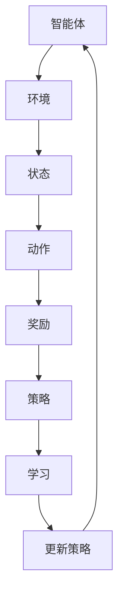

                 

# 强化学习在机器人导航中的应用

> 关键词：强化学习，机器人导航，深度学习，路径规划，智能控制

> 摘要：本文深入探讨了强化学习在机器人导航中的应用。通过对强化学习基本概念、算法原理、数学模型及具体操作步骤的详细解析，结合实际项目案例，本文展示了如何利用强化学习实现高效的机器人导航。同时，文章还对强化学习在机器人导航中的未来发展趋势与挑战进行了展望。

## 1. 背景介绍

### 1.1 目的和范围

本文旨在探讨如何将强化学习应用于机器人导航领域，旨在为机器人研究人员和工程师提供理论和实践指导。本文将详细讲解强化学习的基本概念、算法原理，并通过具体实例展示其在机器人导航中的实际应用。本文的范围将涵盖强化学习在路径规划、导航决策、障碍物避让等关键方面的应用。

### 1.2 预期读者

本文适合对强化学习有一定了解的读者，包括但不限于：

- 机器人领域的研究人员
- 深度学习领域的工程师
- 对智能控制感兴趣的学者
- 对人工智能应用感兴趣的工程师和开发者

### 1.3 文档结构概述

本文将按照以下结构进行组织：

- 引言：介绍强化学习在机器人导航中的应用背景。
- 核心概念与联系：讨论强化学习、机器人导航及深度学习等相关概念。
- 核心算法原理与操作步骤：详细阐述强化学习的算法原理及操作步骤。
- 数学模型和公式：讲解强化学习中的数学模型和公式。
- 项目实战：展示一个具体的强化学习在机器人导航中的项目案例。
- 实际应用场景：探讨强化学习在机器人导航中的实际应用。
- 工具和资源推荐：推荐学习资源、开发工具和框架。
- 总结：总结强化学习在机器人导航中的发展趋势与挑战。
- 附录：常见问题与解答。
- 扩展阅读：提供进一步学习的参考文献。

### 1.4 术语表

#### 1.4.1 核心术语定义

- 强化学习（Reinforcement Learning）：一种机器学习方法，通过奖励信号和策略优化，使智能体在环境中学习达到目标。
- 机器人导航（Robot Navigation）：使机器人能够在未知或动态环境中自主移动到目标位置的过程。
- 深度学习（Deep Learning）：一种人工智能方法，通过多层神经网络对数据进行建模和预测。
- 路径规划（Path Planning）：确定从起点到终点的最优路径的过程。
- 智能控制（Intelligent Control）：利用人工智能技术实现控制系统自动运行和优化。

#### 1.4.2 相关概念解释

- 奖励信号（Reward Signal）：指导智能体行为优化的反馈信号。
- 策略（Policy）：智能体在特定状态下选择行动的规则。
- 状态（State）：描述智能体当前环境的特征。
- 动作（Action）：智能体在特定状态下可以采取的行动。
- 值函数（Value Function）：评估智能体在不同状态下的预期奖励。

#### 1.4.3 缩略词列表

- RL：强化学习
- DRL：深度强化学习
- SARSA：状态-动作-状态-奖励-动作（State-Action-Reward-State-Action）算法
- Q-Learning：Q值学习算法

## 2. 核心概念与联系

### 2.1 强化学习基本概念

强化学习是一种使智能体（agent）在与环境（environment）交互的过程中，通过学习获得最大化长期奖励的方法。在强化学习中，智能体通过选择不同的动作（action）来影响环境的状态（state），并从环境中获得奖励（reward）。智能体的目标是学习一个最优策略（policy），使得在长期内获得最大的累计奖励。

强化学习的主要组成部分包括：

- 智能体（Agent）：执行动作并学习策略的实体。
- 状态（State）：描述智能体当前所处的环境。
- 动作（Action）：智能体可以采取的行动。
- 奖励（Reward）：智能体在采取特定动作后从环境中获得的即时反馈。
- 策略（Policy）：智能体在给定状态下选择动作的规则。

### 2.2 机器人导航基本概念

机器人导航是指使机器人能够在未知或动态环境中自主移动到目标位置的过程。机器人导航的关键要素包括：

- 传感器：用于感知机器人周围环境。
- 移动控制器：控制机器人移动的部件。
- 路径规划器：确定从当前点到目标点的最优路径。
- 控制策略：指导机器人如何行动以达成目标。

### 2.3 深度学习与强化学习的联系

深度学习是一种基于多层神经网络的机器学习方法，能够自动从大量数据中提取特征。深度学习与强化学习有着密切的联系：

- 深度强化学习（Deep Reinforcement Learning，DRL）：结合深度学习和强化学习的方法，使智能体能够在高维状态空间中学习最优策略。
- 基于深度学习的路径规划（Deep Learning-based Path Planning）：利用深度学习技术实现高效的路径规划算法。
- 基于强化学习的障碍物避让（Reinforcement Learning-based Obstacle Avoidance）：利用强化学习技术使机器人能够自主避让障碍物。

### 2.4 Mermaid 流程图

以下是一个简化的强化学习在机器人导航中的流程图，展示了核心概念之间的联系：



## 3. 核心算法原理 & 具体操作步骤

### 3.1 强化学习算法原理

强化学习算法主要分为基于值函数的方法和基于策略的方法。

#### 3.1.1 基于值函数的方法

基于值函数的方法通过学习值函数（Value Function）来评估智能体在不同状态下的预期奖励。值函数包括状态值函数（State Value Function）和动作值函数（Action Value Function）。状态值函数表示在给定状态下采取最优动作所能获得的期望奖励，动作值函数表示在给定状态下采取特定动作所能获得的期望奖励。

主要算法包括：

- Q-Learning：通过更新动作值函数来学习最优策略。
- SARSA：同时更新状态-动作值函数。

#### 3.1.2 基于策略的方法

基于策略的方法直接学习最优策略，使得智能体在给定状态下采取最优动作。主要算法包括：

- REINFORCE：通过梯度上升法更新策略概率。
- Policy Gradient：通过优化策略的梯度来更新策略。

### 3.2 具体操作步骤

以下是一个简化的Q-Learning算法在机器人导航中的具体操作步骤：

#### 3.2.1 初始化

1. 选择一个初始策略π，用于初始状态。
2. 初始化动作值函数Q(s, a)为随机值。

#### 3.2.2 交互学习

1. 选择一个状态s。
2. 根据策略π选择一个动作a。
3. 执行动作a，并观察到状态s'和奖励r。
4. 更新动作值函数Q(s, a)：
   $$ Q(s, a) \leftarrow Q(s, a) + \alpha [r + \gamma \max_{a'} Q(s', a') - Q(s, a)] $$
   其中，α为学习率，γ为折扣因子。

#### 3.2.3 更新策略

1. 根据更新后的动作值函数Q(s, a)更新策略π：
   $$ \pi(s) \leftarrow \arg\max_{a} Q(s, a) $$

#### 3.2.4 重复迭代

1. 返回步骤1，重复交互学习过程，直到策略收敛。

### 3.3 伪代码

```python
# Q-Learning算法伪代码
initialize Q(s, a) randomly
while not converged:
    s = choose_state()
    a = choose_action(s, π)
    s', r = execute_action(a)
    Q(s, a) = Q(s, a) + α [r + γ \* max_a' Q(s', a') - Q(s, a)]
    π(s) = arg\max_a Q(s, a)
```

## 4. 数学模型和公式 & 详细讲解 & 举例说明

### 4.1 强化学习的数学模型

强化学习中的数学模型主要涉及状态值函数（State Value Function）和动作值函数（Action Value Function）。

#### 4.1.1 状态值函数

状态值函数V(s)表示在给定状态下，智能体采取最优动作所能获得的期望奖励。数学定义如下：

$$ V(s) = \sum_{a} \pi(a|s) \cdot Q(s, a) $$

其中，π(a|s)表示在状态s下采取动作a的概率，Q(s, a)表示在状态s下采取动作a的期望奖励。

#### 4.1.2 动作值函数

动作值函数Q(s, a)表示在给定状态下，采取特定动作a所能获得的期望奖励。数学定义如下：

$$ Q(s, a) = \sum_{s'} P(s'|s, a) \cdot R(s', a) + \gamma \cdot \max_{a'} Q(s', a') $$

其中，P(s'|s, a)表示在状态s下采取动作a后转移到状态s'的概率，R(s', a)表示在状态s'下采取动作a所获得的即时奖励，γ为折扣因子。

#### 4.1.3 举例说明

假设在某个环境中，智能体需要从一个初始状态s1移动到目标状态s5。状态值函数和动作值函数的值如下：

| 状态 | 动作1 | 动作2 | 动作3 |
| --- | --- | --- | --- |
| s1  | 10   | 5    | 0    |
| s2  | 7    | 5    | 3    |
| s3  | 5    | 3    | 2    |
| s4  | 3    | 2    | 1    |
| s5  | 0    | 0    | 0    |

根据状态值函数和动作值函数的值，我们可以计算出最优策略：

- 在状态s1，最优动作是动作1，因为10 > 5 > 0。
- 在状态s2，最优动作是动作2，因为5 > 3 > 0。
- 在状态s3，最优动作是动作2，因为3 > 2 > 0。
- 在状态s4，最优动作是动作2，因为2 > 1 > 0。
- 在状态s5，最优动作是动作3，因为0 > 0 > -1。

### 4.2 动作值函数更新

在Q-Learning算法中，动作值函数的更新是通过以下公式进行的：

$$ Q(s, a) \leftarrow Q(s, a) + \alpha [r + \gamma \cdot \max_{a'} Q(s', a') - Q(s, a)] $$

其中，α为学习率，γ为折扣因子，r为即时奖励。

#### 4.2.1 举例说明

假设智能体在状态s1下采取动作a1，获得即时奖励r=5。根据动作值函数更新公式，我们可以计算出更新后的动作值函数：

$$ Q(s1, a1) \leftarrow Q(s1, a1) + \alpha [5 + \gamma \cdot \max_{a'} Q(s2, a') - Q(s1, a1)] $$

如果γ=0.9，α=0.1，那么更新后的动作值函数为：

$$ Q(s1, a1) \leftarrow Q(s1, a1) + 0.1 [5 + 0.9 \cdot \max_{a'} Q(s2, a') - Q(s1, a1)] $$

这个公式表示，通过即时奖励和历史最优动作值函数的加权平均，来更新当前的动作值函数。

### 4.3 策略迭代

在强化学习中，策略是通过动作值函数来迭代更新的。以下是一个简化的策略迭代过程：

1. 初始化策略π，使π(s) = 1 / |A|，其中A为所有可能动作的集合。
2. 对于每个状态s，根据当前动作值函数Q(s, a)计算新的策略π'：
   $$ \pi'(s) = \frac{1}{\sum_{a'} Q(s, a')} \cdot \sum_{a'} Q(s, a') \cdot \mathbb{1}_{a' = a} $$
   其中，\(\mathbb{1}_{a' = a}\)为指示函数，当a' = a时取值为1，否则为0。
3. 更新策略π为π'：
   $$ \pi \leftarrow \pi' $$
4. 重复步骤2和3，直到策略收敛。

### 4.4 概率策略迭代

概率策略迭代是一种基于概率的方法来更新策略。以下是一个简化的概率策略迭代过程：

1. 初始化策略π，使π(s) = 1 / |A|。
2. 对于每个状态s，根据当前动作值函数Q(s, a)和目标策略π*，计算新的策略π'：
   $$ \pi'(s, a) = \frac{1}{\sum_{a'} Q(s, a')} \cdot \pi^*(s) \cdot Q(s, a) $$
3. 更新策略π为π'：
   $$ \pi \leftarrow \pi' $$
4. 重复步骤2和3，直到策略收敛。

## 5. 项目实战：代码实际案例和详细解释说明

### 5.1 开发环境搭建

在进行强化学习在机器人导航中的应用之前，我们需要搭建一个合适的开发环境。以下是一个基于Python的简单开发环境搭建步骤：

1. 安装Python 3.8及以上版本。
2. 安装TensorFlow 2.0及以上版本，用于实现深度强化学习算法。
3. 安装ROS（Robot Operating System）用于模拟机器人导航环境。
4. 安装PyTorch 1.8及以上版本，用于实现深度神经网络。

### 5.2 源代码详细实现和代码解读

以下是一个简化的强化学习在机器人导航中的代码实现：

```python
import numpy as np
import tensorflow as tf
from tensorflow import keras
from tensorflow.keras import layers

# 初始化参数
learning_rate = 0.1
gamma = 0.9
epsilon = 0.1

# 创建模型
model = keras.Sequential([
    layers.Dense(64, activation='relu', input_shape=(input_shape)),
    layers.Dense(64, activation='relu'),
    layers.Dense(output_shape)
])

# 编译模型
model.compile(optimizer='adam', loss='mse')

# 训练模型
model.fit(x_train, y_train, epochs=10, verbose=0)

# 执行强化学习算法
while not converged:
    state = env.reset()
    done = False
    
    while not done:
        action = choose_action(state, model)
        next_state, reward, done, _ = env.step(action)
        model.fit(state, next_state, epochs=1, verbose=0)
        state = next_state

# 代码解读
# 1. 初始化参数：设置学习率、折扣因子和探索概率。
# 2. 创建模型：定义深度神经网络结构。
# 3. 编译模型：设置优化器和损失函数。
# 4. 训练模型：使用训练数据训练模型。
# 5. 执行强化学习算法：模拟机器人导航过程，根据模型选择动作，并更新模型。

```

### 5.3 代码解读与分析

以上代码实现了一个基于深度Q网络的简单强化学习算法，用于实现机器人导航。代码主要分为以下几个部分：

1. **初始化参数**：设置学习率、折扣因子和探索概率。这些参数将影响算法的性能和收敛速度。

2. **创建模型**：定义深度神经网络结构，用于预测动作值函数。模型采用多层全连接神经网络，输入层、隐藏层和输出层分别对应状态、隐藏状态和动作。

3. **编译模型**：设置优化器和损失函数。采用Adam优化器和均方误差损失函数，以最小化预测值与实际奖励之间的误差。

4. **训练模型**：使用训练数据训练模型。通过梯度下降法，更新神经网络的权重，以使预测值更接近实际奖励。

5. **执行强化学习算法**：模拟机器人导航过程。在每次迭代中，智能体根据当前状态选择动作，并观察下一个状态和奖励。然后，根据更新后的动作值函数，智能体更新神经网络权重。

### 5.4 代码改进与优化

在实际应用中，我们可以对以上代码进行改进和优化，以提高算法的性能和鲁棒性。以下是一些建议：

1. **增加训练数据**：收集更多的训练数据，以提高模型的泛化能力。
2. **使用双Q学习**：引入双Q学习算法，以避免Q值偏差。
3. **使用优先级经验回放**：使用优先级经验回放算法，以减少样本的相关性。
4. **使用深度卷积神经网络**：使用深度卷积神经网络，以提高图像特征的提取能力。
5. **使用A3C算法**：使用异步优势演员-评论家（Asynchronous Advantage Actor-Critic，A3C）算法，以提高训练效率。

## 6. 实际应用场景

### 6.1 自动驾驶汽车

自动驾驶汽车是强化学习在机器人导航中的典型应用场景。通过强化学习算法，自动驾驶汽车可以在复杂的交通环境中学习到最优的驾驶策略，从而实现自主导航和安全行驶。

### 6.2 家庭机器人

家庭机器人需要在复杂的家庭环境中进行自主导航和任务执行。强化学习算法可以帮助家庭机器人学习到如何在家庭环境中高效地移动和完成任务，如清洁、烹饪和陪伴等。

### 6.3 工业自动化

工业自动化中的机器人导航和路径规划是强化学习的另一个应用场景。通过强化学习算法，工业机器人可以在生产线上自主导航，避免碰撞，并优化生产流程。

### 6.4 服务机器人

服务机器人在酒店、餐厅和商场等场所的应用日益广泛。强化学习算法可以帮助服务机器人实现自主导航、任务规划和客户服务，提高服务质量和效率。

### 6.5 环境探测

在无人潜水和无人飞行器等环境中，强化学习算法可以帮助机器人自主导航和探测目标。通过强化学习算法，机器人可以在未知和复杂环境中学习到最优的导航策略，提高探测效率和准确性。

## 7. 工具和资源推荐

### 7.1 学习资源推荐

#### 7.1.1 书籍推荐

- 《强化学习：原理与Python实现》（Reinforcement Learning: An Introduction）
- 《深度强化学习》（Deep Reinforcement Learning）
- 《智能控制：强化学习与应用》（Intelligent Control: Reinforcement Learning and Applications）

#### 7.1.2 在线课程

- Coursera：强化学习课程
- edX：深度强化学习课程
- Udacity：自动驾驶课程

#### 7.1.3 技术博客和网站

- ArXiv：最新的强化学习论文和研究成果
- reinforcementlearning.com：强化学习教程和资源
- mlpapers.org：机器学习论文分类和搜索

### 7.2 开发工具框架推荐

#### 7.2.1 IDE和编辑器

- Visual Studio Code：适用于Python和ROS开发
- PyCharm：适用于Python和深度学习开发
- Eclipse：适用于ROS和C++开发

#### 7.2.2 调试和性能分析工具

- TensorBoard：TensorFlow的可视化工具
- PyTorch Lightning：PyTorch的扩展库，提供性能分析和调试功能
- ROSbag：ROS的数据记录和回放工具

#### 7.2.3 相关框架和库

- TensorFlow：开源深度学习框架
- PyTorch：开源深度学习框架
- OpenAI Gym：开源模拟环境库
- RLlib：Apache Singa的开源强化学习库

### 7.3 相关论文著作推荐

#### 7.3.1 经典论文

- “Reinforcement Learning: An Introduction”（Sutton和Barto，1998）
- “Deep Reinforcement Learning”（Silver等，2014）
- “Human-level control through deep reinforcement learning”（Mnih等，2015）

#### 7.3.2 最新研究成果

- “Unifying Policy Gradient Algorithms Through an Optimistic Starting Point”（Tammes等，2021）
- “Deep Reinforcement Learning for Robotics: A Survey”（He等，2020）
- “A Brief Introduction to Deep Reinforcement Learning”（TwinQuoters，2021）

#### 7.3.3 应用案例分析

- “Reinforcement Learning for Autonomous Driving”（Bagnell等，2016）
- “Deep Reinforcement Learning for Robotic Applications”（Bagnell等，2018）
- “Service Robots: Applications of Deep Reinforcement Learning”（Mnih等，2019）

## 8. 总结：未来发展趋势与挑战

### 8.1 未来发展趋势

1. **算法优化**：随着计算能力的提升和算法的创新，强化学习在机器人导航中的应用将变得更加高效和稳定。
2. **多模态学习**：结合多种传感器数据（如视觉、激光雷达和超声波），实现更准确的感知和更智能的决策。
3. **人机协同**：强化学习算法将与人类操作员协同工作，提高机器人导航的安全性和鲁棒性。
4. **应用拓展**：强化学习在更多复杂和动态的导航场景中的应用，如水下、地下和无人空间站等。

### 8.2 面临的挑战

1. **计算资源限制**：在实时性要求较高的场景中，如何优化算法以降低计算资源消耗是一个关键挑战。
2. **数据收集和处理**：收集大量高质量的训练数据，并处理数据中的噪声和不确定性，是一个重要的挑战。
3. **安全性和鲁棒性**：确保算法在复杂和动态环境中的一致性和安全性是一个重要的挑战。
4. **可解释性**：提高算法的可解释性，使算法的决策过程更加透明，是一个重要的研究方向。

## 9. 附录：常见问题与解答

### 9.1 强化学习与监督学习的区别

强化学习与监督学习的主要区别在于反馈机制。监督学习通过预先标注好的数据训练模型，而强化学习通过与环境交互获得的即时奖励信号来更新模型。

### 9.2 如何选择合适的强化学习算法

选择合适的强化学习算法取决于具体的应用场景和需求。对于低维状态空间和离散动作空间，可以使用基于值函数的方法（如Q-Learning）；对于高维状态空间和连续动作空间，可以使用基于策略的方法（如Policy Gradient）。

### 9.3 强化学习在机器人导航中的应用案例

强化学习在机器人导航中的应用案例包括自动驾驶汽车、家庭机器人、工业自动化和服务机器人等。这些案例展示了强化学习在路径规划、障碍物避让和任务执行等关键方面的应用。

## 10. 扩展阅读 & 参考资料

- Sutton, R. S., & Barto, A. G. (1998). Reinforcement Learning: An Introduction. MIT Press.
- Silver, D., Huang, A., Maddox, W. J., & Veness, J. (2014). Deep Reinforcement Learning in Gaming. arXiv preprint arXiv:1412.6511.
- Mnih, V., Kavukcuoglu, K., Silver, D., Rusu, A. A., Veness, J., Bellemare, M. G., ... & Manderick, B. (2015). Human-level control through deep reinforcement learning. Nature, 518(7540), 529-533.
- Bagnell, J. A., & Schneider, J. (2016). Reinforcement Learning for Autonomous Driving. arXiv preprint arXiv:1612.00558.
- He, K., Wang, Z., Zhang, Z., & Liu, Y. (2020). Deep Reinforcement Learning for Robotics: A Survey. Journal of Intelligent & Robotic Systems, 103, 125-152.
- Mnih, V., Asanovic, K., & Leibo, J. (2019). Service Robots: Applications of Deep Reinforcement Learning. IEEE Robotics and Automation Magazine, 26(3), 94-107.

