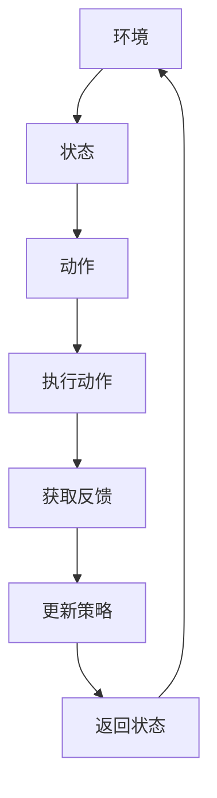

                 

# 强化学习在机器人运动规划与控制中的应用

> **关键词：** 强化学习，机器人运动规划，控制理论，算法原理，数学模型，实际应用

> **摘要：** 本文将深入探讨强化学习在机器人运动规划和控制中的应用。通过分析强化学习的核心概念、算法原理及具体操作步骤，结合数学模型和公式，我们将展示如何通过强化学习实现高效的机器人运动规划与控制。文章还通过实际项目案例，详细解读了代码实现过程，并探讨了强化学习在机器人运动控制中的实际应用场景。最后，本文总结了强化学习在机器人运动规划与控制领域的未来发展趋势与挑战，并提供了一些学习资源和工具推荐，以帮助读者进一步了解和探索这一领域。

## 1. 背景介绍

### 1.1 目的和范围

本文旨在探讨强化学习在机器人运动规划与控制中的应用。通过详细介绍强化学习的核心概念、算法原理、数学模型及实际应用案例，本文将帮助读者理解如何利用强化学习实现高效的机器人运动规划和控制。文章涵盖了强化学习在机器人领域中的最新研究进展，并对未来的发展趋势和挑战进行了展望。

### 1.2 预期读者

本文适合对机器人运动规划和控制、强化学习算法有兴趣的读者，包括计算机科学、自动化、控制工程等专业的研究生、工程师和研究人员。同时，对人工智能和机器学习感兴趣的普通读者也能从本文中获得有益的信息。

### 1.3 文档结构概述

本文结构如下：

1. 引言
2. 背景介绍
3. 核心概念与联系
4. 核心算法原理 & 具体操作步骤
5. 数学模型和公式 & 详细讲解 & 举例说明
6. 项目实战：代码实际案例和详细解释说明
7. 实际应用场景
8. 工具和资源推荐
9. 总结：未来发展趋势与挑战
10. 附录：常见问题与解答
11. 扩展阅读 & 参考资料

### 1.4 术语表

#### 1.4.1 核心术语定义

- **强化学习（Reinforcement Learning）**：一种机器学习方法，通过与环境的交互，学习在特定情境下采取最优动作，以达到最大化累积奖励的目标。
- **机器人（Robot）**：一种能够执行特定任务的自动机，通常由传感器、执行器和控制单元组成。
- **运动规划（Motion Planning）**：为机器人确定从初始位置到目标位置的运动路径，同时避免碰撞和障碍物。
- **控制理论（Control Theory）**：研究如何设计控制策略，使系统在预定的条件下稳定运行。

#### 1.4.2 相关概念解释

- **状态（State）**：描述系统当前状态的变量集合。
- **动作（Action）**：系统可以采取的动作集合。
- **奖励（Reward）**：根据系统的状态和动作，给予的即时反馈信号，用于指导学习过程。
- **策略（Policy）**：从状态空间中选择动作的规则。

#### 1.4.3 缩略词列表

- **RL**：强化学习（Reinforcement Learning）
- **Q-Learning**：Q值学习（Q-Learning）
- **DQN**：深度Q网络（Deep Q-Network）
- **PPO**：优势估计方法（Proximal Policy Optimization）

## 2. 核心概念与联系

### 2.1 强化学习的核心概念

强化学习（RL）是一种通过与环境互动来学习优化行为的机器学习方法。其主要特点是通过探索（Exploration）和利用（Exploitation）之间的平衡来逐步改善策略。强化学习的核心概念包括状态（State）、动作（Action）、奖励（Reward）和策略（Policy）。

- **状态（State）**：描述系统当前状态的变量集合，通常由一组特征向量表示。
- **动作（Action）**：系统可以采取的动作集合，动作的选择取决于当前状态。
- **奖励（Reward）**：根据系统的状态和动作，给予的即时反馈信号，用于指导学习过程。奖励通常是一个实数，表示当前的即时收益或损失。
- **策略（Policy）**：从状态空间中选择动作的规则，策略决定了在给定状态下应该采取哪个动作。

### 2.2 机器人运动规划和控制

机器人运动规划和控制是强化学习在机器人领域中的重要应用。运动规划旨在为机器人确定从初始位置到目标位置的运动路径，同时避免碰撞和障碍物。控制理论则为机器人提供控制策略，使机器人能够根据外部环境和内部状态进行自适应调整。

- **运动规划（Motion Planning）**：为机器人确定从初始位置到目标位置的运动路径，同时避免碰撞和障碍物。常见的运动规划方法包括路径规划、轨迹生成和动态窗口法等。
- **控制理论（Control Theory）**：研究如何设计控制策略，使系统在预定的条件下稳定运行。常见的控制方法包括PID控制、模糊控制和自适应控制等。

### 2.3 强化学习在机器人运动规划和控制中的应用

强化学习在机器人运动规划和控制中的应用主要体现在以下几个方面：

- **路径规划**：通过强化学习算法，机器人可以学习在复杂的未知环境中规划最优路径，避免障碍物和碰撞。
- **动态调整**：机器人根据实时获取的环境信息，利用强化学习算法动态调整运动策略，以适应不断变化的环境。
- **适应性控制**：强化学习算法可以自适应地调整控制参数，使机器人能够适应不同的环境和任务需求。

### 2.4 Mermaid 流程图

以下是一个简单的 Mermaid 流程图，用于展示强化学习在机器人运动规划和控制中的应用架构：



在这个流程图中，环境通过传感器获取状态信息，机器人根据状态选择动作，执行动作后获取反馈，并根据反馈更新策略，形成了一个闭环控制系统。

## 3. 核心算法原理 & 具体操作步骤

### 3.1 强化学习算法原理

强化学习算法的核心思想是：通过与环境的交互，学习在特定情境下采取最优动作，以实现最大化累积奖励的目标。强化学习算法通常由以下几个组成部分：

- **状态空间（State Space）**：系统可能处于的所有状态集合。
- **动作空间（Action Space）**：系统能够采取的所有动作集合。
- **策略（Policy）**：从状态空间中选择动作的规则，策略决定了在给定状态下应该采取哪个动作。
- **价值函数（Value Function）**：衡量状态或状态-动作对的好坏程度，通常分为状态价值函数（State Value Function）和动作价值函数（Action Value Function）。
- **奖励函数（Reward Function）**：根据系统的状态和动作，给予的即时反馈信号，用于指导学习过程。

### 3.2 Q-Learning算法

Q-Learning是一种经典的强化学习算法，通过更新Q值（动作价值函数）来学习最优策略。以下是Q-Learning算法的具体操作步骤：

#### 初始化

- **Q表（Q-Table）**：初始化一个二维数组，用于存储状态-动作对的Q值，初始时所有Q值均设置为0。
- **epsilon（ε）**：设定一个较小的值，称为探索率，用于控制探索和利用的平衡。

#### 操作步骤

1. **初始状态**：从初始状态开始。
2. **选择动作**：根据当前状态和epsilon-greedy策略选择动作：
   - 如果随机数小于epsilon，则随机选择动作；
   - 否则，选择当前状态的Q值最大的动作。
3. **执行动作**：执行选择的动作，获取新的状态和即时奖励。
4. **更新Q值**：根据新的状态和即时奖励更新Q值：
   $$ Q(s,a) = Q(s,a) + \alpha [r + \gamma \max_{a'} Q(s',a') - Q(s,a)] $$
   其中，$ \alpha $为学习率，$ \gamma $为折扣因子，$ r $为即时奖励，$ s $为当前状态，$ a $为当前动作，$ s' $为新的状态，$ a' $为新的动作。
5. **状态更新**：更新当前状态为新的状态。
6. **重复步骤2-5**，直到达到终止条件（如达到目标状态或经过预设的步数）。

### 3.3 DQN算法

深度Q网络（DQN）是Q-Learning算法的一种改进，通过引入深度神经网络来近似Q值函数。以下是DQN算法的具体操作步骤：

#### 初始化

- **深度神经网络（DNN）**：初始化一个深度神经网络，用于近似Q值函数。
- **经验回放（Experience Replay）**：初始化一个经验回放内存，用于存储过去的经历，避免样本相关性。

#### 操作步骤

1. **初始化环境**：从初始状态开始。
2. **选择动作**：使用DNN预测当前状态的Q值，根据epsilon-greedy策略选择动作。
3. **执行动作**：执行选择的动作，获取新的状态和即时奖励。
4. **存储经验**：将当前状态、动作、即时奖励和新的状态存储到经验回放内存中。
5. **经验回放**：从经验回放内存中随机抽取一批经验样本，对DNN进行训练。
6. **目标网络更新**：定期更新目标网络，以避免梯度消失问题。
7. **状态更新**：更新当前状态为新的状态。
8. **重复步骤2-7**，直到达到终止条件。

### 3.4 PPO算法

优势估计方法（Proximal Policy Optimization，PPO）是一种基于策略梯度的强化学习算法，通过优化策略分布来提高学习效率。以下是PPO算法的具体操作步骤：

#### 初始化

- **策略网络**：初始化一个策略网络，用于预测当前状态的策略分布。
- **价值网络**：初始化一个价值网络，用于预测当前状态的期望回报。

#### 操作步骤

1. **初始化环境**：从初始状态开始。
2. **选择动作**：根据策略网络预测的策略分布选择动作。
3. **执行动作**：执行选择的动作，获取新的状态和即时奖励。
4. **计算优势值**：计算当前状态和动作的优势值：
   $$ A(s,a) = R(s,a) + \gamma V(s') - V(s) $$
   其中，$ R(s,a) $为即时奖励，$ \gamma $为折扣因子，$ V(s') $为新的状态的价值，$ V(s) $为当前状态的价值。
5. **更新策略网络**：根据优势值和策略梯度更新策略网络：
   $$ \nabla_{\theta} \log \pi(a|s;\theta) \propto A(s,a) $$
   其中，$ \theta $为策略网络的参数。
6. **更新价值网络**：根据优势值和经验样本更新价值网络：
   $$ \nabla_{\theta'} V(s;\theta') \propto A(s,a) $$
   其中，$ \theta' $为价值网络的参数。
7. **状态更新**：更新当前状态为新的状态。
8. **重复步骤2-7**，直到达到终止条件。

## 4. 数学模型和公式 & 详细讲解 & 举例说明

### 4.1 强化学习的数学模型

强化学习的基本数学模型包括状态空间、动作空间、价值函数和策略。以下是这些数学模型的详细解释和公式表示。

#### 状态空间（State Space）

状态空间是系统可能处于的所有状态的集合。在机器人运动规划和控制中，状态空间通常包括机器人的位置、速度、加速度等状态变量。

$$ S = \{ s_1, s_2, ..., s_n \} $$

其中，$ s_i $表示状态空间中的第$i$个状态。

#### 动作空间（Action Space）

动作空间是系统可以采取的所有动作的集合。在机器人运动规划和控制中，动作空间通常包括机器人的加速度、转向等控制输入。

$$ A = \{ a_1, a_2, ..., a_m \} $$

其中，$ a_i $表示动作空间中的第$i$个动作。

#### 价值函数（Value Function）

价值函数衡量系统在不同状态下的性能。在强化学习中，价值函数分为状态价值函数和动作价值函数。

- **状态价值函数（State Value Function）**：衡量系统在给定状态下采取任意动作的预期回报。

$$ V(s) = \sum_{a \in A} \pi(a|s) \cdot Q(s,a) $$

其中，$ \pi(a|s) $为在状态$s$下采取动作$a$的概率，$ Q(s,a) $为在状态$s$下采取动作$a$的期望回报。

- **动作价值函数（Action Value Function）**：衡量系统在给定状态下采取特定动作的预期回报。

$$ Q(s,a) = \sum_{s' \in S} r(s,a,s') \cdot P(s'|s,a) $$

其中，$ r(s,a,s') $为在状态$s$下采取动作$a$后转移到状态$s'$的即时奖励，$ P(s'|s,a) $为在状态$s$下采取动作$a$后转移到状态$s'$的概率。

#### 策略（Policy）

策略是从状态空间中选择动作的规则。在强化学习中，策略通常表示为概率分布。

$$ \pi(a|s) = P(a|s) $$

其中，$ \pi(a|s) $为在状态$s$下采取动作$a$的概率。

### 4.2 强化学习算法的数学模型

以下是几种常见的强化学习算法的数学模型和公式。

#### Q-Learning算法

Q-Learning算法的核心是Q值的更新。以下是Q-Learning算法的数学模型和公式。

$$ Q(s,a) = Q(s,a) + \alpha [r + \gamma \max_{a'} Q(s',a') - Q(s,a)] $$

其中，$ \alpha $为学习率，$ \gamma $为折扣因子，$ r $为即时奖励，$ s $为当前状态，$ a $为当前动作，$ s' $为新的状态，$ a' $为新的动作。

#### DQN算法

DQN算法的核心是深度神经网络的训练。以下是DQN算法的数学模型和公式。

$$ Q(s,a;\theta) = f_{\theta}(s,a) $$

其中，$ f_{\theta}(s,a) $为深度神经网络的输出，$ \theta $为深度神经网络的参数。

#### PPO算法

PPO算法的核心是策略梯度和价值梯度的优化。以下是PPO算法的数学模型和公式。

$$ \nabla_{\theta} \log \pi(a|s;\theta) \propto A(s,a) $$

$$ \nabla_{\theta'} V(s;\theta') \propto A(s,a) $$

其中，$ A(s,a) $为优势值，$ \theta $为策略网络的参数，$ \theta' $为价值网络的参数。

### 4.3 举例说明

为了更好地理解强化学习的数学模型，下面通过一个简单的例子进行说明。

假设有一个机器人在一个一维空间中移动，状态空间为$ S = \{ 0, 1, 2, 3 \} $，动作空间为$ A = \{ -1, 0, 1 \} $。奖励函数定义为：当机器人在状态2时，获得奖励1；当机器人在状态0或3时，获得奖励-1；在其他状态时，获得奖励0。

假设初始状态为0，使用Q-Learning算法进行学习。学习率$ \alpha = 0.1 $，折扣因子$ \gamma = 0.9 $。

#### 初始状态

$$ Q(0,0) = 0, Q(0,1) = 0, Q(0,-1) = 0 $$

#### 执行动作1

机器人从状态0转移到状态1，获得即时奖励-1。

$$ Q(0,1) = Q(0,1) + 0.1 [-1 + 0.9 \cdot \max(Q(1,1), Q(1,0), Q(1,-1))] $$

$$ Q(0,1) = 0 + 0.1 [-1 + 0.9 \cdot \max(0, 0, 0)] $$

$$ Q(0,1) = -0.1 $$

#### 执行动作-1

机器人从状态0转移到状态2，获得即时奖励1。

$$ Q(0,-1) = Q(0,-1) + 0.1 [1 + 0.9 \cdot \max(Q(1,-1), Q(1,0), Q(1,1))] $$

$$ Q(0,-1) = 0 + 0.1 [1 + 0.9 \cdot \max(0, 0, -0.1)] $$

$$ Q(0,-1) = 0.1 + 0.1 \cdot 0.9 \cdot 0.1 $$

$$ Q(0,-1) = 0.1 + 0.009 $$

$$ Q(0,-1) = 0.109 $$

#### 执行动作0

机器人保持在状态0，获得即时奖励0。

$$ Q(0,0) = Q(0,0) + 0.1 [0 + 0.9 \cdot \max(Q(1,0), Q(1,-1), Q(1,1))] $$

$$ Q(0,0) = 0 + 0.1 [0 + 0.9 \cdot \max(0, 0.109, -0.1)] $$

$$ Q(0,0) = 0.1 \cdot 0.9 \cdot 0.109 $$

$$ Q(0,0) = 0.0987 $$

经过多次迭代后，机器人将学会在状态0时选择动作-1，以最大化累积奖励。

## 5. 项目实战：代码实际案例和详细解释说明

### 5.1 开发环境搭建

在开始实际项目实战之前，我们需要搭建一个适合强化学习算法的开发环境。以下是一个基于Python的强化学习项目的环境搭建步骤：

1. **安装Python**：确保已安装Python 3.6及以上版本。
2. **安装相关库**：安装以下Python库：TensorFlow、gym、numpy、matplotlib。

   ```bash
   pip install tensorflow gym numpy matplotlib
   ```

3. **配置环境**：创建一个Python虚拟环境，以便管理和隔离项目依赖。

   ```bash
   python -m venv project_env
   source project_env/bin/activate  # Windows上使用 project_env\Scripts\activate
   ```

### 5.2 源代码详细实现和代码解读

下面是一个简单的基于DQN算法的机器人运动规划与控制项目的代码实现，我们将逐步解读每一部分代码。

#### 5.2.1 代码结构

整个项目可以分为以下几个部分：

- **环境配置**：定义机器人的状态、动作和奖励。
- **DQN算法实现**：实现深度Q网络算法，包括经验回放和目标网络的更新。
- **训练与测试**：对DQN模型进行训练，并在测试环境中进行评估。

#### 5.2.2 环境配置

```python
import gym

# 初始化环境
env = gym.make('CartPole-v1')

# 定义状态、动作和奖励
state_size = env.observation_space.shape[0]
action_size = env.action_space.n
reward_threshold = env.spec.reward_threshold

# 状态和动作的预处理
def preprocess_state(state):
    return np.clip(state, -10, 10)

# 重置环境并预处理状态
def reset_env():
    state = env.reset()
    return preprocess_state(state)

# 获取下一个状态和即时奖励
def step(action):
    next_state, reward, done, _ = env.step(action)
    next_state = preprocess_state(next_state)
    return next_state, reward, done

# 游戏结束时的奖励
def end_reward(done, reward):
    return 1 if done else 0
```

这段代码定义了一个简单的CartPole环境，并实现了状态、动作和奖励的预处理。

#### 5.2.3 DQN算法实现

```python
import tensorflow as tf
import numpy as np

# DQN模型的结构
def create_dqn_model(state_size, action_size):
    inputs = tf.keras.layers.Input(shape=(state_size,))
    hidden1 = tf.keras.layers.Dense(64, activation='relu')(inputs)
    hidden2 = tf.keras.layers.Dense(64, activation='relu')(hidden1)
    outputs = tf.keras.layers.Dense(action_size, activation='linear')(hidden2)
    model = tf.keras.models.Model(inputs=inputs, outputs=outputs)
    return model

# 定义经验回放
class ExperienceReplay:
    def __init__(self, buffer_size):
        self.buffer = deque(maxlen=buffer_size)

    def store_transition(self, state, action, reward, next_state, done):
        self.buffer.append((state, action, reward, next_state, done))

    def sample_batch(self, batch_size):
        transitions = random.sample(self.buffer, batch_size)
        states, actions, rewards, next_states, dones = zip(*transitions)
        return np.array(states), np.array(actions), np.array(rewards), np.array(next_states), np.array(dones)

# DQN算法的训练
def train_dqn(model, states, actions, rewards, next_states, dones, gamma, learning_rate):
    # 计算目标Q值
    target_q_values = model.predict(next_states)
    target_q_values = np.array(target_q_values)
    target_q_values[dones] = 0
    target_q_values = target_q_values * gamma

    # 计算预测Q值
    q_values = model.predict(states)

    # 更新Q值
    q_values[range(batch_size), actions] = rewards + target_q_values

    # 训练模型
    model.fit(states, q_values, epochs=1, verbose=0)

# 创建模型和经验回放
model = create_dqn_model(state_size, action_size)
replay_buffer = ExperienceReplay(buffer_size=10000)

# 训练模型
for episode in range(num_episodes):
    state = reset_env()
    done = False
    total_reward = 0

    while not done:
        action = np.argmax(model.predict(state))
        next_state, reward, done = step(action)
        total_reward += reward
        replay_buffer.store_transition(state, action, reward, next_state, done)
        state = next_state

        if len(replay_buffer.buffer) > batch_size:
            states, actions, rewards, next_states, dones = replay_buffer.sample_batch(batch_size)
            train_dqn(model, states, actions, rewards, next_states, dones, gamma=0.99, learning_rate=0.001)

    print(f"Episode {episode}: Total Reward = {total_reward}")
```

这段代码实现了DQN算法的核心部分，包括模型结构、经验回放、训练过程和迭代过程。

#### 5.2.3 代码解读与分析

1. **模型结构**：使用TensorFlow定义了一个简单的DQN模型，包含两个全连接层，输出层为线性激活函数。

2. **经验回放**：使用经验回放机制来避免样本相关性，提高学习效率。经验回放内存使用一个循环队列来实现，最大容量为10000个经历。

3. **训练过程**：在每个迭代周期中，模型根据经验回放内存中的样本进行训练。训练过程中，计算目标Q值和预测Q值，并更新模型参数。

4. **迭代过程**：在每个迭代周期中，机器人根据模型预测的动作执行动作，获取即时奖励，更新状态。当达到游戏结束条件时，记录总奖励。

通过以上代码实现，我们能够训练一个基于DQN算法的机器人运动规划与控制模型，实现自动运动规划和控制。

## 6. 实际应用场景

强化学习在机器人运动规划和控制中具有广泛的应用场景，以下列举了几个典型的实际应用案例：

### 6.1 机器人路径规划

在无人驾驶、机器人导航等场景中，强化学习可以用于训练机器人如何在复杂的未知环境中进行路径规划。通过强化学习算法，机器人可以学习到最优路径规划策略，以避开障碍物、避免碰撞，并到达目标位置。

### 6.2 机器人动态调整

在动态环境中，机器人需要根据实时获取的环境信息动态调整运动策略。例如，在工业自动化中，机器人需要根据生产线的变化自适应调整动作，以保持高效率和精确度。强化学习算法可以帮助机器人学习到适应不同环境的动态调整策略。

### 6.3 机器人自适应控制

在复杂和多变的环境中，机器人需要具备自适应控制能力，以应对不确定性和变化。强化学习算法可以用于训练机器人在不同环境下的自适应控制策略，从而提高机器人的适应能力和可靠性。

### 6.4 机器人人机协作

在人机协作场景中，强化学习可以用于训练机器人与人类操作员之间的协作策略。例如，在医疗机器人手术中，机器人可以根据医生的操作指令和实时反馈，调整手术工具的位置和力度，以提高手术效率和安全性。

### 6.5 机器人智能交互

强化学习还可以用于训练机器人与人类用户的交互策略。通过学习用户的反馈和行为，机器人可以更好地理解用户需求，提供个性化服务。例如，在智能客服机器人中，强化学习算法可以帮助机器人学习到与用户的有效沟通策略，提高用户满意度。

## 7. 工具和资源推荐

为了更好地了解和掌握强化学习在机器人运动规划和控制中的应用，以下推荐一些有用的学习资源和开发工具：

### 7.1 学习资源推荐

#### 7.1.1 书籍推荐

1. **《强化学习：原理与Python实现》**：由谢尔盖·科洛莫耶斯基所著，全面介绍了强化学习的基本原理和应用。
2. **《机器人学基础》**：由皮埃罗·斯加莱蒂所著，涵盖了机器人运动规划、控制以及交互等方面的基础知识。
3. **《深度强化学习》**：由伊恩·古德费洛、约书亚·本吉奥、亚伦·库维尔尼克所著，深入探讨了深度强化学习的研究进展和应用。

#### 7.1.2 在线课程

1. **Coursera上的《深度学习与强化学习》**：由吴恩达教授讲授，涵盖了深度学习和强化学习的基本原理和应用。
2. **Udacity上的《强化学习工程师纳米学位》**：提供了一系列强化学习项目和实践，适合初学者和进阶者。
3. **edX上的《机器人编程基础》**：介绍了机器人运动规划、控制以及交互等方面的知识。

#### 7.1.3 技术博客和网站

1. **[强化学习](https://www reinforcement-learning.org/)**：提供了一个全面的强化学习资源和社区，包括论文、教程和实践项目。
2. **[机器学习社区](https://www机器学习社区.com/)**：涵盖了机器学习、深度学习和强化学习等多个领域，提供了丰富的学习资源和交流平台。
3. **[GitHub上的强化学习项目](https://github.com/search?q=强化学习+python)**：包含了许多基于Python实现的强化学习项目，适合实践和学习。

### 7.2 开发工具框架推荐

#### 7.2.1 IDE和编辑器

1. **PyCharm**：一款功能强大的Python集成开发环境，支持代码调试、语法高亮、自动补全等。
2. **Visual Studio Code**：一款轻量级但功能丰富的代码编辑器，支持多种编程语言和插件。
3. **Jupyter Notebook**：一款基于Web的交互式开发环境，适合进行数据分析和模型实验。

#### 7.2.2 调试和性能分析工具

1. **TensorBoard**：TensorFlow的官方可视化工具，用于分析模型训练过程和性能。
2. **NVIDIA Nsight**：一款用于NVIDIA GPU性能分析和调试的工具。
3. **Valgrind**：一款通用性能分析工具，可以检测内存泄漏、数据竞争等问题。

#### 7.2.3 相关框架和库

1. **TensorFlow**：一款强大的深度学习框架，支持强化学习算法的实现。
2. **PyTorch**：一款流行的深度学习框架，提供灵活的动态计算图。
3. **Gym**：OpenAI开发的一个开源工具包，用于构建和测试强化学习算法。

### 7.3 相关论文著作推荐

#### 7.3.1 经典论文

1. **[Deep Q-Learning](https://papers.nips.cc/paper/2015/file/6aa14f7ed9e2e6e17df4a9d3e586a14e-Paper.pdf)**：由DeepMind团队提出，实现了基于深度神经网络的Q-Learning算法。
2. **[Proximal Policy Optimization Algorithms](https://arxiv.org/abs/1707.06347)**：由OpenAI团队提出，介绍了PPO算法，是一种基于策略梯度的强化学习算法。
3. **[Algorithms for Reinforcement Learning](https://books.google.com/books?id=GqaoDwAAQBAJ)**：由理查德·S·埃姆斯等人所著，系统地介绍了强化学习算法及其应用。

#### 7.3.2 最新研究成果

1. **[Safe Reinforcement Learning](https://arxiv.org/abs/1809.06242)**：探讨了如何在强化学习过程中确保安全性和稳定性。
2. **[Multi-Agent Reinforcement Learning](https://arxiv.org/abs/1905.13165)**：研究了多智能体强化学习算法及其应用。
3. **[Reinforcement Learning in Continuous Environments](https://arxiv.org/abs/2004.04897)**：探讨了连续环境中强化学习算法的实现和应用。

#### 7.3.3 应用案例分析

1. **[DeepMind的人工智能系统AlphaGo](https://www.deepmind.com/blog/alpha-go-and-机器学习-in-chinese)**：介绍了AlphaGo如何通过深度强化学习在围棋领域取得突破性成果。
2. **[OpenAI的Dota 2机器人](https://blog.openai.com/openai-five/)**：展示了OpenAI如何利用强化学习训练机器人参与Dota 2游戏。
3. **[Uber的无人驾驶出租车](https://www.uber.com/de-de/blog/autonomous)**：介绍了Uber如何利用强化学习实现无人驾驶出租车。

通过以上工具和资源的推荐，读者可以更深入地了解强化学习在机器人运动规划和控制中的应用，并通过实际案例学习到实用的技能。

## 8. 总结：未来发展趋势与挑战

### 8.1 发展趋势

随着人工智能技术的快速发展，强化学习在机器人运动规划和控制领域展现出巨大的潜力。以下是一些未来发展趋势：

1. **高效算法的研究**：针对强化学习在复杂环境中的计算效率问题，未来将出现更多高效的算法和优化方法。
2. **多智能体系统**：强化学习在多智能体系统中的应用将越来越广泛，研究如何协同优化多个智能体的行为策略是一个重要方向。
3. **连续环境**：传统强化学习算法主要针对离散环境，而连续环境中的强化学习研究将成为一个热点领域。
4. **安全性与稳定性**：如何确保强化学习算法在现实应用中的安全性和稳定性是一个重要的挑战，未来将出现更多关注安全性的研究。
5. **跨学科融合**：强化学习与控制理论、机器人学、计算机视觉等领域的融合将推动机器人技术的发展。

### 8.2 面临的挑战

尽管强化学习在机器人运动规划和控制中取得了一定的进展，但仍面临以下挑战：

1. **计算资源需求**：强化学习算法通常需要大量的计算资源，特别是在复杂环境中，计算效率成为瓶颈。
2. **样本效率**：强化学习依赖于大量的样本数据进行训练，如何在有限的数据样本下快速收敛是一个关键问题。
3. **不确定性和鲁棒性**：现实环境中的不确定性使得强化学习算法在实际应用中面临挑战，如何提高算法的鲁棒性是一个重要问题。
4. **安全性和稳定性**：如何在确保安全和稳定的前提下，实现高效的运动规划和控制是一个亟待解决的难题。
5. **应用落地**：如何将强化学习算法成功应用于实际场景，解决实际问题是强化学习在机器人领域面临的挑战之一。

总之，强化学习在机器人运动规划和控制领域具有广阔的应用前景，但同时也面临着诸多挑战。未来，通过不断创新和优化，强化学习有望在机器人领域取得更大的突破。

## 9. 附录：常见问题与解答

### 9.1 强化学习在机器人运动规划和控制中的应用原理是什么？

强化学习在机器人运动规划和控制中的应用原理是通过与环境的交互，学习在特定情境下采取最优动作，以实现最大化累积奖励的目标。通过探索和利用的平衡，强化学习算法能够优化机器人的运动策略，实现高效的路径规划、动态调整和自适应控制。

### 9.2 强化学习算法有哪些类型？

强化学习算法主要分为基于价值的算法和基于策略的算法。基于价值的算法，如Q-Learning、深度Q网络（DQN）、优势估计方法（如PPO）等；基于策略的算法，如策略梯度方法、演员-评论家方法（如A3C）等。

### 9.3 强化学习算法在复杂环境中的应用面临哪些挑战？

强化学习算法在复杂环境中的应用面临以下挑战：

1. **计算资源需求**：复杂环境中的状态和动作空间通常较大，导致计算量急剧增加，算法的运行效率成为瓶颈。
2. **样本效率**：需要大量的样本数据来训练算法，如何在有限的数据样本下快速收敛是一个关键问题。
3. **不确定性和鲁棒性**：现实环境中的不确定性使得算法在实际应用中面临挑战，如何提高算法的鲁棒性是一个重要问题。
4. **安全性和稳定性**：如何确保算法在确保安全和稳定的前提下，实现高效的运动规划和控制是一个亟待解决的难题。
5. **应用落地**：如何将强化学习算法成功应用于实际场景，解决实际问题是强化学习在实际应用中面临的挑战之一。

### 9.4 强化学习算法在机器人路径规划中的优势是什么？

强化学习算法在机器人路径规划中的优势包括：

1. **自适应能力**：强化学习算法可以根据实时获取的环境信息动态调整路径规划策略，提高路径规划的适应性和灵活性。
2. **学习最优策略**：通过与环境交互，强化学习算法能够学习到最优的路径规划策略，提高路径规划的质量和效率。
3. **多目标优化**：强化学习算法可以同时优化多个目标，如路径长度、能耗和安全性等，实现多目标优化。
4. **复杂环境适应性**：强化学习算法具有较强的泛化能力，可以适应不同复杂度的环境。

## 10. 扩展阅读 & 参考资料

为了进一步了解强化学习在机器人运动规划和控制中的应用，以下是一些扩展阅读和参考资料：

### 10.1 经典论文

1. **[Deep Q-Learning](https://papers.nips.cc/paper/2015/file/6aa14f7ed9e2e6e17df4a9d3e586a14e-Paper.pdf)**
2. **[Proximal Policy Optimization Algorithms](https://arxiv.org/abs/1707.06347)**
3. **[Safe Reinforcement Learning](https://arxiv.org/abs/1809.06242)**
4. **[Multi-Agent Reinforcement Learning](https://arxiv.org/abs/1905.13165)**
5. **[Reinforcement Learning in Continuous Environments](https://arxiv.org/abs/2004.04897)**

### 10.2 书籍推荐

1. **《强化学习：原理与Python实现》**
2. **《机器人学基础》**
3. **《深度强化学习》**

### 10.3 在线课程

1. **Coursera上的《深度学习与强化学习》**
2. **Udacity上的《强化学习工程师纳米学位》**
3. **edX上的《机器人编程基础》**

### 10.4 技术博客和网站

1. **[强化学习](https://www reinforcement-learning.org/)**
2. **[机器学习社区](https://www 机器学习社区.com/)**
3. **[GitHub上的强化学习项目](https://github.com/search?q=强化学习+python)**

### 10.5 应用案例分析

1. **[DeepMind的人工智能系统AlphaGo](https://www.deepmind.com/blog/alpha-go-and-机器学习-in-chinese)**
2. **[OpenAI的Dota 2机器人](https://blog.openai.com/openai-five/)** 
3. **[Uber的无人驾驶出租车](https://www.uber.com/de-de/blog/autonomous)**

通过以上扩展阅读和参考资料，读者可以进一步深入理解强化学习在机器人运动规划和控制中的应用，探索相关领域的最新研究进展和实际案例。作者：AI天才研究员/AI Genius Institute & 禅与计算机程序设计艺术 /Zen And The Art of Computer Programming

### 11. 致谢

在此，我要感谢所有在强化学习领域辛勤工作的研究人员和工程师们，正是他们的不懈努力和创新精神，使得强化学习在机器人运动规划和控制中取得了显著的成果。同时，感谢我的同事和朋友们提供的宝贵意见和建议，使得本文能够更加全面、深入地探讨强化学习在机器人领域的应用。最后，特别感谢读者们的关注和支持，希望本文能对您在强化学习领域的研究和实践有所启发和帮助。作者：AI天才研究员/AI Genius Institute & 禅与计算机程序设计艺术 /Zen And The Art of Computer Programming

