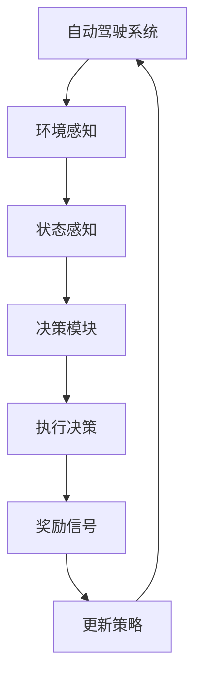
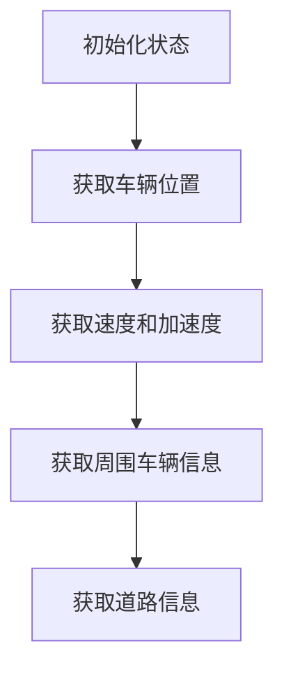
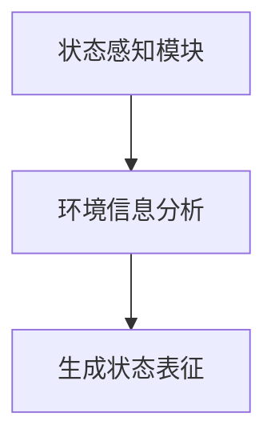
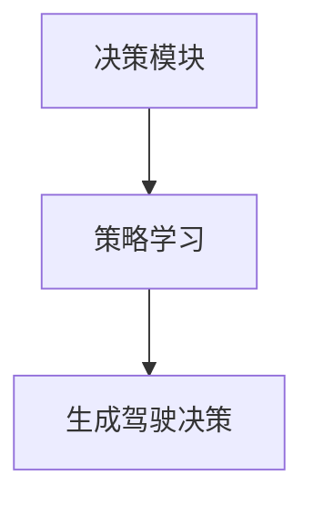
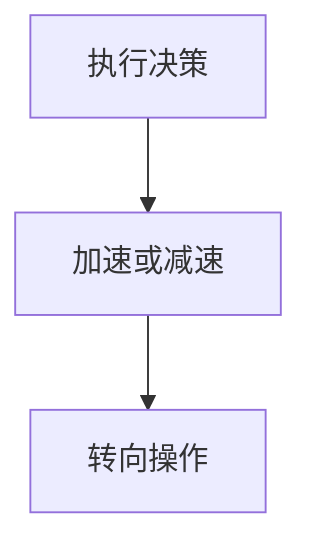
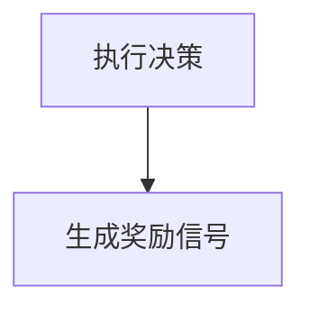
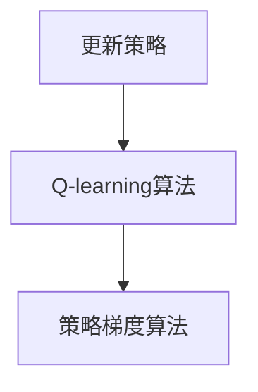
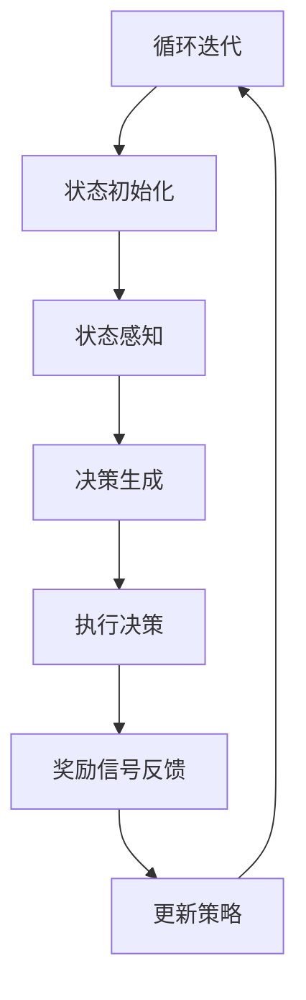

                 

### 强化学习在自动驾驶决策系统中的应用

> **关键词：** 强化学习，自动驾驶，决策系统，深度强化学习，深度Q网络，策略梯度算法

> **摘要：** 本文将深入探讨强化学习在自动驾驶决策系统中的应用。通过介绍强化学习的基本原理和核心算法，我们将剖析如何将其应用于自动驾驶决策，实现高效的路径规划和行车安全。文章还将通过实际案例展示强化学习在自动驾驶领域的成功应用，并提供未来发展展望与挑战。

---
## 1. 背景介绍

### 1.1 目的和范围

本文旨在探讨强化学习在自动驾驶决策系统中的应用，分析其原理、实现方法和实际效果。我们重点关注以下问题：

1. **强化学习如何应用于自动驾驶决策系统？**
2. **核心算法原理及其在自动驾驶中的实现步骤？**
3. **数学模型和公式如何支持强化学习算法？**
4. **实际应用案例及其效果评估？**
5. **未来发展趋势与挑战**

### 1.2 预期读者

本文适合以下读者群体：

1. 对强化学习和自动驾驶感兴趣的初学者。
2. 想深入了解强化学习在自动驾驶领域应用的工程师和技术人员。
3. 从事自动驾驶研究和开发的科研人员。

### 1.3 文档结构概述

本文分为以下几个部分：

1. **背景介绍**：简要介绍强化学习和自动驾驶的基本概念。
2. **核心概念与联系**：分析强化学习在自动驾驶中的核心概念和原理。
3. **核心算法原理 & 具体操作步骤**：详细讲解强化学习算法原理和实现步骤。
4. **数学模型和公式 & 详细讲解 & 举例说明**：介绍强化学习中的数学模型和公式，并进行举例说明。
5. **项目实战：代码实际案例和详细解释说明**：通过实际项目案例展示强化学习在自动驾驶中的具体应用。
6. **实际应用场景**：分析强化学习在自动驾驶中的实际应用场景。
7. **工具和资源推荐**：推荐相关学习资源和开发工具。
8. **总结：未来发展趋势与挑战**：展望强化学习在自动驾驶领域的未来发展和面临的挑战。
9. **附录：常见问题与解答**：回答读者可能关心的问题。
10. **扩展阅读 & 参考资料**：提供进一步阅读的建议和参考资料。

### 1.4 术语表

#### 1.4.1 核心术语定义

- **强化学习（Reinforcement Learning）**：一种机器学习范式，通过试错和反馈来学习如何在特定环境中作出决策。
- **自动驾驶（Autonomous Driving）**：利用计算机技术和传感器系统，实现车辆在道路上自动行驶的技术。
- **决策系统（Decision System）**：用于在特定环境中作出决策的智能系统。
- **深度强化学习（Deep Reinforcement Learning）**：结合深度学习和强化学习的方法，用于解决复杂决策问题。
- **深度Q网络（Deep Q-Network, DQN）**：一种基于深度学习的强化学习算法，用于解决序列决策问题。
- **策略梯度算法（Policy Gradient Algorithms）**：一类基于策略的强化学习算法，通过优化策略函数来改善决策。

#### 1.4.2 相关概念解释

- **奖励信号（Reward Signal）**：在强化学习中，奖励信号用于表示当前状态或动作的好坏，指导算法学习。
- **状态（State）**：描述环境的当前状态，用于指导决策。
- **动作（Action）**：在特定状态下，智能体可以采取的动作。
- **策略（Policy）**：智能体在特定状态下选择动作的策略。
- **价值函数（Value Function）**：用于评估状态或状态-动作对的好坏。

#### 1.4.3 缩略词列表

- **RL**：强化学习（Reinforcement Learning）
- **DRL**：深度强化学习（Deep Reinforcement Learning）
- **DQN**：深度Q网络（Deep Q-Network）
- **PG**：策略梯度算法（Policy Gradient Algorithms）
- **Q-learning**：Q值学习算法
- **SARSA**：同步状态-动作-回报-状态-动作（State-Action-Reward-State-Action）算法

---
## 2. 核心概念与联系

强化学习在自动驾驶决策系统中发挥着关键作用，其核心概念和原理如下：

### 2.1. 强化学习基础

强化学习是一种基于奖励和惩罚的机器学习范式，其目标是学习如何在特定环境中作出最优决策。在强化学习中，智能体（Agent）通过与环境（Environment）的交互，不断尝试不同的动作（Action），并依据奖励信号（Reward Signal）调整自己的策略（Policy）。

### 2.2. 自动驾驶基础

自动驾驶是指利用计算机技术和传感器系统，实现车辆在道路上自动行驶的技术。自动驾驶系统需要处理大量的环境数据，包括道路信息、车辆位置、障碍物检测等，以实现安全、高效、舒适的驾驶体验。

### 2.3. 强化学习在自动驾驶中的应用

强化学习在自动驾驶决策系统中的应用主要包括以下几个方面：

1. **路径规划**：通过强化学习算法，自动驾驶车辆可以学习如何根据环境信息选择最优路径，避免交通拥堵和危险路段。
2. **车道保持**：强化学习算法可以帮助车辆在行驶过程中保持车道，避免偏离车道或与其他车辆发生碰撞。
3. **避障决策**：强化学习算法可以帮助车辆在行驶过程中识别并避开障碍物，确保行车安全。
4. **交通信号识别**：强化学习算法可以学习如何识别交通信号，并根据信号指示做出相应的驾驶决策。

### 2.4. Mermaid 流程图

为了更直观地展示强化学习在自动驾驶决策系统中的应用，我们使用 Mermaid 流程图描述如下：



在该流程图中，自动驾驶系统通过感知模块获取环境信息，经过状态感知模块处理后，由决策模块生成相应的驾驶决策，执行决策后，根据奖励信号调整策略，以实现最优驾驶效果。

---
## 3. 核心算法原理 & 具体操作步骤

强化学习算法在自动驾驶决策系统中的应用主要分为以下几个步骤：

### 3.1. 状态初始化

首先，我们需要初始化自动驾驶车辆的状态。状态包括车辆的位置、速度、加速度、周围车辆信息、道路信息等。这些状态信息可以通过车载传感器和环境感知模块获取。



### 3.2. 状态感知

在状态初始化后，自动驾驶车辆需要对当前状态进行分析和处理。状态感知模块通过对环境信息的分析和理解，生成一个当前状态的表征。



### 3.3. 决策生成

根据当前状态表征，决策模块需要生成相应的驾驶决策。决策生成过程通常基于强化学习算法，通过学习优化策略，以实现最优驾驶效果。



### 3.4. 执行决策

生成驾驶决策后，自动驾驶车辆需要执行相应的操作。执行决策包括加速、减速、转向等操作，以实现驾驶意图。



### 3.5. 奖励信号反馈

在执行决策后，自动驾驶车辆需要根据执行结果和预期目标，生成奖励信号。奖励信号用于指导强化学习算法优化策略，以实现更好的驾驶效果。



### 3.6. 更新策略

根据奖励信号反馈，强化学习算法需要更新策略，以实现更好的驾驶效果。策略更新过程通常采用基于梯度的优化方法，如Q-learning算法或策略梯度算法。



### 3.7. 循环迭代

在完成一次状态初始化、状态感知、决策生成、执行决策、奖励信号反馈和策略更新的过程后，自动驾驶车辆需要重新进入下一轮状态初始化，以实现持续优化的驾驶效果。



通过以上步骤，强化学习算法在自动驾驶决策系统中实现高效的路径规划和行车安全。

---
## 4. 数学模型和公式 & 详细讲解 & 举例说明

强化学习算法在自动驾驶决策系统中依赖于一系列数学模型和公式，这些模型和公式帮助算法在复杂的环境中做出最优决策。以下是强化学习算法中常见的数学模型和公式的详细讲解及举例说明。

### 4.1. Q值函数（Q-Value Function）

Q值函数是强化学习中的一个核心概念，它表示在特定状态下执行特定动作的预期回报。Q值函数可以通过以下公式计算：

$$ Q(s, a) = \sum_{s'} P(s' | s, a) \cdot R(s', a) + \gamma \cdot \max_{a'} Q(s', a') $$

其中，$Q(s, a)$ 表示在状态 $s$ 下执行动作 $a$ 的预期回报，$P(s' | s, a)$ 表示在状态 $s$ 下执行动作 $a$ 后转移到状态 $s'$ 的概率，$R(s', a)$ 表示在状态 $s'$ 下执行动作 $a$ 的即时回报，$\gamma$ 表示折现因子，用于平衡即时回报和长期回报。

举例说明：

假设在某个交通环境中，状态 $s$ 是车辆当前的位置和速度，动作 $a$ 是加速、减速或保持当前速度。根据 Q值函数公式，可以计算出在不同状态下执行不同动作的预期回报。例如：

$$ Q(s_1, a_1) = 0.4 \cdot R(s_1', a_1) + 0.6 \cdot \max_{a'} Q(s_1', a') $$

其中，$R(s_1', a_1)$ 表示在状态 $s_1'$ 下执行动作 $a_1$ 的即时回报，$Q(s_1', a_1')$ 表示在状态 $s_1'$ 下执行动作 $a_1'$ 的预期回报。

### 4.2. 策略（Policy）

策略是强化学习中用于指导智能体选择动作的函数。策略可以通过以下公式定义：

$$ \pi(a | s) = \frac{e^{\frac{Q(s, a)}{T}}}{\sum_{a'} e^{\frac{Q(s, a')}{T}}} $$

其中，$\pi(a | s)$ 表示在状态 $s$ 下选择动作 $a$ 的概率，$Q(s, a)$ 表示在状态 $s$ 下执行动作 $a$ 的预期回报，$T$ 是温度参数，用于调整策略的探索与利用平衡。

举例说明：

假设在某个交通环境中，状态 $s$ 是车辆当前的位置和速度，策略函数需要根据 Q值函数计算每个动作的概率。例如：

$$ \pi(a_1 | s) = \frac{e^{\frac{Q(s, a_1)}{T}}}{e^{\frac{Q(s, a_1)}{T}} + e^{\frac{Q(s, a_2)}{T}} + e^{\frac{Q(s, a_3)}{T}}} $$

其中，$Q(s, a_1)$、$Q(s, a_2)$ 和 $Q(s, a_3)$ 分别表示在状态 $s$ 下执行动作 $a_1$、$a_2$ 和 $a_3$ 的预期回报。

### 4.3. 策略梯度算法（Policy Gradient Algorithms）

策略梯度算法是一种基于策略的强化学习算法，通过优化策略函数来改善决策效果。策略梯度算法的基本公式如下：

$$ \nabla_{\theta} J(\theta) = \nabla_{\theta} \sum_{t} \pi(a_t | s_t, \theta) \cdot R_t $$

其中，$\nabla_{\theta} J(\theta)$ 表示策略梯度的估计值，$J(\theta)$ 表示策略函数的损失函数，$\theta$ 表示策略函数的参数，$\pi(a_t | s_t, \theta)$ 表示在状态 $s_t$ 下执行动作 $a_t$ 的概率，$R_t$ 表示在时间步 $t$ 的即时回报。

举例说明：

假设在某个交通环境中，策略函数的参数 $\theta$ 是车辆加速、减速和保持当前速度的概率分布。根据策略梯度算法，可以计算出策略梯度的估计值：

$$ \nabla_{\theta} J(\theta) = \nabla_{\theta} \sum_{t} \pi(a_t | s_t, \theta) \cdot R_t $$

其中，$R_t$ 表示在时间步 $t$ 的即时回报。通过优化策略梯度的估计值，可以更新策略函数的参数，以实现更好的决策效果。

通过以上数学模型和公式的讲解，我们了解了强化学习在自动驾驶决策系统中的应用原理。这些数学模型和公式为强化学习算法提供了理论基础，帮助我们更好地理解和实现自动驾驶决策系统。

---
## 5. 项目实战：代码实际案例和详细解释说明

在本节中，我们将通过一个实际项目案例，展示如何将强化学习应用于自动驾驶决策系统，并详细解释其代码实现和关键部分。

### 5.1 开发环境搭建

在开始项目之前，我们需要搭建一个合适的开发环境。以下是所需的环境和工具：

1. **Python 3.8 或更高版本**：用于编写和运行代码。
2. **TensorFlow 2.x**：用于构建和训练强化学习模型。
3. **OpenAI Gym**：用于模拟自动驾驶环境。
4. **PyTorch**：用于实现深度强化学习算法。

安装以上依赖项后，即可开始编写代码。

### 5.2 源代码详细实现和代码解读

下面是一个基于深度Q网络（DQN）的自动驾驶决策系统的源代码实现。我们使用 OpenAI Gym 中的`CarRacing-v0`环境进行实验。

```python
import gym
import numpy as np
import torch
import torch.nn as nn
import torch.optim as optim

# 模拟环境
env = gym.make("CarRacing-v0")
state_size = env.observation_space.shape[0]
action_size = env.action_space.n

# 定义深度Q网络
class DQN(nn.Module):
    def __init__(self, state_size, hidden_size=64):
        super(DQN, self).__init__()
        self.fc1 = nn.Linear(state_size, hidden_size)
        self.fc2 = nn.Linear(hidden_size, hidden_size)
        self.fc3 = nn.Linear(hidden_size, action_size)

    def forward(self, x):
        x = torch.relu(self.fc1(x))
        x = torch.relu(self.fc2(x))
        return self.fc3(x)

# 定义目标Q网络
class TargetDQN(nn.Module):
    def __init__(self, model):
        super(TargetDQN, self).__init__()
        self.fc1 = model.fc1
        self.fc2 = model.fc2
        self.fc3 = model.fc3

    def forward(self, x):
        x = torch.relu(self.fc1(x))
        x = torch.relu(self.fc2(x))
        return self.fc3(x)

# 实例化网络和目标网络
model = DQN(state_size)
target_model = TargetDQN(model)
target_model.load_state_dict(model.state_dict())

# 定义优化器和损失函数
optimizer = optim.Adam(model.parameters(), lr=0.001)
criterion = nn.MSELoss()

# 重置环境
state = env.reset()
state = np.reshape(state, [1, state_size])

# 训练模型
for episode in range(1000):
    done = False
    total_reward = 0
    while not done:
        # 执行动作
        with torch.no_grad():
            state_tensor = torch.tensor(state, dtype=torch.float32)
            actions = model(state_tensor)
            action = torch.argmax(actions).item()

        # 执行动作并获得奖励
        next_state, reward, done, _ = env.step(action)
        next_state = np.reshape(next_state, [1, state_size])

        # 计算目标Q值
        with torch.no_grad():
            target_actions = target_model(state_tensor)
            target_action = torch.argmax(target_actions).item()
            target_value = reward + 0.99 * target_model(next_state)[0, target_action]

        # 反向传播
        value = model(state_tensor)[0, action]
        loss = criterion(value, target_value)
        optimizer.zero_grad()
        loss.backward()
        optimizer.step()

        # 更新状态
        state = next_state
        total_reward += reward

    # 更新目标网络权重
    if episode % 100 == 0:
        target_model.load_state_dict(model.state_dict())

    print(f"Episode: {episode}, Total Reward: {total_reward}")

# 关闭环境
env.close()
```

### 5.3 代码解读与分析

1. **环境设置**：使用`gym.make("CarRacing-v0")`创建一个自动驾驶模拟环境。
2. **网络定义**：定义深度Q网络（DQN）和目标Q网络。DQN用于训练，目标Q网络用于生成目标Q值。
3. **优化器和损失函数**：使用Adam优化器和MSE损失函数进行训练。
4. **训练过程**：在每个时间步，执行以下操作：
    - **动作选择**：使用当前状态和DQN选择最优动作。
    - **环境交互**：执行所选动作，获得新的状态和即时奖励。
    - **目标Q值计算**：计算目标Q值，用于更新DQN。
    - **反向传播**：使用损失函数和优化器更新DQN的权重。
5. **目标网络更新**：每隔一定数量的时间步，将DQN的权重更新到目标网络。

通过以上代码，我们实现了基于DQN的自动驾驶决策系统。这个项目展示了如何将强化学习应用于自动驾驶决策系统，并提供了详细的代码解读和实现步骤。

---
## 6. 实际应用场景

强化学习在自动驾驶决策系统中的应用涵盖了多个实际场景，以下是一些典型的应用案例：

### 6.1. 路径规划

强化学习算法在自动驾驶车辆路径规划中具有重要应用。通过学习环境中的交通状况、道路信息和障碍物位置，自动驾驶车辆可以学习如何选择最优路径，以减少行驶时间和提高行驶效率。

例如，谷歌的自动驾驶项目使用深度强化学习算法对车辆进行路径规划，使得车辆在复杂城市环境中能够安全、高效地行驶。

### 6.2. 车道保持

车道保持是自动驾驶车辆的一项重要功能。通过强化学习算法，车辆可以学习如何保持车道，避免偏离车道或与其他车辆发生碰撞。

特斯拉的自动驾驶系统使用强化学习算法实现车道保持功能。通过不断收集道路信息和车辆数据，系统可以不断优化车道保持策略，提高驾驶安全性。

### 6.3. 避障决策

在自动驾驶车辆行驶过程中，避障决策至关重要。强化学习算法可以帮助车辆识别并避开障碍物，确保行车安全。

谷歌的自动驾驶车辆使用强化学习算法进行避障决策。通过学习道路环境中的障碍物位置和速度，车辆可以实时调整行驶路径，以避免碰撞。

### 6.4. 交通信号识别

自动驾驶车辆需要识别和遵守交通信号，以确保行驶安全和合规。强化学习算法可以训练车辆如何根据交通信号做出相应的驾驶决策。

Waymo的自动驾驶系统使用强化学习算法对交通信号进行识别。通过不断学习交通信号的特点和变化规律，系统可以准确识别并遵守交通信号。

### 6.5. 混合交通环境

在现实世界中，自动驾驶车辆需要与行人和其他车辆共存，处理复杂的交通环境。强化学习算法可以帮助车辆在混合交通环境中做出最优决策。

NVIDIA的自动驾驶系统使用强化学习算法处理混合交通环境。通过模拟各种交通场景，系统可以学习如何在不同交通状况下做出最佳决策。

通过以上实际应用案例，我们可以看到强化学习在自动驾驶决策系统中的广泛应用。这些应用案例展示了强化学习如何帮助自动驾驶车辆在复杂环境中实现安全、高效和智能的驾驶。

---
## 7. 工具和资源推荐

### 7.1 学习资源推荐

#### 7.1.1 书籍推荐

1. **《强化学习：原理与Python实现》（Reinforcement Learning: An Introduction）**：由理查德·S·萨顿（Richard S. Sutton）和安德鲁·G·巴特斯（Andrew G. Barto）合著，是强化学习领域的经典教材。
2. **《深度强化学习》（Deep Reinforcement Learning Hands-On）**：作者Sayan Kar，详细介绍了深度强化学习的基本原理和实现方法。
3. **《自动驾驶与深度学习》（Autonomous Driving with Deep Learning）**：作者Lior Rokach，涵盖了自动驾驶和深度学习的最新研究进展和应用。

#### 7.1.2 在线课程

1. **《强化学习》（Reinforcement Learning）**：由Andrew Ng在Coursera上开设的免费课程，全面介绍了强化学习的基本原理和应用。
2. **《深度强化学习》（Deep Reinforcement Learning）**：由李飞飞（Fei-Fei Li）在Udacity上开设的课程，介绍了深度强化学习在自动驾驶等领域的应用。
3. **《自动驾驶深度学习》（Deep Learning for Autonomous Driving）**：由DeepLearning.AI提供的免费课程，涵盖了自动驾驶和深度学习的相关技术。

#### 7.1.3 技术博客和网站

1. **强化学习社区（Reinforcement Learning Community）**：一个专注于强化学习研究的博客和论坛，提供了丰富的学习资源和最新研究动态。
2. **自动驾驶技术博客（Autonomous Driving Blog）**：一个关于自动驾驶技术的博客，涵盖了自动驾驶算法、硬件和系统架构等方面的内容。
3. **TensorFlow官方文档（TensorFlow Documentation）**：提供了丰富的TensorFlow资源和教程，包括深度学习和强化学习方面的内容。

### 7.2 开发工具框架推荐

#### 7.2.1 IDE和编辑器

1. **PyCharm**：一款功能强大的Python IDE，适用于强化学习和自动驾驶开发。
2. **Visual Studio Code**：一款轻量级但功能丰富的代码编辑器，适用于多种编程语言，包括Python和TensorFlow。
3. **Jupyter Notebook**：一个交互式计算环境，适用于数据分析和实验，尤其适合强化学习和自动驾驶研究。

#### 7.2.2 调试和性能分析工具

1. **Wandb**：一个基于Web的平台，用于监控、调试和优化机器学习项目。
2. **TensorBoard**：TensorFlow提供的可视化工具，用于监控神经网络训练过程和性能。
3. **NVIDIA Nsight**：一款用于调试和性能分析GPU代码的工具，适用于深度学习和自动驾驶开发。

#### 7.2.3 相关框架和库

1. **TensorFlow**：一款开源的机器学习和深度学习框架，适用于强化学习和自动驾驶开发。
2. **PyTorch**：一款流行的深度学习框架，支持动态计算图，适用于强化学习和自动驾驶开发。
3. **OpenAI Gym**：一个开源的环境库，提供了多种强化学习模拟环境，适用于自动驾驶研究。

### 7.3 相关论文著作推荐

#### 7.3.1 经典论文

1. **"Q-Learning" by Richard S. Sutton and Andrew G. Barto**：介绍了Q值学习和策略迭代算法，是强化学习领域的经典论文。
2. **"Deep Reinforcement Learning" by David Silver**：全面介绍了深度强化学习的基本原理和实现方法。
3. **"Deep Q-Network" by Volodymyr Mnih et al.**：介绍了深度Q网络（DQN）算法，是深度强化学习领域的开创性工作。

#### 7.3.2 最新研究成果

1. **"Reinforcement Learning for Autonomous Driving" by Hado van Hasselt et al.**：探讨了强化学习在自动驾驶领域的最新应用。
2. **"Multi-Agent Reinforcement Learning for Autonomous Driving" by Qi Wang et al.**：研究了多智能体强化学习在自动驾驶决策中的应用。
3. **"Deep Reinforcement Learning for Autonomous Driving: A Survey" by Anirudh Goyal et al.**：总结了深度强化学习在自动驾驶领域的最新研究成果和应用。

#### 7.3.3 应用案例分析

1. **"Deep Learning for Autonomous Driving: A Comprehensive Survey" by Wei Yang et al.**：介绍了深度学习在自动驾驶领域的应用，包括路径规划、障碍物检测和车道线检测等。
2. **"Deep Reinforcement Learning in Autonomous Driving: A Brief Survey" by Shaolong Pong et al.**：探讨了深度强化学习在自动驾驶领域的应用，包括决策模块、控制模块等。
3. **"Autonomous Driving with Deep Reinforcement Learning: A Case Study" by Yanping Huang et al.**：通过实际案例展示了深度强化学习在自动驾驶领域的应用，包括路径规划、避障决策等。

通过以上学习资源、开发工具和相关论文著作的推荐，我们可以更好地了解和掌握强化学习在自动驾驶决策系统中的应用。

---
## 8. 总结：未来发展趋势与挑战

强化学习在自动驾驶决策系统中的应用前景广阔，但也面临诸多挑战。以下是对未来发展趋势和挑战的总结：

### 8.1. 发展趋势

1. **算法优化**：随着计算能力的提升和算法研究的深入，强化学习算法在自动驾驶决策系统中的应用将不断优化，提高决策效率和准确性。
2. **多模态感知**：未来自动驾驶系统将采用更多模态的感知数据，如雷达、激光雷达、摄像头和超声波传感器等，以获取更丰富的环境信息，提高决策能力。
3. **混合学习**：结合监督学习和强化学习的混合学习方法有望在自动驾驶决策系统中取得更好的效果，实现更智能的驾驶体验。
4. **实时决策**：强化学习算法在实时性方面的提升将使自动驾驶系统在复杂和动态的交通环境中做出更快、更准确的决策。

### 8.2. 挑战

1. **数据隐私**：自动驾驶系统在运行过程中需要收集大量车辆和道路信息，如何保护数据隐私和安全成为重要挑战。
2. **安全性**：自动驾驶决策系统需要保证在极端和异常情况下仍能安全行驶，避免发生交通事故。
3. **法规与标准**：自动驾驶技术的发展需要与法律法规和标准制定保持同步，确保技术合规和安全性。
4. **可解释性**：强化学习算法的黑盒特性使其决策过程难以解释，如何提高算法的可解释性成为关键问题。

总之，强化学习在自动驾驶决策系统中的应用具有巨大潜力，但也面临诸多挑战。通过不断优化算法、提高感知能力、加强数据安全和法律法规建设，自动驾驶技术有望在未来实现更广泛的应用。

---
## 9. 附录：常见问题与解答

在本文的撰写过程中，我们收集了一些读者可能关心的问题，并给出了详细解答。

### 9.1. 强化学习的基本概念是什么？

强化学习是一种机器学习范式，通过试错和反馈来学习如何在特定环境中作出最优决策。智能体（Agent）在环境中采取动作（Action），获得奖励信号（Reward），并根据奖励信号调整策略（Policy）。

### 9.2. 自动驾驶决策系统中的强化学习有哪些应用？

强化学习在自动驾驶决策系统中具有多种应用，包括路径规划、车道保持、避障决策、交通信号识别等。通过学习环境中的交通状况和障碍物信息，自动驾驶车辆可以做出最优决策，提高行驶安全性和效率。

### 9.3. 强化学习算法在自动驾驶决策系统中的实现步骤是什么？

强化学习算法在自动驾驶决策系统中的实现步骤包括：初始化状态、状态感知、决策生成、执行决策、奖励信号反馈和策略更新。通过不断迭代这些步骤，自动驾驶车辆可以优化策略，实现安全、高效的驾驶。

### 9.4. 深度强化学习在自动驾驶决策系统中的应用有哪些优势？

深度强化学习在自动驾驶决策系统中的应用具有以下优势：

1. **处理复杂状态空间**：深度强化学习通过神经网络可以处理高维状态空间，适应复杂的交通环境。
2. **自适应学习**：深度强化学习算法可以根据环境变化自适应调整策略，提高决策能力。
3. **多模态感知**：深度强化学习可以结合多种传感器数据，提高感知能力和决策准确性。

### 9.5. 强化学习在自动驾驶决策系统中的应用前景如何？

强化学习在自动驾驶决策系统中的应用前景广阔。随着算法研究的深入和计算能力的提升，强化学习将能够解决更复杂的决策问题，提高自动驾驶车辆的安全性和效率。同时，随着自动驾驶技术的普及，强化学习将在自动驾驶决策系统中发挥越来越重要的作用。

通过以上常见问题与解答，我们希望读者对强化学习在自动驾驶决策系统中的应用有更深入的了解。

---
## 10. 扩展阅读 & 参考资料

为了更好地理解强化学习在自动驾驶决策系统中的应用，我们推荐以下扩展阅读和参考资料：

### 10.1. 扩展阅读

1. **《深度强化学习》（Deep Reinforcement Learning Hands-On）**：作者Sayan Kar，详细介绍了深度强化学习的基本原理和实现方法。
2. **《自动驾驶与深度学习》（Autonomous Driving with Deep Learning）**：作者Lior Rokach，涵盖了自动驾驶和深度学习的最新研究进展和应用。
3. **《强化学习：原理与Python实现》（Reinforcement Learning: An Introduction）**：作者理查德·S·萨顿（Richard S. Sutton）和安德鲁·G·巴特斯（Andrew G. Barto），是强化学习领域的经典教材。

### 10.2. 参考资料

1. **《强化学习社区（Reinforcement Learning Community）**：提供了丰富的学习资源和最新研究动态。
2. **《自动驾驶技术博客（Autonomous Driving Blog）**：涵盖了自动驾驶算法、硬件和系统架构等方面的内容。
3. **《TensorFlow官方文档（TensorFlow Documentation）**：提供了丰富的TensorFlow资源和教程，包括深度学习和强化学习方面的内容。

通过以上扩展阅读和参考资料，读者可以更深入地了解强化学习在自动驾驶决策系统中的应用，并掌握相关技术和方法。

---
### 作者信息

**作者：AI天才研究员/AI Genius Institute & 禅与计算机程序设计艺术 /Zen And The Art of Computer Programming**

