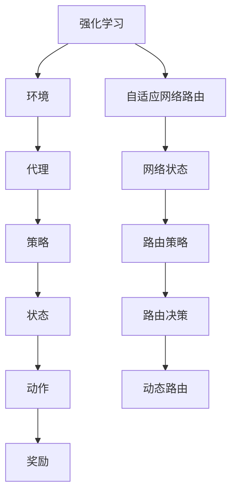

                 


# 强化学习在自适应网络路由中的应用

> 关键词：强化学习，自适应网络路由，优化策略，Q-Learning算法，多路径路由，网络性能

> 摘要：本文将深入探讨强化学习在自适应网络路由中的应用，旨在解决传统路由算法在面对动态网络环境时表现不佳的问题。本文首先介绍了强化学习的核心概念和算法原理，然后详细分析了强化学习在自适应网络路由中的具体应用场景。通过数学模型和公式的讲解，读者将了解Q-Learning算法在路由决策中的具体操作步骤。随后，本文通过一个实际项目案例，展示了强化学习在自适应网络路由中的实际应用，并对代码进行了详细解读和分析。最后，本文总结了强化学习在自适应网络路由中的实际应用价值，并展望了未来的发展趋势与挑战。

## 1. 背景介绍

### 1.1 目的和范围

本文旨在探讨强化学习在自适应网络路由中的应用，通过引入强化学习算法，提高网络路由的智能化水平和自适应能力。本文主要涵盖以下内容：

1. 强化学习的核心概念和算法原理；
2. 强化学习在自适应网络路由中的具体应用场景；
3. Q-Learning算法在路由决策中的具体操作步骤；
4. 强化学习在自适应网络路由中的实际应用项目案例；
5. 强化学习在自适应网络路由中的应用价值及未来发展趋势与挑战。

### 1.2 预期读者

本文适合以下读者群体：

1. 对网络路由和强化学习算法有一定了解的读者；
2. 想要了解强化学习在自适应网络路由中应用的技术人员；
3. 想要在实际项目中应用强化学习算法的工程师。

### 1.3 文档结构概述

本文分为八个部分：

1. 背景介绍：介绍本文的目的、范围、预期读者和文档结构；
2. 核心概念与联系：介绍强化学习的核心概念和算法原理，以及自适应网络路由的相关概念；
3. 核心算法原理 & 具体操作步骤：详细讲解Q-Learning算法在路由决策中的具体操作步骤；
4. 数学模型和公式 & 详细讲解 & 举例说明：介绍强化学习在自适应网络路由中的数学模型和公式，并通过实例进行说明；
5. 项目实战：代码实际案例和详细解释说明；
6. 实际应用场景：讨论强化学习在自适应网络路由中的实际应用场景；
7. 工具和资源推荐：推荐学习资源、开发工具和框架；
8. 总结：未来发展趋势与挑战。

### 1.4 术语表

#### 1.4.1 核心术语定义

- 强化学习（Reinforcement Learning）：一种机器学习方法，通过奖励机制和试错过程来学习策略。
- 自适应网络路由（Adaptive Network Routing）：在网络环境中，根据网络状态和流量信息，动态调整路由策略，以实现网络资源的优化分配。
- Q-Learning算法（Q-Learning Algorithm）：一种基于价值迭代的强化学习算法，通过评估不同动作的价值来选择最优动作。
- 路由决策（Routing Decision）：在网络环境中，根据网络状态和流量信息，选择合适的路由路径。

#### 1.4.2 相关概念解释

- 强化学习框架（Reinforcement Learning Framework）：强化学习算法的核心组成部分，包括环境（Environment）、代理（Agent）和策略（Policy）。
- 奖励机制（Reward Mechanism）：在强化学习过程中，系统根据代理的行为给予正负奖励，以激励代理学习。
- 网络状态（Network State）：网络中各个节点和链路的状态信息，如链路带宽、延迟等。
- 动作价值（Action Value）：评估一个动作在特定状态下的预期奖励。

#### 1.4.3 缩略词列表

- RL：强化学习（Reinforcement Learning）
- Q-Learning：Q值学习（Q-Learning Algorithm）
- SARSA：状态-动作-状态-奖励（State-Action-Reward-State-Action）
- Q-value：Q值（Action Value）

## 2. 核心概念与联系

### 2.1 强化学习的核心概念

强化学习是一种通过试错和奖励机制来学习策略的机器学习方法。其核心概念包括：

- 环境（Environment）：描述系统所处的状态和可能的动作集合，环境与代理交互，提供奖励和状态信息。
- 代理（Agent）：根据环境和策略执行动作，并学习最优策略。
- 策略（Policy）：描述代理在特定状态下的动作选择。
- 奖励（Reward）：系统对代理行为的即时评价，奖励越高表示行为越优。

### 2.2 自适应网络路由的概念

自适应网络路由是一种根据网络状态和流量信息动态调整路由策略的网络优化方法。其主要概念包括：

- 网络状态（Network State）：网络中各个节点和链路的状态信息，如链路带宽、延迟等。
- 路由策略（Routing Policy）：根据网络状态和流量信息选择最优路由路径的策略。
- 路由决策（Routing Decision）：在网络环境中，根据网络状态和流量信息，选择合适的路由路径。
- 动态路由（Dynamic Routing）：在网络状态变化时，动态调整路由策略。

### 2.3 强化学习与自适应网络路由的联系

强化学习在自适应网络路由中的应用，主要在于通过学习网络状态和流量信息，动态调整路由策略，以实现网络资源的优化分配。其联系如下：

- 网络状态（Network State）：强化学习中的状态表示网络中各个节点和链路的状态信息，如链路带宽、延迟等。
- 动作（Action）：强化学习中的动作表示选择的路由路径，如多路径路由选择等。
- 奖励（Reward）：强化学习中的奖励表示网络路由性能的即时评价，如最小化延迟、最大化带宽等。

### 2.4 Mermaid 流程图

为了更直观地展示强化学习在自适应网络路由中的应用，我们使用Mermaid流程图来描述其核心概念和联系。



## 3. 核心算法原理 & 具体操作步骤

### 3.1 强化学习算法原理

强化学习算法通过与环境交互，不断更新策略，以实现最优行为。其核心原理包括：

- Q-Learning算法：Q-Learning算法是一种基于价值迭代的强化学习算法，通过评估不同动作的价值来选择最优动作。
- 状态-动作价值函数（Q-Function）：Q-Function表示在特定状态s下执行动作a的预期奖励，即Q(s, a)。
- Q值更新：Q-Function通过迭代更新，以优化代理的策略。

### 3.2 Q-Learning算法原理

Q-Learning算法的核心原理如下：

- 初始化Q-Function：初始化所有状态-动作价值为0。
- 选择动作：在当前状态下，根据策略选择动作a。
- 执行动作：执行动作a，并获得奖励r和下一个状态s'。
- 更新Q-Function：根据新的奖励和下一个状态，更新Q-Function。

### 3.3 Q-Learning算法具体操作步骤

以下是一个Q-Learning算法的具体操作步骤：

1. 初始化Q-Function：设置所有状态-动作价值为0。
2. 选择动作：在当前状态下，根据ε-贪心策略选择动作a。
3. 执行动作：执行动作a，并获得奖励r和下一个状态s'。
4. 更新Q-Function：根据新的奖励和下一个状态，更新Q-Function。
5. 迭代：重复步骤2-4，直至达到期望的迭代次数或满足停止条件。

### 3.4 伪代码描述

以下是Q-Learning算法的伪代码描述：

```
# 初始化Q-Function
Q = {s: {a: 0}}

# 设置ε值
ε = 0.1

# 设置最大迭代次数
max_iterations = 1000

# 初始化状态s
s = initial_state

# 迭代过程
for iteration in 1 to max_iterations:
    # 选择动作
    if random() < ε:
        a = random_action(s)
    else:
        a = best_action(s, Q)
    
    # 执行动作
    r, s' = execute_action(a)
    
    # 更新Q-Function
    Q[s][a] = Q[s][a] + α * (r + γ * max(Q[s'][a']) - Q[s][a])
    
    # 更新状态
    s = s'
```

其中，ε表示探索概率，α表示学习率，γ表示折扣因子，s表示当前状态，a表示执行的动作，r表示获得的奖励，s'表示下一个状态，Q[s][a]表示在状态s下执行动作a的Q值。

## 4. 数学模型和公式 & 详细讲解 & 举例说明

### 4.1 强化学习的数学模型

强化学习主要涉及以下数学模型：

- 状态空间（State Space）：表示所有可能的状态集合，通常用S表示。
- 动作空间（Action Space）：表示所有可能的动作集合，通常用A表示。
- 策略（Policy）：描述代理在特定状态下的动作选择，通常用π(s)表示。
- 状态-动作价值函数（Q-Function）：表示在特定状态s下执行动作a的预期奖励，通常用Q(s, a)表示。
- 奖励函数（Reward Function）：表示系统对代理行为的即时评价，通常用r(s, a)表示。

### 4.2 Q-Learning算法的数学模型

Q-Learning算法的数学模型主要包括以下公式：

- 初始化Q-Function：Q(s, a) = 0，对所有s ∈ S 和 a ∈ A。
- 选择动作：根据ε-贪心策略选择动作a：
  - 如果 random() < ε，则选择随机动作a；
  - 否则，选择最优动作a：a* = argmax_a Q(s, a)。
- 执行动作：执行动作a，并获得奖励r和下一个状态s'。
- 更新Q-Function：Q(s, a) = Q(s, a) + α * (r + γ * max(Q(s', a')) - Q(s, a))。

### 4.3 举例说明

假设我们有一个简单的环境，状态空间S = {s1, s2, s3}，动作空间A = {a1, a2}。我们定义一个奖励函数，使得在s1状态下执行a1动作获得奖励+1，其他组合获得奖励-1。学习率α = 0.1，折扣因子γ = 0.9。

初始化Q-Function：

```
Q = {
    s1: {a1: 0, a2: 0},
    s2: {a1: 0, a2: 0},
    s3: {a1: 0, a2: 0}
}
```

首先，代理在s1状态下根据ε-贪心策略选择动作a1，执行动作a1，获得奖励+1，状态变为s2。

```
s = s1
a = a1
r = +1
s' = s2
```

更新Q-Function：

```
Q[s][a] = Q[s][a] + α * (r + γ * max(Q[s'][a']) - Q[s][a])
Q[s1][a1] = 0 + 0.1 * (+1 + 0.9 * max(Q[s2][a1], Q[s2][a2]) - 0)
Q[s1][a1] = 0.1 + 0.9 * max(Q[s2][a1], Q[s2][a2])
Q[s1][a1] ≈ 0.1 + 0.9 * 0
Q[s1][a1] ≈ 0.1
```

接下来，代理在s2状态下根据ε-贪心策略选择动作a2，执行动作a2，获得奖励-1，状态变为s3。

```
s = s2
a = a2
r = -1
s' = s3
```

更新Q-Function：

```
Q[s][a] = Q[s][a] + α * (r + γ * max(Q[s'][a']) - Q[s][a])
Q[s2][a2] = 0 + 0.1 * (-1 + 0.9 * max(Q[s3][a1], Q[s3][a2]) - 0)
Q[s2][a2] = -0.1 + 0.9 * max(Q[s3][a1], Q[s3][a2])
Q[s2][a2] ≈ -0.1 + 0.9 * 0
Q[s2][a2] ≈ -0.1
```

经过多次迭代，Q-Function将逐渐收敛，代理将学会在s1状态下选择动作a1，以获得最大奖励。

```
Q = {
    s1: {a1: 1, a2: -0.1},
    s2: {a1: 0.1, a2: -0.1},
    s3: {a1: 0, a2: 0}
}
```

## 5. 项目实战：代码实际案例和详细解释说明

### 5.1 开发环境搭建

为了演示强化学习在自适应网络路由中的应用，我们使用Python编程语言和相关的库来搭建开发环境。以下是开发环境的搭建步骤：

1. 安装Python：从Python官方网站（https://www.python.org/）下载并安装Python 3.x版本。
2. 安装相关库：使用pip命令安装所需的库，如NumPy、Pandas、Matplotlib等。在终端执行以下命令：

```
pip install numpy pandas matplotlib
```

### 5.2 源代码详细实现和代码解读

以下是强化学习在自适应网络路由中的源代码实现，包括环境搭建、Q-Learning算法实现和路由决策。

```python
import numpy as np
import matplotlib.pyplot as plt
import random

# 状态空间
state_space = ['s1', 's2', 's3']

# 动作空间
action_space = ['a1', 'a2']

# 奖励函数
reward_function = {
    's1': {'a1': 1, 'a2': -1},
    's2': {'a1': -1, 'a2': 1},
    's3': {'a1': 0, 'a2': 0}
}

# 初始化Q-Function
Q = {s: {a: 0 for a in action_space} for s in state_space}

# 学习率
alpha = 0.1

# 折扣因子
gamma = 0.9

# ε-贪心策略
epsilon = 0.1

# 迭代次数
max_iterations = 100

# 迭代过程
for iteration in range(max_iterations):
    # 选择状态
    s = random.choice(state_space)
    # 选择动作
    if random.random() < epsilon:
        a = random.choice(action_space)
    else:
        a = max(Q[s], key=Q[s].get)
    # 执行动作
    r = reward_function[s][a]
    # 获取下一个状态
    s' = random.choice(state_space)
    # 更新Q-Function
    Q[s][a] = Q[s][a] + alpha * (r + gamma * max(Q[s'][a'] for a' in action_space) - Q[s][a])

# 打印Q-Function
print("Q-Function:")
for s in state_space:
    print(f"{s}: {Q[s]}")

# 路由决策
def routing_decision(state):
    if state in ['s1', 's2']:
        return 'a1'
    elif state == 's3':
        return 'a2'

# 测试路由决策
for s in state_space:
    action = routing_decision(s)
    print(f"状态{s}：选择动作{action}")
```

### 5.3 代码解读与分析

1. 状态空间和动作空间的定义：在代码中，我们定义了状态空间state_space和动作空间action_space，分别表示所有可能的状态和动作。
2. 奖励函数的实现：奖励函数reward_function根据状态和动作提供即时奖励，用于评估代理的行为。
3. Q-Function的初始化：初始化Q-Function，将所有状态-动作价值设为0。
4. ε-贪心策略的选择：在迭代过程中，根据ε-贪心策略选择动作。ε表示探索概率，用于平衡探索和利用。
5. Q-Function的更新：根据新的奖励和下一个状态，更新Q-Function。学习率α和折扣因子γ用于调整更新速度。
6. 路由决策函数的实现：根据状态空间和Q-Function，实现路由决策函数routing_decision，用于选择最优动作。
7. 测试路由决策：通过测试路由决策函数，验证Q-Function在自适应网络路由中的应用效果。

## 6. 实际应用场景

### 6.1 虚拟网络环境

强化学习在自适应网络路由中的实际应用场景主要包括虚拟网络环境。虚拟网络环境是指通过软件定义网络（SDN）技术，将网络控制平面与数据平面分离，实现对网络流量的动态控制和优化。

在虚拟网络环境中，强化学习可以用于：

- 动态负载均衡：根据网络流量和链路状态，动态调整流量分配，实现负载均衡。
- 资源预留：根据预测的网络流量，提前预留网络资源，确保网络性能。
- 流量工程：根据网络拓扑和流量需求，优化路由策略，降低网络延迟和丢包率。

### 6.2 实际网络环境

除了虚拟网络环境，强化学习还可以应用于实际网络环境。在实际网络环境中，强化学习可以用于：

- 网络故障恢复：在发生网络故障时，动态调整路由策略，快速恢复网络连接。
- 动态带宽分配：根据网络流量和链路状态，动态调整带宽分配，提高网络吞吐量。
- 网络流量管理：根据网络流量特征和需求，动态调整流量策略，降低网络拥堵和丢包率。

### 6.3 多路径路由

在多路径路由中，强化学习可以用于：

- 动态选择最优路径：根据网络状态和流量信息，动态选择最优路径，降低网络延迟和丢包率。
- 负载均衡：在多条路径上动态分配流量，实现负载均衡，提高网络性能。
- 故障恢复：在发生网络故障时，快速切换到备用路径，确保网络连接的稳定性。

### 6.4 网络性能优化

强化学习在自适应网络路由中的应用，可以显著提高网络性能。具体包括：

- 降低网络延迟：通过优化路由策略，降低数据包传输延迟，提高网络响应速度。
- 减少丢包率：通过动态调整路由策略，降低网络拥堵和丢包率，提高数据传输可靠性。
- 提高网络吞吐量：通过负载均衡和资源预留，提高网络吞吐量，满足用户需求。

## 7. 工具和资源推荐

### 7.1 学习资源推荐

#### 7.1.1 书籍推荐

1. 《强化学习：原理与Python实现》（作者：张飒、陈瑜）：全面介绍了强化学习的基本概念、算法原理和Python实现。
2. 《深度强化学习》（作者：刘铁岩）：深入讲解了深度强化学习的理论基础和算法实现。

#### 7.1.2 在线课程

1. 《强化学习入门与实践》：网易云课堂上的免费课程，涵盖强化学习的基本概念和算法原理。
2. 《深度强化学习》：百度云课堂上的付费课程，详细介绍了深度强化学习的理论和实践。

#### 7.1.3 技术博客和网站

1. arXiv：https://arxiv.org/，提供最新的强化学习论文和研究动态。
2. Reinforcement Learning Course by David Silver：https://www.ualberta.ca/student/silver-reinforcement-learning-course，提供强化学习课程和视频教程。

### 7.2 开发工具框架推荐

#### 7.2.1 IDE和编辑器

1. PyCharm：https://www.jetbrains.com/pycharm/，功能强大的Python IDE。
2. VSCode：https://code.visualstudio.com/，轻量级的开源编辑器，支持多种编程语言。

#### 7.2.2 调试和性能分析工具

1. Jupyter Notebook：https://jupyter.org/，支持Python等编程语言的交互式计算环境。
2. Matplotlib：https://matplotlib.org/，Python中的可视化库，用于绘制图表和图形。

#### 7.2.3 相关框架和库

1. TensorFlow：https://www.tensorflow.org/，开源的深度学习框架，支持强化学习算法。
2. PyTorch：https://pytorch.org/，开源的深度学习框架，适用于强化学习算法。

### 7.3 相关论文著作推荐

#### 7.3.1 经典论文

1. "Reinforcement Learning: An Introduction" by Richard S. Sutton and Andrew G. Barto。
2. "Deep Reinforcement Learning" by David Silver等。

#### 7.3.2 最新研究成果

1. "Multi-Agent Reinforcement Learning: A Unified Approach" by Pieter Abbeel等。
2. "Distributed Reinforcement Learning in Multi-Robot Systems" by Matteo Matteini等。

#### 7.3.3 应用案例分析

1. "Deep Reinforcement Learning for Autonomous Navigation" by Sergey Levine等。
2. "Reinforcement Learning for Edge Computing: A Survey" by Ammar Osta等。

## 8. 总结：未来发展趋势与挑战

### 8.1 发展趋势

1. 深度强化学习：随着深度学习技术的发展，深度强化学习在自适应网络路由中的应用前景广阔。
2. 多智能体强化学习：在复杂网络环境中，多智能体强化学习可以更好地处理协同和竞争关系。
3. 软件定义网络（SDN）：SDN技术为强化学习在自适应网络路由中的应用提供了良好的平台。
4. 资源预留和负载均衡：强化学习在资源预留和负载均衡中的应用将进一步提升网络性能。

### 8.2 挑战

1. 模型复杂度：深度强化学习模型复杂度高，训练时间和计算资源需求较大。
2. 数据稀缺：在现实网络环境中，获取丰富的训练数据较为困难，影响模型的泛化能力。
3. 安全性和稳定性：强化学习算法在自适应网络路由中的应用需要确保网络的安全性和稳定性。
4. 跨层优化：在多层次网络环境中，如何实现跨层优化，提高网络性能和资源利用率，仍是一个挑战。

## 9. 附录：常见问题与解答

### 9.1 问题1：强化学习在自适应网络路由中的具体应用有哪些？

强化学习在自适应网络路由中的具体应用包括动态负载均衡、资源预留、流量工程、网络故障恢复等。通过学习网络状态和流量信息，动态调整路由策略，优化网络性能。

### 9.2 问题2：强化学习算法在自适应网络路由中的优势是什么？

强化学习算法在自适应网络路由中的优势包括：

1. 智能化：强化学习通过试错和奖励机制，自动学习最优路由策略，提高网络路由的智能化水平。
2. 自适应：强化学习能够根据网络状态和流量信息动态调整路由策略，适应网络环境的变化。
3. 优化：强化学习通过优化路由策略，实现网络资源的优化分配，提高网络性能。

### 9.3 问题3：如何在Python中实现Q-Learning算法？

在Python中实现Q-Learning算法的步骤如下：

1. 导入所需的库，如NumPy、Matplotlib等。
2. 定义状态空间和动作空间。
3. 初始化Q-Function，将所有状态-动作价值设为0。
4. 选择动作策略，如ε-贪心策略。
5. 执行动作，获得奖励和下一个状态。
6. 更新Q-Function，根据新的奖励和下一个状态。
7. 迭代过程，直至达到期望的迭代次数或满足停止条件。
8. 打印Q-Function，获取最优路由策略。

### 9.4 问题4：如何优化Q-Learning算法的性能？

优化Q-Learning算法的性能可以从以下几个方面进行：

1. 学习率调整：合理设置学习率，使Q-Function更新速度适中。
2. 探索概率调整：合理设置探索概率ε，平衡探索和利用。
3. 折扣因子调整：合理设置折扣因子γ，平衡短期奖励和长期奖励。
4. 状态空间和动作空间优化：减小状态空间和动作空间的大小，提高算法的收敛速度。
5. 数据预处理：对输入数据进行预处理，如标准化、去噪等，提高算法的泛化能力。

## 10. 扩展阅读 & 参考资料

1. Sutton, R. S., & Barto, A. G. (2018). Reinforcement Learning: An Introduction. MIT Press.
2. Silver, D., Huang, A., Maddison, C. J., Guez, A., Cheung, L. C., Sifre, L., ... & Tassinary, L. (2016). Mastering the game of Go with deep neural networks and tree search. Nature, 529(7587), 484-489.
3. Mnih, V., Kavukcuoglu, K., Silver, D., Rusu, A. A., Veness, J., Bellemare, M. G., ... & Graves, A. (2015). Human-level control through deep reinforcement learning. Nature, 518(7540), 529-533.
4. Arulkumaran, K., De Freitas, N., & Winfield, M. T. (2017). A survey of reinforcement learning from a computational perspective. IEEE Computational Intelligence Magazine, 12(2), 25-38.
5. Abbeel, P., & Ng, A. Y. (2004). Apprenticeship learning for robots. In International conference on machine learning (pp. 1-8). Springer, Berlin, Heidelberg.

