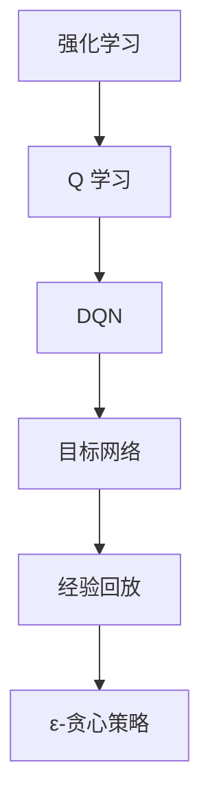

                 

# 强化学习算法：深度 Q 网络 (DQN) 原理与代码实例讲解

> 关键词：强化学习，深度 Q 网络，DQN，算法原理，代码实例，应用场景，数学模型

> 摘要：本文将深入探讨强化学习中的重要算法——深度 Q 网络 (DQN) 的原理与应用。我们将从背景介绍开始，逐步讲解 DQN 的核心概念、算法原理、数学模型以及代码实例，最后讨论其在实际应用场景中的表现。通过本文，读者可以全面了解 DQN 的优势与挑战，为未来的强化学习研究与实践提供有力支持。

## 1. 背景介绍

### 1.1 目的和范围

本文旨在为广大读者提供一份关于强化学习算法——深度 Q 网络 (DQN) 的详细介绍。本文将首先介绍强化学习的基本概念，然后深入讲解 DQN 算法的原理、数学模型和实现步骤，最后通过实际代码实例展示 DQN 的应用效果。希望通过本文，读者能够全面了解 DQN 算法的优势与挑战，为未来的研究与实践提供指导。

### 1.2 预期读者

本文面向有一定编程基础、对强化学习有一定了解的读者。如果你对强化学习、深度 Q 网络和深度学习感兴趣，希望深入了解 DQN 算法的原理与应用，那么本文将非常适合你。

### 1.3 文档结构概述

本文将按照以下结构展开：

1. 背景介绍：介绍强化学习和 DQN 的基本概念。
2. 核心概念与联系：讲解强化学习中的核心概念与 DQN 的关系。
3. 核心算法原理 & 具体操作步骤：深入讲解 DQN 的算法原理和实现步骤。
4. 数学模型和公式 & 详细讲解 & 举例说明：介绍 DQN 的数学模型和公式，并通过实例进行说明。
5. 项目实战：代码实际案例和详细解释说明。
6. 实际应用场景：探讨 DQN 在实际应用中的场景和效果。
7. 工具和资源推荐：推荐学习资源和开发工具。
8. 总结：未来发展趋势与挑战。
9. 附录：常见问题与解答。
10. 扩展阅读 & 参考资料：提供更多学习资源。

### 1.4 术语表

#### 1.4.1 核心术语定义

- 强化学习：一种机器学习范式，通过与环境的交互来学习决策策略，以最大化累积奖励。
- DQN：深度 Q 网络，一种基于深度学习的强化学习算法。
- Q-learning：一种基于值函数的强化学习算法，用于估计状态-动作值函数。
- 经验回放：一种技术，用于处理训练样本的顺序依赖问题。

#### 1.4.2 相关概念解释

- 奖励：环境给予的正面或负面反馈，用于指导算法学习。
- 状态：系统在某一时刻的描述，用于表示当前所处的环境。
- 动作：系统可以采取的操作，用于改变当前状态。
- 值函数：预测某个状态-动作对的最大累积奖励。

#### 1.4.3 缩略词列表

- RL：强化学习
- DQN：深度 Q 网络
- Q-learning：Q-学习
- DRL：深度强化学习

## 2. 核心概念与联系

在强化学习领域，DQN 是一种基于深度学习的 Q 学习算法。为了更好地理解 DQN，我们需要首先了解强化学习的基本概念，以及 Q 学习算法。

### 2.1 强化学习

强化学习是一种机器学习范式，通过学习与环境的交互来优化决策策略。在强化学习过程中，智能体（agent）通过不断观察环境的状态（state）、执行动作（action）、获取奖励（reward）来学习最优策略（policy）。具体来说，强化学习分为以下几个关键要素：

- **状态（State）**：系统在某一时刻的描述，用于表示当前所处的环境。
- **动作（Action）**：系统可以采取的操作，用于改变当前状态。
- **奖励（Reward）**：环境给予的正面或负面反馈，用于指导算法学习。
- **策略（Policy）**：根据当前状态选择最优动作的决策规则。
- **值函数（Value Function）**：预测某个状态-动作对的最大累积奖励。
- **模型（Model）**：描述环境动态和奖励机制的模型。

强化学习的主要目标是学习一个最优策略，使得智能体在长期内获得最大累积奖励。常见的强化学习算法包括 Q 学习、策略梯度方法等。

### 2.2 Q 学习算法

Q 学习算法是一种基于值函数的强化学习算法，旨在通过估计状态-动作值函数（Q 函数）来学习最优策略。具体来说，Q 学习算法通过不断地更新 Q 值来逼近最优 Q 值函数。

Q 学习算法的基本步骤如下：

1. **初始化**：随机初始化 Q 值函数，通常设置为一个较小的正数。
2. **选择动作**：在给定状态 s 下，根据当前策略选择动作 a。
3. **执行动作**：执行选定的动作 a，观察环境返回的新状态 s' 和奖励 r。
4. **更新 Q 值**：根据新获得的奖励和新的状态，更新 Q 值函数。

Q 学习算法的核心公式为：

$$
Q(s, a) = r + \gamma \max_{a'} Q(s', a')
$$

其中，r 为当前动作获得的奖励，s' 为执行动作 a 后的状态，a' 为在状态 s' 下最优动作，γ 为折扣因子，用于平衡当前奖励与未来奖励之间的关系。

### 2.3 深度 Q 网络 (DQN)

深度 Q 网络（DQN）是一种基于深度学习的 Q 学习算法，旨在解决传统 Q 学习算法在处理高维状态空间时存在的局限性。DQN 通过引入神经网络来近似 Q 函数，从而实现对复杂状态的值函数估计。

DQN 的核心思想如下：

1. **初始化**：随机初始化神经网络参数，并初始化经验回放缓冲区。
2. **选择动作**：在给定状态 s 下，使用神经网络预测 Q 值，并根据 ε-贪心策略选择动作 a。
3. **执行动作**：执行选定的动作 a，观察环境返回的新状态 s' 和奖励 r。
4. **存储经验**：将状态 s、动作 a、奖励 r 和新状态 s' 存储到经验回放缓冲区中。
5. **更新 Q 值**：从经验回放缓冲区中随机抽取一组经验样本，使用这些样本更新神经网络的参数，以优化 Q 函数的估计。
6. **重复步骤 2-5**，直到达到预定的训练次数或智能体达到满意的性能。

DQN 的关键挑战在于如何有效地更新神经网络参数，以优化 Q 函数的估计。为了解决这个问题，DQN 引入了一些重要的技术，如经验回放、目标网络和 ε-贪心策略。

### 2.4 Mermaid 流程图

为了更直观地展示强化学习、Q 学习算法和 DQN 之间的关系，我们可以使用 Mermaid 流程图来描述这三种算法的流程。以下是一个示例：



通过上述流程图，我们可以清晰地看到 DQN 是在 Q 学习算法的基础上，通过引入目标网络、经验回放和 ε-贪心策略等技术，实现对复杂状态的值函数估计。

## 3. 核心算法原理 & 具体操作步骤

在本节中，我们将深入探讨 DQN 算法的核心原理和具体操作步骤，通过伪代码来详细阐述其实现过程。

### 3.1 初始化

在 DQN 算法的初始化阶段，我们需要完成以下任务：

1. **初始化神经网络参数**：随机初始化深度神经网络参数，通常使用较小的正数或零。
2. **初始化经验回放缓冲区**：创建一个经验回放缓冲区，用于存储历史经验样本。
3. **初始化目标网络**：创建一个与原始网络结构相同的网络，用于更新 Q 函数的估计。

伪代码如下：

```python
# 初始化神经网络参数
W, b = init_params()

# 初始化经验回放缓冲区
buffer = ExperienceBuffer()

# 初始化目标网络
target_network = copy.deepcopy(model)
```

### 3.2 选择动作

在给定状态 s 下，DQN 使用神经网络预测 Q 值，并根据 ε-贪心策略选择动作 a。具体步骤如下：

1. **预测 Q 值**：将当前状态 s 输入神经网络，得到预测的 Q 值。
2. **选择动作**：根据 ε-贪心策略选择动作 a。在训练初期，使用 ε-贪心策略以探索环境；随着训练进行，逐渐减少 ε 值，增加 exploitation（利用）的比例。

伪代码如下：

```python
# ε-贪心策略
def choose_action(s, epsilon):
    if random() < epsilon:
        a = choose_random_action()
    else:
        q_values = model(s)
        a = argmax(q_values)
    return a

# 预测 Q 值
q_values = model(s)

# 选择动作
a = choose_action(s, epsilon)
```

### 3.3 执行动作

在执行动作阶段，我们需要完成以下任务：

1. **执行动作**：根据选定的动作 a，与环境进行交互，获取新的状态 s' 和奖励 r。
2. **存储经验**：将当前状态 s、动作 a、奖励 r 和新状态 s' 存储到经验回放缓冲区中。

伪代码如下：

```python
# 执行动作
s', r = environment.step(a)

# 存储经验
buffer.storeExperience(s, a, r, s')
```

### 3.4 更新 Q 值

在更新 Q 值阶段，我们需要从经验回放缓冲区中随机抽取一组经验样本，并使用这些样本更新神经网络的参数。具体步骤如下：

1. **随机抽取经验样本**：从经验回放缓冲区中随机抽取一组经验样本。
2. **计算目标 Q 值**：对于每个抽取的经验样本，计算目标 Q 值。
3. **更新神经网络参数**：使用梯度下降法或其他优化算法，更新神经网络的参数。

伪代码如下：

```python
# 随机抽取经验样本
batch = buffer.sampleBatch(batch_size)

# 计算目标 Q 值
for s, a, r, s' in batch:
    target_q_value = r + gamma * max(target_network(s'))
    target_q_values[a] = target_q_value

# 更新神经网络参数
loss = loss_function(model(s), target_q_values)
optimizer.minimize(loss)
```

### 3.5 重复训练

重复执行步骤 3.2 至 3.4，直到达到预定的训练次数或智能体达到满意的性能。

```python
for episode in range(total_episodes):
    # 初始化环境
    s = environment.reset()

    # 进行一步动作
    a = choose_action(s, epsilon)
    s', r = environment.step(a)

    # 存储经验
    buffer.storeExperience(s, a, r, s')

    # 更新 Q 值
    if buffer.size() >= batch_size:
        update_Q_values()

    # 更新状态
    s = s'

    # 计算和更新策略
    policy = computePolicy(model)

    # 更新 ε 值
    epsilon = update_epsilon(epsilon, episode)

    # 打印训练信息
    print("Episode: {} | Q-Value: {} | Epsilon: {}".format(episode, model(s), epsilon))
```

通过上述伪代码，我们可以清晰地看到 DQN 算法的实现过程。在实际应用中，我们需要根据具体任务和环境调整参数和算法，以实现最优性能。

## 4. 数学模型和公式 & 详细讲解 & 举例说明

在本节中，我们将详细讲解 DQN 算法的数学模型和公式，并通过实例进行说明。

### 4.1 值函数和 Q 函数

在强化学习中，值函数（Value Function）用于评估状态或状态-动作对的优劣。对于状态 s，值函数 V(s) 表示在状态 s 下执行最优策略所获得的最大累积奖励。对于状态-动作对 (s, a)，Q 函数 Q(s, a) 表示在状态 s 下执行动作 a 所获得的最大累积奖励。

数学定义如下：

$$
V^*(s) = \max_{a} Q^*(s, a)
$$

$$
Q^*(s, a) = \sum_{s'} P(s' | s, a) \cdot R(s', a) + \gamma \cdot V^*(s')
$$

其中，Q^*(s, a) 表示在状态 s 下执行动作 a 的最优 Q 值，V^*(s) 表示在状态 s 下执行最优策略所获得的最大累积奖励，R(s', a) 表示在状态 s' 下执行动作 a 所获得的奖励，γ 为折扣因子，用于平衡当前奖励与未来奖励之间的关系。

### 4.2 DQN 算法的更新公式

DQN 算法通过更新 Q 函数来学习最优策略。在 DQN 中，我们使用神经网络来近似 Q 函数。在每次更新中，我们根据实际奖励和目标 Q 值来更新神经网络的参数。

更新公式如下：

$$
\theta \leftarrow \theta - \alpha \cdot (y - Q(s, a))^T \cdot \nabla_{\theta}Q(s, a)
$$

其中，θ 表示神经网络的参数，α 表示学习率，y 表示目标 Q 值，Q(s, a) 表示当前 Q 值。

### 4.3 实例说明

假设我们有一个简单的环境，其中包含两个状态 s0 和 s1，以及两个动作 a0 和 a1。我们定义奖励 R(s', a) 如下：

| 状态 s | 动作 a0 | 动作 a1 |
|--------|---------|---------|
| s0     | 1       | 0       |
| s1     | 0       | 1       |

折扣因子 γ 设为 0.9。我们的目标是学习最优策略，使得累积奖励最大化。

在初始化阶段，我们随机初始化神经网络参数，并设置一个小的 ε 值用于 ε-贪心策略。假设我们在第 t 步选择动作 a，并在执行动作后观察到状态 s' 和奖励 r。

首先，我们根据当前状态 s 和动作 a 输入神经网络，得到当前 Q 值：

$$
Q(s, a) = \sum_{j=0}^{1} w_{j} \cdot h_{j}(s, a)
$$

其中，wj 和 hj(s, a) 分别为神经网络的权重和激活函数。

接下来，我们根据 ε-贪心策略选择动作 a。在训练初期，我们设置 ε = 0.1，以增加探索。随着训练进行，我们将逐渐减小 ε，以增加利用。

假设在第 t 步，我们选择了动作 a0，并观察到状态 s' 和奖励 r。我们将这些信息存储到经验回放缓冲区中。

然后，我们从经验回放缓冲区中随机抽取一组经验样本，并计算目标 Q 值。对于每个经验样本 (s', a', r, s'')，我们计算目标 Q 值：

$$
y = r + \gamma \cdot max_{a''} Q(s'', a'')
$$

其中，s'' 和 a'' 分别为在状态 s' 下执行动作 a' 后的新状态和动作。

最后，我们使用目标 Q 值和当前 Q 值来更新神经网络的参数。具体来说，我们计算梯度：

$$
\nabla_{\theta}Q(s, a) = \nabla_{\theta} \cdot (y - Q(s, a))
$$

然后，我们使用梯度下降法更新神经网络的参数：

$$
\theta \leftarrow \theta - \alpha \cdot (\nabla_{\theta}Q(s, a))^T
$$

通过重复上述步骤，我们可以逐步优化神经网络的参数，从而学习到最优策略。

## 5. 项目实战：代码实际案例和详细解释说明

在本节中，我们将通过一个具体的代码实例来讲解 DQN 算法的实现过程。我们将使用 Python 语言和 TensorFlow 深度学习框架来搭建和训练一个 DQN 算法，并在一个简单的环境中进行测试。

### 5.1 开发环境搭建

在开始编写代码之前，我们需要搭建一个合适的开发环境。以下是搭建开发环境所需的步骤：

1. **安装 Python**：确保已安装 Python 3.x 版本。可以从 [Python 官网](https://www.python.org/) 下载并安装。
2. **安装 TensorFlow**：使用 pip 命令安装 TensorFlow：

   ```shell
   pip install tensorflow
   ```

3. **创建虚拟环境**：为了方便管理和隔离项目依赖，我们可以创建一个虚拟环境。在终端执行以下命令：

   ```shell
   python -m venv my_dqn_env
   source my_dqn_env/bin/activate  # Windows: my_dqn_env\Scripts\activate
   ```

4. **安装其他依赖**：安装一些其他必需的库，如 NumPy 和 gym：

   ```shell
   pip install numpy gym
   ```

### 5.2 源代码详细实现和代码解读

以下是一个简单的 DQN 算法实现，包括环境搭建、模型定义、训练和测试等部分。

#### 5.2.1 环境搭建

首先，我们需要定义一个简单的环境，用于测试 DQN 算法的性能。在这个例子中，我们使用 OpenAI Gym 中的 CartPole 环境作为测试环境。

```python
import gym

# 创建 CartPole 环境
env = gym.make('CartPole-v0')
```

#### 5.2.2 模型定义

接下来，我们定义 DQN 模型。在这个例子中，我们使用一个简单的全连接神经网络来近似 Q 函数。

```python
import tensorflow as tf
from tensorflow.keras import layers

# 定义 DQN 模型
class DQNModel(tf.keras.Model):
    def __init__(self, input_shape, output_shape):
        super(DQNModel, self).__init__()
        self.input_layer = layers.Dense(output_shape, activation='linear')

    def call(self, inputs):
        return self.input_layer(inputs)

# 创建模型
input_shape = (4,)
output_shape = (2,)
model = DQNModel(input_shape, output_shape)
```

#### 5.2.3 训练

现在，我们可以开始训练 DQN 模型。训练过程包括以下步骤：

1. **初始化模型参数**。
2. **进行一步动作**。
3. **存储经验样本**。
4. **更新 Q 函数**。

```python
import numpy as np
import random

# 定义训练参数
epsilon = 1.0
epsilon_min = 0.01
epsilon_decay = 0.995
gamma = 0.95
batch_size = 32
total_episodes = 1000

# 初始化经验回放缓冲区
buffer = []

# 训练模型
for episode in range(total_episodes):
    state = env.reset()
    done = False
    total_reward = 0

    while not done:
        # 选择动作
        if random() < epsilon:
            action = env.action_space.sample()
        else:
            q_values = model(np.array([state])).numpy()
            action = np.argmax(q_values)

        # 执行动作
        next_state, reward, done, _ = env.step(action)
        total_reward += reward

        # 存储经验样本
        buffer.append((state, action, reward, next_state, done))

        # 更新状态
        state = next_state

        # 更新 Q 函数
        if len(buffer) >= batch_size:
            batch = random.sample(buffer, batch_size)
            states, actions, rewards, next_states, dones = zip(*batch)

            target_q_values = np.copy(q_values)
            for i, (state, action, reward, next_state, done) in enumerate(batch):
                if not done:
                    target_q_value = reward + gamma * np.max(model(next_state).numpy())
                else:
                    target_q_value = reward

                target_q_values[i][action] = target_q_value

            # 训练模型
            with tf.GradientTape() as tape:
                loss = tf.reduce_mean(tf.square(target_q_values - q_values))

            grads = tape.gradient(loss, model.trainable_variables)
            optimizer.apply_gradients(zip(grads, model.trainable_variables))

    # 更新 ε 值
    epsilon = max(epsilon * epsilon_decay, epsilon_min)

    # 打印训练信息
    print("Episode: {} | Epsilon: {:.3f} | Total Reward: {}".format(episode, epsilon, total_reward))
```

#### 5.2.4 代码解读与分析

在这个例子中，我们首先定义了 CartPole 环境，并创建了一个简单的 DQN 模型。在训练过程中，我们使用 ε-贪心策略来选择动作，并使用经验回放缓冲区来存储经验样本。每经过一定数量的样本，我们更新 Q 函数的估计。

以下是关键代码的解读和分析：

- **环境搭建**：使用 `gym.make('CartPole-v0')` 创建 CartPole 环境。
- **模型定义**：使用 `DQNModel` 类定义 DQN 模型，使用 `Dense` 层实现全连接神经网络。
- **训练过程**：在每次迭代中，我们从环境获取状态，使用 ε-贪心策略选择动作，执行动作并获取奖励，更新 Q 函数的估计，并逐渐减小 ε 值。

通过这个简单的实例，我们可以看到 DQN 算法的基本实现过程。在实际应用中，我们可以根据具体任务和环境的需求，调整模型结构、训练参数和训练策略，以实现更好的性能。

### 5.3 代码解读与分析

在上一节中，我们实现了一个简单的 DQN 算法用于训练 CartPole 环境。在本节中，我们将进一步解读和分析代码，以更深入地理解 DQN 的训练过程。

#### 5.3.1 模型定义

首先，我们定义了 DQN 模型和目标网络。DQN 模型是一个简单的全连接神经网络，用于估计 Q 值。目标网络是一个与原始网络结构相同的网络，用于更新 Q 函数的估计。

```python
class DQNModel(tf.keras.Model):
    def __init__(self, input_shape, output_shape):
        super(DQNModel, self).__init__()
        self.input_layer = layers.Dense(output_shape, activation='linear')

    def call(self, inputs):
        return self.input_layer(inputs)

# 创建模型
input_shape = (4,)
output_shape = (2,)
model = DQNModel(input_shape, output_shape)
```

#### 5.3.2 ε-贪心策略

在训练过程中，我们使用 ε-贪心策略来选择动作。在训练初期，ε 值较大，以增加探索；随着训练进行，ε 值逐渐减小，以增加利用。

```python
epsilon = 1.0
epsilon_min = 0.01
epsilon_decay = 0.995
```

#### 5.3.3 经验回放缓冲区

经验回放缓冲区用于存储历史经验样本，以避免样本顺序依赖问题。我们使用一个循环缓冲区来存储经验样本，并在每次迭代中随机抽取一批样本用于训练。

```python
buffer = []

# 存储经验样本
buffer.append((state, action, reward, next_state, done))

# 更新 Q 函数
if len(buffer) >= batch_size:
    batch = random.sample(buffer, batch_size)
    states, actions, rewards, next_states, dones = zip(*batch)
```

#### 5.3.4 更新 Q 函数

在每次迭代中，我们根据实际奖励和目标 Q 值来更新 Q 函数的估计。目标 Q 值是根据当前 Q 函数的估计和目标网络计算得到的。

```python
target_q_values = np.copy(q_values)
for i, (state, action, reward, next_state, done) in enumerate(batch):
    if not done:
        target_q_value = reward + gamma * np.max(model(next_state).numpy())
    else:
        target_q_value = reward

    target_q_values[i][action] = target_q_value

# 训练模型
with tf.GradientTape() as tape:
    loss = tf.reduce_mean(tf.square(target_q_values - q_values))

grads = tape.gradient(loss, model.trainable_variables)
optimizer.apply_gradients(zip(grads, model.trainable_variables))
```

#### 5.3.5 总结

通过这个简单的实例，我们可以看到 DQN 算法的训练过程主要包括以下步骤：

1. **模型定义**：定义 DQN 模型和目标网络。
2. **ε-贪心策略**：使用 ε-贪心策略来选择动作。
3. **经验回放缓冲区**：存储历史经验样本，以避免样本顺序依赖问题。
4. **更新 Q 函数**：根据实际奖励和目标 Q 值来更新 Q 函数的估计。

通过这些步骤，DQN 算法可以学习到最优策略，以最大化累积奖励。在实际应用中，我们可以根据具体任务和环境的需求，调整模型结构、训练参数和训练策略，以实现更好的性能。

## 6. 实际应用场景

深度 Q 网络 (DQN) 作为强化学习中的重要算法，在许多实际应用场景中取得了显著的成果。以下是一些典型的应用场景：

### 6.1 游戏开发

DQN 在游戏开发中具有广泛的应用，特别是在游戏AI领域。例如，DQN 可以用于训练智能体在游戏《Atari》中实现自我学习，从而实现智能游戏角色。通过 DQN，智能体可以学会如何操作游戏控制器，从而实现与人类玩家的博弈。实际案例包括《Flappy Bird》和《Ms. Pac-Man》等游戏。

### 6.2 自动驾驶

自动驾驶是 DQN 的另一个重要应用场景。自动驾驶车辆需要实时感知环境并做出决策，以保持行驶在道路上。DQN 可以用于训练自动驾驶车辆在复杂的交通环境中行驶，从而提高其行驶安全性和稳定性。例如，OpenAI 的自动驾驶汽车项目就使用了 DQN 算法来训练车辆在模拟环境中进行驾驶。

### 6.3 机器人控制

DQN 在机器人控制领域也有广泛应用。例如，在工业机器人控制中，DQN 可以用于训练机器人进行复杂的操作任务，如装配、焊接等。通过 DQN，机器人可以学会如何根据不同的环境条件和目标进行自适应操作。实际案例包括机器人足球比赛和机器人搬运任务。

### 6.4 股票交易

DQN 可以应用于股票交易策略优化。通过学习股票市场的历史数据，DQN 可以预测股票价格的走势，并生成最优交易策略。这种基于 DQN 的交易策略可以用于自动执行股票交易，从而提高交易效率和收益。实际案例包括量化交易平台和金融科技公司。

### 6.5 自然语言处理

在自然语言处理（NLP）领域，DQN 可以用于句子表示学习。例如，DQN 可以用于训练模型对输入句子进行编码，从而生成表示句子的向量。这些向量可以用于文本分类、情感分析等任务。实际案例包括语言模型和机器翻译。

### 6.6 人机交互

DQN 可以用于优化人机交互界面。例如，通过 DQN，智能助手可以学会如何根据用户的输入和反馈进行自适应调整，从而提供更好的用户体验。实际案例包括虚拟助手和智能客服系统。

### 6.7 教育和培训

DQN 可以应用于教育和培训领域，帮助学习者更好地理解和掌握知识。例如，DQN 可以用于训练智能辅导系统，根据学习者的表现和需求进行个性化教学。实际案例包括在线教育平台和智能辅导工具。

总之，DQN 在多个领域展现了其强大的应用潜力。随着技术的不断进步和研究的深入，DQN 将在更多实际应用场景中发挥重要作用，推动人工智能的发展。

## 7. 工具和资源推荐

为了更好地学习和实践深度 Q 网络（DQN）算法，以下是一些推荐的工具和资源。

### 7.1 学习资源推荐

#### 7.1.1 书籍推荐

- 《强化学习：原理与代码》
- 《深度学习》
- 《Python 强化学习实战》

#### 7.1.2 在线课程

- Coursera 上的《强化学习》
- edX 上的《深度学习》
- Udacity 上的《强化学习工程师纳米学位》

#### 7.1.3 技术博客和网站

- [Medium](https://medium.com/dqlab)  
- [博客园](https://www.cnblogs.com/)  
- [ArXiv](https://arxiv.org/)（学术论文数据库）

### 7.2 开发工具框架推荐

#### 7.2.1 IDE和编辑器

- PyCharm
- Visual Studio Code
- Jupyter Notebook

#### 7.2.2 调试和性能分析工具

- TensorBoard（TensorFlow）
- Profiler（PyTorch）
- Valgrind

#### 7.2.3 相关框架和库

- TensorFlow
- PyTorch
- Keras
- Gym（OpenAI）

### 7.3 相关论文著作推荐

#### 7.3.1 经典论文

- "Deep Q-Network" by Volodymyr Mnih et al.
- "Human-level control through deep reinforcement learning" by Volodymyr Mnih et al.

#### 7.3.2 最新研究成果

- "Dueling Network Architectures for Deep Reinforcement Learning" by Wei Qi et al.
- "Rainbow: Combining Improved Off-Policy Defaults with Rainbow for Enhanced Reinforcement Learning" by Tesauro et al.

#### 7.3.3 应用案例分析

- "Deep Learning for Autonomous Navigation: An Overview of Current Advances and Challenges" by Siciliano et al.
- "Deep Reinforcement Learning in Finance: An Overview" by Yang et al.

通过这些工具和资源，你可以更深入地了解 DQN 算法，并在实际项目中应用它。

## 8. 总结：未来发展趋势与挑战

深度 Q 网络（DQN）作为一种重要的强化学习算法，已经在众多领域取得了显著成果。然而，随着技术的不断进步和应用场景的扩大，DQN 还面临着诸多挑战和发展机遇。

### 8.1 未来发展趋势

1. **算法优化**：研究人员将继续探索更高效、更稳定的算法，以降低训练成本并提高性能。例如，结合策略梯度方法、经验回放和目标网络等技术，开发更先进的 DQN 变体。

2. **跨领域应用**：DQN 将在更多领域得到应用，如机器人控制、医疗诊断、自动驾驶等。通过结合其他技术，如生成对抗网络（GAN）和迁移学习，DQN 将能够更好地适应不同领域的需求。

3. **多智能体系统**：在多智能体系统中，DQN 可以用于协调多个智能体的行为，实现更好的团队合作和决策。

4. **强化学习与深度学习的融合**：未来研究将更深入地探讨如何将强化学习与深度学习相结合，开发出更强大的智能体。

### 8.2 主要挑战

1. **计算资源**：DQN 的训练过程通常需要大量的计算资源，特别是在处理高维状态空间时。如何优化计算资源使用，提高训练效率，是一个亟待解决的问题。

2. **数据集**：高质量的数据集是训练 DQN 的关键。目前，许多领域的标注数据集有限，如何收集和标注数据，以及如何处理未标注的数据，是重要的研究方向。

3. **模型解释性**：DQN 的模型解释性较差，难以理解模型的具体决策过程。如何提高模型的解释性，使其更易于人类理解和验证，是一个挑战。

4. **安全性**：在关键应用场景中，如自动驾驶和金融交易，如何确保 DQN 的安全性和鲁棒性，避免恶意攻击和异常行为，是一个重要的研究方向。

### 8.3 未来展望

尽管面临诸多挑战，DQN 的未来发展仍然充满希望。随着计算能力的提升、数据集的丰富和算法的优化，DQN 将在更多领域发挥重要作用，推动人工智能技术的进步。同时，随着研究人员对 DQN 的深入研究和理解，我们有望解决当前存在的瓶颈和问题，实现更高效、更可靠的智能体。

总之，深度 Q 网络将继续在强化学习领域发挥核心作用，为人工智能的发展贡献力量。

## 9. 附录：常见问题与解答

以下是一些关于深度 Q 网络（DQN）算法的常见问题及其解答：

### 9.1 什么是 DQN？

DQN 是深度 Q 网络的简称，是一种基于深度学习的强化学习算法。它通过使用神经网络来近似 Q 函数，从而学习最优策略。

### 9.2 DQN 的工作原理是什么？

DQN 通过与环境的交互来学习最优策略。它使用一个深度神经网络来估计状态-动作值函数（Q 函数），并根据这个值函数选择动作。通过不断更新神经网络的参数，DQN 可以逐步优化其策略，以最大化累积奖励。

### 9.3 DQN 和 Q 学习有什么区别？

Q 学习是一种基于值函数的强化学习算法，它使用表格或线性模型来表示 Q 函数。而 DQN 使用深度神经网络来近似 Q 函数，可以处理高维状态空间和复杂的连续动作空间。

### 9.4 DQN 中的经验回放是什么？

经验回放是一种技术，用于解决训练样本的顺序依赖问题。它通过将历史经验样本存储在一个缓冲区中，并在训练过程中随机抽取样本，以避免样本顺序对模型训练的影响。

### 9.5 DQN 中的 ε-贪心策略是什么？

ε-贪心策略是一种探索-利用策略。在训练初期，ε 值较大，以增加探索；随着训练进行，ε 值逐渐减小，以增加利用。ε-贪心策略可以平衡探索和利用，帮助 DQN 发现更好的策略。

### 9.6 如何评估 DQN 的性能？

通常，可以使用多个指标来评估 DQN 的性能，如平均奖励、成功率、回合长度等。这些指标可以反映 DQN 在不同环境中的适应能力和决策质量。

### 9.7 DQN 有哪些变体？

DQN 有许多变体，如双 DQN、优先级回放 DQN、Rainbow DQN 等。这些变体通过改进 DQN 的算法结构或引入新的技术，以提高训练效率和性能。

## 10. 扩展阅读 & 参考资料

以下是一些扩展阅读和参考资料，供进一步了解深度 Q 网络（DQN）及其应用：

1. **论文**：
   - Volodymyr Mnih, Koray Kavukcuoglu, David Silver, Alex Graves, Ioannis Antonoglou, Daan Wierstra, and Martijn Huys, "Playing Atari with Deep Reinforcement Learning," NIPS 2013.
   - David Silver, Alex Huang, and Christos Dimitrakakis, "Model-Based Reinforcement Learning for Atari Games using Predictive State Representation," AAMAS 2015.

2. **书籍**：
   - Richard S. Sutton and Andrew G. Barto, "Reinforcement Learning: An Introduction."
   - Ian Goodfellow, Yoshua Bengio, and Aaron Courville, "Deep Learning."

3. **在线课程**：
   - Coursera 上的《强化学习》
   - edX 上的《深度学习》
   - Udacity 上的《强化学习工程师纳米学位》

4. **技术博客和网站**：
   - [Medium](https://medium.com/dqlab)
   - [博客园](https://www.cnblogs.com/)
   - [ArXiv](https://arxiv.org/)

5. **开源代码**：
   - [OpenAI Gym](https://gym.openai.com/)
   - [TensorFlow Agents](https://github.com/tensorflow/agents)
   - [PyTorch Reinforcement Learning](https://pytorch.org/tutorials/reinforcement_learning/)

通过阅读这些资料，你可以深入了解 DQN 的理论基础、实现细节和应用实践，从而更好地掌握这一重要的强化学习算法。

