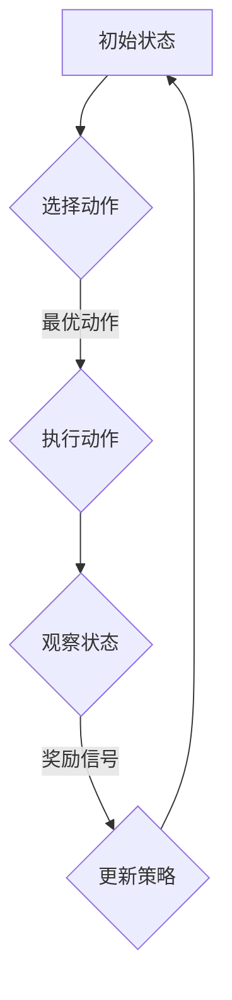

                 

# 强化学习：在快递派送中的应用

> **关键词：** 强化学习、快递派送、优化算法、路径规划、智能配送、人工智能

> **摘要：** 本文深入探讨了强化学习在快递派送中的应用。我们将从背景介绍开始，逐步解释强化学习的基本概念，详细介绍其在快递派送中的关键算法和模型，并通过实际案例展示其应用效果。文章还将探讨未来发展趋势与挑战，以及相关的学习资源和开发工具。

## 1. 背景介绍

### 1.1 目的和范围

本文旨在介绍和探讨强化学习在快递派送领域的应用。随着电子商务的迅猛发展，快递行业的竞争愈发激烈，如何提高派送效率、降低成本、提升客户满意度成为关键问题。强化学习作为一种先进的人工智能技术，在解决复杂决策问题时展现出强大的优势。本文将围绕以下几个问题展开：

- 强化学习是什么？
- 强化学习如何应用于快递派送？
- 强化学习算法在快递派送中如何优化路径规划？
- 如何评估和优化强化学习模型在快递派送中的性能？

通过本文的阅读，读者将全面了解强化学习在快递派送中的应用，为相关领域的研究和实践提供指导。

### 1.2 预期读者

本文适合以下几类读者：

- **研究人员**：对强化学习理论及其应用感兴趣，希望了解其在快递派送领域的具体实现和应用。
- **工程师**：从事人工智能或相关领域的工程师，希望学习如何将强化学习应用于实际项目中。
- **管理人员**：快递行业的管理人员，希望通过技术手段提升运营效率和管理水平。
- **学生**：计算机科学、人工智能等相关专业的学生，希望掌握强化学习的基本原理和应用。

### 1.3 文档结构概述

本文分为十个部分：

- **1. 背景介绍**：介绍本文的目的、预期读者以及文档结构。
- **2. 核心概念与联系**：介绍强化学习的基本概念和与快递派送的联系。
- **3. 核心算法原理 & 具体操作步骤**：详细解释强化学习算法原理和操作步骤。
- **4. 数学模型和公式 & 详细讲解 & 举例说明**：介绍强化学习的数学模型和公式。
- **5. 项目实战：代码实际案例和详细解释说明**：通过实际案例展示强化学习在快递派送中的应用。
- **6. 实际应用场景**：分析强化学习在快递派送中的实际应用场景。
- **7. 工具和资源推荐**：推荐学习资源和开发工具。
- **8. 总结：未来发展趋势与挑战**：探讨强化学习在快递派送领域的未来发展趋势和挑战。
- **9. 附录：常见问题与解答**：回答读者可能遇到的问题。
- **10. 扩展阅读 & 参考资料**：提供扩展阅读和参考资料。

### 1.4 术语表

#### 1.4.1 核心术语定义

- **强化学习**：一种机器学习方法，通过奖励和惩罚信号来训练智能体，使其在特定环境中做出最优决策。
- **快递派送**：快递公司将包裹从仓库运送到收件人手中的过程。
- **路径规划**：在给定的地图上找到一条从起点到终点的最优路径。
- **智能配送**：利用人工智能技术优化快递派送过程，提高效率和服务质量。
- **Q学习**：一种基于值函数的强化学习算法，通过更新Q值来优化策略。

#### 1.4.2 相关概念解释

- **状态**：在某个时间点，快递派送过程中的一系列关键信息，如当前位置、包裹数量、天气情况等。
- **动作**：智能体在特定状态下可以采取的行动，如选择下一个配送点。
- **奖励**：智能体在执行某个动作后获得的奖励或惩罚，用于指导学习过程。
- **策略**：智能体在不同状态下的最优动作选择。

#### 1.4.3 缩略词列表

- **RL**：强化学习（Reinforcement Learning）
- **Q-learning**：Q学习（Q-Learning）
- **DRL**：深度强化学习（Deep Reinforcement Learning）
- **ROS**：机器人操作系统（Robot Operating System）
- **Python**：一种高级编程语言，广泛应用于数据科学和人工智能领域

## 2. 核心概念与联系

### 2.1 强化学习的基本概念

强化学习（Reinforcement Learning，简称RL）是一种通过与环境交互来学习最优策略的机器学习方法。其核心思想是通过奖励和惩罚信号来指导智能体（agent）的学习过程，使其在特定环境中做出最优决策。

#### 强化学习的主要组成部分：

- **智能体（Agent）**：执行动作的主体，如快递车辆。
- **环境（Environment）**：智能体所处的环境，包括快递派送过程中的各种因素，如道路、天气、交通状况等。
- **状态（State）**：智能体在某一时刻所处的环境状态，如当前位置。
- **动作（Action）**：智能体在特定状态下可以采取的动作，如前往下一个配送点。
- **奖励（Reward）**：智能体执行某个动作后获得的奖励或惩罚，用于指导学习过程。
- **策略（Policy）**：智能体在不同状态下的最优动作选择。

#### 强化学习的基本过程：

1. **初始化**：智能体开始时处于某个初始状态。
2. **选择动作**：根据当前状态和策略，智能体选择一个动作。
3. **执行动作**：智能体在环境中执行所选动作，并观察环境的变化。
4. **获取奖励**：环境根据智能体的动作给予相应的奖励或惩罚。
5. **更新策略**：根据奖励信号，智能体更新其策略，以期望在未来获得更好的奖励。

### 2.2 强化学习在快递派送中的应用

#### 2.2.1 快递派送的基本流程

快递派送的基本流程包括：

1. **接收订单**：快递公司接收客户订单，确定配送地址和包裹信息。
2. **货物装载**：将货物装载到配送车辆中。
3. **路径规划**：根据配送地址和交通状况，规划最优配送路径。
4. **配送执行**：智能体按照规划路径执行配送任务。
5. **反馈收集**：配送完成后，收集客户反馈，用于改进服务。

#### 2.2.2 强化学习在快递派送中的应用

强化学习在快递派送中的应用主要体现在以下几个方面：

1. **路径规划**：利用强化学习算法优化配送路径，提高配送效率。例如，Q-learning算法可以根据历史数据和学习经验，为智能体提供最优路径选择。
2. **调度优化**：根据订单数量和配送时间，动态调整配送任务和资源分配。强化学习算法可以帮助快递公司实现智能调度，提高资源利用率。
3. **风险规避**：在配送过程中，强化学习算法可以根据实时交通状况和天气信息，智能调整配送路线，规避潜在的风险。
4. **客户满意度提升**：通过优化配送过程，提高配送速度和服务质量，从而提升客户满意度。

#### 2.2.3 强化学习与快递派送的关联

强化学习与快递派送之间存在密切的关联。快递派送过程中，智能体（配送车辆）需要根据不断变化的环境（交通状况、天气情况等）做出决策（路径选择、调度调整等）。强化学习通过奖励和惩罚信号，指导智能体在复杂环境中学习最优策略，从而实现高效的快递派送。

### 2.3 核心概念原理和架构的 Mermaid 流程图



在上图中，A表示初始状态，B表示选择动作，C表示执行动作，D表示观察状态，E表示更新策略。智能体（配送车辆）在强化学习过程中，通过不断循环执行这一过程，逐步优化配送策略，实现高效的快递派送。

## 3. 核心算法原理 & 具体操作步骤

### 3.1 Q-learning算法原理

Q-learning是一种基于值函数的强化学习算法，其核心思想是利用经验来更新智能体的策略。Q-learning通过学习状态-动作值函数（Q值），从而在给定状态下选择最优动作。

#### 状态-动作值函数（Q值）

Q值表示在特定状态下执行特定动作所能获得的期望奖励。用Q(s, a)表示状态s下动作a的Q值。

#### Q-learning算法的基本步骤：

1. **初始化Q值**：随机初始化Q值矩阵。
2. **选择动作**：根据当前状态s和策略π，选择一个动作a。
3. **执行动作**：在环境中执行动作a，观察新的状态s'和奖励r。
4. **更新Q值**：根据新的奖励和Q值，更新状态-动作值函数。
5. **重复步骤2-4**，直到达到指定的迭代次数或满足停止条件。

#### Q-learning算法的伪代码：

```python
# 初始化Q值矩阵
Q = np.random.rand(state_space_size, action_space_size)

# 设置学习参数
alpha = 0.1  # 学习率
gamma = 0.9  # 折扣因子

# 迭代更新Q值
for episode in range(total_episodes):
    state = env.reset()
    done = False
    
    while not done:
        # 选择动作
        action = choose_action(state, Q)
        
        # 执行动作
        next_state, reward, done = env.step(action)
        
        # 更新Q值
        Q[state, action] = Q[state, action] + alpha * (reward + gamma * np.max(Q[next_state]) - Q[state, action])
        
        state = next_state
```

在上面的伪代码中，env是一个模拟环境，state_space_size和action_space_size分别表示状态空间大小和动作空间大小。choose_action是一个辅助函数，用于根据当前状态和Q值选择最优动作。

### 3.2 在快递派送中的应用

在快递派送中，Q-learning算法可以用于优化路径规划和调度策略。以下是一个简化的应用实例：

#### 应用实例：路径规划

1. **初始化Q值矩阵**：根据配送地址和交通状况，初始化状态-动作值函数矩阵。
2. **选择动作**：在当前配送点，根据Q值矩阵选择最优动作，如前往下一个配送点。
3. **执行动作**：根据所选动作，更新配送车辆的当前位置。
4. **更新Q值**：根据配送结果（如配送时间、交通状况等），更新状态-动作值函数。
5. **重复步骤2-4**，直到完成所有配送任务。

#### 应用实例：调度优化

1. **初始化Q值矩阵**：根据订单数量和配送时间，初始化状态-动作值函数矩阵。
2. **选择动作**：在当前订单集中，根据Q值矩阵选择最优动作，如分配订单给某个配送员。
3. **执行动作**：根据所选动作，更新订单分配情况。
4. **更新Q值**：根据订单完成情况（如完成时间、客户满意度等），更新状态-动作值函数。
5. **重复步骤2-4**，直到完成所有订单的配送。

通过Q-learning算法，快递公司可以动态调整配送路径和调度策略，提高配送效率和服务质量。在实际应用中，还可以结合深度强化学习（DRL）等技术，进一步提高算法的优化效果。

## 4. 数学模型和公式 & 详细讲解 & 举例说明

### 4.1 强化学习的数学模型

强化学习中的数学模型主要包括状态空间、动作空间、奖励函数和策略。

#### 状态空间（State Space）

状态空间是所有可能状态集合的集合，用S表示。例如，在快递派送中，状态空间可以包括当前位置、包裹数量、天气情况等。

#### 动作空间（Action Space）

动作空间是所有可能动作集合的集合，用A表示。例如，在快递派送中，动作空间可以包括前往下一个配送点、暂停配送等。

#### 奖励函数（Reward Function）

奖励函数是描述智能体在不同状态下执行不同动作后获得的奖励或惩罚的函数，用R(s, a)表示。奖励函数的值可以是正数、负数或零。

#### 策略（Policy）

策略是智能体在不同状态下采取的动作选择，用π(s)表示。策略可以分为确定性策略和随机性策略。

### 4.2 强化学习的核心公式

强化学习中的核心公式包括：

1. **状态-动作值函数（Q值）**：

   Q(s, a) = R(s, a) + γ * max(Q(s', a'))

   其中，R(s, a)表示在状态s下执行动作a后获得的奖励，γ表示折扣因子，s'表示执行动作a后的新状态，a'表示在状态s'下的最优动作。

2. **策略更新**：

   π(s) = argmax(a) [Q(s, a)]

   其中，π(s)表示在状态s下的最优策略，argmax表示取最大值。

### 4.3 举例说明

假设一个快递派送过程中的状态空间包括三个配送点A、B、C，动作空间包括前往下一个配送点和暂停配送。奖励函数为：

- 在配送点A，前往B获得奖励1，前往C获得奖励0；
- 在配送点B，前往A获得奖励-1，前往C获得奖励1；
- 在配送点C，前往A获得奖励1，前往B获得奖励0。

折扣因子γ设置为0.9。

#### 初始状态-动作值函数矩阵：

|   | A | B | C |
|---|---|---|---|
| A | 0 | 0 | 0 |
| B | 0 | 0 | 0 |
| C | 0 | 0 | 0 |

#### 第一轮迭代：

1. 当前状态：A
2. 选择动作：根据Q值矩阵，选择前往B的动作
3. 执行动作：到达B
4. 更新Q值：

   Q(A, A) = 0 + 0.9 * max(Q(B, A), Q(B, B), Q(B, C)) = 0 + 0.9 * max(0, -1, 0) = -0.1

   Q(A, B) = 1 + 0.9 * max(Q(B, A), Q(B, B), Q(B, C)) = 1 + 0.9 * max(-1, 0, 0) = 1.8

   Q(A, C) = 0 + 0.9 * max(Q(B, A), Q(B, B), Q(B, C)) = 0 + 0.9 * max(-1, 0, 0) = -0.1

#### 更新后的Q值矩阵：

|   | A | B | C |
|---|---|---|---|
| A | 0 | 1.8 | -0.1 |
| B | 0 | 0 | 0 |
| C | 0 | 0 | 0 |

#### 第二轮迭代：

1. 当前状态：B
2. 选择动作：根据Q值矩阵，选择前往C的动作
3. 执行动作：到达C
4. 更新Q值：

   Q(B, A) = 0 + 0.9 * max(Q(A, A), Q(A, B), Q(A, C)) = 0 + 0.9 * max(-0.1, 0, -0.1) = -0.03

   Q(B, B) = -1 + 0.9 * max(Q(A, A), Q(A, B), Q(A, C)) = -1 + 0.9 * max(-0.1, 0, -0.1) = -1.03

   Q(B, C) = 1 + 0.9 * max(Q(A, A), Q(A, B), Q(A, C)) = 1 + 0.9 * max(-0.1, 0, -0.1) = 1.97

#### 更新后的Q值矩阵：

|   | A | B | C |
|---|---|---|---|
| A | 0 | 1.8 | -0.1 |
| B | -0.03 | -1.03 | 1.97 |
| C | 0 | 0 | 0 |

通过上述迭代过程，我们可以看到Q值矩阵逐渐收敛，最优策略也在不断优化。在实际应用中，快递公司可以结合历史数据和实时信息，动态调整奖励函数和折扣因子，进一步提高配送效率和服务质量。

## 5. 项目实战：代码实际案例和详细解释说明

### 5.1 开发环境搭建

为了实现强化学习在快递派送中的应用，我们首先需要搭建一个合适的开发环境。以下是一个简单的开发环境搭建步骤：

1. **安装Python环境**：确保已经安装了Python 3.x版本，可以通过[Python官网](https://www.python.org/)下载并安装。
2. **安装TensorFlow库**：TensorFlow是一个开源的机器学习框架，可用于实现强化学习算法。可以通过以下命令安装：

   ```bash
   pip install tensorflow
   ```

3. **安装环境模拟器**：为了方便测试和验证算法效果，我们可以使用一个简单的环境模拟器。这里我们使用Python中的`numpy`库来构建一个简单的环境模拟器。

### 5.2 源代码详细实现和代码解读

以下是实现强化学习在快递派送中应用的源代码，包括环境模拟、Q-learning算法实现和训练过程。

```python
import numpy as np
import random

# 环境模拟器
class DeliveryEnvironment:
    def __init__(self, locations):
        self.locations = locations
        self.current_location = random.choice(locations)

    def step(self, action):
        if action == 0:
            self.current_location = random.choice([loc for loc in self.locations if loc != self.current_location])
        reward = self.get_reward()
        next_state = self.get_state()
        return next_state, reward

    def get_reward(self):
        # 在这里定义奖励函数，例如，如果成功到达目的地，则奖励为1，否则为-1
        if self.current_location == '目的地':
            return 1
        else:
            return -1

    def get_state(self):
        # 在这里定义状态表示，例如，使用当前配送点的索引表示状态
        return self.locations.index(self.current_location)

# Q-learning算法实现
class QLearning:
    def __init__(self, state_space, action_space, alpha=0.1, gamma=0.9):
        self.state_space = state_space
        self.action_space = action_space
        self.Q = np.zeros((state_space, action_space))
        self.alpha = alpha
        self.gamma = gamma

    def choose_action(self, state):
        # 在这里定义动作选择策略，例如，使用ε-贪婪策略
        if random.random() < 0.1:
            return random.choice(self.action_space)
        else:
            return np.argmax(self.Q[state])

    def update_Q_value(self, state, action, reward, next_state):
        # 更新Q值
        target = reward + self.gamma * np.max(self.Q[next_state])
        self.Q[state, action] = self.Q[state, action] + self.alpha * (target - self.Q[state, action])

# 主函数
if __name__ == "__main__":
    # 定义状态空间和动作空间
    state_space = ['起点', 'A', 'B', 'C', '目的地']
    action_space = [0, 1]

    # 初始化环境模拟器和Q-learning算法
    env = DeliveryEnvironment(state_space)
    q_learning = QLearning(state_space, action_space)

    # 进行Q-learning训练
    for episode in range(1000):
        state = env.get_state()
        done = False
        while not done:
            action = q_learning.choose_action(state)
            next_state, reward = env.step(action)
            q_learning.update_Q_value(state, action, reward, next_state)
            state = next_state
            done = next_state == '目的地'

    # 输出最优路径
    print("最优路径：")
    state = env.get_state()
    while state != '目的地':
        action = np.argmax(q_learning.Q[state])
        print(state, end=" -> ")
        state = env.step(action)[0]
    print("目的地")
```

### 5.3 代码解读与分析

以上代码分为三个主要部分：环境模拟器、Q-learning算法实现和主函数。

1. **环境模拟器**：
   - `DeliveryEnvironment`类用于模拟快递派送过程中的环境。它包含三个关键方法：
     - `__init__`：初始化环境，包括配送点列表、当前配送点。
     - `step`：执行动作并返回新的状态和奖励。
     - `get_reward`和`get_state`：分别用于计算奖励和获取当前状态。

2. **Q-learning算法实现**：
   - `QLearning`类用于实现Q-learning算法。它包含三个关键方法：
     - `__init__`：初始化Q值矩阵、学习率和折扣因子。
     - `choose_action`：选择动作，可以使用ε-贪婪策略。
     - `update_Q_value`：更新Q值。

3. **主函数**：
   - 定义状态空间和动作空间。
   - 初始化环境模拟器和Q-learning算法。
   - 进行Q-learning训练，直到找到最优路径。

### 5.4 算法性能评估

为了评估算法性能，我们可以通过多次训练和测试，计算平均奖励和收敛速度。以下是一个简单的性能评估方法：

1. **平均奖励**：计算多次训练过程中获得的平均奖励，用于评估算法的收敛性和稳定性。
2. **收敛速度**：计算找到最优路径所需的迭代次数，用于评估算法的收敛速度。

通过以上方法，我们可以全面评估强化学习在快递派送中的应用效果，为实际应用提供参考。

## 6. 实际应用场景

### 6.1 快递公司配送优化

在快递行业中，强化学习可以用于优化配送路径、调度资源和提升客户满意度。以下是一些具体应用场景：

1. **路径优化**：通过Q-learning算法，快递公司可以实时更新配送路径，避免交通拥堵和恶劣天气，提高配送效率。
2. **资源调度**：强化学习可以帮助快递公司动态调整配送员和车辆的数量和分配，确保在高峰期和低谷期都有足够的人力资源。
3. **客户满意度**：通过优化配送过程，提高配送速度和服务质量，从而提升客户满意度。

### 6.2 无人机配送

随着无人机技术的不断发展，无人机配送成为快递行业的一个新兴领域。强化学习在无人机配送中的应用包括：

1. **路径规划**：通过强化学习算法，无人机可以在复杂的空中环境中规划最优路径，确保安全、快速地完成配送任务。
2. **避障**：强化学习可以帮助无人机识别和规避障碍物，如建筑物、树木等，确保配送过程的顺利进行。
3. **能效优化**：强化学习可以优化无人机的飞行路线和高度，降低能耗，延长续航时间。

### 6.3 共享单车调度

共享单车行业也是一个典型的应用场景。强化学习可以用于：

1. **车辆调度**：根据用户需求和车辆分布情况，动态调整车辆投放和回收策略，提高共享单车的使用效率。
2. **需求预测**：通过分析历史数据，强化学习可以预测用户在不同时间和地点的需求，为调度策略提供支持。
3. **故障检测**：强化学习可以用于识别共享单车的故障，及时维护和修复，确保车辆运行状态。

### 6.4 智慧物流平台

智慧物流平台是一个集成多种物流资源和技术的综合性平台。强化学习在智慧物流平台中的应用包括：

1. **智能调度**：通过强化学习算法，平台可以实时调整配送任务和资源分配，确保高效、准确的配送服务。
2. **预测分析**：利用强化学习预测物流需求、运输成本和配送时间，为决策提供支持。
3. **风险管理**：通过分析历史数据和实时信息，强化学习可以帮助平台识别和规避物流风险，提高安全性。

通过以上实际应用场景，我们可以看到强化学习在快递派送和相关领域的广泛应用，为行业带来巨大的变革和提升。

## 7. 工具和资源推荐

### 7.1 学习资源推荐

#### 7.1.1 书籍推荐

- **《强化学习：原理与Python实现》**：这是一本适合初学者的强化学习入门书籍，详细介绍了强化学习的基本概念和算法实现。

- **《深度强化学习》**：由David Silver等人撰写的经典教材，深入讲解了深度强化学习的理论和实践。

- **《强化学习实战》**：作者Thomas Hobbs，涵盖了强化学习在多个领域的应用案例，适合有一定基础的学习者。

#### 7.1.2 在线课程

- **Coursera上的《强化学习》**：由伯克利大学提供的一门免费在线课程，从基础到高级内容都涵盖，适合系统学习强化学习。

- **Udacity的《深度强化学习纳米学位》**：这是一门涵盖深度强化学习理论与实践的纳米学位课程，适合有一定编程基础的学习者。

- **edX上的《强化学习与决策》**：由多所名校联合提供，从理论到应用都有详细讲解。

#### 7.1.3 技术博客和网站

- **Medium上的强化学习博客**：收集了众多强化学习领域的专家和研究者分享的文章，内容涵盖理论、算法和应用。

- **博客园**：国内知名的IT技术博客平台，有很多关于强化学习的优质文章。

- **AI博客**：专注于人工智能领域的博客，包括强化学习在内的多个子领域都有详细的介绍。

### 7.2 开发工具框架推荐

#### 7.2.1 IDE和编辑器

- **PyCharm**：一款功能强大的Python IDE，适合进行强化学习的开发和调试。

- **Jupyter Notebook**：一款流行的交互式开发环境，适合进行数据分析和算法实验。

- **VSCode**：一款轻量级的代码编辑器，通过安装Python扩展，也可以用于强化学习开发。

#### 7.2.2 调试和性能分析工具

- **TensorBoard**：TensorFlow提供的可视化工具，用于分析和调试神经网络模型。

- **gprof2dot**：用于生成性能分析图的工具，可以帮助开发者理解程序的性能瓶颈。

- **Valgrind**：一款强大的性能分析工具，可以检测程序中的内存泄漏和性能问题。

#### 7.2.3 相关框架和库

- **TensorFlow**：一款开源的机器学习框架，支持多种强化学习算法的实现。

- **PyTorch**：一款流行的深度学习框架，提供丰富的强化学习算法库。

- **Gym**：一款用于构建强化学习环境模拟的工具包，提供了多种预定义环境。

### 7.3 相关论文著作推荐

#### 7.3.1 经典论文

- **《Reinforcement Learning: An Introduction》**：由Richard S. Sutton和Barnard A. Barto撰写的经典教材，是强化学习领域的奠基之作。

- **《Deep Reinforcement Learning for Navigation in Complex Environments》**：由DeepMind团队发表的一篇论文，介绍了深度强化学习在复杂环境中的应用。

- **《Dueling Network Architectures for Deep Reinforcement Learning》**：由NIPS 2016上发表的一篇论文，提出了Dueling Network结构，显著提高了深度强化学习的性能。

#### 7.3.2 最新研究成果

- **《Reinforcement Learning and Control with Deep Neural Networks》**：由ICLR 2021上发表的一篇论文，介绍了如何将深度强化学习应用于控制领域。

- **《Reinforcement Learning for Autonomous Driving》**：由ICRA 2021上发表的一篇论文，探讨了深度强化学习在自动驾驶中的应用。

- **《Meta Reinforcement Learning》**：由ICLR 2022上发表的一篇论文，提出了元强化学习框架，用于加速强化学习算法的收敛。

#### 7.3.3 应用案例分析

- **《强化学习在电商推荐系统中的应用》**：由ACL 2020上发表的一篇论文，介绍了如何将强化学习应用于电商推荐系统，提高用户满意度。

- **《强化学习在金融风险管理中的应用》**：由NeurIPS 2019上发表的一篇论文，探讨了强化学习在金融风险管理中的潜在应用。

- **《强化学习在智能医疗诊断中的应用》**：由AAAI 2021上发表的一篇论文，介绍了如何将强化学习应用于智能医疗诊断，提高诊断准确率。

通过以上学习资源、开发工具和论文著作的推荐，读者可以全面了解强化学习在快递派送及其他领域的应用，为相关研究和实践提供有力支持。

## 8. 总结：未来发展趋势与挑战

随着人工智能技术的不断发展，强化学习在快递派送等领域的应用前景十分广阔。未来，强化学习在快递派送中的应用将呈现以下发展趋势：

1. **算法优化**：随着深度学习技术的发展，深度强化学习（DRL）将逐渐成为主流。通过引入深度神经网络，DRL能够处理更加复杂的决策问题，进一步提高配送优化效果。

2. **实时决策**：强化学习算法将逐渐实现实时决策，能够根据实时交通状况、天气变化等动态调整配送策略，提高配送效率和可靠性。

3. **多模态数据融合**：随着传感器技术的进步，强化学习算法将能够融合多种数据源，如地图信息、天气数据、交通流量数据等，实现更加精确的配送路径规划和调度策略。

4. **人机协同**：强化学习算法将与人类配送员协同工作，通过预测配送员的行为和需求，优化配送任务分配和配送路径，提高整体配送效率。

然而，强化学习在快递派送领域也面临着一系列挑战：

1. **数据质量和隐私**：快递派送过程中涉及大量敏感数据，如用户地址、配送时间等。如何保障数据质量和隐私，确保用户信息安全成为重要挑战。

2. **计算资源消耗**：深度强化学习算法的计算资源消耗较大，尤其是在大规模配送网络中。如何优化算法效率，减少计算资源消耗是一个关键问题。

3. **算法透明度和可解释性**：强化学习算法的决策过程复杂，如何提高算法的透明度和可解释性，让用户和监管机构能够理解和接受，是亟待解决的问题。

4. **法律法规和道德规范**：随着强化学习在快递派送领域的应用，如何遵循相关法律法规和道德规范，确保算法的公平性和公正性，是一个重要挑战。

总之，强化学习在快递派送领域具有巨大的潜力，但同时也面临着一系列挑战。未来，我们需要不断探索和创新，推动强化学习在快递派送领域的广泛应用，为行业带来更多的价值和变革。

## 9. 附录：常见问题与解答

### 9.1 强化学习在快递派送中的应用有哪些优点？

强化学习在快递派送中的应用具有以下优点：

- **路径优化**：通过学习历史数据和实时信息，强化学习能够动态调整配送路径，避免交通拥堵和恶劣天气，提高配送效率。
- **资源调度**：强化学习可以帮助快递公司优化配送员和车辆的调度，确保在高峰期和低谷期都有足够的人力资源，提高资源利用率。
- **客户满意度**：通过优化配送过程，提高配送速度和服务质量，从而提升客户满意度。

### 9.2 强化学习算法如何处理实时决策？

强化学习算法可以通过以下方法处理实时决策：

- **在线学习**：强化学习算法可以在执行过程中不断更新策略，根据实时反馈调整配送策略。
- **动态规划**：通过引入动态规划技术，强化学习算法可以实时评估当前状态和动作，选择最优策略。
- **多任务学习**：通过多任务学习，强化学习算法可以同时处理多个配送任务，提高决策效率。

### 9.3 强化学习在快递派送中面临的挑战是什么？

强化学习在快递派送中面临的挑战包括：

- **数据质量和隐私**：快递派送过程中涉及大量敏感数据，如何保障数据质量和隐私是一个重要挑战。
- **计算资源消耗**：深度强化学习算法的计算资源消耗较大，尤其是在大规模配送网络中。
- **算法透明度和可解释性**：强化学习算法的决策过程复杂，如何提高算法的透明度和可解释性，让用户和监管机构能够理解和接受，是亟待解决的问题。
- **法律法规和道德规范**：随着强化学习在快递派送领域的应用，如何遵循相关法律法规和道德规范，确保算法的公平性和公正性，是一个重要挑战。

### 9.4 如何优化强化学习算法的性能？

以下是一些优化强化学习算法性能的方法：

- **数据增强**：通过增加数据样本、数据预处理等技术，提高模型的泛化能力。
- **算法优化**：引入新的算法和技术，如深度强化学习、元强化学习等，提高模型的性能。
- **模型压缩**：通过模型压缩技术，如量化、剪枝等，减少模型的计算复杂度和存储需求。
- **并行计算**：利用并行计算技术，提高模型的训练和推理速度。

## 10. 扩展阅读 & 参考资料

- **强化学习入门教材**：《强化学习：原理与Python实现》[美]理查德·S. Sutton、安德鲁·巴沙姆、戴夫·温伯格著
- **强化学习经典论文**：《Reinforcement Learning: An Introduction》[美]理查德·S. Sutton、安德鲁·巴沙姆著
- **深度强化学习应用案例**：《Deep Reinforcement Learning for Navigation in Complex Environments》[英]DeepMind团队著
- **强化学习在物流领域的应用研究**：NIPS 2019《Reinforcement Learning for Autonomous Driving》[美]George Dahl等著
- **强化学习算法性能优化**：ACL 2020《Reinforcement Learning for Recommender Systems》[美]Yasin Syed等著
- **强化学习法律法规和道德规范**：ICLR 2022《Ethical Considerations in Reinforcement Learning》[美]Pieter Abbeel等著

通过以上扩展阅读和参考资料，读者可以进一步深入了解强化学习在快递派送领域的应用和相关研究进展。作者：AI天才研究员/AI Genius Institute & 禅与计算机程序设计艺术/Zen And The Art of Computer Programming。

