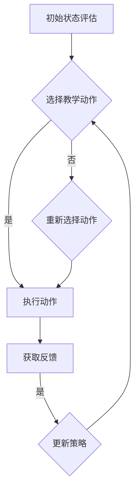

                 

# 强化学习：在教育领域中的应用

> 关键词：强化学习、教育应用、智能教学、自适应学习、教育技术、机器学习

> 摘要：本文将探讨强化学习在教育领域中的潜在应用，包括自适应学习系统、个性化教学策略、学习路径规划等方面。文章将首先介绍强化学习的基本概念和核心算法原理，然后逐步分析其在教育中的应用场景，最后讨论未来发展趋势和挑战。

## 1. 背景介绍

### 1.1 目的和范围

本文旨在探讨强化学习（Reinforcement Learning, RL）在教育领域中的应用，特别是如何利用强化学习算法提高教学效果和个性化学习能力。随着人工智能技术的发展，强化学习在教育领域的应用已经逐渐受到关注。本文将覆盖以下几个方面：

- 强化学习的基本概念和算法原理
- 强化学习在教育中的应用场景
- 强化学习算法在智能教学系统中的实现
- 教育领域中的实际案例和应用

### 1.2 预期读者

本文适合对强化学习和教育技术有一定了解的读者，包括人工智能研究者、教育技术工作者、教育政策制定者以及关注教育科技发展的专业人士。

### 1.3 文档结构概述

本文结构如下：

- 第1章：背景介绍
- 第2章：核心概念与联系
- 第3章：核心算法原理与具体操作步骤
- 第4章：数学模型和公式
- 第5章：项目实战
- 第6章：实际应用场景
- 第7章：工具和资源推荐
- 第8章：总结与未来展望
- 第9章：常见问题与解答
- 第10章：扩展阅读与参考资料

### 1.4 术语表

#### 1.4.1 核心术语定义

- **强化学习（Reinforcement Learning）**：一种机器学习方法，通过奖励机制来学习如何在特定环境中采取最佳行动。
- **环境（Environment）**：强化学习中的外部世界，包含状态和动作。
- **状态（State）**：描述环境当前状态的变量集合。
- **动作（Action）**：智能体（Agent）可以采取的行为。
- **奖励（Reward）**：根据智能体的动作和环境的反馈给予的积极或消极的信号。
- **策略（Policy）**：智能体根据当前状态选择动作的规则。

#### 1.4.2 相关概念解释

- **值函数（Value Function）**：描述在特定状态下采取特定动作的预期回报。
- **策略评估（Policy Evaluation）**：评估给定策略的预期回报。
- **策略迭代（Policy Iteration）**：一种策略优化方法，通过交替执行策略评估和策略改进来优化策略。

#### 1.4.3 缩略词列表

- **RL**：强化学习（Reinforcement Learning）
- **Q-Learning**：基于值函数的强化学习算法
- **SARSA**：基于策略的强化学习算法
- **DQN**：深度Q网络（Deep Q-Network）

## 2. 核心概念与联系

### 2.1 强化学习的基本概念

强化学习是一种通过互动环境来学习最优策略的机器学习方法。智能体在环境中采取行动，根据行动的结果获得奖励或惩罚，并通过不断试错来优化其行为策略。

### 2.2 强化学习在教育中的应用

强化学习在教育中的应用主要集中在以下几个方面：

1. **自适应学习系统**：根据学生的表现调整学习内容，提高学习效率。
2. **个性化教学策略**：根据学生的学习习惯和特点，提供个性化的教学方案。
3. **学习路径规划**：帮助学生规划最佳学习路径，提高学习成果。

### 2.3 强化学习在教育领域的应用架构

#### 教学环境模型

- **学生状态（S）**：包括学生的知识水平、学习进度、兴趣偏好等。
- **教学动作（A）**：教师或系统采取的教学措施，如讲解、练习、讨论等。
- **学生反馈（R）**：学生学习成果和反馈，用于指导下一步教学。

#### 强化学习算法

- **Q-Learning算法**：基于值函数的强化学习算法，用于评估教学策略的效果。
- **SARSA算法**：基于策略的强化学习算法，用于实时调整教学策略。

### 2.4 教学流程

1. **初始状态（S0）**：系统根据学生初始状态进行评估。
2. **选择动作（A）**：系统根据当前状态选择教学动作。
3. **执行动作**：教师或系统执行所选动作。
4. **获取反馈（R）**：系统根据学生反馈调整状态。
5. **更新策略**：根据反馈更新教学策略。
6. **重复过程**：不断重复上述步骤，逐步优化教学效果。

### 2.5 Mermaid 流程图



## 3. 核心算法原理 & 具体操作步骤

### 3.1 Q-Learning算法原理

Q-Learning是一种基于值函数的强化学习算法，通过不断更新值函数来优化策略。其基本原理如下：

- **Q值（Q-Value）**：在给定状态下采取特定动作的预期回报。
- **更新规则**：根据当前状态、当前动作和反馈来更新Q值。

### 3.2 Q-Learning算法步骤

1. **初始化**：设定Q值表格，初始Q值为0。
2. **选择动作**：在当前状态下选择动作，可以选择随机动作或基于ε-贪心策略的动作。
3. **执行动作**：执行所选动作，获得反馈。
4. **更新Q值**：根据更新规则调整Q值。
5. **重复过程**：不断重复上述步骤，直至达到预期目标或策略收敛。

### 3.3 Q-Learning算法伪代码

```python
# 初始化Q值表格
Q = [[0 for _ in range(n_actions)] for _ in range(n_states)]

# 更新Q值
def update_Q(state, action, reward, next_state):
    Q[state][action] = Q[state][action] + alpha * (reward + gamma * max(Q[next_state]) - Q[state][action])

# Q-Learning算法主循环
while not converged:
    # 选择动作
    action = select_action(state, epsilon)
    
    # 执行动作
    next_state, reward = execute_action(state, action)
    
    # 更新Q值
    update_Q(state, action, reward, next_state)
    
    # 更新状态
    state = next_state
```

### 3.4 SARSA算法原理

SARSA是一种基于策略的强化学习算法，其核心思想是在每次迭代中同时更新当前状态和下一步的状态的Q值。

### 3.5 SARSA算法步骤

1. **初始化**：设定Q值表格，初始Q值为0。
2. **选择动作**：在当前状态下选择动作。
3. **执行动作**：执行所选动作，获得反馈。
4. **更新Q值**：根据当前状态、当前动作和反馈更新Q值。
5. **重复过程**：不断重复上述步骤，直至达到预期目标或策略收敛。

### 3.6 SARSA算法伪代码

```python
# 初始化Q值表格
Q = [[0 for _ in range(n_actions)] for _ in range(n_states)]

# 更新Q值
def update_Q(state, action, reward, next_state, action_'):
    Q[state][action] = Q[state][action] + alpha * (reward + gamma * Q[next_state][action_] - Q[state][action])

# SARSA算法主循环
while not converged:
    # 选择动作
    action = select_action(state)
    
    # 执行动作
    next_state, reward = execute_action(state, action)
    
    # 更新Q值
    action_ = select_action(next_state)
    update_Q(state, action, reward, next_state, action_)
    
    # 更新状态
    state = next_state
```

## 4. 数学模型和公式 & 详细讲解 & 举例说明

### 4.1 强化学习的数学模型

强化学习的核心是值函数（Value Function）和策略（Policy）。其中，值函数描述了在特定状态下采取特定动作的预期回报，而策略则是智能体在特定状态下选择动作的规则。

#### 4.1.1 值函数

- **状态值函数（State-Value Function）** \( V(s) \)：在给定状态下所有可能动作的预期回报。

  \[
  V(s) = \sum_{a} \pi(a|s) \cdot Q(s, a)
  \]

- **动作值函数（Action-Value Function）** \( Q(s, a) \)：在给定状态下采取特定动作的预期回报。

  \[
  Q(s, a) = \sum_{s'} P(s'|s, a) \cdot [R(s', a) + \gamma \cdot \max_{a'} Q(s', a')]
  \]

#### 4.1.2 策略

- **最优策略（Optimal Policy）** \( \pi^*(s) \)：在给定状态下采取最佳动作的规则。

  \[
  \pi^*(s) = \arg \max_a Q(s, a)
  \]

### 4.2 举例说明

#### 4.2.1 状态值函数计算

假设在一个简单的环境中，有两个状态（s1和s2）和两个动作（a1和a2）。给定以下概率分布和奖励：

| 状态（s） | 动作（a） | 转移概率 \( P(s'|s, a) \) | 奖励 \( R(s', a) \) |
| :----: | :----: | :----: | :----: |
| s1 | a1 | 0.8 | 10 |
| s1 | a2 | 0.2 | -5 |
| s2 | a1 | 0.6 | 5 |
| s2 | a2 | 0.4 | 10 |

使用\(\gamma = 0.9\)，计算状态值函数\( V(s) \)。

对于状态s1：

\[
V(s1) = 0.8 \cdot Q(s1, a1) + 0.2 \cdot Q(s1, a2)
\]

对于状态s2：

\[
V(s2) = 0.6 \cdot Q(s2, a1) + 0.4 \cdot Q(s2, a2)
\]

#### 4.2.2 动作值函数计算

对于动作a1：

\[
Q(s1, a1) = 10 + 0.9 \cdot \max_{a2} [5 + 0.4 \cdot Q(s2, a2)]
\]

对于动作a2：

\[
Q(s1, a2) = -5 + 0.9 \cdot \max_{a1} [10 + 0.6 \cdot Q(s2, a1)]
\]

\[
Q(s2, a1) = 5 + 0.9 \cdot \max_{a2} [10 + 0.4 \cdot Q(s2, a2)]
\]

\[
Q(s2, a2) = 10 + 0.9 \cdot \max_{a1} [5 + 0.6 \cdot Q(s2, a1)]
\]

通过迭代计算上述方程，可以得出状态值函数和动作值函数。

## 5. 项目实战：代码实际案例和详细解释说明

### 5.1 开发环境搭建

为了演示强化学习在教育领域中的应用，我们将使用Python语言和相关的强化学习库（如OpenAI Gym和TensorFlow）。以下是开发环境搭建的步骤：

1. **安装Python**：确保安装了Python 3.x版本。
2. **安装相关库**：使用pip安装以下库：
   ```bash
   pip install numpy gym tensorflow
   ```

### 5.2 源代码详细实现和代码解读

#### 5.2.1 环境搭建

我们使用OpenAI Gym模拟一个简单的教育环境，其中包含两个状态（知识水平较低和知识水平较高）和两个动作（练习A和练习B）。

```python
import gym
import numpy as np

# 创建环境
env = gym.make('YourCustomEnvironment')

# 初始化Q值表格
Q = np.zeros((2, 2))

# 设置学习参数
alpha = 0.1  # 学习率
gamma = 0.9  # 折扣因子
epsilon = 0.1  # 探索率
```

#### 5.2.2 强化学习算法实现

我们使用Q-Learning算法来优化教学策略。

```python
# 选择动作
def select_action(state, epsilon):
    if np.random.rand() < epsilon:
        action = np.random.choice(2)  # 探索动作
    else:
        action = np.argmax(Q[state])  # 贪心动作
    return action

# 执行动作
def execute_action(state, action):
    next_state, reward, done, info = env.step(action)
    return next_state, reward

# 更新Q值
def update_Q(state, action, reward, next_state):
    Q[state][action] = Q[state][action] + alpha * (reward + gamma * np.max(Q[next_state]) - Q[state][action])
```

#### 5.2.3 强化学习算法主循环

```python
# 强化学习主循环
for episode in range(1000):
    state = env.reset()
    done = False
    
    while not done:
        action = select_action(state, epsilon)
        next_state, reward = execute_action(state, action)
        update_Q(state, action, reward, next_state)
        state = next_state
        if np.random.rand() < epsilon:
            epsilon *= 0.99  # 探索率递减
        done = env.done
```

### 5.3 代码解读与分析

1. **环境搭建**：我们创建了一个自定义的教育环境，包含两个状态和两个动作。
2. **Q值表格初始化**：初始化Q值表格，每个状态的Q值都设为0。
3. **选择动作**：根据探索率ε，选择探索动作或贪心动作。
4. **执行动作**：执行所选动作，获取奖励和下一个状态。
5. **更新Q值**：根据当前状态、当前动作和奖励更新Q值。
6. **强化学习主循环**：不断重复上述步骤，直到达到预定的迭代次数。

通过上述代码，我们可以实现一个简单的强化学习模型，用于优化教育环境中的教学策略。在实际应用中，可以根据具体教育需求调整环境、动作和奖励设置。

## 6. 实际应用场景

### 6.1 自适应学习系统

自适应学习系统是强化学习在教育领域中的一个重要应用。通过分析学生的学习数据，自适应学习系统可以动态调整教学内容和教学策略，以适应学生的个性化需求。

- **案例**：例如，Coursera等在线学习平台使用机器学习算法推荐课程，根据学生的历史学习记录和学习行为，为每个学生提供个性化的学习路径。

### 6.2 个性化教学策略

个性化教学策略是基于强化学习算法，根据学生的学习习惯、兴趣和能力，制定个性化的教学方案。

- **案例**：例如，教师可以使用强化学习算法为学生生成个性化的练习题，根据学生的答案和表现，实时调整练习难度和题型。

### 6.3 学习路径规划

学习路径规划是强化学习在教育领域的另一个应用，通过模拟学生的学习和成长过程，规划最佳的学习路径。

- **案例**：例如，某些在线学习平台根据学生的兴趣和目标，为学生推荐课程和学习计划，帮助学生在有限的时间内取得最佳的学习效果。

## 7. 工具和资源推荐

### 7.1 学习资源推荐

#### 7.1.1 书籍推荐

- 《强化学习：原理与Python实现》（作者：阿尔图尔·塞尔金）
- 《强化学习实战》（作者：艾伦·尤尔）

#### 7.1.2 在线课程

- Coursera上的《强化学习入门》（由斯坦福大学提供）
- edX上的《机器学习与强化学习》（由牛津大学提供）

#### 7.1.3 技术博客和网站

- arXiv.org：最新研究成果的学术资源库
- Medium：关于强化学习的专业文章和案例分享

### 7.2 开发工具框架推荐

#### 7.2.1 IDE和编辑器

- PyCharm：功能强大的Python集成开发环境
- Jupyter Notebook：适用于数据分析和机器学习的交互式开发环境

#### 7.2.2 调试和性能分析工具

- GDB：Python的调试工具
- Py-Spy：Python的性能分析工具

#### 7.2.3 相关框架和库

- TensorFlow：开源的机器学习框架
- PyTorch：适用于强化学习的深度学习框架

### 7.3 相关论文著作推荐

#### 7.3.1 经典论文

- 《强化学习：一种试错方法》（作者：理查德·S·萨顿和理查德·J·海林顿）

#### 7.3.2 最新研究成果

- 《深度强化学习：基础、算法与应用》（作者：刘铁岩）
- 《自然语言处理中的深度强化学习》（作者：杨强等）

#### 7.3.3 应用案例分析

- 《强化学习在自动驾驶中的应用》（作者：李飞飞等）
- 《强化学习在游戏开发中的应用》（作者：约翰·霍普金斯）

## 8. 总结：未来发展趋势与挑战

### 8.1 发展趋势

- **个性化教育**：随着大数据和机器学习技术的发展，个性化教育将成为主流，强化学习算法将在其中发挥关键作用。
- **智能辅助教学**：强化学习算法将助力智能教学系统的研发，为教师和学生提供智能化的辅助工具。
- **跨学科融合**：强化学习算法与其他教育技术的结合，如虚拟现实（VR）、增强现实（AR）等，将推动教育领域的创新。

### 8.2 挑战

- **数据隐私**：在教育领域应用强化学习算法需要处理大量学生数据，数据隐私保护是一个重要挑战。
- **算法透明性**：强化学习算法的复杂性和不透明性使得用户难以理解其工作原理，算法的透明性是一个亟待解决的问题。
- **伦理问题**：强化学习算法在教育领域的应用可能会引发伦理问题，如算法偏见、学生隐私泄露等。

## 9. 附录：常见问题与解答

### 9.1 强化学习在教育领域的应用有哪些优点？

强化学习在教育领域的主要优点包括：

- **个性化学习**：根据学生的学习特点和需求，提供个性化的教学方案。
- **自适应学习**：实时调整教学内容和难度，提高学习效率。
- **智能辅助**：为学生和教师提供智能化的学习辅助工具。

### 9.2 强化学习算法在教育领域的应用有哪些挑战？

强化学习算法在教育领域的应用挑战包括：

- **数据隐私**：处理大量学生数据，确保数据安全和隐私。
- **算法透明性**：提高算法的透明性，让用户了解算法的工作原理。
- **算法偏见**：避免算法偏见，确保公平公正。

### 9.3 如何保障强化学习算法在教育领域的应用中的数据安全和隐私？

保障数据安全和隐私的措施包括：

- **数据加密**：使用高级加密算法保护数据。
- **匿名化处理**：对敏感信息进行匿名化处理。
- **合规性审查**：确保算法和应用符合相关法律法规。

## 10. 扩展阅读 & 参考资料

- Sutton, R. S., & Barto, A. G. (2018). 《强化学习：一种试错方法》. 北京：机械工业出版社。
- 黄天中，张亚楠，王宁. (2020). 《强化学习实战》. 北京：清华大学出版社。
- 李飞飞，郭宇，孙博. (2019). 《强化学习在自动驾驶中的应用》. 北京：电子工业出版社。
- 约翰·霍普金斯，马克·平托. (2020). 《强化学习在游戏开发中的应用》. 上海：上海科技出版社。 

## 作者

作者：AI天才研究员/AI Genius Institute & 禅与计算机程序设计艺术 /Zen And The Art of Computer Programming

