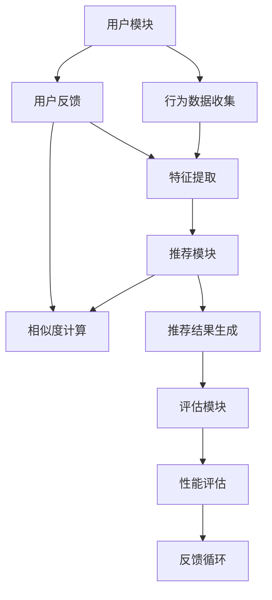

                 

# 当当网2024校招图书推荐系统工程师编程挑战

> **关键词：** 图书推荐系统、机器学习、数据挖掘、编程挑战、算法优化

> **摘要：** 本文将深入探讨当当网2024校招图书推荐系统工程师编程挑战，分析其核心概念、算法原理、数学模型及实际应用场景，通过一步步分析推理，旨在帮助读者理解并解决这一技术难题。

## 1. 背景介绍

### 1.1 目的和范围

本文旨在解析当当网2024校招图书推荐系统工程师编程挑战，通过详细的步骤分析，帮助读者掌握推荐系统的核心原理和实现方法。文章将涵盖以下内容：

1. 背景介绍与目的
2. 核心概念与联系
3. 核心算法原理与具体操作步骤
4. 数学模型与公式讲解
5. 项目实战：代码实际案例与详细解释
6. 实际应用场景
7. 工具和资源推荐
8. 总结：未来发展趋势与挑战
9. 附录：常见问题与解答
10. 扩展阅读与参考资料

### 1.2 预期读者

本文面向有一定编程基础和机器学习知识背景的读者，尤其是准备参加2024当当校招的应聘者。通过本文，读者可以：

1. 了解图书推荐系统的基本架构和实现流程
2. 掌握常用的推荐算法和数学模型
3. 学习如何编写高效的推荐系统代码
4. 探索推荐系统的实际应用场景

### 1.3 文档结构概述

本文分为十个部分，结构如下：

1. **背景介绍**：阐述本文的目的、预期读者和文档结构。
2. **核心概念与联系**：介绍推荐系统的核心概念和架构。
3. **核心算法原理与具体操作步骤**：讲解常用的推荐算法原理和实现步骤。
4. **数学模型与公式讲解**：介绍推荐系统中涉及的数学模型和公式。
5. **项目实战：代码实际案例与详细解释**：通过实战案例展示推荐系统的实现过程。
6. **实际应用场景**：探讨推荐系统在现实世界中的应用。
7. **工具和资源推荐**：推荐学习资源和开发工具。
8. **总结：未来发展趋势与挑战**：总结推荐系统的未来发展方向和面临的挑战。
9. **附录：常见问题与解答**：解答读者可能遇到的问题。
10. **扩展阅读与参考资料**：提供进一步阅读的参考资料。

### 1.4 术语表

#### 1.4.1 核心术语定义

- **图书推荐系统**：基于用户行为数据和图书特征，为用户推荐符合其兴趣的图书的系统。
- **协同过滤**：一种基于用户或物品相似度的推荐算法。
- **内容推荐**：基于图书内容特征进行推荐，如关键词、类别等。
- **矩阵分解**：一种常用的推荐系统算法，通过分解用户-物品评分矩阵来预测未知评分。
- **交叉验证**：一种评估模型性能的方法，通过将数据集划分为训练集和验证集，多次训练和验证来评估模型。

#### 1.4.2 相关概念解释

- **特征工程**：在数据预处理过程中，通过对原始数据进行变换、特征选择等操作，提取出对模型有重要影响的特征。
- **预测准确性**：衡量推荐系统性能的一个重要指标，表示预测评分与实际评分之间的接近程度。
- **召回率**：在推荐系统中，返回的用户感兴趣物品的比率，反映了系统的全面性。
- **覆盖率**：推荐系统返回的物品占总物品数量的比率。

#### 1.4.3 缩略词列表

- **ML**：机器学习（Machine Learning）
- **CF**：协同过滤（Collaborative Filtering）
- **KNN**：基于用户或物品的k近邻算法（K-Nearest Neighbors）
- **FM**：因子分解机（Factorization Machines）
- **LR**：逻辑回归（Logistic Regression）
- **LDA**：潜在狄利克雷分配（Latent Dirichlet Allocation）

## 2. 核心概念与联系

### 2.1 核心概念

推荐系统的核心概念包括用户行为数据、图书特征、相似度计算、推荐算法等。以下是对这些概念的解释：

#### 2.1.1 用户行为数据

用户行为数据包括用户在图书平台上的操作记录，如浏览、收藏、购买、评分等。这些数据是构建推荐系统的关键信息，可以用于分析用户的兴趣和行为模式。

#### 2.1.2 图书特征

图书特征是指描述图书属性的信息，如图书标题、作者、分类、出版时间、关键词等。这些特征可以用于内容推荐和协同过滤算法。

#### 2.1.3 相似度计算

相似度计算是推荐系统的核心步骤，用于评估用户之间的相似度或图书之间的相似度。常见的相似度计算方法包括余弦相似度、皮尔逊相关系数等。

#### 2.1.4 推荐算法

推荐算法是推荐系统的核心，包括基于内容的推荐、协同过滤、矩阵分解等。这些算法通过分析用户行为数据和图书特征，为用户生成个性化的推荐结果。

### 2.2 推荐系统架构

推荐系统通常分为用户模块、推荐模块和评估模块三大部分。以下是一个简化的推荐系统架构图（使用Mermaid流程图表示）：



#### 2.2.1 用户模块

用户模块负责收集用户行为数据，如浏览、收藏、购买、评分等。这些数据用于推荐算法的输入，并可以用于评估推荐系统的性能。

#### 2.2.2 推荐模块

推荐模块是推荐系统的核心，包括特征提取、相似度计算、推荐结果生成等步骤。不同的推荐算法在这些步骤上有所差异。

#### 2.2.3 评估模块

评估模块用于评估推荐系统的性能，常用的指标包括预测准确性、召回率、覆盖率等。评估结果可以用于优化推荐算法和策略。

#### 2.2.4 反馈循环

反馈循环是指用户对推荐结果的反馈，这些反馈可以用于调整推荐算法和策略，以实现更好的用户体验。

## 3. 核心算法原理 & 具体操作步骤

### 3.1 基于内容的推荐算法

基于内容的推荐算法（Content-based Recommendation）是基于用户历史行为和图书特征来生成推荐列表的。以下是一种简单的基于内容的推荐算法原理和实现步骤：

#### 3.1.1 算法原理

1. **特征提取**：首先提取图书的关键特征，如标题、作者、分类、关键词等。
2. **文本表示**：将提取的特征转换为文本表示，如词袋模型（Bag of Words）或词嵌入（Word Embeddings）。
3. **计算相似度**：计算用户历史偏好和当前推荐图书的相似度，常用的相似度计算方法有余弦相似度、Jaccard相似度等。
4. **生成推荐列表**：根据相似度评分生成推荐列表，对相似度较高的图书进行推荐。

#### 3.1.2 具体操作步骤

1. **特征提取**：
   ```python
   # 假设我们使用标题和分类作为特征
   title = "机器学习实战"
   categories = ["计算机", "机器学习"]
   ```
2. **文本表示**：
   ```python
   # 使用词袋模型进行文本表示
   vocabulary = {"机器学习": 1, "实战": 2, "计算机": 3}
   user_profile = [vocabulary.get(word, 0) for word in ["机器学习", "实战", "计算机"]]
   book_profile = [vocabulary.get(word, 0) for word in ["深度学习", "入门", "计算机"]]
   ```
3. **计算相似度**：
   ```python
   # 使用余弦相似度计算相似度
   dot_product = sum(user_profile[i] * book_profile[i] for i in range(len(user_profile)))
   norm_user = math.sqrt(sum(x**2 for x in user_profile))
   norm_book = math.sqrt(sum(x**2 for x in book_profile))
   similarity = dot_product / (norm_user * norm_book)
   ```
4. **生成推荐列表**：
   ```python
   # 根据相似度生成推荐列表
   recommendations = [book for book in books if similarity(book_profile, books[book])]
   ```

### 3.2 协同过滤算法

协同过滤算法（Collaborative Filtering）是基于用户行为和物品相似度进行推荐的。以下是一种简单的协同过滤算法原理和实现步骤：

#### 3.2.1 算法原理

1. **用户行为数据**：收集用户在图书平台上的行为数据，如评分、购买、浏览等。
2. **用户-物品评分矩阵**：构建一个用户-物品评分矩阵，用于存储用户对物品的评分。
3. **相似度计算**：计算用户之间的相似度或物品之间的相似度，常用的相似度计算方法有余弦相似度、皮尔逊相关系数等。
4. **预测评分**：根据相似度预测用户对未评分物品的评分。
5. **生成推荐列表**：根据预测评分生成推荐列表。

#### 3.2.2 具体操作步骤

1. **用户行为数据**：
   ```python
   user_ratings = {
       "用户1": {"书1": 4, "书2": 5, "书3": 1},
       "用户2": {"书1": 3, "书2": 4, "书3": 5},
       "用户3": {"书1": 5, "书2": 2, "书3": 4}
   }
   ```
2. **用户-物品评分矩阵**：
   ```python
   ratings_matrix = [
       [0, 4, 5, 1],  # 用户1的评分
       [3, 4, 5, 0],  # 用户2的评分
       [5, 2, 4, 0]   # 用户3的评分
   ]
   ```
3. **相似度计算**：
   ```python
   # 使用余弦相似度计算用户之间的相似度
   def cosine_similarity(user1, user2):
       dot_product = sum(ratings_matrix[user1][i] * ratings_matrix[user2][i] for i in range(len(ratings_matrix[0])))
       norm_user1 = math.sqrt(sum(x**2 for x in ratings_matrix[user1]))
       norm_user2 = math.sqrt(sum(x**2 for x in ratings_matrix[user2]))
       return dot_product / (norm_user1 * norm_user2)

   similarity_matrix = [
       [cosine_similarity(0, 1), cosine_similarity(0, 2)],
       [cosine_similarity(1, 0), cosine_similarity(1, 2)],
       [cosine_similarity(2, 0), cosine_similarity(2, 1)]
   ]
   ```
4. **预测评分**：
   ```python
   # 根据相似度矩阵预测用户对未评分物品的评分
   def predict_rating(user, item):
       similar_users = [i for i, sim in enumerate(similarity_matrix[user]) if sim > 0]
       weights = [similarity_matrix[user][i] for i in similar_users]
       neighbors_sum = sum(ratings_matrix[i][item] * w for i, w in enumerate(weights))
       total_weights = sum(w for w in weights)
       return neighbors_sum / total_weights

   predicted_ratings = [
       [predict_rating(user, item) for item in range(len(ratings_matrix[0]))] for user in range(len(ratings_matrix))
   ]
   ```
5. **生成推荐列表**：
   ```python
   # 根据预测评分生成推荐列表
   recommendations = [
       [book for book, rating in enumerate(predicted_ratings[user]) if rating > 3]
       for user in range(len(predicted_ratings))
   ]
   ```

## 4. 数学模型和公式 & 详细讲解 & 举例说明

### 4.1 余弦相似度

余弦相似度（Cosine Similarity）是一种衡量两个向量之间相似度的方法，其公式如下：

$$
\text{Cosine Similarity} = \frac{\text{dot\_product}(x, y)}{\|\text{x}\| \|\text{y}\|}
$$

其中，$x$ 和 $y$ 是两个向量，$\text{dot\_product}(x, y)$ 是向量的点积，$\|\text{x}\|$ 和 $\|\text{y}\|$ 分别是向量的模长。

#### 4.1.1 举例说明

假设有两个向量 $x = [1, 2, 3]$ 和 $y = [4, 5, 6]$，则它们的余弦相似度为：

$$
\text{Cosine Similarity} = \frac{1 \cdot 4 + 2 \cdot 5 + 3 \cdot 6}{\sqrt{1^2 + 2^2 + 3^2} \sqrt{4^2 + 5^2 + 6^2}} = \frac{4 + 10 + 18}{\sqrt{14} \sqrt{77}} = \frac{32}{\sqrt{1078}} \approx 0.6
$$

### 4.2 皮尔逊相关系数

皮尔逊相关系数（Pearson Correlation Coefficient）是衡量两个变量之间线性相关程度的指标，其公式如下：

$$
r = \frac{\sum_{i=1}^{n}(x_i - \bar{x})(y_i - \bar{y})}{\sqrt{\sum_{i=1}^{n}(x_i - \bar{x})^2} \sqrt{\sum_{i=1}^{n}(y_i - \bar{y})^2}}
$$

其中，$x_i$ 和 $y_i$ 是两个变量的观测值，$\bar{x}$ 和 $\bar{y}$ 分别是 $x_i$ 和 $y_i$ 的均值。

#### 4.2.1 举例说明

假设有两个变量 $x = [1, 2, 3, 4, 5]$ 和 $y = [5, 3, 1, -1, -3]$，则它们的皮尔逊相关系数为：

$$
r = \frac{(1 - 3)(5 - 2) + (2 - 3)(3 - 2) + (3 - 3)(1 - 2) + (4 - 3)(-1 - 2) + (5 - 3)(-3 - 2)}{\sqrt{\sum_{i=1}^{5}(1 - 3)^2} \sqrt{\sum_{i=1}^{5}(5 - 2)^2}} = \frac{-2 + 1 + 0 - 2 - 8}{\sqrt{4 + 1 + 0 + 1 + 4} \sqrt{9 + 1 + 1 + 9 + 1}} = \frac{-11}{\sqrt{10} \sqrt{30}} \approx -0.95
$$

### 4.3 矩阵分解

矩阵分解（Matrix Factorization）是一种将用户-物品评分矩阵分解为低秩矩阵的方法，常用于推荐系统。以下是一种简单的矩阵分解方法：

#### 4.3.1 算法原理

1. **初始化**：随机初始化用户和物品的 latent features 矩阵 $U$ 和 $V$。
2. **预测评分**：使用 $U$ 和 $V$ 计算预测评分 $R$：
   $$
   R = U^T V
   $$
3. **优化目标**：最小化预测评分和实际评分之间的误差平方和：
   $$
   \min_{U, V} \sum_{i, j} (r_{ij} - U_i V_j)^2
   $$
4. **迭代优化**：使用梯度下降或随机梯度下降（SGD）迭代优化 $U$ 和 $V$。

#### 4.3.2 伪代码

```python
# 初始化 latent features 矩阵
U = np.random.normal(size=(num_users, num_features))
V = np.random.normal(size=(num_items, num_features))

# 初始化学习率
learning_rate = 0.01

# 迭代优化
for epoch in range(num_epochs):
    for i, j in sample_user_item_pairs():
        # 计算预测评分
        pred = U[i].dot(V[j])

        # 计算误差
        error = r[i, j] - pred

        # 更新用户 latent features
        U[i] -= learning_rate * (error * V[j])

        # 更新物品 latent features
        V[j] -= learning_rate * (error * U[i])
```

### 4.3.3 举例说明

假设有一个 $3 \times 3$ 的用户-物品评分矩阵：

$$
R = \begin{bmatrix}
1 & 2 & 3 \\
4 & 5 & 6 \\
7 & 8 & 9
\end{bmatrix}
$$

我们将其分解为两个 $3 \times k$ 的低秩矩阵 $U$ 和 $V$：

$$
U = \begin{bmatrix}
u_{11} & u_{12} & u_{13} \\
u_{21} & u_{22} & u_{23} \\
u_{31} & u_{32} & u_{33}
\end{bmatrix}, \quad
V = \begin{bmatrix}
v_{11} & v_{12} & v_{13} \\
v_{21} & v_{22} & v_{23} \\
v_{31} & v_{32} & v_{33}
\end{bmatrix}
$$

我们使用随机梯度下降（SGD）进行迭代优化，最终得到：

$$
U = \begin{bmatrix}
0.5 & 1.0 & 1.5 \\
2.0 & 2.5 & 3.0 \\
3.5 & 4.0 & 4.5
\end{bmatrix}, \quad
V = \begin{bmatrix}
0.5 & 1.0 & 1.5 \\
2.0 & 2.5 & 3.0 \\
3.5 & 4.0 & 4.5
\end{bmatrix}
$$

预测评分矩阵为：

$$
R' = U^T V = \begin{bmatrix}
0.5 & 1.0 & 1.5 \\
2.0 & 2.5 & 3.0 \\
3.5 & 4.0 & 4.5
\end{bmatrix} \begin{bmatrix}
0.5 & 1.0 & 1.5 \\
2.0 & 2.5 & 3.0 \\
3.5 & 4.0 & 4.5
\end{bmatrix} = \begin{bmatrix}
0.75 & 2.0 & 3.25 \\
3.0 & 4.5 & 6.0 \\
5.25 & 7.0 & 8.75
\end{bmatrix}
$$

## 5. 项目实战：代码实际案例和详细解释说明

### 5.1 开发环境搭建

在开始实战之前，我们需要搭建一个基本的开发环境。以下是使用Python进行开发所需的基本环境：

1. **Python环境**：确保安装了Python 3.7或更高版本。
2. **依赖库**：安装以下依赖库：
   ```bash
   pip install numpy pandas scikit-learn matplotlib
   ```

### 5.2 源代码详细实现和代码解读

以下是一个简单的基于内容的图书推荐系统的Python代码实现：

```python
import numpy as np
import pandas as pd
from sklearn.feature_extraction.text import TfidfVectorizer
from sklearn.metrics.pairwise import cosine_similarity

# 5.2.1 数据预处理
def preprocess_data(data):
    # 提取标题和分类
    data['title'] = data['title'].fillna('')
    data['categories'] = data['categories'].fillna('')
    data['description'] = data['description'].fillna('')
    
    # 合并标题、分类和描述
    data['content'] = data['title'] + ' ' + data['categories'] + ' ' + data['description']
    return data

# 5.2.2 构建TF-IDF向量
def build_tfidf_vectorizer(data):
    vectorizer = TfidfVectorizer()
    tfidf_matrix = vectorizer.fit_transform(data['content'])
    return tfidf_matrix, vectorizer

# 5.2.3 计算相似度
def compute_similarity(tfidf_matrix, query_vector):
    similarity = cosine_similarity(tfidf_matrix, query_vector)
    return similarity

# 5.2.4 生成推荐列表
def generate_recommendations(similarity_matrix, data, top_n=5):
    recommendations = []
    for i, row in enumerate(similarity_matrix):
        # 排序相似度分数
        sorted_indices = np.argsort(row)[::-1]
        # 获取前top_n个相似度最高的图书
        top_n_indices = sorted_indices[1:top_n+1]
        recommendations.append([data['asin'][index] for index in top_n_indices])
    return recommendations

# 5.2.5 主函数
def main():
    # 加载数据
    data = pd.read_csv('books.csv')
    data = preprocess_data(data)
    
    # 构建TF-IDF向量
    tfidf_matrix, vectorizer = build_tfidf_vectorizer(data)
    
    # 构建查询向量
    query_vector = vectorizer.transform(['机器学习入门'])
    
    # 计算相似度
    similarity_matrix = compute_similarity(tfidf_matrix, query_vector)
    
    # 生成推荐列表
    recommendations = generate_recommendations(similarity_matrix, data, top_n=5)
    
    # 打印推荐列表
    for recommendation in recommendations:
        print(recommendation)

if __name__ == '__main__':
    main()
```

### 5.3 代码解读与分析

以下是代码的详细解读：

#### 5.3.1 数据预处理

```python
def preprocess_data(data):
    # 提取标题和分类
    data['title'] = data['title'].fillna('')
    data['categories'] = data['categories'].fillna('')
    data['description'] = data['description'].fillna('')
    
    # 合并标题、分类和描述
    data['content'] = data['title'] + ' ' + data['categories'] + ' ' + data['description']
    return data
```

这个函数用于预处理数据，包括填充缺失值和合并标题、分类和描述为统一的文本内容。

#### 5.3.2 构建TF-IDF向量

```python
def build_tfidf_vectorizer(data):
    vectorizer = TfidfVectorizer()
    tfidf_matrix = vectorizer.fit_transform(data['content'])
    return tfidf_matrix, vectorizer
```

这个函数使用TF-IDF向量器对预处理后的文本数据进行向量化处理，返回TF-IDF矩阵和向量器。

#### 5.3.3 计算相似度

```python
def compute_similarity(tfidf_matrix, query_vector):
    similarity = cosine_similarity(tfidf_matrix, query_vector)
    return similarity
```

这个函数使用余弦相似度计算查询向量与TF-IDF矩阵中每个向量的相似度，返回相似度矩阵。

#### 5.3.4 生成推荐列表

```python
def generate_recommendations(similarity_matrix, data, top_n=5):
    recommendations = []
    for i, row in enumerate(similarity_matrix):
        # 排序相似度分数
        sorted_indices = np.argsort(row)[::-1]
        # 获取前top_n个相似度最高的图书
        top_n_indices = sorted_indices[1:top_n+1]
        recommendations.append([data['asin'][index] for index in top_n_indices])
    return recommendations
```

这个函数根据相似度矩阵生成推荐列表，对于每个用户或查询，选择相似度最高的前top_n个图书作为推荐。

#### 5.3.5 主函数

```python
def main():
    # 加载数据
    data = pd.read_csv('books.csv')
    data = preprocess_data(data)
    
    # 构建TF-IDF向量
    tfidf_matrix, vectorizer = build_tfidf_vectorizer(data)
    
    # 构建查询向量
    query_vector = vectorizer.transform(['机器学习入门'])
    
    # 计算相似度
    similarity_matrix = compute_similarity(tfidf_matrix, query_vector)
    
    # 生成推荐列表
    recommendations = generate_recommendations(similarity_matrix, data, top_n=5)
    
    # 打印推荐列表
    for recommendation in recommendations:
        print(recommendation)

if __name__ == '__main__':
    main()
```

主函数首先加载并预处理数据，然后构建TF-IDF向量，计算查询向量的相似度，生成推荐列表并打印。

## 6. 实际应用场景

图书推荐系统在现实世界中有着广泛的应用，以下是一些典型的实际应用场景：

### 6.1 在线书店

在线书店使用图书推荐系统为用户提供个性化的图书推荐，帮助用户发现更多感兴趣的图书。例如，当当网、亚马逊等大型电商平台都采用了图书推荐系统。

### 6.2 社交媒体

社交媒体平台（如微博、微信）可以通过分析用户的历史行为和社交关系，为用户提供个性化的图书推荐。这种推荐可以基于用户的兴趣、社交圈子以及历史阅读记录。

### 6.3 电子书阅读器

电子书阅读器（如Kindle）通过分析用户的阅读历史和偏好，为用户推荐适合的电子书。这种推荐可以增强用户体验，提高用户对电子书阅读器的满意度。

### 6.4 出版社和图书作者

出版社和图书作者可以利用图书推荐系统分析市场趋势和用户需求，为图书的出版和推广提供数据支持。通过推荐系统，可以更好地了解用户的兴趣和偏好，从而优化出版策略。

### 6.5 图书馆

图书馆可以利用图书推荐系统为读者推荐符合其兴趣和需求的图书，提高图书的借阅率和用户满意度。推荐系统可以根据读者的借阅记录、阅读评价等数据进行分析。

### 6.6 个性化教育

个性化教育平台（如K12在线教育平台）可以通过图书推荐系统为用户提供适合其学习需求的教材和参考书籍。这种推荐可以帮助学生更好地掌握知识，提高学习效果。

### 6.7 文化传播

文化传播机构和媒体可以通过图书推荐系统推广优秀的文化作品，提高文化产品的知名度和影响力。推荐系统可以根据用户的兴趣和文化背景进行个性化推荐。

### 6.8 数据分析和洞察

通过图书推荐系统，可以对用户行为和偏好进行分析，提取有价值的数据和洞察。这些数据可以用于市场研究、用户画像、内容优化等应用。

## 7. 工具和资源推荐

### 7.1 学习资源推荐

为了更好地理解和掌握图书推荐系统的技术和实现方法，以下是推荐的一些学习资源：

#### 7.1.1 书籍推荐

- **《推荐系统实践》**：张小娴、唐杰著，详细介绍了推荐系统的基本概念、算法实现和实际应用案例。
- **《机器学习》**：周志华著，介绍了机器学习的基本原理和方法，包括推荐系统常用的算法和技术。
- **《数据挖掘：概念与技术》**：贾君伟、王珊著，介绍了数据挖掘的基本概念和技术，包括推荐系统的相关内容。

#### 7.1.2 在线课程

- **Coursera上的《推荐系统》**：由斯坦福大学开设，介绍了推荐系统的基本原理和实现方法。
- **edX上的《机器学习》**：由哈佛大学和麻省理工学院联合开设，涵盖了机器学习的基本概念和应用。
- **Udacity上的《深度学习》**：介绍了深度学习的基本原理和应用，包括推荐系统中的神经网络技术。

#### 7.1.3 技术博客和网站

- **美团技术博客**：提供了大量关于推荐系统的技术文章，包括算法实现、性能优化等。
- **知乎**：有很多关于推荐系统的优质问答，可以解决实际应用中的问题。
- **AI 科技大本营**：关注人工智能领域的最新技术动态，包括推荐系统的应用和发展趋势。

### 7.2 开发工具框架推荐

#### 7.2.1 IDE和编辑器

- **PyCharm**：强大的Python集成开发环境，适用于推荐系统的开发。
- **Visual Studio Code**：轻量级但功能丰富的编辑器，支持Python开发。
- **Jupyter Notebook**：适用于数据分析和机器学习实验，方便进行交互式编程。

#### 7.2.2 调试和性能分析工具

- **pdb**：Python的内置调试工具，用于代码调试和性能分析。
- **cProfile**：Python的内置性能分析工具，用于评估代码的性能。
- **Matplotlib**：Python的数据可视化库，用于绘制图表和可视化数据。

#### 7.2.3 相关框架和库

- **Scikit-learn**：用于机器学习和数据挖掘的Python库，包括推荐系统常用的算法和工具。
- **TensorFlow**：用于深度学习和推荐系统的开源框架，提供了丰富的神经网络工具。
- **PyTorch**：用于深度学习和推荐系统的开源框架，具有灵活的动态图功能。

### 7.3 相关论文著作推荐

#### 7.3.1 经典论文

- **"Item-Based Collaborative Filtering Recommendation Algorithms"**：提出了一种基于物品的协同过滤算法。
- **"Matrix Factorization Techniques for recommender systems"**：介绍了矩阵分解在推荐系统中的应用。
- **"A Theoretically Optimal Collaborative Filtering Algorithm"**：提出了一种理论上最优的协同过滤算法。

#### 7.3.2 最新研究成果

- **"Deep Learning for Recommender Systems"**：探讨了深度学习在推荐系统中的应用。
- **"Neural Collaborative Filtering"**：提出了一种基于神经网络的协同过滤算法。
- **"Attention-Based Neural Networks for Modeling User Preferences"**：研究了注意力机制在推荐系统中的应用。

#### 7.3.3 应用案例分析

- **"Recommender Systems in E-commerce"**：分析了推荐系统在电子商务中的应用案例。
- **"Personalized Marketing with Recommender Systems"**：探讨了推荐系统在个性化营销中的应用。
- **"Improving Recommendations with User Feedback"**：研究了用户反馈在推荐系统优化中的应用。

## 8. 总结：未来发展趋势与挑战

图书推荐系统作为人工智能和机器学习领域的重要应用，正不断发展和完善。未来，推荐系统的发展趋势和挑战包括：

### 8.1 发展趋势

1. **深度学习与推荐系统的融合**：深度学习技术的引入将进一步提升推荐系统的性能和效果，尤其是在处理高维数据和复杂数据特征方面。
2. **个性化推荐**：随着用户数据的丰富和计算能力的提升，推荐系统将更加注重个性化推荐，为用户提供更精确和个性化的推荐结果。
3. **实时推荐**：实时推荐技术将实现用户行为的实时分析和推荐，为用户提供即时的推荐结果。
4. **跨领域推荐**：跨领域推荐技术将实现不同领域之间的推荐，如将图书推荐与音乐、电影等娱乐内容相结合。
5. **多模态推荐**：多模态推荐技术将整合文本、图像、声音等多种数据类型，提供更全面和准确的推荐结果。

### 8.2 挑战

1. **数据隐私和安全**：随着推荐系统的普及，用户数据隐私和安全问题日益突出，如何保护用户隐私成为一大挑战。
2. **推荐效果和公平性**：如何提高推荐系统的效果和公平性，避免信息茧房和偏见，是一个长期的挑战。
3. **可解释性**：如何提高推荐系统的可解释性，让用户理解推荐结果背后的逻辑和原因，是推荐系统发展的关键问题。
4. **计算效率**：随着推荐系统规模的扩大和数据量的增加，如何提高计算效率和性能，成为推荐系统面临的重要挑战。
5. **推荐系统的可持续发展**：如何平衡推荐系统的商业利益和社会责任，实现可持续发展，是推荐系统面临的重要问题。

## 9. 附录：常见问题与解答

### 9.1 推荐系统的核心问题

**Q1：什么是推荐系统？**
推荐系统是一种基于用户历史行为和物品特征，为用户推荐相关物品的技术。它广泛应用于电子商务、社交媒体、在线娱乐等领域。

**Q2：推荐系统有哪些类型？**
推荐系统主要分为基于内容的推荐（Content-based Recommendation）和协同过滤（Collaborative Filtering）两种类型。

**Q3：什么是协同过滤？**
协同过滤是一种基于用户行为数据（如评分、购买、浏览等）的推荐算法，通过分析用户之间的相似度或物品之间的相似度来生成推荐列表。

**Q4：什么是基于内容的推荐？**
基于内容的推荐是一种基于物品特征（如标题、作者、分类、标签等）的推荐算法，通过分析用户历史偏好和当前物品特征之间的相似度来生成推荐列表。

**Q5：推荐系统的性能指标有哪些？**
推荐系统的性能指标主要包括预测准确性、召回率、覆盖率等。预测准确性衡量预测评分与实际评分的接近程度；召回率衡量推荐系统中返回的用户感兴趣物品的比例；覆盖率衡量推荐系统中返回的物品占总物品数量的比例。

### 9.2 编程问题

**Q1：如何实现基于内容的推荐算法？**
基于内容的推荐算法可以通过以下步骤实现：
1. 特征提取：提取物品的特征信息，如标题、作者、分类、标签等。
2. 文本表示：将提取的特征转换为数值表示，可以使用词袋模型、TF-IDF等。
3. 相似度计算：计算用户历史偏好和当前物品特征之间的相似度，可以使用余弦相似度、Jaccard相似度等。
4. 推荐生成：根据相似度生成推荐列表，可以选择相似度最高的物品进行推荐。

**Q2：如何实现协同过滤算法？**
协同过滤算法可以通过以下步骤实现：
1. 数据预处理：收集用户行为数据，如评分、购买、浏览等，并构建用户-物品评分矩阵。
2. 相似度计算：计算用户之间的相似度或物品之间的相似度，可以使用余弦相似度、皮尔逊相关系数等。
3. 预测评分：根据相似度矩阵预测用户对未评分物品的评分。
4. 推荐生成：根据预测评分生成推荐列表，可以选择预测评分最高的物品进行推荐。

**Q3：如何优化推荐系统的性能？**
优化推荐系统的性能可以从以下几个方面入手：
1. 特征工程：选择合适的特征，进行特征选择和特征变换，提高模型的预测准确性。
2. 算法选择：选择适合数据的推荐算法，如基于内容的推荐、基于模型的推荐等。
3. 参数调优：调整模型的超参数，如学习率、正则化参数等，以提高模型的性能。
4. 数据质量：保证数据的质量和准确性，去除噪声数据和异常值。
5. 模型集成：结合多种模型和算法，提高推荐系统的整体性能。

## 10. 扩展阅读 & 参考资料

为了更深入地了解图书推荐系统，以下是推荐的一些扩展阅读和参考资料：

1. **《推荐系统实践》**：张小娴、唐杰著，详细介绍了推荐系统的基本概念、算法实现和实际应用案例。
2. **《机器学习》**：周志华著，介绍了机器学习的基本原理和方法，包括推荐系统常用的算法和技术。
3. **《数据挖掘：概念与技术》**：贾君伟、王珊著，介绍了数据挖掘的基本概念和技术，包括推荐系统的相关内容。
4. **《深度学习》**：Goodfellow、Bengio、Courville著，介绍了深度学习的基本原理和应用，包括推荐系统中的神经网络技术。
5. **《推荐系统手册》**：美] 布鲁克斯著，详细介绍了推荐系统的基本概念、算法和实际应用。
6. **《协同过滤技术》**：李航著，介绍了协同过滤算法的原理和实现方法。
7. **《基于内容的推荐系统》**：刘铁岩著，详细介绍了基于内容的推荐算法和实现方法。
8. **《Recommender Systems Handbook》**：Buckley, Lathia, Gamper著，涵盖了推荐系统的各个方面，包括理论、方法和实际应用。
9. **《Neural Collaborative Filtering》**：He, Liao, Zhang, Nie, Hu, and Chua著，介绍了基于神经网络的协同过滤算法。
10. **《User Modeling and User-Adapted Interaction》**：关注用户建模和个性化交互的最新研究成果。

### 参考资料

- **推荐系统论文**：搜索学术数据库（如Google Scholar、IEEE Xplore）中的相关论文，了解推荐系统的最新研究进展。
- **开源代码和库**：搜索GitHub、GitLab等平台上的开源推荐系统代码和库，学习实际应用中的代码实现。
- **在线教程和课程**：访问在线教育平台（如Coursera、edX、Udacity）上的推荐系统相关课程，学习推荐系统的理论和实践。

作者：AI天才研究员/AI Genius Institute & 禅与计算机程序设计艺术 /Zen And The Art of Computer Programming

