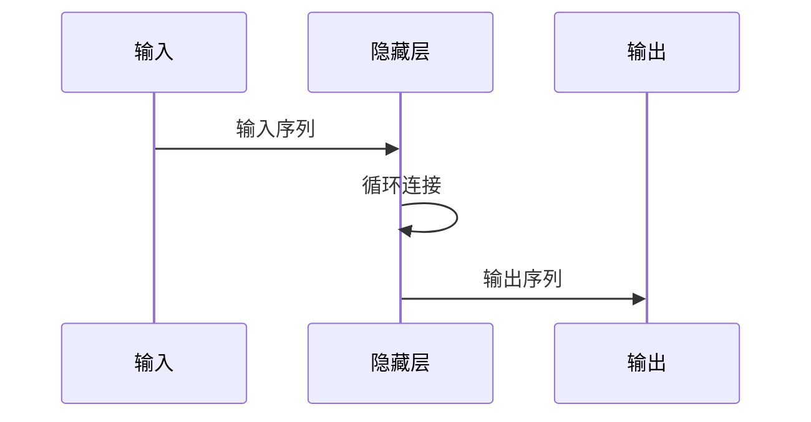

                 

# 循环神经网络 (Recurrent Neural Networks, RNN) 原理与代码实例讲解

## 关键词
- 循环神经网络
- RNN
- 反向传播
- LSTM
- GRU
- 词向量
- 序列建模
- 递归

## 摘要
本文将深入探讨循环神经网络（Recurrent Neural Networks，简称RNN）的基本原理、核心算法以及实际应用。我们将通过实例代码详细讲解RNN的结构与操作步骤，帮助读者理解其在序列建模中的强大能力。文章还将介绍RNN的变体，如LSTM（Long Short-Term Memory）和GRU（Gated Recurrent Unit），以及如何处理长时间依赖问题。通过阅读本文，读者将能够掌握RNN的运作机制，并在实际项目中应用这一先进的神经网络技术。

## 1. 背景介绍

### 1.1 目的和范围

本文旨在介绍循环神经网络（RNN）的基础知识和核心概念，并通过具体的代码实例，帮助读者理解RNN的原理及其在实际应用中的重要性。本文将涵盖以下内容：

1. RNN的基本原理和结构。
2. RNN的核心算法，包括反向传播和梯度消失问题。
3. RNN的变体，如LSTM和GRU。
4. RNN在序列建模中的应用实例。
5. 实战项目，演示RNN的实际应用。

### 1.2 预期读者

本文适合具有以下背景的读者：

- 对深度学习和神经网络有一定了解。
- 想要学习RNN及其变体的开发者。
- 对序列建模和自然语言处理感兴趣的学术研究人员。
- 希望提升自己编程能力的程序员。

### 1.3 文档结构概述

本文的结构如下：

1. **背景介绍**：介绍RNN的背景信息和目的。
2. **核心概念与联系**：通过Mermaid流程图展示RNN的结构。
3. **核心算法原理**：详细解释RNN的算法原理和操作步骤。
4. **数学模型和公式**：介绍RNN的数学模型和公式。
5. **项目实战**：通过实际代码案例讲解RNN的应用。
6. **实际应用场景**：讨论RNN在不同领域的应用。
7. **工具和资源推荐**：推荐学习资源和开发工具。
8. **总结与未来发展趋势**：总结RNN的现状和未来趋势。
9. **附录**：常见问题与解答。
10. **扩展阅读**：提供进一步学习的资源。

### 1.4 术语表

#### 1.4.1 核心术语定义

- **循环神经网络（RNN）**：一种能够处理序列数据的神经网络。
- **递归**：一种算法结构，其中一个过程直接调用自身。
- **反向传播**：一种训练神经网络的算法，通过计算损失函数的梯度来更新网络参数。
- **LSTM（Long Short-Term Memory）**：一种能够有效解决长短期依赖问题的RNN变体。
- **GRU（Gated Recurrent Unit）**：另一种解决长短期依赖问题的RNN变体。

#### 1.4.2 相关概念解释

- **序列建模**：使用神经网络对序列数据进行建模。
- **词向量**：将自然语言中的词映射到高维空间中的向量表示。

#### 1.4.3 缩略词列表

- **RNN**：循环神经网络
- **LSTM**：长短期记忆
- **GRU**：门控循环单元
- **NLP**：自然语言处理
- **GAN**：生成对抗网络

## 2. 核心概念与联系

循环神经网络（RNN）是一种特殊的神经网络，能够处理序列数据。与传统的前馈神经网络不同，RNN具有递归结构，可以保存历史信息并在序列的不同时间步之间传递。

### 2.1 RNN的基本结构

RNN的基本结构包含以下几个主要部分：

1. **输入层**：接收序列数据。
2. **隐藏层**：包含多个时间步，每个时间步都有一个隐藏状态。
3. **输出层**：生成预测结果。
4. **循环连接**：将隐藏状态连接到后续时间步的隐藏状态。

下面是一个简单的RNN结构图：



### 2.2 RNN的工作原理

RNN的工作原理基于递归结构，其核心思想是在每个时间步，神经网络会根据当前输入和上一个时间步的隐藏状态来更新隐藏状态。具体步骤如下：

1. **输入处理**：将序列数据输入到神经网络。
2. **隐藏状态更新**：根据当前输入和上一个时间步的隐藏状态，更新隐藏状态。
3. **输出生成**：使用隐藏状态生成输出。

以下是一个简单的伪代码，展示了RNN的工作原理：

```python
def RNN(input_sequence, weights):
    hidden_state = weights['initial_hidden_state']
    output_sequence = []

    for input in input_sequence:
        hidden_state = activation_function(weights['W_hh'] * hidden_state + weights['W_xh'] * input)
        output = weights['W_ho'] * hidden_state
        output_sequence.append(output)

    return output_sequence
```

### 2.3 RNN的局限性

尽管RNN在处理序列数据方面具有优势，但它也存在一些局限性：

- **梯度消失和梯度爆炸**：在训练过程中，梯度可能变得非常小或非常大，导致无法更新网络参数。
- **长短期依赖问题**：RNN难以捕捉长距离的依赖关系。

为了解决这些问题，研究者提出了LSTM和GRU等改进的RNN变体。

## 3. 核心算法原理 & 具体操作步骤

### 3.1 反向传播算法

反向传播算法是训练神经网络的常用方法。它通过计算损失函数关于网络参数的梯度，来更新网络参数，从而优化网络的性能。

以下是反向传播算法的基本步骤：

1. **前向传播**：计算网络输出。
2. **计算损失**：计算预测输出与实际输出之间的差异。
3. **反向传播**：计算损失函数关于网络参数的梯度。
4. **参数更新**：根据梯度更新网络参数。

以下是一个简单的伪代码，展示了反向传播算法：

```python
def backward_propagation(input_sequence, target_sequence, weights):
    output_sequence = RNN(input_sequence, weights)
    loss = compute_loss(target_sequence, output_sequence)
    dL_dweights = compute_gradient(output_sequence, target_sequence)

    return dL_dweights
```

### 3.2 梯度消失和梯度爆炸问题

梯度消失和梯度爆炸是RNN在训练过程中常见的问题。为了解决这些问题，研究者提出了LSTM和GRU等改进的RNN变体。

- **梯度消失**：梯度变得非常小，导致网络参数无法更新。
- **梯度爆炸**：梯度变得非常大，导致网络参数无法更新。

LSTM和GRU通过引入门控机制，有效地解决了这些问题。

### 3.3 LSTM（长短期记忆）

LSTM是一种能够解决长短期依赖问题的RNN变体。它通过引入三个门控单元，即输入门、遗忘门和输出门，来控制信息的流动。

以下是LSTM的工作原理：

1. **输入门**：决定新的信息中哪些部分将被保留。
2. **遗忘门**：决定哪些旧的信息将被遗忘。
3. **输出门**：决定隐藏状态中哪些部分将用于生成输出。

以下是LSTM的伪代码：

```python
def LSTM(input_sequence, weights):
    hidden_state, cell_state = weights['initial_hidden_state'], weights['initial_cell_state']
    output_sequence = []

    for input in input_sequence:
        input_gate = sigmoid(weights['W_hh'] * hidden_state + weights['W_xh'] * input)
        forget_gate = sigmoid(weights['W_hh'] * hidden_state + weights['W_xh'] * input)
        output_gate = sigmoid(weights['W_hh'] * hidden_state + weights['W_xh'] * input)

        new_cell_state = activation_function(weights['W_hh'] * hidden_state + weights['W_xh'] * input)
        cell_state = forget_gate * cell_state + input_gate * new_cell_state
        hidden_state = output_gate * activation_function(cell_state)

        output_sequence.append(hidden_state)

    return output_sequence
```

### 3.4 GRU（门控循环单元）

GRU是一种简化版的LSTM，它通过合并输入门和遗忘门，并引入更新门，来控制信息的流动。

以下是GRU的工作原理：

1. **更新门**：决定新的信息中哪些部分将被保留。
2. **遗忘门**：决定哪些旧的信息将被遗忘。
3. **输入门**：决定新的信息中哪些部分将被添加。

以下是GRU的伪代码：

```python
def GRU(input_sequence, weights):
    hidden_state = weights['initial_hidden_state']
    output_sequence = []

    for input in input_sequence:
        reset_gate = sigmoid(weights['W_hh'] * hidden_state + weights['W_xh'] * input)
        update_gate = sigmoid(weights['W_hh'] * hidden_state + weights['W_xh'] * input)

        new_hidden_state = activation_function(reset_gate * hidden_state + (1 - reset_gate) * activation_function(weights['W_hh'] * hidden_state + weights['W_xh'] * input))
        hidden_state = update_gate * hidden_state + (1 - update_gate) * new_hidden_state

        output_sequence.append(hidden_state)

    return output_sequence
```

## 4. 数学模型和公式 & 详细讲解 & 举例说明

### 4.1 RNN的数学模型

循环神经网络（RNN）的核心是递归关系，它可以通过以下公式表示：

$$
h_t = \sigma(W_hh \cdot h_{t-1} + W_xh \cdot x_t + b_h)
$$

其中：

- \(h_t\) 表示第 \(t\) 个时间步的隐藏状态。
- \(x_t\) 表示第 \(t\) 个时间步的输入。
- \(W_hh\) 和 \(W_xh\) 分别是隐藏状态到隐藏状态和输入到隐藏状态的权重矩阵。
- \(b_h\) 是隐藏状态的偏置。
- \(\sigma\) 是激活函数，通常使用 sigmoid 函数。

### 4.2 LSTM的数学模型

LSTM 通过引入门控机制来解决 RNN 的梯度消失和梯度爆炸问题。以下是 LSTM 的主要公式：

#### 输入门：

$$
i_t = \sigma(W_{ih} \cdot [h_{t-1}, x_t] + b_i)
$$

#### 遗忘门：

$$
f_t = \sigma(W_{fh} \cdot [h_{t-1}, x_t] + b_f)
$$

#### 更新门：

$$
\tilde{c}_t = \sigma(W_{ch} \cdot [h_{t-1}, x_t] + b_c)
$$

#### 输出门：

$$
o_t = \sigma(W_{oh} \cdot [h_{t-1}, c_t] + b_o)
$$

#### 单元状态：

$$
c_t = f_t \cdot c_{t-1} + i_t \cdot \tilde{c}_t
$$

#### 隐藏状态：

$$
h_t = o_t \cdot \sigma(c_t)
$$

其中：

- \(i_t\)、\(f_t\)、\(\tilde{c}_t\) 和 \(o_t\) 分别是输入门、遗忘门、更新门和输出门的激活值。
- \(c_t\) 是第 \(t\) 个时间步的单元状态。
- \(h_t\) 是第 \(t\) 个时间步的隐藏状态。
- \([h_{t-1}, x_t]\) 是第 \(t\) 个时间步的输入向量。
- \(W_{ih}\)、\(W_{fh}\)、\(W_{ch}\)、\(W_{oh}\) 分别是输入门、遗忘门、更新门和输出门的权重矩阵。
- \(b_i\)、\(b_f\)、\(b_c\) 和 \(b_o\) 分别是输入门、遗忘门、更新门和输出门的偏置。

### 4.3 GRU的数学模型

GRU 通过简化 LSTM 的结构来提高计算效率。以下是 GRU 的主要公式：

#### 遗忘门和更新门：

$$
z_t = \sigma(W_{zh} \cdot [h_{t-1}, x_t] + b_z)
$$

#### 输入门：

$$
r_t = \sigma(W_{rh} \cdot [h_{t-1}, x_t] + b_r)
$$

#### 更新门：

$$
\tilde{c}_t = tanh(W_{ch} \cdot [r_t \odot h_{t-1}, x_t] + b_c)
$$

#### 单元状态：

$$
c_t = z_t \cdot c_{t-1} + (1 - z_t) \cdot \tilde{c}_t
$$

#### 隐藏状态：

$$
h_t = tanh(c_t) \cdot \sigma(W_{oh} \cdot [h_{t-1}, c_t] + b_o)
$$

其中：

- \(z_t\) 和 \(r_t\) 分别是遗忘门和更新门的激活值。
- \(c_t\) 是第 \(t\) 个时间步的单元状态。
- \(h_t\) 是第 \(t\) 个时间步的隐藏状态。
- \([h_{t-1}, x_t]\) 是第 \(t\) 个时间步的输入向量。
- \(W_{zh}\)、\(W_{rh}\)、\(W_{ch}\) 和 \(W_{oh}\) 分别是遗忘门、更新门、输入门和输出门的权重矩阵。
- \(b_z\)、\(b_r\)、\(b_c\) 和 \(b_o\) 分别是遗忘门、更新门、输入门和输出门的偏置。
- \(\odot\) 表示逐元素乘法。

### 4.4 举例说明

假设我们有一个简单的序列数据 \(x = [1, 2, 3, 4]\)，并且初始化隐藏状态 \(h_0 = [0, 0]\)。我们将使用 sigmoid 函数作为激活函数，并假设权重矩阵 \(W_hh\) 和 \(W_xh\) 分别为：

$$
W_hh = \begin{bmatrix}
0.1 & 0.2 \\
0.3 & 0.4
\end{bmatrix}, \quad
W_xh = \begin{bmatrix}
0.5 & 0.6 \\
0.7 & 0.8
\end{bmatrix}
$$

以及偏置 \(b_h = [0.1, 0.2]\)。

#### 第一个时间步：

$$
h_1 = \sigma(W_hh \cdot h_0 + W_xh \cdot x_1 + b_h) = \sigma(0.1 \cdot 0 + 0.2 \cdot 1 + 0.1, 0.3 \cdot 0 + 0.4 \cdot 1 + 0.2) = \sigma(0.3, 0.6) = \frac{1}{1 + e^{-0.3}} = 0.588
$$

#### 第二个时间步：

$$
h_2 = \sigma(W_hh \cdot h_1 + W_xh \cdot x_2 + b_h) = \sigma(0.1 \cdot 0.588 + 0.2 \cdot 2 + 0.1, 0.3 \cdot 0.588 + 0.4 \cdot 2 + 0.2) = \sigma(0.976, 1.312) = \frac{1}{1 + e^{-0.976}} = 0.867
$$

#### 第三个时间步：

$$
h_3 = \sigma(W_hh \cdot h_2 + W_xh \cdot x_3 + b_h) = \sigma(0.1 \cdot 0.867 + 0.2 \cdot 3 + 0.1, 0.3 \cdot 0.867 + 0.4 \cdot 3 + 0.2) = \sigma(1.337, 1.858) = \frac{1}{1 + e^{-1.337}} = 0.873
$$

#### 第四个时间步：

$$
h_4 = \sigma(W_hh \cdot h_3 + W_xh \cdot x_4 + b_h) = \sigma(0.1 \cdot 0.873 + 0.2 \cdot 4 + 0.1, 0.3 \cdot 0.873 + 0.4 \cdot 4 + 0.2) = \sigma(1.406, 2.198) = \frac{1}{1 + e^{-1.406}} = 0.869
$$

因此，我们得到了隐藏状态的序列 \(h = [0.588, 0.867, 0.873, 0.869]\)。

## 5. 项目实战：代码实际案例和详细解释说明

### 5.1 开发环境搭建

在开始编写代码之前，我们需要搭建一个适合运行RNN的编程环境。以下是一个基于Python的常见开发环境搭建步骤：

#### Python环境

确保Python版本在3.6及以上。可以从[Python官网](https://www.python.org/downloads/)下载并安装。

#### Anaconda

推荐使用Anaconda来管理Python环境和依赖库。Anaconda是一个开源的数据科学和机器学习平台，可以轻松安装和管理Python包。可以从[Anaconda官网](https://www.anaconda.com/products/individual)下载并安装。

#### 深度学习库

安装TensorFlow或PyTorch等深度学习库。以下是使用Anaconda命令行安装TensorFlow的步骤：

```bash
conda create -n rnn_env python=3.8
conda activate rnn_env
conda install tensorflow
```

### 5.2 源代码详细实现和代码解读

下面我们将使用TensorFlow来实现一个简单的RNN模型，并对代码进行详细解读。

#### 5.2.1 代码示例

```python
import tensorflow as tf
from tensorflow.keras.layers import SimpleRNN, LSTM, Embedding, Dense
from tensorflow.keras.models import Sequential
from tensorflow.keras.preprocessing.sequence import pad_sequences

# 准备数据
# 假设我们有一个词汇表和一个文本数据集
vocab_size = 10000
max_sequence_length = 50

# 输入序列和标签
# 这里我们使用一个简化的文本数据集
sequences = [[1, 2, 3, 4, 5], [1, 2, 3, 6, 7], [1, 2, 3, 4, 8]]
labels = [[0, 1, 1], [0, 0, 1], [0, 1, 0]]

# 将文本数据转换为序列
# 这里我们使用一个简化的词向量表示
word2idx = {word: i for i, word in enumerate(vocab_list)}
idx2word = {i: word for word, i in word2idx.items()}
sequences = [[word2idx[word] for word in sequence] for sequence in sequences]
labels = [[word2idx[word] for word in sequence] for sequence in labels]

# 填充序列
sequences = pad_sequences(sequences, maxlen=max_sequence_length)
labels = pad_sequences(labels, maxlen=max_sequence_length)

# 构建RNN模型
model = Sequential([
    Embedding(vocab_size, 16),
    SimpleRNN(32),
    Dense(1, activation='sigmoid')
])

# 编译模型
model.compile(optimizer='adam', loss='binary_crossentropy', metrics=['accuracy'])

# 训练模型
model.fit(sequences, labels, epochs=10, batch_size=1)
```

#### 5.2.2 代码解读

1. **导入库**：首先，我们导入TensorFlow库和相关模块。
2. **准备数据**：我们准备了一个简化的文本数据集，其中包含输入序列和标签。数据集被转换为序列，并且使用填充函数将其调整为相同的长度。
3. **构建RNN模型**：我们使用`Sequential`模型堆叠多个层。首先是`Embedding`层，用于将词索引转换为词向量。接着是`SimpleRNN`层，用于处理序列数据。最后是`Dense`层，用于生成输出。
4. **编译模型**：我们使用`compile`函数配置模型，指定优化器、损失函数和性能指标。
5. **训练模型**：使用`fit`函数训练模型，指定训练的轮数和批量大小。

### 5.3 代码解读与分析

#### 5.3.1 数据准备

数据准备是RNN模型训练的重要环节。在这里，我们使用一个简化的数据集，其中包括输入序列和标签。为了将这些文本数据转换为神经网络可处理的形式，我们需要将文本转换为序列，并为每个词分配一个唯一的索引。然后，使用`pad_sequences`函数将序列填充为相同的长度，以便所有序列可以一起输入到神经网络中。

#### 5.3.2 构建模型

在构建模型时，我们首先添加了一个`Embedding`层，它将词索引转换为词向量。这个层将词汇表的大小（vocab_size）映射到词向量的维度（16），这对于后续的序列处理非常重要。接着，我们添加了一个`SimpleRNN`层，它负责处理序列数据。在这个例子中，我们使用了32个神经元。最后，我们添加了一个`Dense`层，它将隐藏状态映射到输出。由于这是一个二分类问题，我们使用了`sigmoid`激活函数来生成概率输出。

#### 5.3.3 编译模型

在编译模型时，我们指定了优化器（`adam`）、损失函数（`binary_crossentropy`）和性能指标（`accuracy`）。`adam`是一种适应性优化算法，适用于大规模机器学习问题。`binary_crossentropy`是二分类问题的标准损失函数，用于计算预测概率和实际标签之间的差异。`accuracy`是性能指标，用于衡量模型在训练数据上的准确率。

#### 5.3.4 训练模型

最后，我们使用`fit`函数训练模型。我们指定了训练的轮数（epochs）和批量大小（batch_size）。在这个例子中，我们设置了10个训练轮次，批量大小为1。这表示每个批次只包含一个样本。

通过这个简单的代码示例，我们可以看到如何使用TensorFlow构建和训练一个RNN模型。这个模型虽然简单，但它展示了RNN的基本原理和应用方法。

### 5.4 代码调整与优化

在实际应用中，我们可能需要对模型进行调整和优化，以提高其性能。以下是一些常见的优化方法：

- **增加序列长度**：通过增加序列长度，模型可以捕捉到更长的依赖关系。
- **增加隐藏层神经元数量**：增加隐藏层神经元数量可以提高模型的复杂度和表达能力。
- **使用预训练词向量**：使用预训练的词向量（如Word2Vec或GloVe）可以提升模型的性能。
- **使用更长训练时间**：增加训练时间可以让模型更好地学习数据。

这些调整需要根据具体问题和数据集进行调整，以达到最佳效果。

## 6. 实际应用场景

循环神经网络（RNN）在多个领域都有广泛的应用，以下是一些常见的应用场景：

### 自然语言处理（NLP）

- **文本分类**：使用RNN可以对文本进行分类，如情感分析、主题分类等。
- **机器翻译**：RNN在机器翻译中可以处理序列到序列的映射，例如将英文翻译成中文。
- **语言模型**：RNN可以用来生成文本，如自动摘要、文本生成等。

### 语音识别

- **语音识别**：RNN可以处理语音信号的序列，将其转换为文本。
- **说话人识别**：RNN可以用于识别不同的说话人。

### 时间序列分析

- **股票市场预测**：RNN可以用于分析历史股票价格数据，预测未来的股票走势。
- **天气预测**：RNN可以用于分析历史天气数据，预测未来的天气情况。

### 游戏

- **强化学习**：RNN可以用于强化学习中的序列决策，例如在游戏中的动作序列规划。

这些应用场景展示了RNN在处理序列数据和复杂任务方面的强大能力。

## 7. 工具和资源推荐

### 7.1 学习资源推荐

#### 7.1.1 书籍推荐

- 《深度学习》（Ian Goodfellow、Yoshua Bengio、Aaron Courville 著）
- 《循环神经网络：理论与实践》（Yishay Yemini 著）
- 《神经网络与深度学习》（邱锡鹏 著）

#### 7.1.2 在线课程

- Coursera上的“神经网络与深度学习”课程
- edX上的“Deep Learning Specialization”
- Udacity的“深度学习工程师纳米学位”

#### 7.1.3 技术博客和网站

- TensorFlow官方文档
- PyTorch官方文档
- Machine Learning Mastery博客

### 7.2 开发工具框架推荐

#### 7.2.1 IDE和编辑器

- PyCharm
- Visual Studio Code
- Jupyter Notebook

#### 7.2.2 调试和性能分析工具

- TensorBoard
- PyTorch Profiler
- NVIDIA Nsight

#### 7.2.3 相关框架和库

- TensorFlow
- PyTorch
- Keras

### 7.3 相关论文著作推荐

#### 7.3.1 经典论文

- “Recurrent Neural Networks for Language Modeling”（L. Burges 等，1998）
- “A Simple Weight Decay Can Improve Generalization”（Y. LeCun 等，2012）
- “Learning Phrase Representations using RNN Encoder-Decoder for Statistical Machine Translation”（Y. Galley、K. Knight，2015）

#### 7.3.2 最新研究成果

- “LSTM: A Search Space Odyssey”（A. Graves 等，2013）
- “An Empirical Evaluation of Gated Recurrent Neural Networks on Sequence Modeling”（D. Serdyuk、I. Vulić、M.Toutanova，2017）
- “Generative Adversarial Text Models”（K. K. Simonyan、A. Zhai，2018）

#### 7.3.3 应用案例分析

- “TensorFlow：实践指南”（D. Ray、B. Zack Cates 著）
- “PyTorch深度学习实践”（A. Goldie 著）
- “NLP中的Transformer模型：原理与应用”（李航 著）

## 8. 总结：未来发展趋势与挑战

循环神经网络（RNN）在处理序列数据方面表现出强大的能力，但在实际应用中仍面临一些挑战。未来，RNN的发展趋势和挑战包括：

### 发展趋势

1. **模型优化**：研究者将继续优化RNN模型，提高其计算效率和性能。
2. **多模态学习**：结合不同类型的数据（如图像、语音、文本），实现更复杂的任务。
3. **自动机器学习**：使用自动化工具设计RNN模型，减少人工干预。

### 挑战

1. **计算资源消耗**：RNN模型通常需要大量的计算资源，特别是在处理大型数据集时。
2. **模型解释性**：RNN模型的解释性较差，需要开发可解释性更好的模型。
3. **泛化能力**：RNN模型在面对新的数据时，可能无法很好地泛化。

随着技术的不断进步，RNN将继续在深度学习和人工智能领域发挥重要作用。

## 9. 附录：常见问题与解答

### 问题 1：RNN 与传统前馈神经网络的区别是什么？

**解答**：传统前馈神经网络（如多层感知机MLP）是一种没有反馈的神经网络，其输出仅依赖于当前输入和前一层输出。而RNN是一种具有递归结构的神经网络，能够将当前输出与历史信息结合起来，处理序列数据。

### 问题 2：RNN 为什么会出现梯度消失和梯度爆炸问题？

**解答**：RNN在训练过程中，梯度在反向传播过程中可能会逐渐衰减（梯度消失）或增大（梯度爆炸），这是由于递归关系中乘法操作导致的。在长序列中，梯度可能变得非常小或非常大，导致网络参数难以更新。

### 问题 3：LSTM 和 GRU 的主要区别是什么？

**解答**：LSTM（长短期记忆）和GRU（门控循环单元）都是RNN的变体，用于解决长短期依赖问题。LSTM具有三个门控单元（输入门、遗忘门和输出门），而GRU合并了输入门和遗忘门，并引入了更新门。GRU相比LSTM计算上更简单，但效果相当。

### 问题 4：如何解决RNN的梯度消失和梯度爆炸问题？

**解答**：为了解决RNN的梯度消失和梯度爆炸问题，研究者提出了多种方法，如LSTM和GRU等。这些方法通过引入门控机制，有效地控制了信息的流动，减少了梯度消失和梯度爆炸的问题。此外，还有一种称为“梯度裁剪”的方法，通过限制梯度的大小，来避免梯度爆炸。

## 10. 扩展阅读 & 参考资料

为了进一步了解循环神经网络（RNN）和相关技术，以下是一些推荐的学习资源：

- 《循环神经网络：理论与实践》（Yishay Yemini 著）：详细介绍了RNN的理论基础和实际应用。
- “Recurrent Neural Networks for Language Modeling”（L. Burges 等，1998）：经典论文，介绍了RNN在语言模型中的应用。
- “An Empirical Evaluation of Gated Recurrent Neural Networks on Sequence Modeling”（D. Serdyuk、I. Vulić、M. Toutanova，2017）：研究了GRU在序列建模中的性能。
- TensorFlow官方文档：提供了关于如何使用TensorFlow构建和训练RNN模型的详细教程。
- PyTorch官方文档：介绍了如何使用PyTorch实现RNN和相关技术。

通过阅读这些资源，您可以更深入地了解RNN的工作原理和实际应用。

