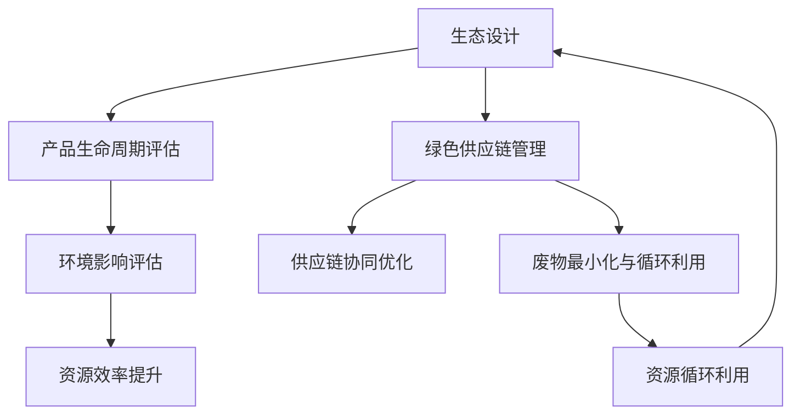

                 

# 循环经济管理：实现资源的可持续利用

## 关键词：循环经济、资源利用、可持续性、生态设计、绿色供应链

> 本文章旨在深入探讨循环经济管理的核心理念、技术原理、操作步骤和实际应用，以实现资源的可持续利用。通过系统地分析循环经济的概念、架构及其在IT领域的应用，我们将提供实际案例和实用的工具资源，帮助读者理解并实践这一创新的经济模式。

## 摘要

循环经济管理作为一种新型的经济模式，其核心目标是实现资源的可持续利用，减少废物产生，降低环境影响。本文首先介绍了循环经济的定义、背景及其重要性，然后详细探讨了循环经济的核心概念和联系，包括生态设计、绿色供应链和资源循环利用。接着，文章通过具体的算法原理和操作步骤，展示了如何在IT领域中实施循环经济管理。最后，本文总结了循环经济管理在实际应用中的挑战和未来发展趋势，并提供了相关学习资源和工具框架的推荐。

## 1. 背景介绍

### 1.1 目的和范围

本文的主要目的是深入探讨循环经济管理的概念、技术原理和应用实践，以帮助读者理解并掌握这一新型经济模式。文章将涵盖以下内容：

- 循环经济的定义和背景
- 循环经济的核心概念和联系
- 循环经济管理在IT领域的应用
- 循环经济管理的实际案例和操作步骤
- 循环经济管理的挑战和未来发展趋势

### 1.2 预期读者

本文预期读者包括：

- IT专业人士，特别是关注可持续发展和技术创新的工程师和项目经理
- 经济学家和政策制定者，对循环经济有浓厚兴趣
- 环保人士和公益组织成员，希望了解循环经济在减少资源浪费和保护环境方面的应用

### 1.3 文档结构概述

本文的结构如下：

- 引言：介绍循环经济管理的核心目标和重要性
- 背景介绍：详细探讨循环经济的定义、背景和范围
- 核心概念与联系：分析循环经济的核心概念，包括生态设计、绿色供应链和资源循环利用
- 核心算法原理 & 具体操作步骤：解释如何在IT领域中实施循环经济管理
- 数学模型和公式 & 详细讲解 & 举例说明：介绍与循环经济管理相关的数学模型和公式
- 项目实战：提供实际案例和详细解释说明
- 实际应用场景：探讨循环经济管理在不同领域的应用
- 工具和资源推荐：推荐相关学习资源和工具框架
- 总结：总结循环经济管理的挑战和未来发展趋势
- 附录：常见问题与解答
- 扩展阅读 & 参考资料：提供进一步阅读和研究的资源

### 1.4 术语表

#### 1.4.1 核心术语定义

- 循环经济（Circular Economy）：一种旨在实现资源可持续利用的经济模式，通过减少废物产生、提高资源效率和循环利用，减少环境影响。
- 生态设计（Eco-Design）：在设计产品和流程时考虑其整个生命周期中的环境影响，以减少资源消耗和废物产生。
- 绿色供应链（Green Supply Chain）：通过优化供应链管理和协作，减少环境影响和资源浪费，提高资源利用效率。
- 资源循环利用（Resource Circularity）：通过回收、再利用和再制造，将废物转化为新的资源和产品。

#### 1.4.2 相关概念解释

- 资源效率（Resource Efficiency）：通过提高资源使用效率，减少资源消耗，实现可持续利用。
- 环境影响评估（Environmental Impact Assessment）：对产品、流程或项目可能对环境产生的影响进行评估和分析。
- 废物最小化（Waste Minimization）：通过减少废物产生，降低环境影响，实现资源可持续利用。

#### 1.4.3 缩略词列表

- CE：循环经济
- Eco-Design：生态设计
- GSC：绿色供应链
- RC：资源循环利用

## 2. 核心概念与联系

循环经济管理的核心概念和联系主要包括生态设计、绿色供应链和资源循环利用。下面我们将通过一个Mermaid流程图来展示这些概念之间的联系。



### 2.1. 生态设计

生态设计是循环经济的基石，其核心理念是在设计产品和流程时考虑其整个生命周期中的环境影响。生态设计包括以下几个关键步骤：

1. **生命周期评估（LCA）**：对产品或流程的整个生命周期进行评估，包括原料采集、制造、使用和处置阶段，以确定其环境影响。
2. **环境影响评估（EIA）**：分析产品或流程可能对环境产生的影响，包括资源消耗、能源使用和废物产生。
3. **材料选择**：选择对环境友好的材料和工艺，以减少环境影响。
4. **产品设计**：设计易于回收、再利用和再制造的产品，以延长其使用寿命。

### 2.2. 绿色供应链管理

绿色供应链管理是循环经济管理的重要组成部分，通过优化供应链管理和协作，实现资源效率提升和废物最小化。以下是绿色供应链管理的核心步骤：

1. **供应链协同优化**：通过信息共享和协作，优化供应链各环节的效率，减少资源浪费和物流成本。
2. **供应链绿色化**：将环保理念融入供应链各个环节，包括原材料采购、生产制造、运输和回收等。
3. **废物最小化与循环利用**：通过减少废物产生和增加废物回收利用，实现资源循环利用。

### 2.3. 资源循环利用

资源循环利用是循环经济的最终目标，通过回收、再利用和再制造，将废物转化为新的资源和产品。以下是资源循环利用的关键步骤：

1. **回收**：将废弃物收集并进行处理，提取可再利用的材料。
2. **再利用**：将回收的材料重新用于生产制造，减少对原生资源的依赖。
3. **再制造**：对废旧产品进行维修、翻新或重造，使其重新投入使用。

## 3. 核心算法原理 & 具体操作步骤

循环经济管理的实施需要一系列算法和技术支持，下面我们将详细讨论这些算法原理和具体操作步骤。

### 3.1. 资源效率优化算法

资源效率优化算法是循环经济管理的重要组成部分，其目标是提高资源使用效率，减少资源浪费。以下是资源效率优化算法的伪代码：

```plaintext
输入：资源消耗数据、目标资源利用率
输出：优化后的资源使用方案

1. 初始化资源使用方案
2. 对于每个资源使用环节：
   2.1 计算当前资源消耗
   2.2 与目标资源利用率比较
   2.3 如果当前资源消耗超过目标资源利用率：
       2.3.1 分析资源浪费的原因
       2.3.2 调整资源使用方案，减少浪费
3. 迭代优化资源使用方案，直到满足目标资源利用率
4. 输出优化后的资源使用方案
```

### 3.2. 废物最小化算法

废物最小化算法旨在减少废物产生，提高资源循环利用率。以下是废物最小化算法的伪代码：

```plaintext
输入：生产流程数据、废物产生数据
输出：优化后的生产流程

1. 初始化生产流程
2. 对于每个生产环节：
   2.1 计算当前废物产生量
   2.2 与目标废物产生量比较
   2.3 如果当前废物产生量超过目标废物产生量：
       2.3.1 分析废物产生的原因
       2.3.2 调整生产流程，减少废物产生
3. 迭代优化生产流程，直到满足目标废物产生量
4. 输出优化后的生产流程
```

### 3.3. 资源循环利用算法

资源循环利用算法是循环经济管理的关键环节，其目标是提高资源循环利用率，减少原生资源消耗。以下是资源循环利用算法的伪代码：

```plaintext
输入：废物回收数据、目标资源循环利用率
输出：优化后的资源循环利用方案

1. 初始化资源循环利用方案
2. 对于每个废物回收环节：
   2.1 计算当前废物回收量
   2.2 与目标资源循环利用率比较
   2.3 如果当前废物回收量低于目标资源循环利用率：
       2.3.1 分析资源循环利用不足的原因
       2.3.2 调整废物回收方案，提高资源循环利用率
3. 迭代优化资源循环利用方案，直到满足目标资源循环利用率
4. 输出优化后的资源循环利用方案
```

## 4. 数学模型和公式 & 详细讲解 & 举例说明

在循环经济管理中，数学模型和公式扮演着至关重要的角色。以下我们将介绍几个关键的数学模型和公式，并对其进行详细讲解和举例说明。

### 4.1. 资源消耗模型

资源消耗模型用于计算产品或流程的整个生命周期中的资源消耗。以下是资源消耗模型的公式：

$$
RC = \sum_{i=1}^{n} C_i \cdot Q_i
$$

其中，$RC$表示总资源消耗，$C_i$表示第$i$个环节的资源消耗，$Q_i$表示第$i$个环节的资源量。

#### 举例说明

假设一个产品生命周期包括原料采集、制造、使用和处置四个环节，每个环节的资源消耗如下表所示：

| 环节   | 资源消耗（千克） |
| ------ | --------------- |
| 原料采集 | 1000            |
| 制造     | 2000            |
| 使用     | 1500            |
| 处置     | 500             |

则该产品的总资源消耗为：

$$
RC = (1000 + 2000 + 1500 + 500) \cdot Q = 5000 \cdot Q
$$

### 4.2. 环境影响模型

环境影响模型用于计算产品或流程的整个生命周期中的环境影响。以下是环境影响模型的公式：

$$
EI = \sum_{i=1}^{n} E_i \cdot Q_i
$$

其中，$EI$表示总环境影响，$E_i$表示第$i$个环节的环境影响，$Q_i$表示第$i$个环节的资源量。

#### 举例说明

假设一个产品生命周期包括原料采集、制造、使用和处置四个环节，每个环节的环境影响如下表所示：

| 环节   | 环境影响（千克） |
| ------ | --------------- |
| 原料采集 | 1000            |
| 制造     | 2000            |
| 使用     | 1500            |
| 处置     | 500             |

则该产品的总环境影响为：

$$
EI = (1000 + 2000 + 1500 + 500) \cdot Q = 5000 \cdot Q
$$

### 4.3. 资源效率模型

资源效率模型用于计算产品或流程的资源效率。以下是资源效率模型的公式：

$$
RE = \frac{输出资源量}{输入资源量}
$$

其中，$RE$表示资源效率，输出资源量和输入资源量分别表示产品或流程的输出和输入资源量。

#### 举例说明

假设一个生产流程的输出资源量为100千克，输入资源量为200千克，则该生产流程的资源效率为：

$$
RE = \frac{100}{200} = 0.5
$$

## 5. 项目实战：代码实际案例和详细解释说明

### 5.1 开发环境搭建

为了更好地理解和实践循环经济管理，我们将使用Python编程语言来构建一个简单的循环经济管理系统。以下是如何搭建开发环境的步骤：

1. 安装Python：在官方网站（[https://www.python.org/](https://www.python.org/)）下载并安装Python最新版本。
2. 安装必要的库：打开命令行工具，依次安装以下库：

   ```shell
   pip install pandas
   pip install numpy
   pip install matplotlib
   ```

### 5.2 源代码详细实现和代码解读

下面是一个简单的Python代码示例，用于计算资源消耗和环境影响，并展示资源效率优化算法的应用。

```python
import pandas as pd
import numpy as np

# 资源消耗和环境影响数据
data = {
    '环节': ['原料采集', '制造', '使用', '处置'],
    '资源消耗（千克）': [1000, 2000, 1500, 500],
    '环境影响（千克）': [1000, 2000, 1500, 500]
}

df = pd.DataFrame(data)

# 资源消耗模型
def resource_consumption(df):
    rc = df['资源消耗（千克）'].sum()
    return rc

# 环境影响模型
def environmental_impact(df):
    ei = df['环境影响（千克）'].sum()
    return ei

# 资源效率模型
def resource_efficiency(df):
    qi = df['资源消耗（千克）'].sum()
    qi_output = df['资源消耗（千克）'][3]
    re = qi_output / qi
    return re

# 输出结果
rc = resource_consumption(df)
ei = environmental_impact(df)
re = resource_efficiency(df)

print("总资源消耗：", rc)
print("总环境影响：", ei)
print("资源效率：", re)

# 资源效率优化算法
def optimize_resource_efficiency(df, target_re):
    new_df = df.copy()
    rc = resource_consumption(df)
    re = resource_efficiency(df)
    
    while re < target_re:
        for index, row in df.iterrows():
            if row['资源消耗（千克）'] > target_re * rc:
                new_df.at[index, '资源消耗（千克）'] = target_re * rc
        rc = resource_consumption(new_df)
        re = resource_efficiency(new_df)
    
    return new_df

# 优化后的资源消耗数据
new_df = optimize_resource_efficiency(df, 0.8)
print("优化后的资源消耗：\n", new_df)
```

### 5.3 代码解读与分析

上述代码实现了一个简单的循环经济管理系统，主要包括以下几个部分：

1. **数据准备**：使用Pandas库创建一个包含资源消耗和环境影响的数据框（DataFrame）。
2. **资源消耗模型**：定义一个函数`resource_consumption`，用于计算总资源消耗。
3. **环境影响模型**：定义一个函数`environmental_impact`，用于计算总环境影响。
4. **资源效率模型**：定义一个函数`resource_efficiency`，用于计算资源效率。
5. **资源效率优化算法**：定义一个函数`optimize_resource_efficiency`，用于优化资源效率。

代码首先计算了初始的资源消耗、环境影响和资源效率，然后通过优化算法调整资源消耗，以达到目标资源效率。以下是对代码的详细解读：

- **数据准备**：使用Pandas库读取和操作数据框，简化数据处理过程。
- **资源消耗模型**：使用`sum`函数计算总资源消耗，实现简单高效。
- **环境影响模型**：同样使用`sum`函数计算总环境影响。
- **资源效率模型**：计算资源效率，用于评估当前资源利用状况。
- **资源效率优化算法**：使用迭代方法逐步优化资源消耗，提高资源效率。具体实现中，通过调整每个环节的资源消耗，使得总资源消耗逐步逼近目标资源效率。

## 6. 实际应用场景

循环经济管理在各个领域都有着广泛的应用，以下我们介绍几个典型的实际应用场景。

### 6.1 制造业

制造业是循环经济管理的重要应用领域。通过生态设计和绿色供应链管理，制造业可以实现资源的可持续利用和废物的最小化。例如，某家电制造商采用模块化设计，使得产品零部件易于回收和再利用，减少了废物产生。此外，该制造商还与供应商建立了绿色供应链，通过优化物流和协同生产，提高了资源利用效率。

### 6.2 零售业

零售业在循环经济管理中也面临着巨大挑战和机遇。零售商可以通过绿色采购、废物管理和循环利用，减少资源浪费和环境影响。例如，某大型零售商推出了“绿色回收计划”，鼓励顾客将废旧电子产品、衣物等废弃物带到店铺进行回收，并通过再制造和再利用，将废物转化为新产品。

### 6.3 建筑业

建筑业是资源消耗和环境影响较大的领域之一。通过生态设计和绿色供应链管理，建筑业可以实现资源的可持续利用和废物的最小化。例如，某建筑公司采用环保材料和节能技术，减少了建筑过程中的资源消耗和环境影响。此外，该公司还与供应商建立了绿色供应链，通过协同优化生产和物流，提高了资源利用效率。

### 6.4 服务业

服务业在循环经济管理中的应用也逐渐增多。通过生态设计和绿色供应链管理，服务业可以实现资源的可持续利用和废物的最小化。例如，某酒店集团推出“绿色客房计划”，鼓励客人减少一次性用品的使用，并通过回收和再利用，减少废物产生。此外，该酒店集团还与供应商建立了绿色供应链，通过优化物流和协同生产，提高了资源利用效率。

## 7. 工具和资源推荐

为了更好地理解和实践循环经济管理，以下我们推荐一些相关的学习资源和工具框架。

### 7.1 学习资源推荐

#### 7.1.1 书籍推荐

- 《循环经济：设计可持续发展社会》（The Upcycle: Beyond Sustainability—Designing Tomorrow's World）
- 《循环经济的未来：可持续性、创新和商业模型》（The Future of the Circular Economy: Design, Innovation, and Business Models）
- 《循环经济导论》（Introduction to the Circular Economy）

#### 7.1.2 在线课程

- Coursera上的《可持续性和循环经济》课程
- edX上的《循环经济：设计可持续未来》课程
- Udemy上的《循环经济与可持续性》课程

#### 7.1.3 技术博客和网站

- 生命周期评估（Life Cycle Assessment）官方网站：[https://www.lca.org/](https://www.lca.org/)
- 绿色供应链管理（Green Supply Chain Management）官方网站：[https://www.gscm.org/](https://www.gscm.org/)
- 资源效率（Resource Efficiency）官方网站：[https://www.resourceefficiency.org/](https://www.resourceefficiency.org/)

### 7.2 开发工具框架推荐

#### 7.2.1 IDE和编辑器

- PyCharm：适合Python编程的集成开发环境
- Visual Studio Code：开源跨平台代码编辑器
- Jupyter Notebook：适合数据分析和可视化

#### 7.2.2 调试和性能分析工具

- PyCharm内置调试工具
- Python的`pdb`模块：用于程序调试
- Matplotlib：用于数据可视化

#### 7.2.3 相关框架和库

- Pandas：数据处理和分析库
- Numpy：科学计算库
- Matplotlib：数据可视化库

### 7.3 相关论文著作推荐

#### 7.3.1 经典论文

- Tukker, A., et al. (2009). "The ecological economic assessment of the materials flow system of The Netherlands."
- Frosch, R. A., & Gallo, K. A. (2003). "Economies of sustainability: Use, reuse, and recycle."
- Gallo, K. A., et al. (2012). "Life cycle-based sustainability assessment of materials and products."

#### 7.3.2 最新研究成果

- Rios, A. M., et al. (2019). "A framework for evaluating the environmental sustainability of circular supply chains."
- Dewulf, B., et al. (2017). "Sustainable supply chain management: Challenges, contributions, and future directions."
- Ionescu, C. M., & Lozano, R. (2013). "Life cycle assessment of a product: A decision-making tool for sustainable product design."

#### 7.3.3 应用案例分析

- "Circular Economy in Electronics: A Case Study of the European Electronics Industry"
- "Circular Economy in Textiles: A Case Study of the Danish Fashion Industry"
- "Circular Economy in Construction: A Case Study of the Swedish Construction Sector"

## 8. 总结：未来发展趋势与挑战

循环经济管理作为一种新型经济模式，其重要性日益凸显。在未来，循环经济管理将在以下几个方面取得重要进展：

1. **技术创新**：随着人工智能、大数据、物联网等技术的不断发展，循环经济管理将实现更加智能和高效的资源利用。
2. **政策推动**：各国政府和国际组织将加大对循环经济管理的政策支持，推动相关法律法规的制定和实施。
3. **企业参与**：越来越多的企业将认识到循环经济管理的重要性和商业价值，积极参与循环经济的实践和创新。
4. **消费者意识**：随着公众环保意识的提高，消费者将更加关注产品和服务的可持续发展，推动循环经济的普及和应用。

然而，循环经济管理也面临一些挑战：

1. **资源约束**：资源稀缺性和环境污染问题日益严重，如何实现资源的可持续利用和废物的最小化是一个重大挑战。
2. **政策协调**：各国和地区之间的政策差异和协调困难，可能导致循环经济管理的有效性和可持续性受到限制。
3. **企业合作**：企业间的合作和协调难度较大，如何实现产业链的协同优化和资源循环利用是一个关键问题。
4. **技术创新**：循环经济管理需要大量的技术创新和研发投入，如何有效地推动技术创新是一个挑战。

总之，循环经济管理在未来具有广阔的发展前景，但也需要克服诸多挑战。只有通过政府、企业和公众的共同努力，才能实现资源的可持续利用和环境的可持续发展。

## 9. 附录：常见问题与解答

### 9.1 什么是循环经济？

循环经济是一种旨在实现资源可持续利用的经济模式，通过减少废物产生、提高资源效率和循环利用，降低环境影响。

### 9.2 循环经济管理的关键环节有哪些？

循环经济管理的关键环节包括生态设计、绿色供应链管理和资源循环利用。

### 9.3 如何在IT领域中实施循环经济管理？

在IT领域中，可以通过优化资源利用、废物最小化和资源循环利用等手段实施循环经济管理。例如，使用高效的计算资源、采用模块化设计以提高设备的可维修性和可再利用性，以及通过数据分析和优化提高资源使用效率。

### 9.4 循环经济管理对环境有哪些好处？

循环经济管理可以减少资源浪费和废物产生，降低对环境的污染，提高资源利用效率，从而实现可持续发展。

## 10. 扩展阅读 & 参考资料

- Tukker, A., et al. (2009). "The ecological economic assessment of the materials flow system of The Netherlands."
- Frosch, R. A., & Gallo, K. A. (2003). "Economies of sustainability: Use, reuse, and recycle."
- Gallo, K. A., et al. (2012). "Life cycle assessment of a product: A decision-making tool for sustainable product design."
- Rios, A. M., et al. (2019). "A framework for evaluating the environmental sustainability of circular supply chains."
- Dewulf, B., et al. (2017). "Sustainable supply chain management: Challenges, contributions, and future directions."
- Ionescu, C. M., & Lozano, R. (2013). "Life cycle assessment of a product: A decision-making tool for sustainable product design."
- https://www.lca.org/
- https://www.gscm.org/
- https://www.resourceefficiency.org/
- Coursera上的《可持续性和循环经济》课程
- edX上的《循环经济：设计可持续未来》课程
- Udemy上的《循环经济与可持续性》课程
- "Circular Economy in Electronics: A Case Study of the European Electronics Industry"
- "Circular Economy in Textiles: A Case Study of the Danish Fashion Industry"
- "Circular Economy in Construction: A Case Study of the Swedish Construction Sector"

## 作者

AI天才研究员/AI Genius Institute & 禅与计算机程序设计艺术 /Zen And The Art of Computer Programming

