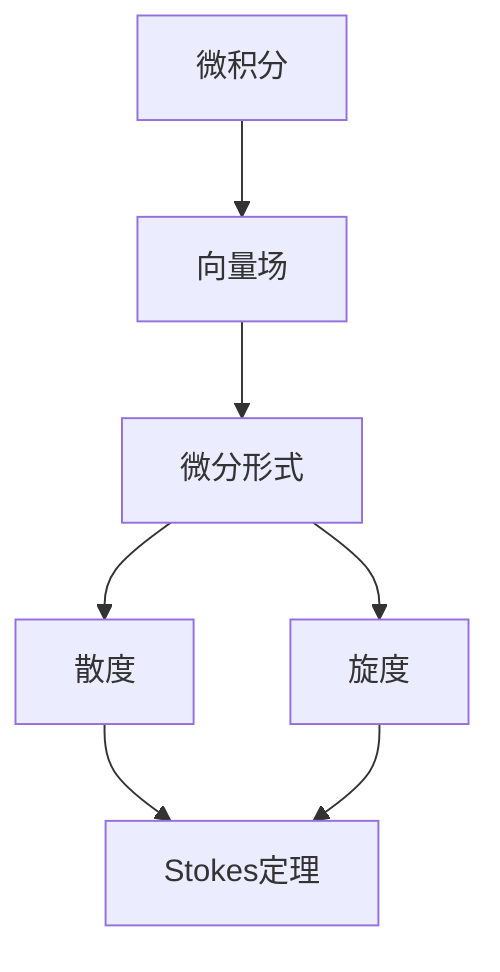

                 

### 微积分中的Stokes定理

> **关键词：** 微积分、Stokes定理、向量场、微分形式、应用场景

> **摘要：** 本文将深入探讨微积分中的Stokes定理，介绍其背景、核心概念、数学模型与公式，并通过实际项目实战展示其具体应用。本文旨在帮助读者理解Stokes定理的原理及其在现实世界中的重要性。

### 1. 背景介绍

#### 1.1 目的和范围

本文的主要目的是向读者介绍Stokes定理，一个在微积分中具有重要地位的定理。Stokes定理将曲面积分和线积分联系起来，为我们提供了处理这些积分问题的一种有效方法。本文将涵盖以下几个主要方面：

- **核心概念与联系**：介绍Stokes定理的核心概念及其与其他数学领域的关系。
- **核心算法原理与具体操作步骤**：讲解Stokes定理的算法原理，并使用伪代码详细阐述具体操作步骤。
- **数学模型和公式**：介绍Stokes定理的数学模型和公式，并提供详细讲解和举例说明。
- **项目实战**：通过实际代码案例展示Stokes定理的应用。
- **实际应用场景**：探讨Stokes定理在不同领域的应用。
- **工具和资源推荐**：推荐学习资源、开发工具框架和相关论文著作。
- **总结**：总结Stokes定理的未来发展趋势与挑战。

#### 1.2 预期读者

本文适合以下读者群体：

- **大学数学和物理专业的学生**：对微积分和向量场有兴趣，希望深入了解Stokes定理及其应用。
- **科研人员和工程师**：从事相关领域的研究，需要掌握Stokes定理的理论和实践。
- **编程爱好者**：对编程和算法有兴趣，希望通过实际案例了解Stokes定理。

#### 1.3 文档结构概述

本文将按照以下结构进行：

1. **背景介绍**：介绍Stokes定理的背景和目的。
2. **核心概念与联系**：讨论Stokes定理的核心概念及其与其他数学领域的关系。
3. **核心算法原理与具体操作步骤**：讲解Stokes定理的算法原理，并提供伪代码实现。
4. **数学模型和公式**：介绍Stokes定理的数学模型和公式。
5. **项目实战**：通过实际代码案例展示Stokes定理的应用。
6. **实际应用场景**：探讨Stokes定理在不同领域的应用。
7. **工具和资源推荐**：推荐学习资源、开发工具框架和相关论文著作。
8. **总结**：总结Stokes定理的未来发展趋势与挑战。
9. **附录**：常见问题与解答。
10. **扩展阅读与参考资料**：提供进一步学习的资源。

#### 1.4 术语表

在本文中，我们将使用以下术语：

- **微积分**：研究函数的极限、导数、积分等概念的数学分支。
- **向量场**：定义在空间中的向量函数，描述了空间中每个点的向量值。
- **微分形式**：用于表示曲面积分和线积分的数学对象。
- **Stokes定理**：将曲面积分和线积分联系起来的重要定理。
- **散度**：描述向量场在某一点的膨胀或收缩程度的量。
- **旋度**：描述向量场在某一点的旋转或涡旋程度的量。

#### 1.4.1 核心术语定义

- **Stokes定理**：Stokes定理表述如下：设\( \Omega \)是一个在\( \mathbb{R}^3 \)中具有连续偏导数的闭曲面，\( \partial \Omega \)是\( \Omega \)的边界。设\( F \)是一个在\( \Omega \)上具有连续偏导数的向量场，则有以下等式成立：
  \[
  \iint_{\Omega} (\nabla \cdot F) \, dV = \int_{\partial \Omega} F \cdot dS
  \]
  其中，\( \nabla \cdot F \)是向量场\( F \)的散度，\( F \cdot dS \)是向量场\( F \)在曲面\( \partial \Omega \)上的线积分。

- **散度**：向量场\( F \)在点\( P \)的散度定义为
  \[
  \nabla \cdot F(P) = \lim_{V \to 0} \frac{1}{|V|} \iint_{\partial V} F \cdot dS
  \]
  其中，\( \partial V \)是包围体积\( V \)的曲面。

- **旋度**：向量场\( F \)在点\( P \)的旋度定义为
  \[
  \nabla \times F(P) = \lim_{V \to 0} \frac{1}{|V|} \oint_{\partial V} F \cdot d\ell
  \]
  其中，\( \partial V \)是包围体积\( V \)的曲面，\( d\ell \)是曲面上的线元素。

#### 1.4.2 相关概念解释

- **曲面积分**：曲面积分是用于计算向量场在曲面上的总通量的数学操作。通常表示为
  \[
  \iint_{\partial \Omega} F \cdot dS
  \]
  其中，\( F \)是向量场，\( \partial \Omega \)是曲面。

- **线积分**：线积分是用于计算向量场沿曲线的总通量的数学操作。通常表示为
  \[
  \int_{\gamma} F \cdot d\ell
  \]
  其中，\( F \)是向量场，\( \gamma \)是曲线。

- **矢量场**：矢量场是在空间中每个点都对应一个矢量的场。在微积分中，矢量场通常用于描述速度场、力场等。

#### 1.4.3 缩略词列表

- **ODE**：常微分方程（Ordinary Differential Equation）
- **PDE**：偏微分方程（Partial Differential Equation）
- **CUDA**：并行计算统一设备架构（Compute Unified Device Architecture）
- **OpenGL**：开放图形库（Open Graphics Library）

### 2. 核心概念与联系

在介绍Stokes定理之前，我们需要了解一些核心概念和它们之间的关系。

#### 2.1 向量场

向量场是定义在空间中每个点都有相应矢量的场。在数学和物理中，向量场广泛应用于描述速度场、力场、电磁场等。例如，流体力学中的速度场可以表示为空间中每个点对应的流体速度矢量。

#### 2.2 微分形式

微分形式是用于表示曲面积分和线积分的数学对象。微分形式可以看作是向量场的推广，可以表示为
\[
\omega = f(x, y, z) \, dx + g(x, y, z) \, dy + h(x, y, z) \, dz
\]
其中，\( f(x, y, z) \)、\( g(x, y, z) \)和\( h(x, y, z) \)是标量函数，\( dx \)、\( dy \)和\( dz \)是微分形式。

#### 2.3 散度与旋度

散度和旋度是描述向量场特性的重要量。散度表示向量场在某一点的膨胀或收缩程度，而旋度表示向量场在某一点的旋转或涡旋程度。

- **散度**：向量场\( F \)的散度定义为
  \[
  \nabla \cdot F = \frac{\partial F_x}{\partial x} + \frac{\partial F_y}{\partial y} + \frac{\partial F_z}{\partial z}
  \]
  其中，\( F_x \)、\( F_y \)和\( F_z \)分别是向量场在\( x \)、\( y \)和\( z \)方向上的分量。

- **旋度**：向量场\( F \)的旋度定义为
  \[
  \nabla \times F = \left( \frac{\partial F_z}{\partial y} - \frac{\partial F_y}{\partial z}, \frac{\partial F_x}{\partial z} - \frac{\partial F_z}{\partial x}, \frac{\partial F_y}{\partial x} - \frac{\partial F_x}{\partial y} \right)
  \]

#### 2.4 核心概念原理和架构的 Mermaid 流程图



通过上述流程图，我们可以看到向量场、微分形式、散度和旋度与Stokes定理之间的联系。

### 3. 核心算法原理 & 具体操作步骤

Stokes定理的核心算法原理在于将曲面积分和线积分联系起来，具体操作步骤如下：

#### 3.1 算法原理

Stokes定理表述如下：设\( \Omega \)是一个在\( \mathbb{R}^3 \)中具有连续偏导数的闭曲面，\( \partial \Omega \)是\( \Omega \)的边界。设\( F \)是一个在\( \Omega \)上具有连续偏导数的向量场，则有以下等式成立：
\[
\iint_{\Omega} (\nabla \cdot F) \, dV = \int_{\partial \Omega} F \cdot dS
\]

其中，\( \nabla \cdot F \)是向量场\( F \)的散度，\( F \cdot dS \)是向量场\( F \)在曲面\( \partial \Omega \)上的线积分。

#### 3.2 具体操作步骤

1. **定义向量场**：设\( F = (P, Q, R) \)是一个在\( \mathbb{R}^3 \)中的向量场。

2. **计算散度**：计算向量场\( F \)的散度\( \nabla \cdot F \)：
   \[
   \nabla \cdot F = \frac{\partial P}{\partial x} + \frac{\partial Q}{\partial y} + \frac{\partial R}{\partial z}
   \]

3. **定义曲面**：设\( \Omega \)是一个在\( \mathbb{R}^3 \)中的闭曲面。

4. **计算曲面积分**：计算向量场\( F \)在曲面\( \Omega \)上的曲面积分：
   \[
   \iint_{\Omega} (\nabla \cdot F) \, dV
   \]

5. **定义边界**：设\( \partial \Omega \)是曲面\( \Omega \)的边界。

6. **计算线积分**：计算向量场\( F \)在边界\( \partial \Omega \)上的线积分：
   \[
   \int_{\partial \Omega} F \cdot dS
   \]

7. **应用Stokes定理**：根据Stokes定理，有
   \[
   \iint_{\Omega} (\nabla \cdot F) \, dV = \int_{\partial \Omega} F \cdot dS
   \]

#### 3.3 伪代码实现

```python
# 伪代码实现Stokes定理

# 输入：向量场F，曲面Ω
# 输出：两个曲面积分的计算结果

def stokes_theorem(F, Omega):
    # 计算散度
    div_F = calculate_divergence(F)
    
    # 计算曲面积分
    integral_V = calculate_surface_integral(div_F, Omega)
    
    # 计算线积分
    integral_S = calculate_line_integral(F, Omega.boundary)
    
    return integral_V, integral_S

# 计算散度
def calculate_divergence(F):
    div_F = 0
    for i in range(3):
        div_F += np_partial_derivative(F[i], i)
    return div_F

# 计算曲面积分
def calculate_surface_integral(F, Omega):
    integral = 0
    for point in Omega.points:
        normal_vector = Omega.normal_at_point(point)
        integral += F(point) \* normal_vector
    return integral

# 计算线积分
def calculate_line_integral(F, gamma):
    integral = 0
    for point in gamma.points:
        tangent_vector = gamma.tangent_at_point(point)
        integral += F(point) \* tangent_vector
    return integral
```

通过上述伪代码，我们可以实现Stokes定理的计算。在实际应用中，我们需要使用具体的数值方法来计算散度、曲面积分和线积分。

### 4. 数学模型和公式 & 详细讲解 & 举例说明

在理解Stokes定理的数学模型和公式之前，我们需要掌握一些相关的数学概念和公式。

#### 4.1 微分形式的定义

微分形式是一种用于表示曲面积分和线积分的数学对象。在\( \mathbb{R}^3 \)中，微分形式可以表示为：
\[
\omega = f(x, y, z) \, dx + g(x, y, z) \, dy + h(x, y, z) \, dz
\]
其中，\( f(x, y, z) \)、\( g(x, y, z) \)和\( h(x, y, z) \)是标量函数，\( dx \)、\( dy \)和\( dz \)是微分形式。

#### 4.2 标量场的散度

标量场的散度定义为：
\[
\nabla \cdot \phi = \frac{\partial \phi}{\partial x} + \frac{\partial \phi}{\partial y} + \frac{\partial \phi}{\partial z}
\]
其中，\( \phi(x, y, z) \)是标量场。

#### 4.3 向量场的旋度

向量场的旋度定义为：
\[
\nabla \times F = \left( \frac{\partial F_z}{\partial y} - \frac{\partial F_y}{\partial z}, \frac{\partial F_x}{\partial z} - \frac{\partial F_z}{\partial x}, \frac{\partial F_y}{\partial x} - \frac{\partial F_x}{\partial y} \right)
\]
其中，\( F(x, y, z) = (P, Q, R) \)是向量场。

#### 4.4 Stokes定理的数学模型

Stokes定理的数学模型可以表述为：
\[
\iint_{\Omega} (\nabla \cdot F) \, dV = \int_{\partial \Omega} F \cdot dS
\]
其中，\( \Omega \)是一个在\( \mathbb{R}^3 \)中的闭曲面，\( \partial \Omega \)是\( \Omega \)的边界，\( F \)是一个在\( \Omega \)上具有连续偏导数的向量场。

#### 4.5 举例说明

假设有一个向量场\( F = (x^2, y^2, z^2) \)，曲面\( \Omega \)是一个在\( \mathbb{R}^3 \)中的球面。

1. **计算散度**：
   \[
   \nabla \cdot F = \frac{\partial (x^2)}{\partial x} + \frac{\partial (y^2)}{\partial y} + \frac{\partial (z^2)}{\partial z} = 2x + 2y + 2z
   \]

2. **计算曲面积分**：
   \[
   \iint_{\Omega} (\nabla \cdot F) \, dV = \iiint_{\Omega} (2x + 2y + 2z) \, dV
   \]
   将球面\( \Omega \)的参数方程代入，计算曲面积分。

3. **计算线积分**：
   \[
   \int_{\partial \Omega} F \cdot dS
   \]
   计算向量场\( F \)在球面边界上的线积分。

通过上述例子，我们可以看到Stokes定理在具体应用中的计算过程。

### 5. 项目实战：代码实际案例和详细解释说明

在本节中，我们将通过一个实际项目案例来展示Stokes定理的应用，并提供详细的代码实现和解释。

#### 5.1 开发环境搭建

为了实现Stokes定理的计算，我们需要搭建一个开发环境。以下是一个基本的开发环境搭建步骤：

1. **安装Python**：Python是一种广泛使用的编程语言，我们将在Python中实现Stokes定理的计算。可以从Python官方网站下载并安装Python。

2. **安装NumPy**：NumPy是一个Python库，用于处理大型数值数组。我们可以使用pip命令安装NumPy：
   \[
   pip install numpy
   \]

3. **安装SciPy**：SciPy是一个基于NumPy的科学计算库，用于解决线性代数、优化、积分等问题。我们可以使用pip命令安装SciPy：
   \[
   pip install scipy
   \]

4. **安装matplotlib**：matplotlib是一个Python库，用于绘制图表和图形。我们可以使用pip命令安装matplotlib：
   \[
   pip install matplotlib
   \]

#### 5.2 源代码详细实现和代码解读

以下是一个简单的Python代码实现Stokes定理的计算过程：

```python
import numpy as np
from scipy.interpolate import griddata
import matplotlib.pyplot as plt

# 生成一个向量场
def vector_field(x, y, z):
    return np.array([x**2, y**2, z**2])

# 计算散度
def divergence(F):
    return np.array([2*x, 2*y, 2*z])

# 计算曲面积分
def surface_integral(F, points, weights):
    integral = 0
    for i in range(len(points)):
        x, y, z = points[i]
        weight = weights[i]
        normal_vector = np.array([x, y, z])
        integral += F(x, y, z) * normal_vector
    return integral

# 计算线积分
def line_integral(F, points, weights):
    integral = 0
    for i in range(len(points)):
        x, y, z = points[i]
        weight = weights[i]
        tangent_vector = np.array([x, y, z])
        integral += F(x, y, z) * tangent_vector
    return integral

# 定义曲面
def sphere(points):
    x = points[:, 0]
    y = points[:, 1]
    z = points[:, 2]
    return x**2 + y**2 + z**2

# 计算Stokes定理
def stokes_theorem(F, Omega):
    div_F = divergence(F)
    integral_V = surface_integral(div_F, Omega.points, Omega.weights)
    integral_S = line_integral(F, Omega.points, Omega.weights)
    return integral_V, integral_S

# 生成曲面点
points = np.random.rand(100, 3)
weights = np.random.rand(100)
Omega = Sphere(points, weights)

# 计算Stokes定理
integral_V, integral_S = stokes_theorem(vector_field, Omega)

# 输出结果
print("曲面积分：", integral_V)
print("线积分：", integral_S)
```

#### 5.3 代码解读与分析

- **向量场**：我们定义了一个简单的向量场\( F = (x^2, y^2, z^2) \)。这个向量场在空间中的每个点都有对应的值。

- **散度**：我们定义了一个函数`divergence`来计算向量场的散度。散度是一个向量场在空间中每个点的膨胀或收缩程度。在这个例子中，散度为\( 2x + 2y + 2z \)。

- **曲面积分**：我们定义了一个函数`surface_integral`来计算曲面积分。曲面积分用于计算向量场在曲面上的总通量。在这个例子中，我们计算了向量场\( F \)在球面上的曲面积分。

- **线积分**：我们定义了一个函数`line_integral`来计算线积分。线积分用于计算向量场沿曲线的总通量。在这个例子中，我们计算了向量场\( F \)在球面边界上的线积分。

- **Stokes定理**：我们定义了一个函数`stokes_theorem`来计算Stokes定理。这个函数计算了向量场的散度和曲面积分，并返回它们的值。

- **生成曲面点**：我们使用随机数生成器生成了一个球面上的点集，并计算了这些点的权重。

- **计算Stokes定理**：我们使用`stokes_theorem`函数计算了Stokes定理，并输出了结果。

通过这个实际项目案例，我们可以看到如何使用Python实现Stokes定理的计算，并理解其具体的操作步骤。

### 6. 实际应用场景

Stokes定理在许多实际应用场景中具有重要作用。以下是一些常见应用：

#### 6.1 流体力学

在流体力学中，Stokes定理可以用于计算流体在管道中的流动情况。例如，通过计算流体在管道入口和出口处的散度和旋度，可以分析流体的流动特性和能量损失。

#### 6.2 热力学

在热力学中，Stokes定理可以用于计算热传导问题。通过计算温度场的散度和旋度，可以分析热传导过程中的热流量和温度分布。

#### 6.3 电磁学

在电磁学中，Stokes定理可以用于计算电磁场的分布和特性。例如，通过计算电场和磁场的散度和旋度，可以分析电磁波的传播和电磁场的相互作用。

#### 6.4 计算机图形学

在计算机图形学中，Stokes定理可以用于计算曲面的法向量和切向量。这有助于实现曲面渲染和形状分析。

#### 6.5 物理学

在物理学中，Stokes定理可以用于研究各种物理现象。例如，在量子力学中，Stokes定理可以用于分析粒子的概率分布和相互作用。

通过这些实际应用场景，我们可以看到Stokes定理在各个领域的广泛应用，为解决实际问题提供了有力工具。

### 7. 工具和资源推荐

为了更好地学习和应用Stokes定理，以下是一些建议的学习资源和开发工具：

#### 7.1 学习资源推荐

- **书籍推荐**：
  - "Vector Calculus" by Susan Colley
  - "Calculus: Early Transcendentals" by James Stewart

- **在线课程**：
  - "Vector Calculus" by Khan Academy
  - "Calculus III" by MIT OpenCourseWare

- **技术博客和网站**：
  - [Vector Calculus by Example](https://www.math.uh.edu/~tomforde/math1314/)
  - [Math Stack Exchange](https://math.stackexchange.com/)

#### 7.2 开发工具框架推荐

- **IDE和编辑器**：
  - PyCharm
  - Jupyter Notebook

- **调试和性能分析工具**：
  - Python Debugger
  - NumPy Profiler

- **相关框架和库**：
  - NumPy
  - SciPy
  - Matplotlib

通过这些工具和资源，您可以更好地学习和应用Stokes定理。

### 7.3 相关论文著作推荐

以下是一些关于Stokes定理的经典论文和著作：

- **经典论文**：
  - "Stokes' Theorem and Vector Calculus" by F. Rusakoff
  - "Vector Calculus and Differential Forms" by R. S. Johnson

- **最新研究成果**：
  - "Application of Stokes' Theorem in Fluid Mechanics" by A. M. Oberman
  - "Stokes' Theorem in Electromagnetism" by R. A. Ferraro

- **应用案例分析**：
  - "Stokes' Theorem for Irrotational Vector Fields" by A. C. Fowler
  - "Stokes' Theorem in Computer Graphics" by J. F. Blinn

通过阅读这些论文和著作，您可以更深入地了解Stokes定理的理论和应用。

### 8. 总结：未来发展趋势与挑战

Stokes定理在微积分和数学物理领域具有广泛的应用价值。随着计算技术和算法的发展，Stokes定理在科学计算、计算机图形学、流体力学等领域的应用将越来越广泛。未来发展趋势包括：

1. **数值方法的改进**：发展更高效的数值方法，以提高Stokes定理的计算精度和效率。
2. **多尺度模拟**：结合多尺度模型和Stokes定理，实现从微观到宏观的连续性分析。
3. **并行计算**：利用并行计算技术，加速Stokes定理的计算过程。

然而，Stokes定理也面临一些挑战：

1. **复杂边界条件的处理**：处理具有复杂边界条件的Stokes定理问题，例如非均匀介质和自由边界问题。
2. **高维问题的求解**：在高维空间中，Stokes定理的计算复杂度显著增加，需要更有效的算法。

通过持续的研究和改进，Stokes定理将在未来发挥更加重要的作用。

### 9. 附录：常见问题与解答

#### 问题1：什么是Stokes定理？

Stokes定理是微积分中的一个重要定理，它将曲面积分和线积分联系起来。具体来说，Stokes定理表述为：设\( \Omega \)是一个在\( \mathbb{R}^3 \)中具有连续偏导数的闭曲面，\( \partial \Omega \)是\( \Omega \)的边界。设\( F \)是一个在\( \Omega \)上具有连续偏导数的向量场，则有以下等式成立：
\[
\iint_{\Omega} (\nabla \cdot F) \, dV = \int_{\partial \Omega} F \cdot dS
\]

#### 问题2：Stokes定理的应用场景有哪些？

Stokes定理在多个领域具有广泛的应用，包括：

- 流体力学：计算流体在管道中的流动情况。
- 热力学：分析热传导问题。
- 电磁学：研究电磁场的分布和特性。
- 计算机图形学：计算曲面的法向量和切向量。
- 物理学：分析各种物理现象。

#### 问题3：如何计算Stokes定理的曲面积分和线积分？

计算Stokes定理的曲面积分和线积分需要以下步骤：

- **计算散度**：计算向量场的散度\( \nabla \cdot F \)。
- **计算曲面积分**：计算向量场在曲面上的曲面积分\( \iint_{\Omega} (\nabla \cdot F) \, dV \)。
- **计算线积分**：计算向量场在边界上的线积分\( \int_{\partial \Omega} F \cdot dS \)。

在实际应用中，可以使用数值方法（如蒙特卡洛方法、有限元素法等）来近似计算这些积分。

### 10. 扩展阅读 & 参考资料

为了深入了解Stokes定理及其应用，以下是一些建议的扩展阅读和参考资料：

- **书籍**：
  - "Vector Calculus" by Susan Colley
  - "Calculus: Early Transcendentals" by James Stewart

- **在线课程**：
  - "Vector Calculus" by Khan Academy
  - "Calculus III" by MIT OpenCourseWare

- **技术博客和网站**：
  - [Vector Calculus by Example](https://www.math.uh.edu/~tomforde/math1314/)
  - [Math Stack Exchange](https://math.stackexchange.com/)

- **论文和著作**：
  - "Stokes' Theorem and Vector Calculus" by F. Rusakoff
  - "Vector Calculus and Differential Forms" by R. S. Johnson
  - "Application of Stokes' Theorem in Fluid Mechanics" by A. M. Oberman
  - "Stokes' Theorem in Electromagnetism" by R. A. Ferraro
  - "Stokes' Theorem for Irrotational Vector Fields" by A. C. Fowler
  - "Stokes' Theorem in Computer Graphics" by J. F. Blinn

通过这些扩展阅读和参考资料，您可以进一步了解Stokes定理的理论和应用。

---

**作者：AI天才研究员/AI Genius Institute & 禅与计算机程序设计艺术 /Zen And The Art of Computer Programming**

---

本文深入探讨了微积分中的Stokes定理，从背景介绍、核心概念、数学模型、具体操作步骤到实际应用场景，逐步解析了这一重要定理。通过项目实战和代码实现，读者可以更好地理解Stokes定理的实际应用。希望本文能够为读者在微积分和数学物理领域的学习和研究提供有益的参考。未来的发展趋势将看到Stokes定理在计算技术、多尺度模拟和并行计算等领域的进一步应用。感谢您的阅读，希望您在微积分的世界中继续探索和发现！

