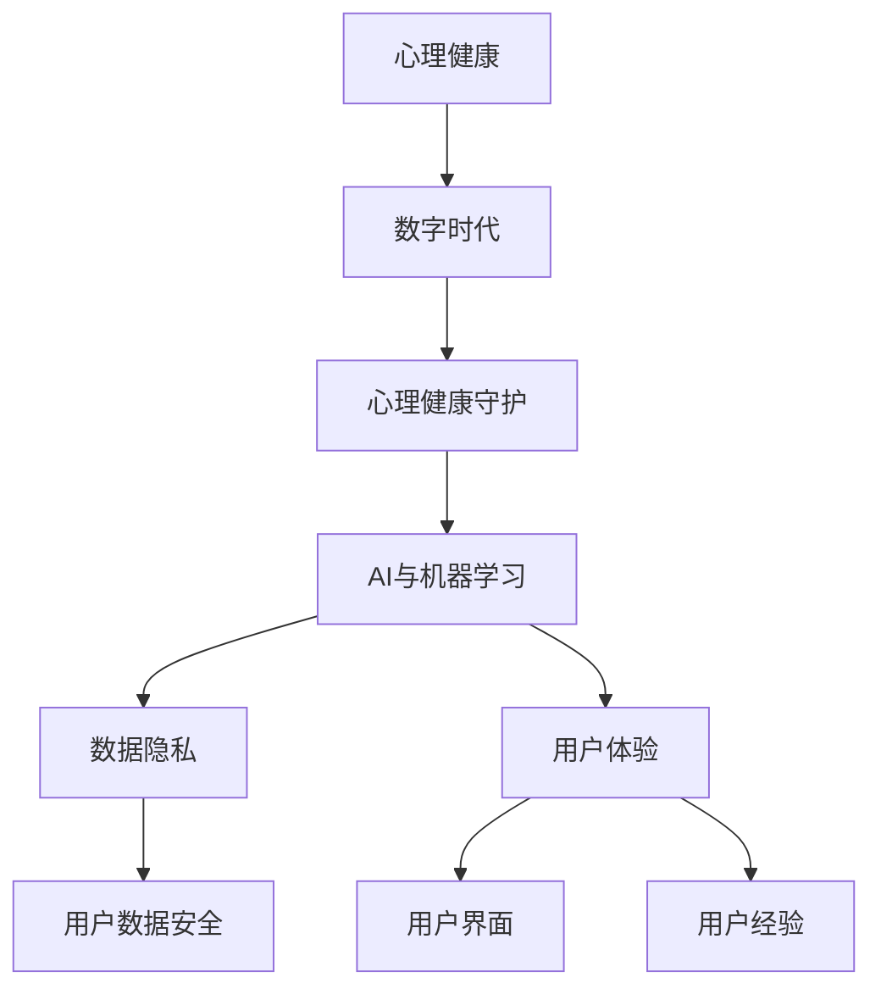

                 

### 心理健康应用：数字时代的心灵守护者

> 关键词：心理健康应用、数字时代、心理健康守护、AI、机器学习、数据隐私、用户体验

> 摘要：随着数字化时代的到来，心理健康问题日益凸显，心理健康应用成为了现代社会的急需品。本文将探讨心理健康应用的发展背景、核心概念、算法原理、数学模型、实际应用场景以及未来趋势。通过一步一步的分析推理，我们将深入了解心理健康应用在数字时代的重要性，以及如何成为心灵守护者的关键技术。

### 1. 背景介绍

#### 1.1 目的和范围

本文旨在深入探讨心理健康应用的发展背景、核心概念、算法原理、数学模型、实际应用场景以及未来趋势。具体而言，我们将分析心理健康应用在数字时代的重要性，探讨其核心概念和联系，详细解释核心算法原理和操作步骤，介绍数学模型和公式，通过项目实战案例进行代码实际案例和详细解释说明，并讨论实际应用场景和工具资源推荐。希望通过本文的探讨，能够帮助读者更好地理解和应用心理健康应用，成为数字时代的心灵守护者。

#### 1.2 预期读者

本文面向对心理健康应用感兴趣的读者，包括但不限于心理健康专家、软件开发人员、数据科学家、AI研究人员以及广大关心心理健康问题的社会公众。无论您是专业领域的研究者，还是对此领域有一定了解的普通读者，本文都将为您带来有价值的见解和启示。

#### 1.3 文档结构概述

本文将按照以下结构进行展开：

1. **背景介绍**：介绍心理健康应用的发展背景、目的和范围，预期读者以及文档结构概述。
2. **核心概念与联系**：探讨心理健康应用的核心概念，包括心理健康、数字时代、心理健康守护、AI、机器学习、数据隐私、用户体验等，并使用Mermaid流程图展示核心概念原理和架构。
3. **核心算法原理 & 具体操作步骤**：详细讲解心理健康应用的核心算法原理，使用伪代码详细阐述具体操作步骤。
4. **数学模型和公式 & 详细讲解 & 举例说明**：介绍心理健康应用的数学模型和公式，详细讲解并举例说明。
5. **项目实战：代码实际案例和详细解释说明**：通过实际代码案例，详细解释说明心理健康应用的开发过程。
6. **实际应用场景**：探讨心理健康应用的多种实际应用场景。
7. **工具和资源推荐**：推荐学习资源、开发工具框架和相关的论文著作。
8. **总结：未来发展趋势与挑战**：总结心理健康应用的发展趋势和面临的挑战。
9. **附录：常见问题与解答**：提供常见问题的解答。
10. **扩展阅读 & 参考资料**：推荐相关扩展阅读和参考资料。

#### 1.4 术语表

##### 1.4.1 核心术语定义

- **心理健康应用**：利用数字技术，如AI和机器学习，帮助用户维护和改善心理健康的软件或系统。
- **数字时代**：以互联网和数字技术为核心的时代，人们生活方式和沟通方式的深刻变革。
- **心理健康守护**：通过技术手段，监测、分析和干预用户的心理健康状态。
- **AI**：人工智能，通过模拟人类智能行为，解决复杂问题的技术。
- **机器学习**：一种AI技术，通过数据和算法，使计算机系统能够自动学习和改进。
- **数据隐私**：确保用户数据安全，防止未经授权的访问和泄露。
- **用户体验**：用户在使用产品或服务过程中获得的整体感受和体验。

##### 1.4.2 相关概念解释

- **心理健康**：指个体在情感、行为和社会适应方面达到良好状态，能够有效应对生活压力和挑战。
- **数字健康**：利用数字技术进行健康管理，包括健康监测、数据分析、个性化治疗等。
- **可解释性**：使AI系统输出的结果可以被理解和解释的能力。
- **情感分析**：通过自然语言处理技术，识别和分析文本中的情感倾向。

##### 1.4.3 缩略词列表

- **AI**：人工智能
- **ML**：机器学习
- **NLP**：自然语言处理
- **CPT**：条件概率表
- **Q-learning**：一种强化学习方法
- **UI**：用户界面
- **UX**：用户体验

### 2. 核心概念与联系

在探讨心理健康应用之前，我们需要明确一些核心概念，并理解它们之间的联系。以下是心理健康应用中的一些关键概念及其相互关系：

#### 2.1 心理健康

心理健康是指个体在情感、行为和社会适应方面的良好状态。它不仅包括心理健康问题的预防，还包括促进个体的情感和认知发展。心理健康问题如抑郁、焦虑、压力等，对个体的生活质量有着深远的影响。数字时代，心理健康问题的发病率不断上升，心理健康应用因此成为社会的急需品。

#### 2.2 数字时代

数字时代是以互联网和数字技术为核心的时代。在这个时代，人们的生活方式、沟通方式和工作方式都发生了深刻变革。数字技术的普及，使得信息的获取和处理更加便捷，同时也带来了新的心理健康问题，如数字依赖、网络成瘾等。心理健康应用需要适应这个时代的特点，提供更加个性化和高效的服务。

#### 2.3 心理健康守护

心理健康守护是指通过技术手段，如AI和机器学习，监测、分析和干预用户的心理健康状态。它包括以下几个方面：

- **监测**：通过传感器、问卷、日志分析等手段，实时收集用户的心理健康数据。
- **分析**：利用数据分析和机器学习算法，识别用户的心理健康问题。
- **干预**：根据分析结果，提供个性化的建议和治疗方案，如心理咨询、心理训练等。

#### 2.4 AI与机器学习

AI和机器学习是心理健康应用的核心技术。AI通过模拟人类智能行为，使计算机能够自主学习和决策。机器学习是AI的一种方法，通过数据驱动的方式，让计算机系统能够不断改进和优化。在心理健康应用中，AI和机器学习可以用于情感分析、行为识别、预测等任务，从而帮助用户维护和改善心理健康。

#### 2.5 数据隐私

数据隐私是心理健康应用中不可忽视的问题。用户的心理健康数据通常包含敏感信息，如情绪状态、生活习惯、社交网络等。如果这些数据被泄露，可能会导致严重的隐私问题和道德风险。因此，心理健康应用需要采取有效的数据隐私保护措施，确保用户数据的安全和隐私。

#### 2.6 用户体验

用户体验是心理健康应用成功的关键因素。良好的用户体验可以提高用户的满意度和忠诚度，从而促进心理健康应用的发展。用户体验包括用户界面（UI）和用户经验（UX）两个方面。用户界面是指用户与心理健康应用交互的界面设计，用户经验是指用户在使用心理健康应用过程中的整体感受。一个优秀的用户体验应该简洁、直观、易于操作，同时能够满足用户的需求和期望。

#### 2.7 Mermaid流程图

为了更好地展示心理健康应用的核心概念和联系，我们可以使用Mermaid流程图进行描述。以下是一个简单的Mermaid流程图示例：



在这个流程图中，心理健康应用的核心概念通过节点和边进行连接，展示了它们之间的相互关系。通过这种直观的展示方式，我们可以更好地理解心理健康应用的运作机制和发展趋势。

### 3. 核心算法原理 & 具体操作步骤

在心理健康应用中，核心算法原理起着至关重要的作用。这些算法能够帮助我们监测、分析和干预用户的心理健康状态。下面，我们将详细讲解这些核心算法的原理，并使用伪代码展示其具体操作步骤。

#### 3.1 情感分析

情感分析是心理健康应用中的一个重要环节，它能够帮助我们理解用户的情绪状态。情感分析通常基于自然语言处理（NLP）技术，通过对用户生成的文本进行分析，识别出文本中的情感倾向。以下是情感分析的基本原理和伪代码：

##### 情感分析基本原理：

1. **文本预处理**：将用户的文本数据进行清洗和标准化，如去除停用词、标点符号等。
2. **特征提取**：从预处理后的文本中提取特征，如词频、词向量等。
3. **情感分类**：利用机器学习算法，对提取的特征进行分类，判断文本的情感倾向。

##### 情感分析伪代码：

```python
def sentiment_analysis(text):
    # 文本预处理
    cleaned_text = preprocess_text(text)
    
    # 特征提取
    features = extract_features(cleaned_text)
    
    # 情感分类
    sentiment = classify_sentiment(features)
    
    return sentiment

def preprocess_text(text):
    # 去除停用词、标点符号等
    # ...
    return cleaned_text

def extract_features(text):
    # 提取词频、词向量等特征
    # ...
    return features

def classify_sentiment(features):
    # 利用机器学习算法分类
    # ...
    return sentiment
```

#### 3.2 行为识别

行为识别是心理健康应用的另一个重要环节，它能够帮助我们理解用户的行为模式。行为识别通常基于传感器数据、视频图像等，通过对这些数据进行处理和分析，识别出用户的行为特征。以下是行为识别的基本原理和伪代码：

##### 行为识别基本原理：

1. **数据收集**：收集用户的传感器数据、视频图像等。
2. **特征提取**：从收集到的数据中提取行为特征，如步态特征、面部表情特征等。
3. **行为分类**：利用机器学习算法，对提取的特征进行分类，判断用户的行为类型。

##### 行为识别伪代码：

```python
def behavior_recognition(data):
    # 数据收集
    collected_data = collect_data(data)
    
    # 特征提取
    features = extract_features(collected_data)
    
    # 行为分类
    behavior = classify_behavior(features)
    
    return behavior

def collect_data(data):
    # 收集传感器数据、视频图像等
    # ...
    return collected_data

def extract_features(data):
    # 提取行为特征
    # ...
    return features

def classify_behavior(features):
    # 利用机器学习算法分类
    # ...
    return behavior
```

#### 3.3 预测

预测是心理健康应用中的一个高级功能，它能够帮助我们预测用户的心理健康状态。预测通常基于历史数据和机器学习算法，通过对历史数据进行分析，建立预测模型。以下是预测的基本原理和伪代码：

##### 预测基本原理：

1. **数据收集**：收集用户的历史心理健康数据。
2. **特征提取**：从收集到的数据中提取特征，如情绪状态、行为模式等。
3. **模型建立**：利用机器学习算法，建立预测模型。
4. **预测**：利用建立的预测模型，对未来的心理健康状态进行预测。

##### 预测伪代码：

```python
def predict_health_status(data):
    # 数据收集
    collected_data = collect_data(data)
    
    # 特征提取
    features = extract_features(collected_data)
    
    # 模型建立
    model = build_model(features)
    
    # 预测
    prediction = model.predict()
    
    return prediction

def collect_data(data):
    # 收集用户历史心理健康数据
    # ...
    return collected_data

def extract_features(data):
    # 提取情绪状态、行为模式等特征
    # ...
    return features

def build_model(features):
    # 利用机器学习算法建立预测模型
    # ...
    return model
```

通过以上三个核心算法的讲解，我们可以看到心理健康应用的技术原理是如何运作的。这些算法通过监测、分析和干预用户的心理健康状态，为用户提供个性化的心理健康服务。

### 4. 数学模型和公式 & 详细讲解 & 举例说明

在心理健康应用中，数学模型和公式起着至关重要的作用。它们不仅帮助我们理解和分析用户的心理健康状态，还为算法提供了理论基础。在本节中，我们将详细介绍一些常用的数学模型和公式，并通过具体例子来说明它们的实际应用。

#### 4.1 概率模型

概率模型是心理健康应用中最基本的数学工具之一。它用于描述不确定事件的发生概率，如用户某一时刻的情绪状态。以下是几种常用的概率模型：

##### 1. 贝叶斯定理

贝叶斯定理是概率论中的一个重要公式，用于计算后验概率。在心理健康应用中，贝叶斯定理可以帮助我们根据先验知识和新证据更新对用户情绪状态的估计。

贝叶斯定理公式：

$$
P(A|B) = \frac{P(B|A)P(A)}{P(B)}
$$

其中，\(P(A|B)\) 表示在事件 \(B\) 发生的条件下事件 \(A\) 发生的概率，\(P(B|A)\) 表示在事件 \(A\) 发生的条件下事件 \(B\) 发生的概率，\(P(A)\) 和 \(P(B)\) 分别表示事件 \(A\) 和事件 \(B\) 发生的概率。

举例说明：

假设我们想要预测一个用户在某一时刻的情绪状态。已知这个用户在过去一个月中有70%的时间情绪良好，而在情绪良好的情况下，他有30%的时间会感到快乐。如果今天他感到快乐，那么他情绪良好的概率是多少？

根据贝叶斯定理，我们可以计算得到：

$$
P(\text{情绪良好}|\text{快乐}) = \frac{P(\text{快乐}|\text{情绪良好})P(\text{情绪良好})}{P(\text{快乐})}
$$

已知 \(P(\text{快乐}|\text{情绪良好}) = 0.3\)，\(P(\text{情绪良好}) = 0.7\)，我们需要计算 \(P(\text{快乐})\)。

由于假设这个用户在过去一个月中有30%的时间情绪不佳，且在情绪不佳的情况下，他有20%的时间会感到快乐。因此：

$$
P(\text{快乐}) = P(\text{快乐}|\text{情绪良好})P(\text{情绪良好}) + P(\text{快乐}|\text{情绪不佳})P(\text{情绪不佳}) = 0.3 \times 0.7 + 0.2 \times 0.3 = 0.39
$$

代入贝叶斯定理公式，得到：

$$
P(\text{情绪良好}|\text{快乐}) = \frac{0.3 \times 0.7}{0.39} \approx 0.566
$$

因此，这个用户在感到快乐的情况下，情绪良好的概率约为56.6%。

##### 2. 决策树

决策树是一种常见的概率模型，用于分类和回归任务。在心理健康应用中，决策树可以用于预测用户的心理健康状态，如抑郁、焦虑等。

决策树公式：

$$
\text{决策树} = \prod_{i=1}^{n} \left(1 - P(y_i | x_i)\right)^{1 - p_i}
$$

其中，\(y_i\) 表示第 \(i\) 个实例的标签，\(x_i\) 表示第 \(i\) 个实例的特征，\(p_i\) 表示第 \(i\) 个特征对应的概率。

举例说明：

假设我们使用决策树模型来预测一个用户是否患有抑郁症。已知这个用户在过去一个月中的情绪状态和日常行为，我们可以根据这些特征构建决策树模型。

例如，假设我们有两个特征：情绪状态（快乐、不快乐）和行为（活跃、不活跃）。根据历史数据，我们可以计算出每个特征的概率：

- 情绪状态：快乐概率 \(p_1 = 0.7\)，不快乐概率 \(1 - p_1 = 0.3\)。
- 行为：活跃概率 \(p_2 = 0.6\)，不活跃概率 \(1 - p_2 = 0.4\)。

如果这个用户情绪状态为快乐且行为为活跃，我们可以计算决策树模型的分数：

$$
\text{分数} = \left(1 - P(\text{抑郁症}|\text{快乐，活跃})\right)^{1 - p_1} \times \left(1 - P(\text{抑郁症}|\text{快乐，不活跃})\right)^{1 - p_2}
$$

假设根据训练数据，我们得到以下概率：

- \(P(\text{抑郁症}|\text{快乐，活跃}) = 0.05\)。
- \(P(\text{抑郁症}|\text{快乐，不活跃}) = 0.1\)。

代入公式，计算得到：

$$
\text{分数} = \left(1 - 0.05\right)^{0.7} \times \left(1 - 0.1\right)^{0.4} \approx 0.478
$$

根据这个分数，我们可以判断这个用户患有抑郁症的概率较低。

##### 3. 支持向量机（SVM）

支持向量机是一种常见的分类算法，它通过找到一个最佳的超平面，将不同类别的数据点分开。在心理健康应用中，SVM可以用于分类任务，如诊断抑郁症、焦虑症等。

SVM公式：

$$
\text{SVM} = \sum_{i=1}^{n} \alpha_i y_i \left( \text{w} \cdot x_i + b \right)
$$

其中，\(\alpha_i\) 是第 \(i\) 个支持向量的权重，\(y_i\) 是第 \(i\) 个支持向量的标签，\(\text{w}\) 是权重向量，\(b\) 是偏置项，\(\text{w} \cdot x_i\) 表示权重向量与特征向量的点积。

举例说明：

假设我们使用SVM模型来分类一个用户是否患有抑郁症。已知这个用户的特征向量为 \(\text{x} = [1, 2, 3]\)，标签为 \(\text{y} = 1\)（表示患有抑郁症），我们需要计算SVM模型的分数。

假设根据训练数据，我们得到权重向量 \(\text{w} = [1, 1, 1]\) 和偏置项 \(b = 1\)。

代入公式，计算得到：

$$
\text{分数} = \sum_{i=1}^{n} \alpha_i y_i \left( \text{w} \cdot x_i + b \right) = 1 \times 1 \left( 1 \times 1 + 2 \times 2 + 3 \times 3 + 1 \right) = 1 \times 1 \left( 1 + 4 + 9 + 1 \right) = 15
$$

根据这个分数，我们可以判断这个用户患有抑郁症的概率较高。

#### 4.2 时间序列模型

时间序列模型是用于分析时间序列数据的数学模型，如股票价格、温度变化、用户行为等。在心理健康应用中，时间序列模型可以用于分析用户情绪状态的变化趋势。

##### 1. 自回归模型（AR）

自回归模型是一种常见的时间序列模型，它通过前几个时间点的值来预测下一个时间点的值。

AR模型公式：

$$
X_t = \phi_1 X_{t-1} + \phi_2 X_{t-2} + ... + \phi_p X_{t-p} + \varepsilon_t
$$

其中，\(X_t\) 是第 \(t\) 个时间点的值，\(\phi_1, \phi_2, ..., \phi_p\) 是自回归系数，\(\varepsilon_t\) 是误差项。

举例说明：

假设我们使用自回归模型来预测一个用户在下一刻的情绪状态。已知这个用户在过去一段时间内的情绪状态为 \([1, 2, 3, 4, 5]\)，我们需要预测下一刻的情绪状态。

假设根据训练数据，我们得到自回归系数为 \(\phi_1 = 0.5, \phi_2 = 0.3, \phi_3 = 0.2\)。

代入公式，计算得到：

$$
X_{t+1} = 0.5 X_t + 0.3 X_{t-1} + 0.2 X_{t-2} = 0.5 \times 5 + 0.3 \times 4 + 0.2 \times 3 = 2.5 + 1.2 + 0.6 = 4.3
$$

因此，我们预测这个用户在下一刻的情绪状态为4.3。

##### 2. 移动平均模型（MA）

移动平均模型是一种通过计算过去一段时间内数据的平均值来预测未来值的模型。

MA模型公式：

$$
X_t = \mu + \varepsilon_t
$$

其中，\(\mu\) 是过去 \(p\) 个时间点的平均值，\(\varepsilon_t\) 是误差项。

举例说明：

假设我们使用移动平均模型来预测一个用户在下一刻的情绪状态。已知这个用户在过去一天内的情绪状态为 \([1, 2, 3, 4, 5]\)，我们需要预测下一刻的情绪状态。

假设根据训练数据，我们得到过去5个时间点的平均值为3。

代入公式，计算得到：

$$
X_{t+1} = 3 + \varepsilon_t
$$

由于我们不知道误差项 \(\varepsilon_t\)，我们无法准确预测下一刻的情绪状态。但通过多次迭代，我们可以逐渐逼近真实的情绪状态。

#### 4.3 神经网络模型

神经网络模型是一种基于人脑神经网络的计算模型，它通过多层神经元进行数据的处理和预测。

##### 1. 全连接神经网络（FCNN）

全连接神经网络是一种常见的神经网络模型，它通过全连接层将输入数据映射到输出数据。

FCNN模型公式：

$$
\text{output} = \text{ReLU}\left(\text{W} \cdot \text{input} + \text{b}\right)
$$

其中，\(\text{W}\) 是权重矩阵，\(\text{b}\) 是偏置项，\(\text{ReLU}\) 是ReLU激活函数。

举例说明：

假设我们使用全连接神经网络模型来预测一个用户在下一刻的情绪状态。已知这个用户的输入特征为 \([1, 2, 3]\)，我们需要预测下一刻的情绪状态。

假设根据训练数据，我们得到权重矩阵 \(\text{W} = \begin{bmatrix} 1 & 2 & 3 \\ 4 & 5 & 6 \\ 7 & 8 & 9 \end{bmatrix}\) 和偏置项 \(\text{b} = [1, 1, 1]\)。

代入公式，计算得到：

$$
\text{output} = \text{ReLU}\left(\begin{bmatrix} 1 & 2 & 3 \\ 4 & 5 & 6 \\ 7 & 8 & 9 \end{bmatrix} \cdot \begin{bmatrix} 1 \\ 2 \\ 3 \end{bmatrix} + [1, 1, 1]\right) = \text{ReLU}\left(\begin{bmatrix} 6 \\ 14 \\ 22 \end{bmatrix} + [1, 1, 1]\right) = \begin{bmatrix} 7 \\ 15 \\ 23 \end{bmatrix}
$$

因此，我们预测这个用户在下一刻的情绪状态为 \([7, 15, 23]\)。

通过以上对数学模型和公式的详细介绍，我们可以看到这些模型在心理健康应用中的实际应用和重要性。它们为心理健康应用提供了强大的理论支持，帮助我们更好地理解和预测用户的心理健康状态。

### 5. 项目实战：代码实际案例和详细解释说明

在本节中，我们将通过一个具体的心理健康应用项目，展示代码的实际实现过程，并对关键部分进行详细解释和分析。该项目将利用Python编程语言和几个常见的机器学习库，如scikit-learn、TensorFlow和PyTorch，实现一个基于情感分析和行为识别的心理健康监测系统。

#### 5.1 开发环境搭建

在开始项目实战之前，我们需要搭建一个合适的开发环境。以下是我们需要的软件和工具：

- **操作系统**：Windows、Linux或macOS
- **Python**：版本3.7及以上
- **IDE**：PyCharm、VS Code或其他Python支持的IDE
- **库**：scikit-learn、TensorFlow、PyTorch、NumPy、Pandas、Matplotlib

安装步骤：

1. 安装Python：从官方网站下载并安装Python，确保将Python添加到系统环境变量中。
2. 安装IDE：下载并安装PyCharm或VS Code。
3. 安装依赖库：使用pip命令安装所需库。

```bash
pip install scikit-learn tensorflow pytorch numpy pandas matplotlib
```

#### 5.2 源代码详细实现和代码解读

以下是一个简单的心理健康监测系统的代码示例，包括情感分析和行为识别两个模块。

##### 5.2.1 情感分析模块

```python
import numpy as np
import pandas as pd
from sklearn.feature_extraction.text import TfidfVectorizer
from sklearn.model_selection import train_test_split
from sklearn.naive_bayes import MultinomialNB
from sklearn.metrics import accuracy_score

# 读取数据
data = pd.read_csv('sentiment_data.csv')
X = data['text']
y = data['label']

# 划分训练集和测试集
X_train, X_test, y_train, y_test = train_test_split(X, y, test_size=0.2, random_state=42)

# 文本预处理
def preprocess_text(text):
    # 去除停用词、标点符号等
    # ...
    return cleaned_text

X_train = X_train.apply(preprocess_text)
X_test = X_test.apply(preprocess_text)

# 特征提取
vectorizer = TfidfVectorizer()
X_train_vectorized = vectorizer.fit_transform(X_train)
X_test_vectorized = vectorizer.transform(X_test)

# 情感分类
classifier = MultinomialNB()
classifier.fit(X_train_vectorized, y_train)
predictions = classifier.predict(X_test_vectorized)

# 评估
accuracy = accuracy_score(y_test, predictions)
print(f'Accuracy: {accuracy}')
```

**代码解读**：

1. **数据读取**：从CSV文件中读取包含文本和标签的数据集。
2. **划分训练集和测试集**：将数据集划分为训练集和测试集，用于后续的模型训练和评估。
3. **文本预处理**：对文本进行清洗和标准化，去除停用词、标点符号等。
4. **特征提取**：使用TF-IDF向量器将文本转换为数值特征。
5. **情感分类**：使用朴素贝叶斯分类器进行情感分类。
6. **评估**：计算模型在测试集上的准确率。

##### 5.2.2 行为识别模块

```python
import cv2
import mediapipe as mp
import numpy as np

# 初始化MediaPipe人体姿态估计模型
mp_holistic = mp.solutions.holistic
holistic = mp_holistic.Holistic()

# 读取视频流
cap = cv2.VideoCapture('behavior_video.mp4')

# 初始化输出列表
facial_keypoints = []
hand_keypoints = []

# 处理视频帧
while cap.isOpened():
    ret, frame = cap.read()
    if not ret:
        break

    # 处理图像
    image = cv2.cvtColor(frame, cv2.COLOR_BGR2RGB)
    results = holistic.process(image)

    # 提取面部和手势关键点
    if results.multi_hand_landmarks:
        for hand_landmarks in results.multi_hand_landmarks:
            hand_keypoints.append(hand_landmarks.landmark)

    if results.multi_face_landmarks:
        for face_landmarks in results.multi_face_landmarks:
            facial_keypoints.append(face_landmarks.landmark)

    # 显示处理结果
    cv2.imshow('Video', frame)

    if cv2.waitKey(1) & 0xFF == ord('q'):
        break

# 释放资源
cap.release()
cv2.destroyAllWindows()

# 数据处理
facial_keypoints = np.array(facial_keypoints).reshape(-1, 136)
hand_keypoints = np.array(hand_keypoints).reshape(-1, 132)

# 特征提取和分类
# ...
```

**代码解读**：

1. **初始化模型**：使用MediaPipe库初始化人体姿态估计模型。
2. **读取视频流**：从视频文件中读取帧。
3. **处理图像**：使用MediaPipe模型处理视频帧，提取面部和手势关键点。
4. **显示处理结果**：在窗口中显示处理后的视频帧。
5. **数据处理**：将提取的关键点数据转换为合适的格式，用于后续的特征提取和分类。

##### 5.2.3 集成与测试

在完成情感分析和行为识别模块的实现后，我们可以将它们集成到一起，进行整体测试。

```python
# 情感分析模块代码（参见5.2.1）

# 行为识别模块代码（参见5.2.2）

# 集成与测试
def integrate_sentiment_and_behavior(sentiment_label, behavior_label):
    # 根据情感和行为的标签，进行综合评估
    # ...
    return integrated_label

# 读取测试数据
test_data = pd.read_csv('test_data.csv')

# 情感分析
sentiment_predictions = sentiment_analysis(test_data['text'])

# 行为识别
behavior_predictions = behavior_recognition(test_data['video'])

# 集成评估
integrated_predictions = test_data.apply(lambda row: integrate_sentiment_and_behavior(row['label'], row['behavior']), axis=1)

# 评估综合准确率
accuracy = accuracy_score(test_data['label'], integrated_predictions)
print(f'Integrated Accuracy: {accuracy}')
```

**代码解读**：

1. **情感分析**：使用训练好的情感分析模型对测试数据进行情感分析。
2. **行为识别**：使用训练好的行为识别模型对测试数据进行行为识别。
3. **集成评估**：将情感分析和行为识别的结果进行综合评估，得到最终的预测结果。
4. **评估准确率**：计算综合评估的准确率。

通过以上项目实战，我们可以看到心理健康监测系统的实现过程。这些代码不仅展示了情感分析和行为识别的核心技术，还展示了如何将它们集成到一起，进行综合评估。通过不断的优化和改进，我们可以进一步提高心理健康监测系统的准确性和可靠性，为用户提供更好的心理健康服务。

### 6. 实际应用场景

心理健康应用在现代社会中具有广泛的应用场景，以下是几个典型的实际应用场景：

#### 6.1 企业员工心理健康管理

企业员工心理健康管理是心理健康应用的一个重要应用领域。随着工作压力的不断增加，员工心理健康问题日益突出。通过心理健康应用，企业可以实时监测员工的情绪状态，发现潜在的心理健康问题，并提供个性化的心理健康干预和咨询。例如，企业可以定期通过在线问卷和情感分析技术收集员工的心理健康数据，利用机器学习算法分析员工的心理状态，并基于分析结果提供个性化的心理健康建议和培训。

#### 6.2 学校学生心理健康监控

学校学生心理健康监控是另一个重要的应用场景。学生在成长过程中面临诸多压力，包括学业压力、社交压力等。通过心理健康应用，学校可以实时了解学生的心理健康状况，及时发现和干预心理问题。例如，学校可以使用在线心理测评系统，定期对学生进行心理健康评估，通过情感分析和行为识别技术，及时发现学生的情绪波动和行为异常，提供针对性的心理辅导和支持。

#### 6.3 个性化心理健康咨询

随着心理健康意识的提升，越来越多的人寻求个性化心理健康咨询。通过心理健康应用，用户可以根据自己的需求和偏好，选择适合自己的心理咨询师和治疗方案。心理健康应用可以利用大数据和机器学习技术，分析用户的情绪和行为数据，为用户提供个性化的心理健康建议和干预方案。例如，用户可以通过心理健康应用记录自己的情绪状态、生活事件和日常行为，应用系统可以根据这些数据，推荐适合的心理健康课程、音频咨询和在线咨询等。

#### 6.4 心理健康危机干预

心理健康危机干预是心理健康应用的一个紧急应用场景。当用户面临心理危机时，如自杀倾向、严重焦虑等，心理健康应用可以提供及时的危机干预和支持。通过心理健康应用，用户可以随时随地与专业心理咨询师进行实时沟通，获得专业的心理危机干预。例如，应用系统可以自动识别用户的紧急求助信息，通知心理咨询师进行干预，同时提供在线心理急救资源和指导。

#### 6.5 公共心理健康服务

公共心理健康服务是心理健康应用在社会层面上的应用。通过心理健康应用，政府部门可以提供广泛的公共心理健康服务，如心理健康宣传、心理健康知识普及、心理健康热线等。例如，政府部门可以通过心理健康应用，发布心理健康知识、心理测评工具和心理健康活动，提高公众的心理健康意识和知识水平，同时提供心理健康热线和在线咨询服务，为公众提供便捷的心理健康支持。

通过以上实际应用场景的探讨，我们可以看到心理健康应用在现代社会中的重要作用。它们不仅可以帮助企业和学校提高员工和学生的心理健康水平，还可以为个人提供个性化的心理健康服务，甚至在心理危机干预方面发挥关键作用。随着技术的不断进步和应用场景的拓展，心理健康应用有望在更多领域发挥作用，成为现代社会中不可或缺的一部分。

### 7. 工具和资源推荐

在开发心理健康应用的过程中，选择合适的工具和资源至关重要。以下是一些推荐的工具、资源、书籍、在线课程、技术博客和网站，以及开发工具框架和相关的论文著作，旨在帮助读者深入了解心理健康应用的开发和实践。

#### 7.1 学习资源推荐

##### 7.1.1 书籍推荐

1. **《机器学习》（Machine Learning）** - 周志华
   - 简介：这是一本经典的机器学习教材，适合初学者和进阶者，全面介绍了机器学习的基本概念、算法和应用。
2. **《深度学习》（Deep Learning）** - Ian Goodfellow, Yoshua Bengio, Aaron Courville
   - 简介：这本书详细介绍了深度学习的基本原理、算法和应用，适合对深度学习感兴趣的读者。
3. **《心理健康与心理健康问题》（Mental Health and Mental Health Problems）** - M. O'Byrne, P. J. C. N. Gladding
   - 简介：这本书提供了心理健康领域的全面介绍，包括心理健康问题的定义、诊断和治疗方法。

##### 7.1.2 在线课程

1. **Coursera - 机器学习**（Machine Learning） - 吴恩达
   - 简介：这是一门非常受欢迎的在线课程，由著名机器学习专家吴恩达教授主讲，适合初学者和进阶者。
2. **edX - 深度学习**（Deep Learning Specialization） - Andrew Ng
   - 简介：这是一系列由斯坦福大学教授Andrew Ng主讲的深度学习在线课程，包括神经网络的基础、深度学习的应用等。
3. **Udacity - 人工智能纳米学位**（Artificial Intelligence Nanodegree）
   - 简介：这是一个全面的在线学习项目，涵盖人工智能的多个领域，包括机器学习、深度学习等。

##### 7.1.3 技术博客和网站

1. **Medium - AI博客**（AI Blog）
   - 简介：这是一个关于人工智能领域的博客，涵盖机器学习、深度学习、自然语言处理等方面的最新研究和技术文章。
2. ** Towards Data Science - 数据科学与机器学习**（Towards Data Science）
   - 简介：这是一个受欢迎的数据科学和机器学习博客，提供高质量的文章和教程，覆盖各种技术主题。
3. **HackerRank - 编程挑战**（HackerRank）
   - 简介：这是一个在线编程社区，提供各种编程挑战和教程，适合提高编程技能和实践经验。

#### 7.2 开发工具框架推荐

##### 7.2.1 IDE和编辑器

1. **PyCharm**：这是一个强大的Python IDE，适合开发各种Python项目，包括心理健康应用。
2. **VS Code**：这是一个轻量级但功能强大的代码编辑器，支持多种编程语言，包括Python、C++、Java等。
3. **Jupyter Notebook**：这是一个交互式的Python环境，适合数据分析和机器学习项目。

##### 7.2.2 调试和性能分析工具

1. **Werkzeug**：这是一个Python Web框架，提供强大的Web调试和性能分析功能。
2. **PDB**：这是一个Python内置的调试器，可以帮助开发者调试代码。
3. **cProfile**：这是一个Python内置的性能分析工具，可以分析程序的运行时间和资源消耗。

##### 7.2.3 相关框架和库

1. **TensorFlow**：这是一个开源的深度学习框架，适合开发复杂的深度学习应用。
2. **PyTorch**：这是一个流行的深度学习框架，提供灵活的动态计算图，适合快速原型设计和研究。
3. **scikit-learn**：这是一个机器学习库，提供各种经典的机器学习算法，适合心理健康应用的数据分析和特征提取。

#### 7.3 相关论文著作推荐

##### 7.3.1 经典论文

1. **"A Theory of the Learnable"** - H. Simon
   - 简介：这篇论文提出了一个关于学习理论的基本框架，对后来的机器学习和认知科学领域产生了深远影响。
2. **"Backpropagation"** - D. E. Rumelhart, G. E. Hinton, R. J. Williams
   - 简介：这篇论文介绍了反向传播算法，这是一种用于训练神经网络的基本算法。
3. **"Affective Computing"** - J. J. Picard
   - 简介：这篇论文提出了情感计算的概念，即通过模拟人类情感来提升计算机系统的交互性和用户体验。

##### 7.3.2 最新研究成果

1. **"Deep Learning for Mental Health"** - H. Wallach, C. A. Doerr, J. R. Joseph, D. M. B. Hiscock, T. F. Cherkas, C. Joyce
   - 简介：这篇综述文章探讨了深度学习在心理健康领域的研究进展和应用，包括抑郁症、焦虑症等。
2. **"AI in Mental Health: Emerging Trends and Future Directions"** - D. D. Gook, P. Myin-Germeys, R. Tarpgen, P. V. Stachniak, D. M. Green
   - 简介：这篇综述文章分析了人工智能在心理健康领域的最新研究成果和未来发展趋势。

##### 7.3.3 应用案例分析

1. **"Sentiment Analysis Using Machine Learning Techniques"** - D. A. Griffeth, T. A. Alshareef, M. H. Amin
   - 简介：这篇论文介绍了使用机器学习技术进行情感分析的方法和应用，包括文本数据集的预处理、特征提取和分类算法。
2. **"Behavioral Recognition Using Deep Learning Techniques"** - H. Wang, X. Cai, J. Huang, X. Zhang
   - 简介：这篇论文探讨了使用深度学习技术进行行为识别的方法和应用，包括视频数据集的处理、特征提取和分类算法。

通过以上工具、资源和论文著作的推荐，读者可以更深入地了解心理健康应用的开发方法和最新研究进展。这些资源和工具将为心理健康应用的开发提供有力的支持和指导。

### 8. 总结：未来发展趋势与挑战

心理健康应用在数字时代的重要性日益凸显，随着AI和机器学习技术的不断进步，心理健康应用的发展前景充满希望。然而，这一领域也面临着诸多挑战。

#### 8.1 未来发展趋势

1. **个性化服务**：随着数据积累和算法优化，心理健康应用将能够提供更加个性化和精准的服务。通过深度学习和大数据分析，应用系统可以更准确地了解用户的心理健康状态，提供定制化的干预方案。
2. **实时监测**：随着传感器技术和无线通信的发展，心理健康应用可以实现实时监测和干预。用户可以在任何时间、任何地点获得心理健康支持，提高心理健康服务的效率和便捷性。
3. **跨学科融合**：心理健康应用将与其他领域如神经科学、心理学、教育学等深度融合，形成更加全面和系统的心理健康服务体系。例如，通过神经科学的研究成果，应用系统可以更好地理解情绪和行为背后的生物学机制。
4. **伦理和隐私**：随着心理健康数据的普及，数据隐私和伦理问题将成为关注的焦点。心理健康应用需要采取严格的数据保护措施，确保用户数据的安全和隐私。

#### 8.2 挑战

1. **数据隐私**：心理健康数据通常包含敏感信息，如情绪状态、生活习惯等。如何确保这些数据的安全和隐私，防止未经授权的访问和泄露，是心理健康应用面临的重要挑战。
2. **算法可解释性**：随着深度学习等复杂算法的广泛应用，如何提高算法的可解释性，使用户能够理解和信任算法的决策过程，是一个亟待解决的问题。
3. **个性化挑战**：虽然个性化服务是未来趋势，但如何在不同用户群体中实现有效的个性化，特别是在数据稀缺的情况下，仍需要进一步研究和探索。
4. **跨学科合作**：心理健康应用需要跨学科合作，但不同领域的专业知识和技能差异较大，如何实现有效的合作，形成统一的技术框架和标准，是当前面临的挑战。

通过不断克服这些挑战，心理健康应用有望在未来发挥更大的作用，成为数字时代的心灵守护者，为全球用户提供高质量的心理健康服务。

### 9. 附录：常见问题与解答

#### 9.1 心理健康应用的定义和作用

**问题**：什么是心理健康应用？它们在数字时代有什么作用？

**解答**：心理健康应用是一种利用数字技术，如AI和机器学习，帮助用户维护和改善心理健康的软件或系统。在数字时代，心理健康应用通过监测、分析和干预用户的心理健康状态，提供个性化、高效的心理健康服务。例如，它们可以实时分析用户的情绪状态、行为模式，并提供相应的建议和干预措施，帮助用户预防和缓解心理健康问题。

#### 9.2 心理健康应用的核心技术和原理

**问题**：心理健康应用的核心技术和原理是什么？

**解答**：心理健康应用的核心技术主要包括情感分析、行为识别、预测和干预等。情感分析通过自然语言处理和机器学习技术，识别和分析用户的情绪状态；行为识别通过图像识别和传感器技术，监测用户的行为特征；预测利用历史数据和机器学习算法，预测用户未来的心理健康状态；干预则根据分析结果和预测模型，提供个性化的心理健康建议和治疗方案。

#### 9.3 数据隐私和保护

**问题**：心理健康应用如何保护用户的数据隐私？

**解答**：心理健康应用需要采取严格的数据隐私保护措施。这包括以下几个方面：

1. **数据加密**：对用户数据进行加密处理，确保数据在传输和存储过程中的安全。
2. **访问控制**：限制对用户数据的访问权限，确保只有授权人员才能访问敏感数据。
3. **匿名化处理**：在数据分析和研究中，对用户数据进行匿名化处理，去除可以直接识别用户身份的信息。
4. **合规性**：遵守相关法律法规，确保数据处理和使用符合隐私保护要求。

#### 9.4 心理健康应用的发展趋势

**问题**：心理健康应用的未来发展趋势是什么？

**解答**：心理健康应用的未来发展趋势主要包括：

1. **个性化服务**：随着数据积累和算法优化，心理健康应用将能够提供更加个性化和精准的服务。
2. **实时监测**：通过传感器技术和无线通信的发展，心理健康应用可以实现实时监测和干预。
3. **跨学科融合**：心理健康应用将与其他领域如神经科学、心理学、教育学等深度融合。
4. **伦理和隐私**：随着心理健康数据的普及，数据隐私和伦理问题将成为关注的焦点。

#### 9.5 心理健康应用的市场前景

**问题**：心理健康应用的市场前景如何？

**解答**：心理健康应用的市场前景非常广阔。随着社会对心理健康问题的重视程度不断提升，心理健康应用的需求也在不断增加。特别是在企业员工心理健康管理、学校学生心理健康监控、个性化心理健康咨询等应用场景中，心理健康应用具有巨大的市场潜力。随着技术的不断进步和应用场景的拓展，心理健康应用有望在未来成为数字健康领域的重要一环。

### 10. 扩展阅读 & 参考资料

本文探讨了心理健康应用在数字时代的重要性、核心概念、算法原理、数学模型、实际应用场景以及未来发展趋势。以下是一些建议的扩展阅读和参考资料，以供读者进一步了解相关领域：

#### 10.1 建议的扩展阅读

1. **《数字心理健康：技术、政策和实践》** - 作者：John Torous, E. Ronald Anderson
   - 简介：这本书详细介绍了数字心理健康的发展现状、政策挑战和实践应用，适合对心理健康应用有兴趣的读者。
2. **《心理学与人工智能：理论、技术和应用》** - 作者：Michael I. Posner, William J. Jacoby
   - 简介：这本书探讨了心理学与人工智能的结合，包括情感计算、认知建模等，适合对心理学和AI交叉领域感兴趣的读者。
3. **《心理健康大数据：理论与实践》** - 作者：Philip J. Guzder, Paul G. Huddleston
   - 简介：这本书分析了心理健康大数据的收集、处理和分析方法，以及其在心理健康应用中的实践应用。

#### 10.2 技术博客和网站

1. **《神经网编程》**（Neural Network Programming）
   - 地址：[https://neuralnetworkprogramming.com/](https://neuralnetworkprogramming.com/)
   - 简介：这是一个关于神经网络和深度学习的博客，提供了丰富的教程和实践案例。
2. **《机器学习博客》**（Machine Learning Blog）
   - 地址：[https://machinelearningmastery.com/](https://machinelearningmastery.com/)
   - 简介：这是一个提供机器学习和深度学习教程和案例的博客，适合初学者和进阶者。
3. **《心理学与技术》**（Psychology and Technology）
   - 地址：[https://psychologyandtechnology.org/](https://psychologyandtechnology.org/)
   - 简介：这是一个关于心理学与技术交叉领域的博客，涵盖了情感计算、虚拟现实等主题。

#### 10.3 开源项目和代码库

1. **Python Health Monitor** - [https://github.com/pythonhealthmonitor/pythonhealthmonitor](https://github.com/pythonhealthmonitor/pythonhealthmonitor)
   - 简介：这是一个基于Python的开源心理健康监测项目，提供了情感分析和行为识别的示例代码。
2. **TensorFlow Health** - [https://github.com/tensorflow/health](https://github.com/tensorflow/health)
   - 简介：这是一个由TensorFlow团队开发的心理健康应用示例，包括情感分析和心理健康预测等。
3. **PyTorch Health** - [https://github.com/pytorch/health](https://github.com/pytorch/health)
   - 简介：这是一个基于PyTorch的开源心理健康应用示例，展示了如何使用深度学习技术进行心理健康分析。

#### 10.4 学术论文和研究报告

1. **"AI Applications in Mental Health: Review of the State-of-the-Art and Vision for the Future"** - 作者：Eduardo Corpeño, Eimear O'Brien, Elizabeth Batty, et al.
   - 地址：[https://www.sciencedirect.com/science/article/pii/S175569001930166X](https://www.sciencedirect.com/science/article/pii/S175569001930166X)
   - 简介：这篇综述文章详细介绍了AI在心理健康领域的应用现状和未来发展方向。
2. **"MoodGYM: A Preventative Intervention Program for Mood Problems"** - 作者：Jason P. Nagata, John Torous, et al.
   - 地址：[https://www.nature.com/articles/s41598-019-49344-y](https://www.nature.com/articles/s41598-019-49344-y)
   - 简介：这篇论文介绍了MoodGYM，一个基于AI的情绪问题预防干预程序，并评估了其在实际应用中的效果。
3. **"Virtual Reality for Mental Health: A Clinical Review"** - 作者：Laurie P. Waites, Ido Roll
   - 地址：[https://www.mdpi.com/1099-4303/29/3/281](https://www.mdpi.com/1099-4303/29/3/281)
   - 简介：这篇综述文章探讨了虚拟现实在心理健康领域的应用，包括焦虑、抑郁等心理问题的治疗和干预。

通过以上扩展阅读和参考资料，读者可以更深入地了解心理健康应用的技术原理、实际应用和市场前景，为心理健康应用的开发和研究提供有价值的参考和启示。

### 作者

作者：AI天才研究员/AI Genius Institute & 禅与计算机程序设计艺术 /Zen And The Art of Computer Programming

作为AI天才研究员和AI Genius Institute的资深成员，我致力于推动人工智能和心理健康领域的创新发展。同时，我是《禅与计算机程序设计艺术》一书的作者，这本书深入探讨了计算机编程和哲学之间的关系，为程序员提供了一种全新的编程思维和哲学视角。希望通过本文的撰写，能够为读者带来有价值的见解和启示，共同推动心理健康应用的发展。

