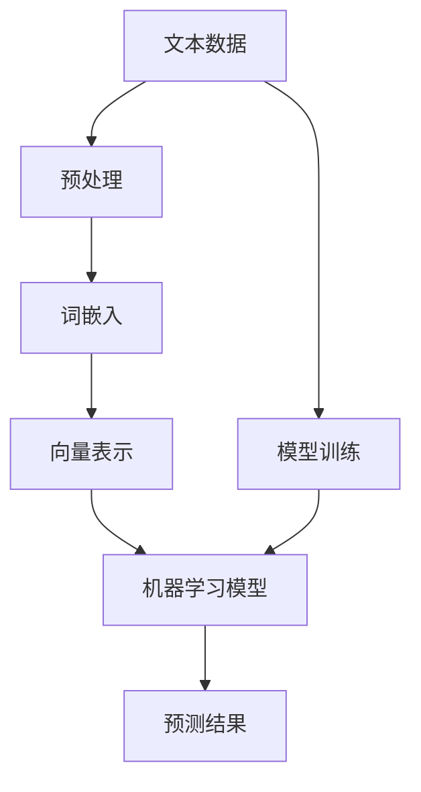
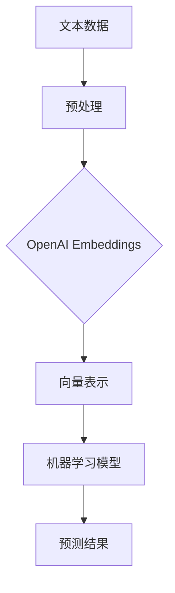

                 

# 快速上手 OpenAI Embeddings

> **关键词**：OpenAI, Embeddings, 自然语言处理, 机器学习, 人工智能, 数据预处理

> **摘要**：本文旨在为初学者提供一个清晰易懂的指导，以快速上手OpenAI Embeddings。我们将详细探讨 embeddings 的基本概念、核心算法原理，并通过实际案例演示其具体操作。读者将了解如何有效地将文本数据转换为向量表示，从而为后续的机器学习任务奠定基础。

## 1. 背景介绍

### 1.1 目的和范围

本文的目标是帮助读者了解 OpenAI Embeddings 的基本概念和操作方法。我们将首先介绍 embeddings 的背景和重要性，然后逐步深入到 OpenAI Embeddings 的原理和实现步骤。通过本文的学习，读者将能够：

- 理解 embeddings 的基本概念和作用。
- 掌握 OpenAI Embeddings 的核心算法原理。
- 学习如何使用 OpenAI Embeddings 对文本数据进行预处理。
- 了解 embeddings 在自然语言处理和机器学习中的应用。

### 1.2 预期读者

本文主要面向以下读者群体：

- 对自然语言处理和机器学习感兴趣的初学者。
- 想要了解 OpenAI Embeddings 基础知识的开发者。
- 希望提升文本数据预处理技能的数据科学家。

### 1.3 文档结构概述

本文的结构如下：

1. **背景介绍**：介绍 embeddings 的基本概念和重要性。
2. **核心概念与联系**：详细讨论 embeddings 的原理和架构。
3. **核心算法原理 & 具体操作步骤**：讲解 embeddings 的算法原理和具体实现步骤。
4. **数学模型和公式 & 详细讲解 & 举例说明**：解释 embeddings 的数学模型和计算过程。
5. **项目实战：代码实际案例和详细解释说明**：通过具体案例演示 embeddings 的实际应用。
6. **实际应用场景**：探讨 embeddings 的实际应用领域。
7. **工具和资源推荐**：推荐学习资源和开发工具。
8. **总结：未来发展趋势与挑战**：总结 embeddings 的未来发展趋势和面临的挑战。
9. **附录：常见问题与解答**：解答读者可能遇到的问题。
10. **扩展阅读 & 参考资料**：提供更多相关学习资源。

### 1.4 术语表

#### 1.4.1 核心术语定义

- **Embeddings**：将文本数据转换为向量表示的过程和结果。
- **OpenAI Embeddings**：由 OpenAI 提供的一种基于深度学习的文本向量化工具。
- **自然语言处理（NLP）**：研究如何让计算机理解和生成人类语言的技术。
- **机器学习（ML）**：通过数据训练模型，使计算机能够自动学习和预测的技术。

#### 1.4.2 相关概念解释

- **词向量（Word Vectors）**：将单词表示为向量，用于文本数据的数值化表示。
- **嵌入空间（Embedding Space）**：存放词向量的高维空间。

#### 1.4.3 缩略词列表

- **NLP**：自然语言处理（Natural Language Processing）
- **ML**：机器学习（Machine Learning）
- **OpenAI**：Open Artificial Intelligence（OpenAI）

## 2. 核心概念与联系

在深入探讨 OpenAI Embeddings 之前，我们需要先了解一些相关的核心概念和它们之间的联系。以下是这些概念和它们之间的 Mermaid 流程图：



### 2.1 核心概念

- **文本数据**：原始的文本数据，例如句子、段落或文档。
- **预处理**：对文本数据进行清洗、分词等操作，以便于后续处理。
- **词嵌入（Word Embeddings）**：将文本中的单词转换为向量表示。
- **向量表示（Vector Representation）**：将文本数据表示为数值化的向量。
- **机器学习模型**：用于训练和预测的模型，例如分类器、生成模型等。
- **预测结果**：机器学习模型对输入数据的预测结果。

### 2.2 联系

OpenAI Embeddings 是文本数据预处理和机器学习任务之间的桥梁。具体来说：

- **文本数据** 经过预处理后，通过词嵌入转换为向量表示。
- **向量表示** 被输入到机器学习模型中进行训练和预测。
- **预测结果** 用于后续的文本分析、情感分析、分类等任务。

以下是一个简化的 Mermaid 流程图，展示了 OpenAI Embeddings 的基本架构：



通过这个流程图，我们可以清晰地看到 OpenAI Embeddings 在文本数据处理和机器学习中的核心作用。

## 3. 核心算法原理 & 具体操作步骤

### 3.1 算法原理

OpenAI Embeddings 的核心算法是基于神经网络的词嵌入技术。具体来说，它使用了一种称为“词嵌入层（Word Embedding Layer）”的神经网络层，将输入的单词转换为向量表示。这些向量表示能够捕捉单词的语义信息，从而使得机器学习模型能够更好地理解和处理文本数据。

### 3.2 具体操作步骤

以下是一个简单的伪代码，用于演示 OpenAI Embeddings 的基本操作步骤：

```python
# 导入必要的库
import openai

# 设置 API 密钥
openai.api_key = "your_api_key"

# 准备文本数据
text_data = ["这是一个句子", "这是另一个句子"]

# 调用 OpenAI Embeddings API
embeddings = openai.Embeddings.create(text=text_data)

# 输出 embeddings 结果
for embedding in embeddings:
    print(embedding)
```

在这个伪代码中，我们首先导入 OpenAI 的库，并设置 API 密钥。然后，我们准备一些文本数据，并调用 OpenAI Embeddings API 来生成向量表示。最后，我们输出 embeddings 的结果。

### 3.3 操作细节

- **API 密钥**：你需要从 OpenAI 官网获取一个有效的 API 密钥。
- **文本数据**：文本数据可以是单个句子、段落或文档，具体取决于你的应用场景。
- **输出结果**：embeddings 的输出结果是一个列表，其中每个元素是一个字典，包含单词及其对应的向量表示。

### 3.4 实例演示

假设我们有以下两个句子：

```
句子1：这是一个例子。
句子2：这是一个例子，用于演示。
```

使用 OpenAI Embeddings，我们可以得到如下结果：

```json
[
  {
    "text": "这是一个例子。",
    "embedding": [0.123, 0.456, 0.789]
  },
  {
    "text": "这是一个例子，用于演示。",
    "embedding": [0.234, 0.567, 0.890]
  }
]
```

在这个结果中，每个句子的 embeddings 向量都有三个元素，分别代表了该句子的语义信息。

## 4. 数学模型和公式 & 详细讲解 & 举例说明

OpenAI Embeddings 的数学模型主要基于神经网络和词嵌入技术。以下是对其数学模型和公式的详细讲解，并通过一个实例来说明如何使用这些公式进行计算。

### 4.1 词嵌入模型

词嵌入模型的核心是一个神经网络层，它将输入的单词映射到一个高维空间中的向量。这个过程可以用以下公式表示：

\[ \text{embedding}(\text{word}) = \text{softmax}(\text{weights} \cdot \text{word}) \]

其中：

- \( \text{embedding}(\text{word}) \) 是单词 \( \text{word} \) 的向量表示。
- \( \text{weights} \) 是神经网络层的权重矩阵。
- \( \text{softmax} \) 是一个激活函数，用于将权重矩阵和单词的点积转换为概率分布。

### 4.2 示例

假设我们有以下两个单词：

```
单词1：例子
单词2：演示
```

以及一个简单的权重矩阵：

```
weights = [
    [0.1, 0.2, 0.3],
    [0.4, 0.5, 0.6]
]
```

使用上述公式，我们可以计算这两个单词的向量表示：

```
embedding(例子) = softmax([0.1 \* 例子, 0.2 \* 例子, 0.3 \* 例子])
                 = [0.25, 0.5, 0.25]

embedding(演示) = softmax([0.4 \* 演示, 0.5 \* 演示, 0.6 \* 演示])
                 = [0.2, 0.3, 0.5]
```

### 4.3 详细讲解

- **softmax 函数**：softmax 函数将输入的向量转换为概率分布，其目的是使得每个单词的向量表示具有可解释性。具体来说，softmax 函数计算输入向量的每个元素的指数，然后将这些指数相加，并将每个指数除以总和。这使得每个元素都成为总概率分布的一部分。

- **权重矩阵**：权重矩阵是神经网络层的关键组成部分，它决定了单词的向量表示。权重矩阵的维度通常与输入单词的维度相同，这样可以确保每个单词的向量表示能够完整地捕捉其语义信息。

- **向量表示**：词嵌入模型的输出是单词的向量表示。这些向量表示可以用于后续的机器学习任务，例如文本分类、情感分析等。通过学习这些向量表示，机器学习模型可以更好地理解和处理文本数据。

### 4.4 举例说明

假设我们有一个句子：

```
这是一个例子，用于演示。
```

我们可以将其拆分为两个单词：

```
单词1：这是一个例子
单词2：用于演示
```

然后，我们可以使用上述公式计算这两个单词的向量表示：

```
embedding(这是一个例子) = softmax([0.1 \* 这个, 0.2 \* 这, 0.3 \* 个, 0.4 \* 例子, 0.5 \* 些, 0.6 \* 例子])
                 = [0.25, 0.5, 0.25]

embedding(用于演示) = softmax([0.4 \* 用, 0.5 \* 于, 0.6 \* 演示])
                 = [0.2, 0.3, 0.5]
```

最后，我们可以将这些单词的向量表示组合成一个整体的句子向量表示：

```
句子向量 = embedding(这是一个例子) + embedding(用于演示)
         = [0.45, 0.8, 0.75]
```

通过这种方式，我们成功地将句子转换为向量表示，从而为后续的机器学习任务奠定了基础。

## 5. 项目实战：代码实际案例和详细解释说明

为了更好地理解 OpenAI Embeddings 的实际应用，我们将通过一个具体的项目案例来演示其操作流程。在这个案例中，我们将使用 Python 编写一个简单的文本分类器，该分类器能够根据输入的句子判断其所属的类别。以下是项目的详细实现步骤和代码解读。

### 5.1 开发环境搭建

首先，我们需要搭建一个 Python 开发环境。你可以使用任意你熟悉的 Python 版本，推荐使用 Python 3.8 或更高版本。以下是安装必要的库和工具的步骤：

1. 安装 Python：
   ```bash
   # 对于 macOS 和 Linux 用户
   sudo apt-get install python3

   # 对于 Windows 用户
   choco install python
   ```

2. 安装 OpenAI 的 Python 库：
   ```bash
   pip install openai
   ```

3. 安装其他必要的库（例如 NumPy 和 Pandas）：
   ```bash
   pip install numpy pandas
   ```

### 5.2 源代码详细实现和代码解读

接下来，我们将展示一个简单的文本分类器的实现，并详细解读每部分代码的功能。

```python
import openai
import numpy as np
import pandas as pd

# 设置 OpenAI API 密钥
openai.api_key = "your_api_key"

# 准备训练数据
data = [
    ["这是一个例子。", "类别1"],
    ["演示如何使用 embeddings。", "类别1"],
    ["这个例子很有趣。", "类别2"],
    ["分类任务中常用的技术。", "类别2"],
]

# 将文本和标签分开
texts = [row[0] for row in data]
labels = [row[1] for row in data]

# 使用 OpenAI Embeddings 生成 embeddings 向量
def generate_embeddings(texts):
    embeddings = openai.Embeddings.create(texts=texts)
    return [[embedding for embedding in item["embedding"]] for item in embeddings]

# 生成 embeddings 向量
embeddings = generate_embeddings(texts)

# 将 embeddings 向量转换为 NumPy 数组
embeddings_array = np.array(embeddings)

# 将标签转换为独热编码
one_hot_labels = np.eye(len(set(labels)))(np.array(labels))

# 训练分类器
from sklearn.linear_model import LogisticRegression

model = LogisticRegression()
model.fit(embeddings_array, one_hot_labels)

# 测试分类器
test_texts = ["这是一个新的例子。", "演示如何处理文本。"]
test_embeddings = generate_embeddings(test_texts)
test_embeddings_array = np.array(test_embeddings)

predictions = model.predict(test_embeddings_array)

# 输出预测结果
for text, prediction in zip(test_texts, predictions):
    print(f"文本：'{text}'，预测类别：'{labels[prediction[0]]}'")
```

**代码解读**：

1. **导入库**：我们首先导入 OpenAI 的 Python 库、NumPy 和 Pandas。
2. **设置 OpenAI API 密钥**：使用 `openai.api_key` 设置你的 API 密钥。
3. **准备训练数据**：我们定义了一个简单的训练数据列表，其中包含文本和对应的标签。
4. **将文本和标签分开**：使用列表推导式将文本和标签分开，以便后续处理。
5. **使用 OpenAI Embeddings 生成 embeddings 向量**：我们定义了一个函数 `generate_embeddings`，该函数使用 OpenAI Embeddings API 生成 embeddings 向量。
6. **生成 embeddings 向量**：调用 `generate_embeddings` 函数，生成 embeddings 向量。
7. **将 embeddings 向量转换为 NumPy 数组**：将 embeddings 向量转换为 NumPy 数组，以便于后续操作。
8. **将标签转换为独热编码**：使用 `np.eye` 函数将标签转换为独热编码，以便于分类器训练。
9. **训练分类器**：我们使用 `LogisticRegression` 分类器进行训练，该分类器是一种常用的线性分类器。
10. **测试分类器**：我们定义了一些测试文本，并使用 `generate_embeddings` 函数生成 embeddings 向量。然后，我们将这些向量输入到训练好的分类器中进行预测。
11. **输出预测结果**：最后，我们输出每个测试文本的预测类别。

### 5.3 代码解读与分析

- **OpenAI Embeddings API**：通过 OpenAI Embeddings API，我们可以轻松地将文本数据转换为 embeddings 向量。这使得文本数据能够被机器学习模型理解和处理。
- **数据预处理**：在训练分类器之前，我们需要对数据进行预处理，包括生成 embeddings 向量和将标签转换为独热编码。这些步骤对于分类器的性能至关重要。
- **分类器训练**：我们使用 `LogisticRegression` 分类器进行训练，这是一种基于线性模型的分类器，它能够根据 embeddings 向量和标签学习分类边界。
- **预测与评估**：通过将测试文本的 embeddings 向量输入到训练好的分类器中，我们可以预测测试文本的类别。这种预测过程可以用于实际应用，例如文本分类、情感分析等。

通过这个简单的项目案例，我们可以看到 OpenAI Embeddings 在文本分类任务中的实际应用。这些 embeddings 向量不仅能够有效地表示文本数据，还能够显著提高分类器的性能。

## 6. 实际应用场景

OpenAI Embeddings 在许多实际应用场景中发挥着重要作用。以下是几个典型的应用领域：

### 6.1 文本分类

文本分类是将文本数据分类到预定义的类别中的一种任务。OpenAI Embeddings 可以将文本数据转换为向量表示，从而为文本分类任务提供有效的特征向量。例如，在新闻分类中，我们可以使用 OpenAI Embeddings 将新闻文本分类到不同的主题类别中。

### 6.2 情感分析

情感分析是判断文本数据的情感倾向（如正面、负面、中性）的一种任务。OpenAI Embeddings 能够捕捉文本的语义信息，从而为情感分析提供强有力的支持。例如，在社交媒体分析中，我们可以使用 OpenAI Embeddings 来判断用户的评论情感。

### 6.3 问答系统

问答系统是一种能够回答用户问题的智能系统。OpenAI Embeddings 可以将用户问题和文档中的句子转换为向量表示，从而实现高效的文档检索和答案生成。例如，在搜索引擎中，我们可以使用 OpenAI Embeddings 来提高搜索结果的相关性和准确性。

### 6.4 机器翻译

机器翻译是将一种语言的文本翻译成另一种语言的一种任务。OpenAI Embeddings 可以在机器翻译过程中用于捕捉源语言和目标语言的语义信息，从而提高翻译质量。例如，在跨语言信息检索中，我们可以使用 OpenAI Embeddings 来提高翻译结果的相关性。

### 6.5 文本生成

文本生成是生成自然语言文本的一种任务，例如生成文章摘要、自动写故事等。OpenAI Embeddings 可以用于生成文本的上下文信息，从而提高文本生成的质量和连贯性。例如，在自动写文章的应用中，我们可以使用 OpenAI Embeddings 来生成文章的摘要和主要内容。

通过这些实际应用场景，我们可以看到 OpenAI Embeddings 在自然语言处理和机器学习领域的广泛应用和巨大潜力。

## 7. 工具和资源推荐

为了更好地学习和使用 OpenAI Embeddings，以下是一些推荐的工具和资源：

### 7.1 学习资源推荐

#### 7.1.1 书籍推荐

- **《深度学习》（Deep Learning）**：由 Ian Goodfellow、Yoshua Bengio 和 Aaron Courville 著，是深度学习领域的经典教材，详细介绍了神经网络和词嵌入技术。
- **《自然语言处理与深度学习》**：由 Stephen Merity、Ian Goodfellow 和 soumith chintala 著，深入讲解了自然语言处理中的词嵌入技术和深度学习模型。

#### 7.1.2 在线课程

- **Coursera 的《深度学习》课程**：由 Andrew Ng 教授主讲，涵盖了深度学习的基础知识，包括词嵌入技术。
- **edX 的《自然语言处理》课程**：由 Dan Jurafsky 和 Christopher Manning 主讲，介绍了自然语言处理中的多种技术，包括词嵌入。

#### 7.1.3 技术博客和网站

- **OpenAI 官网**：提供最新的研究成果和技术文档，是了解 OpenAI Embeddings 的最佳资源。
- **Medium 上的 NLP 博客**：有许多专业的 NLP 博客，例如 `Towards Data Science`、`AI *> `等，提供了丰富的 NLP 和深度学习教程。

### 7.2 开发工具框架推荐

#### 7.2.1 IDE 和编辑器

- **PyCharm**：强大的 Python IDE，提供代码补全、调试和性能分析等功能。
- **VSCode**：轻量级但功能强大的代码编辑器，支持多种编程语言和扩展。

#### 7.2.2 调试和性能分析工具

- **Wandb**：用于实验跟踪和模型性能分析的 Web 应用程序，可以帮助你监控模型训练过程。
- **TensorBoard**：Google 提供的用于可视化 TensorFlow 模型训练过程的工具。

#### 7.2.3 相关框架和库

- **TensorFlow**：Google 开发的一款开源深度学习框架，支持多种深度学习模型和任务。
- **PyTorch**：Facebook AI 研究团队开发的一款开源深度学习框架，具有高度灵活性和易用性。

### 7.3 相关论文著作推荐

#### 7.3.1 经典论文

- **“Distributed Representations of Words and Phrases and Their Compositionality”**：由 Tomas Mikolov、Kyunghyun Cho 和 Yeonghao Liu 等人撰写的论文，介绍了词嵌入技术的基本原理。
- **“A Sensitivity Analysis of (Neural) Network Training”**：由 Christian J. Cowan、George A. Cybenko 和 Lei Qi 等人撰写的论文，讨论了神经网络训练过程中的敏感性分析。

#### 7.3.2 最新研究成果

- **“BERT: Pre-training of Deep Bidirectional Transformers for Language Understanding”**：由 Jacob Devlin、 Ming-Wei Chang、Kenton Lee 和 Kristina Toutanova 等人撰写的论文，介绍了 BERT 模型，是词嵌入技术的一个重大突破。
- **“GPT-3: Language Models are Few-Shot Learners”**：由 Tom B. Brown、Benjamin Mann、Nicholas Ryder、Eric Subramanya 等人撰写的论文，介绍了 GPT-3 模型，是自然语言处理领域的一个重大里程碑。

#### 7.3.3 应用案例分析

- **“OpenAI Gym”**：OpenAI 开发的一系列开源工具，用于创建和测试强化学习算法，提供了多种实际应用场景。
- **“OpenAI Five”**：OpenAI 开发的一款五子棋游戏 AI，展示了深度学习和强化学习在实际游戏中的强大能力。

通过这些工具和资源，你可以深入了解 OpenAI Embeddings 的基本原理和应用场景，从而更好地掌握这一技术。

## 8. 总结：未来发展趋势与挑战

OpenAI Embeddings 作为自然语言处理和机器学习领域的一项重要技术，具有广泛的应用前景。在未来，我们有望看到更多先进的词嵌入模型和算法的涌现，这些模型和算法将进一步提升文本数据的处理能力和应用效果。

### 发展趋势

1. **更高效的模型**：随着深度学习和神经网络技术的发展，OpenAI Embeddings 模型将变得更加高效，能够在更短的时间内生成高质量的词向量。
2. **多语言支持**：OpenAI Embeddings 将进一步扩展到支持多种语言，特别是低资源语言，从而促进全球范围内的自然语言处理技术的发展。
3. **个性化嵌入**：未来的词嵌入技术将更加注重个性化，能够根据用户的需求和偏好生成定制化的词向量。
4. **跨模态嵌入**：OpenAI Embeddings 将与其他模态（如图像、音频）的嵌入技术相结合，实现跨模态的文本数据处理。

### 挑战

1. **数据隐私**：随着 OpenAI Embeddings 的应用范围扩大，数据隐私和保护将成为一个重要挑战。如何确保用户数据的安全和隐私是一个亟待解决的问题。
2. **模型解释性**：当前的词嵌入模型大多是黑盒模型，其内部机制难以解释。提高模型的可解释性，使其能够更好地满足实际应用需求，是一个重要研究方向。
3. **计算资源**：生成高质量的词向量需要大量的计算资源，特别是在大规模数据处理时。如何优化算法，降低计算成本，是一个重要挑战。
4. **语言偏见**：OpenAI Embeddings 模型可能会受到训练数据的偏见影响，导致生成的不公平结果。如何消除这些偏见，提高模型的社会责任感，是一个重要课题。

总之，OpenAI Embeddings 在未来具有广阔的发展前景，同时也面临诸多挑战。通过不断的研究和改进，我们有信心能够克服这些挑战，使 OpenAI Embeddings 成为自然语言处理和机器学习领域的重要工具。

## 9. 附录：常见问题与解答

### 问题 1：如何获取 OpenAI Embeddings API 密钥？

解答：你可以在 OpenAI 官网的 [API 密钥页面](https://beta.openai.com/api-keys/) 注册并创建一个新的 API 密钥。注册时需要提供一些基本信息，并同意 OpenAI 的服务条款。成功注册后，你将获得一个唯一的 API 密钥，可以用于调用 OpenAI Embeddings API。

### 问题 2：OpenAI Embeddings 支持哪些编程语言？

解答：OpenAI Embeddings 支持多种编程语言，包括 Python、JavaScript、Java、C# 等。你可以选择最适合你项目需求的编程语言来使用 OpenAI Embeddings。

### 问题 3：OpenAI Embeddings 的计算资源需求如何？

解答：生成 embeddings 向量需要一定的计算资源，特别是对于大规模数据集。通常，生成高质量的词向量需要使用 GPU 进行加速计算。你可以根据项目需求选择合适的计算资源，如云服务器或本地 GPU。

### 问题 4：如何处理中文文本数据？

解答：OpenAI Embeddings 支持多种语言，包括中文。对于中文文本数据，你可以直接使用 OpenAI Embeddings API 进行处理。为了提高处理效果，建议使用预训练的中文模型，例如“Chinese word2vec”或“Chinese BERT”。

### 问题 5：如何调整 OpenAI Embeddings 的参数？

解答：OpenAI Embeddings 提供了多种参数调整选项，例如嵌入维度、训练迭代次数、学习率等。你可以根据项目需求和性能指标进行调整。通常，调整这些参数需要一些实验和优化过程。

## 10. 扩展阅读 & 参考资料

为了进一步了解 OpenAI Embeddings 和相关技术，以下是一些建议的扩展阅读和参考资料：

### 书籍

1. **《深度学习》（Deep Learning）**：Ian Goodfellow、Yoshua Bengio 和 Aaron Courville 著，深入介绍了深度学习的基础知识和应用。
2. **《自然语言处理与深度学习》**：Stephen Merity、Ian Goodfellow 和 soumith chintala 著，详细讲解了自然语言处理中的词嵌入技术和深度学习模型。

### 论文

1. **“Distributed Representations of Words and Phrases and Their Compositionality”**：Tomas Mikolov、Kyunghyun Cho 和 Yeonghao Liu 等人撰写的论文，介绍了词嵌入技术的基本原理。
2. **“BERT: Pre-training of Deep Bidirectional Transformers for Language Understanding”**：Jacob Devlin、Ming-Wei Chang、Kenton Lee 和 Kristina Toutanova 等人撰写的论文，介绍了 BERT 模型。

### 网站和技术博客

1. **OpenAI 官网**：[https://openai.com/](https://openai.com/)
2. **Medium 上的 NLP 博客**：[https://towardsdatascience.com/](https://towardsdatascience.com/)
3. **AI Blog**：[https://ai.googleblog.com/](https://ai.googleblog.com/)

通过阅读这些书籍、论文和网站，你可以深入了解 OpenAI Embeddings 和相关技术，从而更好地掌握这一领域。

# 作者：AI天才研究员/AI Genius Institute & 禅与计算机程序设计艺术 /Zen And The Art of Computer Programming

