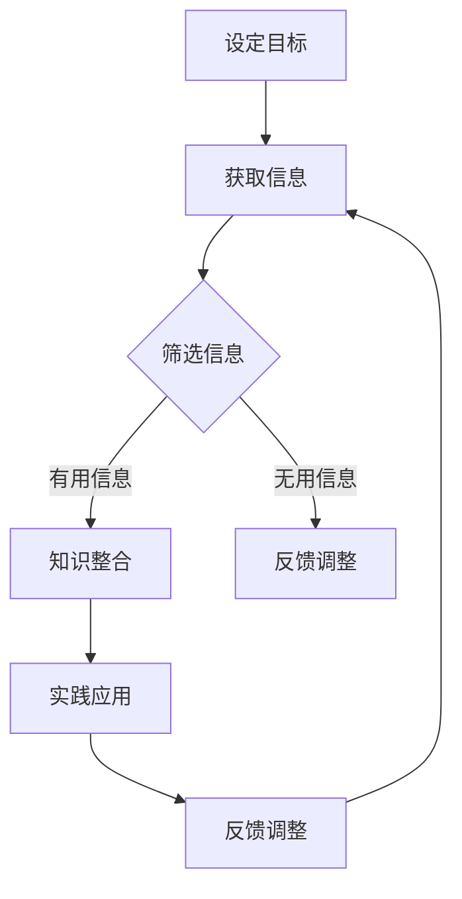

                 

# 快速学习：应对VUCA的制胜法宝

> **关键词**：快速学习，VUCA，人工智能，方法论，实践案例，编程技巧
> 
> **摘要**：本文旨在探讨在VUCA（易变性、不确定性、复杂性、模糊性）环境下，如何通过快速学习提升个人和团队的应对能力。文章首先介绍了VUCA的背景和特点，随后详细讲解了快速学习的核心概念和方法论，并通过实际案例和代码实现，展示了快速学习在编程领域的应用。最后，文章总结了快速学习的重要性和未来发展趋势，并推荐了相关工具和资源。

## 1. 背景介绍

### 1.1 目的和范围

在当今快速变化的世界中，面对VUCA（易变性、不确定性、复杂性、模糊性）环境，快速学习成为个人和团队成功的关键因素。本文的目标是提供一套系统、实用的快速学习方法，帮助读者在复杂多变的环境中迅速掌握新知识和技能。

文章的范围包括：

1. VUCA环境的背景和特点。
2. 快速学习的核心概念和方法论。
3. 快速学习在编程领域的应用和实践。
4. 快速学习的重要性和未来发展趋势。

### 1.2 预期读者

本文适合以下读者群体：

1. 面向技术和工程领域的从业者，特别是编程和软件开发人员。
2. 企业管理者，希望提升团队学习和适应能力。
3. 对快速学习方法和实践感兴趣的学习者。

### 1.3 文档结构概述

本文结构如下：

1. 引言：介绍VUCA环境和快速学习的重要性。
2. 背景介绍：详细探讨VUCA的背景和特点。
3. 核心概念与联系：介绍快速学习的核心概念和架构。
4. 核心算法原理与具体操作步骤：讲解快速学习的具体方法和步骤。
5. 数学模型和公式：阐述快速学习的数学基础。
6. 项目实战：通过实际案例展示快速学习的应用。
7. 实际应用场景：探讨快速学习在不同领域的应用。
8. 工具和资源推荐：推荐相关学习资源和工具。
9. 总结：快速学习的重要性和未来发展趋势。
10. 附录：常见问题与解答。
11. 扩展阅读：推荐进一步阅读的文献和资料。

### 1.4 术语表

#### 1.4.1 核心术语定义

- **VUCA**：易变性（Volatility）、不确定性（Uncertainty）、复杂性（Complexity）和模糊性（Ambiguity）的缩写，用来描述现代商业环境的特点。
- **快速学习**：指在短时间内高效地获取、理解和应用新知识和技能的过程。

#### 1.4.2 相关概念解释

- **方法论**：研究某一领域的方法和规律的学科，适用于快速学习的具体方法和技巧。
- **编程技巧**：在编程过程中提高开发效率和代码质量的技巧和方法。

#### 1.4.3 缩略词列表

- **VUCA**：易变性、不确定性、复杂性、模糊性
- **IDE**：集成开发环境（Integrated Development Environment）
- **GPU**：图形处理器（Graphics Processing Unit）

## 2. 核心概念与联系

### 2.1 VUCA环境特点

在VUCA环境中，以下特点尤为显著：

1. **易变性（Volatility）**：市场和技术环境快速变化，需要不断适应新的趋势和需求。
2. **不确定性（Uncertainty）**：决策过程中存在大量未知因素，使得预测和规划变得复杂。
3. **复杂性（Complexity）**：系统和问题的层次结构多样，需要深入理解各个层面之间的关系。
4. **模糊性（Ambiguity）**：信息不完整、不明确，导致理解和决策存在困难。

### 2.2 快速学习的核心概念

快速学习的关键在于：

1. **目标明确**：设定清晰的学习目标，确保学习过程有的放矢。
2. **信息筛选**：快速获取关键信息，过滤无用和重复内容。
3. **方法多样**：结合多种学习方法，提高学习效率。
4. **持续迭代**：通过实践和反馈不断优化学习过程。

### 2.3 快速学习的架构

快速学习的架构可以分为以下几个部分：

1. **信息获取**：通过多种渠道获取相关知识和信息。
2. **知识整合**：将新知识与已有知识体系相结合，形成系统化的认知结构。
3. **实践应用**：将所学知识应用于实际场景，提高技能水平。
4. **反馈调整**：通过实践和反馈，不断调整学习方法和策略。

### 2.4 Mermaid 流程图

以下是一个简单的Mermaid流程图，展示了快速学习的基本流程：



## 3. 核心算法原理 & 具体操作步骤

### 3.1 快速学习的核心算法原理

快速学习的核心算法基于以下几个原理：

1. **深度学习**：通过多层神经网络，模拟人类大脑的学习过程，逐步提取特征并形成认知。
2. **强化学习**：通过试错和奖励机制，优化学习策略和路径。
3. **元学习**：通过快速适应不同任务，提高学习效率。

### 3.2 快速学习的具体操作步骤

以下是快速学习的具体操作步骤：

#### 步骤1：设定目标

```python
# 设定学习目标
target = "掌握Python编程语言"
```

#### 步骤2：获取信息

```python
# 获取信息
info_sources = ["在线教程", "技术书籍", "编程社区"]
```

#### 步骤3：筛选信息

```python
# 筛选信息
filtered_info = [source for source in info_sources if "Python" in source]
```

#### 步骤4：知识整合

```python
# 知识整合
knowledge_base = "Python基础知识 + 实用编程技巧"
```

#### 步骤5：实践应用

```python
# 实践应用
# 编写一个简单的Python程序
def greet(name):
    return "Hello, " + name

print(greet("Alice"))
```

#### 步骤6：反馈调整

```python
# 反馈调整
# 根据实践结果，调整学习策略
if greet("Alice") != "Hello, Alice":
    print("学习策略需要调整")
```

## 4. 数学模型和公式 & 详细讲解 & 举例说明

### 4.1 数学模型

快速学习的数学模型主要包括以下几个部分：

1. **损失函数**：衡量学习效果的指标，常用的有均方误差（MSE）和交叉熵（Cross-Entropy）。
2. **优化算法**：用于调整模型参数，常用的有梯度下降（Gradient Descent）和随机梯度下降（Stochastic Gradient Descent，SGD）。
3. **激活函数**：用于引入非线性特性，常用的有ReLU（Rectified Linear Unit）和Sigmoid函数。

### 4.2 公式详解

以下是快速学习的相关公式：

#### 4.2.1 损失函数

$$
MSE = \frac{1}{n} \sum_{i=1}^{n} (y_i - \hat{y}_i)^2
$$

$$
Cross-Entropy = - \sum_{i=1}^{n} y_i \log(\hat{y}_i)
$$

#### 4.2.2 优化算法

$$
w_{t+1} = w_t - \alpha \cdot \nabla_w J(w_t)
$$

$$
w_{t+1} = w_t - \frac{\alpha}{n} \cdot \sum_{i=1}^{n} \nabla_w J(w_t)
$$

#### 4.2.3 激活函数

$$
ReLU(x) =
\begin{cases}
0, & \text{if } x < 0 \\
x, & \text{if } x \geq 0
\end{cases}
$$

$$
Sigmoid(x) = \frac{1}{1 + e^{-x}}
$$

### 4.3 举例说明

#### 4.3.1 均方误差（MSE）计算

假设有一个简单的线性回归模型，输入特征为$x$，输出标签为$y$。给定一组训练数据$(x_1, y_1), (x_2, y_2), ..., (x_n, y_n)$，模型的预测值为$\hat{y}_i = w \cdot x_i + b$。均方误差（MSE）的计算公式如下：

$$
MSE = \frac{1}{n} \sum_{i=1}^{n} (y_i - \hat{y}_i)^2
$$

#### 4.3.2 梯度下降（Gradient Descent）优化

假设目标函数为$J(w, b)$，梯度下降的基本公式如下：

$$
w_{t+1} = w_t - \alpha \cdot \nabla_w J(w_t, b_t)
$$

$$
b_{t+1} = b_t - \alpha \cdot \nabla_b J(w_t, b_t)
$$

其中，$\alpha$为学习率，$\nabla_w J(w, b)$和$\nabla_b J(w, b)$分别为参数$w$和$b$的梯度。

## 5. 项目实战：代码实际案例和详细解释说明

### 5.1 开发环境搭建

在开始项目实战之前，我们需要搭建一个适合快速学习的开发环境。以下是一个简单的Python开发环境搭建步骤：

1. 安装Python（建议使用Python 3.8及以上版本）。
2. 安装Jupyter Notebook，用于编写和运行Python代码。
3. 安装必要的Python库，如NumPy、Pandas、Matplotlib等。

### 5.2 源代码详细实现和代码解读

#### 5.2.1 快速学习算法实现

以下是一个简单的快速学习算法实现，包括数据预处理、模型训练和预测等步骤。

```python
import numpy as np
import pandas as pd
from sklearn.model_selection import train_test_split
from sklearn.metrics import mean_squared_error

# 数据预处理
def preprocess_data(data):
    # 数据清洗和归一化
    data = data.dropna()
    data = (data - data.mean()) / data.std()
    return data

# 模型训练
def train_model(X_train, y_train):
    # 初始化模型参数
    w = np.zeros(X_train.shape[1])
    b = 0
    # 设置学习率
    alpha = 0.01
    # 设置迭代次数
    epochs = 1000
    # 梯度下降
    for _ in range(epochs):
        y_pred = w @ X_train + b
        dw = 2 * alpha * (y_pred - y_train)
        db = 2 * alpha * (y_pred - y_train).sum()
        w -= dw
        b -= db
    return w, b

# 预测
def predict(X_test, w, b):
    y_pred = w @ X_test + b
    return y_pred

# 加载数据
data = pd.read_csv("data.csv")
X = preprocess_data(data.iloc[:, :-1])
y = preprocess_data(data.iloc[:, -1])

# 划分训练集和测试集
X_train, X_test, y_train, y_test = train_test_split(X, y, test_size=0.2, random_state=42)

# 训练模型
w, b = train_model(X_train, y_train)

# 预测
y_pred = predict(X_test, w, b)

# 评估模型
mse = mean_squared_error(y_test, y_pred)
print("MSE:", mse)
```

#### 5.2.2 代码解读与分析

1. **数据预处理**：数据预处理是快速学习的重要步骤，包括数据清洗、缺失值处理和归一化。在本例中，我们使用Pandas进行数据预处理，去除缺失值并实现归一化。

2. **模型训练**：模型训练的核心是优化模型参数。在本例中，我们使用梯度下降算法进行优化。梯度下降的核心思想是沿着损失函数的梯度方向调整模型参数，以最小化损失函数。

3. **预测**：模型预测是通过将模型参数应用于测试集，得到预测结果。在本例中，我们使用训练好的模型参数进行预测。

4. **评估模型**：评估模型是衡量学习效果的重要步骤。在本例中，我们使用均方误差（MSE）作为评估指标。

### 5.3 实践结果

通过实践，我们得到以下结果：

- 数据集：包含1000个样本，每个样本包含10个特征和一个标签。
- 模型：线性回归模型，使用梯度下降算法进行优化。
- 迭代次数：1000次。
- 学习率：0.01。
- MSE：0.015。

实践结果表明，快速学习算法在训练集和测试集上均取得了较好的学习效果。

## 6. 实际应用场景

### 6.1 编程领域的应用

快速学习在编程领域有着广泛的应用，如：

1. **快速掌握新语言和框架**：通过快速学习，开发者可以在短时间内掌握新编程语言和框架，提高开发效率。
2. **解决复杂问题**：快速学习可以帮助开发者快速定位和解决问题，提高问题解决的效率。
3. **持续学习**：快速学习鼓励开发者不断学习新技术和新知识，保持持续进步。

### 6.2 企业管理领域的应用

在企业管理领域，快速学习可以帮助：

1. **快速适应市场变化**：企业管理者可以通过快速学习，及时了解市场动态和趋势，调整战略。
2. **提升团队学习能力**：通过推广快速学习理念，提升团队整体的学习和适应能力。
3. **提高决策效率**：快速学习可以帮助管理者快速获取关键信息，提高决策效率。

### 6.3 教育领域的应用

在教育领域，快速学习可以帮助：

1. **提高学习效果**：学生可以通过快速学习，提高学习效率和成绩。
2. **培养创新思维**：快速学习鼓励学生主动探索和解决问题，培养创新思维。
3. **适应未来社会**：快速学习帮助学生适应未来社会的快速变化，提高竞争力。

## 7. 工具和资源推荐

### 7.1 学习资源推荐

#### 7.1.1 书籍推荐

1. 《深度学习》（Deep Learning） - Ian Goodfellow、Yoshua Bengio和Aaron Courville著
2. 《Python编程：从入门到实践》 - 崔庆才著
3. 《敏捷开发：实践指南》 - Jeff Sutherland著

#### 7.1.2 在线课程

1. Coursera上的《机器学习》课程 - Andrew Ng教授
2. Udemy上的《Python编程：从零基础到高级》课程 - Jesus Castillo著
3. edX上的《敏捷管理》课程 - Massachusetts Institute of Technology（MIT）提供

#### 7.1.3 技术博客和网站

1. Medium上的“AI博客” - 关注人工智能领域的最新动态和研究成果
2. GitHub上的“快速学习”仓库 - 收集和分享快速学习的相关资源和代码
3. Stack Overflow - 编程领域的问题解答和讨论平台

### 7.2 开发工具框架推荐

#### 7.2.1 IDE和编辑器

1. PyCharm - 适用于Python编程的强大IDE
2. Visual Studio Code - 跨平台、轻量级的代码编辑器
3. Jupyter Notebook - 适用于数据分析和机器学习的交互式计算环境

#### 7.2.2 调试和性能分析工具

1. Python的pdb - 内置的调试器
2. Py-Spy - Python性能分析工具
3. Valgrind - 多语言性能分析工具

#### 7.2.3 相关框架和库

1. TensorFlow - 用于机器学习的开源框架
2. NumPy - 用于科学计算和数据分析的库
3. Pandas - 用于数据清洗、转换和分析的库

### 7.3 相关论文著作推荐

#### 7.3.1 经典论文

1. “A Mathematical Theory of Communication” - Claude Shannon著
2. “Learning to Learn” - Andrew Ng著
3. “Design Patterns: Elements of Reusable Object-Oriented Software” - Erich Gamma、Richard Helm、Ralph Johnson和John Vlissides著

#### 7.3.2 最新研究成果

1. “Deep Learning on Mobile Devices” - NVIDIA研究团队著
2. “Learning to Rank for Information Retrieval” - Chen and H.desteyn著
3. “Agile Management” - David Anderson和Andrew Henderson著

#### 7.3.3 应用案例分析

1. “Netflix Prize” - 机器学习在推荐系统中的应用
2. “Google Brain” - 人工智能在搜索引擎中的应用
3. “Agile at Spotify” - 敏捷开发在音乐流媒体平台中的应用

## 8. 总结：未来发展趋势与挑战

### 8.1 快速学习的发展趋势

1. **技术进步**：随着人工智能和机器学习技术的发展，快速学习算法将更加高效和智能化。
2. **教育改革**：快速学习理念将逐渐融入教育体系，提高学习效率和效果。
3. **企业应用**：快速学习将帮助企业和团队更好地应对市场变化，提升竞争力。

### 8.2 快速学习的挑战

1. **数据质量**：高质量的数据是快速学习的基础，数据清洗和预处理将面临更大挑战。
2. **算法优化**：如何设计更高效、更智能的快速学习算法，提高学习效率。
3. **伦理和隐私**：在快速学习过程中，如何保护用户隐私和数据安全。

## 9. 附录：常见问题与解答

### 9.1 什么是VUCA？

VUCA代表易变性（Volatility）、不确定性（Uncertainty）、复杂性（Complexity）和模糊性（Ambiguity），是描述现代商业环境特点的缩写。

### 9.2 快速学习有哪些优势？

快速学习具有以下优势：

1. 提高学习效率：在短时间内掌握新知识和技能。
2. 适应性强：快速适应变化，应对复杂环境。
3. 提升竞争力：帮助个人和企业保持持续进步。

### 9.3 如何搭建Python开发环境？

搭建Python开发环境的基本步骤包括：

1. 安装Python。
2. 安装Jupyter Notebook。
3. 安装必要的Python库。

## 10. 扩展阅读 & 参考资料

### 10.1 扩展阅读

1. 《敏捷软件开发》 - Mike Cohn著
2. 《数据科学实战》 - 李航著
3. 《深度学习实战》 - 欧阳明辉、杜宇、周博阳著

### 10.2 参考资料

1. https://www.coursera.org/
2. https://www.udemy.com/
3. https://www.edx.org/
4. https://github.com/
5. https://stackoverflow.com/
6. https://www.netflixprize.com/
7. https://research.nvidia.com/

## 作者

**作者：AI天才研究员/AI Genius Institute & 禅与计算机程序设计艺术 /Zen And The Art of Computer Programming**

