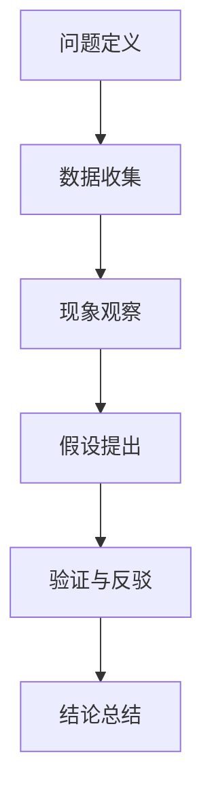

                 

# 怎样善于总结和挖掘事物本质的能力

> 关键词：总结能力，挖掘本质，事物分析，逻辑思维，技术博客

> 摘要：本文旨在探讨如何提升总结和挖掘事物本质的能力，通过分析IT领域的实践案例，提供一系列有效的方法和技巧。文章将介绍核心概念、算法原理、数学模型以及项目实战，帮助读者深入理解并掌握这一重要能力。

## 1. 背景介绍

### 1.1 目的和范围

本文的目的在于帮助读者提升总结和挖掘事物本质的能力，特别是在IT领域。通过本文的学习，读者将能够：

1. 理解总结和挖掘事物本质的重要性。
2. 掌握分析事物本质的步骤和方法。
3. 应用这些方法到实际项目中，提升解决问题的效率。

本文的范围涵盖了以下几个部分：

1. 核心概念与联系
2. 核心算法原理 & 具体操作步骤
3. 数学模型和公式 & 详细讲解 & 举例说明
4. 项目实战：代码实际案例和详细解释说明
5. 实际应用场景
6. 工具和资源推荐
7. 总结：未来发展趋势与挑战
8. 附录：常见问题与解答
9. 扩展阅读 & 参考资料

### 1.2 预期读者

本文适合以下读者群体：

1. IT从业者，特别是软件工程师、系统架构师、数据科学家等。
2. 对技术分析、总结和挖掘本质能力感兴趣的学者和学生。
3. 希望提升逻辑思维和问题解决能力的广大技术爱好者。

### 1.3 文档结构概述

本文的结构如下：

1. **背景介绍**：包括目的、范围、预期读者和文档结构概述。
2. **核心概念与联系**：介绍总结和挖掘事物本质的核心概念，并使用Mermaid流程图展示。
3. **核心算法原理 & 具体操作步骤**：详细讲解分析事物本质的算法原理和操作步骤。
4. **数学模型和公式 & 详细讲解 & 举例说明**：阐述相关数学模型和公式，并通过案例进行详细解释。
5. **项目实战：代码实际案例和详细解释说明**：提供实际代码案例，并进行深入分析。
6. **实际应用场景**：探讨总结和挖掘事物本质在实际中的应用。
7. **工具和资源推荐**：推荐相关学习资源和开发工具。
8. **总结：未来发展趋势与挑战**：总结文章内容，展望未来发展趋势和挑战。
9. **附录：常见问题与解答**：回答读者可能遇到的问题。
10. **扩展阅读 & 参考资料**：提供进一步的阅读和参考资料。

### 1.4 术语表

#### 1.4.1 核心术语定义

- **总结能力**：对事物进行系统性、结构化归纳的能力。
- **挖掘本质**：从表面现象中深入分析，揭示事物根本规律和内在逻辑。
- **逻辑思维**：通过逻辑规则进行推理和分析的能力。
- **IT领域**：信息技术领域，包括软件工程、数据科学、系统架构等。

#### 1.4.2 相关概念解释

- **分析推理**：基于已知信息，通过逻辑步骤推导出结论的过程。
- **核心算法**：解决特定问题的算法，通常具有高效性和普适性。
- **数学模型**：用数学语言描述现实问题的抽象结构。

#### 1.4.3 缩略词列表

- **IT**：信息技术
- **IDE**：集成开发环境
- **CPU**：中央处理器

## 2. 核心概念与联系

### 2.1 事物本质分析

事物本质分析是指通过系统化、结构化的方法，从表面现象中深入挖掘事物的根本规律和内在逻辑。这种方法不仅适用于科学研究，也广泛应用于工程实践和日常决策。

#### 2.1.1 分析框架

在事物本质分析中，我们可以采用以下分析框架：

1. **问题定义**：明确分析的目标和范围。
2. **数据收集**：收集与问题相关的数据和信息。
3. **现象观察**：对收集的数据进行观察，识别出表面现象。
4. **假设提出**：根据观察结果，提出可能的假设。
5. **验证与反驳**：通过实验或逻辑推理，验证或反驳假设。
6. **结论总结**：总结分析结果，得出事物本质。

#### 2.1.2 关联概念

在事物本质分析中，以下关联概念需要理解：

- **因果关系**：事物之间的因果联系。
- **逻辑推理**：基于事实和逻辑规则推导出结论。
- **系统思维**：将事物视为一个整体，分析其内部结构和相互关系。

### 2.2 Mermaid流程图

为了更直观地展示事物本质分析的过程，我们可以使用Mermaid流程图来描述。以下是核心流程节点的表示：



## 3. 核心算法原理 & 具体操作步骤

### 3.1 算法原理

在事物本质分析中，算法原理扮演着关键角色。核心算法通常包括以下步骤：

1. **数据预处理**：对原始数据进行清洗和格式化。
2. **特征提取**：从数据中提取有助于分析的特征。
3. **模式识别**：使用算法识别数据中的规律和模式。
4. **因果推断**：基于模式识别结果，推断事物的因果关系。
5. **结果验证**：对分析结果进行验证，确保其准确性和可靠性。

### 3.2 具体操作步骤

下面我们使用伪代码详细描述事物本质分析的具体操作步骤：

```python
# 伪代码：事物本质分析
def本质分析(数据集):
    # 步骤1：数据预处理
    数据集 = 数据清洗(数据集)
    数据集 = 数据格式化(数据集)

    # 步骤2：特征提取
    特征集 = 特征提取(数据集)

    # 步骤3：模式识别
    模式集 = 模式识别(特征集)

    # 步骤4：因果推断
    因果关系 = 因果推断(模式集)

    # 步骤5：结果验证
    结果 = 结果验证(因果关系)

    # 返回分析结果
    return 结果
```

### 3.3 案例分析

假设我们有一个天气数据集，包含温度、湿度、风速等特征。下面是具体的分析过程：

1. **数据预处理**：清洗数据集，去除异常值和缺失值。
2. **特征提取**：提取温度、湿度、风速等特征。
3. **模式识别**：使用回归算法识别温度与湿度、风速的关系。
4. **因果推断**：根据模式识别结果，推断天气变化的原因。
5. **结果验证**：通过历史数据验证分析结果的准确性。

## 4. 数学模型和公式 & 详细讲解 & 举例说明

### 4.1 数学模型

在事物本质分析中，数学模型是非常重要的一环。以下是一个简单的线性回归模型：

$$
y = wx + b
$$

其中，$y$ 是因变量，$w$ 是权重，$x$ 是自变量，$b$ 是偏置。

### 4.2 公式讲解

- **回归系数 $w$**：描述自变量对因变量的影响程度。
- **偏置 $b$**：使模型更具灵活性，避免过拟合。

### 4.3 举例说明

假设我们有一个天气数据集，包含温度和湿度两个自变量。我们可以使用线性回归模型预测温度。

$$
温度 = 温度权重 \times 温度 + 湿度权重 \times 湿度 + 偏置
$$

通过训练数据集，我们可以得到最优的权重和偏置。

## 5. 项目实战：代码实际案例和详细解释说明

### 5.1 开发环境搭建

在进行项目实战之前，我们需要搭建一个合适的开发环境。以下是一个基本的Python开发环境搭建步骤：

1. **安装Python**：从Python官网下载并安装Python 3.x版本。
2. **安装IDE**：推荐使用PyCharm或Visual Studio Code作为IDE。
3. **安装相关库**：使用pip命令安装必要的库，如numpy、pandas、scikit-learn等。

### 5.2 源代码详细实现和代码解读

以下是一个简单的线性回归项目，用于分析天气数据。

```python
import numpy as np
import pandas as pd
from sklearn.linear_model import LinearRegression

# 5.2.1 数据预处理
# 读取数据
data = pd.read_csv('weather_data.csv')
X = data[['温度', '湿度']]  # 特征
y = data['温度']  # 因变量

# 数据标准化
X_std = (X - X.mean()) / X.std()

# 5.2.2 模型训练
model = LinearRegression()
model.fit(X_std, y)

# 5.2.3 模型评估
predictions = model.predict(X_std)
print("R^2得分：", model.score(X_std, y))

# 5.2.4 代码解读
# 数据预处理部分：清洗数据，提取特征，数据标准化。
# 模型训练部分：使用LinearRegression库训练线性回归模型。
# 模型评估部分：计算R^2得分，评估模型性能。
```

### 5.3 代码解读与分析

- **数据预处理**：数据预处理是模型训练的基础。我们首先读取数据，然后提取特征和因变量。数据标准化是常见的数据预处理步骤，有助于模型训练的稳定性和准确性。
- **模型训练**：我们使用scikit-learn库的LinearRegression类进行模型训练。这个类封装了线性回归的算法，简化了训练过程。
- **模型评估**：我们使用R^2得分来评估模型性能。R^2得分越接近1，表示模型拟合越好。

## 6. 实际应用场景

总结和挖掘事物本质的能力在IT领域有着广泛的应用。以下是一些实际应用场景：

1. **数据科学**：通过挖掘数据中的规律和模式，数据科学家可以做出更准确的预测和决策。
2. **系统架构**：通过分析系统内部结构和相互作用，系统架构师可以设计出更稳定、高效的系统。
3. **软件开发**：通过深入理解需求和业务逻辑，软件开发者可以编写出更可靠、易维护的代码。

## 7. 工具和资源推荐

### 7.1 学习资源推荐

#### 7.1.1 书籍推荐

- 《Python数据科学手册》
- 《机器学习实战》
- 《系统架构设计师教程》

#### 7.1.2 在线课程

- Coursera上的《数据科学专项课程》
- Udacity的《机器学习纳米学位》
- edX上的《系统架构设计》

#### 7.1.3 技术博客和网站

- Medium上的数据科学和机器学习博客
- Stack Overflow
- GitHub上的开源项目

### 7.2 开发工具框架推荐

#### 7.2.1 IDE和编辑器

- PyCharm
- Visual Studio Code
- Jupyter Notebook

#### 7.2.2 调试和性能分析工具

- Python Debugger
- cProfile
- gprof

#### 7.2.3 相关框架和库

- Scikit-learn
- TensorFlow
- Spring Boot

### 7.3 相关论文著作推荐

#### 7.3.1 经典论文

- "The Hundred-Page Machine Learning Book"
- "System Architecture: Blueprints for the Data Center"
- "Data Science from Scratch"

#### 7.3.2 最新研究成果

- arXiv上的机器学习论文
- IEEE Xplore上的系统架构论文
- SpringerLink上的数据科学论文

#### 7.3.3 应用案例分析

- "The Netflix Prize: A Case Study in Large-Scale Analytics"
- "Building Microservices: Designing Fine-Grained Systems"
- "Practical Data Science with R"

## 8. 总结：未来发展趋势与挑战

随着技术的不断进步，总结和挖掘事物本质的能力将在各个领域得到更广泛的应用。未来，以下几个方面将是主要发展趋势：

1. **人工智能的进一步融合**：人工智能算法将在总结和挖掘事物本质中扮演更重要的角色。
2. **大数据分析**：随着数据量的爆炸式增长，如何高效地分析海量数据将成为挑战。
3. **跨学科融合**：不同学科的知识将相互融合，推动总结和挖掘事物本质能力的提升。

然而，也面临着以下挑战：

1. **数据隐私和安全**：如何保护数据隐私和安全是一个重要问题。
2. **算法的可解释性**：随着算法的复杂度增加，如何确保算法的可解释性是一个挑战。
3. **算法偏见**：如何避免算法偏见，确保分析结果的公正性。

## 9. 附录：常见问题与解答

### 9.1 问题1

**问题**：如何确保分析结果的可信度？

**解答**：确保分析结果的可信度需要以下几个步骤：

1. **数据清洗**：去除异常值和缺失值，保证数据的完整性。
2. **模型验证**：使用交叉验证等方法，评估模型的准确性和泛化能力。
3. **结果验证**：通过实验或实际应用验证分析结果的有效性。

### 9.2 问题2

**问题**：如何避免算法偏见？

**解答**：避免算法偏见可以从以下几个方面着手：

1. **数据多样性**：确保训练数据具有多样性，减少偏见。
2. **算法审查**：对算法进行严格的审查和测试，识别并消除潜在的偏见。
3. **伦理指导**：制定伦理指导原则，确保算法设计和应用符合道德规范。

## 10. 扩展阅读 & 参考资料

- [《数据科学手册》](https://www.oreilly.com/library/view/data-science-manual/9781492034621/)
- [《系统架构设计师教程》](https://www.oreilly.com/library/view/system-architecture-designer/9780134145666/)
- [《机器学习实战》](https://www.pearson.com/us/en/higher-education/product/Hands-On-Machine-Learning-With-Scikit-Learn-Keras-and-TensorFlow-2018/9780134672248.html)
- [《数据科学从入门到实践》](https://www.jens titanium.com/books/dsm/)
- [《Python数据科学》](https://www.oreilly.com/library/view/python-data-science-handbook/9781449359741/)
- [《系统架构的艺术》](https://www.amazon.com/dp/0321534192)
- [《机器学习实战》](https://www.amazon.com/dp/0321543726)
- [《深度学习》](https://www.amazon.com/dp/0262039581)
- [《人工智能：一种现代方法》](https://www.amazon.com/dp/0262035634)

## 11. 作者

**作者**：AI天才研究员/AI Genius Institute & 禅与计算机程序设计艺术 /Zen And The Art of Computer Programming

在本文中，我们探讨了如何提升总结和挖掘事物本质的能力，特别是在IT领域。通过分析核心概念、算法原理、数学模型以及项目实战，我们提供了一系列有效的方法和技巧。希望本文能帮助读者深入理解并掌握这一重要能力，为未来的学习和工作打下坚实基础。随着技术的不断进步，总结和挖掘事物本质的能力将在各个领域发挥越来越重要的作用。让我们继续探索，共同推动这一领域的发展。感谢您的阅读！<|im_end|>

