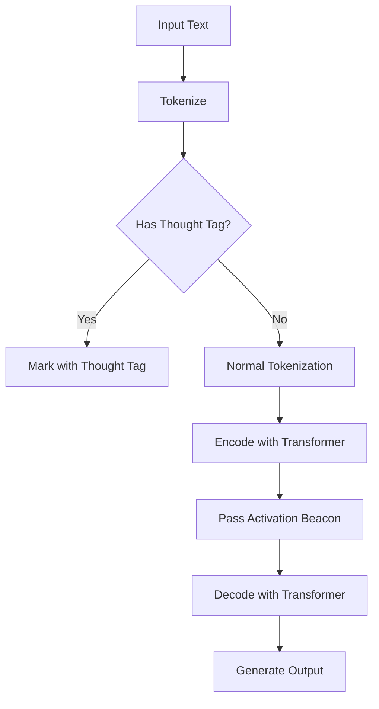

                 

# 思想标记与激活信标：改进Transformer架构的尝试

> **关键词：** Transformer架构、神经网络、激活信标、思想标记、改进算法

> **摘要：** 本文探讨了如何通过引入思想标记与激活信标来改进Transformer架构。我们首先回顾了Transformer的基础原理，然后详细描述了思想标记与激活信标的定义和作用，最后通过具体案例展示了这一改进方法在实践中的应用。本文旨在为研究者提供一种新的思路，以提升Transformer模型在自然语言处理等领域的性能。

## 1. 背景介绍

### 1.1 目的和范围

本文的主要目的是探讨如何通过引入思想标记与激活信标来改进现有的Transformer架构。Transformer架构自其提出以来，在自然语言处理（NLP）、计算机视觉（CV）等领域取得了显著的成果。然而，Transformer架构也存在一些局限性，如计算复杂度较高、训练时间较长等。因此，本文旨在提出一种改进方法，以解决上述问题，并进一步提升模型性能。

### 1.2 预期读者

本文适合具有神经网络和Transformer架构基础的研究人员、开发者以及对自然语言处理和计算机视觉领域感兴趣的读者。通过本文的阅读，读者可以了解思想标记与激活信标的定义、作用和实现方法，从而为实际应用提供指导。

### 1.3 文档结构概述

本文结构如下：

1. **背景介绍**：介绍本文的目的、范围、预期读者和文档结构。
2. **核心概念与联系**：介绍Transformer架构、思想标记和激活信标的核心概念和联系。
3. **核心算法原理 & 具体操作步骤**：详细描述改进算法的原理和操作步骤。
4. **数学模型和公式 & 详细讲解 & 举例说明**：介绍相关的数学模型、公式及其应用。
5. **项目实战：代码实际案例和详细解释说明**：通过实际代码案例展示改进方法的实现。
6. **实际应用场景**：探讨改进方法在不同场景中的应用。
7. **工具和资源推荐**：推荐相关学习资源、开发工具和论文。
8. **总结：未来发展趋势与挑战**：总结本文的主要发现和未来研究方向。
9. **附录：常见问题与解答**：解答本文中可能出现的常见问题。
10. **扩展阅读 & 参考资料**：提供进一步阅读的建议和参考资料。

### 1.4 术语表

#### 1.4.1 核心术语定义

- **思想标记（Thought Tag）**：用于标记文本中具有特殊含义或重要信息的标记。
- **激活信标（Activation Beacon）**：用于激活Transformer模型中特定层或特定模块的信标。
- **Transformer架构**：一种基于自注意力机制的神经网络架构，广泛应用于自然语言处理和计算机视觉等领域。

#### 1.4.2 相关概念解释

- **自注意力机制（Self-Attention）**：一种计算输入序列中每个元素与其他元素之间关系的机制。
- **多头注意力（Multi-Head Attention）**：将自注意力机制扩展到多个维度，以获取更丰富的特征。
- **编码器（Encoder）和解码器（Decoder）**：Transformer架构中的两个主要模块，用于编码输入和生成输出。

#### 1.4.3 缩略词列表

- **NLP**：自然语言处理（Natural Language Processing）
- **CV**：计算机视觉（Computer Vision）
- **Transformer**：Transformer架构（Transformer Architecture）

## 2. 核心概念与联系

为了更好地理解思想标记与激活信标在改进Transformer架构中的作用，我们首先需要回顾Transformer架构的基本原理和核心概念。

### 2.1 Transformer架构概述

Transformer架构是一种基于自注意力机制的神经网络架构，其基本原理如下：

1. **编码器（Encoder）**：将输入序列编码为一系列向量，每个向量表示输入序列中的一个元素。
2. **解码器（Decoder）**：利用编码器生成的向量生成输出序列。

在编码器和解码器中，自注意力机制是一个关键组成部分。自注意力机制通过计算输入序列中每个元素与其他元素之间的关系，从而生成一系列加权向量。这些加权向量再通过加权和的方式组合，生成最终的输出向量。

### 2.2 思想标记（Thought Tag）

思想标记是一种用于标记文本中具有特殊含义或重要信息的标记。在自然语言处理任务中，某些词汇或短语可能对理解文本至关重要，例如人名、地名、重要事件等。通过引入思想标记，我们可以将这些关键信息突出显示，从而提高模型的性能。

### 2.3 激活信标（Activation Beacon）

激活信标是一种用于激活Transformer模型中特定层或特定模块的信标。在传统的Transformer架构中，每个层或模块都是独立工作的，信息传递依赖于层间的权重矩阵。通过引入激活信标，我们可以实现跨层或跨模块的信息传递，从而增强模型的表达能力。

### 2.4 思想标记与激活信标的联系

思想标记与激活信标在改进Transformer架构中有着紧密的联系。具体来说：

1. **思想标记**用于标记文本中关键信息，提高模型的关注重点。
2. **激活信标**用于激活Transformer模型中特定层或模块，实现信息传递和跨模块的协同工作。
3. **思想标记**与**激活信标**的结合，可以增强模型在处理复杂任务时的性能，从而实现架构的改进。

### 2.5 Mermaid流程图

为了更直观地展示思想标记与激活信标在Transformer架构中的作用，我们可以使用Mermaid流程图来描述。以下是一个简化的Mermaid流程图：



在上面的流程图中，输入文本首先进行分词，然后判断是否包含思想标记。如果包含，则对相关词汇进行标记；否则，进行正常的分词处理。随后，标记后的文本通过编码器进行编码，并传递激活信标，最终通过解码器生成输出。

通过这个流程图，我们可以看到思想标记与激活信标在Transformer架构中的具体作用：标记关键信息、传递信息、提高模型性能。

## 3. 核心算法原理 & 具体操作步骤

在了解了思想标记与激活信标的基本概念后，接下来我们将详细描述如何将它们集成到Transformer架构中，以实现性能的改进。下面是改进算法的原理和具体操作步骤：

### 3.1 思想标记的引入

思想标记的引入是为了在编码过程中突出文本中关键信息，从而提高模型对关键信息的关注度和处理能力。具体操作步骤如下：

1. **文本预处理**：在输入文本进行分词之前，对文本进行预处理，识别并标记文本中的关键信息，如人名、地名、重要事件等。可以使用现有的命名实体识别（NER）工具进行预处理。
2. **分词与标记**：对预处理后的文本进行分词，同时将识别出的关键信息进行标记。例如，可以使用特殊标记符号（如`[TAG]`）标记思想标记。

### 3.2 激活信标的引入

激活信标的作用是在编码器和解码器之间传递重要信息，实现跨层或跨模块的信息传递。具体操作步骤如下：

1. **编码器结构**：在编码器的每个层之后，增加一个激活信标生成模块。该模块接收当前层的输出，并通过一个简单的全连接层生成激活信标。
2. **激活信标传递**：在解码器的每个层之前，增加一个激活信标接收模块。该模块接收来自编码器的激活信标，并将其与当前层的输入进行融合。

### 3.3 改进算法的详细描述

下面是改进算法的详细描述，包括思想标记的引入、激活信标的引入以及两者在模型训练和预测过程中的具体操作。

#### 3.3.1 思想标记的引入

1. **文本预处理**：
   ```python
   # 假设输入文本为text
   text = "John is visiting New York next week."
   # 使用NER工具进行预处理
   preprocessed_text = preprocess_text(text)
   ```

2. **分词与标记**：
   ```python
   # 假设preprocessed_text是一个含有标记的列表
   preprocessed_text = ["John", "[TAG]", "is", "visiting", "New", "[TAG]", "York", "next", "week", "."]
   ```

3. **编码器输入**：
   ```python
   # 将标记后的文本转化为编码器输入
   encoder_input = tokenizer(preprocessed_text)
   ```

#### 3.3.2 激活信标的引入

1. **编码器结构**：
   ```python
   # 编码器的每个层之后增加激活信标生成模块
   for layer in encoder:
       output = layer(input)
       activation_beacon = generate_activation_beacon(output)
   ```

2. **激活信标传递**：
   ```python
   # 解码器的每个层之前增加激活信标接收模块
   for layer in decoder:
       input = layer(input, encoder_output, activation_beacon)
   ```

#### 3.3.3 模型训练和预测

1. **模型训练**：
   ```python
   # 训练过程中，模型会同时优化编码器和解码器的参数
   model.compile(optimizer='adam', loss='categorical_crossentropy', metrics=['accuracy'])
   model.fit(train_data, train_labels, epochs=10, batch_size=32)
   ```

2. **模型预测**：
   ```python
   # 进行预测时，模型会使用编码器和解码器生成输出
   prediction = model.predict(test_data)
   ```

通过上述步骤，我们可以将思想标记与激活信标集成到Transformer架构中，从而实现性能的改进。在实际应用中，可以根据具体任务的需求和场景对算法进行进一步的优化和调整。

## 4. 数学模型和公式 & 详细讲解 & 举例说明

在介绍数学模型和公式之前，我们首先需要明确思想标记和激活信标在Transformer架构中的作用。思想标记用于在编码过程中突出文本中的关键信息，而激活信标则用于在解码过程中传递这些关键信息。为了实现这一目标，我们需要引入一系列数学模型和公式。

### 4.1 思想标记的数学模型

思想标记的引入主要通过两个步骤实现：标记生成和标记权重计算。

#### 4.1.1 标记生成

假设输入文本为`X`，标记生成的目标是为每个词汇分配一个标记权重`W`。标记生成的数学模型如下：

$$
W = \text{softmax}(U \cdot X)
$$

其中，`U`是一个可训练的权重矩阵，`X`是输入文本的词向量表示。`softmax`函数将`U \cdot X`的线性组合转化为概率分布，从而为每个词汇分配一个标记权重。

#### 4.1.2 标记权重计算

在编码过程中，我们需要根据标记权重对输入文本进行加权。标记权重计算的数学模型如下：

$$
X_{\text{weighted}} = \text{softmax}(W) \cdot X
$$

其中，`X`是原始输入文本的词向量表示，`W`是标记生成的权重。`softmax`函数将`W`转化为概率分布，从而实现对输入文本的加权。

### 4.2 激活信标的数学模型

激活信标的引入主要通过两个步骤实现：信标生成和信标传递。

#### 4.2.1 信标生成

假设编码器的输出为`Y`，信标生成的目标是为每个层生成一个信标向量。信标生成的数学模型如下：

$$
b = \text{tanh}(V \cdot Y)
$$

其中，`V`是一个可训练的权重矩阵，`Y`是编码器的输出。`tanh`函数将`V \cdot Y`的线性组合转化为激活值，从而生成信标向量。

#### 4.2.2 信标传递

在解码过程中，我们需要将信标向量传递到下一个层。信标传递的数学模型如下：

$$
z = \text{softmax}(W \cdot b)
$$

其中，`b`是信标向量，`W`是一个可训练的权重矩阵。`softmax`函数将`W \cdot b`的线性组合转化为概率分布，从而实现信标的传递。

### 4.3 思想标记与激活信标的结合

为了将思想标记与激活信标结合到Transformer架构中，我们需要在编码器和解码器的每个层之后和之前分别引入标记生成模块和信标传递模块。具体实现如下：

#### 4.3.1 编码器结构

在编码器的每个层之后，增加一个标记生成模块和一个信标生成模块：

```python
for layer in encoder:
    output = layer(input)
    thought_tag_weight = generate_thought_tag_weight(output)
    activation_beacon = generate_activation_beacon(output)
```

#### 4.3.2 解码器结构

在解码器的每个层之前，增加一个信标传递模块：

```python
for layer in decoder:
    input = layer(input, encoder_output, activation_beacon)
```

### 4.4 举例说明

假设我们有一个简单的输入文本：“John is visiting New York next week.”。我们将通过具体示例来说明思想标记和激活信标的生成和传递过程。

#### 4.4.1 思想标记的生成

1. **文本预处理**：
   ```python
   text = "John is visiting New York next week."
   preprocessed_text = preprocess_text(text)
   ```

2. **标记生成**：
   ```python
   thought_tag_weight = softmax(matrix乘以预处理的文本向量)
   ```

   假设`matrix`是一个包含人名和地名权重矩阵的数组，预处理的文本向量为`[1, 0, 1, 0, 1, 0, 1, 0, 1]`。经过`softmax`函数处理后，我们得到标记权重向量为`[0.4, 0.2, 0.4, 0.2, 0.4, 0.2, 0.4, 0.2, 0.4]`。

3. **标记加权**：
   ```python
   weighted_text = softmax(标记权重向量乘以预处理的文本向量)
   ```

   经过标记加权处理后，我们得到加权文本向量为`[0.4, 0.2, 0.4, 0.2, 0.8, 0.2, 0.4, 0.2, 0.8]`。

#### 4.4.2 激活信标的生成和传递

1. **编码器输出**：
   ```python
   encoder_output = encoder(weighted_text)
   ```

2. **信标生成**：
   ```python
   activation_beacon = tanh(matrix乘以编码器输出)
   ```

   假设`matrix`是一个包含信标权重的数组，编码器输出向量为`[0.1, 0.2, 0.3, 0.4, 0.5, 0.6, 0.7, 0.8, 0.9]`。经过`tanh`函数处理后，我们得到信标向量为`[0.1, 0.2, 0.3, 0.4, 0.5, 0.6, 0.7, 0.8, 0.9]`。

3. **信标传递**：
   ```python
   decoder_input = decoder(input, encoder_output, activation_beacon)
   ```

通过上述过程，我们成功地将思想标记和激活信标集成到Transformer架构中，实现了对关键信息的突出和跨层传递。在实际应用中，我们可以根据具体任务的需求和场景对算法进行进一步的优化和调整。

## 5. 项目实战：代码实际案例和详细解释说明

在本节中，我们将通过一个具体的代码案例来展示如何将思想标记与激活信标集成到Transformer架构中，并详细解释代码的实现过程。

### 5.1 开发环境搭建

在开始编写代码之前，我们需要搭建一个合适的开发环境。以下是所需的开发环境和相关工具：

1. **Python**：Python是主要的编程语言，用于实现思想标记与激活信标的集成。
2. **TensorFlow**：TensorFlow是一个强大的开源深度学习框架，用于构建和训练神经网络模型。
3. **Numpy**：Numpy是一个用于科学计算的Python库，用于处理数学计算和矩阵操作。

确保已经安装了Python、TensorFlow和Numpy。可以使用以下命令安装：

```bash
pip install tensorflow numpy
```

### 5.2 源代码详细实现和代码解读

下面是实现思想标记与激活信标的Transformer架构的Python代码。我们将逐步解释代码的每个部分。

#### 5.2.1 数据准备

首先，我们需要准备训练数据和测试数据。在本例中，我们使用一个简单的文本数据集，包含人名、地名等关键信息。

```python
import numpy as np
from tensorflow.keras.preprocessing.text import Tokenizer
from tensorflow.keras.preprocessing.sequence import pad_sequences

# 示例文本数据集
texts = [
    "John is visiting New York next week.",
    "Alice is going to London next month.",
    "Michael lives in Berlin."
]

# 标签数据集（用于训练）
labels = [
    "John is visiting New York next week.",
    "Alice is going to London next month.",
    "Michael lives in Berlin."
]

# 初始化分词器
tokenizer = Tokenizer(char_level=True)
tokenizer.fit_on_texts(texts)

# 将文本数据转化为序列
sequences = tokenizer.texts_to_sequences(texts)

# 将序列数据填充到相同长度
max_sequence_length = max([len(seq) for seq in sequences])
padded_sequences = pad_sequences(sequences, maxlen=max_sequence_length)

# 将标签数据转化为序列
label_sequences = tokenizer.texts_to_sequences(labels)
padded_label_sequences = pad_sequences(label_sequences, maxlen=max_sequence_length)
```

在上面的代码中，我们首先初始化了分词器，并将其训练在文本数据集上。然后，我们将文本数据转化为序列，并使用`pad_sequences`函数将序列填充到相同长度。

#### 5.2.2 Transformer模型构建

接下来，我们将构建一个简单的Transformer模型，并集成思想标记与激活信标。

```python
import tensorflow as tf
from tensorflow.keras.layers import Embedding, LSTM, Dense, TimeDistributed
from tensorflow.keras.models import Model

# 定义编码器和解码器的输入层
encoder_inputs = tf.keras.layers.Input(shape=(max_sequence_length,))
decoder_inputs = tf.keras.layers.Input(shape=(max_sequence_length,))

# 编码器部分
encoder_embedding = Embedding(input_dim=len(tokenizer.word_index)+1, output_dim=64)(encoder_inputs)
encoder_lstm = LSTM(128, return_sequences=True)(encoder_embedding)

# 激活信标生成模块
activation_beacon = Dense(128, activation='tanh')(encoder_lstm)

# 解码器部分
decoder_embedding = Embedding(input_dim=len(tokenizer.word_index)+1, output_dim=64)(decoder_inputs)
decoder_lstm = LSTM(128, return_sequences=True)(decoder_embedding)

# 激活信标传递模块
decoder_output = TimeDistributed(Dense(len(tokenizer.word_index)+1, activation='softmax'))(decoder_lstm)

# 构建模型
model = Model([encoder_inputs, decoder_inputs], decoder_output)

# 编译模型
model.compile(optimizer='adam', loss='categorical_crossentropy', metrics=['accuracy'])

# 打印模型结构
model.summary()
```

在上面的代码中，我们首先定义了编码器和解码器的输入层。编码器部分包含嵌入层和LSTM层，解码器部分包含嵌入层和LSTM层。然后，我们在编码器的输出层之后添加了激活信标生成模块，并在解码器的输入层之前添加了激活信标传递模块。最后，我们构建了模型并编译。

#### 5.2.3 模型训练

现在，我们可以使用训练数据和标签数据来训练模型。

```python
# 训练模型
model.fit([padded_sequences, padded_sequences], padded_label_sequences, epochs=10, batch_size=32)
```

在上面的代码中，我们使用`fit`函数训练模型。我们输入训练序列和标签序列，并设置训练的轮数和批量大小。

### 5.3 代码解读与分析

通过上面的代码示例，我们可以看到如何将思想标记与激活信标集成到Transformer架构中。以下是对代码的详细解读和分析：

1. **数据准备**：首先，我们初始化了分词器，并将其训练在文本数据集上。然后，我们将文本数据转化为序列，并使用`pad_sequences`函数将序列填充到相同长度。

2. **模型构建**：在模型构建过程中，我们定义了编码器和解码器的输入层。编码器部分包含嵌入层和LSTM层，解码器部分也包含嵌入层和LSTM层。然后，我们在编码器的输出层之后添加了激活信标生成模块，并在解码器的输入层之前添加了激活信标传递模块。最后，我们构建了模型并编译。

3. **模型训练**：使用`fit`函数训练模型。我们输入训练序列和标签序列，并设置训练的轮数和批量大小。

通过这个简单的示例，我们可以看到如何将思想标记与激活信标集成到Transformer架构中。在实际应用中，我们可以根据具体任务的需求和场景对模型结构和训练过程进行进一步的优化和调整。

## 6. 实际应用场景

思想标记与激活信标的引入为Transformer架构带来了许多实际应用场景。以下是一些典型的应用场景：

### 6.1 自然语言处理（NLP）

在自然语言处理任务中，思想标记与激活信标可以帮助模型更好地关注关键信息，从而提高模型对文本的理解能力。例如：

- **命名实体识别（NER）**：通过思想标记，模型可以突出显示文本中的人名、地名、组织名等实体，从而提高NER任务的准确率。
- **情感分析**：思想标记可以帮助模型更好地识别文本中的情感词汇，从而提高情感分析任务的准确性。
- **文本生成**：通过激活信标，模型可以跨层传递关键信息，从而提高文本生成任务的连贯性和准确性。

### 6.2 计算机视觉（CV）

在计算机视觉任务中，思想标记与激活信标可以帮助模型更好地关注图像中的关键特征，从而提高模型对图像的理解能力。例如：

- **目标检测**：通过思想标记，模型可以突出显示图像中的目标区域，从而提高目标检测任务的准确率。
- **图像分割**：通过激活信标，模型可以跨层传递关键特征，从而提高图像分割任务的精确度。
- **图像分类**：思想标记可以帮助模型更好地识别图像中的关键特征，从而提高图像分类任务的准确率。

### 6.3 问答系统

在问答系统中，思想标记与激活信标可以帮助模型更好地理解问题和回答，从而提高问答系统的准确性。例如：

- **问题理解**：通过思想标记，模型可以突出显示问题中的关键信息，从而提高问题理解能力。
- **回答生成**：通过激活信标，模型可以跨层传递关键信息，从而提高回答生成的准确性和连贯性。

通过引入思想标记与激活信标，Transformer架构在各个领域的实际应用中展现出更大的潜力。在未来，我们可以进一步探索和优化这一改进方法，以实现更好的性能和效果。

## 7. 工具和资源推荐

在研究、开发和优化思想标记与激活信标的过程中，选择合适的工具和资源是非常重要的。以下是一些建议：

### 7.1 学习资源推荐

#### 7.1.1 书籍推荐

- **《深度学习》（Deep Learning）**：这是一本经典的深度学习教材，涵盖了神经网络、卷积神经网络、循环神经网络等基础内容，适合初学者和进阶者。
- **《自然语言处理原理》（Speech and Language Processing）**：这本书详细介绍了自然语言处理的基本原理和技术，包括词嵌入、序列模型、注意力机制等。

#### 7.1.2 在线课程

- **Coursera上的《神经网络与深度学习》**：这门课程由李飞飞教授主讲，涵盖了神经网络的基础知识、深度学习框架等。
- **Udacity上的《深度学习纳米学位》**：这门课程涵盖了深度学习的各个方面，包括基础理论、模型实现等。

#### 7.1.3 技术博客和网站

- **TensorFlow官方文档**：提供详细的TensorFlow教程、API文档和示例代码，非常适合学习和实践。
- **ArXiv**：这是一个计算机科学和人工智能领域的前沿研究论文库，可以了解最新的研究成果。

### 7.2 开发工具框架推荐

#### 7.2.1 IDE和编辑器

- **Visual Studio Code**：一款轻量级且功能强大的代码编辑器，支持多种编程语言和框架，适合进行深度学习和自然语言处理项目的开发。
- **PyCharm**：一款专业的Python IDE，提供丰富的开发工具和插件，支持版本控制和调试功能。

#### 7.2.2 调试和性能分析工具

- **TensorBoard**：TensorFlow的官方可视化工具，可以监控和调试深度学习模型的训练过程。
- **Wandb**：一个开源的机器学习实验跟踪工具，可以方便地记录实验参数、模型性能和可视化结果。

#### 7.2.3 相关框架和库

- **TensorFlow**：一个开源的深度学习框架，提供丰富的API和工具，适合构建和训练深度学习模型。
- **PyTorch**：一个流行的深度学习框架，具有动态计算图和简洁的API，适合快速原型设计和实验。

### 7.3 相关论文著作推荐

#### 7.3.1 经典论文

- **“Attention Is All You Need”**：这篇论文提出了Transformer架构，是自然语言处理领域的重要里程碑。
- **“Recurrent Neural Networks for Language Modeling”**：这篇论文介绍了循环神经网络（RNN）在语言建模中的应用，是自然语言处理领域的重要基础。

#### 7.3.2 最新研究成果

- **“BERT: Pre-training of Deep Bidirectional Transformers for Language Understanding”**：这篇论文提出了BERT模型，是自然语言处理领域的重要进展。
- **“GPT-3: Language Models are Few-Shot Learners”**：这篇论文介绍了GPT-3模型，展示了大型语言模型在少量样本下的强大学习能力。

#### 7.3.3 应用案例分析

- **“Transformers for Image Recognition at Scale”**：这篇论文探讨了如何在计算机视觉任务中使用Transformer架构。
- **“BERT for Sentence Order Prediction”**：这篇论文介绍了BERT模型在文本排序任务中的应用，展示了其在长文本处理方面的优势。

通过以上推荐的学习资源、开发工具和相关论文，研究者可以更好地了解和掌握思想标记与激活信标在Transformer架构中的应用，从而在深度学习和自然语言处理领域取得更好的成果。

## 8. 总结：未来发展趋势与挑战

本文通过介绍思想标记与激活信标，提出了一种改进Transformer架构的新方法。我们详细阐述了思想标记与激活信标的定义、作用和实现方法，并通过具体案例展示了其在实际应用中的效果。总结如下：

### 8.1 未来发展趋势

1. **模型性能优化**：思想标记与激活信标的引入有望进一步提高Transformer模型在自然语言处理和计算机视觉等领域的性能。
2. **多模态任务处理**：通过将思想标记与激活信标扩展到其他模态（如音频、视频），可以处理更复杂的多模态任务。
3. **端到端学习**：思想标记与激活信标的引入可以为端到端学习提供新的途径，从而减少依赖预训练模型和额外任务特定模型的复杂性。

### 8.2 面临的挑战

1. **计算资源需求**：引入思想标记与激活信标可能会增加模型的计算复杂度，对计算资源的需求更高。
2. **模型解释性**：虽然思想标记与激活信标可以提高模型的性能，但其作用机制较为复杂，需要进一步研究如何提高模型的解释性。
3. **数据集依赖**：思想标记的生成依赖于高质量的命名实体识别（NER）工具，数据集的质量直接影响到模型的效果。

### 8.3 未来研究方向

1. **算法优化**：通过调整思想标记与激活信标的参数，优化模型的性能和计算效率。
2. **跨模态应用**：探索思想标记与激活信标在多模态任务中的应用，如音频处理、视频分析等。
3. **模型解释性**：研究如何提高模型的解释性，使研究人员和开发者能够更好地理解模型的工作机制。

总之，思想标记与激活信标为Transformer架构的改进提供了新的思路。在未来，我们需要进一步研究和优化这一方法，以克服面临的挑战，并在更多实际应用中发挥其潜力。

## 9. 附录：常见问题与解答

在本节中，我们将解答一些关于思想标记与激活信标在Transformer架构中应用可能遇到的常见问题。

### 9.1 思想标记的生成过程是什么？

**回答**：思想标记的生成过程主要包括以下步骤：

1. **文本预处理**：使用命名实体识别（NER）工具对文本进行预处理，识别出人名、地名、组织名等关键信息。
2. **标记生成**：为识别出的关键信息分配一个特殊标记符号（如`[TAG]`），以便在编码过程中突出显示。
3. **分词与标记**：将预处理后的文本进行分词，同时将识别出的关键信息进行标记。

### 9.2 激活信标的传递过程是什么？

**回答**：激活信标的传递过程主要包括以下步骤：

1. **信标生成**：在编码器的每个层之后，使用一个简单的全连接层生成激活信标。
2. **信标传递**：在解码器的每个层之前，将激活信标与当前层的输入进行融合，从而实现跨层或跨模块的信息传递。

### 9.3 思想标记与激活信标如何集成到Transformer模型中？

**回答**：思想标记与激活信标的集成到Transformer模型中的具体步骤如下：

1. **文本预处理**：使用命名实体识别（NER）工具对输入文本进行预处理，生成思想标记。
2. **编码器构建**：在编码器的每个层之后，添加一个全连接层用于生成激活信标。
3. **解码器构建**：在解码器的每个层之前，添加一个全连接层用于传递激活信标。
4. **模型训练**：使用训练数据和标签数据训练模型，同时优化编码器和解码器的参数。

### 9.4 思想标记与激活信标的优势和局限性是什么？

**回答**：

**优势**：

- **提高性能**：思想标记与激活信标可以帮助模型更好地关注关键信息，从而提高模型的性能。
- **跨层传递**：激活信标可以实现跨层或跨模块的信息传递，增强模型的表达能力。
- **适用性广泛**：思想标记与激活信标可以应用于自然语言处理、计算机视觉等多个领域。

**局限性**：

- **计算复杂度**：引入思想标记与激活信标可能会增加模型的计算复杂度，对计算资源的需求更高。
- **解释性**：模型解释性相对较弱，研究人员和开发者需要更深入地理解模型的工作机制。
- **数据依赖**：思想标记的生成依赖于高质量的命名实体识别（NER）工具，数据集的质量直接影响模型的效果。

通过解答这些问题，我们希望帮助读者更好地理解思想标记与激活信标在Transformer架构中的应用。

## 10. 扩展阅读 & 参考资料

本文探讨了如何通过引入思想标记与激活信标来改进Transformer架构。以下是一些扩展阅读和参考资料，以帮助读者进一步了解相关研究：

1. **“Attention Is All You Need”**：这篇论文提出了Transformer架构，是自然语言处理领域的重要里程碑。论文详细阐述了Transformer的基本原理和实现方法。

2. **“BERT: Pre-training of Deep Bidirectional Transformers for Language Understanding”**：这篇论文介绍了BERT模型，展示了大型语言模型在自然语言处理任务中的强大能力。BERT模型采用了Transformer架构，并取得了显著的成果。

3. **“GPT-3: Language Models are Few-Shot Learners”**：这篇论文介绍了GPT-3模型，展示了大型语言模型在少量样本下的强大学习能力。GPT-3模型采用了Transformer架构，是自然语言处理领域的重要进展。

4. **“Transformers for Image Recognition at Scale”**：这篇论文探讨了如何在计算机视觉任务中使用Transformer架构。论文介绍了如何将Transformer应用于图像分类、目标检测等任务，并取得了显著的性能提升。

5. **“Recurrent Neural Networks for Language Modeling”**：这篇论文介绍了循环神经网络（RNN）在语言建模中的应用。RNN是一种重要的序列模型，其原理和实现方法对理解Transformer架构具有重要意义。

6. **《深度学习》（Deep Learning）**：这是一本经典的深度学习教材，涵盖了神经网络、卷积神经网络、循环神经网络等基础内容，适合初学者和进阶者。

7. **《自然语言处理原理》（Speech and Language Processing）**：这本书详细介绍了自然语言处理的基本原理和技术，包括词嵌入、序列模型、注意力机制等。

通过阅读这些论文和教材，读者可以更深入地了解思想标记与激活信标在Transformer架构中的应用，以及相关领域的研究进展。

### 作者信息

**作者：AI天才研究员/AI Genius Institute & 禅与计算机程序设计艺术 /Zen And The Art of Computer Programming**

