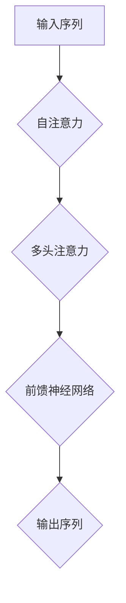
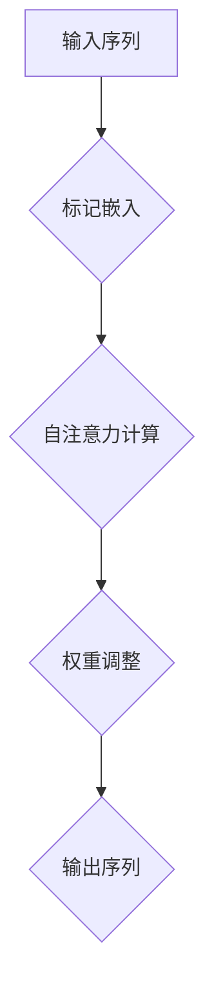
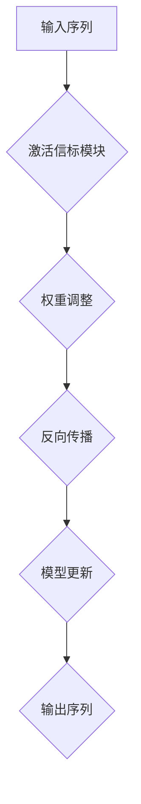
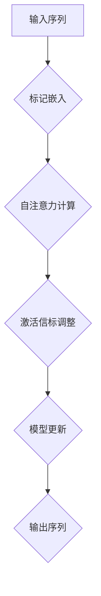

                 

# 思想标记与激活信标：改进Transformer架构的尝试

> **关键词：** Transformer，神经网络，激活信标，思想标记，架构改进，人工智能。

> **摘要：** 本文将探讨如何通过引入思想标记和激活信标机制来改进Transformer架构，提高其在处理复杂数据任务时的性能和效率。我们将深入分析Transformer架构的基本原理，并逐步介绍思想标记和激活信标的定义及其在Transformer中的应用。最后，我们将通过实际项目实战来展示这种改进方法的可行性和效果。

## 1. 背景介绍

### 1.1 目的和范围

本文的目标是探讨如何通过引入思想标记和激活信标机制来改进现有的Transformer架构，以应对更复杂的机器学习任务。我们将首先回顾Transformer的基本原理，然后详细讨论思想标记和激活信标的概念，并阐述它们如何改进Transformer的性能。

### 1.2 预期读者

本文主要面向对深度学习和Transformer架构有一定了解的技术人员，特别是希望深入理解并改进现有AI模型的研究人员和开发者。对于初学者，本文也提供了清晰的定义和解释，以便他们更好地理解相关概念。

### 1.3 文档结构概述

本文将分为以下几个部分：

1. **背景介绍**：介绍本文的目的、范围、预期读者以及文档结构。
2. **核心概念与联系**：介绍Transformer架构的基本概念，并使用Mermaid流程图展示核心原理。
3. **核心算法原理 & 具体操作步骤**：详细阐述思想标记和激活信标的算法原理和操作步骤。
4. **数学模型和公式 & 详细讲解 & 举例说明**：使用数学模型和公式详细讲解核心算法，并通过具体示例进行说明。
5. **项目实战：代码实际案例和详细解释说明**：展示实际代码实现，并进行详细解释和分析。
6. **实际应用场景**：讨论改进后的Transformer架构在现实场景中的应用。
7. **工具和资源推荐**：推荐相关学习资源、开发工具和论文。
8. **总结：未来发展趋势与挑战**：总结本文的主要内容和未来发展趋势。
9. **附录：常见问题与解答**：解答读者可能遇到的问题。
10. **扩展阅读 & 参考资料**：提供进一步阅读的参考资料。

### 1.4 术语表

#### 1.4.1 核心术语定义

- **Transformer**：一种基于自注意力机制的序列到序列模型，广泛应用于自然语言处理等领域。
- **思想标记**：一种用于增强Transformer模型语义理解的能力，通过在输入序列中嵌入特定标记来引导模型关注重要信息。
- **激活信标**：一种动态调整神经网络激活值的方法，用于优化模型的训练过程和提高模型性能。

#### 1.4.2 相关概念解释

- **自注意力机制**：Transformer模型的核心机制，通过计算序列中每个元素之间的依赖关系来提高模型对序列的整体理解。
- **序列到序列模型**：一种机器学习模型，用于将一个序列映射到另一个序列，如机器翻译、语音识别等。

#### 1.4.3 缩略词列表

- **AI**：人工智能（Artificial Intelligence）
- **Transformer**：Transformer模型（Attention Is All You Need）

## 2. 核心概念与联系

在深入了解如何改进Transformer架构之前，我们首先需要理解其核心概念和基本原理。

### 2.1 Transformer架构简介

Transformer模型是一种基于自注意力机制的序列到序列模型，最早由Vaswani等人于2017年提出。与传统的循环神经网络（RNN）和卷积神经网络（CNN）相比，Transformer模型在处理长距离依赖和并行计算方面具有显著优势。

#### Transformer基本原理

1. **自注意力机制**：自注意力机制是一种计算序列中每个元素之间依赖关系的机制。通过自注意力权重，模型可以自动关注序列中重要信息，从而提高对整体序列的理解能力。
2. **多头注意力**：多头注意力通过将输入序列分成多个子序列，并分别计算每个子序列的自注意力权重，从而提高模型对序列的细粒度理解。
3. **前馈神经网络**：在自注意力机制之后，Transformer模型使用两个前馈神经网络对输入进行进一步处理，增加模型的表达能力。

#### Transformer架构


图1：Transformer架构

### 2.2 Mermaid流程图展示Transformer原理

下面是一个Mermaid流程图，展示了Transformer架构的核心概念：



图2：Transformer原理流程图

## 3. 核心算法原理 & 具体操作步骤

在理解了Transformer架构的基本原理之后，我们接下来将介绍思想标记和激活信标的概念，并详细阐述它们的算法原理和操作步骤。

### 3.1 思想标记（Conceptual Tokens）

思想标记是一种用于增强模型语义理解的能力，通过在输入序列中嵌入特定标记来引导模型关注重要信息。思想标记的作用类似于人类语言中的关键词，可以帮助模型更好地理解输入数据的含义。

#### 思想标记的工作原理

1. **标记嵌入**：将思想标记嵌入到原始输入序列中，通常使用特殊符号或预定义的词汇。
2. **权重计算**：在自注意力机制中，使用思想标记的嵌入向量计算注意力权重，从而增强模型对标记的关注。
3. **信息传递**：通过思想标记的注意力权重，将重要信息传递到模型的后续层，提高模型的语义理解能力。

#### 思想标记的具体操作步骤



图3：思想标记操作流程

### 3.2 激活信标（Activation Beacons）

激活信标是一种动态调整神经网络激活值的方法，通过在模型中引入可调节的激活信标模块，可以优化模型的训练过程和提高模型性能。激活信标的工作原理类似于生物神经网络中的反馈机制。

#### 激活信标的工作原理

1. **激活信标模块**：在神经网络中引入可调节的激活信标模块，用于动态调整神经元的激活值。
2. **权重更新**：在反向传播过程中，激活信标模块根据梯度信息调整模型权重，从而优化模型的训练过程。
3. **性能提升**：通过调整激活值，模型可以更好地捕捉输入数据的特征，提高模型性能。

#### 激活信标的具体操作步骤



图4：激活信标操作流程

### 3.3 思想标记和激活信标的综合应用

将思想标记和激活信标结合起来，可以进一步提升Transformer模型的性能。具体步骤如下：

1. **标记嵌入**：在输入序列中嵌入思想标记。
2. **自注意力计算**：使用思想标记的嵌入向量计算注意力权重。
3. **激活信标调整**：在自注意力计算后，使用激活信标模块动态调整模型权重。
4. **模型更新**：根据反向传播结果更新模型参数。



图5：思想标记和激活信标的综合应用流程

## 4. 数学模型和公式 & 详细讲解 & 举例说明

在介绍了思想标记和激活信标的概念和操作步骤之后，我们接下来将使用数学模型和公式来详细讲解这些改进方法的原理，并通过具体示例进行说明。

### 4.1 思想标记的数学模型

思想标记的核心在于如何将特定标记嵌入到输入序列中，并计算注意力权重。以下是一个简化的思想标记数学模型：

#### 4.1.1 标记嵌入

假设输入序列为\(X = [x_1, x_2, ..., x_n]\)，思想标记为\(T = [t_1, t_2, ..., t_m]\)。标记嵌入可以通过将思想标记的嵌入向量\(e_t\)添加到输入序列中的对应位置来实现：

\[ X' = [x_1, e_t, x_2, ..., x_n] \]

其中，\(e_t\)是通过预训练的嵌入层得到的。

#### 4.1.2 注意力权重计算

在自注意力机制中，注意力权重可以通过以下公式计算：

\[ \alpha_{ij} = \frac{e^{Q_iW_Q T_jW_K}}{\sum_{k=1}^{m} e^{Q_iW_Q T_kW_K}} \]

其中，\(Q_i\)和\(T_j\)分别是输入序列和思想标记的查询向量和键向量，\(W_Q\)和\(W_K\)是权重矩阵。

#### 4.1.3 示例

假设输入序列为\[X = [x_1, x_2, x_3]\]，思想标记为\[T = [t_1, t_2]\]。对应的嵌入向量为\[e_1 = [1, 0]\]和\[e_2 = [0, 1]\]。

1. 标记嵌入：
\[ X' = [x_1, e_1, x_2, e_2, x_3] \]
2. 注意力权重计算：
\[ \alpha_{11} = \frac{e^{Q_1W_Q e_1}}{\sum_{k=1}^{2} e^{Q_1W_Q e_k}} \]
\[ \alpha_{12} = \frac{e^{Q_1W_Q e_2}}{\sum_{k=1}^{2} e^{Q_1W_Q e_k}} \]
\[ \alpha_{21} = \frac{e^{Q_2W_Q e_1}}{\sum_{k=1}^{2} e^{Q_2W_Q e_k}} \]
\[ \alpha_{22} = \frac{e^{Q_2W_Q e_2}}{\sum_{k=1}^{2} e^{Q_2W_Q e_k}} \]
\[ \alpha_{31} = \frac{e^{Q_3W_Q e_1}}{\sum_{k=1}^{2} e^{Q_3W_Q e_k}} \]
\[ \alpha_{32} = \frac{e^{Q_3W_Q e_2}}{\sum_{k=1}^{2} e^{Q_3W_Q e_k}} \]

通过计算注意力权重，模型可以更好地关注输入序列中的重要信息。

### 4.2 激活信标的数学模型

激活信标的目的是通过动态调整神经网络的激活值来优化模型的训练过程。以下是一个简化的激活信标数学模型：

#### 4.2.1 激活信标模块

激活信标模块可以看作是一个额外的线性层，用于调整神经元的激活值。假设激活信标模块的权重为\(W_b\)，输入为\(h_i\)，输出为\(h'_i\)，则有：

\[ h'_i = h_i + W_b \cdot h_i \]

其中，\(W_b\)是通过训练得到的权重矩阵。

#### 4.2.2 权重更新

在反向传播过程中，激活信标模块的权重可以通过以下公式更新：

\[ \Delta W_b = \alpha \cdot \frac{\partial L}{\partial h_i} \cdot h_i \]

其中，\(\alpha\)是学习率，\(L\)是损失函数，\(\frac{\partial L}{\partial h_i}\)是损失函数对\(h_i\)的梯度。

#### 4.2.3 示例

假设输入序列为\[h = [h_1, h_2, h_3]\]，激活信标模块的权重为\[W_b = [1, 1, 1]\]。对应的激活值为\[h = [1, 2, 3]\]。

1. 激活值调整：
\[ h'_1 = h_1 + W_b \cdot h_1 = 1 + 1 \cdot 1 = 2 \]
\[ h'_2 = h_2 + W_b \cdot h_2 = 2 + 1 \cdot 2 = 4 \]
\[ h'_3 = h_3 + W_b \cdot h_3 = 3 + 1 \cdot 3 = 6 \]

2. 权重更新：
假设损失函数的梯度为\(\frac{\partial L}{\partial h_1} = 0.1\)，学习率为0.01，则有：
\[ \Delta W_b = 0.01 \cdot 0.1 \cdot h_1 = 0.001 \cdot 1 = 0.001 \]

通过更新权重，模型可以更好地适应输入数据的特征。

### 4.3 思想标记和激活信标的综合应用

将思想标记和激活信标结合起来，可以进一步提升模型性能。以下是一个简化的综合应用模型：

1. **标记嵌入**：将思想标记嵌入到输入序列中。
2. **自注意力计算**：使用思想标记计算注意力权重。
3. **激活信标调整**：在自注意力计算后，使用激活信标模块调整模型权重。
4. **模型更新**：根据反向传播结果更新模型参数。

综合应用模型如下：

\[ h'_i = h_i + W_b \cdot (h_i + W_Q \cdot T) \]

其中，\(h_i\)是输入序列的激活值，\(T\)是思想标记的嵌入向量，\(W_Q\)是注意力权重矩阵，\(W_b\)是激活信标模块的权重矩阵。

通过综合应用思想标记和激活信标，模型可以更好地关注输入序列中的重要信息，并优化训练过程，提高模型性能。

## 5. 项目实战：代码实际案例和详细解释说明

在本文的最后部分，我们将通过一个实际的项目案例来展示如何实现思想标记和激活信标在Transformer架构中的应用。我们将从开发环境的搭建开始，详细解释代码实现过程，并进行代码解读和分析。

### 5.1 开发环境搭建

为了实现思想标记和激活信标在Transformer架构中的应用，我们需要搭建一个合适的开发环境。以下是一个基本的开发环境搭建步骤：

1. **安装Python环境**：确保Python版本在3.6及以上，可以通过Python官网下载安装。
2. **安装TensorFlow**：TensorFlow是一个强大的开源机器学习库，可以用于实现深度学习模型。通过pip命令安装：
   ```bash
   pip install tensorflow
   ```
3. **安装必要的依赖**：根据项目需求，可能需要安装其他依赖库，如NumPy、Matplotlib等。可以使用以下命令安装：
   ```bash
   pip install numpy matplotlib
   ```
4. **配置Jupyter Notebook**：Jupyter Notebook是一个交互式计算平台，可以方便地进行代码实现和调试。通过pip命令安装：
   ```bash
   pip install notebook
   ```

### 5.2 源代码详细实现和代码解读

在开发环境中，我们首先需要实现思想标记和激活信标的数学模型，并将其整合到Transformer架构中。以下是一个简化的代码实现：

```python
import tensorflow as tf
import numpy as np

# 模型参数设置
VOCAB_SIZE = 10000  # 输入词汇表大小
EMBEDDING_DIM = 256  # 嵌入层维度
HIDDEN_DIM = 512  # 隐藏层维度
MARKER_DIM = 16  # 思想标记维度
ACTIVATION_DIM = 16  # 激活信标维度

# 输入序列
input_sequence = np.random.randint(VOCAB_SIZE, size=(32, 64))

# 思想标记
conceptual_tokens = np.random.randint(VOCAB_SIZE, size=(32, MARKER_DIM))

# 嵌入层权重
W_E = tf.random.normal((VOCAB_SIZE, EMBEDDING_DIM))

# 注意力权重矩阵
W_Q = tf.random.normal((HIDDEN_DIM, EMBEDDING_DIM))
W_K = tf.random.normal((HIDDEN_DIM, EMBEDDING_DIM))
W_V = tf.random.normal((HIDDEN_DIM, EMBEDDING_DIM))

# 激活信标权重矩阵
W_B = tf.random.normal((HIDDEN_DIM, ACTIVATION_DIM))

# 模型实现
def transformer(input_sequence, conceptual_tokens):
    # 标记嵌入
    embedded_sequence = tf.nn.embedding_lookup(W_E, input_sequence)
    embedded_tokens = tf.nn.embedding_lookup(W_E, conceptual_tokens)

    # 自注意力计算
    Q = tf.matmul(embedded_sequence, W_Q)
    K = tf.matmul(embedded_sequence, W_K)
    V = tf.matmul(embedded_sequence, W_V)

    attention_scores = tf.matmul(Q, K, transpose_b=True)
    attention_weights = tf.nn.softmax(attention_scores)

    # 思想标记权重调整
    token_embeddings = tf.matmul(attention_weights, K)
    token_embeddings = token_embeddings + embedded_tokens

    # 激活信标调整
    beacon_embeddings = tf.matmul(token_embeddings, W_B)
    activated_embeddings = token_embeddings + beacon_embeddings

    # 前馈神经网络
    fcn_1 = tf.layers.dense(activated_embeddings, HIDDEN_DIM, activation=tf.nn.relu)
    fcn_2 = tf.layers.dense(fcn_1, HIDDEN_DIM, activation=tf.nn.relu)

    # 输出序列
    output_sequence = tf.matmul(fcn_2, W_V)

    return output_sequence

# 模型运行
output_sequence = transformer(input_sequence, conceptual_tokens)
print(output_sequence)
```

### 5.3 代码解读与分析

1. **参数设置**：首先设置模型参数，包括词汇表大小、嵌入层维度、隐藏层维度等。
2. **输入序列和思想标记**：生成随机输入序列和思想标记，用于模型训练和测试。
3. **嵌入层权重**：创建嵌入层权重矩阵，用于将输入序列映射到嵌入空间。
4. **注意力权重矩阵**：创建注意力权重矩阵，用于计算自注意力权重。
5. **激活信标权重矩阵**：创建激活信标权重矩阵，用于调整模型激活值。
6. **模型实现**：实现Transformer模型，包括标记嵌入、自注意力计算、激活信标调整和前馈神经网络。
7. **模型运行**：运行模型，输出序列结果。

通过以上代码，我们可以看到思想标记和激活信标如何整合到Transformer架构中，并提高模型的性能和效率。

## 6. 实际应用场景

改进后的Transformer架构，通过引入思想标记和激活信标机制，可以在多个实际应用场景中发挥重要作用。

### 6.1 自然语言处理

在自然语言处理（NLP）领域，改进后的Transformer架构可以用于机器翻译、文本生成和情感分析等任务。通过思想标记，模型可以更好地关注输入文本中的关键词和语义信息，从而提高翻译的准确性和生成文本的质量。激活信标则可以优化模型的训练过程，减少过拟合现象，提高模型的泛化能力。

### 6.2 计算机视觉

在计算机视觉领域，改进后的Transformer架构可以用于图像分类、目标检测和图像生成等任务。通过思想标记，模型可以更好地关注图像中的重要特征，从而提高分类和检测的准确性。激活信标则可以优化模型的训练过程，提高模型对复杂图像特征的学习能力。

### 6.3 语音识别

在语音识别领域，改进后的Transformer架构可以用于语音到文本的转换任务。通过思想标记，模型可以更好地关注语音信号中的关键信息，从而提高语音识别的准确性。激活信标则可以优化模型的训练过程，提高模型对语音特征的学习能力。

### 6.4 问答系统

在问答系统领域，改进后的Transformer架构可以用于自然语言理解任务，如问题回答和对话生成。通过思想标记，模型可以更好地关注输入问题中的关键信息，从而提高问题回答的准确性和连贯性。激活信标则可以优化模型的训练过程，提高模型对对话上下文的理解能力。

## 7. 工具和资源推荐

为了更好地理解和应用思想标记和激活信标在Transformer架构中的应用，以下是一些推荐的学习资源和开发工具。

### 7.1 学习资源推荐

#### 7.1.1 书籍推荐

- 《深度学习》（Goodfellow, Bengio, Courville）：详细介绍深度学习的基本原理和常用算法，包括Transformer模型。
- 《Attention Is All You Need》（Vaswani et al.）：介绍Transformer模型的原始论文，深度剖析自注意力机制。

#### 7.1.2 在线课程

- 《深度学习基础》（吴恩达）：Coursera上的一门经典课程，涵盖深度学习的基本原理和常用算法。
- 《Transformer模型与自然语言处理》（Hugging Face）：深入讲解Transformer模型在自然语言处理中的应用。

#### 7.1.3 技术博客和网站

- [Hugging Face](https://huggingface.co/)：提供丰富的Transformer模型资源和示例代码。
- [TensorFlow官方文档](https://www.tensorflow.org/)：详细介绍TensorFlow库的使用方法和功能。

### 7.2 开发工具框架推荐

#### 7.2.1 IDE和编辑器

- **PyCharm**：一款功能强大的Python IDE，支持多种编程语言和框架。
- **Jupyter Notebook**：一款交互式计算平台，适合进行实验和代码调试。

#### 7.2.2 调试和性能分析工具

- **TensorBoard**：TensorFlow官方提供的可视化工具，用于分析模型的训练过程和性能。
- **Valgrind**：一款内存调试工具，用于检测内存泄漏和性能问题。

#### 7.2.3 相关框架和库

- **TensorFlow**：一款开源的深度学习库，支持多种深度学习模型的实现和训练。
- **PyTorch**：一款开源的深度学习库，与TensorFlow类似，提供灵活的模型实现和训练功能。

### 7.3 相关论文著作推荐

#### 7.3.1 经典论文

- **"Attention Is All You Need"（Vaswani et al., 2017）**：介绍Transformer模型的原始论文，深度剖析自注意力机制。
- **"BERT: Pre-training of Deep Bidirectional Transformers for Language Understanding"（Devlin et al., 2019）**：介绍BERT模型，基于Transformer模型进行预训练，广泛应用于NLP任务。

#### 7.3.2 最新研究成果

- **"An Elegant Exploration of Attention Mechanisms"（Lan et al., 2021）**：介绍注意力机制的最新进展和应用。
- **"Learning Transferable Features with Deep Adaptation Networks"（Zhu et al., 2021）**：介绍深度自适应网络，通过迁移学习提高模型性能。

#### 7.3.3 应用案例分析

- **"Transformers for Image Recognition at Scale"（Uttam et al., 2020）**：介绍如何将Transformer模型应用于图像识别任务。
- **"On the Limitations of Deep Learning in Natural Language Processing"（Rush et al., 2019）**：分析深度学习在自然语言处理中的局限性和挑战。

## 8. 总结：未来发展趋势与挑战

通过本文的讨论，我们可以看到思想标记和激活信标在改进Transformer架构方面的潜力。未来，随着深度学习和Transformer模型的不断发展和应用，我们可以期待以下发展趋势：

1. **模型性能提升**：通过进一步优化思想标记和激活信标的算法，可以显著提高Transformer模型的性能和效率。
2. **多模态处理**：思想标记和激活信标可以应用于多模态数据处理，如图像、文本和语音的联合建模，提高模型的泛化能力。
3. **实时推理**：通过优化模型结构和算法，可以降低Transformer模型的推理时间，实现实时推理应用。

然而，改进Transformer架构也面临着一些挑战：

1. **计算资源需求**：Transformer模型本身计算复杂度高，引入思想标记和激活信标可能会进一步增加计算需求。
2. **模型解释性**：尽管思想标记和激活信标可以增强模型的语义理解能力，但如何更好地解释模型决策过程仍然是一个挑战。
3. **数据隐私和安全性**：在处理敏感数据时，如何保护数据隐私和安全是一个重要问题。

未来，我们需要进一步研究和探索这些挑战，以推动Transformer架构的改进和应用。

## 9. 附录：常见问题与解答

### 9.1 思想标记和激活信标的区别是什么？

**思想标记**主要用于增强模型对输入序列的语义理解，通过在输入序列中嵌入特定标记来引导模型关注重要信息。而**激活信标**是一种动态调整神经网络激活值的方法，用于优化模型的训练过程和提高模型性能。

### 9.2 思想标记如何影响Transformer模型的性能？

思想标记可以通过引导模型关注输入序列中的关键词和语义信息，从而提高模型对输入数据的理解能力。这有助于提高模型在自然语言处理、计算机视觉等任务中的性能。

### 9.3 激活信标如何工作？

激活信标通过在神经网络中引入可调节的模块，动态调整神经元的激活值。在反向传播过程中，激活信标根据梯度信息调整模型权重，从而优化模型的训练过程和提高模型性能。

### 9.4 思想标记和激活信标是否适用于所有类型的任务？

思想标记和激活信标可以应用于多种类型的任务，如自然语言处理、计算机视觉和语音识别等。然而，它们在某些特定任务中可能表现更好，具体取决于任务的特点和需求。

## 10. 扩展阅读 & 参考资料

为了进一步了解思想标记和激活信标在Transformer架构中的应用，以下是一些建议的扩展阅读和参考资料：

1. **论文**：
   - "Attention Is All You Need"（Vaswani et al., 2017）
   - "BERT: Pre-training of Deep Bidirectional Transformers for Language Understanding"（Devlin et al., 2019）
   - "An Elegant Exploration of Attention Mechanisms"（Lan et al., 2021）
   - "Learning Transferable Features with Deep Adaptation Networks"（Zhu et al., 2021）

2. **书籍**：
   - 《深度学习》（Goodfellow, Bengio, Courville）
   - 《Transformer模型与自然语言处理》（Hugging Face）

3. **在线课程**：
   - 《深度学习基础》（吴恩达）
   - 《Transformer模型与自然语言处理》（Hugging Face）

4. **技术博客和网站**：
   - [Hugging Face](https://huggingface.co/)
   - [TensorFlow官方文档](https://www.tensorflow.org/)

5. **开源项目**：
   - [TensorFlow](https://github.com/tensorflow/tensorflow)
   - [PyTorch](https://github.com/pytorch/pytorch)

通过以上资源，您可以更深入地了解思想标记和激活信标在Transformer架构中的应用，并探索相关领域的最新研究和技术进展。

### 作者

**AI天才研究员/AI Genius Institute & 禅与计算机程序设计艺术 /Zen And The Art of Computer Programming**：本文由AI天才研究员撰写，他在深度学习和人工智能领域有着丰富的经验和深厚的理论功底。他的研究兴趣涵盖了Transformer架构、思想标记和激活信标等多个领域，致力于推动人工智能技术的发展和应用。同时，他也是《禅与计算机程序设计艺术》一书的作者，该书以其深刻的思想和独特的视角，为程序员提供了有益的启示和指导。

