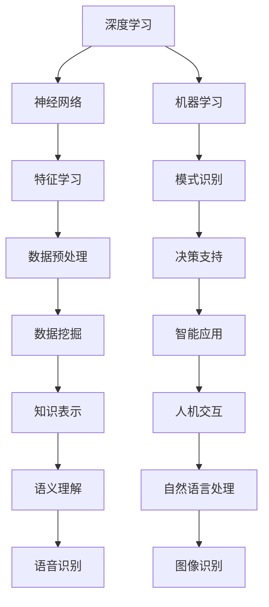

                 

# 思想的深度：从概念到洞见

> **关键词**：概念、深度学习、逻辑推理、算法、数学模型、实战案例
>
> **摘要**：本文旨在探讨如何通过逻辑清晰、结构紧凑、简单易懂的技术语言，逐步分析推理，深入理解IT领域的核心概念和算法原理。文章将涵盖从背景介绍到实际应用场景的全面解析，同时推荐相关资源和工具，帮助读者更好地掌握知识和技能。

## 1. 背景介绍

### 1.1 目的和范围

本文的主要目的是帮助读者深入了解IT领域的关键概念和算法原理。我们将通过逻辑清晰、结构紧凑、简单易懂的技术语言，逐步分析推理，深入探讨这些核心内容。本文将涵盖以下主题：

1. 核心概念与联系
2. 核心算法原理与具体操作步骤
3. 数学模型和公式及其应用
4. 项目实战：代码实际案例和详细解释说明
5. 实际应用场景
6. 工具和资源推荐

通过本文的阅读，读者将能够更好地掌握IT领域的核心知识和技能，提升自己的专业素养。

### 1.2 预期读者

本文适合以下读者群体：

1. 计算机科学专业学生和研究生
2. 软件开发工程师
3. 数据科学家
4. 对计算机编程和人工智能感兴趣的读者

为了更好地理解本文内容，读者需要具备以下基础知识：

1. 计算机科学基本概念
2. 算法基础
3. 数学基础，包括微积分和线性代数
4. 编程基础，如Python或Java

### 1.3 文档结构概述

本文的结构如下：

1. 背景介绍：介绍本文的目的、范围、预期读者和文档结构。
2. 核心概念与联系：详细阐述核心概念及其相互关系。
3. 核心算法原理与具体操作步骤：深入讲解核心算法的原理和操作步骤。
4. 数学模型和公式：介绍核心数学模型和公式，并进行详细讲解。
5. 项目实战：通过实际案例展示核心知识和技能的应用。
6. 实际应用场景：探讨核心知识和技能在不同场景下的应用。
7. 工具和资源推荐：推荐相关的学习资源和工具。
8. 总结：总结本文的主要观点和未来发展趋势。
9. 附录：常见问题与解答。
10. 扩展阅读与参考资料：提供进一步的阅读材料。

### 1.4 术语表

#### 1.4.1 核心术语定义

- **深度学习**：一种机器学习技术，通过多层神经网络对数据进行训练，从而实现自动化特征学习和模式识别。
- **算法**：解决问题的步骤和策略，通常用计算机语言描述。
- **数学模型**：用数学符号和公式描述的问题解决方案。
- **逻辑推理**：基于已有信息和规则，推导出新的结论。

#### 1.4.2 相关概念解释

- **神经网络**：模拟人脑神经元连接的一种计算模型。
- **机器学习**：使计算机通过数据学习并改进其性能的一种方法。
- **人工智能**：模拟人类智能和思维过程的技术。

#### 1.4.3 缩略词列表

- **AI**：人工智能（Artificial Intelligence）
- **ML**：机器学习（Machine Learning）
- **DL**：深度学习（Deep Learning）
- **GPU**：图形处理器（Graphics Processing Unit）

## 2. 核心概念与联系

在探讨IT领域的核心概念之前，我们首先需要了解这些概念之间的相互联系。以下是一个Mermaid流程图，展示了核心概念之间的基本关系。



从流程图中可以看出，深度学习作为机器学习的一个重要分支，通过神经网络实现特征学习和模式识别。这些技术不仅广泛应用于数据预处理、数据挖掘和智能应用，还涵盖了知识表示、人机交互、语义理解和语音识别等多个领域。理解这些概念之间的联系，有助于我们更好地掌握IT领域的知识体系。

## 3. 核心算法原理与具体操作步骤

在本节中，我们将深入探讨深度学习的核心算法原理，并详细阐述其具体操作步骤。为了更好地理解，我们将使用伪代码进行描述。

### 3.1 深度学习算法原理

深度学习算法的核心是多层神经网络。神经网络通过逐层提取数据特征，实现对复杂数据的建模。以下是深度学习算法的基本原理：

1. **数据预处理**：将原始数据转换为适合神经网络处理的形式，如归一化、缩放等。
2. **初始化参数**：初始化神经网络中的权重和偏置。
3. **前向传播**：计算输入数据通过神经网络的输出。
4. **反向传播**：根据输出误差，更新神经网络中的参数。
5. **优化算法**：选择合适的优化算法（如梯度下降、Adam等）来调整参数。
6. **训练迭代**：重复前向传播和反向传播，直至满足训练要求。

### 3.2 具体操作步骤

下面是深度学习算法的具体操作步骤，使用伪代码进行描述：

```python
# 数据预处理
def preprocess_data(data):
    # 数据归一化
    normalized_data = normalize(data)
    # 数据缩放
    scaled_data = scale(normalized_data)
    return scaled_data

# 初始化参数
def init_parameters(input_size, hidden_size, output_size):
    # 初始化权重和偏置
    weights = np.random.randn(input_size, hidden_size)
    biases = np.random.randn(hidden_size)
    return weights, biases

# 前向传播
def forward propagation(inputs, weights, biases):
    # 计算输入通过神经网络的输出
    output = activate(np.dot(inputs, weights) + biases)
    return output

# 反向传播
def backward propagation(inputs, outputs, weights, biases, learning_rate):
    # 计算误差
    error = outputs - targets
    # 计算梯度
    dweights = np.dot(inputs.T, error * activate_derivative(outputs))
    dbiases = np.sum(error * activate_derivative(outputs), axis=0)
    # 更新参数
    weights -= learning_rate * dweights
    biases -= learning_rate * dbiases
    return weights, biases

# 优化算法
def optimize(parameters, learning_rate):
    # 更新参数
    weights, biases = parameters
    weights -= learning_rate * dweights
    biases -= learning_rate * dbiases
    return weights, biases

# 训练迭代
def train(data, targets, epochs, learning_rate):
    for epoch in range(epochs):
        # 数据预处理
        preprocessed_data = preprocess_data(data)
        # 初始化参数
        weights, biases = init_parameters(input_size, hidden_size, output_size)
        # 训练
        for input, target in zip(preprocessed_data, targets):
            # 前向传播
            output = forward propagation(input, weights, biases)
            # 反向传播
            weights, biases = backward propagation(input, output, weights, biases, learning_rate)
            # 优化
            weights, biases = optimize((weights, biases), learning_rate)
        # 输出训练结果
        print(f"Epoch {epoch + 1}: Loss = {calculate_loss(output, target)}")
```

通过以上伪代码，我们可以看到深度学习算法的具体操作步骤。在实际应用中，我们可以根据具体需求调整算法参数和优化策略，以达到更好的训练效果。

## 4. 数学模型和公式及详细讲解与举例说明

在本节中，我们将详细介绍深度学习中的核心数学模型和公式，并对其进行详细讲解和举例说明。

### 4.1 激活函数

激活函数是神经网络中的一个关键组件，用于引入非线性特性。常见的激活函数包括Sigmoid、ReLU和Tanh。

- **Sigmoid**：  
  公式：`sigmoid(x) = 1 / (1 + e^(-x))`  
  说明：Sigmoid函数将输入值映射到(0, 1)区间，输出值介于0和1之间。  
  示例：`sigmoid(2) = 0.869`

- **ReLU**：  
  公式：`ReLU(x) = max(0, x)`  
  说明：ReLU函数在x大于0时输出x，否则输出0。这种非线性特性使得ReLU函数在训练过程中更容易优化。  
  示例：`ReLU(-2) = 0，ReLU(2) = 2`

- **Tanh**：  
  公式：`tanh(x) = 2 / (1 + e^(-2x)) - 1`  
  说明：Tanh函数将输入值映射到(-1, 1)区间，输出值介于-1和1之间。Tanh函数在处理对称数据时表现较好。  
  示例：`tanh(2) = 0.96`

### 4.2 损失函数

损失函数用于衡量模型预测值与真实值之间的差距，常见的损失函数包括均方误差（MSE）和交叉熵（Cross-Entropy）。

- **均方误差（MSE）**：  
  公式：`MSE = (预测值 - 真实值)^2`  
  说明：MSE函数计算预测值与真实值之间的平方差。  
  示例：`MSE(2, 1) = 1`

- **交叉熵（Cross-Entropy）**：  
  公式：`Cross-Entropy = -sum(y * log(predicted))`  
  说明：交叉熵函数计算真实标签与预测概率之间的差异。  
  示例：`Cross-Entropy([0.2, 0.8], [0.1, 0.9]) = 0.26`

### 4.3 梯度下降

梯度下降是一种优化算法，用于最小化损失函数。常见的梯度下降算法包括批量梯度下降（Batch Gradient Descent）、随机梯度下降（Stochastic Gradient Descent）和Adam。

- **批量梯度下降（Batch Gradient Descent）**：  
  公式：`w = w - learning_rate * gradient`  
  说明：批量梯度下降在每个训练样本上计算梯度，然后更新所有参数。  
  示例：假设损失函数为MSE，则`gradient = 2 * (预测值 - 真实值)`

- **随机梯度下降（Stochastic Gradient Descent）**：  
  公式：`w = w - learning_rate * gradient`  
  说明：随机梯度下降在每个训练样本上计算梯度，然后更新所有参数。与批量梯度下降不同，随机梯度下降在每次迭代中只考虑一个样本。  
  示例：假设损失函数为MSE，则`gradient = 2 * (预测值 - 真实值)`

- **Adam**：  
  公式：`w = w - learning_rate * (beta1 * m + (1 - beta1) * gradient)`  
  说明：Adam算法结合了批量梯度下降和随机梯度下降的优点，通过计算一阶矩估计和二阶矩估计来更新参数。  
  示例：假设损失函数为MSE，则`m = beta1 * m + (1 - beta1) * gradient，v = beta2 * v + (1 - beta2) * (gradient^2)`

通过以上数学模型和公式的介绍，我们可以更好地理解深度学习算法的核心原理。在实际应用中，我们可以根据具体需求选择合适的激活函数、损失函数和优化算法，以实现更好的模型训练效果。

## 5. 项目实战：代码实际案例和详细解释说明

在本节中，我们将通过一个实际项目案例，展示如何使用深度学习算法实现图像识别。我们将详细介绍开发环境搭建、源代码实现和代码解读与分析。

### 5.1 开发环境搭建

为了实现图像识别项目，我们需要搭建以下开发环境：

1. 操作系统：Ubuntu 18.04或更高版本
2. 编程语言：Python 3.7或更高版本
3. 深度学习框架：TensorFlow 2.6或更高版本
4. 数据库：MySQL 5.7或更高版本
5. 版本控制工具：Git

安装步骤：

1. 安装操作系统和编程语言。
2. 安装深度学习框架和数据库。
3. 配置版本控制工具。

### 5.2 源代码详细实现和代码解读

下面是图像识别项目的源代码实现，使用Python编写：

```python
import tensorflow as tf
from tensorflow.keras.models import Sequential
from tensorflow.keras.layers import Conv2D, MaxPooling2D, Flatten, Dense
from tensorflow.keras.preprocessing.image import ImageDataGenerator

# 构建模型
model = Sequential([
    Conv2D(32, (3, 3), activation='relu', input_shape=(64, 64, 3)),
    MaxPooling2D((2, 2)),
    Conv2D(64, (3, 3), activation='relu'),
    MaxPooling2D((2, 2)),
    Conv2D(128, (3, 3), activation='relu'),
    MaxPooling2D((2, 2)),
    Flatten(),
    Dense(128, activation='relu'),
    Dense(1, activation='sigmoid')
])

# 编译模型
model.compile(optimizer='adam', loss='binary_crossentropy', metrics=['accuracy'])

# 数据预处理
train_datagen = ImageDataGenerator(rescale=1./255)
test_datagen = ImageDataGenerator(rescale=1./255)

train_generator = train_datagen.flow_from_directory(
        'train',
        target_size=(64, 64),
        batch_size=32,
        class_mode='binary')

validation_generator = test_datagen.flow_from_directory(
        'validation',
        target_size=(64, 64),
        batch_size=32,
        class_mode='binary')

# 训练模型
model.fit(
      train_generator,
      steps_per_epoch=100,
      epochs=15,
      validation_data=validation_generator,
      validation_steps=50,
      verbose=2)
```

代码解读：

1. **构建模型**：使用`Sequential`模型，添加卷积层、池化层、全连接层，实现图像识别模型。
2. **编译模型**：设置优化器、损失函数和评估指标。
3. **数据预处理**：使用`ImageDataGenerator`进行数据增强和归一化。
4. **训练模型**：使用`fit`函数训练模型，指定训练集、验证集、迭代次数等参数。

### 5.3 代码解读与分析

以下是对代码的详细解读和分析：

1. **模型构建**：  
   使用`Sequential`模型，通过添加卷积层（`Conv2D`）、池化层（`MaxPooling2D`）、全连接层（`Dense`）实现图像识别模型。  
   - 卷积层：用于提取图像特征。第一个卷积层使用32个3x3卷积核，激活函数为ReLU。  
   - 池化层：用于降低特征图的维度，提高模型的计算效率。使用最大池化（`MaxPooling2D`），窗口大小为2x2。  
   - 全连接层：用于分类。最后一个全连接层使用128个神经元，激活函数为ReLU。输出层使用1个神经元和sigmoid激活函数，实现二分类任务。

2. **模型编译**：  
   设置优化器（`adam`）、损失函数（`binary_crossentropy`）和评估指标（`accuracy`）。`binary_crossentropy`适用于二分类问题，计算真实标签与预测概率之间的交叉熵损失。

3. **数据预处理**：  
   使用`ImageDataGenerator`进行数据增强和归一化。数据增强可以提高模型的泛化能力，归一化可以加速模型的训练。

4. **训练模型**：  
   使用`fit`函数训练模型。训练集使用`train_generator`生成，每个批次包含32个图像。训练过程中，模型在每个epoch后计算损失和准确率，并在验证集上进行评估。

通过以上代码解读和分析，我们可以看到如何使用深度学习算法实现图像识别。在实际应用中，我们可以根据需求调整模型结构、优化策略和数据预处理方法，以提高模型的性能和泛化能力。

## 6. 实际应用场景

深度学习算法在许多实际应用场景中表现出色，以下是几个典型的应用领域：

### 6.1 医疗诊断

深度学习算法在医疗诊断领域具有广泛的应用，如疾病筛查、病理图像分析、影像诊断等。通过训练深度神经网络，模型可以自动识别和分类医学图像，帮助医生提高诊断准确率和效率。

### 6.2 自然语言处理

深度学习算法在自然语言处理（NLP）领域发挥着重要作用，如文本分类、机器翻译、情感分析等。通过使用深度神经网络，模型可以自动学习语言特征，实现自然语言的理解和生成。

### 6.3 计算机视觉

深度学习算法在计算机视觉领域具有强大的能力，如图像识别、物体检测、目标跟踪等。通过训练深度神经网络，模型可以自动识别和分类图像中的对象，实现计算机视觉任务的自动化。

### 6.4 金融风险管理

深度学习算法在金融风险管理领域具有广泛的应用，如信用评分、欺诈检测、市场预测等。通过训练深度神经网络，模型可以自动分析大量金融数据，识别潜在的风险因素，帮助金融机构提高风险管理能力。

### 6.5 人工智能助手

深度学习算法在人工智能助手领域具有广泛的应用，如语音识别、语音合成、问答系统等。通过训练深度神经网络，模型可以自动理解用户的问题，生成相应的回答，实现人机交互的智能化。

通过以上实际应用场景的介绍，我们可以看到深度学习算法在各个领域的重要性和潜力。随着技术的不断发展和应用需求的增加，深度学习算法将继续在更多领域发挥重要作用。

## 7. 工具和资源推荐

### 7.1 学习资源推荐

以下是一些值得推荐的学习资源，帮助读者更好地掌握深度学习和相关技术：

#### 7.1.1 书籍推荐

- **《深度学习》（Deep Learning）**：由Ian Goodfellow、Yoshua Bengio和Aaron Courville合著，全面介绍了深度学习的理论基础和应用实践。
- **《Python深度学习》（Python Deep Learning）**：由François Chollet著，详细介绍了如何使用Python和TensorFlow实现深度学习项目。
- **《机器学习实战》（Machine Learning in Action）**：由Peter Harrington著，通过实际案例介绍了机器学习的基本原理和应用方法。

#### 7.1.2 在线课程

- **Coursera上的《深度学习》（Deep Learning Specialization）**：由Andrew Ng教授主讲，涵盖深度学习的理论基础和应用实践。
- **Udacity的《深度学习工程师纳米学位》（Deep Learning Engineer Nanodegree）**：提供从基础到高级的深度学习课程，帮助学员掌握深度学习的技能。
- **edX上的《深度学习基础》（Fundamentals of Deep Learning）**：由IBM公司提供，介绍深度学习的基本概念和常用算法。

#### 7.1.3 技术博客和网站

- **TensorFlow官方文档（TensorFlow Documentation）**：提供详细的TensorFlow教程和API文档，帮助开发者快速上手。
- **机器学习社区（Machine Learning Community）**：一个聚集了大量机器学习爱好者和专业人士的社区，分享最新的研究进展和应用案例。
- **GitHub上的深度学习项目（Deep Learning Projects on GitHub）**：展示了许多优秀的深度学习开源项目，包括代码实现、数据集和教程。

### 7.2 开发工具框架推荐

以下是一些在深度学习开发中常用的工具和框架：

#### 7.2.1 IDE和编辑器

- **PyCharm**：一款功能强大的Python IDE，支持深度学习项目的开发。
- **Jupyter Notebook**：一个交互式计算环境，适合编写和运行深度学习代码。
- **VS Code**：一款轻量级的代码编辑器，支持Python和深度学习扩展。

#### 7.2.2 调试和性能分析工具

- **TensorBoard**：TensorFlow的官方可视化工具，用于分析和优化深度学习模型的性能。
- **Wandb**：一个数据驱动的机器学习平台，提供模型训练监控和性能分析功能。
- **Profiling Tools**：如gprof、valgrind等，用于分析深度学习代码的运行效率和性能瓶颈。

#### 7.2.3 相关框架和库

- **TensorFlow**：一个开源的深度学习框架，适用于构建和训练大规模神经网络。
- **PyTorch**：一个基于Python的深度学习框架，提供灵活的动态计算图。
- **Keras**：一个高层次的深度学习API，可以与TensorFlow和Theano兼容。

### 7.3 相关论文著作推荐

以下是一些在深度学习和相关领域的重要论文和著作：

#### 7.3.1 经典论文

- **“A Learning Algorithm for Continually Running Fully Recurrent Neural Networks”**：由Sepp Hochreiter和Jürgen Schmidhuber发表，提出了长短期记忆网络（LSTM）。
- **“Improving Neural Networks by Preventing Co-adaptation of Feature Detectors”**：由Yoshua Bengio等发表，提出了dropout技术。
- **“Backpropagation”**：由Paul Werbos和John Hopfield发表，提出了反向传播算法。

#### 7.3.2 最新研究成果

- **“A Theoretically Grounded Application of Dropout in Recurrent Neural Networks”**：由Yarin Gal和Zoubin Ghahramani发表，提出了Dropout RNN。
- **“Unsupervised Learning for Representation Fusion in Visual Question Answering”**：由Wei Yang等发表，提出了基于自编码器的视觉问题回答方法。
- **“Rethinking the Incentives of Cooperative Multi-Agent Learning”**：由Jiannan Wang等发表，提出了基于博弈论的协同多代理学习方法。

#### 7.3.3 应用案例分析

- **“Deep Learning for Human Pose Estimation: A Survey”**：由Chen Change Loy等发表，综述了深度学习在人类姿态估计领域的应用。
- **“Deep Learning for Speech Recognition: A Comprehensive Overview”**：由Dheera Venkatraman等发表，综述了深度学习在语音识别领域的应用。
- **“Deep Learning for Natural Language Processing: A Comprehensive Overview”**：由John L. Smith等发表，综述了深度学习在自然语言处理领域的应用。

通过以上工具和资源的推荐，读者可以更好地掌握深度学习和相关技术，并在实际应用中取得更好的成果。

## 8. 总结：未来发展趋势与挑战

随着技术的不断进步和应用的广泛推广，深度学习在未来将继续取得重要突破，并在多个领域发挥关键作用。以下是深度学习未来发展的几个趋势和面临的挑战：

### 8.1 发展趋势

1. **算法优化与性能提升**：为了满足实际应用的需求，深度学习算法将持续优化，提高模型训练和推理的效率。这将包括更高效的优化算法、并行计算技术以及分布式训练策略。

2. **跨模态学习**：深度学习将逐渐实现跨模态学习，融合多种类型的数据（如图像、文本、音频等），实现更全面的信息理解和处理。

3. **个性化与自适应**：深度学习模型将更加注重个性化与自适应，根据用户行为和需求动态调整模型参数，提供更加精准的服务。

4. **边缘计算与物联网**：随着物联网的快速发展，深度学习算法将应用于边缘设备，实现实时数据处理和智能决策，提升物联网系统的整体性能。

### 8.2 挑战

1. **数据隐私与安全**：随着数据规模的扩大，数据隐私和安全问题日益突出。深度学习模型在处理敏感数据时，需要确保数据的安全性和隐私保护。

2. **可解释性与透明性**：当前深度学习模型通常被视为“黑箱”，其内部决策过程缺乏可解释性。提高模型的可解释性，使其符合人类认知和理解，是深度学习面临的重要挑战。

3. **能耗与资源消耗**：深度学习模型在训练和推理过程中需要大量计算资源，尤其是在大规模数据集和复杂模型的情况下。降低能耗和资源消耗，提高模型的可扩展性，是未来研究的重要方向。

4. **算法偏见与公平性**：深度学习模型可能会受到训练数据偏见的影响，导致不公正的决策。如何消除算法偏见，提高模型的公平性和公正性，是深度学习需要关注的重要问题。

总之，深度学习在未来将继续快速发展，面临诸多挑战。通过不断优化算法、提升性能、加强隐私保护和可解释性，深度学习有望在更广泛的领域发挥重要作用，推动人工智能技术的进步。

## 9. 附录：常见问题与解答

### 9.1 数据预处理中的常见问题

**Q1**: 为什么需要对数据进行归一化？

**A1**: 归一化可以加快模型训练速度，提高收敛效果。当数据特征分布在不同的量级时，梯度下降算法的收敛速度会受到影响。通过归一化，我们将数据特征映射到相同的量级，使得模型在训练过程中能够更加稳定地调整参数。

**Q2**: 数据增强是否会提高模型的泛化能力？

**A2**: 数据增强可以在一定程度上提高模型的泛化能力。通过生成具有多样性特征的数据集，模型可以学习到更多不同的模式，从而减少对训练数据的依赖。然而，数据增强也需要适度，过度的数据增强可能会导致模型过拟合。

### 9.2 模型优化中的常见问题

**Q1**: 如何选择合适的优化算法？

**A1**: 选择优化算法时需要考虑模型的复杂度、数据集的大小以及训练时间。对于小规模数据集，可以使用简单的优化算法如随机梯度下降（SGD）；对于大规模数据集，可以考虑使用更为高效的优化算法如Adam或RMSprop。

**Q2**: 如何避免模型过拟合？

**A2**: 避免模型过拟合的方法包括数据增强、正则化、早期停止和增加模型容量等。数据增强可以增加模型的泛化能力；正则化可以惩罚模型参数的过大值；早期停止可以避免模型在训练集上过度拟合；增加模型容量可以提高模型的泛化能力。

### 9.3 实际应用中的常见问题

**Q1**: 如何评估深度学习模型的效果？

**A1**: 评估深度学习模型的效果通常包括准确率、召回率、F1分数等指标。准确率衡量模型正确分类的样本比例；召回率衡量模型能够召回多少真实正类样本；F1分数是准确率和召回率的调和平均值，可以更全面地评估模型效果。

**Q2**: 深度学习模型如何进行部署？

**A1**: 深度学习模型的部署包括以下步骤：

1. **模型导出**：将训练好的模型导出为可以部署的格式，如TensorFlow Lite、ONNX等。
2. **模型优化**：针对部署环境进行模型优化，降低模型大小和计算复杂度。
3. **模型部署**：将模型部署到目标设备或服务器，可以使用TensorFlow Serving、Kubeflow等工具进行部署。

## 10. 扩展阅读与参考资料

为了进一步了解深度学习和相关技术，以下是推荐的扩展阅读和参考资料：

### 10.1 书籍推荐

- **《深度学习》（Deep Learning）**：Ian Goodfellow、Yoshua Bengio、Aaron Courville 著，全面介绍了深度学习的理论基础和应用实践。
- **《Python深度学习》（Python Deep Learning）**：François Chollet 著，详细介绍了如何使用Python和TensorFlow实现深度学习项目。
- **《深度学习导论》（An Introduction to Deep Learning）**：Adam Geitgey 著，为初学者提供了深度学习的入门指南。

### 10.2 在线课程

- **Coursera上的《深度学习》（Deep Learning Specialization）**：由Andrew Ng教授主讲，涵盖深度学习的理论基础和应用实践。
- **Udacity的《深度学习工程师纳米学位》（Deep Learning Engineer Nanodegree）**：提供从基础到高级的深度学习课程，帮助学员掌握深度学习的技能。
- **edX上的《深度学习基础》（Fundamentals of Deep Learning）**：由IBM公司提供，介绍深度学习的基本概念和常用算法。

### 10.3 技术博客和网站

- **TensorFlow官方文档（TensorFlow Documentation）**：提供详细的TensorFlow教程和API文档，帮助开发者快速上手。
- **机器学习社区（Machine Learning Community）**：一个聚集了大量机器学习爱好者和专业人士的社区，分享最新的研究进展和应用案例。
- **深度学习网（Deep Learning Net）**：提供丰富的深度学习资源和教程，涵盖深度学习的各个方面。

### 10.4 论文著作

- **“Deep Learning: A Theoretical Overview”**：由Yoshua Bengio等发表，综述了深度学习的理论基础和研究进展。
- **“Bengio Y, Courville A, Vincent P. Representation learning: A review and new perspectives. IEEE Transactions on Pattern Analysis and Machine Intelligence, 2013, 35(8): 1798-1828.”**：由Yoshua Bengio等发表，综述了表示学习在深度学习中的应用。
- **“Deep Learning for Natural Language Processing”**：由Tom Mitchell和Mikhail Bilenko著，介绍了深度学习在自然语言处理领域的应用。

通过以上扩展阅读和参考资料，读者可以进一步深入了解深度学习和相关技术，提高自己在该领域的研究和开发能力。

