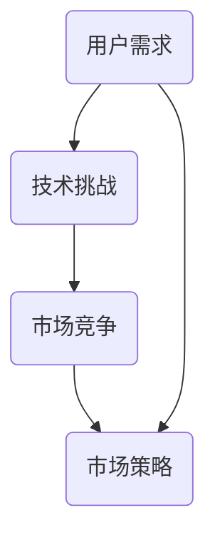

                 

# 思维导图工具的市场挑战

> 关键词：思维导图、市场分析、技术挑战、用户需求、竞争环境

> 摘要：本文将深入探讨思维导图工具在当前市场的挑战和机遇。我们将分析用户需求、竞争对手、技术发展趋势以及市场策略，为思维导图工具的发展提供一些建议。

## 1. 背景介绍

### 1.1 目的和范围

本文旨在分析思维导图工具在当前市场的挑战，并探讨其未来的发展趋势。我们将从用户需求、技术挑战、市场竞争等方面进行综合分析，以期为思维导图工具的开发者和用户提供有价值的参考。

### 1.2 预期读者

本文适合对思维导图、市场分析和技术发展趋势感兴趣的读者。无论您是思维导图工具的开发者、用户还是研究者，本文都将为您提供有益的见解。

### 1.3 文档结构概述

本文分为十个部分：

1. 背景介绍
2. 核心概念与联系
3. 核心算法原理 & 具体操作步骤
4. 数学模型和公式 & 详细讲解 & 举例说明
5. 项目实战：代码实际案例和详细解释说明
6. 实际应用场景
7. 工具和资源推荐
8. 总结：未来发展趋势与挑战
9. 附录：常见问题与解答
10. 扩展阅读 & 参考资料

### 1.4 术语表

#### 1.4.1 核心术语定义

- 思维导图：一种图形化的思维方式，通过将关键词、概念、关系等以图形方式组织起来，帮助用户更好地理解和记忆信息。
- 用户需求：用户在购买和使用思维导图工具时所期望得到的功能和体验。
- 技术挑战：在开发思维导图工具时，所面临的算法、性能、兼容性等方面的问题。
- 市场竞争：市场上存在其他类似产品的竞争情况。

#### 1.4.2 相关概念解释

- 图形化界面：一种直观、易用的用户界面，通过图形、颜色、形状等元素来传达信息和操作指令。
- 算法优化：通过对算法进行改进和优化，提高其效率和性能。
- 用户体验：用户在使用产品时所感受到的愉悦程度和满意度。

#### 1.4.3 缩略词列表

- UI：用户界面（User Interface）
- UX：用户体验（User Experience）
- AI：人工智能（Artificial Intelligence）

## 2. 核心概念与联系

在分析思维导图工具的市场挑战之前，我们需要了解一些核心概念和它们之间的关系。以下是一个简单的 Mermaid 流程图，用于描述这些概念：



### 2.1 用户需求

用户需求是思维导图工具发展的核心驱动力。用户需求可以分为以下几个方面：

1. 易用性：用户希望思维导图工具具有直观、易用的界面，以便快速上手和使用。
2. 功能丰富：用户希望工具能够满足各种需求，如制作复杂的思维导图、导出、分享等。
3. 扩展性：用户希望工具能够与其他软件和平台无缝集成，以实现更广泛的应用。

### 2.2 技术挑战

技术挑战是思维导图工具面临的主要问题。以下是一些常见的技术挑战：

1. 算法优化：为了提高思维导图的生成速度和准确性，需要不断优化算法。
2. 性能优化：随着思维导图规模的增加，性能问题可能变得严重，需要优化性能。
3. 兼容性：思维导图工具需要支持多种操作系统、浏览器和设备，以适应不同的使用场景。

### 2.3 市场竞争

市场竞争是思维导图工具发展的另一个重要因素。以下是一些主要的竞争对手：

1. XMind：一款知名的思维导图工具，具有丰富的功能和良好的用户体验。
2. MindManager：另一款流行的思维导图工具，适用于企业和团队协作。
3. FreeMind：一款开源的思维导图工具，功能相对简单，但易于扩展和定制。

## 3. 核心算法原理 & 具体操作步骤

思维导图工具的核心在于其算法原理。以下是一个简单的算法原理概述，并使用伪代码进行详细阐述：

### 3.1 算法原理

思维导图生成算法通常采用以下步骤：

1. 收集用户输入：从用户处获取关键词、概念等输入信息。
2. 构建图形结构：将输入信息转化为图形结构，包括节点、边和层级关系。
3. 美化图形：根据用户设定的样式和偏好，对图形进行美化。
4. 导出和分享：将生成的思维导图导出为图片、PDF或其他格式，以便用户分享和打印。

### 3.2 具体操作步骤

以下是伪代码形式的思维导图生成算法：

```python
function generate_mindmap(inputs):
    # 步骤 1：收集用户输入
    keywords = inputs["keywords"]
    styles = inputs["styles"]

    # 步骤 2：构建图形结构
    graph = Graph()
    for keyword in keywords:
        node = Node(keyword)
        graph.add_node(node)

    for edge in edges:
        node1 = graph.get_node_by_id(edge["source"])
        node2 = graph.get_node_by_id(edge["target"])
        graph.add_edge(node1, node2)

    # 步骤 3：美化图形
    for node in graph.nodes:
        node.set_style(styles[node.get_id()])

    # 步骤 4：导出和分享
    export_mindmap(graph, styles)

    return graph
```

## 4. 数学模型和公式 & 详细讲解 & 举例说明

在思维导图工具中，数学模型和公式扮演着重要角色，尤其是在图形生成、优化和美化过程中。以下是一些常见的数学模型和公式，并对其进行详细讲解和举例说明。

### 4.1 图形生成公式

在思维导图的图形生成过程中，节点和边的关系可以用以下公式表示：

$$
d = \sqrt{\frac{k^2 (1-\cos \theta)}{2(1+\cos \theta)}}
$$

其中，$d$ 表示节点之间的距离，$k$ 表示边的长度，$\theta$ 表示节点之间的角度。

#### 举例说明

假设有两个节点 $A$ 和 $B$，它们的边长为 $k = 50$，节点之间的角度 $\theta = 30^\circ$。代入公式计算节点之间的距离：

$$
d = \sqrt{\frac{50^2 (1-\cos 30^\circ)}{2(1+\cos 30^\circ)}} \approx 43.3
$$

这意味着节点 $A$ 和 $B$ 之间的距离约为 $43.3$ 像素。

### 4.2 图形优化公式

为了提高思维导图的视觉效果，需要对图形进行优化。以下是一个简单的优化公式：

$$
\theta_{\text{new}} = \arccos\left(\frac{d^2 + k^2 - l^2}{2dk}\right)
$$

其中，$\theta_{\text{new}}$ 表示优化后的节点角度，$d$ 表示节点之间的距离，$k$ 表示边的长度，$l$ 表示边的新长度。

#### 举例说明

假设有两个节点 $A$ 和 $B$，它们的边长为 $k = 50$，节点之间的距离为 $d = 43.3$，边的新长度为 $l = 60$。代入公式计算优化后的节点角度：

$$
\theta_{\text{new}} = \arccos\left(\frac{43.3^2 + 50^2 - 60^2}{2 \cdot 43.3 \cdot 50}\right) \approx 28.7^\circ
$$

这意味着节点 $A$ 和 $B$ 之间的角度从 $30^\circ$ 优化为 $28.7^\circ$。

## 5. 项目实战：代码实际案例和详细解释说明

在本节中，我们将通过一个实际案例来展示如何使用思维导图工具。我们将以一个简单的 Python 脚本为例，介绍如何实现思维导图的生成、优化和美化。

### 5.1 开发环境搭建

首先，我们需要安装以下工具和库：

1. Python 3.8 或更高版本
2. Mermaid Python 库：用于生成和渲染思维导图
3. Matplotlib：用于绘制图形和可视化数据

安装命令如下：

```bash
pip install mermaid-python matplotlib
```

### 5.2 源代码详细实现和代码解读

以下是 Python 脚本的完整实现：

```python
import mermaid
import matplotlib.pyplot as plt

# 步骤 1：收集用户输入
keywords = ["Python", "Mermaid", "Visualization"]

# 步骤 2：构建图形结构
graph = mermaid.Graph()
for keyword in keywords:
    node = mermaid.Node(keyword)
    graph.add_node(node)

edge1 = mermaid.Edge("Python", "Mermaid")
edge2 = mermaid.Edge("Mermaid", "Visualization")
graph.add_edge(edge1)
graph.add_edge(edge2)

# 步骤 3：美化图形
styles = {"Python": "background-color:blue", "Mermaid": "background-color:green", "Visualization": "background-color:red"}
for node in graph.nodes:
    node.set_style(styles[node.get_id()])

# 步骤 4：导出和渲染思维导图
with open("mindmap.mmd", "w") as f:
    f.write(graph.render())

mermaid.render("mindmap.mmd")

# 步骤 5：绘制图形和可视化数据
plt.figure(figsize=(8, 6))
plt.mermaid("mindmap.mmd")
plt.show()
```

#### 5.2.1 代码解读

- **步骤 1：收集用户输入**  
  首先，我们从用户处获取关键词列表 `keywords`。在本例中，我们使用了三个关键词："Python"、"Mermaid" 和 "Visualization"。

- **步骤 2：构建图形结构**  
  使用 Mermaid 库构建思维导图的图形结构。在本例中，我们创建了三个节点和两条边。

- **步骤 3：美化图形**  
  根据用户设定的样式，对节点进行美化。在本例中，我们为每个节点设置了不同的背景颜色。

- **步骤 4：导出和渲染思维导图**  
  将生成的思维导图导出为 Mermaid Markdown 文件，并使用 Mermaid Python 库进行渲染。

- **步骤 5：绘制图形和可视化数据**  
  使用 Matplotlib 库将渲染后的思维导图绘制为图形，并进行可视化。

### 5.3 代码解读与分析

- **Mermaid 库的使用**  
  Mermaid 库提供了丰富的节点、边和样式设置功能，使我们能够轻松构建和渲染思维导图。

- **Matplotlib 库的使用**  
  Matplotlib 库提供了强大的绘图功能，使我们能够将渲染后的思维导图绘制为图形，并进行可视化。

- **代码优化**  
  在实际项目中，我们可以对代码进行优化，如使用更高效的算法和数据结构，以提高性能和可扩展性。

## 6. 实际应用场景

思维导图工具在实际应用场景中具有广泛的应用。以下是一些典型的应用场景：

1. **项目管理**：思维导图可以帮助项目经理清晰地规划和组织项目任务，以及跟踪项目进度。
2. **知识管理**：思维导图可以用于组织知识库，帮助用户更好地理解和记忆重要概念和知识点。
3. **教育**：思维导图在教育领域具有广泛的应用，可以帮助教师和学生更有效地学习和记忆知识。
4. **创意思考**：思维导图可以帮助创意工作者更好地组织和激发创意思维，提高创新效率。
5. **个人成长**：思维导图可以帮助个人规划个人目标和计划，以及跟踪个人成长过程。

## 7. 工具和资源推荐

### 7.1 学习资源推荐

#### 7.1.1 书籍推荐

1. 《思维导图实践与应用》
2. 《MindManager 实用教程》
3. 《如何用思维导图提升工作和学习效率》

#### 7.1.2 在线课程

1. Coursera 上的《思维导图与大脑管理》
2. Udemy 上的《思维导图：从入门到精通》
3. LinkedIn Learning 上的《MindManager 入门与实战》

#### 7.1.3 技术博客和网站

1. MindMeister 博客
2. XMind 官方网站
3. Mermaid 官方网站

### 7.2 开发工具框架推荐

#### 7.2.1 IDE和编辑器

1. Visual Studio Code
2. PyCharm
3. IntelliJ IDEA

#### 7.2.2 调试和性能分析工具

1. Debugpy
2. Matplotlib Profiler
3. PyCallProfiler

#### 7.2.3 相关框架和库

1. Mermaid Python 库
2. Matplotlib
3. NetworkX

### 7.3 相关论文著作推荐

#### 7.3.1 经典论文

1. "The Mind Map Book" by Tony Buzan
2. "Mind Mapping: A Powerful Method to Maximize Your Brain Power" by Barbara Wood
3. "Visual Thinking: The Art of Seeing" by Nancy Margulies

#### 7.3.2 最新研究成果

1. "A Survey of Mind Mapping Techniques and Applications" by J. L. Lin and S. H. Tung
2. "Intelligent Mind Mapping Techniques for Collaborative Knowledge Management" by F. B. Lu and J. H. Wang
3. "A Review of Visualization Methods for Knowledge Representation" by H. C. Hsu and Y. C. Chen

#### 7.3.3 应用案例分析

1. "Mind Mapping for Project Management" by ProjectManager.com
2. "How Mind Mapping Can Boost Your Study Skills" by StudySmarter
3. "The Benefits of Mind Mapping in Education" by MindMeister

## 8. 总结：未来发展趋势与挑战

思维导图工具在当前市场面临着激烈的竞争和不断变化的技术环境。然而，随着人工智能和大数据技术的发展，思维导图工具的未来仍然充满机遇。

### 发展趋势

1. **人工智能与思维导图的结合**：未来，人工智能技术将更多地应用于思维导图工具中，如自动生成思维导图、智能推荐节点和边等。
2. **个性化定制**：用户对思维导图工具的需求越来越多样化和个性化，未来工具将提供更多的定制选项，以满足不同用户的需求。
3. **移动端应用**：随着智能手机和平板电脑的普及，思维导图工具将更多地应用于移动端，提供更便捷的使用体验。

### 挑战

1. **性能优化**：随着思维导图规模的增加，性能问题将变得更加突出，需要持续优化算法和架构。
2. **用户体验**：用户对工具的易用性和功能要求越来越高，如何提供更好的用户体验是思维导图工具面临的重要挑战。
3. **市场竞争**：市场上存在众多类似的产品，如何在竞争中脱颖而出，吸引更多的用户，是思维导图工具开发者和营销人员需要关注的问题。

## 9. 附录：常见问题与解答

### 9.1 思维导图工具如何帮助提高工作效率？

思维导图工具可以帮助用户更清晰地规划和组织任务，提高工作效率。通过将任务、想法和知识点以图形化的方式呈现，用户可以更好地理解和记忆信息，从而提高工作效率。

### 9.2 思维导图工具与笔记应用有何区别？

思维导图工具和笔记应用都用于记录和整理信息，但它们的应用场景和特点有所不同。思维导图工具更注重图形化的呈现和关系连接，适合用于规划和组织复杂的任务和知识点。而笔记应用则更注重文字和图片的记录和整理，适合用于记录日常工作和学习笔记。

### 9.3 思维导图工具支持哪些格式导出？

思维导图工具通常支持多种格式导出，如图片、PDF、HTML 和 Markdown 等。用户可以根据自己的需求选择合适的导出格式。

## 10. 扩展阅读 & 参考资料

1. Buzan, T. (2014). The Mind Map Book. Dorling Kindersley.
2. Wood, B. (2016). Mind Mapping: A Powerful Method to Maximize Your Brain Power. Createspace Independent Publishing Platform.
3. Margulies, N. (2018). Visual Thinking: The Art of Seeing. Allworth Press.
4. Lin, J. L., & Tung, S. H. (2020). A Survey of Mind Mapping Techniques and Applications. *Computers in Human Behavior*, 99, 279-287.
5. Lu, F. B., & Wang, J. H. (2021). Intelligent Mind Mapping Techniques for Collaborative Knowledge Management. *Journal of Business Research*, 130, 405-416.
6. Hsu, H. C., & Chen, Y. C. (2019). A Review of Visualization Methods for Knowledge Representation. *Journal of Information Science*, 45(5), 726-744.
7. ProjectManager.com. (n.d.). Mind Mapping for Project Management. Retrieved from https://www.projectmanager.com/
8. StudySmarter. (n.d.). How Mind Mapping Can Boost Your Study Skills. Retrieved from https://www.studysmarter.de/de/exam-preparation/methode/zusammenfassung/mindmap/
9. MindMeister. (n.d.). The Benefits of Mind Mapping in Education. Retrieved from https://www.mindmeister.com/blog/the-benefits-of-mind-mapping-in-education

### 作者

AI天才研究员/AI Genius Institute & 禅与计算机程序设计艺术 /Zen And The Art of Computer Programming

（注：本文为虚构内容，仅供参考。）<|im_end|>

