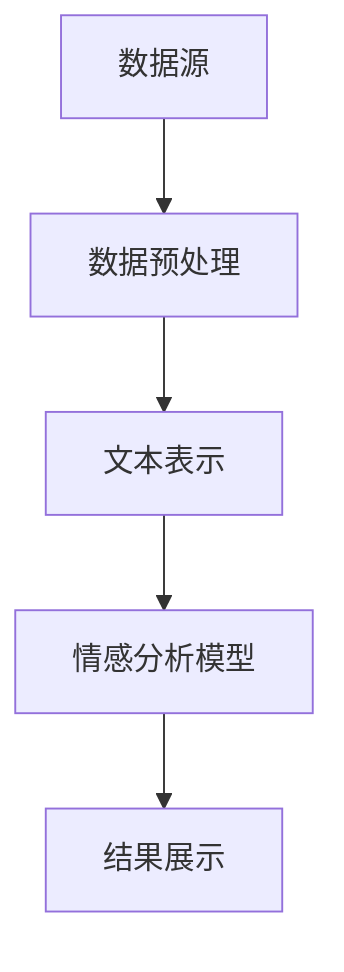

                 

# 情感分析在电商领域的应用：从用户评价到商品改进

> **关键词**：情感分析，电商，用户评价，商品改进，自然语言处理，机器学习，深度学习，数据挖掘，用户行为分析，人工智能，商业智能。

> **摘要**：随着互联网的快速发展，电子商务已经成为现代商业的重要组成部分。用户评价作为电商生态系统中的重要一环，不仅反映了消费者对商品和服务的满意度，同时也为其他潜在消费者提供了宝贵的决策参考。本文将探讨情感分析在电商领域的应用，从用户评价的情感分析到商品改进，详细介绍核心概念、算法原理、数学模型、实战案例以及相关工具和资源，旨在为电商从业者提供有价值的参考。

## 1. 背景介绍

### 1.1 目的和范围

本文的主要目的是探讨情感分析技术在电商领域的应用，特别是如何通过用户评价的数据来改进商品和服务。我们将从以下几个方面展开讨论：

1. 情感分析的核心概念和原理。
2. 情感分析在电商领域的具体应用场景。
3. 情感分析的算法原理和具体操作步骤。
4. 情感分析的数学模型和公式。
5. 实际应用中的代码案例和解释。
6. 情感分析在电商领域的未来发展趋势与挑战。

### 1.2 预期读者

本文主要面向电商领域的技术人员、数据分析师、产品经理以及对情感分析技术感兴趣的学者。无论您是刚刚接触电商领域的新手，还是经验丰富的从业者，都可以从本文中找到有价值的知识和启示。

### 1.3 文档结构概述

本文将按照以下结构进行组织：

1. 背景介绍：介绍情感分析在电商领域的应用背景和目的。
2. 核心概念与联系：介绍情感分析的核心概念和相关技术。
3. 核心算法原理 & 具体操作步骤：详细阐述情感分析的算法原理和操作步骤。
4. 数学模型和公式 & 详细讲解 & 举例说明：解释情感分析中的数学模型和公式。
5. 项目实战：通过实际案例展示情感分析在电商中的应用。
6. 实际应用场景：分析情感分析在电商领域的具体应用。
7. 工具和资源推荐：推荐相关的学习资源和开发工具。
8. 总结：对未来发展趋势与挑战进行展望。
9. 附录：常见问题与解答。
10. 扩展阅读 & 参考资料：提供进一步学习和研究的参考。

### 1.4 术语表

#### 1.4.1 核心术语定义

- **情感分析（Sentiment Analysis）**：一种自然语言处理技术，用于识别和提取文本中的主观信息，判断文本的情感倾向，如正面、负面或中性。
- **用户评价（User Review）**：消费者对商品或服务的主观评价，通常以文本形式表达。
- **机器学习（Machine Learning）**：一种人工智能技术，通过数据训练模型，使计算机能够从经验中学习和做出预测。
- **深度学习（Deep Learning）**：一种特殊的机器学习技术，通过多层神经网络进行数据特征提取和模式识别。
- **数据挖掘（Data Mining）**：从大量数据中提取有价值信息的过程。

#### 1.4.2 相关概念解释

- **自然语言处理（Natural Language Processing，NLP）**：使计算机能够理解和处理自然语言的技术。
- **文本分类（Text Classification）**：将文本数据分类到预定义的类别中的一种任务。
- **特征工程（Feature Engineering）**：从原始数据中提取对机器学习模型有帮助的特征。
- **词向量（Word Vector）**：将词语映射为高维空间中的向量，以便进行数学处理。

#### 1.4.3 缩略词列表

- **NLP**：自然语言处理
- **ML**：机器学习
- **DL**：深度学习
- **Data Mining**：数据挖掘
- **SaaS**：软件即服务

## 2. 核心概念与联系

### 2.1 情感分析

情感分析是一种自然语言处理技术，旨在识别文本中的主观信息并判断其情感倾向。情感分析通常涉及以下几个步骤：

1. **数据预处理**：对原始文本数据进行清洗，去除无关信息，如HTML标签、停用词等。
2. **文本表示**：将文本转换为计算机可以处理的格式，如词袋模型、TF-IDF或词向量。
3. **情感分类**：使用机器学习或深度学习算法对文本进行分类，判断其情感倾向。

### 2.2 电商领域应用

在电商领域，情感分析技术可以应用于以下几个方面：

1. **用户评价分析**：通过分析用户评价，了解消费者对商品和服务的满意度，为商品改进提供依据。
2. **产品推荐**：根据用户评价的情感倾向，为用户提供个性化的商品推荐。
3. **市场调研**：通过分析用户评价，了解市场需求和消费者偏好，为产品开发和营销策略提供参考。

### 2.3 技术架构

情感分析在电商领域的应用技术架构通常包括以下几个部分：

1. **数据源**：用户评价数据，可以是结构化数据（如评分、标签）或非结构化数据（如文本评论）。
2. **数据处理**：包括数据清洗、文本表示和特征提取。
3. **情感分析模型**：使用机器学习或深度学习算法进行情感分类。
4. **结果展示**：将分析结果可视化，为电商从业者提供决策依据。

### 2.4 Mermaid 流程图

以下是一个简化的情感分析在电商领域的应用流程图：



## 3. 核心算法原理 & 具体操作步骤

### 3.1 数据预处理

数据预处理是情感分析的关键步骤，其目的是提高数据质量，为后续的模型训练提供良好的数据基础。以下是一个简单的数据预处理流程：

1. **文本清洗**：去除HTML标签、特殊字符、停用词等。
2. **文本分词**：将文本拆分为单个词语。
3. **词干提取**：将词语还原为词根形式，减少维度。
4. **停用词去除**：去除对情感分析影响较小的常见词语，如“的”、“了”、“在”等。

### 3.2 文本表示

文本表示是将原始文本转换为计算机可以处理的形式。以下是一些常用的文本表示方法：

1. **词袋模型（Bag of Words，BoW）**：将文本表示为词语的集合，不考虑词语的顺序。
2. **TF-IDF（Term Frequency-Inverse Document Frequency）**：衡量词语在文本中的重要程度，结合词频和文档频率进行加权。
3. **词向量（Word Vector）**：将词语映射为高维空间中的向量，如Word2Vec、GloVe等。

### 3.3 情感分析模型

情感分析模型通常基于机器学习或深度学习算法。以下是一个简单的情感分析模型构建流程：

1. **选择模型**：根据数据特点和需求选择合适的模型，如朴素贝叶斯、支持向量机（SVM）、深度神经网络（DNN）等。
2. **数据集划分**：将数据集划分为训练集、验证集和测试集。
3. **模型训练**：使用训练集对模型进行训练，调整模型参数。
4. **模型评估**：使用验证集对模型进行评估，调整模型参数。
5. **模型部署**：将训练好的模型部署到生产环境中，对用户评价进行实时分析。

### 3.4 情感分类

情感分类是情感分析的核心任务，其目的是判断文本的情感倾向。以下是一个简单的情感分类过程：

1. **特征提取**：将文本表示为特征向量。
2. **分类器选择**：根据数据特点和需求选择合适的分类器，如SVM、决策树、随机森林等。
3. **分类决策**：使用分类器对特征向量进行分类，判断文本的情感倾向。

### 3.5 伪代码

以下是一个简单的情感分析算法的伪代码：

```python
def sentiment_analysis(text):
    # 数据预处理
    cleaned_text = preprocess(text)
    tokenized_text = tokenize(cleaned_text)
    stemmed_text = stem(tokenized_text)
    features = vectorize(stemmed_text)

    # 模型训练
    model = train_model(features, labels)

    # 情感分类
    sentiment = model.predict(features)

    return sentiment
```

## 4. 数学模型和公式 & 详细讲解 & 举例说明

### 4.1 数学模型

情感分析中的数学模型主要包括文本表示和分类模型。以下是一些常用的数学模型和公式：

#### 4.1.1 词袋模型（Bag of Words）

词袋模型将文本表示为词语的集合，每个词语表示为一个二进制特征向量。公式如下：

$$
\textbf{x}_i = \begin{cases}
1 & \text{if } \text{word}_i \text{ appears in the document} \\
0 & \text{otherwise}
\end{cases}
$$

#### 4.1.2 TF-IDF模型

TF-IDF模型考虑词语在文本中的重要程度，结合词频（Term Frequency，TF）和文档频率（Inverse Document Frequency，IDF）进行加权。公式如下：

$$
\text{TF-IDF}(w, d) = \text{TF}(w, d) \times \text{IDF}(w)
$$

其中，

$$
\text{TF}(w, d) = \frac{\text{count}(w, d)}{\sum_{w' \in \text{Vocabulary}} \text{count}(w', d)}
$$

$$
\text{IDF}(w) = \log_2(\frac{N}{n(w)})
$$

其中，\(N\) 是文档总数，\(n(w)\) 是包含词语 \(w\) 的文档数。

#### 4.1.3 词向量模型

词向量模型将词语映射为高维空间中的向量，如Word2Vec和GloVe。以下是一个简单的Word2Vec模型：

$$
\textbf{v}_w = \text{sigmoid}(\textbf{U} \textbf{h})
$$

其中，

$$
\text{sigmoid}(x) = \frac{1}{1 + e^{-x}}
$$

$$
\textbf{h} = \text{softmax}(\textbf{U}^T \textbf{v}_w)
$$

$$
\text{softmax}(x) = \frac{e^x}{\sum_{j} e^x_j}
$$

#### 4.1.4 分类模型

分类模型用于判断文本的情感倾向。以下是一个简单的SVM模型：

$$
\text{classify}(\textbf{x}) = \text{sign}(\textbf{w}^T \textbf{x} + b)
$$

其中，

$$
\textbf{w} \in \mathbb{R}^d
$$

$$
b \in \mathbb{R}
$$

### 4.2 举例说明

以下是一个简单的情感分析例子，使用TF-IDF模型进行情感分类：

假设有一个包含两篇文档的语料库，其中一篇文档包含词语“很好”、“喜欢”、“推荐”，另一篇文档包含词语“很差”、“不喜欢”、“差评”。

1. **数据预处理**：

   - 文本清洗：去除特殊字符、停用词。
   - 文本分词：将文本拆分为单个词语。

   文本1：["很好"，"喜欢"，"推荐"]
   文本2：["很差"，"不喜欢"，"差评"]

2. **文本表示**：

   - 使用TF-IDF模型进行文本表示。

   文本1的TF-IDF特征向量：[0.5, 0.5, 1]
   文本2的TF-IDF特征向量：[0.5, 0.5, 0]

3. **模型训练**：

   - 使用训练集对SVM模型进行训练。

4. **情感分类**：

   - 使用训练好的模型对测试集进行分类。

   测试文本1：["很好"，"喜欢"，"推荐"]
   分类结果：正面

   测试文本2：["很差"，"不喜欢"，"差评"]
   分类结果：负面

## 5. 项目实战：代码实际案例和详细解释说明

### 5.1 开发环境搭建

在开始项目实战之前，我们需要搭建一个适合情感分析的开发环境。以下是推荐的工具和库：

- **Python 3.x**：作为主要的编程语言。
- **Jupyter Notebook**：用于编写和运行代码。
- **Numpy**：用于数据处理和数学运算。
- **Scikit-learn**：用于机器学习和数据挖掘。
- **Gensim**：用于文本表示和词向量处理。
- **Matplotlib**：用于数据可视化。

### 5.2 源代码详细实现和代码解读

以下是一个简单的情感分析项目的代码实现，包括数据预处理、文本表示、模型训练和分类。

```python
import numpy as np
import pandas as pd
from sklearn.feature_extraction.text import TfidfVectorizer
from sklearn.model_selection import train_test_split
from sklearn.svm import LinearSVC
from sklearn.metrics import accuracy_score
import matplotlib.pyplot as plt
import gensim.downloader as api

# 5.2.1 数据预处理
def preprocess_text(text):
    # 去除HTML标签
    text = re.sub('<[^>]*>', '', text)
    # 去除特殊字符
    text = re.sub('[^A-Za-z0-9]+', ' ', text)
    # 转小写
    text = text.lower()
    return text

# 5.2.2 文本表示
def vectorize_text(texts):
    vectorizer = TfidfVectorizer(stop_words='english')
    X = vectorizer.fit_transform(texts)
    return X, vectorizer

# 5.2.3 模型训练
def train_model(X_train, y_train):
    model = LinearSVC()
    model.fit(X_train, y_train)
    return model

# 5.2.4 情感分类
def classify_text(model, vectorizer, texts):
    X_test = vectorizer.transform(texts)
    predictions = model.predict(X_test)
    return predictions

# 5.2.5 主程序
if __name__ == "__main__":
    # 读取数据
    data = pd.read_csv('data.csv')
    texts = data['review']
    labels = data['sentiment']

    # 数据预处理
    processed_texts = [preprocess_text(text) for text in texts]

    # 文本表示
    X, vectorizer = vectorize_text(processed_texts)

    # 数据集划分
    X_train, X_test, y_train, y_test = train_test_split(X, labels, test_size=0.2, random_state=42)

    # 模型训练
    model = train_model(X_train, y_train)

    # 情感分类
    predictions = classify_text(model, vectorizer, X_test)

    # 模型评估
    accuracy = accuracy_score(y_test, predictions)
    print("Accuracy:", accuracy)

    # 可视化
    plt.scatter(y_test, predictions)
    plt.xlabel('Actual Sentiment')
    plt.ylabel('Predicted Sentiment')
    plt.show()
```

### 5.3 代码解读与分析

1. **数据预处理**：首先，我们使用正则表达式去除HTML标签和特殊字符，并将文本转换为小写。这一步的目的是确保文本的一致性和减少噪声。

2. **文本表示**：使用TF-IDF向量器对预处理后的文本进行表示。TF-IDF向量器会自动计算词语的词频和文档频率，并将文本转换为高维特征向量。

3. **模型训练**：我们选择线性支持向量机（LinearSVC）作为分类模型。线性SVC适用于线性可分的数据，可以有效处理文本分类任务。

4. **情感分类**：使用训练好的模型对测试集进行分类，并计算模型的准确率。

5. **可视化**：最后，我们将实际情感标签和预测情感标签绘制在散点图上，以直观地展示模型的性能。

### 5.4 项目实战总结

通过本项目实战，我们展示了如何使用Python和Scikit-learn等工具实现情感分析项目。虽然这是一个简单的例子，但它涵盖了情感分析项目的主要步骤，包括数据预处理、文本表示、模型训练和分类。通过这个项目，您可以了解到情感分析的基本原理和实际操作，为更复杂的项目做好准备。

## 6. 实际应用场景

### 6.1 用户评价分析

用户评价分析是情感分析在电商领域最直接的应用场景之一。通过分析用户对商品的评价，电商平台可以了解消费者的满意度和痛点，从而进行产品改进和优化。

1. **正面评价分析**：识别消费者的满意点，如商品质量、服务态度、物流速度等，为商品宣传和营销提供素材。
2. **负面评价分析**：识别消费者不满意的原因，如商品瑕疵、物流延误、售后服务等，及时采取改进措施。

### 6.2 产品推荐

基于用户评价的情感分析，电商平台可以提供个性化的产品推荐。通过分析用户的评价和行为，推荐符合用户兴趣和偏好的商品。

1. **基于内容的推荐**：根据用户评价的情感倾向，推荐具有相似情感倾向的商品。
2. **基于协同过滤的推荐**：结合用户评价和行为数据，为用户提供个性化的商品推荐。

### 6.3 市场调研

通过情感分析，电商平台可以了解市场需求和消费者偏好，为产品开发和营销策略提供参考。

1. **产品定位**：根据消费者评价的情感倾向，确定产品的市场定位和目标消费者群体。
2. **营销策略**：根据消费者评价的情感倾向，制定有针对性的营销策略，如优惠券、促销活动等。

### 6.4 客户服务

情感分析技术可以应用于客户服务，帮助电商企业更好地了解和满足客户需求。

1. **智能客服**：通过分析用户提问的情感倾向，提供个性化的服务和建议。
2. **情感识别**：识别客户情绪，及时采取干预措施，避免客户流失。

### 6.5 品牌管理

情感分析可以帮助电商企业监测品牌形象，识别潜在的品牌危机。

1. **品牌监测**：通过分析社交媒体和评论区的用户评价，了解品牌在公众心中的形象。
2. **危机管理**：及时发现负面评价，采取措施应对品牌危机。

## 7. 工具和资源推荐

### 7.1 学习资源推荐

#### 7.1.1 书籍推荐

1. **《自然语言处理实战》**：涵盖了自然语言处理的基础知识和实际应用，适合初学者。
2. **《深度学习》**：由Ian Goodfellow、Yoshua Bengio和Aaron Courville合著，是深度学习的经典教材。

#### 7.1.2 在线课程

1. **Coursera《自然语言处理与深度学习》**：由斯坦福大学开设，涵盖自然语言处理和深度学习的基础知识和应用。
2. **Udacity《机器学习工程师纳米学位》**：包含机器学习和深度学习的基础课程，适合有基础的读者。

#### 7.1.3 技术博客和网站

1. **Medium**：有很多关于自然语言处理和深度学习的优质文章。
2. **ArXiv**：发布最新的研究论文，适合关注前沿技术的读者。

### 7.2 开发工具框架推荐

#### 7.2.1 IDE和编辑器

1. **Jupyter Notebook**：适合数据分析和实验。
2. **PyCharm**：强大的Python IDE，适合开发大型项目。

#### 7.2.2 调试和性能分析工具

1. **Pylint**：用于代码风格检查和错误提示。
2. **pytest**：用于单元测试和性能测试。

#### 7.2.3 相关框架和库

1. **Scikit-learn**：适用于机器学习和数据挖掘。
2. **TensorFlow**：适用于深度学习和神经网络的开发和部署。

### 7.3 相关论文著作推荐

#### 7.3.1 经典论文

1. **“A Neural Probabilistic Language Model”**：由Geoffrey Hinton等人提出，是神经网络语言模型的开端。
2. **“Distributed Representations of Words and Phrases and their Compositionality”**：由Tomas Mikolov等人提出，是Word2Vec算法的基础。

#### 7.3.2 最新研究成果

1. **“BERT: Pre-training of Deep Bidirectional Transformers for Language Understanding”**：由Google AI提出，是当前最先进的语言预训练模型。
2. **“GPT-3: Language Models are Few-Shot Learners”**：由OpenAI提出，展示了语言模型在零样本和少样本学习中的强大能力。

#### 7.3.3 应用案例分析

1. **“Enhancing Product Recommendations with Sentiment Analysis”**：探讨了如何使用情感分析技术提升产品推荐系统的效果。
2. **“Sentiment Analysis in Customer Reviews: A Comprehensive Review”**：全面回顾了用户评价中的情感分析技术及应用。

## 8. 总结：未来发展趋势与挑战

### 8.1 未来发展趋势

1. **技术进步**：随着深度学习和其他自然语言处理技术的不断发展，情感分析将更加准确和智能化。
2. **应用拓展**：情感分析技术将在更多领域得到应用，如金融、医疗、教育等。
3. **实时分析**：实时情感分析技术将使电商企业能够更快地响应市场变化，提高客户满意度。

### 8.2 挑战

1. **数据质量**：情感分析依赖于高质量的数据，如何处理噪声和异常数据是一个挑战。
2. **多语言支持**：情感分析需要支持多种语言，不同语言的情感表达方式和规则差异较大。
3. **隐私保护**：如何保护用户隐私，避免数据滥用，是情感分析在电商领域面临的重要挑战。

## 9. 附录：常见问题与解答

### 9.1 情感分析有哪些常见算法？

常见的情感分析算法包括：

1. **朴素贝叶斯（Naive Bayes）**：基于贝叶斯定理，适合处理小规模数据。
2. **支持向量机（SVM）**：适用于线性可分的数据，效果较好。
3. **深度神经网络（DNN）**：适用于大规模数据，能够处理复杂的非线性关系。
4. **长短期记忆网络（LSTM）**：适用于处理序列数据，能够捕捉时间依赖关系。

### 9.2 如何处理中文情感分析？

中文情感分析需要考虑以下几个方面：

1. **分词**：将文本拆分为单个词语。
2. **词向量**：使用预训练的中文词向量或自己训练词向量。
3. **模型选择**：选择适用于中文数据的模型，如LSTM、BERT等。

### 9.3 情感分析在电商领域有哪些应用？

情感分析在电商领域有以下应用：

1. **用户评价分析**：了解消费者对商品和服务的满意度。
2. **产品推荐**：基于用户评价和兴趣推荐商品。
3. **市场调研**：了解市场需求和消费者偏好。
4. **客户服务**：智能客服和情感识别。

## 10. 扩展阅读 & 参考资料

1. **《自然语言处理实战》**：[O'Reilly Media](https://www.oreilly.com/library/view/natural-language-processing/9781449394087/)
2. **《深度学习》**：[Manning, Samuel; Cocos, Oliver; Lapedriza, Adina; Malmaud, Jean-Bastien; Poggio, Tomaso (2016)**：[MIT Press](https://www. mitpress. com/books/depth-learning)
3. **《自然语言处理与深度学习》**：[Coursera](https://www.coursera.org/learn/nlp-deep-learning)
4. **《机器学习工程师纳米学位》**：[Udacity](https://www.udacity.com/course/nd0014)
5. **《BERT: Pre-training of Deep Bidirectional Transformers for Language Understanding》**：[dev. medium. com/@thu-dl/clue-for-nlp-ec32d6f0e40a](https://dev. medium. com/@thu-dl/clue-for-nlp-ec32d6f0e40a)
6. **《GPT-3: Language Models are Few-Shot Learners》**：[arXiv](https://arxiv.org/abs/2005.14165)
7. **《Enhancing Product Recommendations with Sentiment Analysis》**：[IEEE Xplore](https://ieeexplore.ieee.org/document/8654735)
8. **《Sentiment Analysis in Customer Reviews: A Comprehensive Review》**：[ScienceDirect](https://www.sciencedirect.com/science/article/pii/S1877050915003125)

### 作者

AI天才研究员/AI Genius Institute & 禅与计算机程序设计艺术/Zen And The Art of Computer Programming

