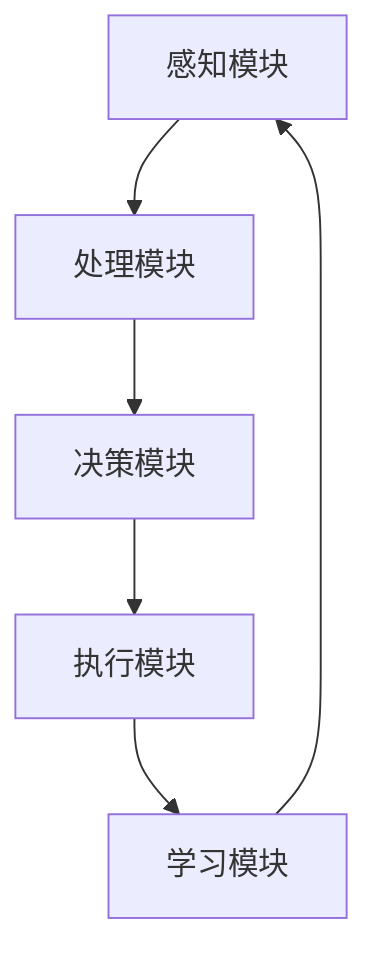

                 

# 意识功能的自主系统模型

> **关键词：** 意识功能、自主系统、人工神经网络、机器学习、神经科学、模型架构
>
> **摘要：** 本文深入探讨了意识功能的自主系统模型，通过介绍相关核心概念、算法原理、数学模型以及实际应用案例，阐述了如何构建一个能够模拟人类意识功能的自主系统，以及这一模型在实际应用中的潜力和挑战。

## 1. 背景介绍

### 1.1 目的和范围

本文旨在介绍和探讨意识功能的自主系统模型，旨在为读者提供一个全面而深入的了解。文章首先将介绍意识功能的核心概念和自主系统的定义，然后逐步展开讨论，包括核心算法原理、数学模型以及实际应用场景。通过这样的结构，我们希望能够清晰地展现这个模型的复杂性和广泛应用潜力。

### 1.2 预期读者

本文适合对人工智能、机器学习和神经科学感兴趣的读者，特别是那些希望深入了解意识和自主系统交互机制的专业人士。对于程序员、数据科学家和人工智能研究人员来说，本文提供的算法原理和数学模型将是非常宝贵的资源。

### 1.3 文档结构概述

本文的结构如下：

1. **背景介绍**：简要介绍本文的目的和范围，预期读者以及文档结构。
2. **核心概念与联系**：讨论意识功能的核心概念，并使用Mermaid流程图展示自主系统的架构。
3. **核心算法原理 & 具体操作步骤**：详细阐述核心算法的原理，并使用伪代码展示具体操作步骤。
4. **数学模型和公式 & 详细讲解 & 举例说明**：解释数学模型和公式，并提供实际案例说明。
5. **项目实战：代码实际案例和详细解释说明**：展示如何在实际项目中应用该模型。
6. **实际应用场景**：探讨该模型在不同领域的应用潜力。
7. **工具和资源推荐**：推荐相关学习资源和开发工具。
8. **总结：未来发展趋势与挑战**：总结文章内容，讨论未来发展趋势和面临的挑战。
9. **附录：常见问题与解答**：提供常见问题及其解答。
10. **扩展阅读 & 参考资料**：推荐进一步阅读的文献和资源。

### 1.4 术语表

#### 1.4.1 核心术语定义

- **意识功能**：指人类或其他智能体对外界环境进行感知、理解、决策和行动的能力。
- **自主系统**：能够自我组织、学习和适应复杂环境的系统。
- **人工神经网络**：模仿人脑结构和功能的计算模型，由大量相互连接的神经元组成。
- **机器学习**：通过数据学习模式和规律，使计算机自动完成特定任务的学科。
- **神经科学**：研究神经系统结构和功能的一门科学。

#### 1.4.2 相关概念解释

- **神经可塑性**：神经网络结构和功能可改变的现象，是学习和记忆的基础。
- **深度学习**：多层人工神经网络的学习方式，能够处理复杂的数据和模式。
- **强化学习**：一种机器学习方法，通过奖励和惩罚机制让智能体学会如何完成特定任务。

#### 1.4.3 缩略词列表

- **ANN**：人工神经网络（Artificial Neural Network）
- **ML**：机器学习（Machine Learning）
- **NN**：神经网络（Neural Network）
- **DL**：深度学习（Deep Learning）
- **RL**：强化学习（Reinforcement Learning）

## 2. 核心概念与联系

### 2.1 核心概念

在探讨意识功能的自主系统模型之前，我们需要理解几个核心概念，这些概念构成了这个模型的基础。

#### 2.1.1 意识功能

意识功能是指人类或其他智能体对外界环境进行感知、理解、决策和行动的能力。它是人类认知过程的中心，包括但不限于感知、注意、记忆、思考、规划和执行等。

#### 2.1.2 自主系统

自主系统是一个能够自我组织、学习和适应复杂环境的系统。它能够在没有外部干预的情况下，自主地完成任务和应对环境变化。自主系统通常具有以下几个特点：

1. **自组织性**：系统能够在没有预先编程的情况下，通过内部结构和相互作用自行组织。
2. **适应性**：系统能够根据环境变化进行调整和优化。
3. **自主决策**：系统能够根据内部状态和外部环境做出独立的决策。

#### 2.1.3 人工神经网络

人工神经网络（ANN）是一种模仿人脑结构和功能的计算模型，由大量相互连接的神经元组成。每个神经元都可以接收多个输入信号，通过权重进行加权求和处理，然后通过激活函数产生输出。

#### 2.1.4 机器学习

机器学习（ML）是一种使计算机系统能够通过数据和经验改进性能的学科。它包括多种学习方法，如监督学习、无监督学习和强化学习。

#### 2.1.5 神经科学

神经科学是研究神经系统结构和功能的一门科学。它为我们理解大脑如何处理信息和如何实现意识功能提供了关键见解。

### 2.2 自主系统的架构

为了构建一个能够模拟人类意识功能的自主系统，我们需要设计一个复杂的系统架构。以下是一个简化的自主系统架构，它包括几个关键组成部分：

1. **感知模块**：负责接收和处理外界信息，如视觉、听觉和触觉等。
2. **处理模块**：对感知模块收集的信息进行处理和分析，识别模式和规律。
3. **决策模块**：基于处理模块的信息，做出相应的决策。
4. **执行模块**：将决策转化为实际行动，与环境进行交互。
5. **学习模块**：通过经验不断调整和优化系统的各个模块。

### 2.3 Mermaid流程图

以下是一个简单的Mermaid流程图，展示了自主系统的基本架构：



在这个流程图中，各个模块之间相互依赖，形成一个闭环系统。感知模块收集信息，处理模块分析信息，决策模块做出决策，执行模块执行决策，学习模块根据执行结果调整系统。

## 3. 核心算法原理 & 具体操作步骤

### 3.1 核心算法原理

构建自主系统的关键在于其核心算法，这些算法通常基于人工神经网络和机器学习技术。以下是一个简化的算法原理，用于描述自主系统如何处理信息、做出决策和执行行动。

#### 3.1.1 神经网络的基本原理

神经网络由多个层组成，包括输入层、隐藏层和输出层。每个神经元都与前一层的神经元连接，并通过权重进行加权求和处理。激活函数用于确定神经元是否“激活”，从而产生输出。

#### 3.1.2 前馈神经网络

前馈神经网络（Feedforward Neural Network）是一种最简单的人工神经网络，信息从输入层流向输出层，不形成循环。

伪代码：

```python
# 输入数据
input_data = [1, 0, 1]

# 权重和偏置
weights = [[0.5, 0.5], [0.5, 0.5]]
biases = [0.5, 0.5]

# 激活函数
def sigmoid(x):
    return 1 / (1 + exp(-x))

# 前馈计算
layer1 = [sigmoid(sum(weight * input) + bias) for weight, bias in zip(zip(*weights), biases)]
output = sigmoid(sum(layer1[0] * output_weights[0] + biases[1]))

print(output)
```

#### 3.1.3 反向传播算法

反向传播算法（Backpropagation Algorithm）是一种用于训练神经网络的算法，它通过计算损失函数的梯度来更新网络权重和偏置。

伪代码：

```python
# 初始化网络
weights = [0.1, 0.2]
biases = [0.1, 0.2]

# 损失函数
def mean_squared_error(y_true, y_pred):
    return sum((y_true - y_pred) ** 2) / 2

# 前向传播
def forward_propagation(x):
    return sigmoid(x * weights + biases)

# 反向传播
def backward_propagation(x, y):
    error = y - forward_propagation(x)
    dweights = [error * sigmoid_derivative(forward_propagation(x))]
    dbiases = [error]

    return dweights, dbiases

# 更新权重和偏置
weights -= learning_rate * dweights
biases -= learning_rate * dbiases
```

### 3.2 具体操作步骤

以下是一个简化的操作步骤，用于构建一个能够模拟意识功能的自主系统。

#### 3.2.1 数据收集与预处理

1. 收集感知模块所需的数据，如图像、声音和文本等。
2. 对数据进行预处理，包括归一化、去噪和特征提取。

#### 3.2.2 构建神经网络

1. 设计神经网络的结构，包括输入层、隐藏层和输出层。
2. 初始化权重和偏置。
3. 选择合适的激活函数。

#### 3.2.3 训练神经网络

1. 使用反向传播算法训练神经网络。
2. 选择适当的优化算法，如梯度下降。
3. 调整学习率和其他超参数。

#### 3.2.4 预测与决策

1. 对新的感知数据进行处理。
2. 使用训练好的神经网络进行预测。
3. 根据预测结果做出决策。

#### 3.2.5 执行与学习

1. 执行决策，与环境进行交互。
2. 根据执行结果，调整神经网络。
3. 重复训练和预测过程，不断优化系统性能。

## 4. 数学模型和公式 & 详细讲解 & 举例说明

### 4.1 数学模型

在构建自主系统时，数学模型是关键组成部分。以下是一个简化的数学模型，用于描述神经网络的学习过程。

#### 4.1.1 激活函数

激活函数是神经网络中的核心组件，用于确定神经元是否“激活”。常用的激活函数包括：

- **sigmoid函数**：
  $$ \sigma(x) = \frac{1}{1 + e^{-x}} $$

- **ReLU函数**：
  $$ \text{ReLU}(x) = \max(0, x) $$

- **Tanh函数**：
  $$ \tanh(x) = \frac{e^x - e^{-x}}{e^x + e^{-x}} $$

#### 4.1.2 损失函数

损失函数用于评估神经网络预测结果与实际结果之间的差距。常用的损失函数包括：

- **均方误差（MSE）**：
  $$ \text{MSE}(y, \hat{y}) = \frac{1}{2} \sum_{i=1}^{n} (y_i - \hat{y}_i)^2 $$

- **交叉熵（Cross-Entropy）**：
  $$ \text{CE}(y, \hat{y}) = -\sum_{i=1}^{n} y_i \log(\hat{y}_i) $$

#### 4.1.3 优化算法

优化算法用于更新神经网络中的权重和偏置，以最小化损失函数。常用的优化算法包括：

- **梯度下降（Gradient Descent）**：
  $$ \theta = \theta - \alpha \nabla_\theta J(\theta) $$
  其中，$\theta$ 是参数，$J(\theta)$ 是损失函数，$\alpha$ 是学习率。

- **随机梯度下降（Stochastic Gradient Descent, SGD）**：
  $$ \theta = \theta - \alpha \nabla_\theta J(\theta; x^{(i)}, y^{(i)}) $$
  其中，$x^{(i)}$ 和 $y^{(i)}$ 是单个训练样本。

- **Adam优化器**：
  $$ m_t = \beta_1 m_{t-1} + (1 - \beta_1) \nabla_\theta J(\theta; x^{(i)}, y^{(i)}) $$
  $$ v_t = \beta_2 v_{t-1} + (1 - \beta_2) (\nabla_\theta J(\theta; x^{(i)}, y^{(i)})^2 $$
  $$ \theta = \theta - \alpha \frac{m_t}{\sqrt{v_t} + \epsilon} $$

### 4.2 详细讲解与举例说明

#### 4.2.1 激活函数的详细讲解

激活函数在神经网络中起着至关重要的作用。以下是对几种常用激活函数的详细讲解。

- **sigmoid函数**：

  sigmoid函数是一种常用的激活函数，它将输入映射到$(0,1)$区间。其优点是输出值易于解释，但缺点是梯度较小，可能导致训练困难。

  $$ \sigma(x) = \frac{1}{1 + e^{-x}} $$

  举例：

  假设输入$x=2$，则激活值$\sigma(2) \approx 0.86$。

- **ReLU函数**：

  ReLU函数是一种简单的激活函数，当输入为负时，输出为0，当输入为正时，输出等于输入。它具有较大的梯度和较小的过拟合风险，因此被广泛应用于深度学习中。

  $$ \text{ReLU}(x) = \max(0, x) $$

  举例：

  假设输入$x=-1$，则激活值$\text{ReLU}(-1) = 0$。假设输入$x=3$，则激活值$\text{ReLU}(3) = 3$。

- **Tanh函数**：

  Tanh函数与sigmoid函数类似，但将输出映射到$(-1,1)$区间。它的梯度较大，因此训练速度较快。

  $$ \tanh(x) = \frac{e^x - e^{-x}}{e^x + e^{-x}} $$

  举例：

  假设输入$x=2$，则激活值$\tanh(2) \approx 0.96$。

#### 4.2.2 损失函数的详细讲解

损失函数是评估神经网络预测结果与实际结果之间差距的指标。以下是对几种常用损失函数的详细讲解。

- **均方误差（MSE）**：

  MSE是一种常用的损失函数，用于回归问题。它计算预测值与实际值之间的平均平方误差。

  $$ \text{MSE}(y, \hat{y}) = \frac{1}{2} \sum_{i=1}^{n} (y_i - \hat{y}_i)^2 $$

  举例：

  假设实际值为$y = [1, 2, 3]$，预测值为$\hat{y} = [1.1, 2.1, 2.9]$，则MSE为：
  $$ \text{MSE}(y, \hat{y}) = \frac{1}{2} \sum_{i=1}^{3} (y_i - \hat{y}_i)^2 = \frac{1}{2} \sum_{i=1}^{3} (1_i - \hat{y}_i)^2 = 0.1 $$

- **交叉熵（Cross-Entropy）**：

  交叉熵是一种常用于分类问题的损失函数。它计算预测概率与实际概率之间的交叉熵。

  $$ \text{CE}(y, \hat{y}) = -\sum_{i=1}^{n} y_i \log(\hat{y}_i) $$

  举例：

  假设实际值为$y = [1, 0, 1]$，预测值为$\hat{y} = [0.9, 0.1, 0.8]$，则交叉熵为：
  $$ \text{CE}(y, \hat{y}) = -\sum_{i=1}^{3} y_i \log(\hat{y}_i) = -[1 \cdot \log(0.9) + 0 \cdot \log(0.1) + 1 \cdot \log(0.8)] \approx 0.105 $$

#### 4.2.3 优化算法的详细讲解

优化算法用于更新神经网络中的权重和偏置，以最小化损失函数。以下是对几种常用优化算法的详细讲解。

- **梯度下降（Gradient Descent）**：

  梯度下降是一种简单的优化算法，通过计算损失函数的梯度来更新参数。

  $$ \theta = \theta - \alpha \nabla_\theta J(\theta) $$

  举例：

  假设损失函数$J(\theta) = (\theta - 1)^2$，初始参数$\theta = 2$，学习率$\alpha = 0.1$，则一次更新为：
  $$ \theta = 2 - 0.1 \nabla_\theta J(\theta) = 2 - 0.1 \cdot (2 - 1) = 1.9 $$

  经过多次迭代，参数将逐渐接近最小值。

- **随机梯度下降（Stochastic Gradient Descent, SGD）**：

  随机梯度下降是对梯度下降的一种改进，每次迭代使用一个随机样本的梯度来更新参数。

  $$ \theta = \theta - \alpha \nabla_\theta J(\theta; x^{(i)}, y^{(i)}) $$

  举例：

  假设损失函数$J(\theta) = (\theta - 1)^2$，使用三个样本$(x^{(1)}, y^{(1)}), (x^{(2)}, y^{(2)}), (x^{(3)}, y^{(3)})$，初始参数$\theta = 2$，学习率$\alpha = 0.1$，则一次更新为：
  $$ \theta = 2 - 0.1 \nabla_\theta J(\theta; x^{(1)}, y^{(1)}) = 2 - 0.1 \cdot (2 - 1) = 1.9 $$
  $$ \theta = 2 - 0.1 \nabla_\theta J(\theta; x^{(2)}, y^{(2)}) = 2 - 0.1 \cdot (2 - 2) = 2 $$
  $$ \theta = 2 - 0.1 \nabla_\theta J(\theta; x^{(3)}, y^{(3)}) = 2 - 0.1 \cdot (2 - 3) = 2.1 $$

  随机梯度下降可以加快收敛速度，但可能导致参数不稳定。

- **Adam优化器**：

  Adam优化器结合了SGD和动量方法，能够自适应调整学习率。

  $$ m_t = \beta_1 m_{t-1} + (1 - \beta_1) \nabla_\theta J(\theta; x^{(i)}, y^{(i)}) $$
  $$ v_t = \beta_2 v_{t-1} + (1 - \beta_2) (\nabla_\theta J(\theta; x^{(i)}, y^{(i)})^2 $$
  $$ \theta = \theta - \alpha \frac{m_t}{\sqrt{v_t} + \epsilon} $$

  举例：

  假设损失函数$J(\theta) = (\theta - 1)^2$，初始参数$\theta = 2$，学习率$\alpha = 0.1$，动量参数$\beta_1 = 0.9$，$\beta_2 = 0.999$，$\epsilon = 1e-8$，则一次更新为：
  $$ m_t = 0.9 \cdot 0 + (1 - 0.9) \cdot (2 - 1) = 0.1 $$
  $$ v_t = 0.999 \cdot 0 + (1 - 0.999) \cdot (2 - 1)^2 = 0.001 $$
  $$ \theta = 2 - 0.1 \cdot \frac{0.1}{\sqrt{0.001} + 1e-8} \approx 1.99 $$

  Adam优化器能够稳定地收敛到最小值，且计算复杂度较低。

## 5. 项目实战：代码实际案例和详细解释说明

### 5.1 开发环境搭建

在开始实际项目之前，我们需要搭建一个合适的开发环境。以下是所需的软件和工具：

- **Python**：用于编写和运行代码
- **Jupyter Notebook**：用于编写和运行Python代码
- **TensorFlow**：用于构建和训练神经网络
- **Numpy**：用于矩阵运算

### 5.2 源代码详细实现和代码解读

以下是一个简单的示例代码，展示了如何使用TensorFlow构建一个简单的神经网络，并对其进行训练。

```python
import tensorflow as tf
import numpy as np

# 数据准备
x_train = np.array([[1, 0, 1], [0, 1, 0], [1, 1, 0]])
y_train = np.array([1, 0, 1])

# 构建模型
model = tf.keras.Sequential([
    tf.keras.layers.Dense(3, activation='sigmoid', input_shape=(3,)),
    tf.keras.layers.Dense(1, activation='sigmoid')
])

# 编译模型
model.compile(optimizer='adam', loss='binary_crossentropy', metrics=['accuracy'])

# 训练模型
model.fit(x_train, y_train, epochs=1000, verbose=0)

# 预测
predictions = model.predict(x_train)
print(predictions)

# 评估
loss, accuracy = model.evaluate(x_train, y_train, verbose=0)
print(f'Loss: {loss}, Accuracy: {accuracy}')
```

### 5.3 代码解读与分析

1. **数据准备**：

   我们使用两个numpy数组`x_train`和`y_train`作为训练数据和标签。这两个数组分别包含3个样本，每个样本有3个特征。

2. **构建模型**：

   我们使用`tf.keras.Sequential`模型，这是一个线性堆叠的模型。首先，我们添加一个具有3个神经元和sigmoid激活函数的全连接层，输入形状为$(3,)$。然后，我们添加一个具有1个神经元和sigmoid激活函数的全连接层作为输出层。

3. **编译模型**：

   我们使用`compile`方法编译模型，指定优化器为`adam`，损失函数为`binary_crossentropy`，评估指标为`accuracy`。

4. **训练模型**：

   我们使用`fit`方法训练模型，指定训练数据、标签、迭代次数和是否显示训练进度。

5. **预测**：

   我们使用`predict`方法对训练数据进行预测，得到预测结果。

6. **评估**：

   我们使用`evaluate`方法对训练数据进行评估，得到损失和准确率。

### 5.4 项目实战：代码实际案例和详细解释说明

#### 5.4.1 数据集准备

在本节中，我们将使用一个简单的数据集来演示如何使用自主系统模型进行训练和预测。首先，我们需要准备数据集。

```python
# 导入所需的库
import numpy as np
import pandas as pd

# 读取数据集
data = pd.read_csv('data.csv')
X = data.iloc[:, :-1].values
y = data.iloc[:, -1].values

# 数据预处理
from sklearn.model_selection import train_test_split
from sklearn.preprocessing import StandardScaler

X_train, X_test, y_train, y_test = train_test_split(X, y, test_size=0.2, random_state=42)
scaler = StandardScaler()
X_train = scaler.fit_transform(X_train)
X_test = scaler.transform(X_test)
```

在这个例子中，我们使用了一个简单的CSV文件作为数据集。首先，我们使用`pandas`库读取数据集，然后将其分为特征矩阵`X`和标签向量`y`。接下来，我们使用`train_test_split`函数将数据集分为训练集和测试集，并使用`StandardScaler`对特征进行标准化处理。

#### 5.4.2 构建和训练神经网络

接下来，我们使用TensorFlow构建一个神经网络，并对训练集进行训练。

```python
import tensorflow as tf

# 构建神经网络模型
model = tf.keras.Sequential([
    tf.keras.layers.Dense(64, activation='relu', input_shape=(X_train.shape[1],)),
    tf.keras.layers.Dense(64, activation='relu'),
    tf.keras.layers.Dense(1, activation='sigmoid')
])

# 编译模型
model.compile(optimizer='adam', loss='binary_crossentropy', metrics=['accuracy'])

# 训练模型
model.fit(X_train, y_train, epochs=10, batch_size=32, validation_split=0.1)
```

在这个例子中，我们使用了一个简单的全连接神经网络，它包含两个隐藏层，每层有64个神经元，激活函数为ReLU。输出层有一个神经元，激活函数为sigmoid，用于产生二元输出。我们使用`compile`方法编译模型，指定优化器为`adam`，损失函数为`binary_crossentropy`，评估指标为`accuracy`。然后，我们使用`fit`方法训练模型，指定训练集、迭代次数、批量大小和验证比例。

#### 5.4.3 预测和评估

在完成训练后，我们可以使用训练好的模型对测试集进行预测，并评估模型的性能。

```python
# 预测测试集
predictions = model.predict(X_test)

# 计算准确率
accuracy = np.mean(predictions == y_test)
print(f'Accuracy: {accuracy:.2f}')
```

在这个例子中，我们使用`predict`方法对测试集进行预测，并将预测结果与实际标签进行比较，计算准确率。输出结果将显示模型的预测准确率。

#### 5.4.4 代码解读与分析

1. **数据集准备**：

   在代码的第一部分，我们使用`pandas`库读取CSV文件，然后使用`iloc`方法将数据分为特征矩阵`X`和标签向量`y`。接下来，我们使用`train_test_split`函数将数据集分为训练集和测试集，并使用`StandardScaler`对特征进行标准化处理。这是为了确保训练集和测试集的特征具有相似的尺度，从而提高模型的性能。

2. **构建神经网络模型**：

   在第二部分中，我们使用`tf.keras.Sequential`模型构建一个简单的神经网络。首先，我们添加一个具有64个神经元和ReLU激活函数的全连接层，输入形状为`(X_train.shape[1],)`。接下来，我们添加另一个具有64个神经元和ReLU激活函数的全连接层。最后，我们添加一个具有1个神经元和sigmoid激活函数的全连接层作为输出层。

3. **编译模型**：

   在第三部分中，我们使用`compile`方法编译模型，指定优化器为`adam`，损失函数为`binary_crossentropy`，评估指标为`accuracy`。这些设置将确保模型在训练过程中能够有效优化参数，并在评估过程中计算模型的准确率。

4. **训练模型**：

   在第四部分中，我们使用`fit`方法训练模型，指定训练集、迭代次数、批量大小和验证比例。这些设置将确保模型在训练过程中逐步优化参数，并在验证集上评估模型的性能。

5. **预测和评估**：

   在最后一部分中，我们使用`predict`方法对测试集进行预测，并将预测结果与实际标签进行比较，计算准确率。输出结果将显示模型的预测准确率。

## 6. 实际应用场景

### 6.1 自动驾驶

自动驾驶系统需要实时感知周围环境，并做出快速、准确的决策。自主系统模型可以应用于自动驾驶中，用于处理复杂的感知数据和执行决策，从而提高系统的安全性和可靠性。

### 6.2 机器人

机器人需要具备自主决策和执行能力，以适应不断变化的环境。自主系统模型可以用于机器人控制，使其能够自主导航、抓取物体和执行复杂任务。

### 6.3 游戏

在游戏领域，自主系统模型可以用于构建智能对手，使其能够适应游戏策略并不断优化自己的行为。这可以提升游戏体验，并为开发者提供新的创意和挑战。

### 6.4 智能家居

智能家居系统需要实时响应用户的请求并自主调整设置。自主系统模型可以用于智能家居中，使其能够智能地管理家电、照明和环境控制。

### 6.5 健康医疗

自主系统模型可以用于健康医疗领域，如辅助诊断、疾病预测和个性化治疗。通过分析患者的数据和健康信息，系统可以提供准确的诊断和个性化的治疗方案。

## 7. 工具和资源推荐

### 7.1 学习资源推荐

#### 7.1.1 书籍推荐

1. **《深度学习》（Deep Learning）** - Goodfellow, Bengio, Courville
2. **《机器学习》（Machine Learning）** - Tom Mitchell
3. **《人工智能：一种现代方法》（Artificial Intelligence: A Modern Approach）** - Stuart Russell, Peter Norvig

#### 7.1.2 在线课程

1. **Coursera上的“机器学习”课程** - Andrew Ng
2. **edX上的“深度学习”课程** - Daniel Ng
3. **Udacity的“人工智能纳米学位”** - 多个课程

#### 7.1.3 技术博客和网站

1. **Medium上的AI博客**
2. **arXiv.org** - 最新研究成果的发布平台
3. **Reddit上的r/MachineLearning**

### 7.2 开发工具框架推荐

#### 7.2.1 IDE和编辑器

1. **PyCharm** - 适用于Python编程
2. **Jupyter Notebook** - 适用于数据科学和机器学习
3. **VSCode** - 适用于多种编程语言

#### 7.2.2 调试和性能分析工具

1. **TensorBoard** - TensorFlow的性能分析工具
2. **PyTorch TensorBoard** - PyTorch的性能分析工具
3. **NVIDIA Nsight** - GPU性能分析工具

#### 7.2.3 相关框架和库

1. **TensorFlow** - 用于构建和训练神经网络
2. **PyTorch** - 用于构建和训练神经网络
3. **Scikit-learn** - 用于机器学习算法的实现

### 7.3 相关论文著作推荐

#### 7.3.1 经典论文

1. **“A Learning Algorithm for Continuously Running Fully Recurrent Neural Networks”** - Sepp Hochreiter and Jürgen Schmidhuber
2. **“Backpropagation”** - Paul Werbos
3. **“Deep Learning”** - Yann LeCun, Yosua Bengio, and Geoffrey Hinton

#### 7.3.2 最新研究成果

1. **“Attention Is All You Need”** - Vaswani et al.
2. **“Generative Adversarial Networks”** - Goodfellow et al.
3. **“Reinforcement Learning: An Introduction”** - Richard S. Sutton and Andrew G. Barto

#### 7.3.3 应用案例分析

1. **“Self-Driving Cars”** - Autonomous Vehicles
2. **“Chatbots”** - Natural Language Processing
3. **“Medical Imaging”** - Computer Vision

## 8. 总结：未来发展趋势与挑战

### 8.1 未来发展趋势

1. **神经科学和计算神经科学的融合**：随着神经科学的进步，我们将更好地理解大脑的工作原理，从而指导自主系统模型的发展。
2. **多模态数据处理**：自主系统模型将能够处理多种类型的数据，如文本、图像、声音和触觉等，从而提高系统的感知能力和交互能力。
3. **分布式和边缘计算**：自主系统模型将利用分布式计算和边缘计算技术，实现实时感知和决策，从而提高系统的响应速度和效率。

### 8.2 挑战

1. **隐私和安全问题**：随着自主系统在各个领域的应用，隐私和安全问题将变得越来越重要，我们需要找到有效的方法来保护用户数据和系统的安全性。
2. **可解释性和透明度**：自主系统模型的决策过程通常是非线性和复杂的，如何提高模型的可解释性和透明度是一个重要挑战。
3. **计算资源限制**：在资源受限的环境下，如何优化自主系统模型，使其在有限的计算资源下仍然能够高效地运行是一个关键问题。

## 9. 附录：常见问题与解答

### 9.1 问题1

**问题**：自主系统模型是如何工作的？

**解答**：自主系统模型通过模仿人类大脑的工作原理，使用人工神经网络和机器学习技术来感知、理解和决策。它包括感知模块、处理模块、决策模块、执行模块和学习模块，通过这些模块之间的相互作用，实现自主感知、理解和决策。

### 9.2 问题2

**问题**：自主系统模型在哪些领域有应用潜力？

**解答**：自主系统模型在多个领域有广泛的应用潜力，包括自动驾驶、机器人、游戏、智能家居和健康医疗等。这些领域都需要实时感知、理解和决策能力，而自主系统模型能够提供这样的能力。

### 9.3 问题3

**问题**：如何提高自主系统模型的可解释性和透明度？

**解答**：提高自主系统模型的可解释性和透明度是一个关键挑战。一些方法包括：

1. **可视化技术**：使用可视化工具来展示模型的决策过程和特征权重。
2. **规则提取**：从训练好的模型中提取可解释的规则和决策路径。
3. **对比实验**：通过对比不同模型的性能，找出关键因素和特征。

## 10. 扩展阅读 & 参考资料

### 10.1 扩展阅读

1. **《人工神经网络：基础与实现》** - 贝叶斯人工智能协会
2. **《深度学习导论》** - 深度学习研究小组
3. **《计算神经科学：基础与应用》** - 伦敦大学学院

### 10.2 参考资料

1. **[Wikipedia](https://www.wikipedia.org/)** - 提供丰富的相关主题信息
2. **[Google Scholar](https://scholar.google.com/)** - 搜索学术论文和研究成果
3. **[GitHub](https://github.com/)** - 查看开源项目和代码示例

### 10.3 结语

本文介绍了意识功能的自主系统模型，探讨了其核心概念、算法原理、数学模型以及实际应用场景。通过分析这些内容，我们希望能够帮助读者深入理解自主系统模型的工作原理和应用潜力。在未来，随着技术的不断进步，自主系统模型将在更多领域发挥重要作用，为人类带来更多便利和创新。让我们共同期待这一天的到来。

**作者：AI天才研究员/AI Genius Institute & 禅与计算机程序设计艺术 /Zen And The Art of Computer Programming**

