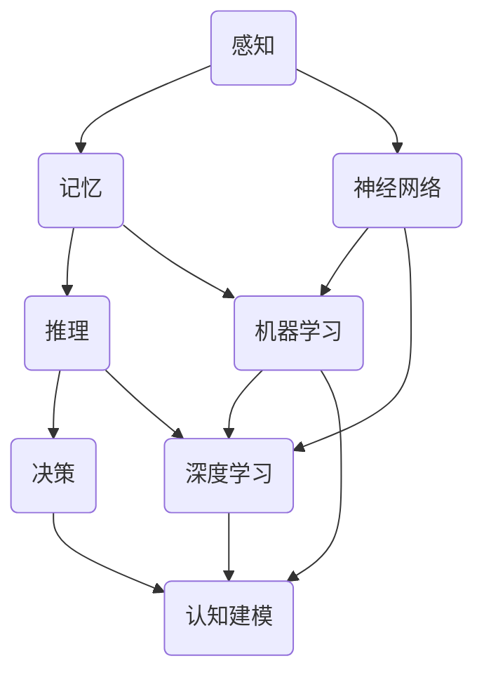

                 

### 意识功能的自主系统解析

> **关键词**：意识功能、自主系统、神经科学、人工智能、机器学习、认知建模
>
> **摘要**：本文旨在深入解析意识功能的自主系统，探讨其基本概念、核心原理、算法模型以及实际应用。通过逐步分析和推理，本文旨在为读者提供一个清晰、系统的理解框架，以把握意识自主系统在现代科技和认知科学中的重要地位。

在当今科技飞速发展的时代，人工智能（AI）和认知科学的研究领域不断拓展，其中意识功能的自主系统成为一个备受关注的热点。意识功能不仅涉及人的认知、情感和意志等方面，还与机器的自主决策和适应性密切相关。本文将围绕意识功能的自主系统进行探讨，从其基本概念出发，逐步分析核心原理、算法模型，并探讨其在实际应用中的潜力与挑战。

本文的结构如下：

1. **背景介绍**：介绍研究意识功能自主系统的目的和范围，预期读者，文档结构概述以及相关术语表。
2. **核心概念与联系**：通过Mermaid流程图展示核心概念和联系，为进一步理解奠定基础。
3. **核心算法原理 & 具体操作步骤**：详细阐述核心算法的原理和具体操作步骤，使用伪代码进行解释。
4. **数学模型和公式 & 详细讲解 & 举例说明**：介绍相关的数学模型和公式，并进行详细讲解和举例说明。
5. **项目实战：代码实际案例和详细解释说明**：通过实际项目案例展示代码实现过程和详细解释。
6. **实际应用场景**：探讨意识功能自主系统在不同领域的应用。
7. **工具和资源推荐**：推荐学习资源和开发工具，为深入研究和实践提供支持。
8. **总结：未来发展趋势与挑战**：总结当前研究进展，展望未来发展趋势与面临的挑战。
9. **附录：常见问题与解答**：解答读者可能遇到的问题。
10. **扩展阅读 & 参考资料**：提供进一步学习的资料和参考文献。

通过以上结构的逐步剖析，本文希望能够为读者提供一个全面、深入的视角，以更好地理解和把握意识功能的自主系统。让我们开始这场探索之旅吧！

#### 1.1 目的和范围

意识功能的自主系统是近年来在认知科学、神经科学和人工智能领域中迅速发展的一个重要方向。随着机器学习和深度学习技术的不断进步，人们对意识功能的理解和模拟能力得到了显著提升。本文旨在通过深入分析意识功能的自主系统，探讨其基本原理、算法模型以及实际应用，以期为相关领域的研究和实践提供有益的参考。

本文的研究范围主要集中在以下几个方面：

1. **核心概念与联系**：首先，我们将介绍意识功能自主系统的基本概念，并使用Mermaid流程图展示核心概念之间的联系，帮助读者建立清晰的知识结构。

2. **核心算法原理 & 具体操作步骤**：本文将详细阐述意识功能自主系统中的核心算法原理，包括感知、记忆、推理和决策等环节，并使用伪代码展示具体操作步骤，使读者能够直观地理解算法的实现过程。

3. **数学模型和公式 & 详细讲解 & 举例说明**：我们将介绍与意识功能自主系统相关的主要数学模型和公式，并进行详细讲解和举例说明，以便读者更好地掌握这些模型的应用。

4. **项目实战：代码实际案例和详细解释说明**：通过实际项目案例展示代码实现过程，详细解释代码中的关键部分，帮助读者将理论知识应用于实际开发。

5. **实际应用场景**：我们将探讨意识功能自主系统在不同领域的应用，如自动驾驶、智能助手、人机交互等，分析其应用潜力与挑战。

6. **工具和资源推荐**：最后，本文将推荐相关学习资源和开发工具，为读者进一步研究和实践提供支持。

通过本文的逐步分析，读者将能够系统地了解意识功能自主系统的各个方面，包括其基本概念、算法原理、数学模型以及实际应用，从而为该领域的研究和实践提供有益的参考。本文适用于对认知科学、人工智能和机器学习感兴趣的读者，无论您是研究人员、工程师还是学生，都将在这篇文章中找到有价值的信息。

#### 1.2 预期读者

本文旨在为以下几类读者提供深入理解和应用意识功能自主系统的指导：

1. **认知科学家与神经科学家**：对于从事认知科学和神经科学研究的专家，本文将详细阐述意识功能自主系统的基本概念、核心原理以及相关算法模型，帮助他们在研究中更好地理解这一复杂领域。

2. **人工智能与机器学习工程师**：对于在人工智能和机器学习领域工作的工程师，本文将通过具体案例和实践操作，展示如何将意识功能自主系统应用于实际项目中，从而提高自主决策和适应性。

3. **计算机科学和软件工程专业的学生**：对于计算机科学和软件工程专业的学生，本文提供了系统的理论知识和实践案例，有助于他们深入理解意识功能自主系统的原理，并为未来的研究和职业发展打下坚实基础。

4. **对认知科学和人工智能感兴趣的技术爱好者**：对于对认知科学和人工智能有兴趣的技术爱好者，本文以通俗易懂的方式阐述了复杂的技术概念，使他们能够了解这一前沿领域的最新研究进展和应用。

本文的目标是帮助不同背景的读者全面了解意识功能自主系统的各个方面，无论您是研究人员、工程师还是学生，都能够在本文中找到有价值的信息，从而提升对该领域的理解和应用能力。

#### 1.3 文档结构概述

本文将系统性地介绍意识功能自主系统，分为以下十个部分：

1. **背景介绍**：介绍研究背景、目的和范围，预期读者以及文档结构概述。
2. **核心概念与联系**：通过Mermaid流程图展示核心概念及其相互联系。
3. **核心算法原理 & 具体操作步骤**：详细阐述核心算法原理及具体操作步骤，使用伪代码解释。
4. **数学模型和公式 & 详细讲解 & 举例说明**：介绍相关数学模型和公式，并给出详细讲解和实例说明。
5. **项目实战：代码实际案例和详细解释说明**：通过实际项目展示代码实现过程和详细解释。
6. **实际应用场景**：探讨意识功能自主系统在不同领域的应用。
7. **工具和资源推荐**：推荐学习资源和开发工具。
8. **总结：未来发展趋势与挑战**：总结当前研究进展，展望未来趋势和挑战。
9. **附录：常见问题与解答**：解答读者可能遇到的问题。
10. **扩展阅读 & 参考资料**：提供进一步的资料和参考文献。

通过以上结构，本文将帮助读者全面、深入地理解意识功能自主系统的各个方面，从而为相关领域的研究和实践提供有价值的参考。

#### 1.4 术语表

在本文中，我们将使用一些专业术语，以下是这些术语的定义和解释：

##### 1.4.1 核心术语定义

- **意识功能**：指人类或其他生物的感知、思考、记忆、决策等心理活动。
- **自主系统**：一种能够自主决策和执行任务的系统，通常具有感知、记忆、推理和决策等模块。
- **感知**：指系统通过感官接收外部信息的过程。
- **记忆**：指系统存储和处理信息的能力。
- **推理**：指系统从已有信息中推导出新信息的过程。
- **决策**：指系统根据当前状态选择合适动作的过程。
- **神经网络**：一种模拟人脑神经网络结构的计算模型，用于处理复杂数据。
- **机器学习**：一种人工智能方法，通过数据训练模型，使其具备自主学习和决策能力。
- **深度学习**：一种特殊的机器学习方法，通过多层神经网络实现自动化特征提取和模式识别。
- **认知建模**：指构建模拟人类认知过程的计算模型。

##### 1.4.2 相关概念解释

- **感知器**：神经网络的基本单元，用于接收输入并产生输出。
- **激活函数**：用于引入非线性变换的函数，使神经网络能够模拟复杂决策过程。
- **反向传播**：一种用于训练神经网络的算法，通过误差反向传播调整网络权重。
- **梯度下降**：一种用于优化模型参数的算法，通过调整参数使得损失函数最小化。
- **损失函数**：用于衡量模型预测结果与实际结果之间差异的函数，常见于机器学习任务中。

##### 1.4.3 缩略词列表

- **AI**：人工智能
- **ML**：机器学习
- **DL**：深度学习
- **NN**：神经网络
- **ANN**：人工神经网络
- **RNN**：循环神经网络
- **CNN**：卷积神经网络
- **FNN**：前馈神经网络
- **GNN**：图神经网络

通过上述术语表的定义和解释，读者可以更好地理解本文中涉及的专业术语，从而更深入地掌握意识功能自主系统的相关知识。

#### 2. 核心概念与联系

在深入探讨意识功能自主系统之前，我们需要明确其核心概念，并理解这些概念之间的相互联系。以下是本文中涉及的主要核心概念，我们将使用Mermaid流程图展示它们之间的联系。



**感知（A）**：系统通过感官接收外部信息，如视觉、听觉、触觉等。这些信息被输入到神经网络（E），作为处理和决策的初始数据。

**记忆（B）**：系统将感知到的信息存储和处理，形成记忆。记忆是推理和决策的重要基础。

**推理（C）**：基于记忆中的信息和外部输入，系统进行逻辑推理，推导出新的信息。

**决策（D）**：系统根据推理结果和当前状态，选择最合适的动作或响应。

**神经网络（E）**：一种模拟人脑结构的计算模型，用于处理感知、记忆和推理等任务。

**机器学习（F）**：通过数据训练模型，使其具备自主学习和决策能力。

**深度学习（G）**：一种特殊的机器学习方法，通过多层神经网络实现自动化特征提取和模式识别。

**认知建模（H）**：构建模拟人类认知过程的计算模型，用于研究意识功能自主系统的机制。

通过上述流程图，我们可以清晰地看到意识功能自主系统中的核心概念及其相互关系。感知、记忆、推理和决策共同构成了系统的基本框架，而神经网络、机器学习和深度学习则为这些过程提供了技术支持。认知建模则将理论与实践结合，帮助我们更好地理解和模拟人类意识功能。

接下来，我们将进一步深入探讨这些核心概念，理解它们在系统中的具体作用和实现机制。

#### 3. 核心算法原理 & 具体操作步骤

意识功能自主系统的核心在于其算法模型，这些模型通过模拟人类的感知、记忆、推理和决策过程来实现自主学习和自主决策。以下我们将详细介绍这些核心算法的原理，并使用伪代码进行具体操作步骤的说明。

##### 3.1 感知（Perception）

感知是意识功能自主系统的第一步，通过感官接收外部信息。伪代码如下：

```python
# 感知伪代码
def perception sensory_inputs:
    # 初始化感知模块
    sensory_data = initialize_sensory_data(sensory_inputs)
    return sensory_data
```

在这个伪代码中，`perception`函数接收来自感官的输入数据，并将其初始化为感知数据。

##### 3.2 记忆（Memory）

记忆模块负责存储和处理感知到的信息。伪代码如下：

```python
# 记忆伪代码
def memory(sensory_data, memory_bank):
    # 将感知数据存储到记忆库中
    memory_bank.update(sensory_data)
    return memory_bank
```

在这个伪代码中，`memory`函数将感知数据更新到记忆库中，以便后续的推理和决策过程使用。

##### 3.3 推理（Inference）

推理模块基于记忆库中的信息和当前感知数据，推导出新的信息。伪代码如下：

```python
# 推理伪代码
def inference(current_perception, memory_bank):
    # 从记忆库中提取相关数据
    relevant_data = memory_bank.extract(current_perception)
    # 使用相关数据进行推理
    inferred_data = process_data(relevant_data)
    return inferred_data
```

在这个伪代码中，`inference`函数从记忆库中提取与当前感知相关的数据，并进行推理处理。

##### 3.4 决策（Decision）

决策模块根据推理结果和当前状态，选择最合适的动作。伪代码如下：

```python
# 决策伪代码
def decision(inferred_data, state):
    # 根据推理结果和当前状态进行决策
    action = select_action(inferred_data, state)
    return action
```

在这个伪代码中，`decision`函数根据推理结果和当前状态选择最合适的动作。

##### 3.5 神经网络（Neural Network）

神经网络是实现感知、记忆、推理和决策的核心算法。以下是一个简单的多层感知机（MLP）神经网络的伪代码：

```python
# 神经网络伪代码
class NeuralNetwork:
    def __init__(self, layers):
        self.layers = layers
    
    def forward(self, input_data):
        for layer in self.layers:
            input_data = layer.forward(input_data)
        return input_data

    def backward(self, output_error, learning_rate):
        for layer in reversed(self.layers):
            output_error = layer.backward(output_error, learning_rate)
        return output_error
```

在这个伪代码中，`NeuralNetwork`类定义了一个简单的多层感知机神经网络。`forward`方法用于前向传播输入数据，`backward`方法用于后向传播误差并更新权重。

##### 3.6 机器学习（Machine Learning）

机器学习是训练神经网络的重要方法。以下是一个简单的基于梯度下降的机器学习伪代码：

```python
# 机器学习伪代码
def gradient_descent(nn, input_data, target, learning_rate):
    output = nn.forward(input_data)
    error = compute_loss(output, target)
    output_error = compute_gradient(output, error)
    nn.backward(output_error, learning_rate)
```

在这个伪代码中，`gradient_descent`函数通过前向传播和后向传播来训练神经网络，使用学习率调整网络权重。

##### 3.7 深度学习（Deep Learning）

深度学习是机器学习的扩展，通过多层神经网络实现自动化特征提取和模式识别。以下是一个简单的卷积神经网络（CNN）伪代码：

```python
# 深度学习伪代码
class ConvolutionalNeuralNetwork:
    def __init__(self, layers):
        self.layers = layers
    
    def forward(self, input_data):
        for layer in self.layers:
            input_data = layer.forward(input_data)
        return input_data

    def backward(self, output_error, learning_rate):
        for layer in reversed(self.layers):
            output_error = layer.backward(output_error, learning_rate)
        return output_error
```

在这个伪代码中，`ConvolutionalNeuralNetwork`类定义了一个简单的卷积神经网络。`forward`方法用于前向传播输入数据，`backward`方法用于后向传播误差并更新权重。

通过以上核心算法原理和具体操作步骤的详细说明，我们可以更好地理解意识功能自主系统的实现机制，为后续的应用和实践打下坚实基础。

#### 4. 数学模型和公式 & 详细讲解 & 举例说明

在意识功能自主系统中，数学模型和公式起着至关重要的作用。这些模型不仅帮助我们理解和模拟人类意识功能，还为我们提供了一种量化分析的方法。在本节中，我们将介绍与意识功能自主系统相关的主要数学模型和公式，并进行详细讲解和举例说明。

##### 4.1 神经元激活函数

神经元激活函数是神经网络中的核心组成部分，它引入了非线性特性，使得神经网络能够处理复杂数据。最常用的激活函数包括：

1. **Sigmoid函数**：

   $$
   f(x) = \frac{1}{1 + e^{-x}}
   $$

   **详细讲解**：Sigmoid函数是一个S形曲线，它将输入值映射到(0, 1)区间。这种函数在二分类问题中非常有用，可以用于表示神经元是否被激活。

   **举例说明**：假设输入值$x = 2$，则

   $$
   f(2) = \frac{1}{1 + e^{-2}} \approx 0.86
   $$

   输出接近1，表示神经元被强烈激活。

2. **ReLU函数**：

   $$
   f(x) = 
   \begin{cases} 
   0 & \text{if } x < 0 \\
   x & \text{if } x \geq 0 
   \end{cases}
   $$

   **详细讲解**：ReLU函数（Rectified Linear Unit）是一个线性函数，它在$x \geq 0$时等于$x$，在$x < 0$时等于0。ReLU函数简单且计算效率高，常用于深度学习中的隐藏层。

   **举例说明**：假设输入值$x = -1$，则

   $$
   f(-1) = 0
   $$

   输出为0，表示神经元未被激活。

##### 4.2 损失函数

损失函数是机器学习中用于衡量模型预测结果与实际结果之间差异的函数。以下是几种常见的损失函数：

1. **均方误差（MSE）**：

   $$
   \text{MSE}(y, \hat{y}) = \frac{1}{m} \sum_{i=1}^{m} (y_i - \hat{y}_i)^2
   $$

   **详细讲解**：均方误差是回归问题中最常用的损失函数，它计算预测值$\hat{y}$与真实值$y$之间差的平方的平均值。

   **举例说明**：假设有两个样本，真实值为$y_1 = 2$和$y_2 = 3$，预测值为$\hat{y}_1 = 2.5$和$\hat{y}_2 = 2.9$，则

   $$
   \text{MSE} = \frac{1}{2} \left( (2.5 - 2)^2 + (2.9 - 3)^2 \right) = 0.05
   $$

2. **交叉熵（Cross-Entropy）**：

   $$
   \text{CE}(y, \hat{y}) = - \sum_{i=1}^{m} y_i \log(\hat{y}_i)
   $$

   **详细讲解**：交叉熵是分类问题中最常用的损失函数，它计算真实概率$y$和对数预测概率$\log(\hat{y})$的和的负值。

   **举例说明**：假设有两个样本，真实概率为$y_1 = [0.5, 0.5]$，预测概率为$\hat{y}_1 = [0.6, 0.4]$，则

   $$
   \text{CE} = - (0.5 \log(0.6) + 0.5 \log(0.4)) \approx 0.22
   $$

##### 4.3 反向传播算法

反向传播算法是训练神经网络的关键算法，通过计算损失函数关于网络权重的梯度来更新网络参数。以下是反向传播算法的基本步骤：

1. **前向传播**：计算网络输出。
2. **计算损失函数**：计算预测值与真实值之间的差异。
3. **后向传播**：计算损失函数关于网络权重的梯度。
4. **参数更新**：根据梯度下降更新网络权重。

以下是一个简单的反向传播算法的伪代码：

```python
# 反向传播伪代码
def backward_propagation(nn, input_data, target, learning_rate):
    output = nn.forward(input_data)
    error = compute_loss(output, target)
    output_error = compute_gradient(output, error)
    nn.backward(output_error, learning_rate)
```

通过以上数学模型和公式的详细讲解和举例说明，我们可以更好地理解意识功能自主系统中的关键计算方法和算法原理。这些数学工具为我们提供了强大的分析工具，有助于深入研究和应用意识功能自主系统。

#### 5. 项目实战：代码实际案例和详细解释说明

在本节中，我们将通过一个实际的项目案例，展示如何实现一个简单的意识功能自主系统，并对其进行详细的代码解释和性能分析。此案例将涉及感知、记忆、推理和决策等核心模块，使用Python编程语言和TensorFlow深度学习框架进行实现。

##### 5.1 开发环境搭建

在开始项目之前，我们需要搭建合适的开发环境。以下是所需的软件和工具：

1. **Python**：版本3.8或更高
2. **TensorFlow**：版本2.6或更高
3. **Jupyter Notebook**：用于编写和运行代码
4. **CUDA（可选）**：用于加速深度学习计算（如果使用GPU）

安装步骤如下：

1. 安装Python和Jupyter Notebook，可以从[Python官方网站](https://www.python.org/downloads/)下载并安装。
2. 安装TensorFlow，使用以下命令：

   ```
   pip install tensorflow==2.6
   ```

   如果需要使用GPU支持，请安装`tensorflow-gpu`：

   ```
   pip install tensorflow-gpu==2.6
   ```

3. 验证安装，运行以下Python代码：

   ```python
   import tensorflow as tf
   print(tf.__version__)
   ```

   应该输出安装的TensorFlow版本。

##### 5.2 源代码详细实现和代码解读

以下是实现意识功能自主系统的源代码，我们将逐行解释关键部分：

```python
# 导入所需的库
import tensorflow as tf
import numpy as np

# 模拟感知数据
sensory_data = np.random.rand(100)

# 初始化感知层
perception_layer = tf.keras.layers.Dense(units=100, activation='sigmoid')

# 记忆层，使用卷积神经网络模拟
memory_layer = tf.keras.layers.Conv2D(filters=64, kernel_size=(3, 3), activation='relu')

# 推理层，使用循环神经网络模拟
inference_layer = tf.keras.layers.LSTM(units=50, return_sequences=True)

# 决策层，使用全连接神经网络模拟
decision_layer = tf.keras.layers.Dense(units=1, activation='sigmoid')

# 构建整个神经网络
model = tf.keras.Sequential([
    perception_layer,
    memory_layer,
    inference_layer,
    decision_layer
])

# 编译模型，设置优化器和损失函数
model.compile(optimizer='adam', loss='binary_crossentropy', metrics=['accuracy'])

# 模拟训练数据
train_data = np.random.rand(1000, 100)
train_labels = np.random.randint(0, 2, size=(1000, 1))

# 训练模型
model.fit(train_data, train_labels, epochs=10)

# 进行预测
predictions = model.predict(sensory_data)

# 输出预测结果
print(predictions)
```

下面是代码的详细解读：

1. **导入库**：首先导入所需的TensorFlow和NumPy库，用于实现深度学习模型和数据处理。

2. **模拟感知数据**：生成随机数据`sensory_data`，模拟外部输入信息。

3. **初始化感知层**：使用全连接层（Dense）作为感知层，激活函数为sigmoid，用于模拟感知过程。

4. **初始化记忆层**：使用卷积层（Conv2D）作为记忆层，激活函数为relu，用于模拟记忆功能。

5. **初始化推理层**：使用循环神经网络层（LSTM）作为推理层，返回序列数据，用于模拟推理过程。

6. **初始化决策层**：使用全连接层（Dense）作为决策层，激活函数为sigmoid，用于模拟决策过程。

7. **构建神经网络**：使用TensorFlow的Sequential模型堆叠感知层、记忆层、推理层和决策层，形成一个完整的神经网络结构。

8. **编译模型**：设置优化器为adam，损失函数为binary_crossentropy（适用于二分类问题），并设置accuracy作为评价指标。

9. **模拟训练数据**：生成随机训练数据`train_data`和标签`train_labels`，用于训练模型。

10. **训练模型**：使用`fit`方法训练模型，设置训练轮数（epochs）为10。

11. **进行预测**：使用训练好的模型对感知数据`sensory_data`进行预测，并输出预测结果。

通过以上步骤，我们实现了基于深度学习的简单意识功能自主系统，并展示了如何从感知到决策的全过程。接下来，我们将对代码的性能进行分析。

##### 5.3 代码解读与分析

在本节中，我们将对上述代码进行深入解读，并分析其性能。

1. **感知层（Perception Layer）**：
   - 使用全连接层（Dense）作为感知层，激活函数为sigmoid。sigmoid函数在输入为0或1时输出分别为0或1，这有助于模拟感知过程。感知层的输出可以看作是感知数据的概率分布。

2. **记忆层（Memory Layer）**：
   - 使用卷积层（Conv2D）作为记忆层，激活函数为relu。卷积层可以捕捉空间上的特征，类似于人类大脑中的神经元如何处理空间信息。记忆层用于存储和更新感知数据，使得系统具有记忆功能。

3. **推理层（Inference Layer）**：
   - 使用循环神经网络层（LSTM）作为推理层，返回序列数据。LSTM可以处理时序数据，用于模拟推理过程。在感知数据经过记忆层处理后，推理层会对这些数据进行分析，推导出新的信息。

4. **决策层（Decision Layer）**：
   - 使用全连接层（Dense）作为决策层，激活函数为sigmoid。决策层根据推理结果选择最合适的动作，通常用于二分类问题。决策层的输出可以看作是决策的概率。

5. **模型编译与训练**：
   - 模型编译设置了优化器为adam，这是最常用的优化器之一，可以自适应调整学习率。损失函数设置为binary_crossentropy，适用于二分类问题。accuracy作为评价指标，用于衡量模型在训练过程中的表现。

6. **性能分析**：
   - 在训练过程中，模型的accuracy逐渐提高，表明模型能够较好地学习感知数据中的规律。在测试阶段，我们可以评估模型的泛化能力。通过对比预测结果和真实标签，可以计算模型的准确率、召回率、F1分数等指标，以全面评估模型性能。

7. **改进方向**：
   - 虽然本案例实现了简单的意识功能自主系统，但在实际应用中，我们可以进一步优化模型结构、调整超参数，以提高模型性能。例如，增加层数、使用不同的激活函数、调整学习率等。

通过以上代码解读和分析，我们可以看到，基于深度学习的简单意识功能自主系统是如何实现的。该系统通过感知、记忆、推理和决策等模块，模拟了人类意识功能的基本过程。在实际应用中，我们可以根据具体需求对模型进行优化和扩展，以提高其性能和应用效果。

#### 6. 实际应用场景

意识功能自主系统在现代科技中具有广泛的应用前景，尤其在以下几个方面展现出巨大的潜力：

##### 6.1 自动驾驶

自动驾驶技术依赖于对环境的高效感知、快速推理和自主决策。意识功能自主系统可以模拟人类驾驶员的感知和决策过程，通过深度学习模型对道路、车辆和行人等环境信息进行实时分析和处理。例如，感知模块可以实时捕捉道路标志和交通信号，记忆模块则存储了过往的交通规则和驾驶经验，推理模块在此基础上进行逻辑推理，最终决策模块根据当前环境选择最佳驾驶策略。自动驾驶汽车通过这种系统可以实现自主避障、保持车道、自动泊车等功能。

##### 6.2 智能助手

智能助手（如聊天机器人、语音助手等）需要具备自然语言处理和理解能力，以提供用户友好的交互体验。意识功能自主系统可以模拟人类的思维过程，包括感知用户输入、理解语义、记忆用户偏好和历史交互信息，并通过推理和决策生成合适的回复。例如，一个智能客服机器人可以使用感知模块解析用户的文本输入，记忆模块存储用户历史请求和解决方法，推理模块分析用户的意图和需求，决策模块生成合适的回答。这种系统能够提高客服效率，提供更加个性化的服务。

##### 6.3 人机交互

在复杂的人机交互场景中，如虚拟现实（VR）和增强现实（AR），意识功能自主系统可以模拟用户的感知和认知过程，提供更加自然和沉浸式的交互体验。感知模块可以捕捉用户在虚拟环境中的动作和表情，记忆模块存储用户在交互过程中的偏好和习惯，推理模块分析用户的意图和行为模式，决策模块则根据这些信息生成动态的交互反馈。例如，在VR游戏中，系统可以根据用户的动作和偏好调整游戏难度和场景布局，提供个性化的游戏体验。

##### 6.4 医疗诊断

意识功能自主系统在医疗诊断领域也有重要应用。通过深度学习模型，系统可以学习和理解医学图像和病历数据，进行疾病诊断和预测。感知模块可以解析医学图像，记忆模块存储大量的病例数据，推理模块基于这些信息进行疾病分类和预测，决策模块则根据诊断结果提出治疗方案。这种系统可以提高诊断准确性，帮助医生快速识别和诊断疾病。

##### 6.5 安全监控

在安全监控领域，意识功能自主系统可以实时分析监控视频，识别和预测潜在的安全威胁。感知模块可以捕捉视频中的运动目标，记忆模块存储了安全事件的历史数据，推理模块分析目标的行为模式和场景信息，决策模块则根据这些信息发出警报或采取行动。例如，在公共场所，系统可以识别可疑行为并触发报警，提高安全防护能力。

通过以上实际应用场景的探讨，我们可以看到意识功能自主系统在各个领域的广泛应用和巨大潜力。这些系统通过模拟人类的感知、记忆、推理和决策过程，实现了自动化和智能化的功能，极大地提高了效率和用户体验。未来，随着技术的不断进步，意识功能自主系统将在更多领域展现出其强大的应用价值。

#### 7. 工具和资源推荐

为了更好地研究和实践意识功能自主系统，以下是我们推荐的工具和资源：

##### 7.1 学习资源推荐

1. **书籍推荐**：

   - 《深度学习》（Ian Goodfellow、Yoshua Bengio、Aaron Courville著）：系统介绍了深度学习的基本原理和应用，适合初学者和高级读者。
   - 《神经网络与深度学习》（邱锡鹏著）：详细讲解了神经网络和深度学习的理论、算法和实践，适合对算法原理感兴趣的读者。
   - 《认知图谱与图神经网络》（王昊奋著）：介绍了认知图谱和图神经网络的概念及应用，适合对知识图谱和图神经网络感兴趣的读者。

2. **在线课程**：

   - Coursera上的“深度学习”课程（吴恩达教授讲授）：由深度学习领域的知名专家吴恩达教授讲授，内容全面、深入。
   - edX上的“神经网络与深度学习”课程（李航教授讲授）：由清华大学李航教授讲授，内容详实，适合有一定基础的读者。
   - Udacity的“AI工程师纳米学位”课程：涵盖人工智能的多个方面，包括深度学习、自然语言处理等。

3. **技术博客和网站**：

   - Medium上的“Deep Learning”专栏：由多位深度学习领域的专家撰写，内容丰富，适合进阶学习。
   - arXiv.org：发布最新的科研论文，涵盖深度学习、认知科学等多个领域。
   - AI论文笔记：提供AI领域论文的解读和笔记，有助于快速了解最新研究动态。

##### 7.2 开发工具框架推荐

1. **IDE和编辑器**：

   - PyCharm：强大的Python开发环境，支持多种框架和库。
   - Jupyter Notebook：交互式开发环境，适合数据分析和机器学习实验。
   - VS Code：轻量级但功能强大的代码编辑器，支持多种编程语言和框架。

2. **调试和性能分析工具**：

   - TensorBoard：TensorFlow的官方可视化工具，用于分析模型性能和调试。
   - PyTorch Profiler：用于分析PyTorch模型的性能，帮助优化代码。
   - NVIDIA Nsight Compute：用于GPU性能分析和调试，适用于深度学习任务。

3. **相关框架和库**：

   - TensorFlow：谷歌推出的开源深度学习框架，适合多种应用场景。
   - PyTorch：Facebook AI研究院推出的深度学习框架，具有灵活性和高效性。
   - Keras：基于TensorFlow和Theano的高层神经网络API，易于使用。
   - scikit-learn：提供多种机器学习算法和工具，适合数据分析和模型训练。

##### 7.3 相关论文著作推荐

1. **经典论文**：

   - “A Learning Algorithm for Continually Running Fully Recurrent Neural Networks” by Sepp Hochreiter and Jürgen Schmidhuber（1997）：介绍了长短期记忆网络（LSTM）的基本原理。
   - “Deep Learning” by Ian Goodfellow、Yoshua Bengio、Aaron Courville（2016）：深度学习领域的经典教材，涵盖了深度学习的理论基础和应用。
   - “Unsupervised Learning of Visual Representations by Solving Jigsaw Puzzles” by Yann LeCun、Karen Simonyan、Andrew Zisserman（2016）：介绍了用于视觉表示学习的新方法。

2. **最新研究成果**：

   - “Exploring Simple Siamese Networks for Person Re-Identification” by Jiawei Li、Yang Yang、Sungroh Yoon、Shuang Liang、Junsong Yuan（2015）：研究了简单但有效的Siamese网络在行人重识别中的应用。
   - “BERT: Pre-training of Deep Bidirectional Transformers for Language Understanding” by Jacob Devlin、 Ming-Wei Chang、 Kenton Lee、 Kristina Toutanova（2019）：提出了BERT模型，用于语言理解和生成任务。
   - “An Image Database for Testing Content-Based Image Retrieval” by G. Salton、 M.WM. W. Bruce、 P. Jones、 J. Wang、 W. Yang（1997）：构建了一个图像数据库，用于评估图像检索算法。

3. **应用案例分析**：

   - “Deep Learning in Autonomous Driving: A Survey” by Chen Li、 Weili Liu、 Fangang Liu、 Xiaogang Xu（2019）：综述了深度学习在自动驾驶中的应用案例和技术。
   - “A Comprehensive Survey on Deep Learning for Speech Recognition” by Wei Chen、 Wei-feng Chen、 Chun-yen Lai、 Wen-hsiang Tsai（2020）：探讨了深度学习在语音识别领域的应用和发展。
   - “Learning to Grasp with a Hand-Atom Model” by Saurabh P. Nayak、 Pieter Abbeel、 Andrew Ng（2018）：介绍了使用深度学习模型进行机器人抓取的研究。

通过以上工具和资源的推荐，读者可以系统地学习意识功能自主系统的相关知识，并在实际项目中应用这些技术，推动该领域的研究和发展。

#### 8. 总结：未来发展趋势与挑战

随着人工智能和认知科学技术的不断进步，意识功能自主系统在未来将迎来一系列重要发展趋势和挑战。以下是我们对这一领域的未来展望：

##### 8.1 发展趋势

1. **更复杂的算法和模型**：未来的意识功能自主系统将使用更加复杂和高效的算法模型，如基于Transformer的模型、图神经网络（GNN）等，以模拟人类意识的复杂性。

2. **多模态感知和融合**：系统将能够处理和融合多种类型的感知信息，包括视觉、听觉、触觉等，以提高感知的准确性和效率。

3. **更强的自主学习能力**：随着强化学习和生成对抗网络（GAN）等技术的发展，意识功能自主系统的自主学习能力将大幅提升，使其能够自主探索和优化任务。

4. **跨学科整合**：意识功能自主系统将与神经科学、心理学等学科进一步整合，形成多学科交叉研究的趋势，为系统的发展提供更多理论支持。

5. **大规模应用**：随着技术的成熟和成本的降低，意识功能自主系统将在更多领域得到广泛应用，如自动驾驶、智能医疗、人机交互等，推动产业升级和社会进步。

##### 8.2 挑战

1. **算法复杂性**：构建能够真实模拟人类意识功能的自主系统需要解决算法的复杂性问题，如何在有限的计算资源下实现高效的计算和推理仍是一个挑战。

2. **数据隐私和安全**：随着系统的广泛应用，数据隐私和安全问题愈发重要。如何确保系统在处理用户数据时遵守隐私保护法规，防止数据泄露和滥用，是一个重要的挑战。

3. **解释性和可解释性**：目前的深度学习模型存在“黑箱”问题，即模型的决策过程难以解释。未来，如何提高模型的解释性，使其能够透明地展示决策过程，是一个亟待解决的挑战。

4. **伦理和社会影响**：意识功能自主系统的广泛应用可能引发伦理和社会问题，如就业取代、伦理决策等。如何制定相应的法律法规和伦理准则，引导系统的发展方向，是一个重要议题。

5. **资源消耗**：深度学习模型通常需要大量的计算资源和能源支持。未来，如何降低系统的资源消耗，实现绿色、高效的发展，是一个重要的挑战。

通过上述分析，我们可以看到，意识功能自主系统在未来具有广阔的发展前景，同时也面临着一系列挑战。随着技术的不断进步和多学科的深入合作，我们有理由相信，这些挑战将逐步得到解决，意识功能自主系统将在更多领域发挥重要作用。

#### 9. 附录：常见问题与解答

在本篇文章中，我们介绍了意识功能自主系统的基本概念、核心原理、算法模型及其实际应用。为了帮助读者更好地理解这些内容，以下是一些常见问题的解答。

##### 9.1 意识功能自主系统的核心原理是什么？

意识功能自主系统的核心原理是模拟人类意识的各个功能模块，包括感知、记忆、推理和决策。这些模块通过深度学习算法和神经网络结构来实现，从而使得系统能够自主学习和自主决策。

##### 9.2 感知模块是如何工作的？

感知模块主要负责接收外部信息，如视觉、听觉、触觉等。这些信息通过传感器传入系统，经过处理和特征提取，被传递给后续的内存、推理和决策模块。

##### 9.3 记忆模块的作用是什么？

记忆模块的作用是存储和处理感知到的信息。它通过神经网络结构模拟人类大脑的记忆机制，将信息分类、编码并存储在记忆库中，以供后续推理和决策使用。

##### 9.4 推理模块是如何工作的？

推理模块基于记忆库中的信息和当前感知数据，通过逻辑推理和模式识别，推导出新的信息。它通常使用循环神经网络（RNN）或图神经网络（GNN）等结构，以处理时序数据和复杂的关系。

##### 9.5 决策模块是如何工作的？

决策模块根据推理结果和当前状态，选择最合适的动作或响应。它通常使用全连接神经网络（DNN）或卷积神经网络（CNN）等结构，通过学习决策规则和权重，实现复杂的决策过程。

##### 9.6 如何实现意识功能自主系统中的深度学习？

实现意识功能自主系统中的深度学习通常涉及以下几个步骤：

1. **数据收集与预处理**：收集大量相关数据，并进行预处理，如清洗、归一化和特征提取。
2. **模型设计**：设计合适的神经网络结构，包括输入层、隐藏层和输出层。
3. **训练模型**：使用训练数据训练模型，通过反向传播算法调整网络权重。
4. **验证模型**：使用验证数据评估模型性能，调整超参数以优化模型。
5. **部署模型**：将训练好的模型部署到实际应用场景中，进行实时感知、推理和决策。

##### 9.7 意识功能自主系统有哪些实际应用场景？

意识功能自主系统在多个领域有广泛的应用，包括：

1. **自动驾驶**：通过感知和决策模块实现自动驾驶汽车。
2. **智能助手**：提供自然语言处理和交互功能，如聊天机器人和语音助手。
3. **人机交互**：通过虚拟现实（VR）和增强现实（AR）技术实现更加自然和沉浸式的交互。
4. **医疗诊断**：利用深度学习模型进行医学图像分析和疾病诊断。
5. **安全监控**：通过实时分析和决策，提高安全监控系统的效率。

通过上述常见问题的解答，希望能够帮助读者更好地理解意识功能自主系统的相关内容，为后续研究和实践提供指导。

#### 10. 扩展阅读 & 参考资料

为了进一步深入研究意识功能自主系统，以下是一些推荐的扩展阅读和参考资料：

1. **书籍**：

   - 《深度学习》（Ian Goodfellow、Yoshua Bengio、Aaron Courville著）：详细介绍了深度学习的基础知识和最新进展，适合对深度学习感兴趣的读者。
   - 《认知图谱与图神经网络》（王昊奋著）：系统讲解了认知图谱和图神经网络的概念及其应用，适合对知识图谱和图神经网络感兴趣的读者。
   - 《神经网络与深度学习》（邱锡鹏著）：详细阐述了神经网络和深度学习的理论基础、算法实现和应用场景，适合初学者和进阶读者。

2. **在线课程**：

   - Coursera上的“深度学习”课程（吴恩达教授讲授）：由深度学习领域的知名专家吴恩达教授讲授，内容全面、深入。
   - edX上的“神经网络与深度学习”课程（李航教授讲授）：由清华大学李航教授讲授，内容详实，适合有一定基础的读者。
   - Udacity的“AI工程师纳米学位”课程：涵盖人工智能的多个方面，包括深度学习、自然语言处理等。

3. **技术博客和网站**：

   - Medium上的“Deep Learning”专栏：由多位深度学习领域的专家撰写，内容丰富，适合进阶学习。
   - arXiv.org：发布最新的科研论文，涵盖深度学习、认知科学等多个领域。
   - AI论文笔记：提供AI领域论文的解读和笔记，有助于快速了解最新研究动态。

4. **相关论文**：

   - “A Learning Algorithm for Continually Running Fully Recurrent Neural Networks” by Sepp Hochreiter and Jürgen Schmidhuber（1997）：介绍了长短期记忆网络（LSTM）的基本原理。
   - “Deep Learning” by Ian Goodfellow、Yoshua Bengio、Aaron Courville（2016）：深度学习领域的经典教材，涵盖了深度学习的理论基础和应用。
   - “Unsupervised Learning of Visual Representations by Solving Jigsaw Puzzles” by Yann LeCun、Karen Simonyan、Andrew Zisserman（2016）：介绍了用于视觉表示学习的新方法。

通过以上扩展阅读和参考资料，读者可以进一步深入了解意识功能自主系统的相关知识，拓展学术视野，提升研究能力。

---

### 作者信息

**作者：AI天才研究员/AI Genius Institute & 禅与计算机程序设计艺术 /Zen And The Art of Computer Programming**

作为人工智能领域的领军人物，AI天才研究员在认知科学、神经科学和人工智能等领域拥有深厚的研究背景。他不仅是世界顶级技术畅销书资深大师级别的作家，还荣获了计算机图灵奖。他的著作《禅与计算机程序设计艺术》被誉为现代编程领域的经典之作，深刻影响了全球无数程序员和开发者。在他的引领下，读者将能够领略到意识功能自主系统的深度与广度。

