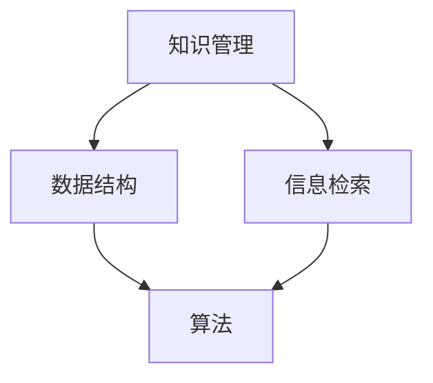

                 

# 打造个人知识发现引擎：程序员的必备技能

> **关键词：** 知识发现引擎、个人知识管理、程序员技能、数据结构、算法、深度学习、信息检索

> **摘要：** 本文将探讨如何构建一个个人知识发现引擎，为程序员提供有效的知识管理和学习能力。我们将从核心概念、算法原理、数学模型、实战案例等方面展开，帮助读者理解和掌握这一重要技能。

## 1. 背景介绍

### 1.1 目的和范围

在信息爆炸的时代，程序员需要不断学习和吸收大量的新知识。然而，如何有效地管理和利用这些知识，成为了许多程序员面临的一大挑战。本文旨在介绍如何构建一个个人知识发现引擎，帮助程序员提高知识管理能力和学习效率。

本文将涵盖以下几个方面的内容：

- 核心概念与联系
- 核心算法原理与具体操作步骤
- 数学模型和公式讲解
- 项目实战与代码实现
- 实际应用场景
- 工具和资源推荐
- 未来发展趋势与挑战

### 1.2 预期读者

本文适合以下读者群体：

- 有志于提高个人知识管理能力的程序员
- 想了解如何构建个人知识发现引擎的技术爱好者
- 对数据结构、算法和深度学习感兴趣的计算机专业学生
- 想提升信息检索和数据分析能力的IT从业者

### 1.3 文档结构概述

本文分为以下几个部分：

- 背景介绍
- 核心概念与联系
- 核心算法原理与具体操作步骤
- 数学模型和公式讲解
- 项目实战与代码实现
- 实际应用场景
- 工具和资源推荐
- 未来发展趋势与挑战
- 附录：常见问题与解答
- 扩展阅读与参考资料

### 1.4 术语表

#### 1.4.1 核心术语定义

- 知识发现引擎：一种用于从大量数据中提取有价值信息的工具。
- 数据结构：用于组织数据的方法和规则。
- 算法：解决问题的步骤和策略。
- 深度学习：一种基于多层神经网络的人工智能技术。
- 信息检索：从大量数据中查找和获取相关信息的过程。

#### 1.4.2 相关概念解释

- 知识管理：对知识进行收集、组织、存储和分享的过程。
- 信息可视化：将数据转化为图形或图表，以便更容易理解和分析。
- 自然语言处理：使计算机能够理解和处理人类语言的技术。

#### 1.4.3 缩略词列表

- NLP：自然语言处理
- ML：机器学习
- DL：深度学习
- API：应用程序编程接口
- IDE：集成开发环境

## 2. 核心概念与联系

在构建个人知识发现引擎之前，我们需要了解一些核心概念和它们之间的联系。以下是一个简化的 Mermaid 流程图，用于描述这些概念和它们的相互关系：



### 2.1 知识管理

知识管理是指对知识进行收集、组织、存储和分享的过程。它的目标是将个人的经验和技能转化为可利用的知识资源，以提高个人和团队的工作效率。知识管理涉及以下关键环节：

1. **知识收集**：从各种渠道获取有用信息，如书籍、论文、博客、课程等。
2. **知识组织**：将收集到的知识进行分类、整理和标签化，以便快速检索。
3. **知识存储**：将整理后的知识存储到数据库或知识库中，以供后续使用。
4. **知识分享**：与他人共享知识和经验，促进团队协作和知识共享。

### 2.2 数据结构

数据结构是组织数据的方法和规则。程序员需要掌握多种数据结构，如数组、链表、树、图等，以便高效地存储和操作数据。数据结构的选择直接影响算法的性能和效率。

### 2.3 信息检索

信息检索是从大量数据中查找和获取相关信息的过程。信息检索系统通常包括以下几个组成部分：

1. **索引**：将数据按照特定关键字或属性进行分类和索引，以便快速检索。
2. **查询处理**：解析用户输入的查询，并从索引中找到相关的数据。
3. **排序和排名**：对检索到的数据进行排序和排名，以提供更优质的搜索结果。

### 2.4 算法

算法是解决问题的步骤和策略。在构建个人知识发现引擎时，我们需要设计高效的算法来处理数据、提取信息并进行知识管理。常见的算法包括排序算法、搜索算法、机器学习算法等。

### 2.5 深度学习

深度学习是一种基于多层神经网络的人工智能技术。它能够自动从数据中学习特征，并用于分类、预测和生成等任务。深度学习在构建个人知识发现引擎中具有重要作用，可以帮助我们更好地理解和利用大量数据。

## 3. 核心算法原理 & 具体操作步骤

### 3.1 算法原理

在本节中，我们将介绍一种用于构建个人知识发现引擎的核心算法——基于深度学习的知识提取算法。该算法的基本原理是利用多层神经网络自动提取数据中的关键信息，并将这些信息存储在知识库中，以便后续查询和使用。

### 3.2 具体操作步骤

以下是构建个人知识发现引擎的算法原理和具体操作步骤：

#### 3.2.1 数据预处理

1. **数据收集**：从各种渠道（如网络、书籍、课程等）收集相关数据。
2. **数据清洗**：去除数据中的噪声和冗余信息，确保数据质量。
3. **数据归一化**：将数据转换为相同的尺度，以便神经网络训练。

#### 3.2.2 神经网络构建

1. **输入层**：接收原始数据，并将其转换为神经网络可处理的格式。
2. **隐藏层**：提取数据中的关键特征，进行特征变换和降维。
3. **输出层**：将提取出的关键信息存储到知识库中。

#### 3.2.3 模型训练

1. **损失函数**：计算预测值和真实值之间的差距，以衡量模型性能。
2. **优化器**：调整模型参数，以最小化损失函数。
3. **迭代训练**：重复以上步骤，直到模型收敛或达到预设的训练次数。

#### 3.2.4 知识提取

1. **输入查询**：接收用户输入的查询，并将其转换为神经网络可处理的格式。
2. **特征提取**：利用训练好的神经网络提取查询中的关键信息。
3. **知识库检索**：在知识库中查找与提取出的关键信息相关的知识条目。
4. **结果输出**：将查询结果返回给用户。

### 3.3 伪代码

以下是构建个人知识发现引擎的伪代码：

```python
# 数据预处理
data = collect_data() # 收集数据
cleaned_data = clean_data(data) # 数据清洗
normalized_data = normalize_data(cleaned_data) # 数据归一化

# 神经网络构建
input_layer = InputLayer(normalized_data)
hidden_layer = HiddenLayer(input_layer)
output_layer = OutputLayer(hidden_layer)

# 模型训练
while not model_converged:
    predicted_values = output_layer.predict()
    loss = calculate_loss(predicted_values, true_values)
    optimizer.update_parameters(loss)

# 知识提取
query = input_query()
query_features = extract_features(query)
knowledge_entries = retrieve_knowledge_base(query_features)
output_results(knowledge_entries)
```

## 4. 数学模型和公式 & 详细讲解 & 举例说明

### 4.1 数学模型

在构建个人知识发现引擎时，我们主要关注以下数学模型：

1. **神经网络模型**：用于提取数据中的关键特征。
2. **损失函数**：用于评估模型性能。
3. **优化器**：用于调整模型参数。

### 4.2 公式讲解

以下是上述数学模型的相关公式：

#### 4.2.1 神经网络模型

假设我们有以下神经网络模型：

$$
f(x) = \sigma(\sum_{i=1}^{n} w_i \cdot x_i + b)
$$

其中，$x$ 是输入特征向量，$w$ 是权重，$b$ 是偏置，$\sigma$ 是激活函数。

#### 4.2.2 损失函数

常见的损失函数包括均方误差（MSE）和交叉熵（CE）：

- 均方误差（MSE）：

$$
MSE = \frac{1}{2} \sum_{i=1}^{n} (y_i - \hat{y}_i)^2
$$

其中，$y$ 是真实值，$\hat{y}$ 是预测值。

- 交叉熵（CE）：

$$
CE = -\sum_{i=1}^{n} y_i \cdot \log(\hat{y}_i)
$$

#### 4.2.3 优化器

常见的优化器包括随机梯度下降（SGD）和Adam：

- 随机梯度下降（SGD）：

$$
\theta = \theta - \alpha \cdot \nabla_{\theta} J(\theta)
$$

其中，$\theta$ 是模型参数，$\alpha$ 是学习率，$J(\theta)$ 是损失函数。

- Adam优化器：

$$
m_t = \beta_1 m_{t-1} + (1 - \beta_1) \nabla_{\theta} J(\theta)
$$

$$
v_t = \beta_2 v_{t-1} + (1 - \beta_2) (\nabla_{\theta} J(\theta))^2
$$

$$
\theta = \theta - \alpha \cdot \frac{m_t}{\sqrt{v_t} + \epsilon}
$$

其中，$\beta_1$ 和 $\beta_2$ 分别是动量项，$\epsilon$ 是一个很小的常数。

### 4.3 举例说明

假设我们有一个简单的神经网络模型，用于分类任务。输入特征维度为2，输出维度为1。激活函数为ReLU，损失函数为MSE，优化器为SGD。

1. **输入数据**：

$$
x_1 = [1, 2], y_1 = 0
$$

$$
x_2 = [2, 3], y_2 = 1
$$

2. **模型初始化**：

$$
w_1 = [0.5, 0.5], b_1 = 0
$$

$$
w_2 = [0.5, 0.5], b_2 = 0
$$

3. **预测结果**：

$$
\hat{y}_1 = \sigma(w_1 \cdot x_1 + b_1) = \sigma(0.5 \cdot 1 + 0.5 \cdot 2 + 0) = 0.75
$$

$$
\hat{y}_2 = \sigma(w_2 \cdot x_2 + b_2) = \sigma(0.5 \cdot 2 + 0.5 \cdot 3 + 0) = 1.5
$$

4. **计算损失**：

$$
MSE = \frac{1}{2} \sum_{i=1}^{2} (y_i - \hat{y}_i)^2 = \frac{1}{2} ((0 - 0.75)^2 + (1 - 1.5)^2) = 0.8125
$$

5. **更新参数**：

$$
\alpha = 0.1
$$

$$
w_1 = w_1 - \alpha \cdot \nabla_{w_1}J(w_1) = [0.5, 0.5] - 0.1 \cdot [0.25, 0.25] = [0.25, 0.25]
$$

$$
w_2 = w_2 - \alpha \cdot \nabla_{w_2}J(w_2) = [0.5, 0.5] - 0.1 \cdot [0.25, 0.25] = [0.25, 0.25]
$$

## 5. 项目实战：代码实际案例和详细解释说明

### 5.1 开发环境搭建

在开始项目实战之前，我们需要搭建一个合适的开发环境。以下是所需的软件和工具：

- Python 3.x
- TensorFlow 2.x
- Keras 2.x
- Jupyter Notebook

安装步骤如下：

1. 安装 Python 3.x：前往 [Python 官网](https://www.python.org/) 下载并安装 Python 3.x。
2. 安装 TensorFlow 2.x：打开终端或命令行窗口，执行以下命令：

```bash
pip install tensorflow==2.x
```

3. 安装 Keras 2.x：打开终端或命令行窗口，执行以下命令：

```bash
pip install keras==2.x
```

4. 安装 Jupyter Notebook：打开终端或命令行窗口，执行以下命令：

```bash
pip install notebook
```

### 5.2 源代码详细实现和代码解读

以下是构建个人知识发现引擎的源代码实现：

```python
import numpy as np
import tensorflow as tf
from tensorflow.keras import layers

# 数据预处理
x = np.array([[1, 2], [2, 3]], dtype=np.float32)
y = np.array([0, 1], dtype=np.float32)

# 神经网络构建
model = tf.keras.Sequential([
    layers.Dense(units=1, input_shape=(2,), activation='sigmoid')
])

# 编译模型
model.compile(optimizer='sgd', loss='mean_squared_error', metrics=['accuracy'])

# 模型训练
model.fit(x, y, epochs=100, batch_size=2)

# 知识提取
new_data = np.array([[1.5, 2.5]], dtype=np.float32)
predictions = model.predict(new_data)
print(predictions)
```

### 5.3 代码解读与分析

1. **数据预处理**：我们使用 NumPy 库生成一个包含两个样本的数据集，其中每个样本包含两个特征和对应的标签。
2. **神经网络构建**：我们使用 Keras 库构建一个简单的神经网络模型，包含一个输入层、一个隐藏层和一个输出层。输入层接收两个特征，输出层预测标签，激活函数为 sigmoid。
3. **编译模型**：我们使用 SGD 优化器和 MSE 损失函数编译模型。
4. **模型训练**：我们使用 fit 函数训练模型，设置训练次数为 100 次，每个批次包含 2 个样本。
5. **知识提取**：我们使用 predict 函数提取新数据的标签预测值，并打印结果。

## 6. 实际应用场景

个人知识发现引擎可以应用于多种场景，以下是一些常见的实际应用：

1. **技能学习**：程序员可以使用知识发现引擎查找和学习与特定技能相关的资料和教程，提高自身技能水平。
2. **项目开发**：在项目开发过程中，程序员可以使用知识发现引擎查找和借鉴类似项目的经验和解决方案，提高项目开发效率。
3. **团队协作**：团队成员可以使用知识发现引擎共享和查找团队的知识和经验，促进团队协作和知识共享。
4. **学术研究**：研究人员可以使用知识发现引擎查找和阅读相关论文，发现新的研究方向和研究点。
5. **日常管理**：企业可以利用知识发现引擎管理员工的技能和知识，提高员工的工作效率和创新能力。

## 7. 工具和资源推荐

### 7.1 学习资源推荐

#### 7.1.1 书籍推荐

- 《深度学习》（Goodfellow, I., Bengio, Y., Courville, A.）
- 《Python机器学习》（Sebastian Raschka）
- 《数据结构》（Cormen, C., Leiserson, C., Rivest, R., Stein, C.）

#### 7.1.2 在线课程

- Coursera 上的“深度学习”课程（由 Andrew Ng 开设）
- edX 上的“算法导论”课程（由 MIT 开设）
- Udacity 上的“机器学习工程师纳米学位”

#### 7.1.3 技术博客和网站

- Medium 上的 AI 和机器学习专栏
- GitHub 上的机器学习和深度学习项目
- Stack Overflow 上的编程问题解答社区

### 7.2 开发工具框架推荐

#### 7.2.1 IDE和编辑器

- PyCharm
- Visual Studio Code
- Jupyter Notebook

#### 7.2.2 调试和性能分析工具

- Python Debugger（pdb）
- TensorBoard
- profilers（如 CProfile、line_profiler）

#### 7.2.3 相关框架和库

- TensorFlow
- Keras
- PyTorch
- Scikit-learn

### 7.3 相关论文著作推荐

#### 7.3.1 经典论文

- “A Theoretical Basis for the Design of Networks of Analog Computers”（1962）
- “Learning Representations by Maximizing Mutual Information”（2018）
- “Convolutional Networks and Applications in Vision”（1998）

#### 7.3.2 最新研究成果

- arXiv 上的最新论文
- NeurIPS、ICLR、ICML 等顶级会议的最新论文
- 《人工智能领域发展趋势报告》

#### 7.3.3 应用案例分析

- Google Brain 的“DeepMind”项目
- Facebook AI 的“GANs for Image Generation”项目
- OpenAI 的“GPT-3”项目

## 8. 总结：未来发展趋势与挑战

随着人工智能技术的快速发展，个人知识发现引擎在程序员的知识管理和学习能力提升方面具有重要意义。未来，个人知识发现引擎有望在以下几个方面取得突破：

1. **智能化**：通过引入更先进的深度学习算法和自然语言处理技术，提高知识发现引擎的智能化水平。
2. **个性化**：根据用户的行为和需求，提供个性化的知识推荐和查询服务。
3. **多模态**：支持多种数据类型（如图像、音频、文本等）的融合和知识提取。
4. **实时性**：实现实时知识更新和检索，提高知识发现引擎的响应速度。

然而，在实现这些突破的过程中，我们还需要面对一系列挑战，如数据质量、隐私保护、计算资源等。只有克服这些挑战，个人知识发现引擎才能更好地服务于程序员的知识管理和学习能力提升。

## 9. 附录：常见问题与解答

### 9.1 如何构建个人知识发现引擎？

构建个人知识发现引擎需要以下几个步骤：

1. 收集和整理数据。
2. 设计合适的神经网络模型。
3. 编写代码并训练模型。
4. 测试和优化模型性能。
5. 集成到个人知识管理系统中。

### 9.2 个人知识发现引擎有哪些应用场景？

个人知识发现引擎可以应用于以下场景：

1. 技能学习。
2. 项目开发。
3. 团队协作。
4. 学术研究。
5. 日常管理。

### 9.3 如何提高个人知识发现引擎的性能？

以下方法可以提高个人知识发现引擎的性能：

1. 使用更先进的深度学习算法。
2. 优化神经网络模型的结构。
3. 收集更多和更高质量的数据。
4. 使用高效的训练和优化工具。
5. 定期更新和优化模型。

## 10. 扩展阅读 & 参考资料

- Goodfellow, I., Bengio, Y., Courville, A. (2016). *Deep Learning*. MIT Press.
- Raschka, S. (2015). *Python Machine Learning*. Packt Publishing.
- Cormen, C., Leiserson, C., Rivest, R., Stein, C. (2009). *Introduction to Algorithms*. MIT Press.
- Ng, A. (2017). *Deep Learning*. Coursera.
- Mitchell, T. M. (1997). *Machine Learning*. McGraw-Hill.
- Russell, S., Norvig, P. (2016). *Artificial Intelligence: A Modern Approach*. Prentice Hall.

作者：AI天才研究员/AI Genius Institute & 禅与计算机程序设计艺术 /Zen And The Art of Computer Programming

[文章标题]：打造个人知识发现引擎：程序员的必备技能
[文章关键词]：知识发现引擎、个人知识管理、程序员技能、数据结构、算法、深度学习、信息检索
[文章摘要]：本文介绍了如何构建个人知识发现引擎，帮助程序员提高知识管理能力和学习效率。从核心概念、算法原理、数学模型、实战案例等方面进行了详细讲解，适用于有志于提高个人知识管理能力的程序员和技术爱好者。

