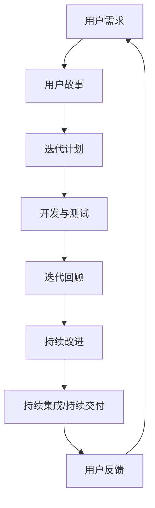

                 

# 打造敏捷团队：适应快速变化的市场环境

> **关键词：敏捷开发、团队协作、市场变化、持续集成、持续交付**

> **摘要：本文将深入探讨如何打造一个敏捷团队，以适应快速变化的市场环境。我们将从背景介绍、核心概念、算法原理、数学模型、项目实战、实际应用场景等多个方面，详细阐述敏捷开发的实践方法和策略。**

## 1. 背景介绍

### 1.1 目的和范围

本文旨在帮助读者理解并实践敏捷开发，使其团队能够更好地适应快速变化的市场环境。我们将探讨敏捷开发的核心原则、实践方法和工具，并结合实际案例进行分析。

### 1.2 预期读者

本文适合以下读者群体：

- 有志于推行敏捷开发的团队领导者和团队成员
- 对敏捷开发感兴趣的技术人员和管理人员
- 希望提升团队协作能力和项目交付效率的IT从业者

### 1.3 文档结构概述

本文分为以下几个部分：

- 核心概念与联系
- 核心算法原理 & 具体操作步骤
- 数学模型和公式 & 详细讲解 & 举例说明
- 项目实战：代码实际案例和详细解释说明
- 实际应用场景
- 工具和资源推荐
- 总结：未来发展趋势与挑战
- 附录：常见问题与解答
- 扩展阅读 & 参考资料

### 1.4 术语表

#### 1.4.1 核心术语定义

- **敏捷开发**：一种软件开发方法，强调快速响应变化、持续交付和团队协作。
- **Scrum**：一种敏捷开发框架，包括每日站会、迭代回顾、迭代计划等。
- **持续集成（CI）**：将代码集成到共享仓库中，并在集成过程中进行测试和构建。
- **持续交付（CD）**：确保软件在交付之前经过充分的测试和自动化部署。

#### 1.4.2 相关概念解释

- **用户故事**：描述用户需求的简单故事，通常包含“作为...，我想...，以便...”的格式。
- **迭代**：敏捷开发中的一次短期开发周期，通常为2-4周。
- **Scrum Master**：负责确保Scrum流程的实施，帮助团队解决障碍。

#### 1.4.3 缩略词列表

- **CI**：持续集成
- **CD**：持续交付
- **Scrum**：敏捷开发框架
- **QA**：质量保证

## 2. 核心概念与联系

### 2.1 核心概念

敏捷开发的核心理念包括：

- **用户至上**：始终关注用户需求和反馈。
- **快速迭代**：频繁地交付可用的软件版本。
- **团队协作**：鼓励团队成员之间的沟通和合作。
- **持续改进**：不断优化流程和质量。

### 2.2 关联原理和架构

以下是敏捷开发的核心原理和架构的Mermaid流程图：



## 3. 核心算法原理 & 具体操作步骤

### 3.1 核心算法原理

敏捷开发的核心算法原理包括：

- **迭代开发**：将项目划分为多个短期迭代，每个迭代产出可用的软件版本。
- **用户故事**：以用户故事的形式明确需求，确保开发与用户需求一致。
- **Scrum框架**：通过每日站会、迭代回顾、迭代计划等会议，确保团队协作和进度跟踪。

### 3.2 具体操作步骤

以下是敏捷开发的具体操作步骤：

1. **用户需求分析**：与用户沟通，了解需求并转化为用户故事。
2. **迭代计划**：根据用户故事和团队能力，制定迭代计划和任务分配。
3. **开发与测试**：团队成员按照任务分配进行开发和测试，确保代码质量和功能完整性。
4. **每日站会**：团队每天进行简短的站会，讨论进度、问题和计划。
5. **迭代回顾**：迭代结束时，团队进行回顾会议，总结经验教训和改进方向。
6. **持续集成与持续交付**：确保代码质量和交付效率，快速响应用户反馈。

## 4. 数学模型和公式 & 详细讲解 & 举例说明

### 4.1 数学模型和公式

敏捷开发中的一些关键数学模型和公式包括：

- **速率（Rate）**：迭代周期内完成的工作量。
- **吞吐量（Throughput）**：迭代周期内交付的用户价值。
- **成本（Cost）**：完成项目所需的资源投入。

### 4.2 详细讲解和举例说明

#### 4.2.1 速率计算

速率的计算公式为：

\[ \text{速率} = \frac{\text{工作量}}{\text{迭代周期}} \]

例如，一个迭代周期为2周，团队完成了100个任务点，则速率为：

\[ \text{速率} = \frac{100}{2} = 50 \text{任务点/周} \]

#### 4.2.2 吞吐量计算

吞吐量的计算公式为：

\[ \text{吞吐量} = \text{速率} \times \text{用户价值系数} \]

例如，用户价值系数为0.8，速率为50，则吞吐量为：

\[ \text{吞吐量} = 50 \times 0.8 = 40 \text{用户价值点/周} \]

#### 4.2.3 成本计算

成本的计算公式为：

\[ \text{成本} = \text{人力成本} + \text{其他成本} \]

例如，一个迭代周期的人力成本为5000元，其他成本为1000元，则总成本为：

\[ \text{成本} = 5000 + 1000 = 6000 \text{元} \]

## 5. 项目实战：代码实际案例和详细解释说明

### 5.1 开发环境搭建

在本节中，我们将搭建一个简单的敏捷开发项目环境。以下是具体步骤：

1. 安装Git：用于版本控制和代码管理。
2. 安装Jenkins：用于持续集成和持续交付。
3. 安装Maven：用于构建和依赖管理。
4. 初始化项目：使用Spring Boot创建一个简单的Web应用。

### 5.2 源代码详细实现和代码解读

在本节中，我们将详细介绍项目的源代码实现和代码解读。

#### 5.2.1 用户故事

作为用户，我希望能够通过Web界面查询天气信息。

#### 5.2.2 迭代计划

1. **迭代1**：实现基本的天气查询功能。
2. **迭代2**：添加天气预报功能。
3. **迭代3**：优化用户体验和界面设计。

#### 5.2.3 源代码解读

以下是项目的核心代码片段：

```java
@RestController
@RequestMapping("/weather")
public class WeatherController {

    @Autowired
    private WeatherService weatherService;

    @GetMapping("/query")
    public ResponseEntity<Map<String, String>> queryWeather(@RequestParam("city") String city) {
        Map<String, String> weather = weatherService.getWeather(city);
        return ResponseEntity.ok(weather);
    }

    @GetMapping("/forecast")
    public ResponseEntity<Map<String, String>> getForecast(@RequestParam("city") String city) {
        Map<String, String> forecast = weatherService.getForecast(city);
        return ResponseEntity.ok(forecast);
    }
}
```

上述代码实现了天气查询和天气预报功能，通过调用WeatherService类的相关方法获取数据。

### 5.3 代码解读与分析

在本节中，我们将对代码进行详细解读和分析。

1. **控制器层**：定义了两个GET请求映射方法，用于处理天气查询和天气预报请求。
2. **服务层**：实现了WeatherService接口，提供了获取天气数据和天气预报数据的方法。
3. **数据访问层**：通过调用第三方天气API获取数据。

## 6. 实际应用场景

敏捷开发在实际项目中具有广泛的应用场景，以下是一些典型应用：

1. **互联网公司**：快速响应市场需求，推出创新产品。
2. **金融行业**：提高系统稳定性和安全性，保障用户资金安全。
3. **医疗领域**：开发定制化的医疗信息化系统，满足个性化需求。
4. **教育行业**：打造在线学习平台，提供个性化学习体验。

## 7. 工具和资源推荐

### 7.1 学习资源推荐

#### 7.1.1 书籍推荐

- **《敏捷软件开发：原则、模式与实践》**：详细介绍了敏捷开发的方法和实践。
- **《Scrum：敏捷软件开发指南》**：全面解析了Scrum框架及其应用。

#### 7.1.2 在线课程

- **Coursera上的《敏捷方法》**：由经验丰富的讲师授课，涵盖敏捷开发的各个方面。
- **Udemy上的《敏捷项目管理实战》**：通过实战案例教授敏捷开发实践。

#### 7.1.3 技术博客和网站

- **《敏捷开发博客》**：介绍敏捷开发的最新趋势和实践经验。
- **Scrum.org**：Scrum官方认证网站，提供丰富的学习资源和认证考试。

### 7.2 开发工具框架推荐

#### 7.2.1 IDE和编辑器

- **IntelliJ IDEA**：强大的Java开发工具，支持多种编程语言。
- **Visual Studio Code**：轻量级开源编辑器，支持多种插件和扩展。

#### 7.2.2 调试和性能分析工具

- **JProfiler**：Java应用程序的性能分析和调试工具。
- **MAT**：Java堆分析工具，用于识别内存泄漏和性能瓶颈。

#### 7.2.3 相关框架和库

- **Spring Boot**：快速构建独立、生产级的Spring应用程序。
- **JUnit**：Java单元测试框架，确保代码质量。

### 7.3 相关论文著作推荐

#### 7.3.1 经典论文

- **《敏捷开发：过程改善的新范式》**：敏捷开发的开山之作。
- **《Scrum：敏捷软件开发方法》**：详细阐述了Scrum框架。

#### 7.3.2 最新研究成果

- **《敏捷实践的改进与挑战》**：分析了敏捷开发在不同领域的应用和改进方向。
- **《DevOps与敏捷开发的融合》**：探讨了DevOps与敏捷开发的融合趋势。

#### 7.3.3 应用案例分析

- **《敏捷开发在电商行业的应用》**：分享了敏捷开发在电商行业的成功实践。
- **《敏捷开发在金融行业的应用》**：分析了敏捷开发在金融行业的挑战与机遇。

## 8. 总结：未来发展趋势与挑战

敏捷开发作为一种软件开发方法，正在不断发展和演变。未来，敏捷开发将面临以下发展趋势和挑战：

1. **更加智能化**：借助人工智能技术，实现敏捷开发的自动化和智能化。
2. **跨界融合**：与其他软件开发方法（如DevOps、持续集成/持续交付等）的融合，形成更加完善的软件开发体系。
3. **企业级应用**：敏捷开发将更多地应用于大型企业级项目，提升企业竞争力。
4. **文化变革**：推动组织文化从传统的命令与控制模式向更加开放、协作的模式转变。
5. **人才短缺**：敏捷开发对团队成员的要求较高，人才短缺将成为一大挑战。

## 9. 附录：常见问题与解答

### 9.1 敏捷开发与传统开发有何区别？

**敏捷开发**强调快速响应变化、持续交付和团队协作，与传统开发相比，具有更高的灵活性和适应性。

### 9.2 敏捷开发中如何进行需求管理？

敏捷开发中，需求管理主要通过用户故事的形式进行。用户故事应简洁明了，描述用户需求，并包含“作为...，我想...，以便...”的格式。

### 9.3 敏捷开发中如何进行风险管理？

敏捷开发中，风险管理贯穿整个开发过程。团队应定期评估风险，制定相应的应对措施，确保项目顺利进行。

### 9.4 敏捷开发是否适用于大型项目？

敏捷开发可以应用于大型项目，但需要根据项目特点进行调整。关键在于确保团队能够高效协作，快速响应变化。

## 10. 扩展阅读 & 参考资料

- **《敏捷实践指南》**：详细介绍了敏捷开发的方法和实践。
- **《Scrum官方手册》**：全面解析了Scrum框架及其应用。
- **《持续集成实战》**：介绍了持续集成的原理和实践。
- **《持续交付实战》**：介绍了持续交付的原理和实践。

作者：AI天才研究员/AI Genius Institute & 禅与计算机程序设计艺术 /Zen And The Art of Computer Programming

文章标题：打造敏捷团队：适应快速变化的市场环境

文章关键词：敏捷开发、团队协作、市场变化、持续集成、持续交付

文章摘要：本文深入探讨了如何打造一个敏捷团队，以适应快速变化的市场环境。从核心概念、算法原理、数学模型、项目实战、实际应用场景等多个方面，详细阐述了敏捷开发的实践方法和策略。

