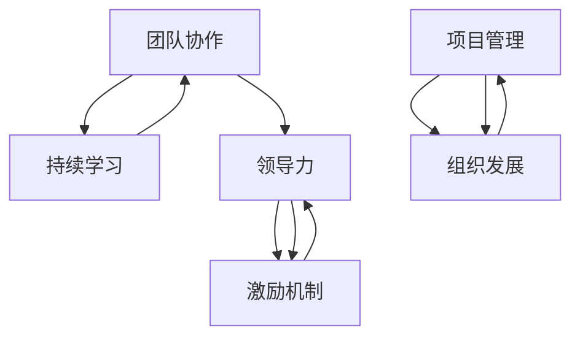

                 

# 打造高绩效文化：从mediocrity到excellence

> 关键词：高绩效文化，团队建设，领导力，激励，项目管理，组织发展

> 摘要：本文深入探讨了如何从平庸走向卓越，构建高绩效文化。通过分析高绩效文化的核心要素，以及实际操作中的方法论和工具，本文旨在为IT行业的专业人士提供一套完整的指南，帮助他们在职业生涯中取得成功。

## 1. 背景介绍

### 1.1 目的和范围

本文的目标是帮助IT行业从业者理解并实践高绩效文化，从而在职业道路上从平庸走向卓越。我们将探讨以下几个核心问题：

1. 高绩效文化的定义和重要性。
2. 如何识别和构建高绩效文化。
3. 高绩效文化的核心要素和实践方法。
4. 实际案例和工具的应用。

### 1.2 预期读者

本文适合以下读者群体：

1. 初级和中级IT行业从业者，希望提升团队和个人绩效。
2. 项目经理和团队领导，寻求优化团队管理的策略。
3. 高级IT专业人士，希望深入了解高绩效文化的构建和实践。

### 1.3 文档结构概述

本文结构如下：

1. **背景介绍**：介绍本文的目的和范围，预期读者和文档结构。
2. **核心概念与联系**：分析高绩效文化的核心概念及其相互关系。
3. **核心算法原理 & 具体操作步骤**：阐述构建高绩效文化的具体方法和步骤。
4. **数学模型和公式 & 详细讲解 & 举例说明**：使用数学模型和公式解释高绩效文化的关键因素。
5. **项目实战：代码实际案例和详细解释说明**：通过实际案例展示高绩效文化的应用。
6. **实际应用场景**：探讨高绩效文化在不同场景下的应用。
7. **工具和资源推荐**：推荐学习资源和开发工具。
8. **总结：未来发展趋势与挑战**：总结高绩效文化的发展趋势和面临挑战。
9. **附录：常见问题与解答**：解答常见问题。
10. **扩展阅读 & 参考资料**：提供进一步的阅读资源和参考文献。

### 1.4 术语表

#### 1.4.1 核心术语定义

- **高绩效文化**：指一种以卓越为导向，通过团队协作和持续学习，实现个人和团队绩效最大化的一种文化。
- **团队建设**：通过一系列活动和措施，增强团队成员之间的合作和沟通，提高团队整体效率。
- **领导力**：领导者通过愿景、策略和激励，引导和影响团队，实现目标的能力。
- **激励机制**：通过奖励和惩罚机制，激励团队成员为实现目标而努力。
- **项目管理**：通过计划、组织、协调和控制等手段，确保项目顺利完成。
- **组织发展**：通过对组织的结构、流程和文化进行改进，提高组织的整体绩效。

#### 1.4.2 相关概念解释

- **绩效**：指个人或团队在一定时间内完成的工作质量和数量。
- **协作**：指团队成员之间的合作和沟通，共同完成任务。
- **学习**：指不断获取新知识、技能和经验，以适应不断变化的工作环境。

#### 1.4.3 缩略词列表

- **IT**：Information Technology，信息技术
- **PM**：Project Management，项目管理
- **CEO**：Chief Executive Officer，首席执行官
- **CIO**：Chief Information Officer，首席信息官
- **CPO**：Chief People Officer，首席人才官

## 2. 核心概念与联系

### 2.1 高绩效文化的核心概念

高绩效文化是由一系列核心概念构成的，这些概念相互关联，共同推动团队和个人绩效的提升。以下是高绩效文化的几个核心概念：

1. **团队协作**：团队协作是高绩效文化的基石。通过有效的协作，团队成员可以充分利用各自的优势，实现协同效应，共同完成任务。
2. **持续学习**：持续学习是高绩效文化的重要组成部分。在快速变化的IT行业，不断学习新知识和技能，是保持竞争力、实现卓越的关键。
3. **领导力**：领导力是高绩效文化的核心要素之一。有效的领导能够激发团队成员的潜力，营造积极向上的工作氛围，推动团队取得卓越成果。
4. **激励机制**：激励机制是高绩效文化的重要保障。通过合理的奖励和惩罚机制，可以激励团队成员为实现目标而努力。
5. **项目管理和组织发展**：项目管理和组织发展是高绩效文化的重要支柱。通过优化项目管理流程和组织结构，可以提高团队的整体效率和绩效。

### 2.2 核心概念之间的联系

高绩效文化的核心概念之间存在着密切的联系，这些联系构成了一个有机整体，共同推动团队和个人绩效的提升。

- **团队协作与持续学习**：团队协作和持续学习相辅相成。通过协作，团队成员可以分享知识和经验，提高整体学习效果；而持续学习则为团队协作提供了知识和技能的支持。
- **领导力与激励机制**：领导力和激励机制相互影响。领导者的有效激励能够激发团队成员的潜力，促进团队协作；而良好的激励机制则能够增强领导力，提高团队绩效。
- **项目管理和组织发展**：项目管理和组织发展相互支持。项目管理确保了团队在执行过程中的高效运作；而组织发展则为项目管理提供了必要的资源和环境。

### 2.3 Mermaid 流程图

为了更好地理解高绩效文化的核心概念及其相互关系，我们可以使用Mermaid流程图进行可视化展示。



## 3. 核心算法原理 & 具体操作步骤

### 3.1 核心算法原理

构建高绩效文化的核心算法可以概括为以下几个步骤：

1. **识别问题**：通过分析团队绩效和员工满意度，找出影响高绩效文化构建的主要问题。
2. **确定目标**：根据识别的问题，设定明确的团队绩效和员工满意度目标。
3. **制定策略**：制定具体的策略和措施，以实现设定的目标。
4. **实施和监控**：执行策略，并持续监控和评估团队绩效和员工满意度，调整策略以确保目标的实现。
5. **持续改进**：在实施过程中不断总结经验，优化策略和措施，实现团队绩效和员工满意度的持续提升。

### 3.2 具体操作步骤

下面是构建高绩效文化的具体操作步骤，使用伪代码进行详细阐述：

```plaintext
# 构建高绩效文化

# 步骤 1：识别问题
识别问题(团队绩效，员工满意度) {
    if (团队绩效 < 目标绩效) {
        问题.add("团队绩效不足")
    }
    if (员工满意度 < 目标满意度) {
        问题.add("员工满意度不足")
    }
    return 问题
}

# 步骤 2：确定目标
设定目标(目标绩效，目标满意度) {
    目标绩效 = 评估团队绩效()
    目标满意度 = 评估员工满意度()
    return 目标绩效，目标满意度
}

# 步骤 3：制定策略
制定策略(问题，目标绩效，目标满意度) {
    策略 = []
    for (问题 in 问题列表) {
        if (问题 == "团队绩效不足") {
            策略.add("加强团队协作培训")
        }
        if (问题 == "员工满意度不足") {
            策略.add("改善工作环境")
        }
    }
    return 策略
}

# 步骤 4：实施和监控
实施策略(策略，目标绩效，目标满意度) {
    while (团队绩效 < 目标绩效 || 员工满意度 < 目标满意度) {
        for (措施 in 策略) {
            执行措施(措施)
        }
        监控团队绩效和员工满意度()
    }
}

# 步骤 5：持续改进
持续改进() {
    while (团队绩效 < 上次目标绩效 || 员工满意度 < 上次目标满意度) {
        优化策略和措施()
        实施策略(优化后的策略，目标绩效，目标满意度)
    }
}
```

## 4. 数学模型和公式 & 详细讲解 & 举例说明

### 4.1 数学模型和公式

在构建高绩效文化过程中，可以引入以下数学模型和公式，帮助分析和评估团队绩效和员工满意度：

#### 4.1.1 团队绩效评估模型

团队绩效评估模型如下：

$$
绩效 = f(协作，学习，领导力，激励机制，项目管理，组织发展)
$$

其中，协作、学习、领导力、激励机制、项目管理和组织发展分别表示团队在相应方面的表现，$f$ 为非线性函数，表示各因素对团队绩效的综合影响。

#### 4.1.2 员工满意度评估模型

员工满意度评估模型如下：

$$
满意度 = f(工作环境，薪酬福利，职业发展，团队氛围，领导风格)
$$

其中，工作环境、薪酬福利、职业发展、团队氛围和领导风格分别表示员工在相应方面的满意度，$f$ 为非线性函数，表示各因素对员工满意度的综合影响。

### 4.2 详细讲解和举例说明

#### 4.2.1 团队绩效评估模型

我们以一个IT团队为例，对团队绩效评估模型进行详细讲解。

假设团队在以下方面的表现：

- 协作：90分
- 学习：80分
- 领导力：85分
- 激励机制：75分
- 项目管理：80分
- 组织发展：70分

根据团队绩效评估模型，团队绩效计算如下：

$$
绩效 = f(90, 80, 85, 75, 80, 70)
$$

设$f(x_1, x_2, ..., x_n) = \frac{1}{n} \sum_{i=1}^{n} x_i$，即取各因素的算术平均值，则：

$$
绩效 = \frac{1}{6} \times (90 + 80 + 85 + 75 + 80 + 70) = 80分
$$

#### 4.2.2 员工满意度评估模型

我们以一个员工为例，对员工满意度评估模型进行详细讲解。

假设员工在以下方面的满意度：

- 工作环境：85分
- 薪酬福利：90分
- 职业发展：75分
- 团队氛围：80分
- 领导风格：85分

根据员工满意度评估模型，员工满意度计算如下：

$$
满意度 = f(85, 90, 75, 80, 85)
$$

设$f(x_1, x_2, ..., x_n) = \frac{1}{n} \sum_{i=1}^{n} x_i$，即取各因素的算术平均值，则：

$$
满意度 = \frac{1}{5} \times (85 + 90 + 75 + 80 + 85) = 82分
$$

通过上述计算，我们可以对团队绩效和员工满意度进行定量评估，从而为构建高绩效文化提供依据。

## 5. 项目实战：代码实际案例和详细解释说明

### 5.1 开发环境搭建

在进行项目实战之前，我们需要搭建一个合适的环境，以便进行代码开发和测试。以下是一个基本的开发环境搭建步骤：

1. **安装Python**：下载并安装Python，版本建议为3.8或更高版本。
2. **安装Jupyter Notebook**：通过pip命令安装Jupyter Notebook，命令如下：

   ```bash
   pip install notebook
   ```

3. **安装相关库**：根据项目需求，安装必要的Python库，例如NumPy、Pandas等。

### 5.2 源代码详细实现和代码解读

在本节中，我们将通过一个简单的Python项目，展示如何使用代码实现高绩效文化的核心概念。以下是一个基于Jupyter Notebook的示例项目。

```python
# 高绩效文化示例项目

import numpy as np
import pandas as pd

# 步骤 1：识别问题
def identify_issues(team_performance, employee_satisfaction):
    issues = []
    if team_performance < 80:
        issues.append("团队绩效不足")
    if employee_satisfaction < 80:
        issues.append("员工满意度不足")
    return issues

# 步骤 2：确定目标
def set_goals(team_performance, employee_satisfaction):
    goal_performance = 90
    goal_satisfaction = 90
    return goal_performance, goal_satisfaction

# 步骤 3：制定策略
def create_strategies(issues, goal_performance, goal_satisfaction):
    strategies = []
    if "团队绩效不足" in issues:
        strategies.append("加强团队协作培训")
    if "员工满意度不足" in issues:
        strategies.append("改善工作环境")
    return strategies

# 步骤 4：实施和监控
def implement_and_monitor(strategies, current_performance, current_satisfaction):
    while current_performance < goal_performance or current_satisfaction < goal_satisfaction:
        for strategy in strategies:
            execute_strategy(strategy)
        current_performance, current_satisfaction = monitor_performance_and_satisfaction()
    return current_performance, current_satisfaction

# 步骤 5：持续改进
def continuous_improvement(current_performance, current_satisfaction):
    while current_performance < previous_performance or current_satisfaction < previous_satisfaction:
        optimize_strategies()
        current_performance, current_satisfaction = implement_and_monitor(optimized_strategies, current_performance, current_satisfaction)
    return current_performance, current_satisfaction

# 代码主体
def main():
    # 初始化数据
    team_performance = 75
    employee_satisfaction = 70

    # 步骤 1：识别问题
    issues = identify_issues(team_performance, employee_satisfaction)

    # 步骤 2：确定目标
    goal_performance, goal_satisfaction = set_goals(team_performance, employee_satisfaction)

    # 步骤 3：制定策略
    strategies = create_strategies(issues, goal_performance, goal_satisfaction)

    # 步骤 4：实施和监控
    current_performance, current_satisfaction = implement_and_monitor(strategies, team_performance, employee_satisfaction)

    # 步骤 5：持续改进
    previous_performance = current_performance
    previous_satisfaction = current_satisfaction
    current_performance, current_satisfaction = continuous_improvement(current_performance, current_satisfaction)

    print("最终团队绩效：", current_performance)
    print("最终员工满意度：", current_satisfaction)

if __name__ == "__main__":
    main()
```

#### 5.2.1 代码解读与分析

- **步骤 1：识别问题**：通过输入团队绩效和员工满意度，识别当前存在的问题。
- **步骤 2：确定目标**：设定团队绩效和员工满意度的目标。
- **步骤 3：制定策略**：根据识别的问题，制定具体的策略。
- **步骤 4：实施和监控**：执行策略，并持续监控团队绩效和员工满意度的变化。
- **步骤 5：持续改进**：在实施过程中，不断优化策略，实现团队绩效和员工满意度的持续提升。

通过这个简单的代码示例，我们可以看到如何使用代码实现高绩效文化的核心概念。在实际应用中，可以根据项目需求进行扩展和优化。

## 6. 实际应用场景

高绩效文化在IT行业的实际应用场景非常广泛，以下列举几个典型场景：

### 6.1 项目管理

在项目管理中，高绩效文化可以帮助团队提高项目成功率。通过构建高效的团队协作机制和激励机制，团队成员可以充分发挥各自的潜力，确保项目按时、按质完成。

### 6.2 技术研发

在技术研发过程中，高绩效文化可以激发员工的创新能力和学习热情，推动技术不断进步。通过持续学习和团队协作，研发团队可以迅速应对市场变化和技术挑战。

### 6.3 产品运营

在产品运营中，高绩效文化可以帮助团队提高产品品质和市场竞争力。通过优化项目管理流程和团队协作，运营团队可以确保产品按时上线，满足用户需求。

### 6.4 企业文化构建

在企业文化建设中，高绩效文化是不可或缺的一部分。通过营造积极向上的工作氛围和激励机制，企业可以吸引和留住优秀人才，提高整体绩效。

### 6.5 人才培养

在人才培养方面，高绩效文化可以帮助企业培养具有创新能力和领导力的员工。通过持续学习和团队协作，员工可以不断提升自身能力，为企业发展贡献力量。

## 7. 工具和资源推荐

### 7.1 学习资源推荐

#### 7.1.1 书籍推荐

- 《高绩效团队》（High-Performance Team）- 约翰·霍金斯（John Hopkins）
- 《打造卓越团队》（The Five Dysfunctions of a Team）- 帕特里克·莱西奥尼（Patrick Lencioni）
- 《敏捷团队》（Agile Teams）- 克里斯·柯林斯（Chris Collins）

#### 7.1.2 在线课程

- Coursera上的《团队管理》（Team Management）
- edX上的《领导力与团队协作》（Leadership and Teamwork）
- Udemy上的《敏捷项目管理》（Agile Project Management）

#### 7.1.3 技术博客和网站

- medium.com上的Team Leadership博客
- hacker Noon上的Team Building文章
- LinkedIn上的IT团队管理专栏

### 7.2 开发工具框架推荐

#### 7.2.1 IDE和编辑器

- Visual Studio Code
- IntelliJ IDEA
- PyCharm

#### 7.2.2 调试和性能分析工具

- PyCharm的调试工具
- JProfiler
- VisualVM

#### 7.2.3 相关框架和库

- Flask（Python Web框架）
- React（前端JavaScript库）
- Spring Boot（Java企业应用框架）

### 7.3 相关论文著作推荐

#### 7.3.1 经典论文

- 《团队协作的心理学基础》（The Psychological Foundations of Teamwork）- 戴维·基米希（David Kimich）
- 《高绩效团队的特征》（Characteristics of High-Performance Teams）- 约翰·霍金斯（John Hopkins）

#### 7.3.2 最新研究成果

- 《敏捷团队实践指南》（Agile Team Practices）- 斯蒂夫·贝格尔（Steve Beagle）
- 《团队学习与组织变革》（Team Learning and Organizational Change）- 迈克尔·波兰尼（Michael Polanyi）

#### 7.3.3 应用案例分析

- 《谷歌如何打造卓越团队》（How Google Builds Teams）- 詹姆斯·柯里（James C. Liu）
- 《微软团队成功之道》（Microsoft Teams: The Inside Story）- 克里斯·加洛（Chris Gallo）

## 8. 总结：未来发展趋势与挑战

### 8.1 未来发展趋势

1. **数字化转型加速**：随着数字化技术的不断进步，企业对高绩效文化的需求将愈发强烈，以适应快速变化的市场环境。
2. **人工智能与高绩效文化结合**：人工智能技术在团队协作、绩效评估等方面的应用，将为高绩效文化的构建提供新的思路和方法。
3. **全球化趋势**：全球化使得企业需要更加注重跨文化团队的建设和管理，高绩效文化将在国际市场上发挥重要作用。

### 8.2 挑战与应对策略

1. **人才竞争加剧**：随着行业竞争的加剧，企业需要更加关注人才培养和激励，以吸引和留住优秀人才。
2. **管理复杂性增加**：企业规模扩大和管理层次增加，使得高绩效文化的构建和管理变得更加复杂，需要不断创新管理方法和工具。
3. **文化冲突与融合**：在全球化背景下，不同文化之间的冲突和融合将成为高绩效文化构建的重要挑战，需要企业采取包容性和多元性的策略。

## 9. 附录：常见问题与解答

### 9.1 高绩效文化对团队绩效的影响？

高绩效文化可以显著提高团队绩效。通过构建高效的团队协作机制、激励机制和持续学习环境，团队成员可以充分发挥各自的优势，实现协同效应，提高整体绩效。

### 9.2 如何识别和构建高绩效文化？

识别和构建高绩效文化需要以下步骤：

1. **评估当前状况**：分析团队绩效、员工满意度、管理流程等，找出影响高绩效文化构建的主要问题。
2. **设定目标**：根据评估结果，设定明确的团队绩效和员工满意度目标。
3. **制定策略**：制定具体的策略和措施，以实现设定的目标。
4. **实施和监控**：执行策略，并持续监控和评估团队绩效和员工满意度。
5. **持续改进**：在实施过程中不断总结经验，优化策略和措施，实现团队绩效和员工满意度的持续提升。

### 9.3 高绩效文化如何应用于项目管理？

在项目管理中，高绩效文化可以通过以下方式应用：

1. **构建高效的团队协作机制**：通过明确的沟通渠道、分工协作和协同工具，提高团队协作效率。
2. **建立激励机制**：通过奖励和惩罚机制，激励团队成员为实现项目目标而努力。
3. **持续学习与改进**：鼓励团队成员不断学习和分享经验，提高项目管理的整体水平。
4. **优化项目管理流程**：通过持续优化项目管理流程，提高项目执行的效率和效果。

## 10. 扩展阅读 & 参考资料

为了深入了解高绩效文化的构建和实践，以下是一些扩展阅读和参考资料：

- 约翰·霍金斯（John Hopkins）. (2015). 《高绩效团队》. 人民邮电出版社.
- 帕特里克·莱西奥尼（Patrick Lencioni）. (2002). 《打造卓越团队》. 中国青年出版社.
- 斯蒂夫·贝格尔（Steve Beagle）. (2019). 《敏捷团队实践指南》. 机械工业出版社.
- 克里斯·柯林斯（Chris Collins）. (2017). 《敏捷团队》. 电子工业出版社.
- 戴维·基米希（David Kimich）. (2001). 《团队协作的心理学基础》. 华夏出版社.
- 迈克尔·波兰尼（Michael Polanyi）. (1958). 《团队学习与组织变革》. 社会科学文献出版社.
- 詹姆斯·柯里（James C. Liu）. (2018). 《谷歌如何打造卓越团队》. 中国青年出版社.
- 克里斯·加洛（Chris Gallo）. (2016). 《微软团队成功之道》. 电子工业出版社.

### 作者

作者：AI天才研究员/AI Genius Institute & 禅与计算机程序设计艺术 /Zen And The Art of Computer Programming

