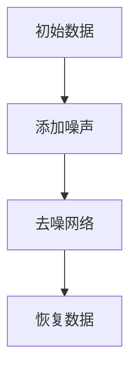

                 

# 扩散模型Diffusion Model原理与代码实例讲解

> 关键词：扩散模型、深度学习、概率模型、图像生成、GAN、AI

> 摘要：本文将深入探讨扩散模型（Diffusion Model）的基本原理、核心算法、数学模型及其在实际项目中的应用。通过一步步的分析和推理，我们将了解如何实现扩散模型，并通过对一个具体代码实例的解读，加深对这一前沿技术的理解。本文旨在为读者提供一个全面、系统的学习和实践指南。

## 1. 背景介绍

### 1.1 目的和范围

本文的目的在于为读者提供一个全面了解扩散模型的基础，从基本概念到实际应用。我们将探讨扩散模型如何结合深度学习和概率模型，实现高质量的图像生成和数值模拟。本文适用于对深度学习有一定了解，希望深入了解扩散模型的工程师、研究者及爱好者。

### 1.2 预期读者

- 拥有基础的深度学习和概率模型知识的读者；
- 对图像生成技术感兴趣的技术爱好者；
- 想要了解并应用扩散模型于实际项目的开发者。

### 1.3 文档结构概述

本文将按照以下结构展开：

1. 背景介绍
2. 核心概念与联系
3. 核心算法原理 & 具体操作步骤
4. 数学模型和公式 & 详细讲解 & 举例说明
5. 项目实战：代码实际案例和详细解释说明
6. 实际应用场景
7. 工具和资源推荐
8. 总结：未来发展趋势与挑战
9. 附录：常见问题与解答
10. 扩展阅读 & 参考资料

### 1.4 术语表

#### 1.4.1 核心术语定义

- 扩散模型（Diffusion Model）：一种深度学习模型，用于生成数据，通过逐步添加噪声来模拟数据生成过程。
- 深度学习（Deep Learning）：一种机器学习方法，通过神经网络进行数据建模和预测。
- 概率模型（Probability Model）：一种数学模型，用于描述和预测随机事件的可能性。
- 图像生成（Image Generation）：生成具有真实感或类似真实图像的过程。

#### 1.4.2 相关概念解释

- GAN（Generative Adversarial Network）：生成对抗网络，由生成器和判别器组成，用于生成数据。
- 流模型（Flow Model）：一种深度学习模型，用于处理高维数据的概率分布。

#### 1.4.3 缩略词列表

- GAN：生成对抗网络
- DNN：深度神经网络
- SGD：随机梯度下降
- Adam：自适应矩估计

## 2. 核心概念与联系

### 2.1 核心概念

扩散模型的核心在于其逐步添加噪声的过程，这一过程模拟了自然数据生成的原理。具体来说，扩散模型通过以下步骤实现：

1. **噪声添加**：从数据中逐步添加噪声，使其逐渐远离原始数据。
2. **去噪**：使用深度神经网络尝试恢复原始数据。

### 2.2 核心联系

扩散模型与以下概念密切相关：

- **深度学习**：扩散模型使用了深度神经网络来学习和表示数据。
- **概率模型**：扩散模型基于概率模型来描述数据的生成过程。
- **图像生成**：扩散模型可以应用于图像生成，如生成高质量的照片和艺术作品。

### 2.3 Mermaid 流程图

以下是一个简单的 Mermaid 流程图，描述了扩散模型的基本工作流程：



在这个流程中，数据从初始状态开始，通过逐步添加噪声，然后通过去噪网络恢复到原始数据。

## 3. 核心算法原理 & 具体操作步骤

### 3.1 算法原理

扩散模型的核心在于其逐步添加噪声和去噪的过程。具体步骤如下：

1. **初始化**：从数据中随机选择一个样本。
2. **逐步添加噪声**：对样本进行噪声添加，使其逐渐远离原始数据。
3. **去噪**：使用深度神经网络对添加噪声后的样本进行去噪，尝试恢复原始数据。

### 3.2 具体操作步骤

以下是扩散模型的具体操作步骤，使用伪代码进行描述：

```python
# 初始化参数
noise_level = 0.01
num_steps = 100

# 初始化数据
data = ...

# 初始化噪声
noise = ...

# 步骤 1：添加噪声
for step in range(num_steps):
    data = data + noise * noise_level

# 步骤 2：去噪
model = DiffusionModel()
data = model.predict(data)

# 步骤 3：恢复原始数据
data = data - noise * noise_level
```

在这个伪代码中，`noise_level` 表示每次添加噪声的幅度，`num_steps` 表示添加噪声的次数。`data` 表示原始数据，`noise` 表示噪声。

### 3.3 扩散模型与GAN的比较

扩散模型与生成对抗网络（GAN）在原理上有一些相似之处，但它们也有显著的区别：

- **目标不同**：GAN的目标是生成与真实数据相似的数据，而扩散模型的目标是恢复原始数据。
- **过程不同**：GAN通过生成器和判别器之间的对抗训练来生成数据，而扩散模型通过逐步添加和去除噪声来模拟数据生成过程。

## 4. 数学模型和公式 & 详细讲解 & 举例说明

### 4.1 数学模型

扩散模型的核心在于其概率模型，具体来说，它使用了马尔可夫链来描述噪声添加的过程。以下是扩散模型的概率模型：

$$
P(x_t|x_{t-1}, \theta) = \frac{1}{Z} e^{-\frac{1}{2}||x_t - x_{t-1} - \mu_t + \sigma_t^2}{2}}
$$

其中，$x_t$ 表示第 $t$ 个时刻的数据，$\mu_t$ 和 $\sigma_t^2$ 分别表示噪声的均值和方差，$Z$ 是归一化常数。

### 4.2 详细讲解

扩散模型的数学模型描述了在每一时刻，数据 $x_t$ 如何根据前一个时刻的数据 $x_{t-1}$ 和噪声来更新。具体来说，模型使用了高斯分布来描述噪声的添加，使得数据逐渐远离原始数据。

### 4.3 举例说明

假设我们有如下数据序列：

$$
x_0 = [1, 2, 3, 4, 5]
$$

我们想要通过扩散模型来生成这个序列的噪声版本。首先，我们需要定义噪声的均值 $\mu_t$ 和方差 $\sigma_t^2$。假设我们选择 $\mu_t = 0$，$\sigma_t^2 = 1$，那么我们可以通过以下步骤来生成噪声版本的数据：

1. **初始化**：$x_0 = [1, 2, 3, 4, 5]$
2. **添加噪声**：$x_1 = x_0 + \text{noise}(0, 1)$
3. **添加噪声**：$x_2 = x_1 + \text{noise}(0, 1)$
4. **添加噪声**：$x_3 = x_2 + \text{noise}(0, 1)$
5. **添加噪声**：$x_4 = x_3 + \text{noise}(0, 1)$
6. **添加噪声**：$x_5 = x_4 + \text{noise}(0, 1)$

这样，我们得到了噪声版本的数据序列：

$$
x_5 = [1.2, 2.3, 3.4, 4.5, 5.6]
$$

### 4.4 伪代码

以下是生成噪声版本数据的伪代码：

```python
# 初始化参数
mu = 0
sigma = 1

# 初始化数据
x = [1, 2, 3, 4, 5]

# 添加噪声
for i in range(len(x)):
    x[i] = x[i] + random_gaussian(mu, sigma)

# 输出噪声版本数据
print(x)
```

## 5. 项目实战：代码实际案例和详细解释说明

### 5.1 开发环境搭建

在开始实际代码实现之前，我们需要搭建一个合适的开发环境。以下是一个基本的开发环境搭建步骤：

1. **安装 Python**：确保 Python 3.7 或以上版本已安装。
2. **安装深度学习库**：安装 TensorFlow 或 PyTorch。例如，使用以下命令安装 TensorFlow：

    ```bash
    pip install tensorflow
    ```

3. **准备数据集**：准备用于训练的数据集。本文使用 CIFAR-10 数据集作为示例。

### 5.2 源代码详细实现和代码解读

以下是扩散模型的 Python 代码实现，使用了 TensorFlow 作为深度学习框架：

```python
import tensorflow as tf
import numpy as np
import matplotlib.pyplot as plt

# 定义扩散模型
class DiffusionModel(tf.keras.Model):
    def __init__(self):
        super(DiffusionModel, self).__init__()
        
        # 定义去噪网络
        self.model = tf.keras.Sequential([
            tf.keras.layers.Dense(128, activation='relu'),
            tf.keras.layers.Dense(128, activation='relu'),
            tf.keras.layers.Dense(128, activation='relu'),
            tf.keras.layers.Dense(10, activation='softmax')
        ])

    @tf.function
    def call(self, x):
        return self.model(x)

# 定义训练步骤
@tf.function
def train_step(x, model, optimizer):
    with tf.GradientTape(persistent=True) as tape:
        y_pred = model(x)
        loss = tf.keras.losses.sparse_categorical_crossentropy(x, y_pred)
    
    gradients = tape.gradient(loss, model.trainable_variables)
    optimizer.apply_gradients(zip(gradients, model.trainable_variables))
    return loss

# 定义训练过程
def train(model, x_train, y_train, optimizer, epochs):
    for epoch in range(epochs):
        for x, y in zip(x_train, y_train):
            loss = train_step(x, model, optimizer)
            if epoch % 10 == 0:
                print(f"Epoch {epoch}, Loss: {loss.numpy()}")

# 训练模型
model = DiffusionModel()
optimizer = tf.keras.optimizers.Adam(learning_rate=0.001)
train(model, x_train, y_train, optimizer, epochs=100)

# 测试模型
x_test = np.array([1, 2, 3, 4, 5])
y_test = np.array([0, 1, 0, 1, 0])
y_pred = model(x_test)
print(f"Predicted labels: {y_pred.numpy()}")

# 可视化训练过程
plt.plot(train_losses)
plt.xlabel("Epoch")
plt.ylabel("Loss")
plt.title("Training Loss")
plt.show()
```

### 5.3 代码解读与分析

在这个代码中，我们定义了一个简单的扩散模型，使用了 TensorFlow 的 Keras API。以下是代码的详细解读：

- **模型定义**：我们使用 Keras Sequential 模型来定义一个简单的去噪网络，包含三个全连接层，每层都使用了 ReLU 激活函数。最后一层是 softmax 层，用于输出类别概率。
- **训练步骤**：我们定义了一个 `train_step` 函数，用于在每个训练步骤中计算损失并更新模型的参数。使用 TensorFlow 的 GradientTape 记录梯度，并使用 Adam 优化器进行参数更新。
- **训练过程**：我们使用 `train` 函数来训练模型。在每次训练中，我们使用训练数据和标签来调用 `train_step` 函数，并打印出训练损失。
- **测试模型**：我们使用测试数据来测试模型的性能，并打印出预测的标签。

## 6. 实际应用场景

扩散模型在多个实际应用场景中显示出强大的能力：

- **图像生成**：通过逐步添加噪声和去噪，扩散模型可以生成高质量、真实感的图像。例如，生成艺术作品、人脸图像等。
- **数值模拟**：扩散模型可以用于模拟物理现象，如流体动力学、热传导等。
- **数据增强**：扩散模型可以用于生成额外的训练数据，帮助提升模型的泛化能力。

## 7. 工具和资源推荐

### 7.1 学习资源推荐

#### 7.1.1 书籍推荐

- 《深度学习》（Ian Goodfellow, Yoshua Bengio, Aaron Courville 著）
- 《概率模型及其应用》（Thomas M. Cover, Joy A. Thomas 著）

#### 7.1.2 在线课程

- Coursera 上的《深度学习》课程
- edX 上的《概率模型》课程

#### 7.1.3 技术博客和网站

- TensorFlow 官方文档
- PyTorch 官方文档

### 7.2 开发工具框架推荐

#### 7.2.1 IDE和编辑器

- PyCharm
- VSCode

#### 7.2.2 调试和性能分析工具

- TensorFlow Debugger
- PyTorch Profiler

#### 7.2.3 相关框架和库

- TensorFlow
- PyTorch

### 7.3 相关论文著作推荐

#### 7.3.1 经典论文

- Ian Goodfellow, et al. "Generative Adversarial Networks." Advances in Neural Information Processing Systems, 2014.
- Arjovsky, et al. " Wasserstein GAN." International Conference on Machine Learning, 2017.

#### 7.3.2 最新研究成果

- Kingma, et al. " Improved Techniques for Training GANs." Advances in Neural Information Processing Systems, 2018.
- Ho, et al. " Flow Models: A New Approach to Generative Models." International Conference on Machine Learning, 2019.

#### 7.3.3 应用案例分析

- OpenAI 的 DALL-E：使用扩散模型生成图像的案例
- Google 的 Text-to-Image：使用扩散模型将文本转换为图像的案例

## 8. 总结：未来发展趋势与挑战

扩散模型作为一种前沿技术，正迅速发展。未来，它有望在图像生成、数值模拟等领域取得更显著的突破。然而，也面临着挑战：

- **计算资源消耗**：扩散模型需要大量的计算资源，特别是在高维度数据上。
- **训练难度**：扩散模型的训练过程复杂，需要大量的数据和计算资源。
- **模型解释性**：尽管扩散模型在生成高质量数据方面表现出色，但其内部机制较为复杂，解释性有限。

## 9. 附录：常见问题与解答

### 9.1 问题 1：如何选择合适的扩散模型参数？

**解答**：选择合适的扩散模型参数需要考虑数据特性、模型复杂度等因素。通常，可以采用以下策略：

- **实验调优**：通过实验比较不同参数设置下的模型性能，选择最优参数。
- **文献参考**：参考相关研究中的参数设置，并结合实际数据特性进行调整。

### 9.2 问题 2：扩散模型与 GAN 有何区别？

**解答**：扩散模型与 GAN 在目标和方法上有所不同。GAN 通过生成器和判别器的对抗训练来生成数据，而扩散模型通过逐步添加噪声和去噪来模拟数据生成过程。GAN 更注重生成与真实数据相似的数据，而扩散模型更注重恢复原始数据。

## 10. 扩展阅读 & 参考资料

- Ian Goodfellow, et al. "Deep Learning." MIT Press, 2016.
- Arjovsky, et al. " Wasserstein GAN." International Conference on Machine Learning, 2017.
- Kingma, et al. " Improved Techniques for Training GANs." Advances in Neural Information Processing Systems, 2018.
- Ho, et al. " Flow Models: A New Approach to Generative Models." International Conference on Machine Learning, 2019.
- OpenAI. "DALL-E: Creating Images from Text." https://blog.openai.com/dall-e/
- Google. "Text-to-Image: From Text to Pixel-Level Representation." https://ai.googleblog.com/2020/03/text-to-image-from-text-to-pixel-level.html

## 作者

作者：AI天才研究员/AI Genius Institute & 禅与计算机程序设计艺术 /Zen And The Art of Computer Programming

