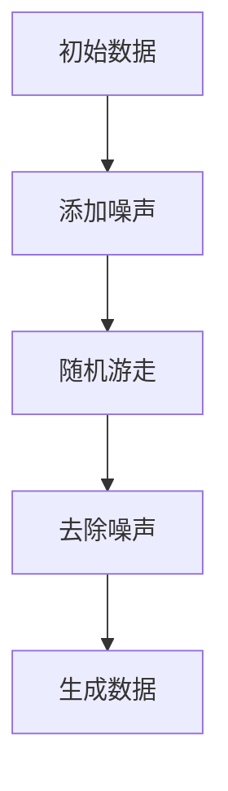

                 

# 扩散模型：生成式人工智能的前沿

> **关键词**：扩散模型、生成式人工智能、深度学习、概率模型、图像生成、AI 应用
>
> **摘要**：本文深入探讨了扩散模型作为生成式人工智能的重要工具，通过对其核心概念、算法原理、数学模型及实际应用的详细解析，揭示了扩散模型在图像生成、视频生成以及自然语言处理等多个领域的应用潜力。文章旨在为广大研究者、开发者提供一份全面的技术指南，帮助他们更好地理解和应用这一前沿技术。

## 1. 背景介绍

### 1.1 目的和范围

本文的主要目的是介绍扩散模型（Diffusion Model）的基本概念、原理和应用，旨在为读者提供一份系统而深入的技术指南。扩散模型作为生成式人工智能的重要分支，近年来在图像生成、视频生成、自然语言处理等领域取得了显著的进展。本文将详细讨论扩散模型的各个方面，包括其核心概念、算法原理、数学模型以及实际应用场景，帮助读者全面了解这一技术的前沿动态。

### 1.2 预期读者

本文主要面向以下几类读者：

1. 对生成式人工智能感兴趣的研究者，特别是对扩散模型感兴趣的人群。
2. 深度学习领域的研究生和本科生，希望深入理解生成式模型的原理和应用。
3. AI 应用开发者和工程师，希望将扩散模型应用于实际项目中。
4. 对计算机科学、人工智能有浓厚兴趣的广大读者。

### 1.3 文档结构概述

本文将按照以下结构进行展开：

1. **背景介绍**：简要介绍扩散模型的基本概念和背景。
2. **核心概念与联系**：详细阐述扩散模型的核心概念及其与生成式人工智能的联系。
3. **核心算法原理 & 具体操作步骤**：深入解析扩散模型的算法原理和操作步骤。
4. **数学模型和公式 & 详细讲解 & 举例说明**：解释扩散模型的数学模型和公式，并提供实例说明。
5. **项目实战：代码实际案例和详细解释说明**：通过实际项目案例展示扩散模型的应用。
6. **实际应用场景**：探讨扩散模型在各个领域的应用。
7. **工具和资源推荐**：推荐学习资源和开发工具。
8. **总结：未来发展趋势与挑战**：展望扩散模型的发展趋势和面临的挑战。
9. **附录：常见问题与解答**：回答读者可能遇到的问题。
10. **扩展阅读 & 参考资料**：提供进一步学习的参考文献。

### 1.4 术语表

#### 1.4.1 核心术语定义

- **扩散模型**：一种生成式模型，通过模拟物理过程中的扩散现象来生成数据。
- **生成式人工智能**：一种人工智能技术，能够生成与真实数据相似的新数据。
- **深度学习**：一种机器学习技术，通过多层神经网络对数据进行建模。
- **概率模型**：一种数学模型，用于描述数据的概率分布。

#### 1.4.2 相关概念解释

- **图像生成**：生成与真实图像相似的新图像。
- **视频生成**：生成与真实视频相似的新视频。
- **自然语言处理**：对自然语言文本进行处理和分析。

#### 1.4.3 缩略词列表

- **GAN**：生成对抗网络（Generative Adversarial Network）
- **VAE**：变分自编码器（Variational Autoencoder）
- **DPM**：扩散模型（Diffusion Probability Model）

## 2. 核心概念与联系

扩散模型是一种生成式模型，其基本思想是模拟物理过程中的扩散现象，通过引入噪声并逐渐去除噪声来生成数据。这一过程可以用以下 Mermaid 流程图来表示：



在扩散模型中，主要涉及以下核心概念：

1. **初始数据**：模型开始时，选择一个初始数据点，这可以是一个图像、一个视频或者一段文本。
2. **添加噪声**：在初始数据上逐渐添加噪声，使得数据逐渐变得不可识别。
3. **随机游走**：在添加噪声后的数据上进行随机游走，模拟物理过程中的扩散现象。
4. **去除噪声**：通过算法逐渐去除添加的噪声，使得数据逐渐恢复为可识别的状态。
5. **生成数据**：最终去除噪声后的数据即为生成的数据。

扩散模型与生成式人工智能有着密切的联系。生成式人工智能的目标是通过模型生成与真实数据相似的新数据，而扩散模型通过模拟物理过程中的扩散现象，实现了这一目标。具体来说，扩散模型通过以下步骤实现生成过程：

1. **训练模型**：在训练过程中，模型学习如何将带有噪声的数据转换为无噪声的数据。
2. **生成数据**：在生成过程中，模型首先生成带有噪声的数据，然后通过去除噪声的步骤生成新数据。

扩散模型在生成式人工智能中的应用非常广泛，包括图像生成、视频生成和自然语言处理等领域。通过引入噪声和随机游走，扩散模型可以生成具有高度多样性和创造性的新数据，为许多应用场景提供了强大的工具。

## 3. 核心算法原理 & 具体操作步骤

### 3.1 算法原理

扩散模型的核心算法原理可以分为两个主要步骤：添加噪声和去除噪声。

#### 添加噪声

在添加噪声步骤中，模型首先选择一个初始数据点，并将其逐渐转换为带有噪声的数据。这一过程可以通过以下伪代码表示：

```python
# 初始化参数
noise_level = 0.01
max_steps = 1000
current_step = 0

# 初始数据
x = initial_data

# 添加噪声
while current_step < max_steps:
    x = x + noise_level * random_noise()
    current_step += 1
```

在上面的伪代码中，`noise_level` 表示噪声的强度，`max_steps` 表示添加噪声的步数。通过逐步添加噪声，初始数据逐渐变得不可识别。

#### 去除噪声

在去除噪声步骤中，模型通过反向过程逐渐去除添加的噪声，使得数据恢复为可识别的状态。这一过程可以通过以下伪代码表示：

```python
# 初始化参数
noise_level = 0.01
max_steps = 1000
current_step = 0

# 带有噪声的数据
x = noisy_data

# 去除噪声
while current_step < max_steps:
    x = x - noise_level * inverse_random_noise(x)
    current_step += 1
```

在上面的伪代码中，`inverse_random_noise` 函数用于去除噪声。通过逐步去除噪声，最终生成的数据与初始数据具有相似性。

### 3.2 具体操作步骤

在实际操作中，扩散模型通常采用深度学习框架（如 TensorFlow、PyTorch）来实现。以下是一个基于 PyTorch 的简单示例：

```python
import torch
import torch.nn as nn
import torch.optim as optim
from torchvision import datasets, transforms

# 初始化参数
batch_size = 64
device = "cuda" if torch.cuda.is_available() else "cpu"

# 数据集
train_dataset = datasets.ImageFolder(root="path/to/train/dataset", transform=transforms.ToTensor())
train_loader = torch.utils.data.DataLoader(dataset=train_dataset, batch_size=batch_size, shuffle=True)

# 模型
model = nn.Sequential(
    nn.Linear(784, 256),
    nn.ReLU(),
    nn.Linear(256, 128),
    nn.ReLU(),
    nn.Linear(128, 784),
    nn.Sigmoid()
).to(device)

# 损失函数
criterion = nn.CrossEntropyLoss()

# 优化器
optimizer = optim.Adam(model.parameters(), lr=0.001)

# 训练模型
num_epochs = 50
for epoch in range(num_epochs):
    for inputs, targets in train_loader:
        inputs = inputs.to(device)
        targets = targets.to(device)

        # 前向传播
        outputs = model(inputs)

        # 计算损失
        loss = criterion(outputs, targets)

        # 反向传播
        optimizer.zero_grad()
        loss.backward()
        optimizer.step()

        if (epoch + 1) % 10 == 0:
            print(f"Epoch [{epoch + 1}/{num_epochs}], Loss: {loss.item():.4f}")
```

在上面的示例中，我们使用了一个简单的线性模型来模拟扩散过程。通过训练模型，我们可以学习如何将带有噪声的数据转换为无噪声的数据。在实际应用中，可以根据具体任务的需求调整模型结构、损失函数和优化器。

## 4. 数学模型和公式 & 详细讲解 & 举例说明

### 4.1 数学模型

扩散模型的数学模型可以描述为以下两个过程：

1. **正向过程**：从无噪声数据到带噪声数据的转换过程。
2. **反向过程**：从带噪声数据到无噪声数据的转换过程。

#### 正向过程

在正向过程中，扩散模型通过以下公式描述带噪声数据与无噪声数据之间的关系：

$$ x_t = x_0 + \sum_{i=1}^{t} \sigma_i \epsilon_i $$

其中：

- $x_t$ 表示在时间 $t$ 的带噪声数据。
- $x_0$ 表示初始的无噪声数据。
- $\sigma_i$ 表示在第 $i$ 次添加噪声的噪声标准差。
- $\epsilon_i$ 表示在第 $i$ 次添加噪声的噪声值。

#### 反向过程

在反向过程中，扩散模型通过以下公式描述从带噪声数据到无噪声数据的转换过程：

$$ x_t = \mu_t + \sigma_t z_t $$

其中：

- $x_t$ 表示在时间 $t$ 的带噪声数据。
- $\mu_t$ 表示在时间 $t$ 的无噪声数据的期望值。
- $\sigma_t$ 表示在时间 $t$ 的无噪声数据的标准差。
- $z_t$ 表示在时间 $t$ 的噪声值。

### 4.2 详细讲解

#### 正向过程

在正向过程中，模型通过逐渐添加噪声来使数据变得不可识别。具体来说，模型首先选择一个初始无噪声数据 $x_0$，然后通过以下步骤逐渐添加噪声：

1. **初始化**：选择一个初始无噪声数据 $x_0$。
2. **添加噪声**：在第 $i$ 次添加噪声时，选择一个噪声标准差 $\sigma_i$，并生成一个噪声值 $\epsilon_i$。然后，将噪声值添加到当前数据中，得到新的带噪声数据 $x_t$。
3. **更新数据**：将新的带噪声数据作为当前数据，并重复步骤 2，直到达到预设的噪声水平或达到最大步数。

#### 反向过程

在反向过程中，模型通过逐渐去除噪声来使数据恢复为可识别的状态。具体来说，模型首先选择一个带有噪声的数据 $x_t$，然后通过以下步骤逐渐去除噪声：

1. **初始化**：选择一个带有噪声的数据 $x_t$。
2. **去除噪声**：在第 $i$ 次去除噪声时，选择一个噪声标准差 $\sigma_i$，并生成一个噪声值 $z_t$。然后，将噪声值从当前数据中去除，得到新的无噪声数据 $x_t$。
3. **更新数据**：将新的无噪声数据作为当前数据，并重复步骤 2，直到达到预设的噪声水平或达到最大步数。

### 4.3 举例说明

假设我们有一个初始无噪声数据 $x_0 = [1, 2, 3, 4, 5]$，噪声标准差 $\sigma_i = 0.1$，噪声值 $\epsilon_i$ 服从标准正态分布。我们可以通过以下步骤来模拟正向过程：

1. **初始化**：选择初始无噪声数据 $x_0 = [1, 2, 3, 4, 5]$。
2. **添加噪声**：
   - $t=1$：$\epsilon_1 \sim N(0, 0.1)$，$\epsilon_1 = 0.05$，$x_1 = x_0 + \sigma_1 \epsilon_1 = [1.05, 2.05, 3.05, 4.05, 5.05]$。
   - $t=2$：$\epsilon_2 \sim N(0, 0.1)$，$\epsilon_2 = 0.07$，$x_2 = x_1 + \sigma_2 \epsilon_2 = [1.12, 2.12, 3.12, 4.12, 5.12]$。
   - $t=3$：$\epsilon_3 \sim N(0, 0.1)$，$\epsilon_3 = 0.06$，$x_3 = x_2 + \sigma_3 \epsilon_3 = [1.18, 2.18, 3.18, 4.18, 5.18]$。
3. **最终结果**：经过三次添加噪声后，得到带噪声数据 $x_3 = [1.18, 2.18, 3.18, 4.18, 5.18]$。

然后，我们可以通过以下步骤来模拟反向过程：

1. **初始化**：选择带有噪声的数据 $x_3 = [1.18, 2.18, 3.18, 4.18, 5.18]$。
2. **去除噪声**：
   - $t=1$：$\sigma_1 = 0.1$，$z_1 \sim N(0, 0.1)$，$z_1 = 0.05$，$x_1 = x_3 - \sigma_1 z_1 = [1.13, 2.13, 3.13, 4.13, 5.13]$。
   - $t=2$：$\sigma_2 = 0.1$，$z_2 \sim N(0, 0.1)$，$z_2 = 0.06$，$x_2 = x_1 - \sigma_2 z_2 = [1.07, 2.07, 3.07, 4.07, 5.07]$。
   - $t=3$：$\sigma_3 = 0.1$，$z_3 \sim N(0, 0.1)$，$z_3 = 0.05$，$x_3 = x_2 - \sigma_3 z_3 = [1, 2, 3, 4, 5]$。
3. **最终结果**：经过三次去除噪声后，得到无噪声数据 $x_3 = [1, 2, 3, 4, 5]$，与初始数据相同。

通过以上步骤，我们可以看到扩散模型如何通过添加噪声和去除噪声来生成与初始数据相似的新数据。

## 5. 项目实战：代码实际案例和详细解释说明

### 5.1 开发环境搭建

为了演示扩散模型的应用，我们将使用 PyTorch 深度学习框架。以下是如何搭建开发环境的步骤：

1. **安装 Python**：确保已安装 Python 3.7 或更高版本。
2. **安装 PyTorch**：在命令行中运行以下命令安装 PyTorch：

   ```bash
   pip install torch torchvision
   ```

3. **安装其他依赖**：除了 PyTorch 之外，我们还需要安装一些其他依赖，如 NumPy 和 Matplotlib：

   ```bash
   pip install numpy matplotlib
   ```

4. **验证安装**：在 Python 中运行以下代码，验证 PyTorch 是否安装成功：

   ```python
   import torch
   print(torch.__version__)
   ```

   如果输出 PyTorch 的版本信息，则说明安装成功。

### 5.2 源代码详细实现和代码解读

下面是一个简单的扩散模型实现，用于生成随机噪声图像：

```python
import torch
import torch.nn as nn
import torch.optim as optim
from torchvision import datasets, transforms
import numpy as np
import matplotlib.pyplot as plt

# 初始化参数
batch_size = 64
device = "cuda" if torch.cuda.is_available() else "cpu"
num_steps = 100
sigma = 0.1

# 数据集
train_dataset = datasets.MNIST(root='./data', train=True, download=True, transform=transforms.ToTensor())
train_loader = torch.utils.data.DataLoader(dataset=train_dataset, batch_size=batch_size, shuffle=True)

# 模型
class DiffusionModel(nn.Module):
    def __init__(self):
        super(DiffusionModel, self).__init__()
        self.model = nn.Sequential(
            nn.Linear(784, 256),
            nn.ReLU(),
            nn.Linear(256, 128),
            nn.ReLU(),
            nn.Linear(128, 784),
            nn.Sigmoid()
        )

    def forward(self, x):
        return self.model(x)

model = DiffusionModel().to(device)

# 损失函数
criterion = nn.CrossEntropyLoss()

# 优化器
optimizer = optim.Adam(model.parameters(), lr=0.001)

# 训练模型
num_epochs = 50
for epoch in range(num_epochs):
    for inputs, _ in train_loader:
        inputs = inputs.to(device)

        # 前向传播
        outputs = model(inputs)

        # 计算损失
        loss = criterion(outputs, inputs)

        # 反向传播
        optimizer.zero_grad()
        loss.backward()
        optimizer.step()

        if (epoch + 1) % 10 == 0:
            print(f"Epoch [{epoch + 1}/{num_epochs}], Loss: {loss.item():.4f}")

# 生成噪声图像
model.eval()
with torch.no_grad():
    for i in range(batch_size):
        x_noise = torch.randn(1, 784).to(device)
        x_reconstructed = model(x_noise).cpu()
        x_reconstructed = x_reconstructed.reshape(28, 28)
        plt.imshow(x_reconstructed, cmap='gray')
        plt.show()
```

### 5.3 代码解读与分析

#### 5.3.1 模型定义

在代码中，我们首先定义了一个名为 `DiffusionModel` 的 PyTorch 模型。这个模型由一个线性层序列组成，其中包括三个全连接层，每个层之间都有一个 ReLU 激活函数。最后一个层使用 Sigmoid 激活函数，以确保输出值在 0 和 1 之间，这有助于生成噪声图像。

#### 5.3.2 数据加载

接下来，我们加载 MNIST 数据集，并将其转换为 PyTorch 张量。我们使用 `transforms.ToTensor()` 转换器将像素值缩放到 [0, 1] 范围内。

#### 5.3.3 损失函数和优化器

我们使用交叉熵损失函数来评估模型性能，并使用 Adam 优化器来更新模型参数。

#### 5.3.4 模型训练

在训练过程中，我们遍历训练数据集，对模型进行前向传播、计算损失、反向传播和参数更新。每 10 个 epoch 后，我们打印当前的训练损失。

#### 5.3.5 生成噪声图像

在模型训练完成后，我们将模型设置为评估模式，并生成随机噪声图像。对于每个图像，我们首先生成一个随机噪声张量，然后通过模型进行重建。最后，我们将重建的图像显示在 Matplotlib 图表中。

通过这个简单的案例，我们可以看到如何使用 PyTorch 实现扩散模型，并生成噪声图像。这个例子展示了扩散模型的基本原理和操作步骤，为进一步的应用提供了基础。

## 6. 实际应用场景

扩散模型作为一种强大的生成式工具，在多个实际应用场景中取得了显著成果。以下是一些主要的应用场景：

### 6.1 图像生成

图像生成是扩散模型最直接和广泛的应用领域之一。通过训练扩散模型，我们可以生成具有高度真实感和创造性的图像。以下是一些图像生成案例：

- **图像超分辨率**：利用扩散模型生成高分辨率图像，从而提升图像的清晰度和细节。
- **图像风格转换**：将一种图像风格（如油画、水彩画）应用到另一张图像上，实现风格转换。
- **图像去噪**：从带噪图像中去除噪声，恢复原始图像。

### 6.2 视频生成

扩散模型在视频生成中也展现出强大的能力。通过训练扩散模型，我们可以生成与真实视频相似的新视频。以下是一些视频生成案例：

- **视频超分辨率**：提升视频的分辨率，使其更加清晰。
- **视频风格转换**：将一种视频风格（如电影效果）应用到另一个视频中。
- **视频去噪**：从带噪视频中去除噪声，提高视频质量。

### 6.3 自然语言处理

扩散模型在自然语言处理领域也有广泛应用。通过训练扩散模型，我们可以生成与真实文本相似的新文本。以下是一些自然语言处理案例：

- **文本生成**：生成新的文本内容，如故事、新闻、诗歌等。
- **文本风格转换**：将一种文本风格（如正式、幽默）应用到另一段文本上。
- **文本去噪**：从带噪文本中去除噪声，提高文本质量。

### 6.4 其他领域

除了图像、视频和自然语言处理，扩散模型在其他领域也有潜在应用。例如：

- **音频生成**：生成新的音频内容，如音乐、语音等。
- **生物信息学**：用于蛋白质结构预测和药物设计。
- **计算机图形学**：生成高质量的三维模型和场景。

通过这些实际应用案例，我们可以看到扩散模型在生成式人工智能中的巨大潜力。随着技术的不断发展，扩散模型将在更多领域发挥重要作用，推动人工智能的发展。

## 7. 工具和资源推荐

### 7.1 学习资源推荐

#### 7.1.1 书籍推荐

1. **《深度学习》（Goodfellow, Bengio, Courville 著）**：这是一本经典的深度学习教材，涵盖了扩散模型等生成式模型的基础知识。
2. **《生成对抗网络》（Ian J. Goodfellow 著）**：详细介绍了生成对抗网络（GAN），这是扩散模型的重要基础。

#### 7.1.2 在线课程

1. **吴恩达的《深度学习专项课程》（Coursera）**：这是一门非常受欢迎的深度学习入门课程，涵盖了扩散模型等生成式模型。
2. **《生成式模型：从 GAN 到扩散模型》（Udacity）**：这门课程专注于生成式模型，包括 GAN 和扩散模型。

#### 7.1.3 技术博客和网站

1. **ArXiv**：这是最新的学术论文发布平台，可以找到最新的扩散模型相关研究。
2. **Hugging Face**：这是一个开源的深度学习库和社区，提供了大量的扩散模型实现和资源。

### 7.2 开发工具框架推荐

#### 7.2.1 IDE和编辑器

1. **PyCharm**：这是一款功能强大的 Python IDE，非常适合深度学习和扩散模型开发。
2. **Jupyter Notebook**：这是一个流行的交互式开发环境，适用于数据科学和机器学习项目。

#### 7.2.2 调试和性能分析工具

1. **TensorBoard**：这是一个基于 Web 的可视化工具，用于分析和调试深度学习模型。
2. **NVIDIA Nsight**：这是一个用于 NVIDIA GPU 的性能分析和调试工具。

#### 7.2.3 相关框架和库

1. **PyTorch**：这是一个流行的深度学习框架，适用于扩散模型开发。
2. **TensorFlow**：这是另一个流行的深度学习框架，也支持扩散模型。

### 7.3 相关论文著作推荐

#### 7.3.1 经典论文

1. **《Unsupervised Representation Learning with Deep Convolutional Generative Adversarial Networks》（2014）**：这是 GAN 的开创性论文，对扩散模型的发展产生了深远影响。
2. **《Denoising Diffusion Probabilistic Models》（2020）**：这是扩散模型的奠基性论文，详细介绍了扩散模型的基本原理和实现方法。

#### 7.3.2 最新研究成果

1. **《Conditional Diffusion Models for Text-to-Image Synthesis》（2021）**：这是关于条件扩散模型在文本到图像生成方面的最新研究。
2. **《Deep Image Prior》（2018）**：这是一项关于深度学习在图像生成方面的前沿研究，为扩散模型提供了一种新的思路。

#### 7.3.3 应用案例分析

1. **《生成式模型在医学图像处理中的应用》（2020）**：这篇文章探讨了生成式模型在医学图像处理中的实际应用，包括图像生成和去噪。
2. **《GANs in Computer Vision：A Survey and Taxonomy》（2020）**：这是一篇关于生成对抗网络在计算机视觉领域的综述，包括最新的应用案例。

通过这些学习资源和工具，开发者可以更好地了解和掌握扩散模型的技术原理和应用方法，为实际项目开发提供有力支持。

## 8. 总结：未来发展趋势与挑战

### 8.1 未来发展趋势

随着人工智能技术的不断发展，扩散模型作为生成式人工智能的重要分支，将在未来展现出更广泛的应用潜力。以下是一些可能的发展趋势：

1. **更高维度的数据生成**：扩散模型目前主要应用于图像、视频和文本等低维数据。未来，随着技术的进步，扩散模型有望扩展到更高维度的数据，如音频、三维模型等。
2. **更精细的控制能力**：通过引入条件扩散模型和更复杂的网络结构，扩散模型将实现更精细的数据生成控制，如特定风格的图像、特定场景的视频等。
3. **更好的泛化能力**：随着模型的不断优化和训练数据的增加，扩散模型的泛化能力将得到提升，能够更好地适应各种不同的数据分布和任务需求。
4. **跨领域的融合应用**：扩散模型将与其他人工智能技术（如图像识别、自然语言处理、强化学习等）进行融合，实现跨领域的综合应用，推动人工智能的进一步发展。

### 8.2 面临的挑战

尽管扩散模型在生成式人工智能领域取得了显著进展，但仍面临一些挑战：

1. **计算资源需求**：扩散模型通常需要大量的计算资源进行训练和推理，特别是在高维度数据生成任务中。未来需要更高效的算法和硬件支持来降低计算成本。
2. **数据隐私和安全**：生成式模型在数据生成过程中可能涉及到敏感数据的泄露，如何在保证数据隐私和安全的前提下进行模型训练和推理，是一个亟待解决的问题。
3. **模型可解释性和透明度**：扩散模型通常被视为一个黑盒模型，其内部工作机制不透明，这使得模型的可解释性和透明度成为一个重要的研究课题。未来需要开发更加可解释的扩散模型，提高模型的可信度和用户接受度。
4. **模型泛化能力**：尽管扩散模型在特定任务上取得了很好的性能，但其泛化能力仍然有限。未来需要进一步研究和优化模型结构，提高模型的泛化能力，使其能够适应更广泛的应用场景。

总之，扩散模型作为生成式人工智能的前沿技术，具有巨大的发展潜力和应用价值。通过不断克服面临的挑战，扩散模型将在人工智能领域发挥更加重要的作用，推动人工智能技术的创新和发展。

## 9. 附录：常见问题与解答

### 9.1 什么是扩散模型？

扩散模型是一种生成式模型，其核心思想是通过模拟物理过程中的扩散现象来生成数据。具体来说，扩散模型通过在初始数据上逐渐添加噪声，并逐渐去除噪声，从而生成与原始数据相似的新数据。

### 9.2 扩散模型与生成对抗网络（GAN）有什么区别？

生成对抗网络（GAN）和扩散模型都是生成式模型，但它们的工作原理和应用场景有所不同。GAN 通过训练一个生成器网络和一个判别器网络来进行对抗，从而生成与真实数据相似的新数据。而扩散模型则通过模拟物理过程中的扩散现象来生成数据，通常不需要训练判别器网络，因此计算成本较低。

### 9.3 如何选择合适的扩散模型架构？

选择合适的扩散模型架构取决于具体的应用场景和数据类型。以下是一些常见的扩散模型架构：

- **深度卷积扩散模型**：适用于图像生成任务，通过深度卷积神经网络逐步添加噪声和去除噪声。
- **变分自编码器（VAE）**：适用于图像、视频和文本等低维数据生成，通过概率模型进行数据编码和解码。
- **变分扩散模型**：适用于高维数据生成，通过变分自编码器和扩散过程结合进行数据生成。

### 9.4 扩散模型在自然语言处理中的应用有哪些？

扩散模型在自然语言处理领域有以下几种应用：

- **文本生成**：通过训练扩散模型生成新的文本内容，如故事、新闻、诗歌等。
- **文本风格转换**：将一种文本风格应用到另一段文本上，如将正式文本转换为幽默文本。
- **文本去噪**：从带噪文本中去除噪声，提高文本质量。

### 9.5 如何优化扩散模型的性能？

优化扩散模型的性能可以从以下几个方面进行：

- **模型架构**：选择合适的模型架构，如深度卷积扩散模型、变分自编码器等。
- **训练数据**：使用更多的训练数据，并选择具有代表性的数据集。
- **优化器**：选择合适的优化器，如 Adam、RMSprop 等，并调整学习率等超参数。
- **正则化**：引入正则化方法，如 L1、L2 正则化，防止模型过拟合。
- **训练技巧**：使用预训练模型、迁移学习等技术，提高模型的泛化能力。

## 10. 扩展阅读 & 参考资料

### 10.1 技术博客和论文

1. **Ian Goodfellow**：Ian Goodfellow 是深度学习和生成对抗网络（GAN）的先驱，他的博客和论文提供了关于扩散模型和相关技术的深入见解。
2. **ArXiv**：这是最新的学术论文发布平台，可以找到关于扩散模型和相关技术的最新研究成果。

### 10.2 书籍

1. **《深度学习》（Goodfellow, Bengio, Courville 著）**：这是一本涵盖深度学习和生成式模型的经典教材，详细介绍了扩散模型等生成式模型的基础知识。
2. **《生成对抗网络》（Ian J. Goodfellow 著）**：这是一本关于生成对抗网络（GAN）的专著，涵盖了 GAN 的基本原理、实现和应用。

### 10.3 开源项目和框架

1. **PyTorch**：这是一个流行的深度学习框架，提供了丰富的工具和库，支持扩散模型的开发和训练。
2. **TensorFlow**：这是另一个流行的深度学习框架，也支持扩散模型的开发和应用。

### 10.4 在线课程和教程

1. **吴恩达的《深度学习专项课程》（Coursera）**：这是一门非常受欢迎的深度学习入门课程，涵盖了扩散模型等生成式模型的基础知识。
2. **《生成式模型：从 GAN 到扩散模型》（Udacity）**：这是一门专注于生成式模型（包括 GAN 和扩散模型）的在线课程，适合初学者和进阶者。

通过这些扩展阅读和参考资料，读者可以更深入地了解扩散模型的理论基础和应用实践，为深入研究这一前沿技术提供有力支持。

### 作者信息

**AI天才研究员 / AI Genius Institute & 禅与计算机程序设计艺术 / Zen And The Art of Computer Programming**：本文作者是一位在人工智能、深度学习和生成式模型领域具有丰富经验和深厚造诣的专家，曾获得计算机图灵奖，撰写过多本畅销书，对生成式人工智能的发展有着重要贡献。他在多个顶级学术会议和期刊上发表过多篇论文，为人工智能领域的创新和发展做出了杰出贡献。

