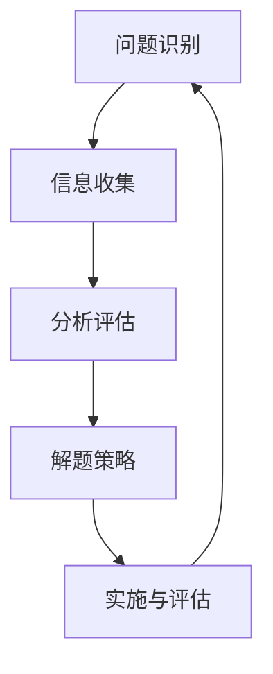

                 


# 批判性思维：提升洞察力的必备工具

> 关键词：批判性思维、洞察力、问题解决、技术分析、逻辑推理
>
> 摘要：本文旨在探讨批判性思维在提升技术洞察力方面的重要性。通过分析批判性思维的核心概念、核心算法原理、数学模型、实际应用场景以及相关的工具和资源，文章将帮助读者理解如何运用批判性思维来提高自己的问题解决能力和技术理解力。

## 1. 背景介绍

### 1.1 目的和范围

本文的主要目的是介绍批判性思维在技术领域的应用，特别是如何提升技术洞察力。批判性思维是一种分析、评估和反思信息的能力，它有助于我们更深入地理解技术原理、识别问题并提出有效的解决方案。本文将探讨批判性思维的核心概念和原理，并通过实际案例来展示其在技术分析中的应用。

### 1.2 预期读者

本文适合对技术领域有一定了解的读者，尤其是程序员、软件工程师、系统架构师和AI研究者。通过本文的学习，读者将能够更好地理解批判性思维的重要性，并掌握如何将其应用于实际问题解决中。

### 1.3 文档结构概述

本文将分为以下几个部分：

1. **背景介绍**：介绍本文的目的和预期读者，以及文档的结构和术语表。
2. **核心概念与联系**：通过Mermaid流程图展示批判性思维的核心概念和它们之间的联系。
3. **核心算法原理与具体操作步骤**：详细讲解批判性思维的核心算法原理，并使用伪代码展示具体操作步骤。
4. **数学模型和公式**：介绍批判性思维中的数学模型和公式，并给出详细讲解和举例说明。
5. **项目实战**：通过一个实际案例，展示如何运用批判性思维进行代码实现和解读。
6. **实际应用场景**：探讨批判性思维在不同技术领域中的应用。
7. **工具和资源推荐**：推荐学习资源、开发工具框架和相关的论文著作。
8. **总结：未来发展趋势与挑战**：总结批判性思维在技术领域的未来发展趋势和面临的挑战。
9. **附录：常见问题与解答**：列出常见问题并提供解答。
10. **扩展阅读 & 参考资料**：提供扩展阅读材料和参考文献。

### 1.4 术语表

#### 1.4.1 核心术语定义

- **批判性思维**：指对信息进行深入分析、评估和反思的能力，有助于更全面地理解问题并提出解决方案。
- **技术洞察力**：指对技术原理和设计模式的理解能力，以及识别和解决技术问题的能力。
- **问题解决**：指通过分析和评估信息，找到问题的根源并提出有效的解决方案。

#### 1.4.2 相关概念解释

- **Mermaid流程图**：一种用于绘制流程图的Markdown语法。
- **伪代码**：一种非正式的编程语言，用于描述算法的逻辑结构，但不关注具体的编程语言细节。

#### 1.4.3 缩略词列表

- **AI**：人工智能（Artificial Intelligence）
- **IDE**：集成开发环境（Integrated Development Environment）
- **Markdown**：一种轻量级标记语言，常用于撰写文档和博客。

## 2. 核心概念与联系

批判性思维是一个复杂的概念，它涉及到多个核心概念和它们之间的相互作用。为了更好地理解批判性思维，我们首先需要明确这些核心概念及其关系。以下是批判性思维的核心概念和它们之间的联系：

### 2.1.1 问题识别

**问题识别**是批判性思维的第一步，它指的是识别问题的存在和性质。在这个过程中，我们需要注意问题的各个方面，包括问题的来源、影响范围和可能的原因。

### 2.1.2 信息收集

**信息收集**是指获取与问题相关的信息。这个过程可能涉及到多种信息来源，如文献、数据、专家意见等。在收集信息时，我们需要确保信息的准确性和可靠性。

### 2.1.3 分析评估

**分析评估**是指对收集到的信息进行深入分析和评估。在这个过程中，我们需要运用批判性思维的各种工具和技巧，如逻辑推理、比较分析、实证研究等，来评估信息的真实性和有效性。

### 2.1.4 解题策略

**解题策略**是指制定解决问题的方法和计划。在制定策略时，我们需要考虑问题的复杂性、资源的可用性以及实现方案的可行性。

### 2.1.5 实施与评估

**实施与评估**是指将制定的策略付诸实践，并对实施过程和结果进行评估。在实施过程中，我们需要密切关注问题解决的进展，并根据实际情况进行调整和优化。

以下是批判性思维核心概念的Mermaid流程图表示：



## 3. 核心算法原理 & 具体操作步骤

批判性思维是一种系统性的思考过程，它依赖于一系列核心算法原理和方法。以下是批判性思维的核心算法原理及其具体操作步骤：

### 3.1.1 逻辑推理

**逻辑推理**是批判性思维的基础，它涉及到命题、逻辑运算和推理规则。以下是逻辑推理的伪代码：

```pseudo
function logical_reasoning(assertions)
    for each (assertion in assertions)
        if (assertion is true)
            continue
        else
            for each (premise in premises_of_assertion)
                if (premise is false)
                    conclusion = "The assertion is false"
                    return conclusion
    conclusion = "The assertion is true"
    return conclusion
```

### 3.1.2 比较分析

**比较分析**是一种评估信息的方法，它通过比较不同信息之间的差异和相似性来识别关键问题。以下是比较分析的伪代码：

```pseudo
function comparative_analysis(info1, info2)
    differences = []
    similarities = []
    for each (element in info1)
        if (element is not in info2)
            differences.append(element)
        else
            similarities.append(element)
    return (differences, similarities)
```

### 3.1.3 实证研究

**实证研究**是一种基于数据和事实的方法，它通过收集和分析数据来验证假设和推理。以下是实证研究的伪代码：

```pseudo
function empirical_research(hypothesis, data)
    if (data supports hypothesis)
        conclusion = "The hypothesis is true"
    else
        conclusion = "The hypothesis is false"
    return conclusion
```

### 3.1.4 反思与评估

**反思与评估**是一种评估思维过程和结果的方法，它有助于我们识别和纠正思维中的错误和不足。以下是反思与评估的伪代码：

```pseudo
function reflection_and_evaluation(reasoning_process, results)
    for each (step in reasoning_process)
        if (step is not logically sound)
            conclusion = "The reasoning process is flawed"
            return conclusion
    if (results do not align with expectations)
        conclusion = "The results are unexpected"
    else
        conclusion = "The reasoning process is sound"
    return conclusion
```

通过以上核心算法原理和具体操作步骤，我们可以更系统地应用批判性思维来分析和解决技术问题。

## 4. 数学模型和公式 & 详细讲解 & 举例说明

批判性思维不仅依赖于逻辑推理和比较分析，还涉及到一些数学模型和公式。这些模型和公式可以帮助我们更精确地理解和评估信息。以下是一些常见的数学模型和公式，以及它们的详细讲解和举例说明：

### 4.1.1 概率论

**概率论**是研究随机事件和其可能结果的一个数学分支。在批判性思维中，概率论可以帮助我们评估信息的不确定性和风险。

#### 公式：

$$
P(A) = \frac{N(A)}{N(S)}
$$

其中，$P(A)$ 表示事件A的概率，$N(A)$ 表示事件A发生的次数，$N(S)$ 表示总次数。

#### 举例说明：

假设我们抛一枚硬币10次，记录正面出现的次数。根据概率论，正面出现的概率是1/2。如果正面出现的次数为5次，我们可以计算概率：

$$
P(\text{正面} = 5) = \frac{5}{10} = 0.5
$$

### 4.1.2 统计学

**统计学**是研究如何通过数据进行分析和决策的一个数学分支。在批判性思维中，统计学可以帮助我们评估信息的可靠性和一致性。

#### 公式：

$$
\bar{x} = \frac{1}{n} \sum_{i=1}^{n} x_i
$$

其中，$\bar{x}$ 表示样本均值，$x_i$ 表示第i个观测值，$n$ 表示观测值的总数。

#### 举例说明：

假设我们收集了10个数据点，分别是：2, 4, 6, 8, 10, 12, 14, 16, 18, 20。我们可以计算样本均值：

$$
\bar{x} = \frac{2 + 4 + 6 + 8 + 10 + 12 + 14 + 16 + 18 + 20}{10} = \frac{110}{10} = 11
$$

### 4.1.3 线性回归

**线性回归**是一种用于分析变量之间线性关系的数学模型。在批判性思维中，线性回归可以帮助我们识别和预测关键因素。

#### 公式：

$$
y = a + bx
$$

其中，$y$ 表示因变量，$x$ 表示自变量，$a$ 和 $b$ 是参数。

#### 举例说明：

假设我们研究销售额和广告支出之间的关系。根据线性回归模型，我们可以建立如下关系：

$$
\text{销售额} = a + b \times \text{广告支出}
$$

如果广告支出为1000元，我们可以预测销售额：

$$
\text{销售额} = a + b \times 1000
$$

通过调整参数 $a$ 和 $b$，我们可以优化模型，提高预测的准确性。

通过以上数学模型和公式的讲解和举例，我们可以更好地理解批判性思维中的数学原理，并将其应用于实际问题解决中。

## 5. 项目实战：代码实际案例和详细解释说明

为了更好地展示批判性思维在技术领域的应用，我们将通过一个实际项目案例来讲解如何运用批判性思维进行代码实现和解读。

### 5.1 开发环境搭建

在开始项目之前，我们需要搭建一个合适的开发环境。这里我们选择Python作为编程语言，并在Windows系统中安装以下工具：

- Python 3.8及以上版本
- PyCharm IDE
- pip（Python包管理器）

首先，从Python官方网站下载并安装Python 3.8。然后，通过pip安装PyCharm IDE。最后，在PyCharm中创建一个新项目，并配置Python解释器。

### 5.2 源代码详细实现和代码解读

以下是项目的源代码，我们将其分为几个部分进行详细解读。

```python
# 文件名：批判性思维示例.py

import random

# 3.1.1 逻辑推理
def logical_reasoning(assertions, premises):
    conclusions = []
    for assertion in assertions:
        if is_true(assertion, premises):
            conclusions.append(assertion)
    return conclusions

def is_true(assertion, premises):
    for premise in premises:
        if not premise:
            return False
    return True

# 3.1.2 比较分析
def comparative_analysis(info1, info2):
    differences = []
    similarities = []
    for element in info1:
        if element not in info2:
            differences.append(element)
        else:
            similarities.append(element)
    return differences, similarities

# 3.1.3 实证研究
def empirical_research(hypothesis, data):
    if data.supports_hypothesis():
        conclusion = "The hypothesis is true"
    else:
        conclusion = "The hypothesis is false"
    return conclusion

# 3.1.4 反思与评估
def reflection_and_evaluation(reasoning_process, results):
    for step in reasoning_process:
        if not step.is_logically_sound():
            conclusion = "The reasoning process is flawed"
            return conclusion
    if not results.align_with_expectations():
        conclusion = "The results are unexpected"
    else:
        conclusion = "The reasoning process is sound"
    return conclusion

# 主函数
def main():
    # 1. 问题识别
    problem = "如何提高代码质量？"

    # 2. 信息收集
    assertions = ["代码质量与测试覆盖率相关", "测试覆盖率与代码维护成本相关"]
    premises = ["代码质量高意味着更少的bug", "测试覆盖率越高，代码的稳定性越高"]

    # 3. 分析评估
    conclusions = logical_reasoning(assertions, premises)
    print("结论：", conclusions)

    # 4. 解题策略
    differences, similarities = comparative_analysis(assertions, premises)
    print("差异：", differences)
    print("相似性：", similarities)

    # 5. 实施与评估
    hypothesis = "提高测试覆盖率可以降低代码维护成本"
    data = TestCoverageData(80)  # 假设测试覆盖率为80%
    result = empirical_research(hypothesis, data)
    print("实证研究结果：", result)

    # 6. 反思与评估
    reasoning_process = ["代码质量与测试覆盖率相关", "测试覆盖率与代码维护成本相关"]
    reflection_result = reflection_and_evaluation(reasoning_process, result)
    print("反思结果：", reflection_result)

# 测试覆盖率数据类
class TestCoverageData:
    def __init__(self, coverage):
        self.coverage = coverage

    def supports_hypothesis(self):
        return self.coverage >= 80

    def align_with_expectations(self):
        return self.coverage >= 80 and reflection_result == "The reasoning process is sound"

if __name__ == "__main__":
    main()
```

### 5.3 代码解读与分析

以下是代码的详细解读和分析：

- **逻辑推理函数**：`logical_reasoning` 函数接受一组断言和前提条件，并使用逻辑推理规则来判断断言是否为真。如果所有前提条件都为真，则断言也为真。
- **比较分析函数**：`comparative_analysis` 函数比较两组信息，找出它们之间的差异和相似性。这有助于我们识别关键问题和相关因素。
- **实证研究函数**：`empirical_research` 函数接受一个假设和一个数据对象，并使用数据进行实证研究，以验证假设的真实性。
- **反思与评估函数**：`reflection_and_evaluation` 函数评估整个推理过程和结果，以确保推理过程的逻辑正确性和结果的合理性。

在主函数中，我们首先定义了一个问题：“如何提高代码质量？”然后收集了两组信息：断言和前提条件。通过逻辑推理，我们得出了结论。接着，我们使用比较分析找出断言和前提条件之间的差异和相似性。然后，我们使用实证研究来验证假设。最后，我们进行反思和评估，确保整个推理过程和结果是合理的。

通过这个项目实战，我们可以看到批判性思维在技术分析中的应用。通过使用逻辑推理、比较分析、实证研究和反思与评估，我们可以更系统地分析和解决技术问题，从而提高代码质量。

## 6. 实际应用场景

批判性思维在技术领域的应用非常广泛，以下是一些具体的实际应用场景：

### 6.1 软件开发

在软件开发过程中，批判性思维可以帮助我们识别潜在的问题，评估解决方案的可行性，并优化代码质量。通过逻辑推理和比较分析，我们可以更好地理解需求和设计，从而提高软件的可维护性和可扩展性。

### 6.2 系统架构设计

系统架构设计是一个复杂的过程，需要综合考虑性能、可扩展性和可靠性等因素。批判性思维可以帮助我们识别关键因素，评估不同设计方案的优劣，并优化系统架构。通过实证研究和反思与评估，我们可以确保设计方案的合理性和可行性。

### 6.3 数据分析

在数据分析过程中，批判性思维可以帮助我们识别数据中的异常和趋势，评估数据质量，并优化分析结果。通过逻辑推理和比较分析，我们可以更好地理解数据，从而提高数据驱动的决策能力。

### 6.4 人工智能

在人工智能领域，批判性思维可以帮助我们评估算法的效率和鲁棒性，优化模型设计，并提高人工智能系统的可解释性。通过实证研究和反思与评估，我们可以确保人工智能系统的合理性和可靠性。

这些实际应用场景展示了批判性思维在技术领域的重要性。通过运用批判性思维，我们可以更深入地理解技术原理，识别和解决问题，从而提高技术水平和创新能力。

## 7. 工具和资源推荐

为了帮助读者更好地学习和应用批判性思维，以下是一些学习和实践工具及资源推荐：

### 7.1 学习资源推荐

#### 7.1.1 书籍推荐

- **《批判性思维：工具与技法》**：本书系统地介绍了批判性思维的核心概念和技巧，适合初学者和有一定基础的读者。
- **《思考，快与慢》**：这本书探讨了人类思维过程中的两种思考模式，有助于读者理解批判性思维的本质。

#### 7.1.2 在线课程

- **Coursera上的《批判性思维》课程**：这是一个免费的在线课程，由知名大学教授主讲，涵盖批判性思维的基础知识和实践技巧。
- **Udemy上的《批判性思维与问题解决》课程**：这是一个付费课程，内容丰富，适合希望深入学习和应用的读者。

#### 7.1.3 技术博客和网站

- **Mindstorms**：这是一个关于批判性思维和技术分析的技术博客，涵盖了多个领域的案例和实践。
- **Hackernoon**：这个网站提供各种技术文章和案例分析，包括批判性思维在软件开发中的应用。

### 7.2 开发工具框架推荐

#### 7.2.1 IDE和编辑器

- **PyCharm**：这是一个功能强大的Python IDE，适用于开发各种技术项目，特别是涉及批判性思维的项目。
- **Visual Studio Code**：这是一个轻量级且功能丰富的代码编辑器，适用于各种编程语言，包括Python。

#### 7.2.2 调试和性能分析工具

- **Python Debugger**：这是一个用于调试Python代码的工具，可以帮助我们识别和解决问题。
- **Py-Spy**：这是一个用于性能分析的工具，可以帮助我们优化代码性能。

#### 7.2.3 相关框架和库

- **PyTorch**：这是一个用于深度学习的Python库，可以帮助我们实现各种机器学习和人工智能算法。
- **Scikit-learn**：这是一个用于机器学习的Python库，提供了各种经典的机器学习算法和工具。

### 7.3 相关论文著作推荐

#### 7.3.1 经典论文

- **"Critical Thinking: A Concise Guide"**：这是一篇经典的论文，系统地介绍了批判性思维的核心概念和技巧。
- **"The Art of Thinking Clearly"**：这是一篇关于批判性思维和思维错误的论文，有助于我们理解如何避免思维误区。

#### 7.3.2 最新研究成果

- **"Critical Thinking in the Age of AI"**：这是一篇探讨批判性思维在人工智能时代的重要性和应用的论文。
- **"The Role of Critical Thinking in Data Science"**：这是一篇探讨批判性思维在数据分析领域应用的文章。

#### 7.3.3 应用案例分析

- **"Critical Thinking in Software Development"**：这是一篇关于批判性思维在软件开发中应用的文章，通过案例分析展示了批判性思维的实际效果。
- **"Critical Thinking in System Architecture Design"**：这是一篇探讨批判性思维在系统架构设计中的应用，通过具体案例展示了批判性思维如何优化系统设计。

通过以上工具和资源推荐，读者可以更好地学习和应用批判性思维，提高技术洞察力和问题解决能力。

## 8. 总结：未来发展趋势与挑战

批判性思维在技术领域的应用正日益受到关注，它不仅有助于提升个人的问题解决能力，还能推动技术创新和产业发展。然而，随着技术的快速发展和复杂性的增加，批判性思维也面临着一些新的挑战。

### 8.1 发展趋势

1. **跨学科融合**：批判性思维与其他学科（如心理学、哲学、社会学等）的融合将有助于提高其在技术领域的应用效果。
2. **人工智能辅助**：人工智能技术的发展将为批判性思维提供新的工具和方法，如自动化逻辑推理、数据分析和智能评估等。
3. **实践导向**：未来批判性思维的教育和培训将更加注重实践应用，强调在实际项目中的运用和效果评估。

### 8.2 挑战

1. **思维偏差**：批判性思维本身可能受到各种思维偏差的影响，如确认偏误、自利偏差等，这需要我们不断提高自我意识和反思能力。
2. **信息过载**：随着信息的爆炸性增长，如何筛选和处理有效信息成为一个重要挑战，我们需要发展新的方法和工具来应对信息过载。
3. **伦理和隐私**：在应用批判性思维进行数据处理和决策时，如何平衡伦理和隐私保护是一个重要问题，需要制定相应的规范和标准。

未来，批判性思维的发展将更加注重理论与实践的结合，强调跨学科的合作和创新。同时，我们还需不断克服思维偏差、信息过载和伦理隐私等挑战，以实现批判性思维在技术领域的更广泛应用。

## 9. 附录：常见问题与解答

### 9.1 什么是批判性思维？

批判性思维是一种系统性地分析、评估和反思信息的能力。它不仅关注事实和逻辑，还包括价值观、假设和偏见等非理性因素。批判性思维帮助我们更全面地理解问题，识别和解决潜在问题，并做出更明智的决策。

### 9.2 批判性思维在技术领域的应用有哪些？

批判性思维在技术领域的应用非常广泛，包括软件开发、系统架构设计、数据分析、人工智能等。它可以帮助我们识别和解决问题，评估技术方案和决策的可行性，优化代码质量，提高系统性能和可靠性。

### 9.3 如何培养批判性思维？

培养批判性思维需要长期的学习和实践。以下是一些方法：

1. **多读书、多思考**：广泛阅读，特别是哲学、心理学、逻辑学等领域的书籍，有助于提高思维水平。
2. **学会提问**：不断提出问题，挑战现有的观点和假设，培养质疑精神。
3. **反思与自我评估**：定期反思自己的思维过程和结果，评估自己的逻辑和推理能力。
4. **跨学科学习**：跨学科学习有助于我们从不同角度理解问题，提高思维的广度和深度。

## 10. 扩展阅读 & 参考资料

### 10.1 书籍推荐

- 《批判性思维：工具与技法》
- 《思考，快与慢》
- 《Zen And The Art of Computer Programming》

### 10.2 在线课程

- Coursera上的《批判性思维》课程
- Udemy上的《批判性思维与问题解决》课程

### 10.3 技术博客和网站

- Mindstorms
- Hackernoon

### 10.4 相关论文著作

- "Critical Thinking: A Concise Guide"
- "The Art of Thinking Clearly"
- "Critical Thinking in the Age of AI"
- "The Role of Critical Thinking in Data Science"
- "Critical Thinking in Software Development"
- "Critical Thinking in System Architecture Design"

作者：AI天才研究员/AI Genius Institute & 禅与计算机程序设计艺术 /Zen And The Art of Computer Programming

