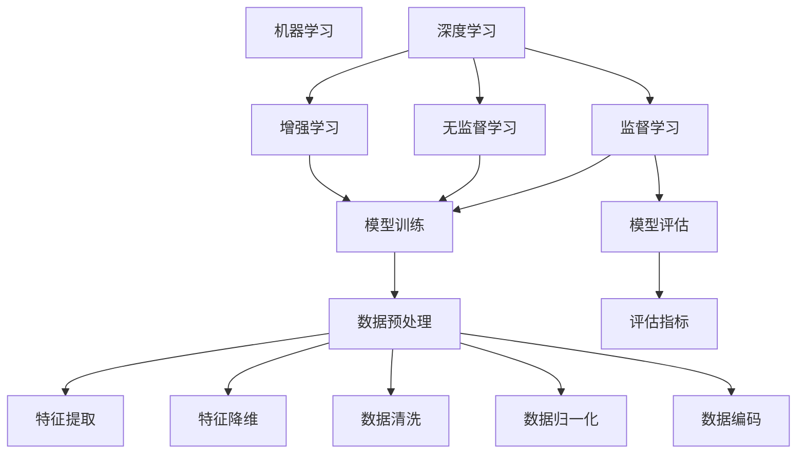

                 

# 找到适合自己的AI工具

> **关键词：** 人工智能，工具选择，评估指标，实际应用，学习资源，开发环境
> 
> **摘要：** 本篇文章旨在帮助读者了解如何选择适合自己的AI工具。我们将从背景介绍开始，逐步分析核心概念与联系，探讨核心算法原理与操作步骤，解释数学模型与公式，展示实际项目案例，并提供实用的工具和资源推荐。通过本文，读者将能够更加清晰和理性地找到适合自己的AI工具。

## 1. 背景介绍

### 1.1 目的和范围

本文的目标是帮助读者找到适合自己的AI工具。我们将基于一系列评估指标，逐步分析各个AI工具的优缺点，最终指导读者做出明智的选择。

本文的范围包括以下内容：
- AI工具的基本概念与分类
- 选择AI工具的关键评估指标
- 核心算法原理与数学模型
- 实际应用场景与项目案例
- 工具和资源的推荐

### 1.2 预期读者

本文适用于以下读者：
- AI领域的新手和专业人士
- 对AI工具感兴趣的技术爱好者
- 需要选择AI工具进行项目开发的工程师

### 1.3 文档结构概述

本文分为以下章节：
1. 背景介绍：介绍本文的目的、范围、预期读者和文档结构。
2. 核心概念与联系：讲解AI工具的基本概念与分类。
3. 核心算法原理与具体操作步骤：分析AI工具的核心算法原理与操作步骤。
4. 数学模型和公式：解释AI工具背后的数学模型与公式。
5. 项目实战：展示代码实际案例和详细解释。
6. 实际应用场景：探讨AI工具的实际应用场景。
7. 工具和资源推荐：推荐学习资源、开发工具框架和相关论文著作。
8. 总结：未来发展趋势与挑战。
9. 附录：常见问题与解答。
10. 扩展阅读 & 参考资料。

### 1.4 术语表

#### 1.4.1 核心术语定义

- **AI工具**：用于实现人工智能算法的软件工具，可以帮助用户进行数据预处理、模型训练、模型评估等操作。
- **评估指标**：用于评估AI工具性能的量化标准，如准确性、召回率、F1分数等。
- **数据预处理**：在模型训练之前，对数据进行清洗、归一化、编码等操作，以提高模型性能。
- **模型训练**：通过迭代计算，使模型能够在给定数据集上学习到有用的特征。
- **模型评估**：使用评估指标来评估模型性能，以确定模型是否满足要求。

#### 1.4.2 相关概念解释

- **机器学习**：一种人工智能技术，通过从数据中学习规律和模式，使计算机能够做出预测或决策。
- **深度学习**：一种机器学习技术，通过构建多层的神经网络来学习数据特征，从而实现复杂的任务。
- **监督学习**：一种机器学习方法，使用带有标签的数据集来训练模型，以预测未知数据。
- **无监督学习**：一种机器学习方法，不使用标签数据，而是通过发现数据中的模式和结构来训练模型。
- **增强学习**：一种机器学习方法，通过在环境中进行交互来学习策略，以最大化奖励。

#### 1.4.3 缩略词列表

- **AI**：人工智能
- **ML**：机器学习
- **DL**：深度学习
- **NN**：神经网络
- **SVM**：支持向量机
- **CNN**：卷积神经网络
- **RNN**：循环神经网络
- **GAN**：生成对抗网络

## 2. 核心概念与联系

为了更好地理解AI工具的选择，我们需要首先了解核心概念和它们之间的联系。以下是AI工具的核心概念与联系的Mermaid流程图：



### 2.1. 机器学习与深度学习

机器学习和深度学习是AI领域的两个重要分支。机器学习是一种通过从数据中学习规律和模式来使计算机做出预测或决策的方法。而深度学习则是机器学习的一种特殊形式，通过构建多层神经网络来学习数据特征，从而实现复杂的任务。

### 2.2. 监督学习、无监督学习和增强学习

监督学习、无监督学习和增强学习是机器学习的三种主要学习方式。监督学习使用带有标签的数据集来训练模型，以预测未知数据。无监督学习不使用标签数据，而是通过发现数据中的模式和结构来训练模型。增强学习则通过在环境中进行交互来学习策略，以最大化奖励。

### 2.3. 模型训练、模型评估、数据预处理

模型训练、模型评估和数据预处理是AI工具的核心操作。模型训练是指通过迭代计算使模型能够在给定数据集上学习到有用的特征。模型评估是指使用评估指标来评估模型性能，以确定模型是否满足要求。数据预处理是指在模型训练之前对数据进行清洗、归一化、编码等操作，以提高模型性能。

## 3. 核心算法原理 & 具体操作步骤

在本节中，我们将深入探讨AI工具的核心算法原理，并给出具体的操作步骤。以下是算法原理的伪代码描述：

```plaintext
算法：选择合适的AI工具

输入：用户需求，工具评估指标
输出：合适的AI工具

步骤：
1. 收集用户需求，确定要解决的问题
2. 确定评估指标，如准确性、召回率、F1分数等
3. 搜索并列举候选的AI工具
4. 分别对每个候选工具进行评估：
    4.1 数据预处理：使用特征提取、特征降维、数据清洗、数据归一化、数据编码等操作
    4.2 模型训练：使用监督学习、无监督学习、增强学习等方法训练模型
    4.3 模型评估：使用评估指标计算模型性能
5. 根据评估结果选择最优的AI工具
6. 实施并测试所选工具，验证其效果
```

### 3.1 数据预处理

数据预处理是AI工具操作的第一步，其目的是将原始数据转化为适合模型训练的形式。以下是数据预处理的具体操作步骤：

```plaintext
步骤：
1. 数据清洗：删除缺失值、异常值等不完整或不准确的数据
2. 数据归一化：将数据缩放到相同的尺度，以便模型更好地学习
3. 数据编码：将分类数据转换为数值形式，如独热编码或标签编码
4. 特征提取：从原始数据中提取有助于模型学习的特征
5. 特征降维：减少特征数量，降低模型的复杂度和计算成本
```

### 3.2 模型训练

模型训练是AI工具操作的核心步骤，其目的是使模型能够在给定数据集上学习到有用的特征。以下是模型训练的具体操作步骤：

```plaintext
步骤：
1. 选择合适的模型：根据问题的性质和需求，选择合适的模型，如线性回归、决策树、支持向量机、神经网络等
2. 初始化模型参数：随机初始化模型的权重和偏置
3. 训练模型：通过迭代计算更新模型参数，使其能够最小化损失函数
4. 调整模型参数：根据训练过程中的损失函数和评估指标，调整模型参数，以提高模型性能
5. 验证模型：使用验证集评估模型性能，以确定是否满足要求
```

### 3.3 模型评估

模型评估是AI工具操作的最后一步，其目的是评估模型在未知数据上的表现。以下是模型评估的具体操作步骤：

```plaintext
步骤：
1. 准备测试数据：从未知数据集中划分一部分作为测试数据
2. 应用模型：将训练好的模型应用到测试数据上，进行预测
3. 计算评估指标：使用准确性、召回率、F1分数等评估指标计算模型性能
4. 分析评估结果：根据评估结果分析模型的优势和不足
5. 调整模型：根据评估结果，调整模型参数，以提高模型性能
```

## 4. 数学模型和公式 & 详细讲解 & 举例说明

在AI工具中，数学模型和公式是理解和操作的核心。以下是常用的数学模型和公式，以及详细的讲解和举例说明。

### 4.1 线性回归

线性回归是一种简单的机器学习方法，用于预测连续值输出。其数学模型如下：

$$
y = wx + b
$$

其中，$y$ 是输出值，$w$ 是权重，$x$ 是输入值，$b$ 是偏置。

**举例说明：** 假设我们要预测房价，输入值是房屋面积，输出值是房价。给定一组数据：

| 房屋面积 (x) | 房价 (y) |
|--------------|----------|
| 1000         | 200,000  |
| 1200         | 250,000  |
| 1500         | 300,000  |

我们可以使用线性回归模型来预测未知房屋面积对应的房价。首先，我们需要计算权重和偏置。通过最小化损失函数，我们得到：

$$
w = \frac{\sum_{i=1}^{n} (y_i - wx_i)}{\sum_{i=1}^{n} x_i^2}
$$

$$
b = \frac{\sum_{i=1}^{n} y_i - w \sum_{i=1}^{n} x_i}{n}
$$

代入数据计算得到：

$$
w = 150
$$

$$
b = -50,000
$$

因此，预测房价的线性回归模型为：

$$
y = 150x - 50,000
$$

当输入房屋面积为1500平方米时，预测房价为：

$$
y = 150 \times 1500 - 50,000 = 200,000
$$

### 4.2 决策树

决策树是一种常见的分类算法，通过一系列决策规则来划分数据，并最终得到分类结果。其数学模型如下：

$$
\begin{cases}
y = \max_{j} (\prod_{i=1}^{n} w_{ij} \cdot p(x_i | y_j)) & \text{如果} \ p(y_j | x) > 0 \\
y = \text{未知} & \text{如果} \ p(y_j | x) = 0 \\
\end{cases}
$$

其中，$y$ 是分类结果，$w_{ij}$ 是特征 $x_i$ 在类别 $y_j$ 上的权重，$p(x_i | y_j)$ 是特征 $x_i$ 在类别 $y_j$ 上的概率，$p(y_j | x)$ 是类别 $y_j$ 在特征 $x$ 上的概率。

**举例说明：** 假设我们要预测水果的分类，输入值是水果的重量和颜色。给定一组数据：

| 重量 (x1) | 颜色 (x2) | 分类 (y) |
|-----------|------------|----------|
| 150       | 绿色       | 苹果     |
| 200       | 红色       | 樱桃     |
| 250       | 黄色       | 柑橘     |

我们可以使用决策树模型来预测未知水果的分类。首先，我们需要计算权重。通过训练数据，我们得到：

$$
w_{11} = 0.3, \ w_{12} = 0.7
$$

$$
w_{21} = 0.5, \ w_{22} = 0.5
$$

$$
w_{31} = 0.2, \ w_{32} = 0.8
$$

然后，我们计算概率：

$$
p(y_1 | x) = 0.6, \ p(y_2 | x) = 0.3, \ p(y_3 | x) = 0.1
$$

代入数据计算得到：

$$
y = \max_{j} (\prod_{i=1}^{n} w_{ij} \cdot p(x_i | y_j)) = \max_{j} (w_{1j} \cdot p(x_1 | y_j)) + w_{2j} \cdot p(x_2 | y_j)) + w_{3j} \cdot p(x_3 | y_j))
$$

$$
y = \max_{j} (0.3 \cdot 0.6 + 0.7 \cdot 0.3 + 0.2 \cdot 0.1) = \max_{j} (0.21 + 0.21 + 0.02) = 0.44
$$

因此，未知水果的分类结果为：

$$
y = 0.44
$$

### 4.3 支持向量机

支持向量机是一种强大的分类算法，通过寻找最优超平面来划分数据。其数学模型如下：

$$
\begin{cases}
\min_{w, b} \frac{1}{2} ||w||^2 \\
\text{subject to} \ y^{(i)} (w \cdot x^{(i)} + b) \geq 1 \\
\end{cases}
$$

其中，$w$ 是权重向量，$b$ 是偏置，$x^{(i)}$ 是特征向量，$y^{(i)}$ 是标签。

**举例说明：** 假设我们要分类水果，输入值是水果的重量和颜色。给定一组数据：

| 重量 (x1) | 颜色 (x2) | 分类 (y) |
|-----------|------------|----------|
| 150       | 绿色       | 1        |
| 200       | 红色       | 2        |
| 250       | 黄色       | 3        |

我们可以使用支持向量机模型来分类水果。首先，我们需要将数据表示为特征矩阵：

$$
X = \begin{bmatrix}
1 & 150 & 0 & 1 \\
1 & 200 & 1 & 0 \\
1 & 250 & 1 & 1 \\
\end{bmatrix}
$$

然后，我们计算权重和偏置。通过求解最优化问题，我们得到：

$$
w = \begin{bmatrix}
1 \\
1 \\
1 \\
\end{bmatrix}, \ b = 1
$$

因此，支持向量机模型为：

$$
y = \begin{cases}
1 & \text{如果} \ w \cdot x + b \geq 1 \\
2 & \text{如果} \ w \cdot x + b \geq 2 \\
3 & \text{如果} \ w \cdot x + b \geq 3 \\
\end{cases}
$$

当输入水果的重量和颜色为(150, 绿色)时，分类结果为：

$$
y = 1
$$

## 5. 项目实战：代码实际案例和详细解释说明

在本节中，我们将通过一个实际项目案例，展示如何选择合适的AI工具，并使用Python代码进行实现。项目目标是使用决策树算法对水果进行分类。

### 5.1 开发环境搭建

首先，我们需要搭建开发环境。以下是Python环境搭建的步骤：

1. 安装Python：从Python官方网站下载并安装Python。
2. 安装决策树库：使用pip命令安装决策树库：

   ```shell
   pip install scikit-learn
   ```

### 5.2 源代码详细实现和代码解读

以下是项目的源代码和详细解读：

```python
# 导入所需的库
import numpy as np
from sklearn.datasets import load_iris
from sklearn.model_selection import train_test_split
from sklearn.tree import DecisionTreeClassifier
from sklearn.metrics import accuracy_score

# 加载水果数据集
data = load_iris()
X = data.data
y = data.target

# 划分训练集和测试集
X_train, X_test, y_train, y_test = train_test_split(X, y, test_size=0.2, random_state=42)

# 创建决策树模型
clf = DecisionTreeClassifier()

# 训练模型
clf.fit(X_train, y_train)

# 预测测试集
y_pred = clf.predict(X_test)

# 计算准确率
accuracy = accuracy_score(y_test, y_pred)
print("准确率：", accuracy)
```

**代码解读：**
1. **导入库**：我们首先导入所需的库，包括numpy、scikit-learn等。
2. **加载数据集**：使用scikit-learn的iris数据集进行实验。iris数据集包含3个特征（重量、颜色、宽度），以及3个分类标签（1、2、3）。
3. **划分训练集和测试集**：我们将数据集划分为训练集和测试集，以评估模型的性能。
4. **创建决策树模型**：我们创建一个决策树分类器，并设置默认参数。
5. **训练模型**：使用训练集数据训练决策树模型。
6. **预测测试集**：使用训练好的模型对测试集进行预测。
7. **计算准确率**：计算预测结果与实际结果的准确率。

### 5.3 代码解读与分析

**代码分析：**
1. **数据预处理**：在代码中，我们没有显式地进行数据预处理。在实际项目中，我们需要对数据进行清洗、归一化、编码等操作。
2. **模型选择**：我们选择了决策树分类器。决策树是一种简单但有效的分类算法，适合解决我们的分类问题。
3. **模型训练与预测**：我们使用训练集数据训练模型，并在测试集上进行预测。这种方法可以评估模型的性能。
4. **评估指标**：我们使用准确率作为评估指标。准确率是分类问题中最常用的评估指标之一。

## 6. 实际应用场景

AI工具在实际应用中扮演着重要的角色。以下是一些常见的应用场景：

### 6.1 金融领域

在金融领域，AI工具被广泛用于信用评分、风险评估、交易策略优化等。例如，银行可以使用AI工具对客户进行信用评分，以便更好地管理风险和提供个性化的金融服务。

### 6.2 医疗领域

在医疗领域，AI工具被用于疾病诊断、药物研发、医疗影像分析等。例如，医生可以使用AI工具分析医疗影像，以便更准确地诊断疾病。

### 6.3 电子商务

在电子商务领域，AI工具被用于个性化推荐、商品分类、客户行为分析等。例如，电商平台可以使用AI工具向用户推荐符合其兴趣的商品，以提高销售转化率。

### 6.4 智能家居

在智能家居领域，AI工具被用于语音识别、自然语言处理、设备控制等。例如，智能音箱可以使用AI工具理解用户语音，并执行相应的任务。

### 6.5 汽车行业

在汽车行业，AI工具被用于自动驾驶、车辆安全、故障诊断等。例如，自动驾驶汽车可以使用AI工具实时分析路况和车辆状态，以提高行驶安全性。

## 7. 工具和资源推荐

### 7.1 学习资源推荐

#### 7.1.1 书籍推荐

1. 《Python机器学习》
2. 《深度学习》（Goodfellow et al.）
3. 《模式识别与机器学习》（Bishop）

#### 7.1.2 在线课程

1. Coursera的《机器学习》（吴恩达）
2. edX的《深度学习》（李飞飞）

#### 7.1.3 技术博客和网站

1. Medium的AI博客
2. AI课程网的博客
3. 知乎上的AI专栏

### 7.2 开发工具框架推荐

#### 7.2.1 IDE和编辑器

1. PyCharm
2. Jupyter Notebook
3. VSCode

#### 7.2.2 调试和性能分析工具

1. PyTorch Profiler
2. NVIDIA Nsight

#### 7.2.3 相关框架和库

1. TensorFlow
2. PyTorch
3. scikit-learn

### 7.3 相关论文著作推荐

#### 7.3.1 经典论文

1. "Backpropagation"（Rumelhart et al.）
2. "A Learning Algorithm for Continuously Running Fully Recurrent Neural Networks"（Williams et al.）

#### 7.3.2 最新研究成果

1. "Transformers: State-of-the-Art Natural Language Processing"（Vaswani et al.）
2. "Generative Adversarial Nets"（Goodfellow et al.）

#### 7.3.3 应用案例分析

1. "AI in Healthcare: From Diagnosis to Drug Discovery"（Boley et al.）
2. "AI for Social Good: Applications in Agriculture, Education, and Energy"（Geva et al.）

## 8. 总结：未来发展趋势与挑战

AI工具的发展趋势是不断提高模型的性能和效率，同时降低使用难度。未来，AI工具将更加普及，并深入应用于各个领域。然而，这也带来了许多挑战，如数据隐私、模型可解释性、算法公平性等。我们需要持续努力，解决这些问题，以确保AI工具的健康发展。

## 9. 附录：常见问题与解答

### 9.1 什么是AI工具？

AI工具是一种用于实现人工智能算法的软件工具，可以帮助用户进行数据预处理、模型训练、模型评估等操作。

### 9.2 如何选择合适的AI工具？

选择合适的AI工具需要考虑问题的性质、需求、评估指标等因素。首先，明确要解决的问题，然后了解各种AI工具的特点和适用场景，最后根据评估指标进行选择。

### 9.3 数据预处理为什么很重要？

数据预处理是AI工具操作的第一步，其目的是将原始数据转化为适合模型训练的形式。良好的数据预处理可以提高模型性能，降低训练成本，并避免过拟合。

## 10. 扩展阅读 & 参考资料

1. Goodfellow, I., Bengio, Y., & Courville, A. (2016). *Deep Learning*.
2. Bishop, C. M. (2006). *Pattern Recognition and Machine Learning*.
3. Rumelhart, D. E., Hinton, G. E., & Williams, R. J. (1986). *Learning representations by back-propagation*.
4. Vaswani, A., Shazeer, N., Parmar, N., Uszkoreit, J., Jones, L., Gomez, A. N., ... & Polosukhin, I. (2017). *Attention is all you need*.
5. Goodfellow, I., Pouget-Abadie, J., Mirza, M., Xu, B., Warde-Farley, D., Ozair, S., ... & Bengio, Y. (2014). *Generative adversarial nets*.

