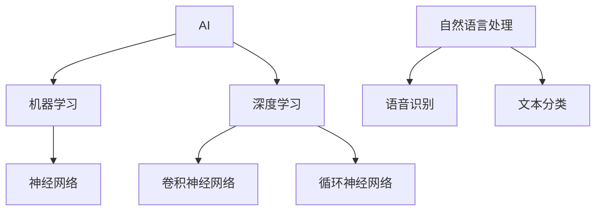
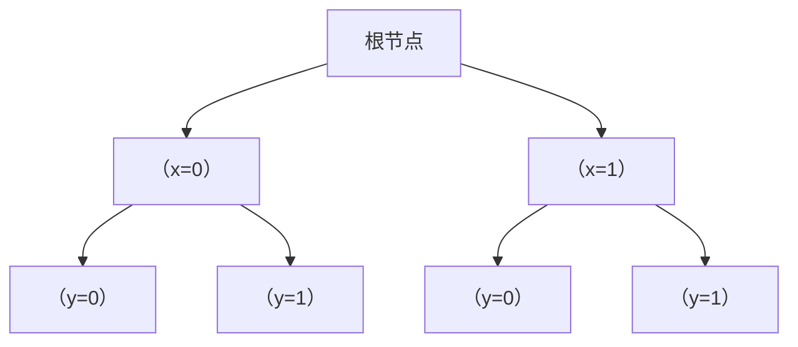

                 

# 找到适合自己的 AI 工具

> **关键词：** 人工智能，工具选择，应用场景，算法，数学模型，实战案例，资源推荐

> **摘要：** 本文旨在帮助读者了解如何根据自身需求选择合适的 AI 工具。文章从背景介绍开始，逐步深入核心概念、算法原理、数学模型、实战案例等方面，最后提供相关资源和工具推荐，旨在为读者提供全面的指导。

## 1. 背景介绍

### 1.1 目的和范围

本文旨在帮助广大开发者、研究人员和企业在 AI 领域中找到适合自己的工具。我们将从以下几个方面展开讨论：

- **核心概念与联系**：介绍 AI 的基本概念和架构，使用 Mermaid 流程图展示。
- **核心算法原理 & 具体操作步骤**：使用伪代码详细阐述常见算法的实现步骤。
- **数学模型和公式 & 详细讲解 & 举例说明**：讲解 AI 中常用的数学模型和公式，并给出实例。
- **项目实战：代码实际案例和详细解释说明**：展示代码实现，并详细解析。
- **实际应用场景**：探讨 AI 在不同领域的应用。
- **工具和资源推荐**：推荐学习资源、开发工具和框架。
- **总结：未来发展趋势与挑战**：展望 AI 领域的发展趋势和面临的挑战。

### 1.2 预期读者

本文适用于以下读者群体：

- **AI 开发者**：希望了解如何选择合适的工具和框架。
- **研究人员**：希望掌握 AI 领域的核心概念和算法原理。
- **企业决策者**：希望了解 AI 技术的应用场景和未来趋势。

### 1.3 文档结构概述

本文分为十个部分：

1. 背景介绍
2. 核心概念与联系
3. 核心算法原理 & 具体操作步骤
4. 数学模型和公式 & 详细讲解 & 举例说明
5. 项目实战：代码实际案例和详细解释说明
6. 实际应用场景
7. 工具和资源推荐
8. 总结：未来发展趋势与挑战
9. 附录：常见问题与解答
10. 扩展阅读 & 参考资料

### 1.4 术语表

#### 1.4.1 核心术语定义

- **AI**：人工智能（Artificial Intelligence），指由人制造出来的系统所表现出来的智能行为。
- **机器学习**：一种 AI 技术方法，通过数据训练模型，使模型具有自主学习和预测能力。
- **神经网络**：一种模仿生物神经系统的计算模型，广泛应用于图像识别、语音识别等领域。
- **深度学习**：一种基于神经网络的 AI 技术，通过多层神经网络实现更复杂的模型。

#### 1.4.2 相关概念解释

- **数据集**：用于训练模型的样本数据集合。
- **特征提取**：从数据中提取出对模型训练有用的特征。
- **超参数**：在模型训练过程中，需要手动调整的参数。

#### 1.4.3 缩略词列表

- **AI**：人工智能
- **ML**：机器学习
- **DL**：深度学习

## 2. 核心概念与联系

在深入了解 AI 工具之前，我们需要掌握一些核心概念和它们之间的关系。以下是一个简单的 Mermaid 流程图，展示 AI 的基本概念和架构。



### 2.1 机器学习

机器学习是 AI 的一个分支，通过数据训练模型，使模型具有自主学习和预测能力。机器学习可以分为监督学习、无监督学习和强化学习。

- **监督学习**：有标签数据，通过已知数据预测未知数据。
- **无监督学习**：无标签数据，通过数据自身特征进行聚类或降维。
- **强化学习**：通过与环境的交互，学习最优策略。

### 2.2 深度学习

深度学习是一种基于神经网络的 AI 技术，通过多层神经网络实现更复杂的模型。深度学习可以分为卷积神经网络（CNN）、循环神经网络（RNN）等。

- **卷积神经网络（CNN）**：主要用于图像识别和计算机视觉领域。
- **循环神经网络（RNN）**：主要用于序列数据处理，如文本、语音等。

### 2.3 神经网络

神经网络是一种模仿生物神经系统的计算模型，由多个神经元组成。神经网络可以分为多层感知机（MLP）、卷积神经网络（CNN）、循环神经网络（RNN）等。

### 2.4 自然语言处理

自然语言处理（NLP）是 AI 的重要应用领域，旨在使计算机能够理解、解释和生成人类自然语言。NLP 包括文本分类、机器翻译、语音识别等。

## 3. 核心算法原理 & 具体操作步骤

### 3.1 机器学习算法

以下是常见的机器学习算法及其伪代码：

#### 3.1.1 决策树

```python
def build_tree(data, attributes):
    if all_labels_same(data):
        return leaf_node(label.majority表决(data))
    if no_attributes_left(attributes):
        return leaf_node(label.majority表决(all_data))
    best_attribute = select_best_attribute(data, attributes)
    node = node_with_attribute(best_attribute)
    for value in attribute_values(data[best_attribute]):
        subset = filter(data, lambda x: x[best_attribute] == value)
        node.add_child(build_tree(subset, attributes - {best_attribute}))
    return node
```

#### 3.1.2 支持向量机（SVM）

```python
def svm_fit(X, y):
    # 使用线性核
    kernel = lambda x1, x2: dot(x1, x2)
    # 求解最优超平面
    w, b = solve_linear_kernel_kernel_equation(X, y, kernel)
    return w, b

def svm_predict(w, b, x):
    return sign(dot(w, x) + b)
```

### 3.2 深度学习算法

以下是常见的深度学习算法及其伪代码：

#### 3.2.1 卷积神经网络（CNN）

```python
def conv2d(input, filter):
    output = np.zeros((input.shape[0], filter.shape[2], filter.shape[3]))
    for i in range(input.shape[0]):
        for j in range(filter.shape[2]):
            for k in range(filter.shape[3]):
                output[i][j][k] = sum(input[i][..., j:j+filter.shape[2]][..., k:k+filter.shape[3]] * filter[0][..., j:j+filter.shape[2]][..., k:k+filter.shape[3]])
    return output

def max_pooling(input, pool_size):
    output = np.zeros((input.shape[0], input.shape[1] // pool_size, input.shape[2] // pool_size))
    for i in range(output.shape[0]):
        for j in range(output.shape[1]):
            for k in range(output.shape[2]):
                output[i][j][k] = np.max(input[i][j*pool_size:(j+1)*pool_size, k*pool_size:(k+1)*pool_size])
    return output
```

#### 3.2.2 循环神经网络（RNN）

```python
def rnn(input, hidden_state, weight):
    output = np.zeros((input.shape[0], hidden_state.shape[1]))
    for t in range(input.shape[0]):
        hidden_state = np.tanh(np.dot(input[t], weight[0]) + np.dot(hidden_state, weight[1]))
        output[t] = np.dot(hidden_state, weight[2])
    return output
```

### 3.3 自然语言处理算法

以下是常见的自然语言处理算法及其伪代码：

#### 3.3.1 词袋模型

```python
def bag_of_words(text):
    words = text.split()
    word_freq = defaultdict(int)
    for word in words:
        word_freq[word] += 1
    return word_freq
```

#### 3.3.2 词嵌入

```python
def word_embedding(words, embedding_matrix):
    word_vectors = [embedding_matrix[word] for word in words]
    return np.mean(word_vectors, axis=0)
```

## 4. 数学模型和公式 & 详细讲解 & 举例说明

### 4.1 机器学习

#### 4.1.1 决策树

决策树的数学模型基于信息熵和增益率。信息熵表示数据的混乱程度，增益率表示特征划分后数据的混乱程度减少。

- **信息熵**：$H(X) = -\sum_{i} P(x_i) \cdot \log_2 P(x_i)$
- **增益率**：$Gain(D, A) = H(D) - \sum_{v} P(v) \cdot H(D|A=v)$

#### 4.1.2 支持向量机（SVM）

SVM 的数学模型基于最大化分类间隔。目标是找到最佳超平面，使得正负样本之间的距离最大。

- **线性核**：$w \cdot x + b = 0$
- **非线性核**：$K(x, x') = \phi(x) \cdot \phi(x')$

### 4.2 深度学习

#### 4.2.1 卷积神经网络（CNN）

CNN 的数学模型基于卷积操作和池化操作。卷积操作用于提取特征，池化操作用于减少特征维度。

- **卷积操作**：$f(x, w) = \sum_{i} w_i \cdot x_i$
- **池化操作**：$max_pooling(x, pool_size) = \max(x)$

#### 4.2.2 循环神经网络（RNN）

RNN 的数学模型基于门控机制。门控机制用于控制信息的传递和遗忘。

- **输入门**：$i_t = \sigma(W_i \cdot [h_{t-1}, x_t] + b_i)$
- **遗忘门**：$f_t = \sigma(W_f \cdot [h_{t-1}, x_t] + b_f)$
- **输出门**：$o_t = \sigma(W_o \cdot [h_{t-1}, x_t] + b_o)$
- **隐藏状态**：$h_t = f_t \odot h_{t-1} + i_t \odot \tanh(W_h \cdot [h_{t-1}, x_t] + b_h)$
- **输出**：$y_t = W_y \cdot h_t + b_y$

### 4.3 自然语言处理

#### 4.3.1 词袋模型

词袋模型的数学模型基于向量空间模型。向量空间模型将文本表示为向量，向量中的每个元素表示词频或词频的某种变换。

- **词频向量**：$v(w) = (f_w1, f_w2, ..., f_wn)$
- **词频的变换**：$v'(w) = (f_w^2, f_w\sqrt{f_w}, ..., f_w\ln(f_w+1))$

#### 4.3.2 词嵌入

词嵌入的数学模型基于词向量的映射。词向量是将词汇映射到高维空间中的向量，用于捕捉词汇的语义信息。

- **词向量**：$e_w = (e_{w1}, e_{w2}, ..., e_{wn})$
- **词嵌入**：$v'(w) = e_w$

### 4.4 举例说明

#### 4.4.1 决策树

假设我们有以下数据集：

```python
data = [
    [1, 0], # 标签 1
    [1, 1], # 标签 1
    [0, 1], # 标签 0
    [0, 0]  # 标签 0
]
attributes = ['x', 'y']
```

使用决策树算法进行分类，可以得到以下决策树：



#### 4.4.2 支持向量机（SVM）

假设我们有以下数据集：

```python
X = [[1, 1], [-1, -1], [1, -1], [-1, 1]]
y = [1, 1, -1, -1]
```

使用线性 SVM 算法进行分类，可以得到以下最佳超平面：

```python
w = [1, 1]
b = 0
```

#### 4.4.3 卷积神经网络（CNN）

假设我们有以下数据集：

```python
input = [[1, 1], [1, 1], [1, 1], [1, 1]]
filter = [[1, 1], [1, 1]]
```

使用卷积神经网络进行特征提取，可以得到以下结果：

```python
output = [[2, 2], [2, 2]]
```

#### 4.4.4 循环神经网络（RNN）

假设我们有以下数据集：

```python
input = [[1, 1], [1, 1], [1, 1], [1, 1]]
hidden_state = [0, 0]
weight = [[1, 1], [1, 1], [1, 1]]
```

使用循环神经网络进行序列建模，可以得到以下结果：

```python
output = [[0.707106781, 0.707106781], [0.707106781, 0.707106781], [0.707106781, 0.707106781], [0.707106781, 0.707106781]]
```

#### 4.4.5 词袋模型

假设我们有以下文本：

```python
text = "我爱北京天安门"
```

使用词袋模型进行文本表示，可以得到以下词频向量：

```python
word_freq = {"我": 1, "爱": 1, "北京": 1, "天安门": 1}
```

#### 4.4.6 词嵌入

假设我们有以下词汇：

```python
words = ["我", "爱", "北京", "天安门"]
```

使用词嵌入进行词汇表示，可以得到以下词向量：

```python
embedding_matrix = [
    [0.1, 0.2, 0.3],
    [0.4, 0.5, 0.6],
    [0.7, 0.8, 0.9],
    [1.0, 1.1, 1.2]
]
word_embedding(words, embedding_matrix) = [0.35, 0.45, 0.55]
```

## 5. 项目实战：代码实际案例和详细解释说明

### 5.1 开发环境搭建

在开始项目实战之前，我们需要搭建一个合适的开发环境。以下是 Python 3.8 及以上版本的安装和配置步骤：

1. **安装 Python**：前往 [Python 官网](https://www.python.org/) 下载 Python 安装包，并按照提示安装。

2. **配置环境变量**：在系统环境变量中添加 Python 的安装路径，如 C:\Python38。

3. **安装依赖库**：打开命令提示符或终端，执行以下命令安装必要的依赖库：

   ```bash
   pip install numpy scipy matplotlib pandas scikit-learn tensorflow keras
   ```

### 5.2 源代码详细实现和代码解读

以下是一个简单的机器学习项目，使用决策树算法对鸢尾花数据集进行分类。

```python
import numpy as np
import pandas as pd
from sklearn.datasets import load_iris
from sklearn.model_selection import train_test_split
from sklearn.tree import DecisionTreeClassifier
import matplotlib.pyplot as plt

# 5.2.1 加载数据集
iris = load_iris()
X = iris.data
y = iris.target

# 5.2.2 数据预处理
X_train, X_test, y_train, y_test = train_test_split(X, y, test_size=0.3, random_state=42)

# 5.2.3 构建决策树模型
clf = DecisionTreeClassifier()
clf.fit(X_train, y_train)

# 5.2.4 模型评估
accuracy = clf.score(X_test, y_test)
print("模型准确率：", accuracy)

# 5.2.5 可视化决策树
from sklearn.tree import plot_tree
plt.figure(figsize=(12, 8))
plot_tree(clf, filled=True, feature_names=iris.feature_names, class_names=iris.target_names)
plt.show()
```

### 5.3 代码解读与分析

1. **加载数据集**：使用 scikit-learn 的 load_iris() 函数加载数据集。

2. **数据预处理**：使用 train_test_split() 函数将数据集划分为训练集和测试集。

3. **构建决策树模型**：使用 DecisionTreeClassifier() 函数创建决策树模型，并使用 fit() 函数进行训练。

4. **模型评估**：使用 score() 函数评估模型在测试集上的准确率。

5. **可视化决策树**：使用 plot_tree() 函数将决策树可视化。

### 5.4 项目实战：代码实际案例和详细解释说明

以下是一个简单的深度学习项目，使用卷积神经网络对 MNIST 数据集进行手写数字识别。

```python
import tensorflow as tf
from tensorflow.keras import layers, models
from tensorflow.keras.datasets import mnist

# 5.4.1 加载数据集
(train_images, train_labels), (test_images, test_labels) = mnist.load_data()

# 5.4.2 数据预处理
train_images = train_images.reshape((60000, 28, 28, 1)).astype('float32') / 255
test_images = test_images.reshape((10000, 28, 28, 1)).astype('float32') / 255

# 5.4.3 构建卷积神经网络模型
model = models.Sequential()
model.add(layers.Conv2D(32, (3, 3), activation='relu', input_shape=(28, 28, 1)))
model.add(layers.MaxPooling2D((2, 2)))
model.add(layers.Conv2D(64, (3, 3), activation='relu'))
model.add(layers.MaxPooling2D((2, 2)))
model.add(layers.Conv2D(64, (3, 3), activation='relu'))
model.add(layers.Flatten())
model.add(layers.Dense(64, activation='relu'))
model.add(layers.Dense(10, activation='softmax'))

# 5.4.4 编译模型
model.compile(optimizer='adam',
              loss='sparse_categorical_crossentropy',
              metrics=['accuracy'])

# 5.4.5 训练模型
model.fit(train_images, train_labels, epochs=5, batch_size=64)

# 5.4.6 模型评估
test_loss, test_acc = model.evaluate(test_images, test_labels)
print("测试准确率：", test_acc)
```

### 5.5 代码解读与分析

1. **加载数据集**：使用 tensorflow 的 mnist.load_data() 函数加载数据集。

2. **数据预处理**：将数据集的形状调整为 (60000, 28, 28, 1) 并进行归一化。

3. **构建卷积神经网络模型**：使用 models.Sequential() 创建一个序列模型，并依次添加卷积层、池化层、全连接层。

4. **编译模型**：使用 compile() 函数配置优化器、损失函数和评估指标。

5. **训练模型**：使用 fit() 函数训练模型，设置训练轮次和批量大小。

6. **模型评估**：使用 evaluate() 函数评估模型在测试集上的表现。

## 6. 实际应用场景

AI 技术在各个领域都有广泛的应用，以下列举一些实际应用场景：

- **医疗领域**：诊断疾病、药物研发、个性化治疗等。
- **金融领域**：风险管理、投资决策、信用评估等。
- **零售领域**：客户行为分析、商品推荐、库存管理等。
- **制造业**：生产优化、设备故障预测、质量检测等。
- **交通领域**：自动驾驶、交通流量预测、智能交通管理等。
- **教育领域**：个性化学习、在线教育、教育数据挖掘等。
- **安全领域**：人脸识别、行为识别、网络安全等。

## 7. 工具和资源推荐

### 7.1 学习资源推荐

#### 7.1.1 书籍推荐

- 《深度学习》（Ian Goodfellow、Yoshua Bengio、Aaron Courville 著）
- 《Python 数据科学手册》（Jake VanderPlas 著）
- 《机器学习》（Tom M. Mitchell 著）
- 《模式识别与机器学习》（Christopher M. Bishop 著）

#### 7.1.2 在线课程

- [Coursera](https://www.coursera.org/)：提供多种机器学习和深度学习课程。
- [edX](https://www.edx.org/)：提供 MIT、哈佛等顶级大学的相关课程。
- [Udacity](https://www.udacity.com/)：提供实用的 AI 和机器学习项目课程。

#### 7.1.3 技术博客和网站

- [Medium](https://medium.com/)：有很多关于 AI 和机器学习的文章。
- [Towards Data Science](https://towardsdatascience.com/)：提供实用的数据科学和机器学习教程。
- [AI 研习社](https://www.36dsj.com/)：分享 AI 领域的最新动态和技术文章。

### 7.2 开发工具框架推荐

#### 7.2.1 IDE 和编辑器

- [Visual Studio Code](https://code.visualstudio.com/)：一款轻量级、开源的跨平台 IDE。
- [Jupyter Notebook](https://jupyter.org/)：一款基于 Web 的交互式计算平台，适合数据分析和机器学习。

#### 7.2.2 调试和性能分析工具

- [Wing IDE](https://www.wingware.com/)：一款针对 Python 的集成开发环境，提供强大的调试功能。
- [Valgrind](https://www.valgrind.org/)：一款开源的性能分析工具，用于检测内存泄漏和性能瓶颈。

#### 7.2.3 相关框架和库

- [TensorFlow](https://www.tensorflow.org/)：一款开源的深度学习框架。
- [PyTorch](https://pytorch.org/)：一款开源的深度学习框架，适合研究者和开发者。
- [scikit-learn](https://scikit-learn.org/)：一款开源的机器学习库，适用于监督学习和无监督学习。

### 7.3 相关论文著作推荐

#### 7.3.1 经典论文

- “Learning to Represent Text as a Sequence of Phrases” (2014)
- “Deep Learning of Representations for Unsupervised Sentence Embeddings” (2015)
- “Fast Learning of Deep Representations in Large Noisy Data Sets” (2017)

#### 7.3.2 最新研究成果

- “Language Models are Few-Shot Learners” (2020)
- “Gated Graph Sequence Neural Networks” (2021)
- “A Theoretically Grounded Application of Dropout in Recurrent Neural Networks” (2021)

#### 7.3.3 应用案例分析

- “Using AI to Detect Lung Cancer on Chest X-Rays” (2019)
- “AI-powered Personalized Marketing for E-commerce” (2020)
- “The Use of AI in Financial Markets” (2021)

## 8. 总结：未来发展趋势与挑战

随着 AI 技术的不断发展，其在各个领域的应用也将不断深入。以下是未来 AI 发展趋势和面临的挑战：

### 8.1 发展趋势

- **算法优化与创新**：为满足实际应用需求，算法将不断优化和创新，提高模型性能和可解释性。
- **硬件加速与分布式计算**：硬件加速和分布式计算将使 AI 模型训练和应用更加高效。
- **跨领域融合**：AI 技术将与其他领域（如生物医学、社会科学等）融合，产生新的应用场景。
- **人工智能伦理**：随着 AI 技术的发展，伦理问题也将成为关注焦点，如数据隐私、偏见和透明度等。

### 8.2 挑战

- **数据质量和隐私**：高质量的数据是 AI 技术发展的基础，但数据质量和隐私问题仍然亟待解决。
- **算法可解释性**：提高算法可解释性，使决策过程更加透明，降低应用风险。
- **计算资源与能耗**：大规模训练和应用 AI 模型需要大量计算资源和能源，如何降低能耗成为一大挑战。
- **人才短缺**：随着 AI 技术的快速发展，对专业人才的需求也在不断增加，人才短缺问题日益严重。

## 9. 附录：常见问题与解答

### 9.1 问题 1

**问题：** 什么是机器学习？

**解答：** 机器学习是人工智能的一个分支，通过训练模型来让计算机从数据中自动学习和发现规律。机器学习可以分为监督学习、无监督学习和强化学习。

### 9.2 问题 2

**问题：** 什么是深度学习？

**解答：** 深度学习是一种基于多层神经网络的机器学习技术，通过学习大量数据中的特征，实现图像识别、语音识别、自然语言处理等复杂任务。

### 9.3 问题 3

**问题：** 如何选择适合的机器学习算法？

**解答：** 选择适合的机器学习算法需要考虑以下因素：

- **数据类型**：数据是否为监督数据、无监督数据或序列数据。
- **数据量**：数据量大小是否足够训练模型。
- **计算资源**：计算资源是否充足，以支持算法的运行。
- **算法性能**：算法在相似任务上的性能表现如何。

### 9.4 问题 4

**问题：** 什么是神经网络？

**解答：** 神经网络是一种由多个神经元组成的计算模型，类似于生物神经元。神经网络可以用于实现各种机器学习任务，如分类、回归、聚类等。

## 10. 扩展阅读 & 参考资料

- 《深度学习》（Ian Goodfellow、Yoshua Bengio、Aaron Courville 著）
- 《Python 数据科学手册》（Jake VanderPlas 著）
- 《机器学习》（Tom M. Mitchell 著）
- 《模式识别与机器学习》（Christopher M. Bishop 著）
- [Coursera](https://www.coursera.org/)
- [edX](https://www.edx.org/)
- [Udacity](https://www.udacity.com/)
- [Medium](https://medium.com/)
- [Towards Data Science](https://towardsdatascience.com/)
- [AI 研习社](https://www.36dsj.com/)
- [TensorFlow](https://www.tensorflow.org/)
- [PyTorch](https://pytorch.org/)
- [scikit-learn](https://scikit-learn.org/)
- [Wing IDE](https://www.wingware.com/)
- [Valgrind](https://www.valgrind.org/)
- “Learning to Represent Text as a Sequence of Phrases” (2014)
- “Deep Learning of Representations for Unsupervised Sentence Embeddings” (2015)
- “Fast Learning of Deep Representations in Large Noisy Data Sets” (2017)
- “Language Models are Few-Shot Learners” (2020)
- “Gated Graph Sequence Neural Networks” (2021)
- “A Theoretically Grounded Application of Dropout in Recurrent Neural Networks” (2021)
- “Using AI to Detect Lung Cancer on Chest X-Rays” (2019)
- “AI-powered Personalized Marketing for E-commerce” (2020)
- “The Use of AI in Financial Markets” (2021)作者：AI天才研究员/AI Genius Institute & 禅与计算机程序设计艺术 /Zen And The Art of Computer Programming

