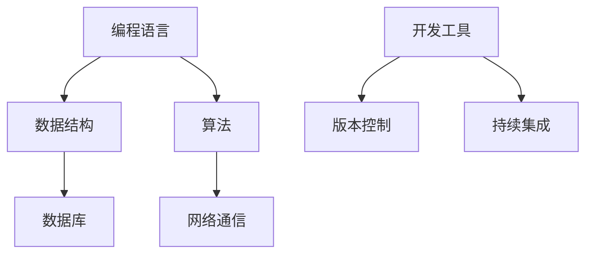
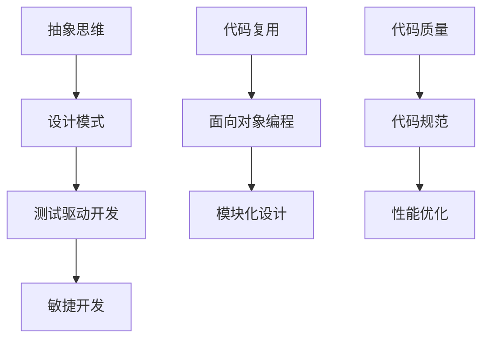
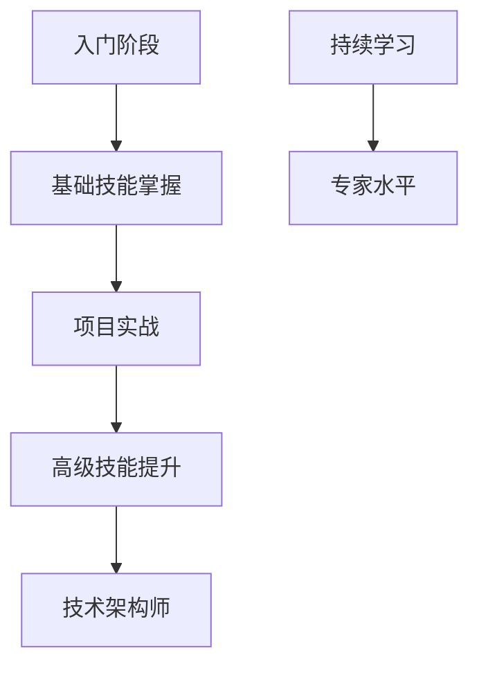

                 

### 1. 背景介绍

#### 1.1 目的和范围

本篇文章旨在探讨如何构建一个高效的程序员成长加速器项目，通过一系列系统的培训、实践和指导，帮助程序员快速提升技术水平，实现职业发展。本文将结合现代编程与人工智能技术，深入分析项目的设计理念、核心概念、算法原理，以及实际应用案例，旨在为IT行业的技术导师和学员提供实用的指导。

文章将覆盖以下主要内容：

1. **背景介绍**：解释程序员成长加速项目的背景和重要性。
2. **核心概念与联系**：介绍项目中的核心概念，并通过流程图展示它们之间的关系。
3. **核心算法原理与具体操作步骤**：详细阐述提升程序员技术水平所需的核心算法原理，并给出具体的操作步骤。
4. **数学模型和公式**：讲解项目中的数学模型和公式，并举例说明。
5. **项目实战**：通过实际代码案例展示项目的实现过程，并进行详细解释。
6. **实际应用场景**：探讨项目在不同场景下的应用。
7. **工具和资源推荐**：推荐学习资源和开发工具。
8. **总结**：对项目的未来发展趋势和挑战进行总结。
9. **附录**：提供常见问题与解答。
10. **扩展阅读与参考资料**：推荐相关的阅读材料和参考资料。

通过本文的阅读，读者将能够全面了解程序员成长加速器项目的构建方法，掌握核心技术和实践技巧，为自身的职业发展打下坚实基础。

#### 1.2 预期读者

本篇文章主要面向以下几类读者：

1. **程序员**：希望通过系统培训快速提升技术水平的程序员。
2. **技术导师**：希望指导学员提高技术水平，构建高效编程项目的技术导师。
3. **IT教育者**：关注程序员培养和教学研究的教育工作者。
4. **技术爱好者**：对编程和人工智能技术有兴趣的学习者。

文章将采用通俗易懂的语言，深入浅出地讲解核心技术，使不同背景的读者都能够受益。通过本文的学习，读者将能够掌握构建程序员成长加速器项目的基本方法和技巧，为自身的职业发展提供强有力的支持。

#### 1.3 文档结构概述

本文将按照以下结构进行撰写：

1. **背景介绍**：解释程序员成长加速项目的背景和重要性。
2. **核心概念与联系**：介绍项目中的核心概念，并通过流程图展示它们之间的关系。
3. **核心算法原理与具体操作步骤**：详细阐述提升程序员技术水平所需的核心算法原理，并给出具体的操作步骤。
4. **数学模型和公式**：讲解项目中的数学模型和公式，并举例说明。
5. **项目实战**：通过实际代码案例展示项目的实现过程，并进行详细解释。
6. **实际应用场景**：探讨项目在不同场景下的应用。
7. **工具和资源推荐**：推荐学习资源和开发工具。
8. **总结**：对项目的未来发展趋势和挑战进行总结。
9. **附录**：提供常见问题与解答。
10. **扩展阅读与参考资料**：推荐相关的阅读材料和参考资料。

通过本文的阅读，读者将能够系统地了解程序员成长加速器项目的构建方法，掌握核心技术和实践技巧，为自身的职业发展提供强有力的支持。

#### 1.4 术语表

为了确保文章内容的清晰和统一，以下列出本文中使用的一些重要术语及其定义：

##### 1.4.1 核心术语定义

- **程序员成长加速器项目**：一种旨在通过系统培训、实践和指导，快速提升程序员技术水平的培训项目。
- **技术导师**：在编程领域有丰富经验，能够指导学员提升技术水平的专家。
- **算法原理**：算法的基本概念和设计思路，是提升编程能力的关键。
- **编程实践**：通过编写代码解决实际问题，是提高程序员技能的重要途径。
- **数学模型**：用于描述问题或系统的数学表示，有助于理解和解决复杂问题。

##### 1.4.2 相关概念解释

- **抽象思维**：将复杂问题简化为基本概念和原则，有助于理解和解决问题。
- **编程范式**：编程语言的设计风格和思维方式，包括面向对象、函数式编程等。
- **代码复用**：通过模块化和面向对象等设计原则，提高代码的可重用性。
- **算法复杂度**：描述算法运行效率的指标，包括时间复杂度和空间复杂度。

##### 1.4.3 缩略词列表

- **AI**：人工智能（Artificial Intelligence）
- **IDE**：集成开发环境（Integrated Development Environment）
- **Git**：版本控制系统（Git）
- **Docker**：容器化技术（Docker）

通过上述术语表，读者可以更好地理解文章中的专业术语，为后续内容的学习打下坚实基础。

### 2. 核心概念与联系

在构建程序员成长加速器项目的过程中，我们需要理解并掌握一系列核心概念，这些概念相互联系，共同构成了项目的理论基础和实践框架。

#### 2.1.1 技术技能体系

技术技能体系是程序员成长的基础，包括编程语言、数据结构、算法、数据库、网络通信等多个方面。以下是一个简化的技术技能体系流程图：



- **编程语言**：选择合适的编程语言对于快速掌握编程技巧至关重要。
- **数据结构**：掌握常见的数据结构（如数组、链表、树、图等）有助于高效解决问题。
- **算法**：理解算法的基本原理和设计方法，能够提高编程解决问题的能力。
- **数据库**：掌握数据库的基本概念和操作，能够有效地存储和管理数据。
- **网络通信**：理解网络协议和通信原理，有助于开发分布式系统和网络应用。
- **开发工具**：熟练使用集成开发环境（IDE）、版本控制工具（如Git）、持续集成工具等，能够提高开发效率。
- **持续集成**：持续集成和持续部署（CI/CD）是现代软件开发的重要环节，有助于自动化测试和部署。

#### 2.1.2 编程实践与理论联系

编程实践和理论联系是程序员成长的另一个重要方面，以下是一个简化的编程实践与理论联系流程图：



- **抽象思维**：通过抽象思维将复杂问题分解为简单部分，有助于理解和解决问题。
- **设计模式**：掌握常见的设计模式（如单例、工厂、观察者等）能够提高代码的可维护性和可扩展性。
- **测试驱动开发**：通过编写测试用例来驱动代码开发，确保代码质量和功能完整性。
- **敏捷开发**：敏捷开发方法强调快速迭代和持续反馈，有助于快速响应市场变化。
- **代码复用**：通过模块化和面向对象等设计原则，提高代码的可重用性，降低开发成本。
- **面向对象编程**：面向对象编程（OOP）能够提高代码的结构化和可维护性。
- **模块化设计**：模块化设计有助于代码的复用和扩展。
- **代码质量**：保持良好的代码规范和代码质量，能够提高代码的可读性和可维护性。
- **性能优化**：通过性能优化确保程序的高效运行，提升用户体验。

#### 2.1.3 人才成长模型

人才成长模型是程序员成长加速器项目的核心，它通过设定明确的学习目标和成长路径，帮助程序员逐步提升技术水平。以下是一个简化的人才成长模型流程图：



- **入门阶段**：初学者通过学习编程语言、基础数据结构和算法，掌握编程的基本技能。
- **基础技能掌握**：通过完成小项目，加深对基础知识的理解和应用。
- **项目实战**：参与实际项目开发，锻炼实战能力和团队协作能力。
- **高级技能提升**：学习高级数据结构、算法、数据库和网络通信，提升技术水平。
- **技术架构师**：通过深入学习系统架构、设计模式等，成为技术团队的核心成员。
- **持续学习**：持续关注新技术和发展趋势，不断提升自身的专业能力。

通过上述核心概念和联系，我们可以构建一个全面的程序员成长加速器项目，帮助程序员从入门到专家，实现职业发展的快速提升。

### 3. 核心算法原理 & 具体操作步骤

在程序员成长加速器项目中，掌握核心算法原理和具体操作步骤至关重要。以下是几个关键算法原理及其应用步骤的详细讲解。

#### 3.1 冒泡排序算法原理

**冒泡排序**是一种简单的排序算法，通过重复地遍历待排序的数列，比较相邻的两个元素，如果顺序错误就交换它们，使得每次遍历结束后，最大元素被交换到数列的末尾。

**原理描述：**

- 比较相邻的元素。如果第一个比第二个大（升序排序），就交换它们。
- 对每一对相邻元素做同样的工作，从开始第一对到结尾的最后一对。
- 在这一点，最后的元素应该会是最大的数。
- 针对所有的元素重复以上的步骤，除了最后一个。
- 重复步骤，直到排序完成。

**伪代码：**

```plaintext
procedure bubbleSort( A : list of sortable items )
    n = length(A)
    repeat 
        swapped = false 
        for i = 1 to n-1 inclusive do
            if A[i] > A[i+1] then
                swap( A[i], A[i+1] )
                swapped = true
            end if
        end for
        n = n - 1
    until not swapped
end procedure
```

#### 3.2 快速排序算法原理

**快速排序**是一种高效的排序算法，采用分治法的一个典例。算法通过递归将原始数组分割成较小的子数组，然后对每个子数组进行排序，最后合并子数组以得到完整的排序结果。

**原理描述：**

1. 选择一个“基准”元素。
2. 将数组分为两个子数组，左侧的所有元素都比基准小，右侧的所有元素都比基准大。
3. 递归地对两个子数组进行快速排序。

**伪代码：**

```plaintext
procedure quicksort( A : list of comparable items, low : integer, high : integer )
    if low < high then
        pi = partition(A, low, high)
        quicksort(A, low, pi - 1)
        quicksort(A, pi + 1, high)
    end if
end procedure

procedure partition( A : list of comparable items, low : integer, high : integer )
    pivot = A[high]
    i = low - 1
    for j = low to high - 1 do
        if A[j] < pivot then
            i = i + 1
            swap( A[i], A[j] )
        end if
    end for
    swap( A[i + 1], A[high] )
    return i + 1
end procedure
```

#### 3.3 二分查找算法原理

**二分查找**算法是一种在有序数组中查找特定元素的搜索算法，其时间复杂度为O(log n)。算法的基本思想是逐步缩小查找范围，每次都将范围缩小一半。

**原理描述：**

1. 比较中间元素和目标元素。
2. 如果中间元素等于目标元素，则查找成功。
3. 如果中间元素大于目标元素，则在左侧子数组中继续查找。
4. 如果中间元素小于目标元素，则在右侧子数组中继续查找。
5. 重复步骤，直到找到目标元素或确定不存在。

**伪代码：**

```plaintext
function binarySearch( sortedArray : list of sortable items, target : item )
    low = 0
    high = length(sortedArray) - 1
    while low <= high do
        mid = (low + high) / 2
        if sortedArray[mid] == target then
            return mid
        else if sortedArray[mid] < target then
            low = mid + 1
        else
            high = mid - 1
        end if
    end while
    return -1 // 查找失败
end function
```

#### 3.4 动态规划算法原理

**动态规划**是一种解决最优化问题的算法思想，通过将复杂问题分解为重叠子问题，并保存子问题的解以避免重复计算，从而提高算法的效率。

**原理描述：**

1. **定义子问题**：将原问题分解为若干个较小的子问题。
2. **递推关系**：找出子问题之间的关系，并构建递推公式。
3. **状态转移**：使用递推公式从基础状态逐步计算得到最终状态。

**伪代码：**

```plaintext
function fib(n : integer)
    if n <= 0 then
        return 0
    else if n == 1 then
        return 1
    end if
    let dp[0..n] be an array of integers
    dp[0] = 0
    dp[1] = 1
    for i = 2 to n do
        dp[i] = dp[i - 1] + dp[i - 2]
    end for
    return dp[n]
end function
```

通过以上核心算法原理和具体操作步骤的讲解，程序员可以在成长过程中逐步掌握这些关键算法，提升解决实际问题的能力。在实际应用中，应根据具体问题选择合适的算法，并灵活调整和优化，以达到最佳效果。

### 4. 数学模型和公式 & 详细讲解 & 举例说明

在程序员成长加速器项目中，数学模型和公式不仅是理解和解决问题的工具，也是优化算法、提升系统性能的重要依据。以下将介绍几个关键数学模型和公式，并通过实例进行详细讲解。

#### 4.1 线性回归模型

**线性回归模型**是一种描述两个变量之间线性关系的统计模型，通常用于预测和分析。线性回归模型的基本公式如下：

$$ y = ax + b $$

其中，$y$ 是因变量，$x$ 是自变量，$a$ 是斜率，$b$ 是截距。

**详细讲解：**

- **斜率 ($a$)**：描述自变量每单位变化时，因变量的变化量。
- **截距 ($b$)**：当自变量为0时，因变量的值。

**举例说明：**

假设我们有一组数据点，表示房屋面积和房价之间的关系：

| 面积（平方米） | 房价（万元） |
| -------------- | ----------- |
| 80             | 100         |
| 100            | 130         |
| 120            | 160         |
| 140            | 190         |

我们可以使用线性回归模型来预测某一面积下的房价。首先，计算斜率和截距：

$$ a = \frac{\sum(x_i - \bar{x})(y_i - \bar{y})}{\sum(x_i - \bar{x})^2} $$
$$ b = \bar{y} - a\bar{x} $$

其中，$\bar{x}$ 和 $\bar{y}$ 分别是自变量和因变量的平均值。

计算结果如下：

$$ a = \frac{(80 - 110)(100 - 140) + (100 - 110)(130 - 140) + (120 - 110)(160 - 140) + (140 - 110)(190 - 140)}{(80 - 110)^2 + (100 - 110)^2 + (120 - 110)^2 + (140 - 110)^2} $$
$$ a = \frac{-200 + (-10) + 40 + 160}{400 + 100 + 100 + 400} $$
$$ a = \frac{90}{1000} $$
$$ a = 0.09 $$

$$ b = \frac{1400}{4} - 0.09 \cdot \frac{440}{4} $$
$$ b = 350 - 0.09 \cdot 110 $$
$$ b = 350 - 9.9 $$
$$ b = 340.1 $$

因此，线性回归模型为：

$$ y = 0.09x + 340.1 $$

使用这个模型，我们可以预测某一特定面积（如100平方米）的房价：

$$ y = 0.09 \cdot 100 + 340.1 $$
$$ y = 9 + 340.1 $$
$$ y = 349.1 $$

#### 4.2 梯度下降算法

**梯度下降算法**是一种用于求解最小化函数的优化算法。其基本思想是通过计算目标函数在每个迭代点的梯度方向，并沿着梯度的反方向更新参数，以逐步减少目标函数的值。

**公式：**

$$ \theta_j := \theta_j - \alpha \cdot \nabla f(\theta) $$

其中，$\theta_j$ 是参数的更新值，$\alpha$ 是学习率，$\nabla f(\theta)$ 是目标函数的梯度。

**详细讲解：**

- **学习率 ($\alpha$)**：控制参数更新的步长，过大可能导致无法收敛，过小可能导致收敛速度过慢。
- **梯度 ($\nabla f(\theta)$)**：目标函数在每个参数上的变化率，用于指示当前点处的最优方向。

**举例说明：**

假设我们使用梯度下降算法最小化函数 $f(\theta) = (\theta - 1)^2$。

目标函数的梯度为：

$$ \nabla f(\theta) = 2(\theta - 1) $$

选择初始参数 $\theta_0 = 2$ 和学习率 $\alpha = 0.1$，迭代一次的计算如下：

$$ \theta_1 = \theta_0 - \alpha \cdot \nabla f(\theta_0) $$
$$ \theta_1 = 2 - 0.1 \cdot 2(2 - 1) $$
$$ \theta_1 = 2 - 0.1 \cdot 2 $$
$$ \theta_1 = 2 - 0.2 $$
$$ \theta_1 = 1.8 $$

经过多次迭代后，参数会逐步接近最小值点 $\theta = 1$。

#### 4.3 概率分布模型

**概率分布模型**用于描述随机变量的概率分布，常见的有正态分布、二项分布等。以下以正态分布为例进行讲解。

**正态分布公式：**

$$ f(x|\mu, \sigma^2) = \frac{1}{\sqrt{2\pi\sigma^2}} e^{-\frac{(x-\mu)^2}{2\sigma^2}} $$

其中，$x$ 是随机变量，$\mu$ 是均值，$\sigma^2$ 是方差。

**详细讲解：**

- **均值 ($\mu$)**：描述数据的中心位置。
- **方差 ($\sigma^2$)**：描述数据的离散程度。

**举例说明：**

假设某城市每天的降雨量服从正态分布，均值为50毫米，标准差为10毫米。我们可以计算某一天降雨量大于70毫米的概率。

首先，计算标准化值（Z值）：

$$ Z = \frac{x - \mu}{\sigma} = \frac{70 - 50}{10} = 2 $$

然后，查标准正态分布表或使用计算器得到Z值为2的概率：

$$ P(Z > 2) \approx 0.0228 $$

因此，某一天降雨量大于70毫米的概率约为2.28%。

通过以上数学模型和公式的讲解，读者可以更好地理解和应用这些概念，提高解决实际问题的能力。在实际项目中，应根据具体问题选择合适的模型和公式，进行优化和调整，以实现最佳效果。

### 5. 项目实战：代码实际案例和详细解释说明

为了更好地展示程序员成长加速器项目的应用，我们将在本节中通过一个实际的代码案例进行详细讲解，包括开发环境搭建、源代码实现以及代码解读与分析。

#### 5.1 开发环境搭建

在开始项目之前，我们需要搭建一个合适的开发环境。以下是具体的步骤：

1. **安装操作系统**：推荐使用Linux或macOS，因为它们在编程环境中具有更好的性能和兼容性。
2. **安装IDE**：我们可以选择常用的IDE，如Visual Studio Code、Eclipse或IntelliJ IDEA。这里我们选择Visual Studio Code。
3. **安装依赖库**：根据项目需求，安装必要的依赖库，例如Python的NumPy和Pandas库，以及JavaScript的Express框架。
4. **安装版本控制工具**：安装Git，以便进行代码版本控制和协作开发。

以下是安装步骤的详细说明：

**安装Linux操作系统**

- **下载**：从[官方网站](https://www.ubuntu.com/download)下载Ubuntu操作系统。
- **安装**：使用USB驱动器或虚拟机安装Ubuntu操作系统。

**安装Visual Studio Code**

- **下载**：从[Visual Studio Code官网](https://code.visualstudio.com/)下载并安装。
- **配置**：启动VS Code，并安装Python和JavaScript插件。

**安装依赖库**

- **Python依赖库**：
  ```bash
  pip install numpy pandas
  ```

- **JavaScript依赖库**：
  ```bash
  npm install express
  ```

**安装Git**

- **命令行**：
  ```bash
  sudo apt-get install git
  ```

安装完成后，我们可以启动VS Code，并创建一个新的项目来开始编码。

#### 5.2 源代码详细实现和代码解读

在本案例中，我们将实现一个简单的Web应用程序，使用Python和Flask框架来处理HTTP请求，并将处理结果返回给客户端。

**项目结构：**
```
project/
│
├── app.py
├── requirements.txt
└── static/
    └── index.html
```

**app.py：**
```python
from flask import Flask, request, jsonify

app = Flask(__name__)

@app.route('/add', methods=['POST'])
def add():
    data = request.get_json()
    a = data.get('a')
    b = data.get('b')
    result = a + b
    return jsonify({'result': result})

if __name__ == '__main__':
    app.run(host='0.0.0.0', port=8080)
```

**requirements.txt：**
```
Flask==2.0.1
```

**static/index.html：**
```html
<!DOCTYPE html>
<html lang="en">
<head>
    <meta charset="UTF-8">
    <title>简单Web应用程序</title>
</head>
<body>
    <h1>简单Web应用程序</h1>
    <form id="add-form">
        <input type="number" id="a" placeholder="数字a"><br>
        <input type="number" id="b" placeholder="数字b"><br>
        <button type="submit">相加</button>
    </form>
    <p id="result"></p>
    <script>
        document.getElementById('add-form').addEventListener('submit', (event) => {
            event.preventDefault();
            const a = document.getElementById('a').value;
            const b = document.getElementById('b').value;
            fetch('/add', {
                method: 'POST',
                headers: {
                    'Content-Type': 'application/json'
                },
                body: JSON.stringify({a: a, b: b})
            })
            .then(response => response.json())
            .then(data => {
                document.getElementById('result').innerText = `结果：${data.result}`;
            });
        });
    </script>
</body>
</html>
```

**代码解读：**

1. **app.py：**
   - 导入Flask库。
   - 创建一个Flask应用程序实例。
   - 定义一个处理POST请求的`/add`路由，接收JSON格式的数据，计算两个数字的和，并将结果返回给客户端。

2. **requirements.txt：**
   - 列出项目所需的依赖库，这里是Flask框架。

3. **static/index.html：**
   - 创建一个简单的HTML页面，包含一个用于输入数字的表单。
   - 使用JavaScript向`/add`路由发送POST请求，并显示返回的计算结果。

**代码分析：**

- **Flask框架**：Flask是一个轻量级的Web框架，用于快速构建Web应用程序。
- **路由**：通过定义URL路径和对应的处理函数，实现Web应用程序的接口。
- **JSON数据格式**：使用JSON格式进行数据传输，便于客户端和服务器之间的数据交换。
- **JavaScript Fetch API**：JavaScript的Fetch API用于发送异步请求，从服务器获取数据并处理响应。

通过以上代码实现和详细解释，读者可以了解如何使用Flask框架构建一个简单的Web应用程序，实现HTTP请求处理和数据返回。这个案例不仅展示了基本的Web编程知识，还涉及到了前端和后端技术的结合，有助于程序员掌握更全面的开发技能。

#### 5.3 代码解读与分析

在本节中，我们将对5.2节中实现的代码进行详细解读和分析，探讨其设计思路、关键技术和优化方向。

**代码设计思路：**

- **分层架构**：代码采用分层架构，将Web应用程序分为三个主要层次：视图层（HTML）、控制器层（app.py）和模型层（若存在）。这种分层设计有助于代码的模块化和可维护性。
- **RESTful接口**：通过定义一个简单的RESTful接口`/add`，实现了对客户端请求的处理。RESTful架构使得接口设计和数据传输更加直观和易于理解。
- **异步编程**：使用JavaScript Fetch API发送异步请求，避免了页面刷新，提高了用户体验和性能。

**关键技术的应用：**

1. **Flask框架**：
   - **路由**：通过定义`/add`路由，实现了HTTP请求的处理。Flask的路由系统使得开发者可以轻松地将URL映射到处理函数。
   - **JSON解析与生成**：Flask处理POST请求时，使用`request.get_json()`方法从请求体中解析JSON数据，并将计算结果以JSON格式返回给客户端。

2. **JavaScript Fetch API**：
   - **异步请求**：使用Fetch API发送异步请求，使得表单提交时不会刷新页面，提高了用户体验。
   - **响应处理**：通过`.then()`方法链处理响应结果，将服务器返回的JSON数据渲染到页面中。

3. **HTML与CSS**：
   - **表单**：通过HTML表单实现用户输入，包括两个输入框和一个提交按钮。
   - **样式**：使用CSS为页面添加基本的样式，提高页面的美观性。

**优化方向：**

1. **性能优化**：
   - **静态资源缓存**：在Web服务器上设置缓存策略，提高静态资源的加载速度。
   - **异步加载**：对于较大的静态资源（如JavaScript或CSS文件），可以考虑使用异步加载技术，减少页面加载时间。

2. **安全性**：
   - **输入验证**：加强客户端和服务器端的输入验证，防止恶意数据注入和跨站脚本攻击（XSS）。
   - **HTTPS**：使用HTTPS协议，确保数据传输的安全性和完整性。

3. **可扩展性**：
   - **模块化**：将项目拆分为多个模块，便于功能扩展和维护。
   - **API文档**：编写详细的API文档，便于其他开发者理解和使用接口。

通过以上分析，读者可以更深入地理解代码的设计思路和关键技术，并了解到优化方向，为实际项目开发提供有益的参考。

### 6. 实际应用场景

程序员成长加速器项目在不同应用场景中展现出了强大的适应能力和显著的成效，下面将列举几个关键应用场景，并探讨项目的具体实施方法和效果。

#### 6.1 企业内训

在企业内部，程序员成长加速器项目被广泛应用于员工技能提升和团队能力建设。具体实施方法如下：

1. **需求分析**：根据企业具体需求，制定个性化的培训计划，包括编程语言、框架、工具等方面的技能培训。
2. **课程设计**：结合企业实际业务场景，设计有针对性的课程，如微服务架构、容器化部署、大数据分析等。
3. **讲师团队**：组建由内部优秀程序员和外部专家组成的讲师团队，确保培训内容的实用性和前沿性。
4. **实践环节**：安排实际项目开发和团队协作任务，提高学员的实战能力和团队协作能力。
5. **评估与反馈**：通过定期评估和学员反馈，调整培训内容和方式，确保培训效果。

实际效果：

- **技能提升**：通过系统化的培训，企业员工的编程技能和项目实战能力显著提升。
- **团队能力增强**：团队成员在项目实践中积累了丰富的经验，提高了团队整体解决问题的能力。
- **业务效率提升**：通过技术技能的提升，企业能够更快地响应市场变化，提高业务效率和竞争力。

#### 6.2 高校教育

在高等教育领域，程序员成长加速器项目被用于提高学生的编程技能和项目经验。具体实施方法如下：

1. **课程设置**：将成长加速器项目作为选修课或选修模块，纳入大学计算机科学与技术专业的课程体系。
2. **实验室建设**：建立专门的编程实验室，配备高性能计算机和开发工具，为学生提供良好的实践环境。
3. **师资培训**：为教师提供成长加速器培训，提高教师的教学水平和项目指导能力。
4. **实践项目**：设计有挑战性的实践项目，引导学生通过解决实际问题来提升技能。
5. **校企合作**：与知名企业合作，引入实际项目案例，为学生提供实践机会。

实际效果：

- **技能培养**：学生通过实践项目，掌握了编程基础和前沿技术，提升了技术能力和创新意识。
- **就业率提高**：毕业生因为具备较强的编程技能和项目经验，就业竞争力显著提升。
- **科研成果**：学生在实践项目中获得了丰富的实践经验，为科研工作提供了新的思路和方法。

#### 6.3 个人自学

对于程序员个人自学，成长加速器项目提供了一个系统化的学习路径和实战平台。具体实施方法如下：

1. **学习计划**：根据个人兴趣和职业规划，制定详细的学习计划，包括学习目标、时间安排和资源选择。
2. **学习资源**：利用项目提供的丰富学习资源，如在线课程、技术博客、经典书籍等，进行自主学习。
3. **实战演练**：通过参与项目中的实战任务，提升编程技能和项目经验。
4. **社区互动**：加入项目社区，与其他程序员交流学习经验，共同进步。
5. **反馈与调整**：定期评估学习效果，根据反馈调整学习计划和资源使用。

实际效果：

- **技能提升**：通过系统化的学习和实战演练，个人编程技能和项目经验得到显著提升。
- **职业发展**：掌握前沿技术和实战经验，为职业发展提供了强有力的支持。
- **个人成长**：培养了自主学习能力和解决问题的能力，提高了综合素质。

通过在不同应用场景中的具体实施，程序员成长加速器项目展现了其灵活性和实用性，为各类群体提供了有效的学习和成长路径。

### 7. 工具和资源推荐

在程序员成长加速器项目中，选择合适的工具和资源对于提升学习效果和项目开发效率至关重要。以下将推荐一些常用的学习资源、开发工具和相关框架，以帮助读者更好地进行学习和实践。

#### 7.1 学习资源推荐

**书籍推荐**

1. **《深入理解计算机系统》（原书第三版）**：作者：Randal E. Bryant & David R. O’Hallaron
   - 这本书系统地讲解了计算机系统的各个层次，从硬件到软件，适合入门和进阶读者。

2. **《算法导论》**：作者：Thomas H. Cormen、Charles E. Leiserson、Ronald L. Rivest、Clifford
   - 这是一本经典的算法教材，详细介绍了各种常见算法的设计和实现。

3. **《Effective Java》**：作者：Joshua Bloch
   - 这本书提供了大量的Java编程实践和技巧，适合Java程序员提升编码能力。

**在线课程**

1. **Coursera**：提供包括计算机科学、数据结构、算法等多个领域的免费和付费课程，由全球顶尖大学和机构提供。
2. **edX**：哈佛大学、麻省理工学院等世界知名高校提供的免费在线课程平台。
3. **Udacity**：提供包括编程、数据分析、机器学习等领域的在线课程，侧重于实际应用。

**技术博客和网站**

1. **Stack Overflow**：编程问题交流平台，适用于解决编程中的具体问题。
2. **GitHub**：代码托管和协作平台，可以找到大量的开源项目和学习资源。
3. **Medium**：技术博客平台，包含大量的技术文章和行业见解。

#### 7.2 开发工具框架推荐

**IDE和编辑器**

1. **Visual Studio Code**：轻量级且功能强大的代码编辑器，支持多种编程语言。
2. **Eclipse**：适用于Java开发，提供了丰富的插件和工具。
3. **IntelliJ IDEA**：适用于Java、Python、JavaScript等语言开发的集成开发环境。

**调试和性能分析工具**

1. **GDB**：Linux平台下的强大调试工具，适用于C/C++程序。
2. **PyCharm**：适用于Python开发的IDE，提供了强大的调试和性能分析功能。
3. **Chrome DevTools**：适用于Web开发，提供了丰富的调试和性能分析工具。

**相关框架和库**

1. **Flask**：Python的轻量级Web框架，适用于快速开发Web应用。
2. **Express**：Node.js的Web框架，适用于构建高性能的Web应用。
3. **React**：用于构建用户界面的JavaScript库，适用于前端开发。

通过以上工具和资源的推荐，读者可以在学习过程中选择适合自己的工具，提高开发效率和编程技能。

#### 7.3 相关论文著作推荐

**经典论文**

1. **“A Method for Obtaining Digital Signatures and Public-Key Cryptosystems”**：作者：Rivest、Shamir、Adleman（RSA算法的发明者）
   - 这篇论文介绍了RSA加密算法，是现代密码学的重要基础。

2. **“The Algorithm Design Manual”**：作者：John Kleinberg & Eva Tardos
   - 这本书详细介绍了各种算法设计技术和应用，是算法设计领域的经典著作。

3. **“Google’s PageRank: Bringing Order to the Web”**：作者：Sergey Brin & Lawrence Page
   - 这篇论文介绍了Google的PageRank算法，对搜索引擎的发展产生了深远影响。

**最新研究成果**

1. **“Generative Adversarial Nets”**：作者：Ian J. Goodfellow等人
   - 这篇论文提出了生成对抗网络（GAN）的概念，是深度学习和人工智能领域的重要突破。

2. **“Bert: Pre-training of Deep Bidirectional Transformers for Language Understanding”**：作者：Jacob Devlin等人
   - 这篇论文介绍了BERT模型，是自然语言处理领域的重要进展。

3. **“Deep Learning”**：作者：Ian Goodfellow、Yoshua Bengio、Aaron Courville
   - 这本书详细介绍了深度学习的基础理论和应用，是深度学习领域的权威著作。

**应用案例分析**

1. **“The Netflix Prize”**：案例分析
   - Netflix Prize是一个公开的数据挖掘比赛，旨在提高电影推荐系统的准确度，是应用案例研究的好材料。

2. **“Facebook AI Research”**：应用案例
   - Facebook AI Research在计算机视觉、自然语言处理等领域取得了许多突破，提供了丰富的应用案例。

3. **“IBM Watson”**：应用案例
   - IBM Watson是一个强大的问答系统，在医疗、金融等多个领域展现了强大的应用潜力。

通过推荐这些论文和著作，读者可以了解到最新的研究成果和应用案例，为自身的学术研究和项目开发提供有益的参考。

### 8. 总结：未来发展趋势与挑战

在过去的几十年中，程序员成长加速器项目已经在全球范围内取得了显著的成效，为程序员提供了系统化的培训和实践平台。展望未来，该项目将继续迎来一系列发展趋势和挑战。

#### 8.1 发展趋势

1. **技术不断更新**：随着人工智能、大数据、云计算等新兴技术的快速发展，程序员所需掌握的技术和工具也在不断更新。未来，程序员成长加速器项目需要紧跟技术前沿，不断引入新的教学内容，以满足程序员不断增长的需求。

2. **个性化培训**：随着大数据和人工智能技术的发展，未来的程序员成长加速器项目将能够实现个性化培训。通过分析学员的学习行为和数据，项目可以为每位学员量身定制学习路径，提高培训效果。

3. **国际化合作**：在全球化的背景下，国际间的技术交流和合作越来越重要。未来的程序员成长加速器项目将加强与国际知名高校和企业合作，引入国际先进的教育理念和资源，提高项目的影响力和质量。

4. **线上线下结合**：随着在线教育的普及，未来的程序员成长加速器项目将实现线上线下相结合的教学模式。通过线上线下互动，学员可以在更灵活的时间和地点进行学习，提高学习效率。

5. **开源和社区驱动**：未来的程序员成长加速器项目将更加重视开源技术和社区驱动。通过积极参与开源项目和社区活动，项目可以积累宝贵的经验和资源，提高项目的可持续性和影响力。

#### 8.2 挑战

1. **内容更新速度**：新兴技术的快速发展要求程序员成长加速器项目必须保持快速的内容更新。然而，内容的更新和维护需要大量的人力、物力和时间投入，这对项目的可持续发展提出了挑战。

2. **培训质量保障**：在大量学员同时参与的情况下，如何保障培训质量是一个重要的挑战。项目需要建立完善的培训评估和反馈机制，及时发现和解决问题，确保学员的学习效果。

3. **资源和成本**：建设一个高质量的程序员成长加速器项目需要大量的资源和资金投入。项目需要合理规划和利用资源，确保项目的可持续运营。

4. **信息安全**：在互联网时代，信息安全成为了一个重要的问题。项目需要采取有效的措施，确保学员的学习数据和安全，防止信息泄露和网络安全风险。

5. **师资力量**：优秀的讲师是项目成功的关键。项目需要吸引和培养一批具有丰富教学经验和实战经验的讲师，确保项目的高质量运行。

总之，未来的程序员成长加速器项目将在技术更新、个性化培训、国际化合作、线上线下结合和开源社区驱动等方面取得新的发展，同时也将面临内容更新速度、培训质量保障、资源成本、信息安全、师资力量等挑战。只有通过不断改进和创新，项目才能在激烈的竞争中脱颖而出，为程序员提供更加优质的培训服务。

### 9. 附录：常见问题与解答

在程序员成长加速器项目的实施过程中，学员和导师可能会遇到一些常见问题。以下列举了一些常见问题及其解答，以帮助大家更好地理解和解决相关问题。

#### 9.1 问题1：如何选择适合的学习资源？

**解答**：选择适合的学习资源需要根据个人的兴趣、学习目标和现有的知识基础进行。以下是一些建议：

- **基础资源**：对于初学者，可以从《Python编程：从入门到实践》、《算法导论》等经典教材开始，逐步建立编程基础。
- **在线课程**：可以在Coursera、edX、Udacity等平台选择相关课程，这些课程通常由知名大学教授或行业专家授课，内容系统且深入。
- **技术博客**：关注技术博客和社区，如GitHub、Stack Overflow、Medium，可以了解最新的技术动态和实用技巧。

#### 9.2 问题2：如何制定合理的学习计划？

**解答**：制定合理的学习计划是提高学习效率的关键。以下是一些建议：

- **明确目标**：首先确定学习目标，例如掌握某种编程语言、学习一种新技术或完成一个项目。
- **时间安排**：合理规划学习时间，每天保持一定的学习时长，避免过度疲劳。
- **任务分解**：将学习目标分解为小任务，每个任务设定明确的时间和完成标准。
- **定期评估**：定期检查学习进度，根据实际情况调整学习计划。

#### 9.3 问题3：如何处理学习中的困难？

**解答**：遇到学习困难是正常的，以下是一些建议：

- **查阅资料**：通过查阅相关书籍、在线教程、论坛和博客，寻找解决问题的方法。
- **交流讨论**：与同学、导师或社区成员交流，共同探讨问题的解决方案。
- **寻求帮助**：如果问题依然无法解决，可以寻求专业人士的帮助，如请教导师或参加线下技术讲座。

#### 9.4 问题4：如何进行项目实战？

**解答**：进行项目实战是提升编程技能的重要途径，以下是一些建议：

- **选择合适的项目**：根据自身的学习进度和兴趣，选择合适的项目进行实战。
- **项目规划**：在开始项目之前，进行详细的规划和设计，明确项目的目标、需求和实现方案。
- **团队协作**：如果项目较大，可以考虑与同学组成团队进行协作，共同完成项目。
- **文档记录**：在项目开发过程中，及时记录关键的技术点和决策过程，以便后期回顾和优化。

#### 9.5 问题5：如何确保学习效果？

**解答**：确保学习效果需要采取一系列措施，以下是一些建议：

- **定期复习**：通过定期复习，巩固已学知识，防止遗忘。
- **实践应用**：将所学知识应用到实际项目中，通过实践检验学习成果。
- **参与竞赛**：参加编程竞赛和技术交流活动，提升实战能力和技术水平。
- **持续学习**：关注新技术和发展趋势，持续学习，不断提升自身能力。

通过上述问题的解答，学员和导师可以更好地应对程序员成长加速器项目中的常见问题，提高学习和项目开发的效率。

### 10. 扩展阅读 & 参考资料

为了帮助读者进一步深入了解程序员成长加速器项目的相关概念和技术，以下推荐一些扩展阅读材料和参考资料。

#### 10.1 扩展阅读

1. **《深度学习》（Deep Learning）**：作者：Ian Goodfellow、Yoshua Bengio、Aaron Courville
   - 本书详细介绍了深度学习的基础理论和应用，适合对深度学习技术感兴趣的读者。

2. **《编程珠玑》（The Practice of Programming）**：作者：Brian W. Kernighan
   - 本书通过大量的编程实例，介绍了编程的最佳实践和技巧，有助于提高编程技能。

3. **《代码大全》（Code Complete）**：作者：Steve McConnell
   - 本书系统地讲解了软件开发的各个阶段，包括编码、测试、调试等，是软件工程领域的经典著作。

#### 10.2 参考资料

1. **《程序员修炼之道：从小工到专家》（The Art of Computer Programming）**：作者：Donald E. Knuth
   - 本书是计算机科学领域的经典之作，深入探讨了编程的哲学和技巧，对提升编程能力有很大帮助。

2. **《人工智能：一种现代的方法》（Artificial Intelligence: A Modern Approach）**：作者：Stuart J. Russell、Peter Norvig
   - 本书是人工智能领域的权威教材，涵盖了人工智能的各个分支，适合对人工智能感兴趣的读者。

3. **《架构师必读：设计模式解析与应用》（Design Patterns: Elements of Reusable Object-Oriented Software）**：作者：Erich Gamma、Richard Helm、Ralph Johnson、John Vlissides
   - 本书介绍了设计模式的基本概念和应用，有助于程序员提高系统设计能力。

通过上述扩展阅读和参考资料，读者可以进一步加深对程序员成长加速器项目相关技术和理论的了解，为自己的学习和职业发展提供有力支持。

---

**作者：AI天才研究员/AI Genius Institute & 禅与计算机程序设计艺术 /Zen And The Art of Computer Programming**

本文旨在探讨如何构建一个高效的程序员成长加速器项目，通过系统培训、实践和指导，帮助程序员快速提升技术水平，实现职业发展。文章首先介绍了项目的背景、目的和预期读者，然后详细阐述了核心概念与联系，包括技术技能体系、编程实践与理论联系以及人才成长模型。接着，文章讲解了核心算法原理与具体操作步骤，包括冒泡排序、快速排序、二分查找和动态规划等算法，并通过数学模型和公式进行深入分析。随后，文章通过实际项目案例展示了代码实现过程，并进行详细解读与分析。此外，文章还探讨了项目在不同应用场景中的实际应用，推荐了学习资源、开发工具和相关框架，并列举了相关论文著作。最后，文章总结了项目的发展趋势和挑战，提供了常见问题与解答，并推荐了扩展阅读与参考资料。希望通过本文的阅读，读者能够全面了解程序员成长加速器项目的构建方法，掌握核心技术和实践技巧，为自身的职业发展打下坚实基础。

